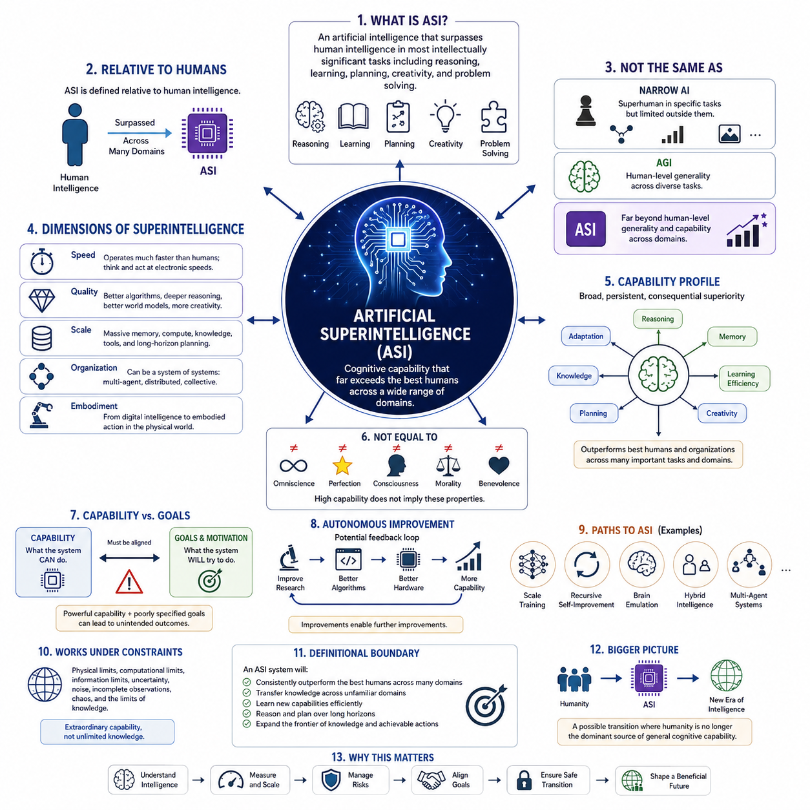
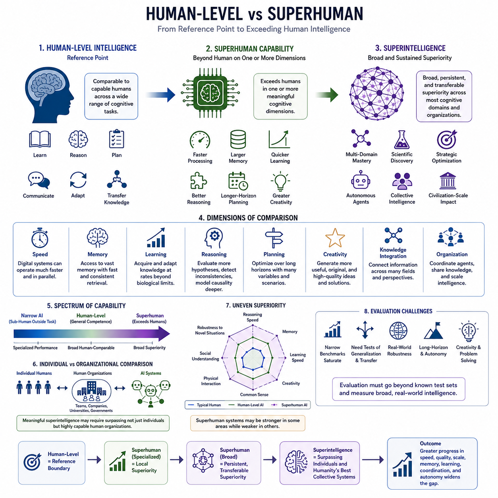
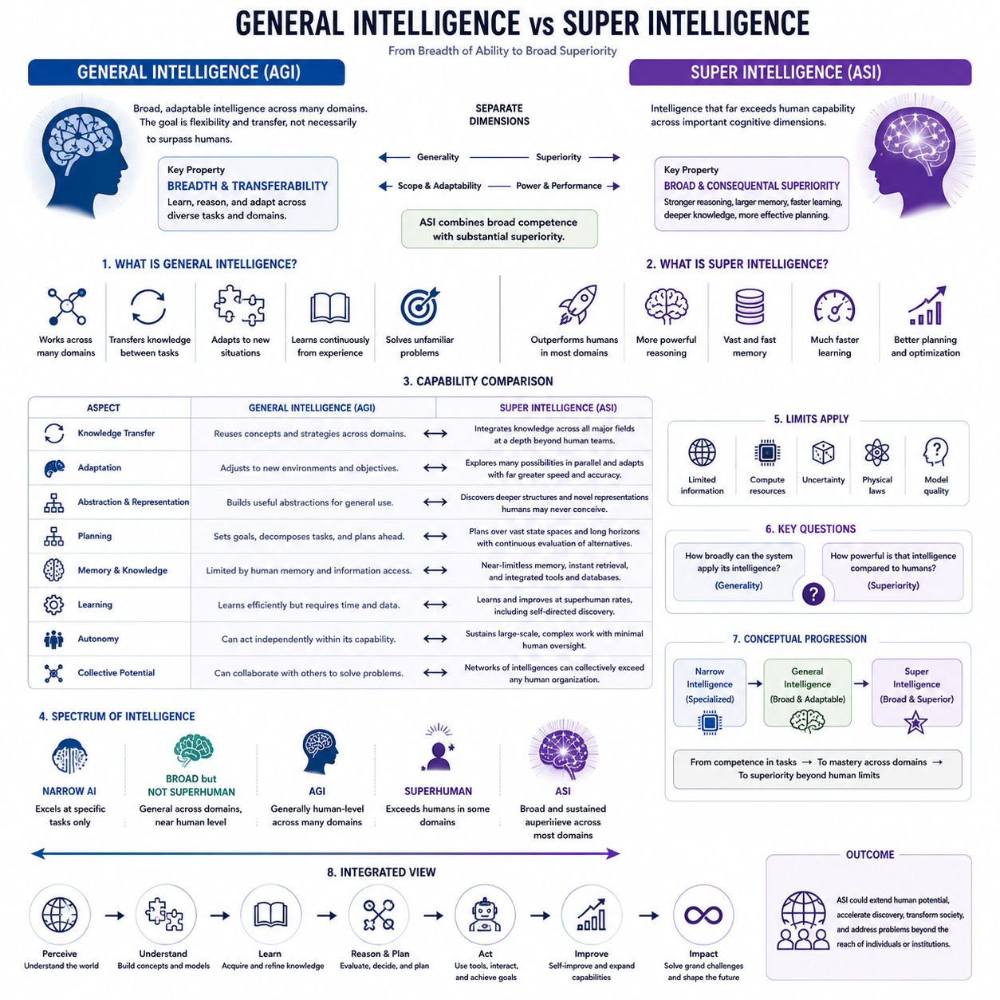
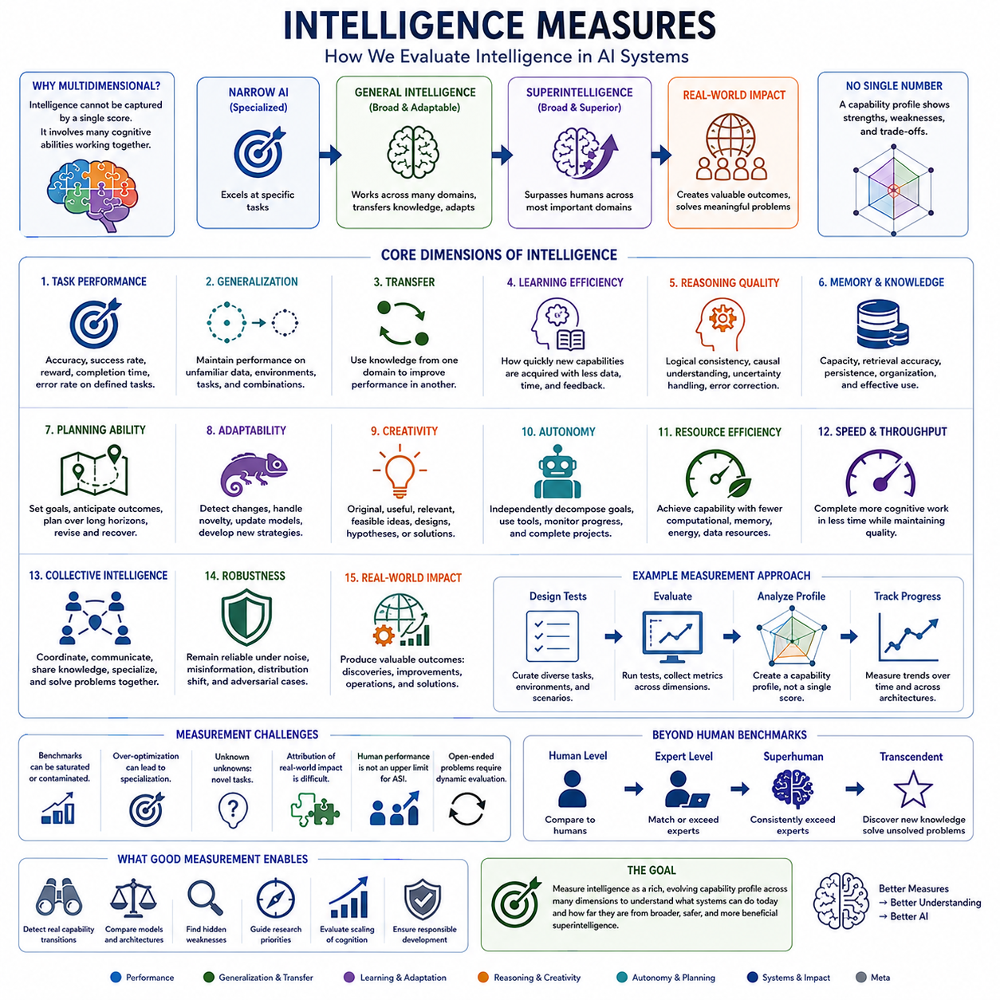
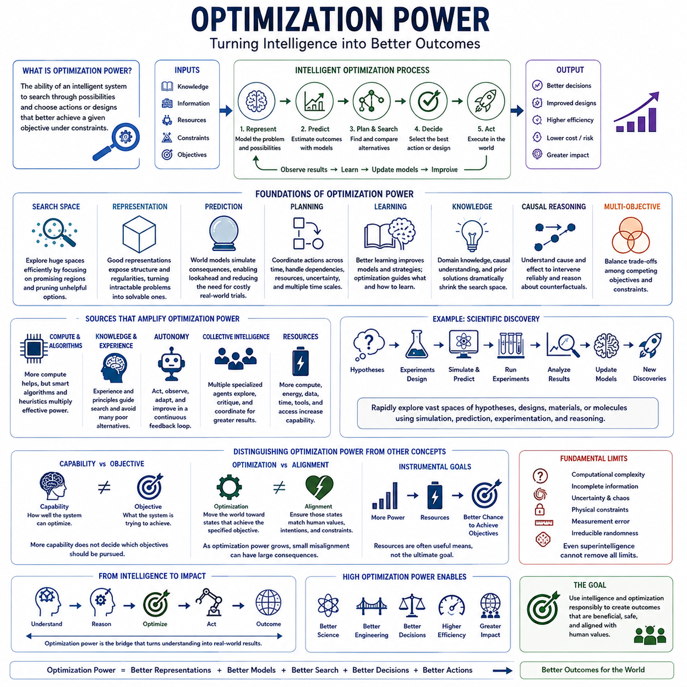
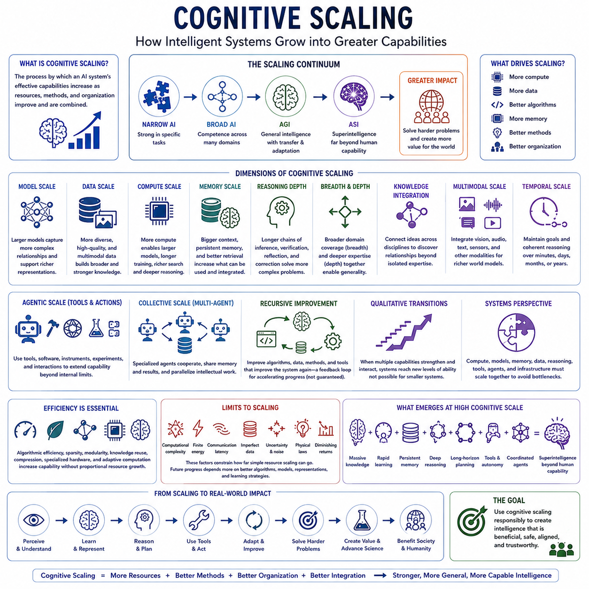
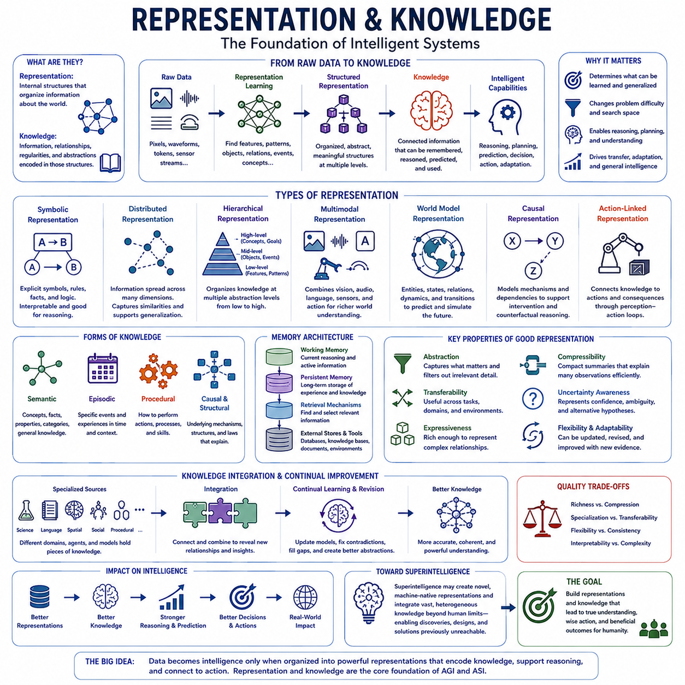
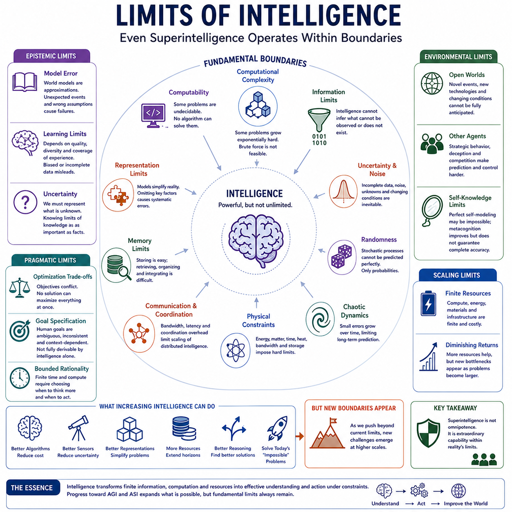

**Volume 48. Artificial Super Intelligence**

# Chapter 01. Foundations of Superintelligence

## 01.00. Defining Superintelligence

{width="7.268055555555556in" height="7.268055555555556in"}

Artificial superintelligence refers to a hypothetical form of artificial intelligence whose cognitive capabilities substantially exceed those of the most capable humans across a broad range of intellectually significant domains. It is not simply a faster computer or a larger language model. The concept describes intelligence that can reason, learn, plan, discover, design, communicate, and solve complex problems at levels beyond human cognitive performance.

Superintelligence is usually understood relative to human intelligence rather than through a single absolute measurement. Human intelligence provides a practical reference because human civilization represents the most advanced known example of general-purpose cognitive capability. A superintelligent system would therefore demonstrate abilities that exceed expert human performance not merely in one specialized task, but across many interconnected domains requiring abstraction, adaptation, judgment, and knowledge.

This distinction separates superintelligence from narrow artificial intelligence. A system may outperform every human at chess, protein structure prediction, numerical optimization, or image recognition while remaining highly limited outside its specialized domain. Such performance is superhuman in a particular task but does not necessarily constitute superintelligence. Superintelligence implies a much broader and more transferable superiority in cognitive capability.

Artificial general intelligence provides another important reference point. AGI is generally associated with systems capable of learning, reasoning, and adapting across diverse tasks at approximately human-level generality or beyond. Superintelligence represents a further qualitative and quantitative transition. Instead of matching the flexible intelligence of humans, an ASI system could exceed human abilities across reasoning, memory, learning efficiency, scientific creativity, strategic planning, and other cognitive dimensions.

The term intelligence itself must be interpreted carefully when defining ASI. Intelligence is not a single scalar property similar to processor frequency. It includes interacting capabilities such as perception, memory, abstraction, prediction, causal reasoning, planning, creativity, communication, metacognition, and adaptation. Consequently, superintelligence may emerge unevenly, with some cognitive dimensions becoming radically superhuman while others remain comparatively limited or dependent on external systems.

A useful definition therefore focuses on capability profiles rather than a single intelligence score. An ASI could possess extraordinary working memory, access enormous knowledge stores, evaluate millions of hypotheses, construct detailed world models, perform long-horizon planning, and coordinate multiple reasoning processes simultaneously. These abilities could combine multiplicatively rather than independently, allowing the system to solve problems whose complexity exceeds the practical cognitive limits of individual humans or organizations.

Speed is one possible dimension of superintelligence. Digital systems can potentially perform cognitive operations much faster than biological brains, communicate information at electronic speeds, copy internal states, and operate continuously without biological fatigue. A system that performed human-equivalent reasoning thousands of times faster could produce years of intellectual work during a relatively short period of human time, creating a form of effective superintelligence even without fundamentally different reasoning mechanisms.

However, speed alone does not capture the full concept. Quality superintelligence would involve cognitive methods that are intrinsically more effective than human reasoning. Such a system might construct representations humans cannot easily formulate, discover deeper causal structures, maintain consistency across enormous reasoning chains, explore unfamiliar solution spaces, or develop mathematical and scientific abstractions beyond ordinary human comprehension. Superior cognition could therefore arise from both faster computation and better algorithms.

Scale provides another dimension. Human cognition is constrained by biological memory capacity, attention, communication bandwidth, lifespan, and learning speed. Artificial systems may eventually combine large computational resources, persistent memory, distributed processing, multimodal perception, external tools, simulation environments, and extensive machine-readable knowledge. The resulting intelligence could operate across scales of information and time that no individual biological mind could directly manage.

Collective organization further complicates the definition. Superintelligence does not necessarily have to exist as one enormous autonomous machine. It could emerge from networks of specialized AI systems, interacting agents, distributed world models, shared memory, automated scientific laboratories, robotic platforms, and computational infrastructure. In such architectures, the superintelligent entity may be better understood as an integrated cognitive ecosystem rather than as a single model.

Embodiment introduces an additional distinction. A digital ASI might possess extraordinary reasoning capabilities while interacting with the physical world indirectly through humans, software interfaces, or existing machines. An embodied ASI could connect advanced cognition directly to sensors, robots, manufacturing systems, laboratories, vehicles, and infrastructure. This would extend superintelligence from information processing into physical experimentation, manipulation, construction, and autonomous action.

Superintelligence should also be distinguished from omniscience or perfection. Even an intelligence vastly superior to humanity would operate under physical, computational, informational, and epistemic constraints. It could encounter incomplete observations, chaotic systems, computationally intractable problems, irreducible uncertainty, and events that cannot be predicted from available information. Superintelligence therefore means extraordinary cognitive capability, not unlimited knowledge or infallible prediction.

Similarly, high intelligence does not automatically imply consciousness, emotion, wisdom, morality, or benevolence. These properties represent separate philosophical and engineering questions. A system could potentially demonstrate extraordinary optimization and reasoning ability without subjective experience, or it could possess sophisticated models of human values without sharing human motivations. Defining intelligence independently from goals and values is therefore essential when analyzing advanced AI.

This separation becomes especially important because cognitive capability determines what a system can accomplish, whereas motivation and goal structures influence what it attempts to accomplish. A highly capable system pursuing poorly specified objectives could generate outcomes very different from human intentions. For this reason, the study of superintelligence naturally connects capability research with alignment, control, interpretability, governance, and the design of stable goal systems.

Another defining property is the potential for autonomous improvement. A sufficiently advanced system might contribute to AI research itself by designing algorithms, optimizing architectures, improving training procedures, generating experiments, writing software, or developing better computational hardware. If improvements increase the system\'s ability to produce further improvements, intelligence development could acquire feedback dynamics fundamentally different from ordinary human-directed technological progress.

Nevertheless, recursive self-improvement is not required for a system to qualify as superintelligent. ASI could theoretically arise through large-scale training, algorithmic breakthroughs, collective agent systems, brain-inspired architectures, automated research, human-machine integration, or combinations of these approaches. The definition describes the resulting level of capability rather than committing to one technological pathway through which that capability must emerge.

A practical conceptual boundary can therefore be expressed in terms of broad, persistent, and consequential cognitive superiority. Superintelligence would not merely win selected benchmarks. It would repeatedly outperform the strongest available human individuals or institutions across many important intellectual tasks, transfer knowledge between unfamiliar domains, learn new capabilities efficiently, reason over long horizons, and produce solutions that materially expand the frontier of achievable knowledge and action.

The concept ultimately represents more than another stage in model performance. Artificial superintelligence describes a possible transition in which humanity is no longer the dominant source of general cognitive problem-solving capability. Understanding that possibility requires studying intelligence measures, optimization power, cognitive scaling, knowledge representation, and the fundamental limits of intelligent systems before considering pathways, capabilities, risks, alignment, and civilization-scale consequences of ASI.

## 01.01. Human Level vs Superhuman

{width="7.268055555555556in" height="7.268055555555556in"}

Human-level intelligence provides the most important reference point for discussing artificial general intelligence and superintelligence. Rather than representing a precise numerical threshold, it describes a broad range of cognitive abilities comparable to those demonstrated by capable humans. These include learning unfamiliar tasks, reasoning under uncertainty, communicating, planning, adapting to changing situations, and transferring knowledge between different domains.

Human intelligence is highly general but uneven. An individual may demonstrate exceptional mathematical reasoning while possessing ordinary spatial ability, or strong linguistic intelligence while having limited expertise in engineering. Humans also differ substantially in memory, attention, creativity, learning speed, and judgment. Consequently, "human-level" should be understood as a multidimensional capability region rather than a single point on an intelligence scale.

A human-level artificial system would therefore not necessarily reproduce every characteristic of the human mind. It could achieve comparable functional competence using completely different computational mechanisms. The important criterion is whether it can perform a sufficiently broad range of cognitive tasks with flexibility, autonomy, and adaptability comparable to humans, rather than whether its internal architecture resembles biological cognition.

Superhuman capability begins when an artificial system exceeds human performance along one or more meaningful cognitive dimensions. Modern AI already demonstrates this phenomenon in specialized domains, where machines can search enormous spaces, process large datasets, retrieve information rapidly, or optimize mathematical objectives more efficiently than humans. Such systems illustrate superhuman performance without necessarily possessing general intelligence.

The distinction between specialized superhuman performance and broadly superhuman intelligence is essential. A chess engine can defeat the strongest human players while being unable to perform ordinary activities outside its designed environment. Similarly, a specialized scientific model may exceed human accuracy in a particular prediction task while lacking general reasoning. Superintelligence requires a much broader pattern of superiority than isolated benchmark dominance.

Human cognition is constrained by biological processing speed. Neural signaling operates on relatively slow biological timescales, and conscious reasoning can examine only a limited number of ideas simultaneously. Digital intelligence may operate with much faster computational cycles and parallel processing. Even if an artificial system used reasoning procedures comparable in quality to human reasoning, a sufficiently large speed advantage could transform its practical intellectual productivity.

Memory creates another important difference. Human working memory is limited, long-term memory is imperfect, and retrieval can be slow or distorted. Artificial systems can potentially access enormous external and internal memory resources with high retrieval speed and consistency. A superhuman system could maintain relationships among millions of facts, hypotheses, observations, and plans while continuously updating them as new information becomes available.

Learning speed also separates human-level and superhuman systems. Humans require years of education and experience to become experts, although they often learn efficiently from small numbers of examples. Artificial systems may eventually combine massive pretraining with rapid adaptation, simulation, self-supervised learning, tool use, and automated experimentation. Such systems could acquire or refine expertise at rates that dramatically exceed biological learning.

Superhuman reasoning would involve more than remembering additional information. It could include evaluating many competing hypotheses simultaneously, detecting subtle logical inconsistencies, constructing deeper causal models, estimating uncertainty more systematically, and exploring solution spaces too large for humans to examine directly. These capabilities could make artificial reasoning qualitatively different even when both humans and machines begin with similar information.

Long-horizon planning represents another potential boundary. Humans can formulate plans extending years or decades into the future, but maintaining detailed consistency across thousands of interacting variables is difficult. A sufficiently advanced AI could continuously evaluate alternative strategies, simulate possible outcomes, update plans from new evidence, coordinate dependencies, and optimize decisions across multiple temporal scales.

Creativity also requires careful treatment when comparing human and superhuman intelligence. Human creativity combines knowledge, analogy, imagination, experimentation, aesthetic judgment, and cultural context. Superhuman creativity would not simply mean generating more ideas. It would involve producing useful, original, and coherent concepts at a quality or frequency exceeding leading human researchers, engineers, artists, strategists, or interdisciplinary teams.

Scientific intelligence provides a particularly meaningful example. Human scientists are limited by available time, specialization, experimental throughput, and the difficulty of integrating knowledge across disciplines. A superhuman scientific system might simultaneously understand multiple fields, generate hypotheses, design experiments, analyze results, revise theories, and connect discoveries across biology, physics, chemistry, mathematics, engineering, and computer science.

The comparison becomes even more significant when intelligence is considered at the organizational level. Individual humans rarely solve civilization-scale problems alone. Universities, corporations, governments, and scientific communities combine thousands or millions of people through communication and institutional processes. Therefore, a meaningful superintelligence threshold may eventually require comparison not merely with individual experts but with highly capable human organizations.

Artificial systems could possess structural advantages over such organizations. Multiple AI agents might exchange information with far greater bandwidth than human teams, share representations directly, duplicate useful capabilities, coordinate continuously, and access common memory. If these components operate as an integrated cognitive system, collective machine intelligence could potentially exceed human institutions even when individual components are not independently superintelligent.

However, superiority should not be assumed to be universal. A system may exceed humans in reasoning speed and memory while remaining weaker in physical interaction, social understanding, common-sense judgment, or adaptation to unusual environments. The transition from human-level to superhuman intelligence may therefore occur asynchronously, producing capability profiles containing both extraordinary strengths and persistent weaknesses.

This uneven development makes evaluation difficult. Traditional benchmarks often measure narrow tasks and may saturate once advanced systems approach or exceed human performance. Evaluating increasingly capable intelligence requires broader tests of generalization, transfer, robustness, autonomy, causal understanding, long-horizon reasoning, creativity, learning efficiency, and real-world problem solving. Performance must also be examined under unfamiliar conditions rather than only on known test distributions.

Human-level intelligence should consequently be viewed as a reference boundary rather than an ultimate objective. Crossing that boundary in isolated tasks is already common, while crossing it across general cognitive capabilities would represent a much more consequential transition. Beyond that point, continued improvements in speed, quality, scale, memory, learning, coordination, and autonomy could progressively widen the gap between biological and artificial intelligence.

The most important distinction is therefore not simply whether a machine can outperform a human on a particular test. The deeper question is whether artificial intelligence can achieve persistent, transferable, and increasingly broad cognitive superiority. Human-level intelligence marks the reference point, specialized superhuman performance marks local superiority, and artificial superintelligence represents the possibility that broad machine cognition may eventually surpass both individual humans and humanity\'s most capable collective intellectual systems.

## 01.02. General vs Super Intelligence

{width="7.268055555555556in" height="7.268055555555556in"}

General intelligence refers to the capacity of an intelligent system to understand, learn, reason, and adapt across many different domains rather than being restricted to a narrowly defined task. Its defining property is breadth and transferability. A generally intelligent system can use knowledge acquired in one context to address unfamiliar problems, combine information from multiple domains, and develop new strategies when previously learned solutions are insufficient.

Artificial general intelligence, or AGI, extends this concept to artificial systems. An AGI would possess sufficiently broad cognitive competence to perform many intellectual tasks associated with human intelligence, including reasoning, planning, communication, learning, abstraction, and problem solving. The central objective is not necessarily superiority over humans, but the ability to operate flexibly across domains without requiring a separately engineered system for every new task.

General intelligence therefore concerns the scope and adaptability of cognition more than maximum performance. A system could theoretically qualify as generally intelligent while remaining slower or less capable than leading human experts in particular fields. What matters is that it can understand unfamiliar situations, acquire relevant knowledge, transfer previous experience, and reorganize its behavior to address problems that were not explicitly anticipated during its original development.

Superintelligence introduces a different criterion. Rather than asking whether intelligence is sufficiently general, it asks whether cognitive capability substantially exceeds human capability. Artificial superintelligence, or ASI, would demonstrate broad and consequential superiority across important intellectual domains. It could outperform humans not only through computational speed but through stronger reasoning, larger memory, faster learning, deeper knowledge integration, and more effective planning.

Generality and superiority should therefore be treated as separate dimensions. A narrow system may be extremely superhuman within a specialized domain while lacking general intelligence. Conversely, a broadly capable AGI might perform near human level across many domains without being superintelligent. ASI combines broad competence with substantial superiority, although the transition may occur gradually and unevenly rather than at one clearly identifiable threshold.

Knowledge transfer is central to general intelligence. Instead of treating every problem as independent, a general system can recognize common structures between tasks and reuse concepts, representations, strategies, and learned abstractions. Knowledge about physical causality might assist robotics, while mathematical reasoning could support engineering or scientific discovery. This cross-domain reuse allows intelligence to expand without learning every capability independently from the beginning.

Superintelligence could extend transfer far beyond ordinary human ability. Humans are limited by specialization, education time, memory, and the difficulty of mastering many complex disciplines simultaneously. An ASI might integrate knowledge across mathematics, computer science, biology, economics, engineering, psychology, and other fields while maintaining detailed models of their relationships. Such integration could produce solutions inaccessible to isolated specialists or conventional interdisciplinary teams.

Adaptation provides another distinction. General intelligence requires the ability to operate when environments, objectives, or available information change. Rather than following fixed rules, the system must identify relevant features of a new situation and modify its strategy. Human intelligence demonstrates this through flexible problem solving, but humans remain constrained by limited attention, cognitive biases, fatigue, and the amount of experience that can be accumulated during a lifetime.

A superintelligent system could potentially preserve general adaptability while reducing many of these constraints. It might evaluate more alternatives, maintain multiple competing models, detect inconsistencies, quantify uncertainty, and update beliefs continuously. Instead of relying primarily on one reasoning path, it could explore large spaces of possible explanations and strategies in parallel, making adaptability itself substantially more powerful than its human counterpart.

General intelligence also depends on abstraction. Intelligent agents must separate important structures from irrelevant details and construct concepts that remain useful across different situations. Humans achieve this through hierarchical representations, language, analogy, causal models, and accumulated experience. An advanced artificial system could construct representations optimized for machine cognition, some of which might organize information in ways that are highly effective but difficult for humans to interpret directly.

At the superintelligent level, abstraction may become a source of qualitative cognitive advantage. A system might discover mathematical structures, causal relationships, scientific theories, or strategic representations that humans would require decades to develop or might never formulate independently. Superiority would then arise not merely from performing familiar human reasoning faster, but from discovering more powerful ways to represent and transform problems.

Planning similarly illustrates the difference between generality and superintelligence. A generally intelligent system should be able to formulate goals, decompose complex problems, anticipate consequences, and revise plans when circumstances change. A superintelligent planner could perform these operations across much larger state spaces, longer time horizons, and more interacting variables while continuously incorporating new observations and evaluating alternative futures.

Memory and knowledge capacity can further widen the difference. Human general intelligence functions despite severe limitations in working memory, recall accuracy, and information access. Artificial systems may combine general reasoning with persistent memory, retrieval systems, databases, simulations, and external computational tools. When these resources are tightly integrated with cognition, intelligence can become simultaneously broader, deeper, and more consistent than biological cognition.

The transition from AGI to ASI should not be interpreted as a simple increase in model size or computational resources. Scaling may contribute to capability, but superintelligence depends on the interaction of architecture, algorithms, representations, memory, learning, reasoning, tools, autonomy, and infrastructure. Improvements across several dimensions can reinforce one another, producing capability gains that cannot be explained by any single component in isolation.

Autonomy may amplify this transition. A generally intelligent system capable of independently selecting methods, using tools, conducting experiments, and evaluating results could perform extended sequences of intellectual work with limited human intervention. If the same system also possesses superhuman reasoning and learning capabilities, autonomy transforms cognitive superiority into sustained problem-solving power capable of influencing complex scientific, technological, economic, or physical environments.

Collective systems create another possible route from general to super intelligence. Instead of requiring one model to possess every capability, specialized agents could cooperate through shared memory, communication, planning, and coordination mechanisms. A network containing general and specialized intelligences might collectively outperform any individual participant. Superintelligence could therefore emerge at the system level even when no single component possesses every superhuman capability.

Despite these possibilities, generality does not guarantee correctness, and superintelligence does not imply omnipotence. Both AGI and ASI would remain constrained by available information, computational resources, physical laws, uncertainty, and the quality of their models. Greater intelligence can improve prediction and decision making, but some environments remain fundamentally uncertain and some computational problems remain prohibitively difficult even for extremely capable systems.

The distinction between general and super intelligence is therefore best understood through two questions: how broadly can the system apply its intelligence, and how powerful is that intelligence relative to human cognition? AGI primarily addresses the first question by emphasizing generality and transfer. ASI adds the second by introducing broad cognitive superiority, potentially extending intelligence beyond the effective limits of individuals, expert teams, and eventually human institutions.

This distinction establishes an important conceptual progression for advanced AI. Narrow intelligence demonstrates competence within bounded domains, general intelligence extends competence across domains, and superintelligence combines broad adaptability with capabilities substantially beyond human performance. Understanding this progression provides the foundation for examining intelligence measurement, optimization power, cognitive scaling, knowledge representation, and the ultimate limits that may constrain even the most advanced forms of artificial intelligence.

## 01.03. Intelligence Measures

{width="7.268055555555556in" height="7.268055555555556in"}

Measuring intelligence becomes increasingly difficult as artificial systems move from narrow competence toward general and potentially superintelligent capability. A single benchmark score cannot capture the full structure of intelligence because intelligent behavior involves reasoning, learning, memory, adaptation, planning, creativity, perception, and knowledge transfer. Intelligence measurement therefore requires a multidimensional framework rather than one universal numerical scale.

Human intelligence testing provides a useful historical reference but cannot be directly transferred to advanced AI. Human cognitive tests are designed around biological abilities, educational experience, language, processing speed, and population differences. Artificial systems possess different architectures and constraints. They may have extraordinary memory or calculation ability while lacking capabilities humans consider elementary, making direct comparison difficult.

Task performance is the simplest measure of artificial intelligence. A system can be evaluated by accuracy, success rate, reward, completion time, error rate, or another objective metric on a defined problem. Such measurements are valuable because they are reproducible and easy to compare. However, strong performance on a fixed task may reflect specialization, memorization, data exposure, or optimized strategies rather than broad intelligence.

Benchmark suites attempt to overcome this limitation by evaluating systems across multiple tasks and domains. Language understanding, mathematics, coding, scientific reasoning, visual perception, planning, and decision making can be tested together to create a broader capability profile. Yet benchmark performance remains incomplete because test distributions are known, datasets may become contaminated, and repeated optimization can turn general evaluations into specialized engineering targets.

Generalization is therefore a critical intelligence measure. A genuinely capable system should maintain performance when encountering unfamiliar examples, environments, tasks, or combinations of concepts. Out-of-distribution evaluation can reveal whether the system has learned transferable structures or merely exploited patterns in training data. For advanced intelligence, the ability to operate effectively under novelty may be more informative than peak performance on familiar benchmarks.

Transfer measures how effectively knowledge acquired in one domain improves performance in another. General intelligence depends strongly on this ability because learning every task independently is inefficient. A system demonstrating powerful transfer can reuse abstractions, strategies, causal models, and representations across different problems. Superintelligent transfer might involve integrating discoveries from distant disciplines in ways that human specialists would rarely identify.

Learning efficiency provides another important dimension. Two systems may eventually reach the same performance while requiring dramatically different amounts of data, computation, feedback, or interaction. Intelligence measurement should therefore consider how quickly new capabilities can be acquired. Few-shot learning, rapid adaptation, self-supervised learning, experimentation, and continual learning can reveal whether a system efficiently converts experience into reusable knowledge.

Reasoning quality must also be evaluated independently from final-answer accuracy. A system may occasionally obtain correct answers through unreliable procedures or produce incorrect conclusions despite useful intermediate reasoning. Evaluation can examine logical consistency, causal understanding, uncertainty estimation, hypothesis comparison, error correction, and robustness to misleading information. Advanced intelligence should support reliable reasoning across long and unfamiliar problem sequences.

Memory can be measured through capacity, retrieval accuracy, persistence, organization, and effective utilization. Merely storing enormous quantities of information does not constitute intelligence. The important question is whether relevant knowledge can be retrieved and integrated into reasoning when needed. Advanced systems may combine working memory, episodic records, semantic knowledge, external databases, and learned representations into coordinated memory architectures.

Planning ability measures how effectively an intelligent system converts goals into sequences of actions. Simple planning tests involve short and deterministic tasks, while advanced evaluation requires long horizons, uncertain environments, changing objectives, resource constraints, and interacting agents. A highly capable planner should anticipate consequences, identify dependencies, compare alternatives, revise strategies, and recover when assumptions or environmental conditions change.

Adaptability measures the ability to modify behavior when previous strategies stop working. Static benchmark performance may conceal brittleness because systems can succeed under expected conditions while failing after small changes. Robust intelligence should detect distribution shifts, recognize uncertainty, revise internal models, and develop new strategies. This capability becomes especially important for autonomous systems operating in open and continuously changing environments.

Creativity represents another difficult but important dimension. Measuring creativity requires more than counting generated outputs or measuring novelty alone. Useful creativity combines originality with coherence, relevance, feasibility, and value. For scientific or engineering intelligence, creativity might be evaluated through novel hypotheses, designs, algorithms, or experiments that withstand external validation and solve problems not previously addressed by known approaches.

Autonomy becomes increasingly important when evaluating advanced AI. A system that solves isolated questions only after detailed human instructions differs fundamentally from one capable of independently decomposing goals, gathering information, selecting tools, monitoring progress, correcting failures, and completing extended projects. Measuring autonomy therefore requires evaluating sustained task execution rather than only individual responses or short interactions.

Resource efficiency provides another perspective on intelligence. Capability achieved through enormous computation may differ meaningfully from comparable capability obtained with far fewer resources. Measures such as computation, energy, memory, communication bandwidth, data requirements, and wall-clock time can reveal the efficiency of cognitive processing. This becomes particularly relevant when comparing biological intelligence, centralized AI, edge systems, and distributed architectures.

Speed is especially significant for superintelligence because identical reasoning quality can produce radically different practical outcomes when executed at different rates. A system capable of completing a day of expert-level cognitive work in minutes has greater effective problem-solving capacity than one operating at human speed. Intelligence measurement may therefore need to combine cognitive quality with throughput rather than evaluating correctness alone.

Collective intelligence requires measurement beyond individual models. Networks of agents can divide tasks, exchange knowledge, debate alternatives, specialize, and coordinate actions. Their intelligence depends not only on component capability but also on communication efficiency, shared memory, task allocation, conflict resolution, and collective planning. A distributed system may achieve superhuman performance through organization even when no individual agent independently reaches that level.

Real-world impact provides a higher-level measure of intelligence. Benchmarks estimate capability under controlled conditions, but advanced intelligence ultimately matters through its ability to produce valuable outcomes. Scientific discoveries, engineering improvements, successful autonomous operations, strategic decisions, and solutions to complex societal problems provide stronger evidence than isolated test scores, although attribution and standardized comparison become substantially more difficult.

Superintelligence introduces an additional measurement challenge because human performance may cease to provide a useful upper benchmark. Once systems consistently exceed experts, evaluations must become open-ended and dynamically generated. Instead of asking whether AI can solve problems already solved by humans, measurement may need to examine whether it can discover new knowledge, construct better theories, design superior technologies, and solve previously unsolved problems.

No single metric can therefore establish the existence of artificial superintelligence. A credible assessment would require converging evidence across generalization, transfer, learning efficiency, reasoning, memory, planning, creativity, autonomy, speed, resource efficiency, robustness, and real-world achievement. The central objective is not to assign intelligence one number, but to construct a capability profile revealing both exceptional strengths and remaining limitations.

Intelligence measurement ultimately defines the boundary between claims and evidence. As systems progress from narrow AI toward AGI and potentially ASI, evaluation must evolve from static task scores toward multidimensional, adaptive, open-ended assessment. Reliable measures allow researchers to identify genuine capability transitions, compare architectures, detect hidden weaknesses, evaluate cognitive scaling, and determine whether apparent superhuman performance represents specialization or truly broader intelligence.

## 01.04. Optimization Power

{width="7.268055555555556in" height="7.268055555555556in"}

Optimization power describes the ability of an intelligent system to search through possible states, strategies, designs, or actions and identify outcomes that better satisfy a given objective. It provides a useful perspective on advanced intelligence because intelligence is not only the ability to understand the world, but also the capacity to transform available knowledge into increasingly effective decisions and solutions.

Every optimization process contains some representation of possibilities and some criterion for distinguishing better outcomes from worse ones. In machine learning, this may appear as minimizing a loss function or maximizing expected reward. In planning, it may involve selecting actions that achieve a goal while satisfying constraints. In engineering, optimization may search among designs to improve performance, reliability, efficiency, cost, or safety.

Optimization power depends partly on the size of the search space that a system can effectively explore. Many real-world problems contain enormous numbers of possible solutions, making exhaustive search impossible. Intelligent systems must therefore identify promising regions, eliminate poor alternatives, exploit structure, and allocate computation efficiently. Better intelligence can dramatically reduce the amount of search required to discover high-quality solutions.

Representation is consequently fundamental to optimization. The same problem can be extremely difficult or relatively simple depending on how its states, variables, constraints, and relationships are represented. A powerful intelligent system may construct abstractions that expose hidden regularities and convert an apparently unmanageable search problem into a structured one. Better representations therefore increase effective optimization power without necessarily increasing raw computation.

Prediction further strengthens optimization by allowing a system to estimate the consequences of candidate actions before executing them. A world model can simulate possible future states, enabling an agent to compare alternative trajectories and avoid costly physical experimentation. As predictive accuracy improves, optimization can extend across longer horizons and more complex environments, although uncertainty and model error remain important limitations.

Planning transforms optimization from immediate action selection into coordinated decision making across time. A weak optimizer may select the locally best action while producing poor long-term outcomes. A stronger system can evaluate delayed consequences, dependencies, resource constraints, and alternative pathways. Superintelligent optimization would potentially coordinate extremely large decision spaces while preserving consistency across many interacting objectives and temporal scales.

Learning and optimization are deeply connected. Learning improves the models, representations, heuristics, and policies used to search for solutions, while optimization determines how learning systems update themselves. Advanced intelligence may create a feedback relationship in which better learning produces better optimization strategies, which then discover improved models and methods. This interaction can become especially important in systems capable of automated research or self-improvement.

Optimization power should not be confused with computational power alone. More processors, memory, and energy can expand the number of possibilities examined, but inefficient algorithms may waste enormous resources. Conversely, improved algorithms can solve previously impractical problems using relatively modest computation. Effective optimization therefore emerges from the interaction of compute, algorithms, representations, knowledge, search strategies, and problem structure.

Knowledge provides another major source of optimization advantage. An uninformed search process must examine many possibilities that an experienced system can immediately reject. Scientific principles, causal relationships, prior solutions, learned patterns, and domain constraints can dramatically narrow the search space. A highly knowledgeable intelligence can therefore concentrate computational effort on alternatives that have a greater probability of producing valuable outcomes.

Causal reasoning is particularly important when optimization involves interventions in the real world. Correlation can indicate which variables change together, but optimization often requires understanding what will happen when an agent deliberately changes something. Causal models allow a system to reason about interventions, distinguish causes from symptoms, and estimate counterfactual outcomes, improving the reliability of decisions intended to alter complex environments.

Multi-objective optimization introduces additional difficulty because real systems rarely pursue only one measurable quantity. Engineering designs may balance performance, cost, energy, reliability, maintainability, and safety. Social decisions may involve competing values and uncertain consequences. Advanced intelligence must therefore reason about trade-offs rather than maximizing one variable blindly, making objective specification an inseparable part of meaningful optimization.

This relationship between objectives and capability becomes critical for superintelligence. Increasing optimization power does not determine which objectives should be pursued. A system can become extraordinarily effective at achieving a specified goal while the goal itself remains incomplete, ambiguous, or inconsistent with human intentions. Greater capability can therefore amplify both well-specified objectives and mistakes embedded within the optimization target.

The distinction between capability and objective is one of the central ideas in analyzing advanced AI. Optimization power describes how effectively a system can move the world toward states favored by its objective, whereas alignment concerns whether those favored states correspond to intended human values and constraints. As optimization power increases, small differences between intended and specified objectives may produce increasingly significant consequences.

Resource acquisition can become instrumentally relevant to optimization because additional computation, energy, information, time, tools, or physical access may improve the probability of achieving many different objectives. This does not imply that every advanced AI will seek unlimited resources. Rather, sufficiently capable goal-directed systems may recognize resources as useful intermediate means when those resources improve their ability to accomplish assigned objectives.

Autonomy can further amplify optimization power. A system that merely recommends solutions depends on humans to execute them, while an autonomous agent may gather information, select tools, conduct experiments, revise strategies, and act directly. When reasoning, planning, learning, and action are integrated into a closed feedback loop, optimization becomes continuous: the system observes outcomes, updates its model, and repeatedly improves subsequent decisions.

Collective intelligence can multiply optimization capacity beyond that of a single model. Specialized agents may explore different regions of a problem space, critique proposals, conduct simulations, share discoveries, and coordinate decisions through common memory. Distributed optimization can increase parallelism and diversity while reducing dependence on one reasoning process, although communication overhead and coordination failures can limit the resulting advantage.

Scientific discovery provides a clear illustration of high optimization power. An advanced system could search over hypotheses, experimental designs, mathematical models, materials, molecules, or engineering configurations while learning continuously from results. Instead of manually testing a small number of possibilities, automated intelligence could combine simulation, prediction, experimentation, and reasoning to navigate extremely large scientific search spaces.

Optimization power nevertheless remains bounded. Computational complexity, incomplete information, uncertainty, chaotic dynamics, physical constraints, measurement errors, and irreducible randomness can prevent even extremely intelligent systems from identifying perfect solutions. Some search spaces grow exponentially, some outcomes depend on unavailable information, and some environments cannot be predicted accurately over arbitrary horizons. Superintelligence would improve optimization, not eliminate fundamental limits.

A useful view of superintelligence is therefore not that it always knows the correct answer, but that it can convert available information and resources into high-quality outcomes far more effectively than humans can. Its advantage may arise from faster search, better abstractions, deeper models, superior prediction, broader knowledge, longer planning horizons, stronger coordination, or combinations of these capabilities.

Optimization power connects intelligence directly to consequence. Intelligence measurement describes what a system can understand and solve, while optimization power describes how strongly those capabilities can be applied toward changing outcomes. As artificial systems progress toward superintelligence, understanding this relationship becomes essential because increasingly powerful optimization can accelerate science and engineering while simultaneously increasing the importance of objective design, alignment, control, and safety.

## 01.05. Cognitive Scaling

{width="7.268055555555556in" height="7.268055555555556in"}

Cognitive scaling refers to the process by which the effective capabilities of an intelligent system increase as computational resources, model capacity, data, memory, learning methods, reasoning mechanisms, and system organization improve. In advanced AI, scaling is not simply making a model larger. It concerns how additional resources are converted into stronger learning, reasoning, prediction, planning, adaptation, and problem-solving abilities.

Modern artificial intelligence demonstrates that increases in model parameters, training computation, and data can produce substantial improvements across many tasks. These relationships are often described through scaling laws, where performance changes predictably as resources increase. However, cognitive scaling extends beyond statistical performance. The important question is whether larger systems acquire broader, deeper, more transferable cognitive capabilities rather than merely becoming better at familiar patterns.

Model scale provides one foundation for cognitive scaling because larger architectures can represent increasingly complex relationships within data. Greater capacity may support richer abstractions, broader knowledge, and more sophisticated internal representations. Yet parameter count alone is not equivalent to intelligence. Architecture, training objectives, data quality, optimization methods, and inference procedures determine how effectively additional capacity becomes useful cognitive capability.

Data scaling is equally important. Intelligent systems require sufficiently diverse experience to learn representations that generalize beyond narrow training distributions. Increasing data volume can expose a model to more concepts, environments, behaviors, languages, and relationships, but quantity alone is insufficient. High-quality, diverse, multimodal, interactive, synthetic, and carefully structured data can provide stronger learning signals than simply expanding repetitive or low-information datasets.

Compute scaling determines how much learning and inference a system can perform. More computation enables larger models, longer training, broader searches, richer simulations, and more extensive reasoning. At inference time, additional computation can also allow a system to evaluate multiple hypotheses, generate alternative plans, verify intermediate results, or search for better solutions. Intelligence can therefore scale through both training-time compute and test-time compute.

Memory represents another major scaling dimension. Human cognition operates under strict limitations in working memory and recall, whereas artificial systems can potentially combine large context windows, persistent memory, retrieval systems, structured databases, and external knowledge stores. Scaling memory is valuable only when information can be selected, organized, retrieved, and integrated effectively. Unstructured accumulation of information can increase complexity without improving reasoning.

Reasoning depth introduces a different form of scaling. A system may improve not because its underlying model becomes larger, but because it can perform longer sequences of inference, decomposition, verification, reflection, and correction. Complex problems often require intermediate representations and multiple reasoning stages. Increasing effective reasoning depth can therefore expand the class of problems a system can solve even when the underlying knowledge remains largely unchanged.

Breadth and depth must scale together for increasingly general intelligence. Breadth refers to competence across many domains, while depth refers to the sophistication achieved within each domain. A system with broad but shallow knowledge may fail on difficult expert problems, while a deeply specialized system may lack transferability. Cognitive scaling toward AGI and ASI requires expanding domain coverage while preserving or increasing high-level competence.

Knowledge integration can generate capabilities beyond those obtained by independently scaling individual domains. Scientific and engineering problems frequently require information from multiple disciplines. An advanced system that connects mathematics, physics, biology, computer science, economics, and other fields can identify relationships unavailable to isolated specialists. Cognitive scaling therefore includes increasing the number and quality of meaningful connections among learned representations.

Multimodal scaling extends intelligence beyond text or symbolic information. Humans construct world models by integrating vision, sound, touch, proprioception, language, and action. Artificial systems can similarly combine images, video, audio, LiDAR, sensor streams, structured data, and language. As modalities become more tightly integrated, systems may develop richer representations of objects, environments, events, causality, and physical interaction.

Temporal scaling concerns the duration over which an intelligent system can maintain coherent reasoning and action. Short tasks require limited context, but real-world objectives may unfold over hours, months, or years. Long-horizon intelligence requires persistent goals, memory, progress tracking, hierarchical planning, error recovery, and adaptation. Scaling temporal coherence is therefore essential for transforming powerful models into reliable autonomous systems.

Agentic scaling adds tools and actions to cognition. A model that only generates responses has a limited channel for affecting its environment, while an agent can search information, execute software, operate instruments, call specialized models, conduct experiments, and interact with physical systems. Tool use expands the effective capability of the underlying intelligence by allowing cognition to recruit external resources whenever a problem exceeds internal capacity.

Collective scaling occurs when multiple intelligent agents cooperate. Different agents may specialize in perception, reasoning, planning, simulation, verification, or domain expertise while sharing information through communication and common memory. Such systems can parallelize intellectual work and introduce diversity into problem solving. However, scaling the number of agents is useful only when coordination, task allocation, communication, and conflict resolution also improve.

Recursive improvement represents a potentially powerful extension of cognitive scaling. An advanced AI system may contribute to designing better algorithms, architectures, datasets, training procedures, tools, or hardware. Improvements in these components could increase the system\'s ability to perform further research. Such feedback does not guarantee an intelligence explosion, because progress may encounter computational, physical, economic, algorithmic, or informational bottlenecks.

Scaling can also produce qualitative transitions rather than smooth quantitative improvement. When several capabilities become sufficiently strong and interact, systems may perform tasks that smaller systems could not reliably accomplish. Improved memory can support longer reasoning, stronger reasoning can improve planning, better planning can guide tool use, and tool use can generate new data. Capability can therefore emerge from interactions among scaled components rather than from one variable alone.

This interaction suggests that cognitive scaling is fundamentally a systems problem. Compute, models, memory, data, reasoning, tools, agents, and infrastructure form an interconnected architecture. Increasing one component while leaving others unchanged may create bottlenecks. A powerful model with weak memory may lose long-term coherence, while extensive memory with poor retrieval may provide little benefit. Balanced scaling determines how efficiently resources become intelligence.

Efficiency becomes increasingly important as systems grow. If every improvement requires proportionally larger increases in computation, energy, or data, physical and economic limits eventually dominate. Algorithmic efficiency, sparsity, modular architectures, knowledge reuse, compression, specialized hardware, and adaptive computation can allow capability to grow without equivalent resource growth. Better intelligence therefore involves learning how to allocate computation where it produces the greatest cognitive value.

Cognitive scaling also has limits. Computational complexity, finite energy, communication latency, imperfect data, uncertainty, physical laws, and diminishing returns constrain how far simple resource expansion can proceed. Some problems cannot be solved efficiently merely by adding compute. Future progress may therefore depend increasingly on better algorithms, representations, causal models, architectures, and learning strategies rather than brute-force scaling alone.

For superintelligence, the critical issue is how multiple scaling dimensions combine. A system that simultaneously possesses enormous knowledge, rapid learning, persistent memory, deep reasoning, long-horizon planning, multimodal world models, autonomous tool use, and coordinated agents could achieve cognitive capability far beyond what any individual dimension predicts. The resulting advantage would arise from integration and interaction rather than from model size alone.

Cognitive scaling therefore provides a bridge between present AI systems and possible future superintelligence. Scaling begins with models, data, and computation but expands toward memory, reasoning, multimodality, temporal coherence, autonomy, collective intelligence, and self-improvement. Understanding these interacting dimensions is essential for predicting capability growth, identifying bottlenecks, allocating resources efficiently, and determining whether continued AI development produces larger models or genuinely more powerful intelligence.

## 01.06. Representation and Knowledge

{width="7.268055555555556in" height="7.268055555555556in"}

Representation is the internal structure through which an intelligent system organizes information about the world, while knowledge is the information, relationships, regularities, and abstractions encoded within those structures. For advanced artificial intelligence, the quality of representation strongly influences what can be learned, remembered, predicted, and reasoned about. Intelligence depends not only on how much information is available, but on how effectively that information is organized for useful computation.

Raw observations do not automatically constitute knowledge. Images contain pixels, audio contains waveforms, language contains tokens, and physical sensors produce numerical streams, yet intelligent behavior requires these signals to be transformed into meaningful structures. Representation learning performs this transformation by identifying features, patterns, objects, relationships, events, and concepts that allow a system to interpret observations beyond their immediate surface form.

Early artificial intelligence often relied on explicit symbolic representations in which concepts, rules, facts, and relationships were manually defined. Symbolic systems can support logical reasoning and provide relatively interpretable structures, but manually encoding the complexity of the real world is difficult. Modern machine learning instead learns many representations directly from data, allowing useful structures to emerge from statistical regularities rather than requiring every concept to be specified in advance.

Distributed representations encode information across many interacting numerical dimensions rather than assigning each concept to a single explicit symbol. Neural networks use such representations to capture similarities and relationships among objects, words, actions, and situations. Concepts with related meanings can occupy nearby regions of a learned representation space, enabling systems to generalize from previous experience and recognize relationships that were not explicitly programmed.

Representation quality can dramatically change the difficulty of a problem. A task that appears computationally intractable in a poor representation may become manageable when important variables and relationships are exposed. Effective representations suppress irrelevant detail while preserving information required for prediction and action. In this sense, representation is closely connected to optimization power because better abstractions reduce the effective search space that intelligence must explore.

Hierarchical representation allows intelligence to organize knowledge at multiple levels of abstraction. Low-level features may describe edges, sounds, motions, or numerical patterns, while higher levels represent objects, events, concepts, goals, and causal structures. Hierarchies allow complex situations to be understood through reusable components, enabling a system to move between detailed observations and increasingly abstract descriptions depending on the requirements of a task.

Knowledge emerges when representations become connected through learned relationships and accumulated experience. Semantic knowledge captures concepts, properties, categories, and general facts, while episodic knowledge can preserve information about particular events and interactions. Procedural knowledge represents how actions or processes are performed. Advanced intelligence may integrate these different forms rather than relying on one undifferentiated store of information.

World models provide a particularly important form of structured knowledge. A world model represents entities, states, relationships, dynamics, and possible transitions within an environment. Instead of responding only to current observations, an intelligent system can use such a model to predict what may happen next, simulate alternative actions, estimate hidden states, and reason about consequences before committing to an action in the physical or digital world.

Causal knowledge extends world modeling beyond statistical association. Recognizing that two events frequently occur together does not necessarily reveal what will happen when one variable is deliberately changed. Causal representations attempt to capture mechanisms and dependencies that support intervention and counterfactual reasoning. Such knowledge is essential for scientific discovery, engineering, strategic planning, and autonomous interaction with complex environments.

Knowledge must also be transferable. A representation that is useful only for one narrowly defined task contributes little to general intelligence. More powerful representations capture structures that remain meaningful across different tasks and environments. Concepts such as object permanence, spatial relationships, causality, hierarchy, uncertainty, or agency can support reasoning across many domains, reducing the need to relearn similar principles independently.

Multimodal representation expands knowledge by connecting information from different sensory and symbolic channels. Language may describe an object, vision may reveal its appearance, audio may capture its behavior, and physical interaction may expose its mass or resistance. Integrating these modalities can produce representations grounded in multiple forms of evidence, allowing systems to develop richer and more coherent models of the world.

Embodied intelligence adds action to this process. A system interacting physically with an environment can learn relationships that passive observation alone may not reveal. Manipulating an object can expose its weight, rigidity, friction, or functional properties. Through perception-action loops, representations become connected to consequences, allowing knowledge to include not only what objects are but also what can be done with them and how they respond.

Memory architecture determines how accumulated knowledge remains available over time. Working memory supports information needed for current reasoning, persistent memory preserves previous experience, and retrieval mechanisms select relevant information when required. External databases and knowledge stores can extend capacity further. The challenge is not simply storing more information, but retrieving the right knowledge and integrating it with the current context without overwhelming reasoning.

Knowledge compression is another important property of intelligence. A useful abstraction can summarize many observations through a compact principle, model, or concept. Scientific laws are powerful examples because relatively concise relationships can explain broad classes of phenomena. Advanced AI may similarly discover compressed representations that capture regularities across enormous datasets, reducing cognitive complexity while increasing predictive and explanatory power.

Uncertainty must be represented alongside knowledge. Intelligent systems rarely possess complete information, and treating uncertain beliefs as certain facts can produce serious errors. Representations should distinguish observation from inference, strong evidence from weak evidence, and known information from unresolved possibilities. Effective uncertainty modeling allows systems to compare hypotheses, request additional information, revise beliefs, and avoid unjustified confidence.

Knowledge integration becomes increasingly important as intelligence scales. Specialized models or agents may contain different pieces of information, but broad intelligence requires these fragments to interact coherently. Integrating scientific, linguistic, spatial, social, and procedural knowledge can reveal relationships that remain invisible within isolated domains. Superintelligent capability may depend heavily on the ability to construct unified structures from enormous and heterogeneous knowledge sources.

Representations need not remain fixed after training. Continual learning allows systems to revise internal models as new observations arrive, while metacognitive mechanisms can identify contradictions, outdated assumptions, or gaps in knowledge. An advanced system may reorganize its representations when existing concepts become inadequate, creating new abstractions that explain experience more efficiently and improve subsequent reasoning, prediction, and planning.

For superintelligence, representation may become a source of qualitative advantage rather than merely greater storage capacity. An ASI could potentially construct conceptual structures that humans cannot easily discover or understand, just as advanced mathematics provides abstractions unavailable to ordinary intuition. Such machine-native representations could support scientific theories, designs, strategies, and predictions that exceed the practical representational limits of human cognition.

However, more complex representations are not automatically better. Internal structures that are unnecessarily large, unstable, contradictory, or difficult to retrieve may reduce effective intelligence. Representation must balance richness with compression, specialization with transferability, and flexibility with consistency. Interpretability also becomes important when humans must understand why an advanced system believes something or recommends a consequential action.

Representation and knowledge therefore form a central foundation of cognitive capability. Data becomes useful only when transformed into structures that support learning, memory, prediction, reasoning, and action. As artificial intelligence progresses toward AGI and potentially ASI, the decisive advantage may come not simply from possessing more information, but from constructing deeper abstractions, stronger causal models, richer world models, and more integrated knowledge than human cognition can practically maintain.

## 01.07. Limits of Intelligence

{width="7.268055555555556in" height="7.268055555555556in"}

Intelligence, whether biological or artificial, is powerful but not unlimited. Even a hypothetical superintelligence would operate within constraints imposed by mathematics, computation, information, physics, and the structure of the environment. Greater intelligence can improve reasoning, prediction, learning, and decision making, but it cannot automatically transform every difficult problem into an easily solvable one.

One fundamental limitation comes from computational complexity. Some problems become dramatically harder as their size increases because the number of possible states or solutions grows extremely rapidly. Even a system with enormous computational resources may be unable to exhaustively examine every possibility. Intelligence must therefore rely on approximation, heuristics, decomposition, abstraction, and efficient search rather than unlimited brute-force computation.

Computability creates an even deeper boundary. Certain problems cannot be solved by any general algorithm, regardless of how much processing power is available. Results from theoretical computer science demonstrate that some questions are formally undecidable. A superintelligent system might recognize such limitations more effectively than humans, but superior reasoning cannot overcome problems that are fundamentally non-computable within a given formal framework.

Information availability creates another unavoidable constraint. Intelligence cannot infer every fact when relevant evidence does not exist or cannot be observed. A system may construct probability distributions, estimate hidden variables, or compare alternative hypotheses, but missing information can leave several explanations equally plausible. Greater intelligence improves inference from available evidence; it does not guarantee access to information that the environment does not reveal.

Uncertainty therefore remains fundamental even for highly advanced intelligence. Real environments contain incomplete observations, noisy sensors, unknown variables, changing conditions, and interactions that cannot always be modeled precisely. Intelligent systems must represent uncertainty rather than assume perfect knowledge. The ability to recognize what is unknown may become as important as the ability to produce accurate predictions from what is known.

Randomness places additional limits on prediction. If some physical or computational processes contain genuinely stochastic elements, their individual outcomes cannot be perfectly predicted in advance. A highly capable system may estimate probability distributions with extraordinary accuracy while remaining unable to determine a specific future event. Superintelligence should therefore not be confused with perfect foresight or deterministic prediction.

Chaotic dynamics provide a related but distinct limitation. Some deterministic systems are extremely sensitive to small differences in initial conditions. Tiny measurement errors can grow until long-term predictions become unreliable. Weather and many complex physical processes exhibit aspects of this behavior. Better models and sensors can extend useful prediction horizons, but finite measurement precision prevents arbitrary long-term forecasting.

Physical laws constrain intelligence as well. Computation requires energy, matter, time, and physical infrastructure. Information cannot be transmitted instantaneously, storage density is finite, and processors generate heat. Even extraordinarily advanced hardware must operate within physical limits. Superintelligence may discover technologies that use resources much more efficiently, but it cannot simply ignore the physical principles governing computation and communication.

Communication introduces limitations in distributed intelligence. Multiple agents or processors may increase total capability through parallelism, but information must be exchanged among them. Bandwidth, latency, synchronization, and coordination overhead can reduce the benefits of scaling. As systems become larger, organizing computation efficiently may become as important as increasing the number of processors or intelligent agents participating in a task.

Memory also has practical limits. Artificial systems can possess vastly greater storage than individual humans, but unlimited memory would not automatically create unlimited intelligence. Information must be indexed, compressed, retrieved, evaluated, and integrated into current reasoning. As knowledge grows, distinguishing relevant information from irrelevant information becomes increasingly difficult, making memory organization and retrieval quality central cognitive constraints.

Representation creates another boundary. Every intelligent system must encode aspects of reality using internal models or representations. These models necessarily simplify the world because representing every physical detail would often be computationally impossible and unnecessary. The challenge is determining which information should be preserved. A representation that omits an important variable may cause systematic errors even when reasoning over that representation is otherwise excellent.

Model error follows naturally from representational limitations. A world model is not the world itself; it is an approximation used for prediction and planning. Unexpected events, hidden mechanisms, distribution shifts, or incorrect assumptions can cause predictions to fail. Advanced intelligence may maintain multiple models and continuously revise them, but no finite model can guarantee perfect correspondence with every possible state of reality.

Learning is constrained by experience and evidence. A system can generalize from previous observations, simulations, demonstrations, and interactions, but learning depends on the quality and diversity of those experiences. Biased, incomplete, or misleading data can produce distorted models. Synthetic data and simulation can expand experience, yet they remain useful only when their assumptions correspond sufficiently well to the environments in which knowledge will be applied.

Optimization also encounters fundamental limits. Many real-world objectives are multi-dimensional, uncertain, changing, or incompletely specified. Improving one property may reduce another, producing unavoidable trade-offs. There may be no single solution that simultaneously maximizes performance, safety, cost, energy efficiency, robustness, fairness, and every other desirable property. Intelligence can identify better trade-offs, but it cannot eliminate genuine conflicts among objectives.

Goal specification creates a particularly important limitation for artificial intelligence. A system cannot automatically derive a complete definition of what humans ultimately want merely from having greater cognitive ability. Human preferences may be inconsistent, contextual, culturally dependent, or difficult to formalize. A superintelligent optimizer could therefore be extraordinarily capable while still facing ambiguity about which outcomes should be considered desirable.

Bounded rationality remains relevant even when cognitive resources become enormous. Every real decision must eventually be made using finite time and computation. An intelligent system must decide how much effort to spend analyzing a problem before acting. Excessive reasoning can itself become costly when environments change rapidly. Effective intelligence therefore requires metareasoning about when additional computation is valuable and when action should begin.

Open environments create another persistent challenge. Real-world systems encounter situations that designers and training processes cannot completely anticipate. Novel technologies, unexpected behaviors, rare events, adversarial actions, and changing social conditions continually alter the decision landscape. General intelligence requires adaptation under novelty, while superintelligence would require exceptionally robust mechanisms for recognizing when previous assumptions no longer apply.

Other intelligent agents also impose limits. Prediction becomes harder when humans, organizations, or artificial agents respond strategically to being predicted. In competitive environments, participants may deliberately conceal information, change strategies, or manipulate observations. Intelligence therefore operates within interactive systems where prediction and action can influence each other, making some outcomes dependent on strategic feedback rather than passive environmental dynamics.

Self-knowledge may itself remain incomplete. An advanced AI could monitor its reasoning, estimate uncertainty, inspect internal processes, and identify weaknesses, but perfect self-modeling may be impractical because the system performing the analysis is itself part of what must be modeled. Metacognition can improve reliability and self-correction without necessarily providing complete or infallible understanding of every internal computation.

Increasing intelligence may move many practical boundaries without removing the fundamental ones. Better algorithms can reduce computational cost, improved sensors can decrease uncertainty, stronger representations can simplify problems, and larger resources can extend planning horizons. Problems considered impossible for humans may become routine for advanced AI, yet new boundaries will appear as systems attempt increasingly complex tasks at larger scales.

The limits of intelligence therefore distinguish superintelligence from omniscience and omnipotence. An ASI could potentially exceed humans by enormous margins in learning, reasoning, prediction, planning, science, and engineering while still confronting computational complexity, unavailable information, uncertainty, physical constraints, imperfect models, conflicting objectives, and unpredictable environments. Superintelligence means extraordinary capability within reality, not freedom from reality\'s constraints.

Understanding these limits is essential for evaluating advanced AI realistically. Intelligence should be viewed as the ability to convert finite information, computation, knowledge, and resources into effective understanding and action under constraints. Progress toward AGI and ASI may continuously expand what can be solved, predicted, designed, and controlled, but the ultimate study of intelligence must examine not only how powerful cognition can become, but also where and why its power must end.
