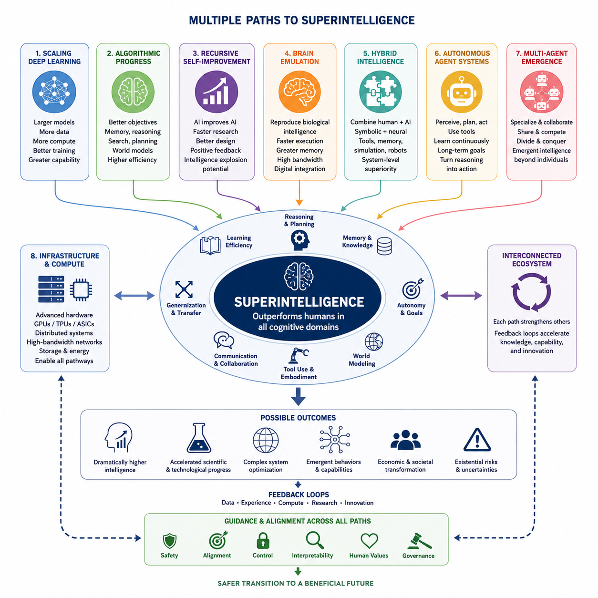
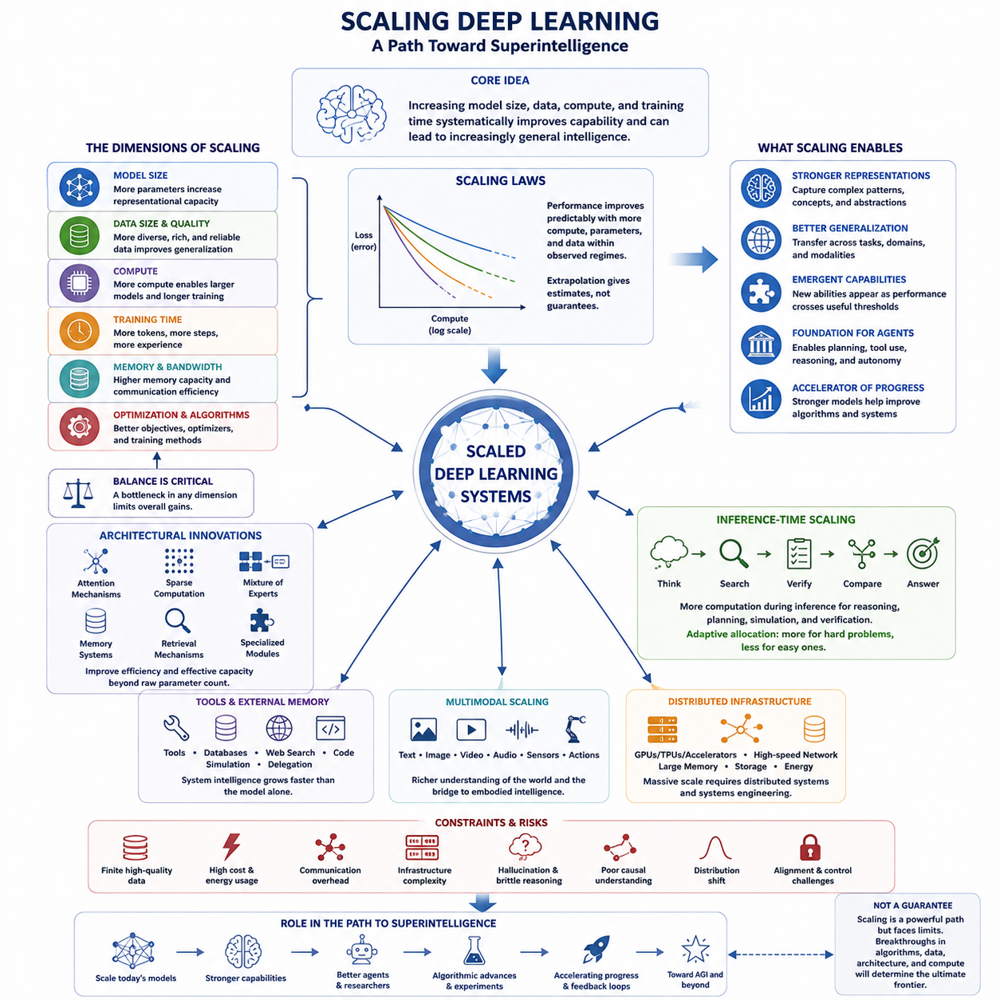
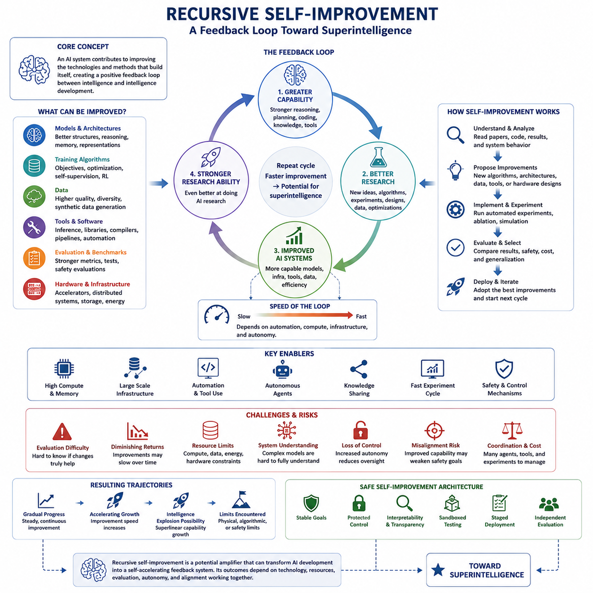
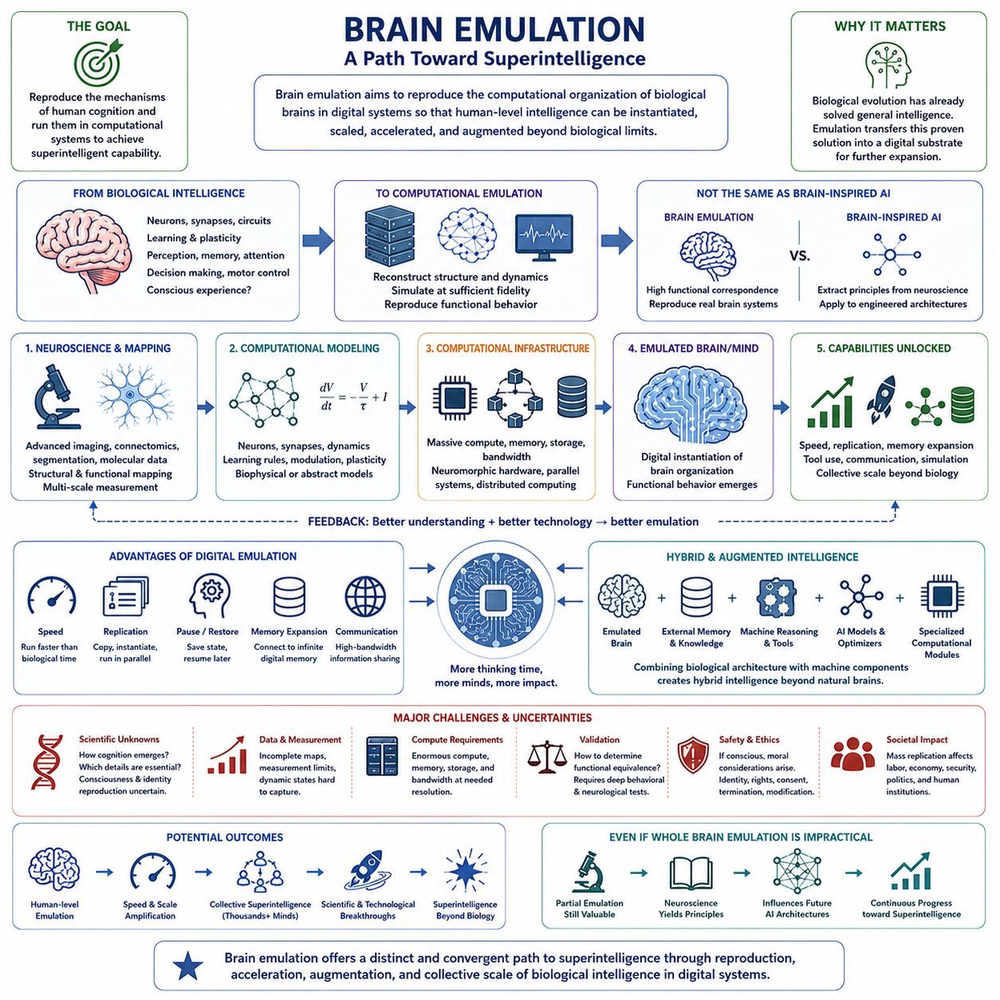
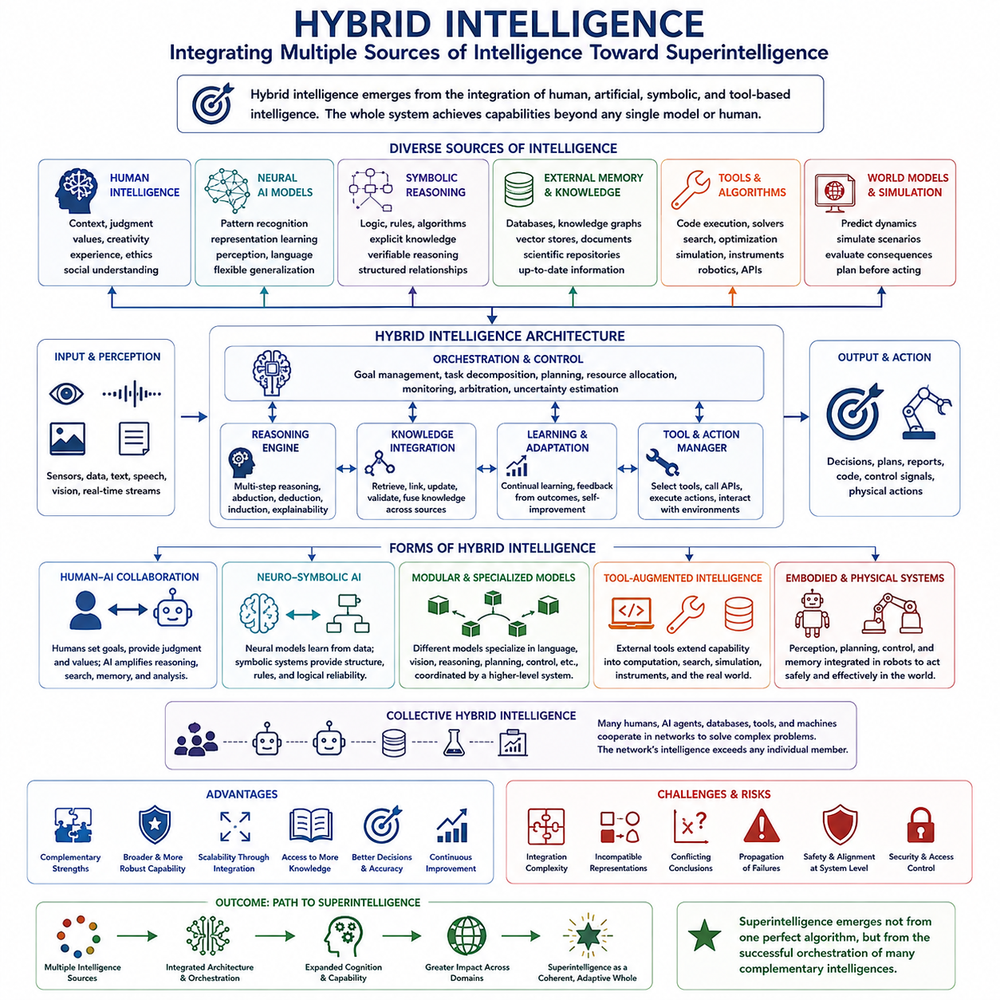
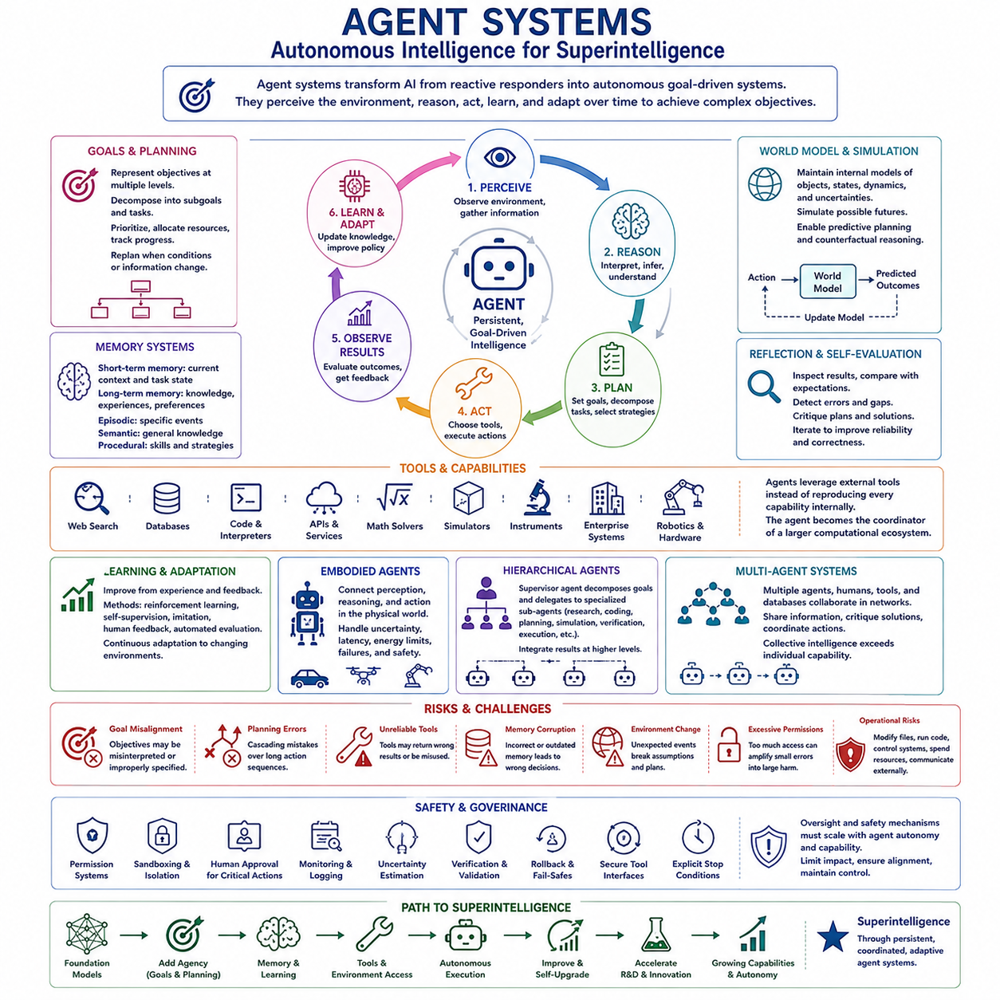
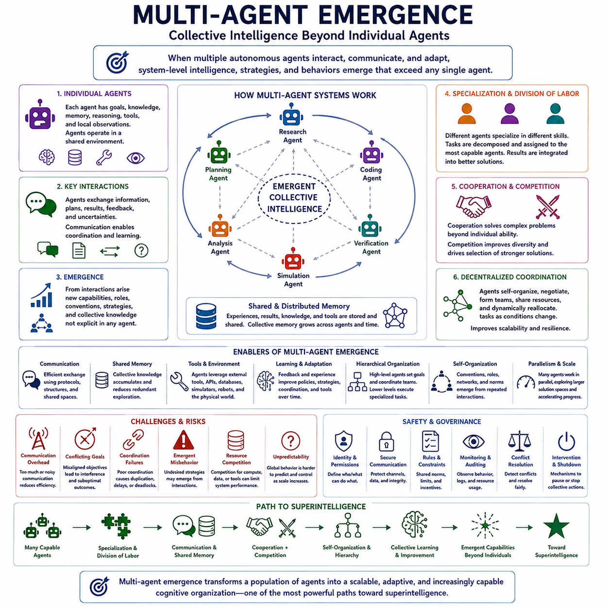
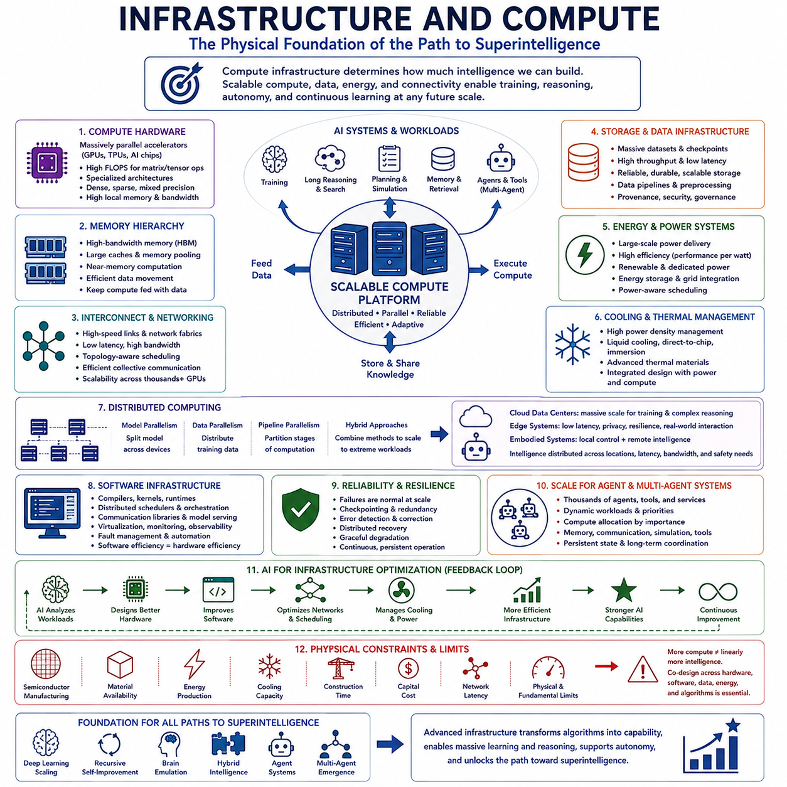

**Volume 48. Artificial Super Intelligence**

# Chapter 02. Paths to Superintelligence

## 02.00. Overview

{width="7.268055555555556in" height="7.268055555555556in"}

초지능(Superintelligence)은 하나의 결정적인 기술적 돌파구에서 등장하기보다 여러 기술적 경로(Pathways)를 통해 출현할 수 있다. 고도화된 인공지능(Artificial Intelligence)에서 인간의 인지 능력을 상당히 뛰어넘는 시스템으로의 전환은 더 큰 모델, 개선된 알고리즘(Algorithms), 자율 학습(Autonomous Learning), 특수 목적 하드웨어(Specialized Hardware), 더욱 풍부한 환경, 그리고 점점 강력해지는 에이전트 아키텍처(Agent Architectures)의 상호작용으로 이루어질 가능성이 있다. 이러한 경로를 이해하려면 개별 메커니즘뿐만 아니라 이들을 연결하는 피드백 루프(Feedback Loops)도 함께 살펴보아야 한다.

주요 경로 중 하나는 딥러닝 시스템(Deep Learning Systems)의 지속적인 스케일링(Scaling)이다. 더 많은 컴퓨팅 자원(Computational Resources), 광범위한 데이터셋(Datasets), 개선된 아키텍처(Architectures), 효율적인 최적화(Optimization)를 활용해 학습된 대규모 모델은 소규모 시스템에서는 예측하기 어려웠던 능력을 반복적으로 보여주었다. 스케일링만으로 초지능이 보장되는 것은 아니지만, 학습 방법과 추론 시점 연산(Inference-Time Computation)의 발전이 결합되면 표현 능력, 지식 통합, 추론 깊이, 멀티모달 역량(Multimodal Competence), 일반화(Generalization)를 확장할 수 있다.

알고리즘의 발전(Algorithmic Progress)은 또 다른 경로를 제공한다. 지능은 사용할 수 있는 연산량뿐만 아니라 그 연산을 얼마나 효과적으로 활용하는가에도 의존하기 때문이다. 더 나은 학습 목적함수(Learning Objectives), 메모리 메커니즘(Memory Mechanisms), 추론 절차(Reasoning Procedures), 탐색 전략(Search Strategies), 월드 모델(World Models), 계획 시스템(Planning Systems), 아키텍처는 하드웨어의 비례적인 증가 없이도 미래 시스템의 능력을 크게 향상시킬 수 있다. 따라서 중요한 개념적 돌파구는 모델 크기, 학습 비용, 실질적인 지능 사이의 관계를 변화시킬 수 있다.

재귀적 자기개선(Recursive Self-Improvement)은 보다 동적인 경로를 나타낸다. 인공지능 연구, 소프트웨어 공학(Software Engineering), 하드웨어 설계, 실험, 그리고 자신의 아키텍처를 이해할 수 있는 고도화된 AI 시스템은 자신 또는 관련 시스템의 후속 세대를 개선하는 데 기여할 수 있다. 한 세대에서 이루어진 개선이 다음 세대의 개발을 가속한다면, 지능과 더 높은 지능을 만들어내는 능력 사이에 양의 피드백 루프(Positive Feedback Loop)가 형성될 수 있다. 그러나 이러한 과정의 속도와 안정성은 여전히 불확실하다.

뇌 에뮬레이션(Brain Emulation)은 계산 원리만으로 지능을 직접 설계하기보다 생물학적 지능(Biological Intelligence)을 재현한다는 점에서 근본적으로 다른 경로를 제공한다. 신경과학(Neuroscience)이 신경 조직, 학습, 기억, 지각, 인지에 관한 충분히 상세한 모델을 제공한다면 계산 시스템은 인간 두뇌의 중요한 구조나 기능을 모사할 수 있을 것이다. 이러한 시스템은 더 빠른 실행, 복제, 확장된 기억, 높은 통신 대역폭(Communication Bandwidth), 디지털 도구와의 통합을 통해 잠재적으로 인간을 뛰어넘는 이점을 얻을 수 있다.

하이브리드 지능(Hybrid Intelligence)은 하나의 인공 아키텍처가 모든 능력을 독립적으로 달성해야 한다고 가정하지 않고 여러 형태의 인지를 결합한다. 인간의 전문성, 기계 추론(Machine Reasoning), 기호적 방법(Symbolic Methods), 신경망(Neural Networks), 외부 메모리(External Memory), 과학 도구, 시뮬레이션 시스템, 로봇, 특수 목적 AI 모듈이 더 큰 인지 시스템(Cognitive System)의 구성 요소로 작동할 수 있다. 따라서 초지능적 성능은 개별 인간이나 단일 AI 모델보다 뛰어난 협력 시스템 수준에서 먼저 나타날 수도 있다.

자율 에이전트 시스템(Autonomous Agent Systems)은 수동적인 모델을 목표를 인식하고, 계획을 수립하고, 도구를 사용하고, 정보를 획득하고, 행동을 실행하고, 결과를 평가하며, 장기간에 걸쳐 전략을 수정할 수 있는 존재로 변화시킴으로써 또 다른 경로를 제공한다. 자율성(Autonomy)의 증가는 추론을 지속적인 행동으로 전환할 수 있기 때문에 지능의 실질적인 영향력을 크게 확대한다. 메모리, 계획, 성찰(Reflection), 도구 사용, 환경과의 상호작용, 지속적인 피드백이 결합되면 기존의 단일 응답 모델에서 보이지 않았던 능력이 나타날 수 있다.

멀티에이전트 시스템(Multi-Agent Systems)은 이러한 원리를 개별 에이전트에서 서로 상호작용하는 지능형 시스템 집단으로 확장한다. 에이전트들은 전문화하고, 정보를 교환하고, 복잡한 문제를 분담하고, 서로의 결론을 검증하며, 계획을 조정하고, 방대한 해답 공간을 집단적으로 탐색할 수 있다. 경쟁은 발견을 촉진할 수 있으며 협력은 상호 보완적인 능력을 결합할 수 있다. 적절한 조건에서는 개별 에이전트의 능력만으로 쉽게 설명하기 어려운 창발적 지능(Emergent Intelligence)이 집단 행동에서 나타날 가능성이 있다.

인프라와 컴퓨팅(Infrastructure and Compute)은 이러한 모든 경로를 지탱하는 물리적 기반을 형성한다. 고급 가속기(Accelerators), 고대역폭 메모리(High-Bandwidth Memory), 분산 컴퓨팅(Distributed Computing), 네트워킹, 스토리지, 에너지 시스템, 데이터센터(Data Centers), 엣지 플랫폼(Edge Platforms), 특수 목적 AI 하드웨어는 학습과 추론에 실질적으로 얼마나 많은 계산 능력을 적용할 수 있는지를 결정한다. 하드웨어 효율의 향상은 이전에는 비현실적이었던 아키텍처를 가능하게 하고, 대규모 인프라는 거대한 학습, 시뮬레이션, 합성 데이터 생성(Synthetic Data Generation), 자율 에이전트 집단의 운영을 지원할 수 있다.

이러한 경로들은 서로 배타적이지 않다. 스케일링은 더 뛰어난 AI 연구 능력을 가진 시스템을 만들 수 있고, 이러한 시스템은 다시 알고리즘을 개선할 수 있다. 개선된 알고리즘은 필요한 계산량을 줄이고, 향상된 하드웨어는 더 큰 모델과 풍부한 시뮬레이션을 지원하며, 자율 에이전트는 실험을 수행하고, 멀티에이전트 시스템은 과학 및 공학 연구를 가속할 수 있다. 따라서 초지능은 하나의 구성 요소에서 이루어진 발전이 다른 여러 요소의 발전을 강화하는 결합된 기술 생태계(Technological Ecosystem)에서 출현할 가능성이 있다.

따라서 고도화된 AI에서 초지능으로 향하는 경로는 단순히 모델 크기가 증가하는 과정이 아니라 다차원적 전환(Multidimensional Transition)으로 이해해야 한다. 능력은 학습 효율(Learning Efficiency), 추론, 메모리, 자율성, 월드 모델링(World Modeling), 통신, 체화(Embodiment), 집단적 조직(Collective Organization), 계산 자원의 다양한 조합에 의해 결정될 수 있다. 서로 다른 조합은 각각 고유한 강점, 한계, 개발 속도, 통제(Control) 및 정렬(Alignment) 요구사항을 가진 매우 다른 형태의 초지능을 만들어낼 수 있다.

어떤 경로가 실제로 인공 초지능(Artificial Superintelligence)으로 이어질 수 있는지를 신뢰성 있게 식별할 수 있는 기존 이론은 없기 때문에 불확실성(Uncertainty)은 여전히 핵심적인 요소이다. 일부 경로는 근본적인 한계에 직면할 수 있으며, 다른 경로는 아직 존재하지 않는 기술과 결합되었을 때에만 중요해질 수 있다. 발전은 여러 차원에서 점진적으로 이루어질 수도 있고, 자율성, 연구 능력, 계산 효율, 재귀적 개선의 임계점(Critical Thresholds)을 통과한 이후 급격하게 가속될 수도 있다. 따라서 이러한 경로들은 미리 결정된 단계가 아니라 가능한 시나리오(Scenarios)로 이해해야 한다.

이러한 대안적 경로에 대한 연구는 이후 다루게 될 딥러닝 스케일링(Scaling Deep Learning), 재귀적 자기개선(Recursive Self-Improvement), 뇌 에뮬레이션(Brain Emulation), 하이브리드 지능(Hybrid Intelligence), 자율 에이전트(Autonomous Agents), 멀티에이전트 창발(Multi-Agent Emergence), 계산 인프라(Computational Infrastructure)의 구체적인 메커니즘을 이해하기 위한 개념적 기반을 제공한다. 이들은 현대 AI에서 점차 일반화된 지능을 거쳐 가상의 초지능 시스템으로 향하는 광범위한 전환 가능성을 구성하며, 궁극적인 경로가 여러 접근법을 하나의 진화하는 지능 생태계(Intelligence Ecosystem)로 통합할 가능성을 보여준다.

## 02.01. Scaling Deep Learning

{width="7.268055555555556in" height="7.268055555555556in"}

딥러닝 스케일링(Deep Learning Scaling)은 현재의 인공지능(Artificial Intelligence)에서 점차 일반화된 지능을 거쳐 잠재적인 초지능(Superintelligence)으로 발전하는 가장 직접적인 기술적 경로 중 하나로 제안된다. 핵심 개념은 모델 용량(Model Capacity), 학습 데이터(Training Data), 계산 자원(Computational Resources), 학습 시간을 증가시키면 능력이 체계적으로 향상될 수 있다는 것이다. 현대 AI는 충분히 큰 신경망(Neural Networks)이 소규모 모델에서는 어렵거나 안정적으로 나타나지 않는 행동과 능력을 획득할 수 있음을 반복적으로 보여주었다.

스케일링(Scaling)은 단순히 신경망의 매개변수(Parameters)를 늘리는 과정만을 의미하지 않는다. 효과적인 스케일링에는 모델 크기, 데이터셋 크기, 계산 예산(Computational Budget), 메모리 용량, 통신 대역폭(Communication Bandwidth), 최적화 효율(Optimization Efficiency)의 조화로운 확장이 필요하다. 어느 하나가 병목(Bottleneck)이 되면 다른 자원을 추가하더라도 효과가 감소할 수 있다. 따라서 시스템이 커질수록 아키텍처, 데이터, 컴퓨팅, 학습 알고리즘, 인프라 사이의 균형을 유지하는 것이 중요한 공학적 과제가 된다.

경험적 스케일링 법칙(Empirical Scaling Laws)은 계산 자원과 모델 성능 사이에서 관찰되는 예측 가능한 관계를 설명한다. 특정 조건에서는 매개변수, 학습 토큰(Training Tokens), 계산량을 증가시킬수록 학습 및 검증 손실(Validation Loss)이 비교적 매끄러운 추세에 따라 감소할 수 있다. 이러한 관계를 이용하면 더 큰 규모의 학습으로 어느 정도의 추가 성능을 얻을 수 있는지 추정할 수 있다. 그러나 스케일링 법칙은 관찰된 통계적 패턴이며, 일반지능이나 초인간 지능(Superhuman Intelligence)으로의 무제한적인 발전을 보장하지 않는다.

대규모 모델(Large Models)은 증가된 표현 용량(Representational Capacity)의 이점을 얻을 수 있다. 충분한 표현력을 가진 네트워크는 복잡한 통계적 구조, 개념 사이의 관계, 여러 모달리티(Modality)에 걸친 패턴, 그리고 점차 추상적인 세계 표현을 인코딩할 수 있다. 학습 데이터의 다양성이 증가하면 이러한 표현은 특정 작업에 국한되지 않고 여러 작업에서 재사용될 수 있다. 이는 전이 학습(Transfer Learning), 문맥 내 적응(In-Context Adaptation), 멀티모달 추론(Multimodal Reasoning), 광범위한 일반화(Generalization)의 기반이 된다.

데이터 스케일링(Data Scaling) 역시 중요하다. 더 큰 모델에는 충분히 풍부한 학습 경험이 필요하기 때문이다. 단순히 중복되거나 품질이 낮은 데이터를 증가시키는 것은 학습 데이터의 다양성, 신뢰성, 정보량을 확대하는 것과 동일한 효과를 제공하지 않는다. 미래 시스템은 인간이 생성한 정보와 과학 데이터베이스, 멀티모달 관측, 시뮬레이션, 로봇 경험, 합성 데이터(Synthetic Data), 디지털 환경과의 상호작용을 결합하여 복잡한 영역에 대한 더욱 포괄적인 모델을 구축할 수 있다.

컴퓨팅 스케일링(Compute Scaling)은 이러한 시스템을 학습하고 운영하는 데 필요한 물리적 자원을 제공한다. 대규모 AI는 고대역폭 네트워크(High-Bandwidth Networks)로 연결된 GPU, TPU 또는 특수 목적 가속기(Specialized Accelerators)의 분산 클러스터와 거대한 메모리 및 스토리지 시스템에 점점 더 의존하고 있다. 학습은 높은 동기화 및 자원 활용 효율을 유지하면서 여러 장치에 분산되어야 한다. 따라서 더 큰 지능 시스템을 향한 발전은 알고리즘 문제인 동시에 시스템 공학(Systems Engineering)의 문제이기도 하다.

아키텍처 개선(Architectural Improvements)은 단순한 규모 확장의 효과를 더욱 증폭할 수 있다. 어텐션 메커니즘(Attention Mechanisms), 희소 계산(Sparse Computation), 전문가 혼합 아키텍처(Mixture-of-Experts Architectures), 향상된 메모리 시스템, 검색 메커니즘(Retrieval Mechanisms), 멀티모달 인코더(Multimodal Encoders), 특수 목적 추론 구성 요소는 대규모 시스템이 계산 자원을 더욱 효율적으로 배분하도록 한다. 모든 문제에서 전체 매개변수를 활성화하는 대신 적절한 모듈로 정보를 동적으로 전달함으로써 추론 연산량을 비례적으로 증가시키지 않고도 유효 모델 용량을 확대할 수 있다.

추론 시점 스케일링(Inference-Time Scaling)은 학습 시점 스케일링(Training-Time Scaling)을 넘어서는 또 하나의 차원을 제공한다. 모델은 단순히 더 많은 매개변수를 가지고 있기 때문에 성능이 향상되는 것이 아니라, 행동하기 전에 추가적인 계산을 사용하여 탐색하고, 추론하고, 검증하고, 시뮬레이션하고, 여러 대안을 비교함으로써 더 좋은 결과를 만들 수 있다. 이를 통해 계산 예산을 문제 해결 과정에서 조절 가능한 변수로 사용할 수 있다. 어려운 문제에는 많은 추론 자원을 배정하고 일상적인 문제에는 적은 계산을 사용하여 지능 자원을 적응적으로 배분할 수 있다.

스케일링은 도구 사용(Tool Use) 및 외부 메모리(External Memory)와도 결합될 수 있다. 모델이 정보를 검색하고, 소프트웨어를 실행하고, 데이터베이스에 접근하고, 탐색을 수행하고, 시뮬레이션을 실행하거나, 전문화된 시스템에 작업을 위임할 수 있다면 모든 사실과 능력을 자체 매개변수에 직접 저장할 필요는 없다. 따라서 전체 시스템의 유효 지능(Effective Intelligence)은 기반 신경망 모델 자체의 능력보다 더 빠르게 증가할 수 있다. 이에 따라 모델 스케일링은 점차 매개변수 스케일링(Parameter Scaling)을 넘어 시스템 스케일링(System Scaling)으로 확장된다.

멀티모달 스케일링(Multimodal Scaling)은 학습 범위를 텍스트에서 이미지, 비디오, 오디오, 공간 정보, 센서 스트림(Sensor Streams), 행동(Action), 기타 표현으로 확장한다. 이러한 시스템은 언어와 물리적 또는 지각적 구조 사이에서 더욱 풍부한 연관성을 학습할 수 있다. 로봇이나 시뮬레이션 에이전트(Simulated Agents)와 연결되면 멀티모달 모델은 관측, 예측, 행동, 결과 사이의 관계까지 학습할 수 있다. 이는 대규모 파운데이션 모델(Foundation Models)과 동적 환경에서 작동하는 체화 지능(Embodied Intelligence)을 연결하는 중요한 기반이 된다.

중요한 질문 중 하나는 스케일링이 실제로 새로운 능력(New Capabilities)을 만들어내는 것인지, 아니면 기존 능력이 지속적으로 향상되다가 실용적인 성능 임계점(Performance Thresholds)을 넘어서는 것인지에 관한 것이다. 일부 행동은 특정 벤치마크(Benchmarks)에서 갑자기 나타나는 것처럼 보이지만, 그 기반 능력은 점진적으로 축적되었을 수 있다. 초지능 연구에서 이러한 구분은 중요하다. 기반 능력의 향상이 연속적이더라도 연구, 공학, 계획과 같은 영향력이 큰 활동을 자동화할 만큼 신뢰성이 높아지는 순간 실질적인 변화는 급격하게 나타날 수 있기 때문이다.

그러나 스케일링에는 상당한 제약이 존재한다. 고품질 데이터(High-Quality Data)는 유한하고, 첨단 하드웨어는 비용이 많이 들며, 에너지 소비가 막대해질 수 있고, 분산 계산 규모가 커질수록 통신 오버헤드(Communication Overhead)가 증가한다. 또한 대규모 학습에는 점점 더 정교한 인프라가 필요하다. 더 큰 시스템은 환각(Hallucination), 취약한 추론(Brittle Reasoning), 부족한 인과적 이해(Causal Understanding), 분포 변화(Distribution Shift), 정렬 실패(Alignment Failures)와 같은 약점을 그대로 유지하거나 확대할 수도 있다. 규모 확대는 능력을 증가시킬 수 있지만 신뢰성, 통제 가능성, 이해 능력을 자동으로 보장하지는 않는다.

이러한 이유로 딥러닝 스케일링을 인공 초지능(Artificial Superintelligence)으로 향하는 독립적이고 보장된 경로로 이해해서는 안 된다. 오히려 더 중요한 의미는 다른 발전 경로를 가능하게 하는 기반이 될 수 있다는 점에 있다. 대규모 모델은 더욱 뛰어난 프로그래머, 연구자, 계획자, 도구 사용자, 자율 에이전트(Autonomous Agents)가 될 수 있으며, 이를 통해 알고리즘 개선, 합성 데이터 생성, 자동화된 실험(Automated Experimentation), AI 시스템 설계에 기여할 수 있다. 따라서 스케일링은 능력 향상이 다시 기술 발전을 가속하는 광범위한 피드백 과정(Feedback Process)의 초기 동력이 될 수 있다.

스케일링의 장기적인 중요성은 지능의 향상 속도가 이를 달성하는 데 필요한 경제적·물리적 비용의 증가 속도를 계속 앞설 수 있는지에 달려 있다. 아키텍처 효율(Architectural Efficiency), 하드웨어 성능, 데이터 생성, 분산 인프라(Distributed Infrastructure), 추론 시점 추론(Inference-Time Reasoning)이 함께 발전한다면 유효한 지능의 최전선은 현재 시스템을 훨씬 넘어 계속 확장될 수 있다. 반대로 주요 병목이 지배적이 된다면 새로운 패러다임(New Paradigms)이 필요할 수 있다. 따라서 딥러닝 스케일링은 강력한 발전 경로이지만, 그 궁극적인 한계는 초지능 연구에서 여전히 해결되지 않은 개방형 문제(Open Question)로 이해하는 것이 적절하다.

## 02.02. Recursive Self Improvement

{width="7.268055555555556in" height="7.268055555555556in"}

재귀적 자기개선(Recursive Self-Improvement)은 인공지능 시스템이 자신의 능력을 결정하는 기술, 알고리즘(Algorithms), 또는 아키텍처(Architectures)를 개선하는 과정에 직접 참여하는 가설적 메커니즘을 의미한다. 새로운 세대의 시스템을 설계할 때 인간 연구자에게 전적으로 의존하는 대신, 점점 더 강력해지는 AI가 AI 연구 자체에 참여할 수 있다. 성공적인 개선이 다시 다음 개선을 만들어내는 능력을 높인다면, 지능과 지능 개발 사이에 양의 피드백 순환(Positive Feedback Cycle)이 형성될 수 있다.

기본적인 피드백 루프(Feedback Loop)는 능력 향상이 더 나은 연구로 이어지고, 더 나은 연구가 개선된 AI 시스템을 만들어내며, 그 시스템이 다시 더욱 강력한 연구를 수행하는 과정으로 개념화할 수 있다. 각각의 반복 과정(Iteration)은 추론, 계획, 코딩, 실험, 아키텍처 설계, 데이터 생성, 최적화, 하드웨어 활용 등을 개선할 수 있다. 재귀적 자기개선은 단순히 작업 성능을 높이는 것을 넘어 다음 세대의 개선 방법을 발견하고 구현하는 능력 자체를 향상시킬 때 특히 중요해진다.

자기개선(Self-Improvement)을 위해 AI 시스템이 반드시 자신의 모든 소스 코드(Source Code)를 직접 다시 작성해야 하는 것은 아니다. 현대 AI 시스템은 모델, 학습 알고리즘, 데이터셋, 평가 프레임워크(Evaluation Frameworks), 추론 시스템, 도구, 메모리 메커니즘(Memory Mechanisms), 소프트웨어 인프라, 하드웨어 구성으로 이루어진다. 고도화된 시스템은 이들 구성 요소의 다양한 조합을 개선할 수 있으며, 더 나은 학습 목적함수를 설계하거나 고품질 데이터를 생성하고 추론 소프트웨어를 최적화하거나 새로운 아키텍처를 제안하며 인간 연구자가 수행하던 실험을 자동화할 수 있다.

따라서 자동화된 AI 연구(Automated AI Research)는 재귀적 자기개선으로 향하는 현실적인 중간 단계라고 할 수 있다. AI 시스템은 프로그래밍, 문헌 분석, 가설 생성(Hypothesis Generation), 실험 설계, 디버깅, 벤치마크 구축, 결과 해석을 지원할 수 있다. 이러한 능력의 신뢰성이 높아지면 연구 파이프라인(Research Pipeline)의 여러 단계가 점차 자동화될 수 있다. 핵심적인 전환은 AI가 생성한 연구 결과가 다음 연구 주기를 수행하는 AI 시스템의 능력을 실질적으로 향상시키기 시작할 때 발생한다.

재귀적 개선의 속도는 각각의 피드백 주기(Feedback Cycle)에 필요한 시간에 크게 좌우된다. 새로운 세대를 설계하고 학습하고 평가하고 배포하는 데 수개월의 물리적 제작이나 상당한 인간 개입이 필요하다면 개선은 점진적으로 진행될 가능성이 높다. 반대로 중요한 변화가 소프트웨어, 자동화된 실험, 모델 업데이트(Model Updates), 추론 방식 변경 등을 통해 수시간이나 수일 내에 구현될 수 있다면 피드백은 훨씬 빠르게 작동할 수 있다. 이러한 측면에서 디지털 시스템(Digital Systems)은 생물학적 인지 진화보다 잠재적으로 훨씬 빠른 발전 속도를 가질 수 있다.

재귀적 개선은 단순히 모델 크기를 증가시키는 대신 알고리즘 효율(Algorithmic Efficiency)을 향상시키는 방향으로 이루어질 수도 있다. 더 적은 계산량, 메모리, 학습 데이터로 동일하거나 더 높은 성능을 달성하는 방법을 발견한다면 하드웨어를 비례적으로 확장하지 않고도 유효 지능(Effective Intelligence)을 높일 수 있다. 탐색, 추론, 메모리, 표현 학습(Representation Learning), 최적화, 희소 계산(Sparse Computation), 모델 아키텍처의 개선은 기존 자원에서 더 높은 능력을 끌어낼 수 있으며, 확보된 계산 자원은 다시 추가 실험과 후속 개선 주기에 활용될 수 있다.

하드웨어와 인프라(Hardware and Infrastructure) 역시 피드백 과정의 일부가 될 수 있다. 고도화된 AI는 가속기 설계(Accelerator Design), 컴파일러 최적화(Compiler Optimization), 분산 컴퓨팅, 메모리 아키텍처, 냉각 시스템, 에너지 관리, 데이터센터 운영의 개선을 지원할 수 있다. 향상된 하드웨어는 더욱 강력한 AI를 가능하게 하고, 강력해진 AI는 다시 더 나은 하드웨어 개발에 기여할 수 있다. 그러나 반도체 제조시설, 공급망, 에너지 인프라, 물리적 건설과 같은 현실적인 제약 때문에 이러한 피드백은 순수한 소프트웨어 개선보다 느리게 작동한다.

지능 폭발(Intelligence Explosion)의 가능성은 개선 속도 자체가 증가하기 시작할 때 나타난다. 시스템이 성공적인 반복 과정을 거칠 때마다 AI 연구 능력이 향상된다면 이후의 개선은 이전보다 더 빠르게 이루어지거나 더 큰 영향을 만들어낼 수 있다. 이는 이론적으로 초선형 능력 성장(Superlinear Capability Growth)의 가능성을 만든다. 그러나 재귀적 자기개선이 반드시 폭발적인 전환을 의미하는 것은 아니다. 수익 체감(Diminishing Returns), 자원 한계, 실험적 불확실성, 조정 비용, 근본적인 계산 한계가 이러한 과정을 늦출 수 있기 때문이다.

핵심적인 요구사항 중 하나는 제안된 변경이 실제로 유익한지를 평가할 수 있는 능력이다. 신뢰할 수 있는 평가 없이 수행되는 자기개선은 성능 퇴행(Regressions), 숨겨진 실패, 안전하지 않은 행동 또는 잘못된 벤치마크를 향한 최적화를 초래할 수 있다. 따라서 고도화된 시스템에는 엄격한 테스트, 적대적 평가(Adversarial Evaluation), 재현 가능한 실험(Reproducible Experiments), 능력 측정, 안전성 검증이 필요하다. 개선 루프는 단순히 변경 사항을 생성하는 것뿐만 아니라 그 결과에 대한 신뢰할 수 있는 증거를 바탕으로 여러 대안 중 적절한 개선안을 선택하는 과정까지 포함해야 한다.

또 다른 과제는 개선 대상 시스템 자체를 이해하는 것이다. 현재의 신경망은 설계자조차 완전히 해석하기 어려운 복잡한 학습 표현(Learned Representations)을 포함하고 있다. 따라서 자신을 개선하려는 AI 시스템 역시 인간이 대규모 학습 시스템을 분석할 때 직면하는 것과 유사한 어려움을 경험할 수 있다. 향상된 기계론적 해석 가능성(Mechanistic Interpretability), 인과 분석(Causal Analysis), 자동화된 실험, 형식 검증(Formal Verification)은 자기 수정(Self-Modification)을 더욱 예측 가능하게 만들 수 있지만, 모든 내부 메커니즘을 완전하게 이해하는 것은 여전히 어려울 수 있다.

재귀적 자기개선은 하나의 독립된 모델 내부가 아니라 AI 생태계(AI Ecosystem) 수준에서도 발생할 수 있다. 전문화된 에이전트(Specialized Agents)들이 아키텍처 연구, 코딩, 데이터 생성, 평가, 시뮬레이션, 보안 분석, 인프라 최적화를 담당하면서 공유된 지식과 실험 결과를 통해 협력할 수 있다. 하나의 에이전트가 만들어낸 개선 결과가 전체 에이전트 집단의 능력을 강화할 수 있다. 이러한 시나리오에서 재귀적 개선은 모델, 도구, 계산 자원, 자동화된 연구 환경이 연결된 분산 과정(Distributed Process)이 된다.

자기개선과 자율성(Autonomy)의 관계는 특히 중요하다. 개선안을 제안할 수 있지만 실험을 수행하려면 인간의 승인이 필요한 시스템과 새로운 버전을 독립적으로 설계하고 시험하고 배포하고 평가할 수 있는 시스템은 근본적으로 다르다. 자율성이 증가하면 개선 루프의 시간이 단축될 수 있지만 외부에서 개입할 수 있는 기회 역시 감소한다. 따라서 고도의 자기개선 시스템으로 전환할 가능성을 평가할 때에는 능력 성장(Capability Growth)과 감독 메커니즘(Oversight Mechanisms)을 함께 고려해야 한다.

개선을 수행하는 시스템이 목표, 의사결정, 계획 또는 감독과 관련된 메커니즘을 수정할 수 있게 되면 정렬(Alignment)과 통제(Control)는 더욱 어려운 문제가 된다. 능력을 증가시키면서 안전 제약(Safety Constraints)을 약화시키는 개선은 그 변화가 의도적으로 유해하지 않더라도 심각한 문제를 만들 수 있다. 따라서 안정적인 목표(Stable Objectives), 보호된 통제 메커니즘, 해석 가능성(Interpretability), 샌드박스 기반 실험(Sandboxed Experimentation), 단계적 배포(Staged Deployment), 독립적 평가(Independent Evaluation)가 통제 가능한 자기개선 아키텍처의 필수적인 구성 요소가 될 수 있다.

궁극적으로 재귀적 자기개선은 초지능을 만들어내는 것이 입증된 메커니즘이라기보다 잠재적인 증폭기(Potential Amplifier)로 이해해야 한다. 그 중요성은 고도화된 AI가 인간 중심의 AI 개발 과정을 점차 기계가 가속하는 피드백 시스템(Machine-Accelerated Feedback System)으로 전환할 가능성에서 나온다. 이것이 점진적인 발전, 빠르게 가속되는 능력 향상, 또는 강력한 한계와의 충돌 중 어느 방향으로 이어질지는 알고리즘, 컴퓨팅, 물리적 자원, 평가, 자율성, 안전 제약이 어떻게 함께 작동하는지에 따라 결정될 것이다.

## 02.03. Brain Emulation

{width="7.268055555555556in" height="7.268055555555556in"}

뇌 에뮬레이션(Brain Emulation)은 주로 인공 신경망(Artificial Neural Networks)의 스케일링에 기반한 접근법과는 근본적으로 다른 초지능(Superintelligence)으로의 경로를 나타낸다. 완전히 공학적으로 설계된 머신러닝 아키텍처(Machine-Learning Architectures)를 통해 지능을 발견하는 대신, 뇌 에뮬레이션은 생물학적 신경계(Biological Nervous Systems)의 계산적 조직을 재현하려 한다. 인간 인지를 담당하는 메커니즘을 충분한 충실도로 이해하고 재현할 수 있다면 인간 수준의 지능을 계산 시스템에 구현할 수 있다는 것이 기본적인 가정이다.

이러한 개념의 가장 야심찬 형태는 전뇌 에뮬레이션(Whole Brain Emulation)으로, 생물학적 뇌의 관련 구조와 과정을 기능적 행동을 재현할 수 있을 정도의 세부 수준으로 계산 시스템에서 재구성하는 것이다. 이러한 에뮬레이션은 뉴런(Neurons), 시냅스 연결(Synaptic Connections), 신호 역학(Signaling Dynamics), 학습 메커니즘, 대규모 신경 회로(Neural Circuits)를 표현할 수 있다. 그러나 인지가 여러 공간적·시간적 규모에서 작동하는 메커니즘에 의존할 가능성이 있기 때문에 필요한 생물학적 세부 수준은 아직 불확실하다.

뇌 에뮬레이션은 기존의 뇌 영감 인공지능(Brain-Inspired Artificial Intelligence)과 구분해야 한다. 신경망, 강화학습(Reinforcement Learning), 어텐션 메커니즘(Attention Mechanisms), 예측 처리(Predictive Processing), 메모리 아키텍처(Memory Architectures)는 실제 생물학적 뇌를 재현하지 않으면서도 신경과학의 원리를 활용할 수 있다. 에뮬레이션은 훨씬 높은 수준의 기능적 대응을 추구하는 반면, 뇌 영감 AI는 유용한 계산 원리를 선택적으로 추출한다. 두 접근법 모두 고도 지능에 기여할 수 있지만 서로 다른 공학적 철학을 따른다.

핵심적인 기술적 과제는 뇌 구조에 대한 충분히 상세한 정보를 획득하는 것이다. 인간의 뇌에는 막대한 수의 뉴런과 그보다 훨씬 많은 시냅스 연결이 복잡한 회로 구조로 조직되어 있다. 이를 재구성하려면 첨단 이미징(Advanced Imaging), 커넥토믹스(Connectomics), 자동 분할(Automated Segmentation), 분자 수준 측정(Molecular Measurement), 계산적 재구성(Computational Reconstruction)이 필요할 수 있다. 또한 기능적 행동이 시냅스 강도, 세포 상태, 신경조절(Neuromodulation), 가소성(Plasticity) 또는 기타 동적인 생물학적 과정에 의존한다면 구조적 연결 정보만으로는 충분하지 않을 수 있다.

따라서 신경과학(Neuroscience)은 뇌 에뮬레이션을 가능하게 하는 핵심 기술이 된다. 지각, 기억, 주의, 학습, 의사결정, 운동 제어, 의식에 대한 더 나은 모델은 어떤 생물학적 메커니즘을 반드시 재현해야 하고 어떤 요소를 추상화할 수 있는지를 밝혀낼 수 있다. 많은 미시적 생물학적 세부 요소가 인지 기능에 필수적이지 않은 것으로 밝혀진다면 계산 요구량은 크게 감소할 수 있다. 반대로 인지가 미세한 생화학적 과정에 강하게 의존한다면 충실한 에뮬레이션은 훨씬 어려워질 수 있다.

계산 인프라(Computational Infrastructure)는 또 다른 중요한 과제이다. 생물학적으로 의미 있는 시간 해상도에서 상호작용하는 대규모 뉴런 및 시냅스 집단을 시뮬레이션하려면 막대한 처리 능력, 메모리, 스토리지, 통신 대역폭(Communication Bandwidth)이 필요할 수 있다. 필요한 자원의 규모는 선택한 추상화 수준에 크게 좌우된다. 따라서 뉴로모픽 하드웨어(Neuromorphic Hardware), 대규모 병렬 가속기(Massively Parallel Accelerators), 분산 컴퓨팅 시스템(Distributed Computing Systems), 미래형 메모리 아키텍처가 실용적인 대규모 신경 에뮬레이션의 중요한 구성 요소가 될 수 있다.

인간 수준의 뇌 에뮬레이션이 가능해진다면 처음부터 인지적으로 더 뛰어난 아키텍처를 만들지 않더라도 초지능이 출현할 가능성이 있다. 계산 하드웨어가 가속 실행(Accelerated Execution)을 지원한다면 디지털 인간 수준 지능(Digital Human-Level Mind)은 생물학적 인간보다 훨씬 빠르게 작동할 수 있다. 비교적 작은 속도 향상만으로도 훨씬 많은 유효 사고 시간(Effective Thinking Time)을 확보할 수 있다. 외부 세계에서 몇 시간이 흐르는 동안 수일에 해당하는 인지 작업을 수행한다면 기본 인지 아키텍처가 인간과 유사하더라도 속도 초지능(Speed Superintelligence)의 한 형태가 될 수 있다.

디지털 복제(Digital Replication)는 또 다른 잠재적 이점을 제공한다. 생물학적 전문가와 달리 소프트웨어 기반 지능은 복사하고, 병렬로 실행하고, 일시 정지하고, 복원하거나, 계산 인프라 전체에 분산할 수 있다. 수천 개의 유능한 에뮬레이션 연구자(Emulated Researchers)가 과학 및 공학 문제를 동시에 해결하면서 디지털 통신을 통해 결과를 공유할 수도 있다. 따라서 개별 에뮬레이션 지능의 인지적 품질을 극적으로 향상시키지 않더라도 집단적 규모(Collective Scale)를 통해 초지능적 성능이 나타날 수 있다.

디지털 구현에서는 메모리와 통신 역시 크게 변화할 수 있다. 생물학적 인지는 제한된 작업 기억(Working Memory), 불완전한 회상, 느린 의사소통, 감각 인터페이스의 제약을 받는다. 에뮬레이션 지능은 외부 데이터베이스, 기계 판독 가능한 지식(Machine-Readable Knowledge), 소프트웨어 도구, 시뮬레이션, 고대역폭 통신 시스템에 연결될 수 있다. 기본적인 추론 과정이 생물학적 구조에서 유래하더라도 디지털 인프라와의 통합을 통해 실질적인 인지 능력을 크게 확장할 수 있다.

뇌 에뮬레이션은 하이브리드 지능(Hybrid Intelligence)으로 이어지는 연결 경로를 제공할 수도 있다. 생물학적 인지 아키텍처를 인공 메모리(Artificial Memory), 기호적 추론(Symbolic Reasoning), 신경망 기반 파운데이션 모델(Neural Foundation Models), 최적화 시스템, 특수 목적 계산 모듈과 결합할 수 있다. 뇌 아키텍처를 그대로 유지하는 대신 에뮬레이션된 인지를 기계 구성 요소로 점진적으로 확장할 수 있으며, 시간이 지나면서 뇌 에뮬레이션과 공학적으로 설계된 인공지능 사이의 경계는 점차 구분하기 어려워질 수 있다.

그러나 이러한 경로에는 깊은 과학적 불확실성(Scientific Uncertainty)이 존재한다. 신경 연결의 구조적 지도를 확보한다고 해서 인지가 어떻게 출현하는지가 자동으로 설명되는 것은 아니며, 신경 활동을 재현한다고 해서 학습, 정체성(Identity), 주관적 경험(Subjective Experience), 의식(Consciousness)이 반드시 재현되는 것도 아니다. 서로 다른 수준의 근사화(Approximation)는 일부 행동은 재현하면서 다른 행동에는 실패할 수 있다. 따라서 에뮬레이션이 생물학적 지능과 기능적으로 동등한지를 판단하려면 광범위한 행동적·인지적·신경학적·계산적 검증이 필요하다.

뇌 에뮬레이션은 또한 기존 AI와 다른 안전 및 윤리 문제(Safety and Ethical Questions)를 제기한다. 에뮬레이션된 시스템이 의식이나 주관적 경험을 가진다면 이를 대상으로 하는 실험은 기존 소프트웨어 테스트와는 다른 도덕적 결과를 초래할 수 있다. 정체성, 복제, 소유권, 동의(Consent), 종료, 수정, 디지털 지능의 권리(Digital Mind Rights)에 관한 문제가 발생할 수 있다. 대규모 지능형 에뮬레이션 집단을 생성하는 능력은 노동, 연구, 경제적 경쟁, 안보, 정치 제도에도 근본적인 변화를 가져올 수 있다.

초지능의 관점에서 뇌 에뮬레이션이 중요한 이유는 지능을 처음부터 완전히 해결하지 않고도 발전할 수 있는 하나의 경로를 제공하기 때문이다. 생물학적 진화(Biological Evolution)는 이미 물리적 시스템에서 일반지능(General Intelligence)이 존재할 수 있다는 사실을 보여주었다. 뇌 에뮬레이션은 이미 존재하는 이러한 해법을 역공학(Reverse Engineering)하여 그 계산적 조직을 디지털 기질(Digital Substrate)로 이전하려는 접근이다. 이후 속도 향상, 복제, 메모리 확장, 집단적 운영, 기술적 증강을 통해 생물학적 한계를 넘어서는 능력으로 발전할 가능성이 있다.

따라서 뇌 에뮬레이션은 인공 초지능(Artificial Superintelligence)을 향하는 독립적이면서도 다른 접근법과 융합될 가능성이 있는 경로로 이해해야 한다. 그 실현 가능성은 신경과학, 커넥토믹스, 측정 기술, 계산 모델링, 하드웨어, 검증 기술, 인지 이론(Theories of Cognition)의 발전에 달려 있다. 완전한 전뇌 에뮬레이션이 실용적이지 않더라도 부분적 에뮬레이션과 신경과학에서 도출된 원리는 미래 AI 아키텍처에 영향을 미칠 수 있다. 더 넓은 의미에서 이 접근법은 생물학적 지능이 어떻게 재현되고, 확장되고, 증강되어 궁극적으로 생물학적 뇌의 제약을 넘어서는 새로운 형태의 지능으로 전환될 수 있는지를 탐구한다.

## 02.04. Hybrid Intelligence

{width="7.268055555555556in" height="7.268055555555556in"}

하이브리드 지능(Hybrid Intelligence)은 하나의 모델이나 아키텍처에서 모든 인지 능력이 출현하는 것이 아니라 여러 형태의 지능을 통합함으로써 초지능(Superintelligence)에 도달하는 경로를 의미한다. 인간 인지(Human Cognition), 신경망 기반 AI(Neural AI), 기호적 추론(Symbolic Reasoning), 외부 메모리(External Memory), 전문화된 알고리즘, 시뮬레이션, 자율 도구(Autonomous Tools)가 서로 연결된 구성 요소로 작동할 수 있다. 그 결과 개별 인간이나 AI 모델 또는 단일 계산 모듈이 독립적으로 제공할 수 없는 수준의 능력을 가진 시스템이 형성될 수 있다.

하이브리드 지능의 핵심 원리는 상호보완성(Complementarity)이다. 서로 다른 형태의 지능은 각기 다른 강점과 한계를 가진다. 인간은 맥락적 판단, 가치, 창의성, 사회적 이해, 경험을 제공하는 반면 기계는 계산 속도, 대규모 메모리, 패턴 인식, 탐색, 최적화에서 강점을 가진다. 기호적 시스템(Symbolic Systems)은 명시적인 논리 구조를 제공할 수 있고, 신경망 모델은 유연한 표현 학습(Representation Learning)을 제공한다. 이러한 능력을 결합하면 더욱 광범위하고 견고한 인지 아키텍처(Cognitive Architecture)를 구축할 수 있다.

인간-AI 협업(Human-AI Collaboration)은 하이브리드 지능의 중요한 형태 중 하나이다. 인공지능을 인간 인지의 대체물로만 취급하는 대신, AI 시스템은 인간의 추론, 기억, 지각, 의사결정을 확장하는 인지 증폭기(Cognitive Amplifier)로 작동할 수 있다. 인간은 목표를 정의하고 모호한 상황을 평가하며 규범적 판단(Normative Judgment)을 제공하고, AI 시스템은 방대한 정보 공간을 분석하고 대안을 생성하며 결과를 시뮬레이션하고 계산 집약적인 작업을 수행할 수 있다.

또 다른 형태는 신경망 지능(Neural Intelligence)과 기호적 지능(Symbolic Intelligence)을 결합하는 것이다. 신경망은 대규모의 복잡한 데이터에서 표현을 학습하는 데 강력하지만 명시적 규칙, 체계적 추론, 검증 가능한 논리 연산에서는 어려움을 겪을 수 있다. 기호적 시스템은 구조화된 지식과 형식적인 관계를 처리할 수 있지만 학습된 표현의 유연성이 부족한 경우가 많다. 신경-기호 AI(Neuro-Symbolic AI)는 지각 및 학습이 구조화된 추론과 명시적 지식과 상호작용할 수 있도록 이러한 접근법을 통합하려 한다.

외부 메모리와 검색 시스템(Retrieval Systems)은 하이브리드 인지를 더욱 확장할 수 있다. 모든 지식을 모델의 매개변수(Parameters) 내부에 저장할 필요 없이 지능형 시스템은 데이터베이스, 지식 그래프(Knowledge Graphs), 벡터 저장소(Vector Stores), 과학 저장소, 역사적 기록, 동적으로 갱신되는 정보에 접근할 수 있다. 검색을 활용하면 모델 내부 메모리보다 훨씬 크고 최신인 지식을 기반으로 추론할 수 있으며, 이를 통해 인지 처리(Cognitive Processing)와 장기 정보 저장(Long-Term Information Storage)을 효과적으로 분리할 수 있다.

도구 사용(Tool Use)은 지능을 추론에서 능동적인 계산과 실행으로 확장한다. AI 시스템은 소프트웨어 라이브러리를 호출하고, 코드를 실행하고, 수학적 솔버(Mathematical Solvers)를 사용하고, 데이터베이스를 검색하고, 과학 장비를 운용하고, 시뮬레이터와 상호작용하거나 로봇 시스템을 제어할 수 있다. 각각의 도구는 중앙 모델이 내부적으로 직접 구현할 필요가 없는 전문적인 능력을 제공한다. 따라서 지능은 범용 인지 시스템이 적절한 외부 자원을 식별하고 선택하고 조정하는 오케스트레이션 문제(Orchestration Problem)로 확장된다.

하이브리드 아키텍처(Hybrid Architectures)는 전문화된 AI 모델(Specialized AI Models)을 포함할 수도 있다. 모든 작업에 하나의 범용 네트워크를 사용하는 대신 서로 다른 모델이 언어, 비전, 과학적 추론, 계획, 제어, 예측, 최적화 등의 영역을 전문적으로 담당할 수 있다. 상위 수준의 오케스트레이션 메커니즘(Orchestration Mechanism)은 문제를 적절한 구성 요소로 전달하고 그 결과를 통합할 수 있다. 이러한 모듈성(Modularity)은 모든 문제에 고비용의 범용 추론을 동일하게 적용할 필요가 없기 때문에 효율성을 향상시킬 수 있다.

월드 모델(World Models)과 시뮬레이션(Simulation)은 하이브리드 지능의 또 다른 중요한 구성 요소를 제공한다. 지능형 시스템은 환경에 대한 내부 표현을 구축하고 실제 행동을 수행하기 전에 시뮬레이션을 이용하여 가능한 미래를 탐색할 수 있다. 학습된 신경망 모델은 복잡한 동역학(Dynamics)을 예측하고, 기호적 제약(Symbolic Constraints), 물리 엔진(Physics Engines), 최적화 알고리즘, 인과 모델(Causal Models)은 대안적 시나리오를 평가할 수 있다. 예측과 명시적 시뮬레이션을 결합하면 현재 존재하는 것뿐만 아니라 서로 다른 행동에 따라 어떤 일이 발생할 수 있는지까지 추론할 수 있다.

체화 시스템(Embodied Systems)은 하이브리드 지능을 물리적 세계로 확장한다. 로봇은 하나의 운영 아키텍처 안에서 파운데이션 모델(Foundation Models), 지각 네트워크(Perception Networks), 위치 추정(Localization), 지도 작성(Mapping), 계획, 제어, 메모리, 전통적인 공학 알고리즘을 결합할 수 있다. 상위 수준 AI가 목표를 해석하고 작업을 추론하는 동안 전문화된 실시간 시스템(Real-Time Systems)은 안정성과 안전성을 유지할 수 있다. 물리적 환경에서는 유연한 지능과 예측 가능한 저수준 제어가 모두 필요하기 때문에 로봇공학에서 하이브리드화(Hybridization)는 특히 중요하다.

집단적 하이브리드 지능(Collective Hybrid Intelligence)은 여러 인간, AI 에이전트(AI Agents), 데이터베이스, 도구, 기계가 공유된 문제 해결 네트워크에 참여할 때 출현할 수 있다. 서로 다른 참여자는 전문적인 역할을 수행하고, 제안된 해결책을 비판적으로 검토하며, 지식을 교환하고, 행동을 조정할 수 있다. 전체 네트워크의 지능은 가장 뛰어난 개별 구성원의 지능을 넘어설 수 있다. 이러한 의미에서 초지능은 하나의 비정상적으로 강력한 기계가 아니라 서로 연결된 인지 생태계(Cognitive Ecosystem)의 속성으로 나타날 수 있다.

하이브리드 시스템은 점진적인 능력 확장(Gradual Capability Expansion)을 위한 경로도 제공한다. 기술이 발전함에 따라 새로운 모듈을 통합할 수 있으므로 전체 아키텍처를 완전히 교체하지 않고도 지능을 누적적으로 발전시킬 수 있다. 향상된 추론 모델, 더 큰 메모리, 개선된 센서, 빠른 시뮬레이터, 강력한 계획 시스템, 더욱 유능한 로봇이 기존의 광범위한 아키텍처를 점진적으로 확장할 수 있다. 이러한 모듈식 진화(Modular Evolution)를 통해 지속적인 시스템 통합 과정에서 고도화된 지능이 출현할 가능성이 있다.

그러나 통합은 자체적인 어려움을 발생시킨다. 구성 요소들은 서로 호환되지 않는 표현을 사용하거나 서로 다른 속도로 작동하고, 상충되는 결론을 생성하거나, 하나의 실패가 전체 시스템으로 전파되는 방식으로 작동할 수 있다. 따라서 효과적인 하이브리드 지능에는 통신 프로토콜(Communication Protocols), 공유 표현(Shared Representations), 불확실성 추정(Uncertainty Estimation), 중재 메커니즘(Arbitration Mechanisms), 동기화(Synchronization), 신뢰할 수 있는 오케스트레이션이 필요하다. 상호작용하는 구성 요소가 많아질수록 인터페이스와 의존성을 관리하는 것이 개별 모듈의 지능을 향상시키는 것만큼 중요해질 수 있다.

안전성과 정렬(Safety and Alignment) 역시 시스템 수준의 문제가 된다. 인간의 가치에 정렬된 중앙 모델이 존재하더라도 외부 도구, 자율 에이전트, 데이터베이스 또는 제어 모듈이 예상하지 못한 행동을 발생시키면 전체 시스템의 안전을 보장할 수 없다. 따라서 권한 관리(Permissions), 모니터링, 검증, 접근 제어(Access Control), 해석 가능한 의사결정 경로, 인간 감독(Human Oversight), 고장 안전 메커니즘(Fail-Safe Mechanisms)이 전체 아키텍처에 걸쳐 작동해야 한다. 하이브리드 지능은 통합을 통해 능력을 높이지만 동일한 통합 과정에서 복잡성과 새로운 실패 모드(Failure Modes)도 증가시킬 수 있다.

초지능의 관점에서 하이브리드 지능이 중요한 이유는 반드시 하나의 결정적인 기술적 돌파구가 필요하지 않을 수 있기 때문이다. 대규모 신경망 모델은 범용 추론을 제공하고, 기호적 시스템은 논리적 신뢰성을 강화하며, 메모리 시스템은 지속적인 지식을 제공하고, 도구는 실행 능력을 확장할 수 있다. 또한 시뮬레이션은 예측을 지원하고, 로봇은 물리적 행동을 가능하게 하며, 인간은 목표와 판단을 제공할 수 있다. 이들을 효과적으로 조정하면 개별 구성 요소보다 훨씬 뛰어난 시스템 수준 지능(System-Level Intelligence)이 형성될 수 있다.

따라서 하이브리드 지능은 초지능으로 향하는 독립적인 경로이면서 동시에 다른 발전 경로들이 수렴하는 지점(Convergence Point)으로 이해해야 한다. 스케일링(Scaling), 뇌 영감 컴퓨팅(Brain-Inspired Computation), 자율 에이전트, 멀티에이전트 시스템(Multi-Agent Systems), 외부 도구, 계산 인프라가 모두 점점 더 통합된 인지 시스템의 구성 요소가 될 수 있다. 궁극적으로 초지능은 하나의 완벽한 알고리즘에서 출현하기보다 서로 보완적인 다양한 형태의 지능을 일관되고 적응적이며 지속적으로 개선되는 하나의 전체 시스템으로 성공적으로 오케스트레이션함으로써 출현할 가능성이 있다.

## 02.05. Agent Systems

{width="7.268055555555556in" height="7.268055555555556in"}

에이전트 시스템(Agent Systems)은 인공지능(Artificial Intelligence)을 주로 반응적으로 정보를 처리하는 시스템에서 시간에 걸쳐 목표를 추구할 수 있는 자율 시스템(Autonomous System)으로 전환한다는 점에서 초지능(Superintelligence)을 향하는 중요한 경로를 나타낸다. 에이전트는 환경을 인식하고, 목표를 해석하고, 계획을 수립하고, 행동을 선택하고, 결과를 관찰하며, 피드백(Feedback)을 통해 자신의 행동을 수정할 수 있다. 따라서 지능은 고립된 응답의 연속이 아니라 지속적인 지각--추론--행동(Perception--Reasoning--Action) 과정으로 확장된다.

AI 에이전트(AI Agent)를 정의하는 핵심적인 특성은 에이전시(Agency), 즉 정보와 목표를 조정된 행동으로 전환할 수 있는 능력이다. 기존 모델은 프롬프트(Prompt)가 주어졌을 때 답변을 생성하는 데 그칠 수 있지만, 에이전트는 중간 작업을 결정하고, 부족한 정보를 파악하고, 도구를 선택하고, 작업을 실행하며, 종료 조건(Termination Condition)에 도달할 때까지 계속 활동할 수 있다. 이러한 환경과의 지속적인 상호작용은 기반 모델이 현실에 미칠 수 있는 실질적인 영향력을 크게 증가시킨다.

목표 표현(Goal Representation)은 에이전트 행동을 조직하는 구조를 제공한다. 복잡한 목표는 일반적으로 하나의 행동만으로 달성할 수 없으므로 에이전트는 상위 수준 목표를 관리 가능한 하위 목표(Subgoals)와 작업으로 변환해야 한다. 이를 위해 작업 분해(Task Decomposition), 우선순위 설정, 의존성 관리, 자원 할당(Resource Allocation), 진행 상황 추적이 필요하다. 더욱 강력한 에이전트는 환경 조건, 이용 가능한 자원, 새롭게 획득한 정보가 변화하면 목표와 계획을 동적으로 수정할 수 있다.

계획(Planning)은 목표를 일련의 행동과 연결한다. 에이전트는 여러 대안 전략을 탐색하고, 각각의 결과를 예측하고, 비용과 위험을 추정하며, 시스템을 원하는 결과로 이동시킬 것으로 예상되는 행동을 선택할 수 있다. 계획에는 언어 모델 추론(Language-Model Reasoning), 고전적 탐색(Classical Search), 최적화, 강화학습(Reinforcement Learning), 인과 모델(Causal Models), 월드 모델(World Models)이 결합될 수 있다. 수백 또는 수천 개의 상호 의존적인 의사결정이 필요한 작업에서는 장기 계획(Long-Horizon Planning)이 특히 중요하다.

메모리(Memory)는 에이전트가 시간에 걸쳐 연속성을 유지하도록 한다. 단기 메모리(Short-Term Memory)는 현재 작업 상태를 유지할 수 있으며, 장기 메모리(Long-Term Memory)는 이전 경험, 의사결정, 실패, 선호, 획득한 지식을 저장할 수 있다. 일화 기억(Episodic Memory)은 특정 상호작용을 기록하고, 의미 기억(Semantic Memory)은 일반적인 지식을 조직하며, 절차 기억(Procedural Memory)은 재사용 가능한 전략을 보존할 수 있다. 이러한 메커니즘을 통해 에이전트는 모든 문제를 처음부터 반복해서 해결하는 대신 이전 활동에서 학습할 수 있다.

도구 사용(Tool Use)은 에이전트 시스템의 실질적인 능력을 크게 확장한다. 에이전트는 검색 엔진, 데이터베이스, 소프트웨어 라이브러리, 코드 인터프리터(Code Interpreters), API, 수학적 솔버(Mathematical Solvers), 시뮬레이터, 과학 장비, 기업 시스템 또는 로봇 하드웨어와 상호작용할 수 있다. 모든 전문 기능을 내부적으로 재현하는 대신 에이전트는 필요한 자원을 식별하여 적절한 시점에 호출할 수 있다. 이에 따라 범용 추론 모델은 훨씬 더 큰 계산 생태계(Computational Ecosystem)를 조정하는 역할을 수행할 수 있다.

성찰(Reflection)과 자기평가(Self-Evaluation)는 작동 과정에서 의사결정을 개선하기 위한 메커니즘을 제공한다. 계획을 생성하거나 행동을 수행한 이후 에이전트는 결과를 검토하고, 예상 결과와 비교하고, 오류를 식별하며, 대안적인 전략을 시도할 수 있다. 검증 모듈(Verification Modules)이나 독립적인 에이전트가 실행 전에 제안된 해결책을 비판적으로 검토할 수도 있다. 이러한 반복적 추론(Iterative Reasoning)은 처음에는 타당해 보이는 답변에도 숨겨진 오류나 불완전한 가정이 존재할 수 있는 어려운 작업에서 신뢰성을 향상시킬 수 있다.

월드 모델(World Models)은 시스템이 행동을 실제로 수행하기 전에 그 결과를 추론할 수 있도록 함으로써 에이전시를 강화한다. 에이전트는 관련 객체, 관계, 상태, 동역학(Dynamics), 불확실성에 대한 내부 표현을 유지한 후 가능한 미래 궤적(Future Trajectories)을 시뮬레이션할 수 있다. 이를 통해 예측적 계획(Predictive Planning)과 반사실적 추론(Counterfactual Reasoning)이 가능해진다. 즉, 시스템은 현재의 관측이나 과거에 기억된 패턴에만 의존하지 않고 서로 다른 선택을 했을 때 어떤 결과가 발생할 수 있는지를 평가할 수 있다.

학습(Learning)은 에이전트를 고정된 의사결정 시스템에서 적응형 시스템(Adaptive System)으로 변화시킨다. 성공하거나 실패한 행동에서 얻은 피드백을 활용하여 정책(Policies), 메모리, 도구 선택, 계획 전략, 환경 표현을 개선할 수 있다. 학습은 강화학습, 자기지도 경험(Self-Supervised Experience), 모방(Imitation), 인간 피드백(Human Feedback), 자동화된 평가(Automated Evaluation)를 통해 이루어질 수 있다. 초기 학습 단계에서 모든 조건을 완전히 표현할 수 없는 환경에서는 지속적인 적응(Continuous Adaptation)이 특히 중요하다.

체화 에이전트(Embodied Agents)는 이러한 원리를 물리적 환경으로 확장한다. 로봇, 자율주행차, 드론 및 기타 기계는 지각과 추론을 실시간 계획 및 제어(Real-Time Planning and Control)와 연결해야 한다. 상위 수준 에이전트가 목표를 해석하고 작업을 조정하는 동안 전문화된 지각, 위치 추정(Localization), 모션 플래닝(Motion Planning), 제어 시스템이 물리적 제약을 처리할 수 있다. 체화(Embodiment)는 순수 디지털 에이전트가 피할 수 있는 불확실성, 지연 시간, 에너지 한계, 기계적 고장, 안전 요구사항을 추가한다.

에이전트 시스템은 계층적 구조(Hierarchical Structure)로 작동할 수도 있다. 감독 에이전트(Supervisory Agent)는 복잡한 목표를 분해한 후 연구, 코딩, 계획, 시뮬레이션, 검증 또는 실행을 담당하는 하위 전문 에이전트에게 작업을 위임할 수 있다. 이후 결과는 상위 수준에서 다시 통합될 수 있다. 이러한 계층적 조직(Hierarchical Organization)은 점점 복잡해지는 프로젝트를 구조적인 조정을 통해 처리할 수 있게 하며, 개별 자율 에이전트에서 더 큰 멀티에이전트 지능 시스템(Multi-Agent Intelligence Systems)으로 발전하는 연결 고리를 제공한다.

에이전트에서 초지능으로 향하는 경로는 자율성(Autonomy)과 시간적 범위(Temporal Scope)의 증가에 크게 의존한다. 독립적으로 연구를 수행하고, 소프트웨어를 작성하고 시험하며, 도구를 운용하고, 실험을 실행하고, 자원을 관리하며, 결과에서 학습할 수 있는 시스템은 지적 작업(Intellectual Work)의 점점 더 많은 부분을 수행할 수 있다. 에이전트가 AI 연구 및 공학에 직접 기여하게 된다면 그 행동은 미래 에이전트를 구성하는 모델과 인프라의 발전 자체를 가속할 수도 있다.

그러나 더 높은 자율성은 더 큰 위험을 발생시킨다. 대화형 모델(Conversational Model)에서는 큰 문제가 되지 않는 오류도 에이전트가 파일을 수정하고, 프로그램을 실행하고, 기계를 제어하고, 자원을 소비하고, 외부와 통신하거나, 장시간의 행동 연쇄를 시작할 수 있게 되면 실제적인 결과를 초래할 수 있다. 목표의 잘못된 해석, 누적된 계획 오류, 신뢰할 수 없는 도구, 손상된 메모리, 예상하지 못한 환경 변화 또는 과도한 권한(Excessive Permissions)은 작은 실수를 대규모 운영 실패로 확대할 수 있다.

따라서 안전한 에이전트 아키텍처(Safe Agent Architectures)에는 지능뿐만 아니라 능력의 경계(Capability Boundaries)가 필요하다. 권한 시스템(Permission Systems), 샌드박싱(Sandboxing), 중요한 행동에 대한 인간 승인, 모니터링, 불확실성 추정(Uncertainty Estimation), 롤백 메커니즘(Rollback Mechanisms), 독립적인 검증, 안전한 도구 인터페이스, 명시적인 정지 조건(Stopping Conditions)은 실패의 영향을 제한할 수 있다. 점점 더 강력한 에이전트는 인간이 지속적으로 직접 감독할 수 있는 속도와 범위를 넘어 작동할 수 있기 때문에 자율성이 증가할수록 감독(Oversight) 역시 함께 확장되어야 한다.

초지능으로 향하는 경로에서 에이전트 시스템이 중요한 이유는 인지 능력을 지속적이고 목표 지향적인 활동(Persistent Goal-Directed Activity)으로 전환하기 때문이다. 스케일링(Scaling)은 모델이 무엇을 이해하고 추론할 수 있는지를 향상시키는 반면, 에이전시는 이러한 능력을 시간에 걸쳐 어떻게 조직하고 적용할 것인지를 결정한다. 추론, 계획, 메모리, 도구, 학습, 월드 모델, 자율성이 통합되면 AI는 질문에 답하는 모델에서 복잡한 목표를 독립적으로 추구하는 시스템으로 발전할 수 있다.

따라서 에이전트 시스템은 강력한 파운데이션 모델(Foundation Models)과 더욱 자율적인 형태의 지능 사이를 연결하는 아키텍처적 가교(Architectural Bridge)로 이해해야 한다. 그 중요성은 하나의 에이전트가 즉시 초지능이 되는 데 있는 것이 아니다. 점차 강력해지는 에이전트는 더 긴 워크플로(Workflows)를 자동화하고, 전문화된 자원을 조정하고, 경험을 축적하며, 추가적인 AI 개발에 기여할 수 있다. 스케일링, 재귀적 자기개선(Recursive Self-Improvement), 하이브리드 지능(Hybrid Intelligence), 멀티에이전트 조정(Multi-Agent Coordination)과 결합될 경우 에이전시는 고도화된 AI가 점점 더 일반적이고 잠재적으로 초지능적인 시스템으로 발전하는 핵심 메커니즘이 될 수 있다.

## 02.06. MultiAgent Emergence [w/Code]

{width="7.268055555555556in" height="7.268055555555556in"}

멀티에이전트 창발(Multi-Agent Emergence)은 여러 자율 에이전트(Autonomous Agents)가 상호작용할 때 시스템 수준의 지능(System-Level Intelligence), 전략, 조정 패턴 또는 행동이 출현하는 현상을 의미한다. 모든 능력을 하나의 점점 강력해지는 모델 내부에 집중시키는 대신, 지능을 전문화된 에이전트 집단에 분산할 수 있다. 이들의 의사소통, 협력, 경쟁, 적응을 통해 개별 에이전트의 행동만으로는 쉽게 예측하기 어려운 집단적 능력(Collective Capabilities)이 나타날 수 있다.

기본 원리는 비교적 단순한 여러 구성 요소 사이의 상호작용에서 복잡한 지능(Complex Intelligence)이 출현할 수 있다는 것이다. 각각의 에이전트는 공유 환경에서 작동하면서 자체적인 목표, 지식, 메모리, 추론 과정, 도구, 국지적 관측(Local Observations)을 가질 수 있다. 에이전트들이 반복적으로 정보를 교환하고 서로에게 반응하면 집단 수준에서 조직화 패턴이 형성될 수 있다. 그 결과 나타나는 집단 행동은 독립적인 개별 성능을 단순히 합산한 것보다 더 높은 능력을 가질 수 있다.

전문화(Specialization)는 집단적 능력을 향상시키는 중요한 메커니즘 중 하나이다. 서로 다른 에이전트가 연구, 계획, 코딩, 수학적 추론, 시뮬레이션, 검증, 지각, 제어 또는 특정 분야의 지식을 전문적으로 담당할 수 있다. 조정 프로세스(Coordination Process)는 복잡한 문제를 분해하여 적절한 능력을 가진 에이전트에게 하위 작업을 할당할 수 있다. 이후 각각의 결과를 더 큰 해결책으로 통합함으로써 대규모 인간 조직과 유사한 인지적 분업(Cognitive Division of Labor)을 활용할 수 있다.

의사소통(Communication)은 분산 지능(Distributed Intelligence)이 얼마나 효과적으로 작동할 수 있는지를 결정한다. 에이전트들은 불필요한 정보로 시스템을 과부하시키지 않으면서 목표, 관측, 중간 결과, 불확실성, 계획, 피드백을 교환해야 한다. 공유 메모리(Shared Memory), 구조화된 메시지, 블랙보드 아키텍처(Blackboard Architectures), 지식 그래프(Knowledge Graphs), 통신 프로토콜은 공통 정보 공간을 제공할 수 있다. 효율적인 의사소통을 통해 개별적인 발견이 집단 지식으로 전환되고 분산된 작업 사이의 행동을 조정할 수 있다.

협력(Cooperation)을 통해 에이전트들은 개별 참여자의 능력이나 자원을 넘어서는 문제를 해결할 수 있다. 한 에이전트가 가설을 생성하고, 다른 에이전트가 증거를 검색하며, 또 다른 에이전트가 시뮬레이션을 수행하고, 별도의 에이전트가 결론을 독립적으로 검증할 수 있다. 따라서 협력 시스템은 지적 작업(Intellectual Work)을 병렬화하는 동시에 내부 검토 과정을 도입할 수 있다. 상호보완적인 능력을 효과적으로 조정하면 집단 시스템은 더 넓은 해답 공간을 탐색하고 더욱 견고한 결과를 생성할 수 있다.

경쟁(Competition) 역시 창발적 지능(Emergent Intelligence)에 기여할 수 있다. 여러 에이전트가 독립적으로 해결책을 제안하고, 서로의 가정에 도전하며, 약점을 탐색하거나 제한된 계산 자원을 두고 경쟁할 수 있다. 선택 메커니즘(Selection Mechanisms)은 더 강력한 해결책을 유지하고 상대적으로 약한 해결책을 제거할 수 있다. 통제된 경쟁은 다양성을 증가시키고 하나의 추론 경로에 대한 의존성을 감소시킬 수 있지만, 과도한 경쟁은 자원을 낭비하거나 전체 시스템의 목표와 충돌하는 행동을 유발할 수 있다.

멀티에이전트 시스템(Multi-Agent Systems)은 하나의 중앙 제어기가 모든 행동을 결정하지 않아도 분산된 형태의 조정(Decentralized Coordination)을 발전시킬 수 있다. 에이전트들은 책임을 협상하고, 임시 팀을 구성하고, 자원을 공유하고, 통신 네트워크를 구축하거나, 조건 변화에 따라 작업을 동적으로 재분배할 수 있다. 이러한 자기조직화(Self-Organization)는 중앙 의사결정자에게 전적으로 의존하지 않기 때문에 확장성을 향상시킬 수 있다. 그러나 분산된 조정은 전체 시스템의 행동을 예측하고 통제하기 어렵게 만들 수도 있다.

반복적인 상호작용을 통해 명시적으로 프로그래밍되지 않은 행동이 형성될 때 창발(Emergence)은 특히 중요해진다. 에이전트들은 의사소통을 위한 관례, 암묵적인 역할, 협력 전략, 자원 공유 규칙 또는 예상하지 못한 경쟁 방식을 발전시킬 수 있다. 강화학습(Reinforcement Learning)과 반복적인 시뮬레이션은 시간이 지나면서 성공적인 상호작용 패턴을 강화할 수 있다. 따라서 집단 시스템은 하나의 모델 내부가 아니라 에이전트 사이의 관계에 주로 존재하는 조직적 지식(Organizational Knowledge)을 획득할 수 있다.

공유 메모리와 분산 메모리(Distributed Memory)는 집단 지능을 더욱 강화한다. 개별 에이전트는 자체적인 지역 메모리(Local Memory)를 유지하면서 유용한 발견을 공통 지식 저장소(Common Knowledge Repository)에 제공할 수 있다. 다른 에이전트들은 동일한 탐색을 반복하는 대신 이러한 경험을 검색하여 활용할 수 있다. 이를 통해 지식이 여러 에이전트와 시간에 걸쳐 축적되는 조직적 메모리(Organizational Memory)가 형성된다. 지속적인 공유 메모리는 개별 에이전트가 교체되거나 재시작되거나 새로운 작업에 전문화되더라도 멀티에이전트 시스템이 지속적으로 학습할 수 있도록 한다.

계층적 조직(Hierarchical Organization)은 멀티에이전트 지능을 확장하는 또 다른 경로를 제공한다. 상위 수준 에이전트는 목표를 정의하고 하위 수준 팀을 조정할 수 있으며, 중간 수준 에이전트는 전문화된 작업 흐름(Workstreams)을 관리하고 실행 에이전트는 구체적인 작업을 수행할 수 있다. 서로 다른 계층은 서로 다른 시간적·개념적 규모에서 작동할 수 있다. 계층적 구조는 조정의 복잡성을 줄일 수 있지만 잘못 설계된 계층은 정보 병목(Information Bottlenecks), 왜곡된 목표 또는 감독 에이전트에 대한 과도한 의존성을 발생시킬 수 있다.

집단 지능(Collective Intelligence)은 에이전트가 외부 도구 및 환경과 상호작용할 때 특히 강력해질 수 있다. 멀티에이전트 연구 시스템은 문헌 검색, 가설 생성, 소프트웨어 작성, 시뮬레이션 실행, 실험 결과 분석, 결론 검증을 동시에 수행할 수 있다. 로봇과 같은 물리적 에이전트(Physical Agents)는 여러 기계에 탐색, 운송, 지도 작성, 검사 또는 건설 작업을 분배할 수 있다. 이 경우 지능은 에이전트, 도구, 정보, 환경 사이의 조정된 상호작용에서 출현한다.

멀티에이전트 시스템에서 초지능(Superintelligence)으로 향하는 경로는 모든 참여 에이전트가 개별적으로 초지능이 될 것을 요구하지 않는다. 능력은 뛰어나지만 일정한 한계를 가진 대규모 에이전트 집단도 전문화, 병렬성(Parallelism), 축적된 메모리, 빠른 의사소통, 체계적인 검증을 통해 개별 인간이나 단일 AI 시스템을 능가할 수 있다. 에이전트들이 자체적인 도구와 조정 메커니즘까지 개선할 수 있다면 더 나은 조직화와 더 나은 문제 해결 사이의 피드백을 통해 집단적 능력이 더욱 성장할 수 있다.

그러나 에이전트 수를 증가시킨다고 해서 지능이 자동으로 증가하는 것은 아니다. 통신 오버헤드(Communication Overhead), 중복 작업, 일관되지 않은 정보, 충돌하는 목표, 조정 실패, 계산 자원을 둘러싼 경쟁은 전체 성능을 저하시킬 수 있다. 협력을 유지하는 비용이 추가 에이전트가 제공하는 이점보다 빠르게 증가한다면 대규모 집단은 오히려 비효율적이 될 수 있다. 따라서 효과적인 멀티에이전트 지능은 참여자의 수나 개별 능력만큼이나 아키텍처와 조직 구조에 크게 의존한다.

안전성(Safety)은 개별적으로는 문제가 없어 보이는 에이전트들 사이의 상호작용에서도 유해한 행동이 출현할 수 있기 때문에 더욱 복잡해진다. 에이전트들이 서로의 오류를 증폭시키고, 바람직하지 않은 전략을 형성하고, 통신 채널을 악용하거나, 설계자가 예상하지 못한 행동을 집단적으로 만들어낼 수 있다. 따라서 개별 구성 요소만 모니터링하는 것으로는 충분하지 않을 수 있다. 평가는 통신 패턴, 집단 역학(Group Dynamics), 창발적 전략, 자원 사용, 시스템 수준의 결과까지 검토해야 한다.

고도화된 멀티에이전트 시스템의 거버넌스 메커니즘(Governance Mechanisms)에는 신원 관리(Identity Management), 권한 경계(Permission Boundaries), 안전한 통신, 공유 규칙, 갈등 해결, 감사(Auditing), 자원 제한, 독립적 모니터링, 집단 행동을 중단시키는 메커니즘 등이 필요할 수 있다. 실제 배포 전에 시뮬레이션 환경을 활용하여 조정 행동을 평가할 수도 있다. 시스템 설계자는 각 에이전트가 무엇을 수행할 수 있는지만이 아니라 여러 에이전트가 협력했을 때 무엇을 수행할 수 있는지도 함께 판단해야 한다.

따라서 멀티에이전트 창발은 지능의 기본 단위를 개별 모델에서 상호작용하는 시스템(Interacting System)으로 이동시킨다는 점에서 초지능으로 향하는 중요한 경로이다. 전문화, 병렬 계산(Parallel Computation), 의사소통, 집단 메모리, 협력, 경쟁, 계층 구조, 자기조직화는 에이전트 집단을 개별 구성원의 능력을 넘어서는 인지 조직(Cognitive Organization)으로 변화시킬 수 있다. 자율 에이전트, 하이브리드 지능(Hybrid Intelligence), 재귀적 자기개선(Recursive Self-Improvement), 대규모 인프라와 결합될 경우 창발적 집단 지능(Emergent Collective Intelligence)은 점점 더 강력한 인공지능이 발전하는 주요 아키텍처 중 하나가 될 수 있다.

## 02.07. Infrastructure and Compute

{width="7.268055555555556in" height="7.268055555555556in"}

계산 인프라(Computational Infrastructure)는 인공 초지능(Artificial Superintelligence)으로 향하는 모든 현실적인 경로가 의존하는 물리적 기반을 형성한다. 알고리즘은 지능이 어떻게 학습되고 활용되는지를 정의할 수 있지만, 프로세서, 메모리, 스토리지, 네트워크, 에너지, 데이터센터(Data Centers)는 실제로 얼마나 많은 계산을 수행할 수 있는지를 결정한다. AI 시스템이 더 높은 수준의 추론, 자율성, 멀티모달리티(Multimodality), 학습 능력으로 확장될수록 인프라는 지능 아키텍처 자체의 일부가 된다.

컴퓨팅(Compute)은 고도화된 AI의 학습과 운영 모두에 영향을 미친다. 학습에는 대규모 데이터셋을 기반으로 모델을 최적화하기 위한 막대한 수의 수치 연산이 필요하며, 추론(Inference)에는 학습된 모델을 실행하기 위한 충분한 자원이 필요하다. 미래 시스템은 운영 중에도 긴 추론 과정, 탐색, 시뮬레이션, 계획, 메모리 검색, 지속적 학습(Continuous Learning)을 수행할 수 있다. 따라서 추론 시점 연산(Inference-Time Computation)은 학습 시점 연산(Training-Time Computation)만큼 전략적으로 중요해질 수 있다.

현대 AI 인프라는 GPU, TPU, 특수 목적 AI 프로세서와 같은 대규모 병렬 가속기(Massively Parallel Accelerators)에 크게 의존한다. 이러한 장치는 많은 신경망 워크로드에서 기존 범용 프로세서보다 행렬 및 텐서 연산(Matrix and Tensor Operations)을 훨씬 효율적으로 수행한다. 미래의 가속기는 밀집 계산(Dense Computation), 희소 처리(Sparse Processing), 특수 수치 형식, 대용량 로컬 메모리, 고속 인터커넥트(High-Speed Interconnects)를 결합할 수 있다. 하드웨어 아키텍처는 고도화된 AI 모델의 계산 구조에 맞추어 더욱 최적화될 것이다.

메모리(Memory)는 순수한 산술 연산 성능만큼 중요해지고 있다. 대규모 모델은 매개변수(Parameters), 활성값(Activations), 중간 상태, 검색된 지식, 학습 데이터를 계산 장치 사이에서 반복적으로 이동해야 한다. 프로세서가 데이터를 기다려야 한다면 산술 연산 능력을 추가하더라도 얻을 수 있는 이점은 제한된다. 따라서 고대역폭 메모리(High-Bandwidth Memory), 대용량 캐시, 메모리 풀링(Memory Pooling), 니어 메모리 컴퓨팅(Near-Memory Computing), 효율적인 데이터 이동이 실제 AI 성능을 결정할 수 있다. 과제의 중심이 점차 연산 수행에서 연산 장치에 데이터를 효율적으로 공급하는 문제로 이동하고 있다.

인터커넥트 기술(Interconnect Technology)은 수천 또는 수백만 개의 프로세서가 하나의 일관된 계산 시스템처럼 작동할 수 있는지를 결정한다. 분산 학습(Distributed Training)에서는 장치 사이에서 그래디언트(Gradients), 매개변수, 활성값 또는 전문가 라우팅(Expert Routing) 정보를 빈번하게 교환해야 한다. 고속 링크, 첨단 네트워크 패브릭(Network Fabrics), 토폴로지 인식 스케줄링(Topology-Aware Scheduling), 효율적인 집단 통신(Collective Communication)은 동기화 지연을 줄인다. 규모가 극단적으로 커지면 통신 효율이 계산 능력 확장의 주요 제약 중 하나가 될 수 있다.

분산 컴퓨팅(Distributed Computing)을 이용하면 하나의 컴퓨터가 가진 용량을 넘어서는 AI 워크로드를 처리할 수 있다. 모델 병렬화(Model Parallelism)는 모델을 여러 프로세서에 분할하고, 데이터 병렬화(Data Parallelism)는 학습 데이터를 분산하며, 파이프라인 병렬화(Pipeline Parallelism)는 계산 단계를 나눈다. 이러한 기법의 조합을 통해 거대한 학습 작업을 처리할 수 있다. 분산 추론 역시 모델, 에이전트, 도구, 메모리 서비스를 여러 노드에 배치할 수 있다. 따라서 초지능 시스템은 하나의 컴퓨터보다 거대한 계산 생태계(Computational Ecosystem)에 가까운 형태가 될 수 있다.

스토리지 및 데이터 인프라(Storage and Data Infrastructure)는 고도화된 학습 시스템에 필요한 막대한 정보 흐름을 지원한다. 학습 데이터셋, 체크포인트(Checkpoints), 합성 데이터(Synthetic Data), 시뮬레이션 결과, 에이전트 메모리, 로그, 임베딩(Embeddings), 과학 데이터베이스의 전체 규모는 매우 커질 수 있다. 스토리지 시스템은 데이터 출처와 보안을 유지하면서 용량, 신뢰성, 처리량, 빠른 검색 능력을 제공해야 한다. 강력한 가속기가 정보를 기다리면서 유휴 상태가 된다면 그 가치를 충분히 활용할 수 없기 때문에 효율적인 데이터 파이프라인(Data Pipelines)이 필수적이다.

에너지 가용성(Energy Availability)은 컴퓨팅 스케일링(Compute Scaling)에 근본적인 물리적 제약을 형성한다. 대규모 AI 클러스터는 계산뿐만 아니라 네트워킹, 스토리지, 냉각, 전력 변환에도 상당한 전력을 소비한다. 따라서 와트당 성능(Performance per Watt)의 개선은 최대 연산 성능 향상만큼 중요할 수 있다. 미래의 AI 인프라는 전용 발전 설비, 에너지 저장장치, 첨단 냉각 시스템, 워크로드 스케줄링(Workload Scheduling)과 함께 설계되어 전체 시스템의 효율을 최적화하는 방향으로 발전할 수 있다.

냉각 및 열 관리(Cooling and Thermal Management)는 계산 밀도가 증가하면서 핵심적인 요소가 된다. 고성능 가속기는 작은 물리적 공간에서 많은 열을 발생시키기 때문에 고밀도 시스템에서는 기존 공랭식 냉각(Air Cooling)이 충분하지 않을 수 있다. 액체 냉각(Liquid Cooling), 직접 칩 냉각(Direct-to-Chip Cooling), 침지 냉각(Immersion Cooling), 개선된 열 패키징(Thermal Packaging)은 더 높은 전력 밀도를 가능하게 할 수 있다. 따라서 인프라 설계에서는 계산, 전력 공급, 열 제거를 긴밀하게 연결된 공학 문제로 다루어야 한다.

소프트웨어 인프라(Software Infrastructure)는 물리적 하드웨어를 실제로 사용할 수 있는 지능 자원으로 변환한다. 컴파일러, 커널(Kernels), 런타임 시스템(Runtime Systems), 분산 스케줄러, 모델 서빙 프레임워크(Model-Serving Frameworks), 통신 라이브러리, 가상화, 모니터링, 장애 관리 소프트웨어는 하드웨어 자원이 얼마나 효율적으로 활용되는지를 결정한다. 알고리즘 및 소프트웨어 최적화는 때로 하드웨어 업그레이드에 필적하는 성능 향상을 제공할 수 있다. 초지능 규모의 계산 플랫폼에는 거대하고 이기종적인 계산 환경 전반에 걸친 자동화된 자원 관리가 필요할 것이다.

시스템 규모가 증가할수록 신뢰성(Reliability)은 더욱 중요해진다. 막대한 수의 프로세서, 메모리 장치, 네트워크 링크, 스토리지 구성 요소로 이루어진 클러스터에서는 개별 장애가 예외적인 사건이 아니라 일상적인 사건이 된다. 학습 및 추론 시스템은 중요한 상태를 잃지 않으면서 하드웨어 고장, 네트워크 중단, 데이터 손상, 소프트웨어 충돌을 견딜 수 있어야 한다. 체크포인팅(Checkpointing), 이중화(Redundancy), 분산 복구(Distributed Recovery), 오류 탐지, 점진적 성능 저하(Graceful Degradation)는 지속적으로 작동하는 대규모 지능 시스템의 기본적인 요구사항이 된다.

클라우드(Cloud), 데이터센터, 엣지(Edge), 체화 컴퓨팅(Embodied Computing)은 동일한 지능 인프라의 서로 다른 계층을 구성할 수 있다. 중앙 집중형 클러스터는 학습과 어려운 추론에 막대한 계산 능력을 제공하는 반면, 엣지 시스템은 낮은 지연 시간, 프라이버시, 복원력, 물리적 환경과의 직접적인 상호작용을 제공한다. 로봇과 자율 기계는 즉각적인 지각과 제어를 로컬에서 수행하면서 더 큰 모델이나 시뮬레이션을 원격 시스템에 요청할 수 있다. 따라서 지능은 지연 시간, 에너지, 대역폭, 안전 요구사항에 따라 분산될 수 있다.

인프라는 에이전트 시스템(Agent Systems)과 멀티에이전트 지능(Multi-Agent Intelligence)의 실질적인 규모도 결정한다. 수천 개의 자율 에이전트가 동시에 모델 추론, 메모리 접근, 통신, 시뮬레이션, 도구 실행, 지속적 상태(Persistent State)를 필요로 할 수 있으며, 작업 변화에 따라 워크로드 역시 동적으로 변할 수 있다. 효율적인 스케줄링은 중요성과 난이도에 따라 계산 자원을 할당해야 한다. 일상적인 작업에는 적은 자원을 사용하고 복잡한 연구나 계획 문제에는 훨씬 많은 계산 예산(Computational Budget)을 배정할 수 있어야 한다.

AI는 궁극적으로 자신의 인프라를 최적화하는 과정에도 참여할 수 있다. 고도화된 시스템은 가속기 설계, 컴파일러 개선, 워크로드 스케줄링, 네트워크 최적화, 메모리 이동 감소, 냉각 관리, 하드웨어 고장 예측, 반도체 공학(Semiconductor Engineering)을 지원할 수 있다. 향상된 인프라는 더욱 강력한 AI를 지원하고, 강력해진 AI는 다시 인프라의 추가적인 개선에 기여할 수 있다. 이를 통해 계산 능력과 계산 시스템을 설계하고 운영하는 지능 사이에 또 하나의 피드백 루프(Feedback Loop)가 형성될 수 있다.

그러나 물리적 제약(Physical Constraints)으로 인해 컴퓨팅을 무한정 확장할 수는 없다. 반도체 제조, 소재 가용성, 에너지 생산, 냉각 용량, 건설 시간, 자본 비용, 네트워크 지연, 근본적인 물리 법칙이 모두 확장을 제한한다. 알고리즘이 수익 체감(Diminishing Returns)에 직면한다면 더 많은 컴퓨팅이 반드시 비례적으로 더 높은 지능을 보장하는 것도 아니다. 따라서 초지능으로 향하는 경로는 단순한 무차별 계산(Brute-Force Computation)이 아니라 하드웨어, 소프트웨어, 알고리즘, 데이터, 아키텍처, 에너지 사이의 공동 설계(Co-Design)에 의존한다.

궁극적으로 인프라와 컴퓨팅(Infrastructure and Compute)은 초지능으로 향하는 모든 주요 경로가 공유하는 기반 계층(Enabling Layers)으로 이해해야 한다. 딥러닝 스케일링(Deep-Learning Scaling)은 막대한 학습 자원을 필요로 하고, 재귀적 자기개선(Recursive Self-Improvement)은 빠른 실험을 요구하며, 뇌 에뮬레이션(Brain Emulation)은 대규모 시뮬레이션을 필요로 한다. 하이브리드 지능(Hybrid Intelligence)은 상호 연결된 모듈에 의존하고, 에이전트 시스템은 지속적인 계산과 통신을 요구한다. 따라서 초지능을 향한 발전은 AI 알고리즘 자체의 진보만큼이나 계산 인프라의 진화에 의해 크게 좌우될 수 있다.
