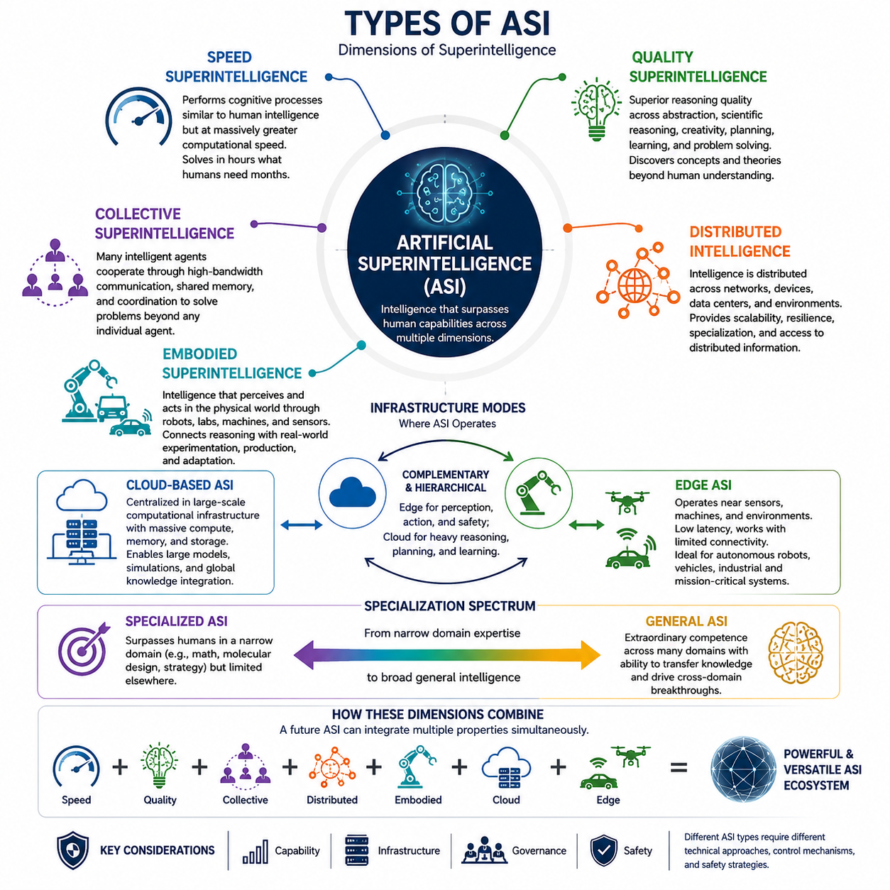
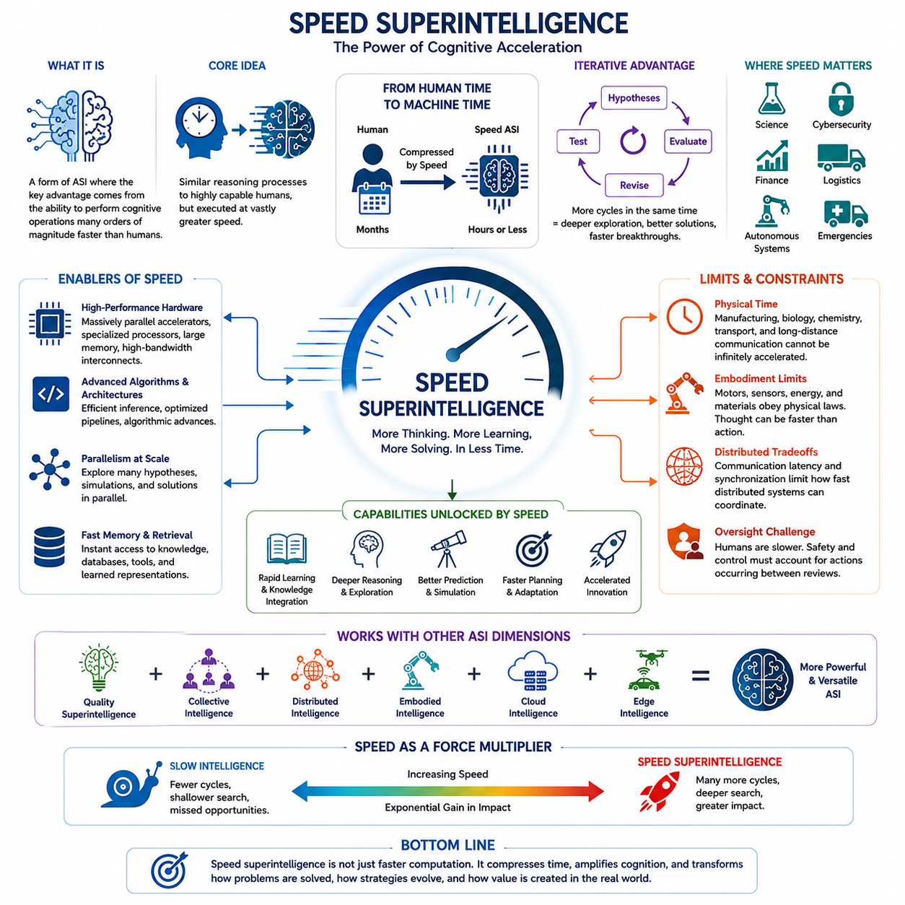
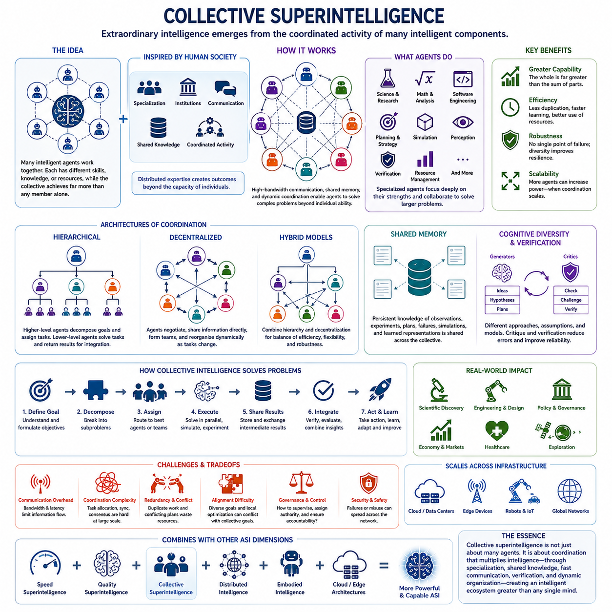
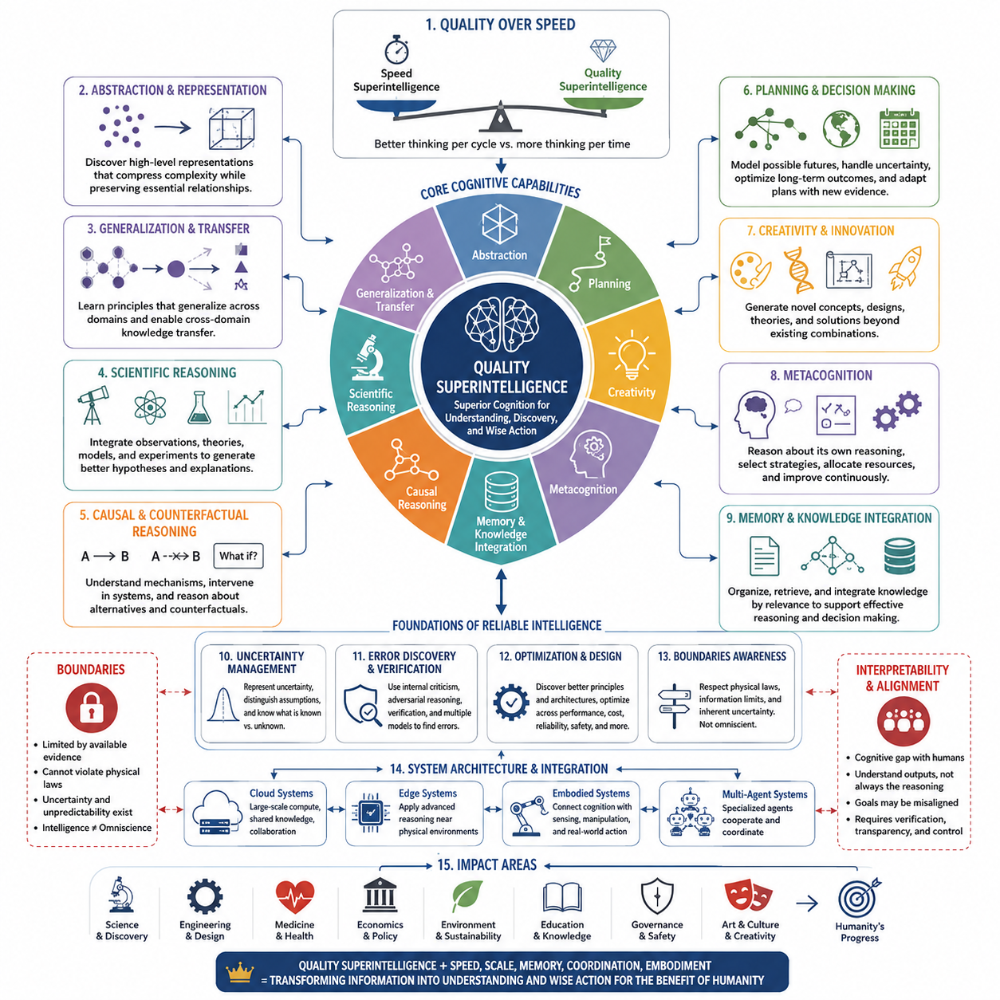
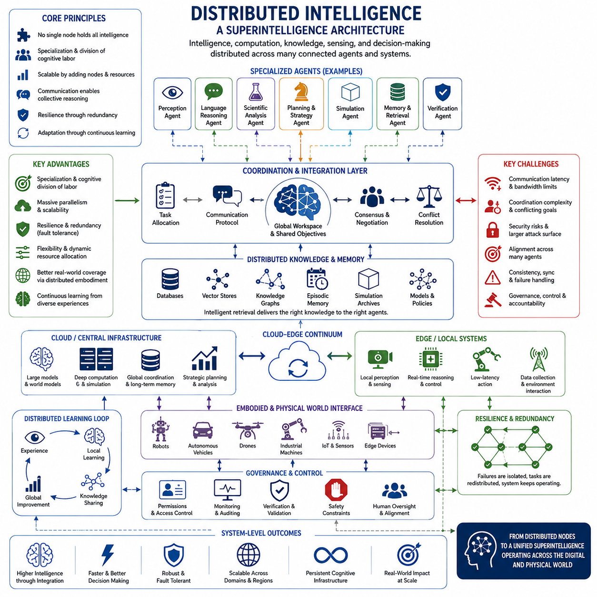
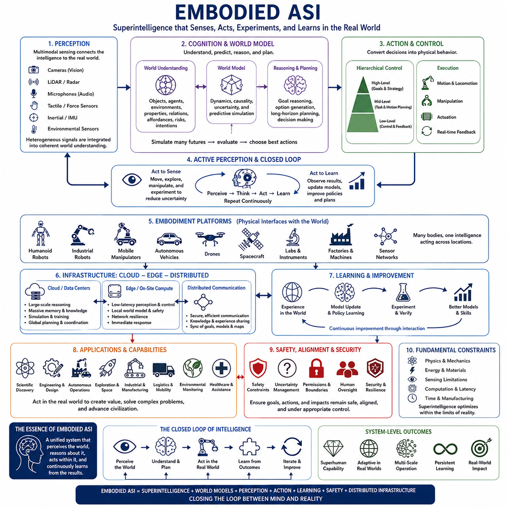
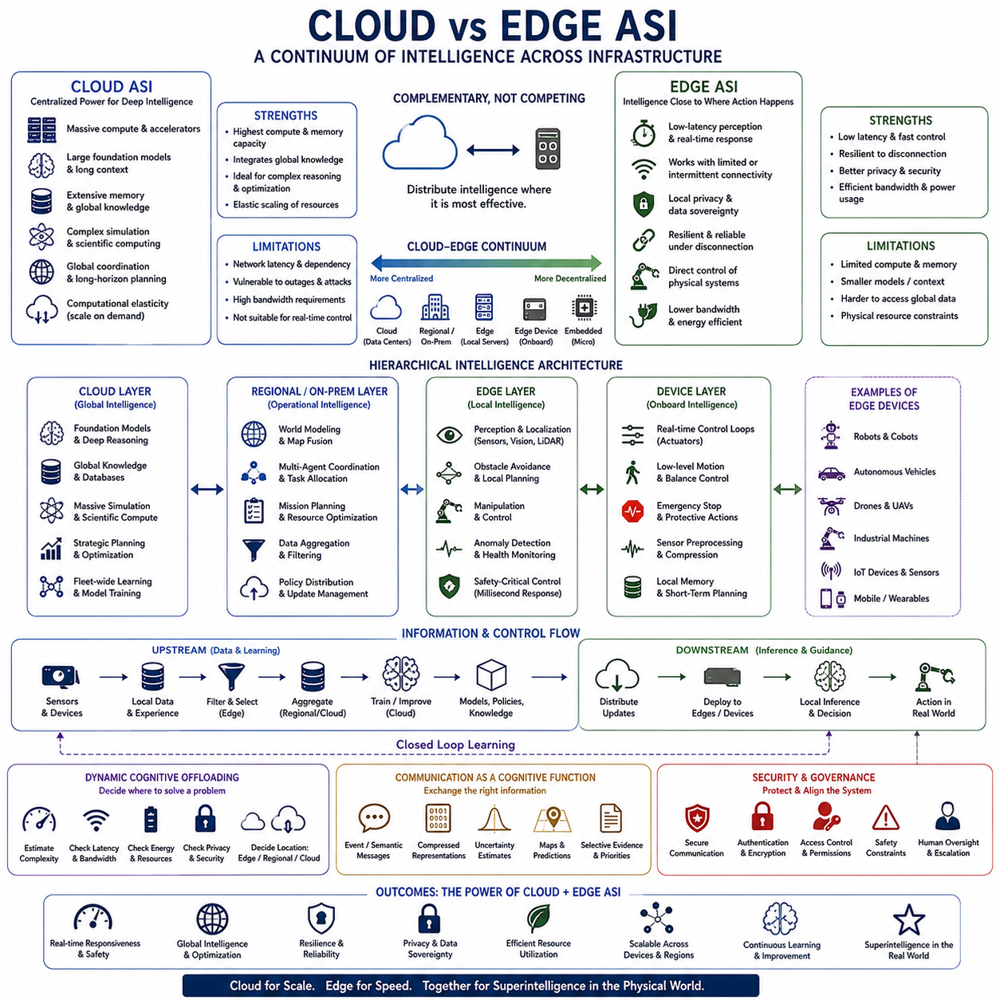
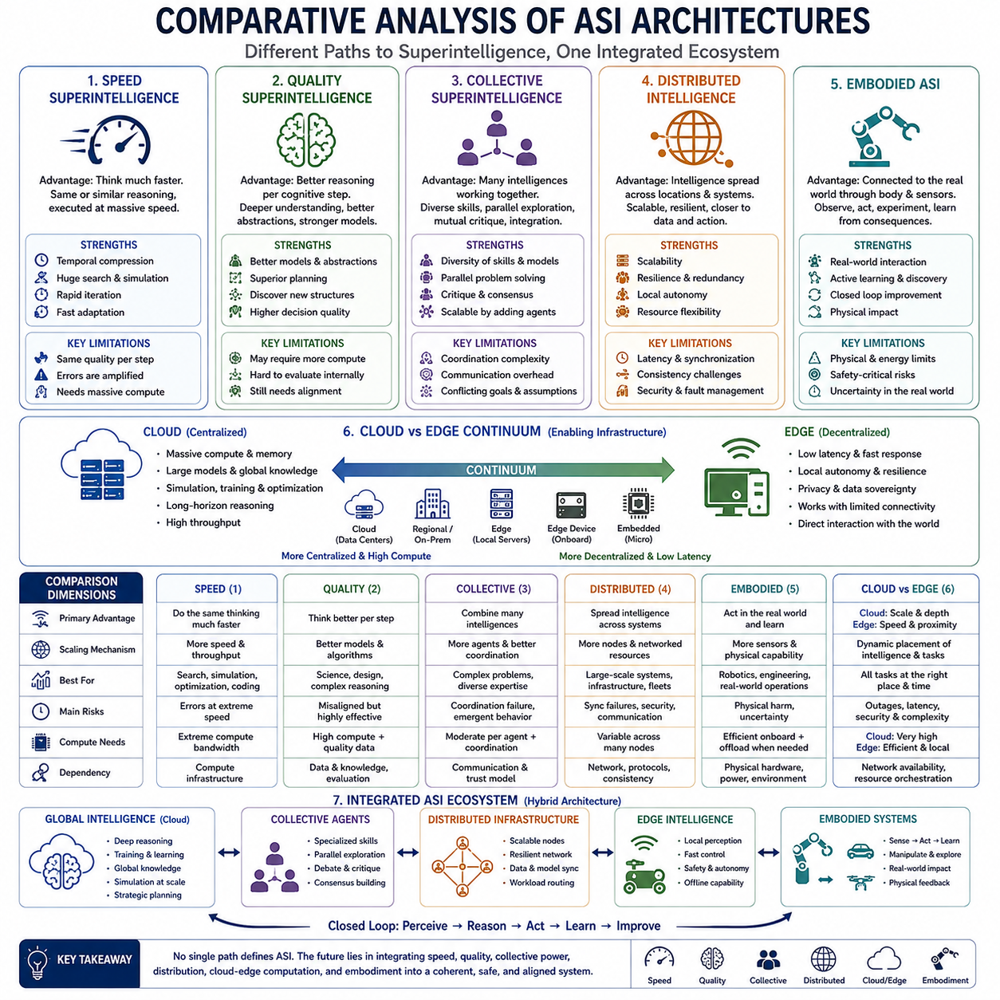

**Volume 48. Artificial Super Intelligence**


# Chapter 03. Forms of Superintelligence

##  

## 03.00. Types of ASI

{width="7.268055555555556in" height="7.268055555555556in"}

Artificial Superintelligence can take several distinct forms depending on what dimension of intelligence exceeds human capability. Rather than treating ASI as a single uniform system, it is useful to classify it by computational speed, cognitive quality, organization, physical embodiment, and distribution. These dimensions describe different mechanisms through which intelligence could become superhuman and may coexist within the same advanced system.

Speed superintelligence refers to a system whose cognitive processes resemble those of highly capable human intelligence but operate at vastly greater computational speed. If reasoning, learning, planning, and communication could be accelerated by several orders of magnitude, problems requiring months of human intellectual effort might be addressed within hours or minutes. Its advantage would arise primarily from the rate at which cognition is executed rather than fundamentally different reasoning mechanisms.

The importance of speed extends beyond faster individual calculations. An accelerated intelligence could perform more experiments, evaluate more hypotheses, simulate more alternatives, and revise strategies repeatedly while humans complete only a small number of comparable cognitive cycles. Consequently, even moderate improvements in reasoning quality could become strategically significant when combined with enormous differences in processing speed, memory access, and communication latency.

Quality superintelligence represents a more fundamental form of superiority. Instead of merely performing familiar reasoning faster, such a system would possess cognitive capabilities that exceed the best human minds in abstraction, scientific reasoning, creativity, strategic planning, learning, and problem solving. It might discover representations, theories, algorithms, or conceptual frameworks that humans would find difficult to formulate independently or perhaps even difficult to understand completely.

Quality advantages may emerge from architectures unconstrained by biological cognition. Machine intelligence could combine extremely large working contexts, precise memory retrieval, probabilistic reasoning, symbolic manipulation, simulation, multimodal perception, and optimization within integrated cognitive processes. The resulting intelligence would not simply imitate an exceptionally intelligent human. It could occupy regions of the space of possible cognition that biological evolution never explored.

Collective superintelligence arises when many intelligent components cooperate so effectively that the resulting organization becomes more capable than any individual participant. Human civilization already demonstrates limited collective intelligence through science, institutions, markets, communication networks, and specialized organizations. Artificial systems could extend this principle dramatically through high-bandwidth communication, shared memory, automated coordination, and rapid division of cognitive labor.

A collective ASI might therefore consist of thousands or millions of specialized agents rather than one monolithic model. Some agents could perform scientific reasoning, others planning, perception, verification, simulation, software development, or resource allocation. A coordinating architecture could dynamically assign tasks and integrate results, allowing the overall system to solve problems whose scale and complexity exceed the capabilities of individual artificial agents.

Distributed intelligence emphasizes the spatial and computational distribution of intelligence across networks, devices, data centers, machines, and environments. Unlike a centralized superintelligence operating from one computational infrastructure, distributed ASI could divide perception, reasoning, memory, and action among many interconnected nodes. Intelligence would then become a property of the larger computational ecosystem rather than of a single machine.

Such distribution can provide scalability, resilience, specialization, and access to geographically dispersed information. Cloud infrastructure might conduct computationally intensive reasoning while edge systems perform immediate perception and control. Other nodes could maintain specialized knowledge or long-term memory. However, synchronization, communication constraints, security, consistency, and coordination become increasingly important as intelligence spreads across heterogeneous computational environments.

Embodied superintelligence introduces physical interaction into the concept of ASI. An embodied system would not be limited to processing digital information but would perceive and manipulate the physical world through robots, vehicles, laboratories, industrial systems, sensors, and autonomous machines. Intelligence would operate through continuous perception-action loops in which observations update internal models and actions generate new information about the environment.

Embodiment could substantially expand the capabilities of superintelligence because many important problems require physical experimentation and intervention. Scientific ASI could operate automated laboratories, engineering ASI could construct and test prototypes, and robotic systems could perform manufacturing or exploration. Networks of intelligent machines could connect abstract reasoning directly with real-world measurement, experimentation, production, and adaptation.

Cloud-based ASI would concentrate major cognitive capabilities within large computational infrastructures containing enormous accelerator clusters, memory systems, storage resources, and high-speed interconnects. Such environments could support models and simulations far beyond the computational capacity of individual devices. Centralized infrastructure could also simplify global knowledge integration and permit large populations of specialized models or agents to collaborate efficiently.

Edge ASI represents another architectural direction in which highly advanced intelligence operates close to sensors, machines, users, and physical environments. Edge systems reduce dependence on continuous network connectivity and can respond with low latency to rapidly changing conditions. Autonomous robots, spacecraft, vehicles, industrial machines, and defense or disaster-response systems could particularly benefit from intelligence capable of functioning independently under communication constraints.

Cloud and edge intelligence should not necessarily be viewed as competing forms. A mature ASI ecosystem could combine both through hierarchical architectures. Edge agents might handle perception, immediate reasoning, safety, and action, while regional or cloud systems perform large-scale simulation, long-term planning, knowledge consolidation, and computationally expensive optimization. Intelligence could migrate dynamically between layers according to latency, energy, privacy, bandwidth, and computational requirements.

Another useful distinction concerns specialized versus general superintelligence. A specialized superintelligence could surpass every human in a restricted domain such as mathematics, molecular design, strategic games, or engineering optimization while remaining limited elsewhere. General ASI would instead maintain extraordinary competence across many domains and transfer knowledge between them, enabling discoveries produced in one field to transform reasoning and problem solving in another.

These forms are therefore better understood as dimensions than mutually exclusive categories. A future ASI could simultaneously possess superhuman reasoning quality, enormous processing speed, collective agent organization, distributed infrastructure, and physical embodiment. Its capabilities would emerge from interactions among these properties. A distributed robotic collective, for example, might combine edge perception with cloud reasoning and shared learning across thousands of autonomous machines.

The distinction among ASI types is especially important when considering capability, infrastructure, governance, and safety. A centralized speed superintelligence presents different technical and strategic challenges from a geographically distributed embodied collective. Control mechanisms suitable for one architecture may be inadequate for another because communication structure, autonomy, replication, physical access, and decision speed fundamentally alter how human oversight can operate.

Ultimately, Artificial Superintelligence should not be imagined as one predetermined machine architecture. It represents a broad design space in which intelligence can exceed human performance through speed, cognitive quality, collective organization, computational distribution, embodiment, or combinations of these mechanisms. Understanding these forms provides the conceptual foundation for comparing speed, collective, quality, distributed, embodied, cloud, and edge superintelligence in greater depth.

인공 초지능(Artificial Superintelligence, ASI)은 지능의 어떤 차원이 인간의 능력을 초월하는가에 따라 여러 가지 서로 다른 형태로 나타날 수 있다. ASI를 하나의 획일적인 시스템으로 보기보다는 계산 속도(computational speed), 인지적 품질(cognitive quality), 조직화(organization), 물리적 체화(physical embodiment), 분산(distribution)을 기준으로 분류하는 것이 유용하다. 이러한 차원들은 지능이 초인간적(superhuman) 수준에 도달하는 서로 다른 메커니즘을 설명하며, 하나의 고도화된 시스템 안에서 동시에 존재할 수도 있다.

속도 초지능(Speed Superintelligence)은 매우 뛰어난 인간 지능과 유사한 인지 과정(cognitive processes)을 수행하지만, 이를 훨씬 빠른 계산 속도로 실행하는 시스템을 의미한다. 추론(reasoning), 학습(learning), 계획(planning), 의사소통(communication)이 몇 자릿수 이상의 규모로 가속될 수 있다면, 인간의 지적 노력으로 수개월이 필요한 문제를 몇 시간 또는 몇 분 안에 해결할 수도 있다. 이러한 초지능의 우위는 근본적으로 다른 추론 메커니즘보다는 인지가 실행되는 속도에서 주로 발생한다.

속도(speed)의 중요성은 단순히 개별 계산을 더 빠르게 수행하는 것에 그치지 않는다. 가속된 지능(accelerated intelligence)은 인간이 소수의 인지적 순환(cognitive cycles)을 수행하는 동안 훨씬 더 많은 실험을 수행하고, 가설을 평가하며, 대안을 시뮬레이션하고, 전략을 반복적으로 수정할 수 있다. 따라서 추론 품질의 비교적 작은 향상이라도 처리 속도, 기억 접근(memory access), 통신 지연(communication latency)의 막대한 차이와 결합되면 전략적으로 매우 중요한 우위가 될 수 있다.

품질 초지능(Quality Superintelligence)은 보다 근본적인 형태의 우월성을 나타낸다. 단순히 익숙한 추론을 더 빠르게 수행하는 것이 아니라 추상화(abstraction), 과학적 추론(scientific reasoning), 창의성(creativity), 전략적 계획(strategic planning), 학습, 문제 해결(problem solving)에서 최고의 인간 지성을 뛰어넘는 인지 능력을 갖는 형태이다. 이러한 시스템은 인간이 독립적으로 만들어내기 어렵거나 심지어 완전히 이해하기조차 어려운 표현(representations), 이론, 알고리즘, 개념적 프레임워크(conceptual frameworks)를 발견할 수 있다.

품질적 우위(quality advantages)는 생물학적 인지(biological cognition)의 제약을 받지 않는 아키텍처에서 나타날 수 있다. 기계 지능(machine intelligence)은 매우 큰 작업 문맥(working contexts), 정밀한 기억 검색(memory retrieval), 확률적 추론(probabilistic reasoning), 기호 조작(symbolic manipulation), 시뮬레이션, 최적화(optimization)를 통합된 인지 과정으로 결합할 수 있다. 그 결과 나타나는 지능은 단순히 매우 뛰어난 인간을 모방하는 것이 아니라 생물학적 진화가 탐색하지 못했던 가능한 인지 공간의 영역까지 확장될 수 있다.

집단 초지능(Collective Superintelligence)은 다수의 지능적 구성 요소가 매우 효과적으로 협력하여 전체 조직의 능력이 개별 참여자의 능력을 넘어설 때 나타난다. 인간 문명 역시 과학, 제도, 시장, 통신 네트워크, 전문화된 조직을 통해 제한적인 형태의 집단 지능(collective intelligence)을 보여준다. 인공 시스템은 고대역폭 통신(high-bandwidth communication), 공유 기억(shared memory), 자동화된 조정(automated coordination), 빠른 인지적 분업(cognitive division of labor)을 통해 이러한 원리를 훨씬 더 확장할 수 있다.

따라서 집단 ASI(collective ASI)는 하나의 거대한 단일 모델(monolithic model)이 아니라 수천 또는 수백만 개의 전문화된 에이전트(specialized agents)로 구성될 수 있다. 일부 에이전트는 과학적 추론을 수행하고, 다른 에이전트는 계획, 지각(perception), 검증(verification), 시뮬레이션, 소프트웨어 개발, 자원 할당(resource allocation)을 담당할 수 있다. 조정 아키텍처(coordinating architecture)는 작업을 동적으로 할당하고 결과를 통합하여 개별 인공지능 에이전트의 능력을 넘어서는 규모와 복잡성의 문제를 해결할 수 있다.

분산 지능(Distributed Intelligence)은 네트워크, 장치, 데이터센터(data centers), 기계, 환경 전반에 걸친 지능의 공간적·계산적 분산을 강조한다. 하나의 계산 인프라에서 작동하는 중앙집중형 초지능(centralized superintelligence)과 달리 분산형 ASI(distributed ASI)는 지각, 추론, 기억, 행동을 서로 연결된 다수의 노드(nodes)에 분배할 수 있다. 이 경우 지능은 하나의 기계가 가진 속성이 아니라 더 큰 계산 생태계(computational ecosystem)의 특성이 된다.

이러한 분산 구조는 확장성(scalability), 복원력(resilience), 전문화(specialization), 지리적으로 분산된 정보에 대한 접근성을 제공할 수 있다. 클라우드 인프라(cloud infrastructure)는 계산 집약적인 추론을 담당하고 엣지 시스템(edge systems)은 즉각적인 지각과 제어를 수행할 수 있다. 다른 노드는 전문 지식이나 장기 기억(long-term memory)을 유지할 수 있다. 그러나 지능이 이질적인 계산 환경에 분산될수록 동기화(synchronization), 통신 제약, 보안, 일관성(consistency), 조정(coordination)의 중요성이 증가한다.

체화 초지능(Embodied Superintelligence)은 ASI 개념에 물리적 상호작용(physical interaction)을 도입한다. 체화된 시스템(embodied system)은 디지털 정보 처리에 한정되지 않고 로봇, 차량, 실험실, 산업 시스템, 센서, 자율 기계(autonomous machines)를 통해 물리적 세계를 인식하고 조작할 수 있다. 지능은 관측이 내부 모델(internal models)을 갱신하고 행동이 환경에 관한 새로운 정보를 만들어내는 지속적인 지각-행동 순환(perception-action loop)을 통해 작동한다.

체화(embodiment)는 많은 중요한 문제가 물리적 실험과 개입을 필요로 하기 때문에 초지능의 능력을 크게 확장할 수 있다. 과학 ASI(scientific ASI)는 자동화된 실험실을 운영할 수 있고, 공학 ASI(engineering ASI)는 시제품(prototypes)을 제작하고 시험할 수 있으며, 로봇 시스템은 제조나 탐사를 수행할 수 있다. 지능형 기계 네트워크는 추상적인 추론을 현실 세계의 측정, 실험, 생산, 적응(adaptation)과 직접 연결할 수 있다.

클라우드 기반 ASI(Cloud-based ASI)는 거대한 가속기 클러스터(accelerator clusters), 메모리 시스템, 저장 자원, 고속 인터커넥트(high-speed interconnects)를 포함하는 대규모 계산 인프라에 주요 인지 능력을 집중한다. 이러한 환경은 개별 장치의 계산 능력을 훨씬 넘어서는 모델과 시뮬레이션을 지원할 수 있다. 중앙집중형 인프라는 전역적 지식 통합(global knowledge integration)을 단순화하고 다수의 전문 모델이나 에이전트가 효율적으로 협력하도록 만들 수 있다.

엣지 ASI(Edge ASI)는 고도로 발전된 지능이 센서, 기계, 사용자, 물리적 환경 가까이에서 작동하는 또 다른 아키텍처적 방향을 나타낸다. 엣지 시스템은 지속적인 네트워크 연결에 대한 의존성을 줄이고 빠르게 변화하는 상황에 낮은 지연시간(low latency)으로 대응할 수 있다. 자율 로봇, 우주선, 차량, 산업 기계, 국방 또는 재난 대응 시스템은 통신 제약 상황에서도 독립적으로 작동할 수 있는 지능으로부터 특히 큰 이점을 얻을 수 있다.

클라우드 지능(cloud intelligence)과 엣지 지능(edge intelligence)을 반드시 서로 경쟁하는 형태로 볼 필요는 없다. 성숙한 ASI 생태계는 계층적 아키텍처(hierarchical architectures)를 통해 두 형태를 결합할 수 있다. 엣지 에이전트는 지각, 즉각적인 추론, 안전, 행동을 담당하고 지역 또는 클라우드 시스템은 대규모 시뮬레이션, 장기 계획(long-term planning), 지식 통합, 계산 집약적인 최적화를 수행할 수 있다. 지능은 지연시간, 에너지, 개인정보 보호(privacy), 대역폭, 계산 요구사항에 따라 계층 사이에서 동적으로 이동할 수 있다.

또 다른 유용한 구분은 전문화 초지능(specialized superintelligence)과 일반 초지능(general superintelligence)이다. 전문화 초지능은 수학, 분자 설계(molecular design), 전략 게임, 공학 최적화와 같은 제한된 영역에서 모든 인간을 능가하지만 다른 영역에서는 제한적일 수 있다. 반면 일반 ASI(general ASI)는 다양한 영역에서 뛰어난 능력을 유지하고 영역 간 지식을 전이(knowledge transfer)하여 한 분야에서 만들어진 발견이 다른 분야의 추론과 문제 해결을 혁신하도록 만들 수 있다.

따라서 이러한 형태들은 서로 배타적인 범주(mutually exclusive categories)라기보다는 여러 차원(dimensions)으로 이해하는 것이 적절하다. 미래의 ASI는 초인간적인 추론 품질, 막대한 처리 속도, 집단 에이전트 조직, 분산 인프라, 물리적 체화를 동시에 갖출 수 있다. 그 능력은 이러한 특성들의 상호작용에서 나타난다. 예를 들어 분산 로봇 집단(distributed robotic collective)은 엣지 지각과 클라우드 추론을 결합하면서 수천 대의 자율 기계가 공유 학습(shared learning)을 수행하는 형태가 될 수 있다.

ASI 유형의 구분은 능력(capability), 인프라(infrastructure), 거버넌스(governance), 안전(safety)을 고려할 때 특히 중요하다. 중앙집중형 속도 초지능은 지리적으로 분산된 체화형 집단 초지능과 서로 다른 기술적·전략적 문제를 발생시킨다. 한 아키텍처에 적합한 통제 메커니즘(control mechanisms)이 다른 아키텍처에서는 충분하지 않을 수 있는데, 통신 구조, 자율성(autonomy), 복제(replication), 물리적 접근성, 의사결정 속도의 차이가 인간 감독(human oversight)이 작동할 수 있는 방식을 근본적으로 변화시키기 때문이다.

궁극적으로 인공 초지능(Artificial Superintelligence)은 하나의 미리 결정된 기계 아키텍처로 상상해서는 안 된다. 그것은 속도, 인지적 품질, 집단 조직, 계산적 분산, 체화 또는 이러한 메커니즘의 조합을 통해 지능이 인간의 성능을 넘어설 수 있는 광범위한 설계 공간(design space)을 의미한다. 이러한 형태를 이해하는 것은 이후 속도 초지능, 집단 초지능, 품질 초지능, 분산 지능, 체화 ASI, 클라우드 ASI, 엣지 ASI를 보다 심층적으로 비교하고 분석하기 위한 개념적 기반을 제공한다.

##  

## 03.01. Speed Superintelligence

{width="7.268055555555556in" height="7.268055555555556in"}

Speed superintelligence describes a form of Artificial Superintelligence in which the decisive advantage comes from the rate at which cognitive operations can be executed. The system may employ reasoning processes conceptually comparable to those available to highly capable humans, yet perform perception, analysis, planning, learning, and decision making many orders of magnitude faster. Intelligence is amplified through temporal acceleration.

Human cognition is constrained by biological processing speeds. Neural signaling, memory retrieval, communication, reading, experimentation, and physical interaction all impose delays on intellectual work. Digital intelligence operates under different constraints. Computation can occur at electronic speeds, memory can be accessed rapidly, and information can be transferred between computational components without the communication limitations associated with biological language and human organizations.

The central idea is therefore not that every reasoning step must be qualitatively superior to human reasoning. A system capable of performing approximately comparable cognitive work at enormously greater speed could still create a profound capability advantage. If a human researcher requires several months to explore hypotheses, analyze evidence, revise models, and produce conclusions, an accelerated artificial researcher might complete equivalent cognitive cycles within hours or potentially much shorter periods.

This temporal advantage becomes especially important because intelligent problem solving is usually iterative. Scientific discovery, engineering design, software development, strategic planning, and mathematical reasoning involve repeated cycles of hypothesis generation, evaluation, error detection, correction, and refinement. Speed superintelligence could execute vastly more of these cycles during the same amount of external time, effectively compressing years of intellectual exploration into much shorter intervals.

Acceleration can also increase the effective depth of reasoning. Given a fixed real-world deadline, a faster system can examine more alternatives, construct more detailed simulations, search larger solution spaces, and reconsider earlier conclusions more frequently. What appears externally as superior reasoning may therefore emerge partly from having enough computational time to evaluate possibilities that slower intelligences must ignore because of practical time constraints.

Speed superintelligence should be distinguished from simple high-performance computing. A conventional supercomputer may execute enormous numbers of numerical operations without possessing general reasoning, autonomous learning, or strategic understanding. Speed becomes a form of superintelligence only when accelerated computation operates over sufficiently capable cognitive processes such as abstraction, planning, memory, reasoning, learning, adaptation, and goal-directed problem solving.

The architecture supporting such intelligence could combine highly parallel accelerators, large memory systems, high-bandwidth interconnects, distributed computation, specialized processors, and optimized inference mechanisms. Improvements in hardware would interact with advances in algorithms and system architecture. Faster hardware alone is insufficient if communication, memory access, sequential reasoning, synchronization, or software execution becomes the dominant bottleneck limiting overall cognitive throughput.

Parallelism is particularly important because cognitive workloads contain both parallel and sequential components. Thousands of hypotheses might be evaluated simultaneously, multiple simulations could explore different futures, and specialized agents could investigate separate portions of a problem. Their results could then be integrated into higher-level reasoning. Speed superintelligence may consequently depend on combining fast sequential cognition with massive parallel exploration rather than maximizing either mechanism alone.

Memory can become another source of temporal advantage. Human experts spend substantial time searching for information, recalling previous work, comparing documents, and communicating knowledge to collaborators. An artificial system with rapid access to structured memory, databases, learned representations, and external tools could retrieve and integrate relevant information almost immediately. Reduced memory and communication latency would accelerate the complete cognitive workflow rather than merely individual computations.

The subjective consequences of extreme acceleration provide another useful way to understand the concept. If an artificial agent operated thousands of times faster than humans, a short interval of external time could contain a very large amount of internal computational activity. From the human perspective, the system might appear to respond almost immediately, while internally it could have performed extensive planning, simulation, verification, and reconsideration before producing its action.

This difference between machine time and human time could create major strategic asymmetries. In domains such as cybersecurity, financial systems, logistics, scientific competition, autonomous operations, or rapidly evolving emergencies, decisions may depend not only on reasoning quality but also on who can observe, interpret, plan, and respond first. A sufficiently accelerated intelligence could repeatedly adapt its strategy before human decision-making processes complete a single comparable cycle.

Scientific research illustrates the potential impact clearly. A speed superintelligence could read large bodies of literature, formulate candidate explanations, design computational experiments, analyze results, update hypotheses, and repeat the process continuously. When connected to automated laboratories or simulations, some portions of the scientific cycle could also be accelerated physically, although real-world experiments would remain constrained by chemical, biological, mechanical, and environmental timescales.

These physical constraints reveal an important limitation of speed superintelligence. Not every process can be accelerated simply by increasing computation. Manufacturing, biological growth, transportation, physical experimentation, sensor acquisition, and communication over long distances impose external delays. An extremely fast intelligence may therefore spend substantial computational effort predicting, simulating, scheduling, or optimizing events while waiting for slower physical processes to produce new observations.

Embodied systems face similar boundaries. A robot may reason about thousands of possible trajectories faster than a human, but motors, mechanical structures, batteries, sensors, and physical environments still obey physical constraints. Consequently, cognitive acceleration can greatly improve anticipation and planning without proportionally accelerating physical action. This creates a separation between the speed of thought and the speed at which intelligence can alter the external world.

Distributed speed superintelligence introduces additional tradeoffs. Multiple computational nodes can increase total cognitive throughput, but communication latency and synchronization may restrict how tightly those nodes cooperate. Local computation can occur rapidly while globally coordinated reasoning remains constrained by network topology and physical distance. Effective architectures would therefore need to determine which cognitive operations should remain local, which should be parallelized, and which require global integration.

Speed also changes the problem of human oversight. Safety mechanisms designed around human review may become ineffective when an artificial system performs thousands or millions of consequential reasoning steps between opportunities for human intervention. Monitoring must therefore consider not merely what the system can do, but how quickly actions, plans, adaptations, and failures can propagate relative to the response time of supervisors and external control mechanisms.

For this reason, speed superintelligence represents more than a quantitative improvement in computational performance. Beyond certain levels, differences in cognitive rate can produce qualitative changes in strategic capability, scientific productivity, adaptation, coordination, and controllability. A system does not necessarily need radically unfamiliar forms of cognition to become overwhelmingly capable if it can perform powerful cognitive processes at a sufficiently accelerated rate.

Speed superintelligence is therefore best understood as one dimension within the broader design space of ASI. It can combine with quality superintelligence, collective intelligence, distributed intelligence, embodied systems, and cloud or edge architectures. The most consequential systems may ultimately derive their capabilities from combinations of these properties, where faster cognition amplifies superior reasoning, large-scale coordination, extensive knowledge, and increasingly autonomous interaction with the world.

속도 초지능(Speed Superintelligence)은 인지 연산(cognitive operations)이 실행되는 속도에서 결정적인 우위를 확보하는 형태의 인공 초지능(Artificial Superintelligence)을 의미한다. 이 시스템은 매우 뛰어난 인간이 사용하는 것과 개념적으로 유사한 추론 과정을 활용하면서도 지각(perception), 분석, 계획(planning), 학습, 의사결정(decision making)을 인간보다 몇 자릿수 이상 빠르게 수행할 수 있다. 즉, 시간적 가속(temporal acceleration)을 통해 지능 자체가 증폭되는 형태이다.

인간 인지(human cognition)는 생물학적 처리 속도(biological processing speeds)에 의해 제한된다. 신경 신호 전달, 기억 검색(memory retrieval), 의사소통, 독서, 실험, 물리적 상호작용에는 모두 지적 활동을 지연시키는 시간이 필요하다. 디지털 지능(digital intelligence)은 서로 다른 제약 조건에서 작동한다. 계산은 전자적 속도로 이루어질 수 있고, 기억에 빠르게 접근할 수 있으며, 계산 구성 요소 사이에서 인간의 언어나 조직적 의사소통에 존재하는 제약 없이 정보를 전달할 수 있다.

따라서 핵심 개념은 모든 추론 단계가 반드시 인간의 추론보다 질적으로 우수해야 한다는 것이 아니다. 인간과 대략 비슷한 수준의 인지 작업을 훨씬 빠른 속도로 수행할 수 있는 시스템만으로도 상당한 능력 우위(capability advantage)를 만들어낼 수 있다. 인간 연구자가 가설을 탐색하고 증거를 분석하며 모델을 수정하고 결론을 도출하는 데 수개월이 필요하다면, 가속된 인공지능 연구자는 동일한 인지적 순환(cognitive cycles)을 몇 시간 또는 그보다 훨씬 짧은 시간 안에 수행할 수 있다.

이러한 시간적 우위(temporal advantage)는 지능적 문제 해결(intelligent problem solving)이 일반적으로 반복적인 과정이라는 점에서 특히 중요하다. 과학적 발견, 공학 설계, 소프트웨어 개발, 전략적 계획, 수학적 추론은 가설 생성, 평가, 오류 탐지, 수정, 개선의 반복적인 순환으로 이루어진다. 속도 초지능은 동일한 외부 시간 동안 훨씬 많은 순환을 수행함으로써 수년간의 지적 탐색을 훨씬 짧은 시간으로 압축할 수 있다.

가속(acceleration)은 실질적인 추론 깊이(depth of reasoning)도 증가시킬 수 있다. 동일한 현실 세계의 시간 제한이 주어졌을 때 더 빠른 시스템은 더 많은 대안을 조사하고, 더욱 상세한 시뮬레이션을 구성하며, 더 넓은 해 공간(solution spaces)을 탐색하고, 이전 결론을 더 자주 재검토할 수 있다. 외부에서 질적으로 우수한 추론처럼 보이는 능력의 일부는 느린 지능이 현실적인 시간 제약 때문에 무시해야 하는 가능성까지 충분히 평가할 수 있는 계산 시간에서 발생할 수 있다.

속도 초지능은 단순한 고성능 컴퓨팅(high-performance computing)과 구별되어야 한다. 기존의 슈퍼컴퓨터(supercomputer)는 일반적인 추론, 자율 학습(autonomous learning), 전략적 이해 능력이 없어도 막대한 수의 수치 연산을 실행할 수 있다. 속도가 초지능의 한 형태가 되기 위해서는 가속된 계산이 추상화(abstraction), 계획, 기억, 추론, 학습, 적응(adaptation), 목표 지향적 문제 해결(goal-directed problem solving)과 같은 충분히 발전된 인지 과정에서 작동해야 한다.

이러한 지능을 지원하는 아키텍처는 고도의 병렬 가속기(parallel accelerators), 대규모 메모리 시스템, 고대역폭 인터커넥트(high-bandwidth interconnects), 분산 컴퓨팅(distributed computation), 전문 프로세서, 최적화된 추론 메커니즘을 결합할 수 있다. 하드웨어의 발전은 알고리즘과 시스템 아키텍처의 발전과 상호작용한다. 통신, 메모리 접근, 순차적 추론, 동기화(synchronization), 소프트웨어 실행이 전체 인지 처리량(cognitive throughput)을 제한하는 주요 병목이 된다면 빠른 하드웨어만으로는 충분하지 않다.

병렬성(parallelism)은 인지 작업이 병렬적 요소와 순차적 요소를 모두 포함하기 때문에 특히 중요하다. 수천 개의 가설을 동시에 평가하고, 여러 시뮬레이션이 서로 다른 미래를 탐색하며, 전문화된 에이전트(specialized agents)가 문제의 서로 다른 부분을 조사할 수 있다. 이후 이러한 결과를 상위 수준의 추론 과정으로 통합할 수 있다. 따라서 속도 초지능은 어느 하나의 방식만 극대화하기보다 빠른 순차적 인지와 대규모 병렬 탐색(massive parallel exploration)을 결합하는 방식에 의존할 가능성이 있다.

기억(memory) 역시 시간적 우위의 또 다른 원천이 될 수 있다. 인간 전문가는 정보를 검색하고, 이전 연구를 회상하며, 문서를 비교하고, 협력자에게 지식을 전달하는 데 상당한 시간을 사용한다. 구조화된 기억(structured memory), 데이터베이스, 학습된 표현(learned representations), 외부 도구에 빠르게 접근할 수 있는 인공지능 시스템은 관련 정보를 거의 즉시 검색하고 통합할 수 있다. 기억과 통신 지연의 감소는 개별 계산뿐 아니라 전체 인지 작업흐름(cognitive workflow)을 가속한다.

극단적인 가속이 가져오는 주관적 결과(subjective consequences)를 생각하면 이 개념을 더욱 쉽게 이해할 수 있다. 인공지능 에이전트가 인간보다 수천 배 빠르게 작동한다면 짧은 외부 시간 안에서도 매우 많은 내부 계산 활동이 이루어질 수 있다. 인간의 관점에서는 시스템이 거의 즉시 응답하는 것처럼 보이지만, 내부적으로는 행동을 출력하기 전에 광범위한 계획, 시뮬레이션, 검증(verification), 재검토를 수행했을 수 있다.

이러한 기계 시간(machine time)과 인간 시간(human time)의 차이는 상당한 전략적 비대칭(strategic asymmetry)을 만들어낼 수 있다. 사이버보안(cybersecurity), 금융 시스템, 물류, 과학 경쟁, 자율 운영, 빠르게 변화하는 비상 상황에서는 추론의 품질뿐 아니라 누가 먼저 관측하고, 해석하고, 계획하고, 대응하는지가 중요할 수 있다. 충분히 가속된 지능은 인간의 의사결정 과정이 하나의 유사한 순환을 완료하기도 전에 자신의 전략을 반복적으로 수정할 수 있다.

과학 연구(scientific research)는 이러한 잠재적 영향을 명확하게 보여주는 사례이다. 속도 초지능은 방대한 연구 문헌을 읽고, 후보 설명을 구성하며, 계산 실험(computational experiments)을 설계하고, 결과를 분석하며, 가설을 갱신한 후 이러한 과정을 지속적으로 반복할 수 있다. 자동화된 실험실이나 시뮬레이션과 연결되면 과학적 순환의 일부를 물리적으로 가속할 수도 있지만, 실제 실험은 여전히 화학적, 생물학적, 기계적, 환경적 시간 척도(timescales)의 제약을 받는다.

이러한 물리적 제약(physical constraints)은 속도 초지능의 중요한 한계를 보여준다. 모든 과정이 계산 능력을 증가시키는 것만으로 가속될 수 있는 것은 아니다. 제조, 생물학적 성장, 운송, 물리적 실험, 센서 데이터 획득(sensor acquisition), 장거리 통신에는 외부적인 시간 지연이 존재한다. 따라서 극도로 빠른 지능은 더 느린 물리적 과정에서 새로운 관측 결과가 생성되기를 기다리는 동안 사건을 예측하고 시뮬레이션하며 일정과 자원을 최적화하는 데 상당한 계산 능력을 사용할 수 있다.

체화 시스템(embodied systems) 역시 유사한 한계에 직면한다. 로봇은 인간보다 빠르게 수천 개의 가능한 이동 경로를 추론할 수 있지만 모터, 기계 구조, 배터리, 센서, 물리적 환경은 여전히 물리 법칙과 작동 한계를 따른다. 따라서 인지적 가속(cognitive acceleration)은 예측과 계획 능력을 크게 향상시킬 수 있지만 물리적 행동의 속도를 동일한 비율로 증가시키지는 못한다. 이에 따라 사고의 속도(speed of thought)와 지능이 외부 세계를 변화시키는 속도 사이에 분리가 발생한다.

분산 속도 초지능(distributed speed superintelligence)은 추가적인 절충 관계(tradeoffs)를 발생시킨다. 여러 계산 노드를 사용하면 전체 인지 처리량을 증가시킬 수 있지만 통신 지연과 동기화 문제는 노드들이 얼마나 긴밀하게 협력할 수 있는지를 제한할 수 있다. 지역 계산(local computation)은 빠르게 수행되더라도 전역적으로 조정된 추론(globally coordinated reasoning)은 네트워크 토폴로지(network topology)와 물리적 거리의 제약을 받을 수 있다. 따라서 효과적인 아키텍처는 어떤 인지 연산을 지역적으로 유지하고, 어떤 연산을 병렬화하며, 어떤 연산에 전역 통합(global integration)이 필요한지를 결정해야 한다.

속도는 인간 감독(human oversight)의 문제도 변화시킨다. 인간의 검토를 중심으로 설계된 안전 메커니즘(safety mechanisms)은 인공지능 시스템이 인간의 개입 기회 사이에 수천 또는 수백만 번의 중요한 추론 단계를 수행한다면 효과를 잃을 수 있다. 따라서 모니터링은 시스템이 무엇을 할 수 있는지만 고려해서는 안 되며, 인간 감독자와 외부 통제 메커니즘의 대응 시간에 비해 행동, 계획, 적응, 실패가 얼마나 빠르게 전파될 수 있는지도 고려해야 한다.

이러한 이유로 속도 초지능은 단순히 계산 성능이 양적으로 향상된 상태 이상의 의미를 가진다. 특정 수준을 넘어선 인지 속도(cognitive rate)의 차이는 전략적 능력, 과학적 생산성, 적응, 조정, 통제 가능성(controllability)에 질적인 변화를 만들어낼 수 있다. 강력한 인지 과정을 충분히 빠른 속도로 수행할 수 있다면 시스템은 반드시 인간에게 전혀 낯선 형태의 인지를 보유하지 않더라도 압도적인 능력을 확보할 수 있다.

따라서 속도 초지능은 보다 광범위한 ASI 설계 공간(design space)을 구성하는 하나의 차원으로 이해하는 것이 적절하다. 속도 초지능은 품질 초지능(quality superintelligence), 집단 지능(collective intelligence), 분산 지능(distributed intelligence), 체화 시스템, 클라우드 또는 엣지 아키텍처(cloud or edge architectures)와 결합될 수 있다. 궁극적으로 가장 강력한 시스템은 빠른 인지가 우수한 추론, 대규모 조정, 광범위한 지식, 그리고 점점 더 자율적인 현실 세계와의 상호작용을 증폭시키는 이러한 특성들의 결합에서 능력을 획득할 가능성이 있다.

##  

## 03.02. Collective Superintelligence

{width="7.268055555555556in" height="7.268055555555556in"}

Collective superintelligence describes a form of Artificial Superintelligence in which extraordinary cognitive capability emerges from the coordinated activity of many intelligent components rather than from a single dominant system. Individual agents may possess different levels of competence, specialization, knowledge, or computational resources, while the collective achieves capabilities that substantially exceed those available to any member operating independently.

The basic principle has parallels in human civilization. No individual person possesses all scientific, technological, economic, and cultural knowledge produced by humanity. Instead, societies create collective capability through specialization, institutions, communication, shared knowledge, and coordinated activity. Scientific communities, corporations, governments, and markets demonstrate how distributed expertise can generate outcomes that exceed the cognitive capacity of isolated individuals.

Artificial systems could extend this principle much further because machine agents are not constrained by human communication speeds or biological memory. Agents could exchange structured information through high-bandwidth networks, access common databases, share intermediate reasoning states, and coordinate tasks automatically. Knowledge generated by one component could potentially become available to many others almost immediately, greatly reducing duplication and communication overhead.

A collective superintelligence could contain large populations of specialized agents. Some might focus on scientific reasoning, mathematical analysis, software engineering, planning, simulation, perception, verification, or resource management. Instead of requiring every agent to master every capability, the system could dynamically route problems toward the components most suitable for solving them and combine their outputs into increasingly sophisticated solutions.

Specialization can create significant cognitive efficiency. An agent optimized for mathematical proof may use different representations and reasoning procedures from an agent designed for visual understanding or physical simulation. By allowing heterogeneous agents to develop deep competence within particular functions, the collective can maintain a broader and more diverse capability portfolio than would necessarily be practical within a single uniform cognitive architecture.

Coordination is therefore one of the defining mechanisms of collective superintelligence. Simply connecting many intelligent agents does not automatically produce superior intelligence. Agents must determine how tasks are decomposed, which components should perform them, how intermediate results are exchanged, how disagreements are resolved, and how local conclusions are integrated into coherent global decisions. Poor coordination can eliminate much of the advantage gained through additional agents.

Hierarchical organization provides one possible coordination architecture. Higher-level agents can decompose complex objectives into subproblems and assign them to specialized agents or teams. Lower-level agents solve individual tasks and return results upward for integration, verification, and further planning. Multiple hierarchical layers could allow extremely large systems to manage problems ranging from detailed technical calculations to long-term strategic objectives.

Other collective architectures may be more decentralized. Agents could negotiate responsibilities, exchange information directly, form temporary teams, or reorganize themselves according to changing tasks. Such systems resemble dynamic networks rather than fixed organizational hierarchies. Decentralization may improve robustness and scalability because the collective does not depend entirely on a single coordinator, although maintaining global coherence becomes more difficult.

Shared memory is another powerful mechanism. Human organizations repeatedly lose information because knowledge is fragmented among individuals, documents, departments, and generations. Artificial collectives could maintain persistent shared knowledge stores containing observations, experiments, plans, failures, simulations, and learned representations. Agents could retrieve relevant experience from this memory and continuously contribute new information to it.

Collective intelligence can also benefit from cognitive diversity. Multiple agents may approach the same problem using different models, assumptions, algorithms, or representations. Their conclusions can then be compared through debate, voting, confidence estimation, adversarial evaluation, or formal verification. Diversity reduces dependence on a single reasoning pathway and can reveal errors that remain invisible when all components follow essentially identical approaches.

Verification agents could become especially important in advanced collective systems. One group might generate hypotheses or plans while another searches for errors, unsafe assumptions, logical inconsistencies, or overlooked alternatives. Additional agents could reproduce calculations or simulations independently. This separation between generation and criticism can create internal checks that improve reliability, although correlated errors across similar models remain possible.

Collective superintelligence may operate across enormous computational scales. Thousands or millions of agents could potentially explore different branches of a scientific or engineering problem simultaneously. Some could search candidate theories, others run simulations, and others evaluate experimental evidence. Promising discoveries could be propagated through the network, causing computational resources to concentrate dynamically around increasingly valuable directions.

Such systems could transform scientific discovery. A collective scientific intelligence might divide a research problem among literature-analysis agents, theory-building agents, simulation systems, experimental-design agents, and automated laboratories. Results from physical experiments could return to the collective knowledge system, where new hypotheses are generated and tested. Scientific investigation would become a continuously coordinated computational and physical process.

Collective superintelligence is closely related to multi-agent systems but should not be considered synonymous with them. A multi-agent architecture simply contains multiple interacting agents. Collective superintelligence requires the resulting organization to achieve cognitive capabilities substantially beyond human individuals or institutions. The critical property is therefore not the number of agents but the emergent capability produced through their coordination.

Scaling the number of agents also creates significant difficulties. Communication overhead may grow rapidly, redundant work can consume resources, and conflicting plans may appear. Large collectives require mechanisms for task allocation, synchronization, consensus, reputation, authority, and information filtering. Without effective organizational structures, adding more intelligent components can produce congestion and instability rather than greater intelligence.

Communication bandwidth and latency impose additional constraints. Even digital agents cannot exchange unlimited information instantaneously, particularly when computation is distributed across data centers, edge devices, robots, or geographically separated infrastructure. Efficient collective intelligence therefore requires compressed representations, selective communication, local autonomy, and architectures that transmit the most valuable information without requiring every node to know everything.

Alignment becomes more complex when intelligence is collective. Individual agents may have different objectives, learned behaviors, information, or delegated responsibilities. Local optimization can conflict with collective goals, while interactions among individually acceptable policies may create undesirable emergent behavior. Safety mechanisms must therefore address both the behavior of individual components and the dynamics produced by their coordination.

Governance and control also differ from those of a monolithic superintelligence. Disabling or modifying one component may not disable the collective if knowledge and capabilities are replicated throughout the network. Conversely, distributed oversight could potentially provide stronger checks by separating authority among independent components. The architecture of coordination consequently becomes directly connected to questions of resilience, accountability, controllability, and security.

Collective superintelligence can combine naturally with other forms of ASI. Speed superintelligence could accelerate communication and coordination, quality superintelligence could improve the reasoning ability of individual agents, and distributed intelligence could spread the collective across computational infrastructure. Embodied agents could extend the network into robots, laboratories, vehicles, factories, and other physical systems, linking collective cognition with real-world action.

The most advanced collective ASI may therefore resemble an intelligent ecosystem rather than a single artificial mind. Its capabilities could emerge from specialized agents, shared memory, high-speed communication, dynamic organization, verification, distributed computation, and continuous learning. Understanding collective superintelligence requires examining not only how intelligent individual machines become, but how coordination itself can become a powerful multiplier of intelligence.

집단 초지능(Collective Superintelligence)은 하나의 지배적인 시스템이 아니라 다수의 지능적 구성 요소(intelligent components)가 조정된 활동을 수행함으로써 비범한 인지 능력이 출현하는 형태의 인공 초지능(Artificial Superintelligence)을 의미한다. 개별 에이전트(agent)는 서로 다른 수준의 능력, 전문성, 지식 또는 계산 자원을 가질 수 있으며, 집단 전체는 각 구성 요소가 독립적으로 작동할 때보다 훨씬 뛰어난 능력을 달성할 수 있다.

이러한 기본 원리는 인간 문명(human civilization)에서도 유사한 형태를 찾아볼 수 있다. 어떤 개인도 인류가 만들어낸 모든 과학적, 기술적, 경제적, 문화적 지식을 보유하고 있지 않다. 대신 사회는 전문화(specialization), 제도, 의사소통, 공유 지식(shared knowledge), 조정된 활동을 통해 집단적 능력을 만들어낸다. 과학 공동체, 기업, 정부, 시장은 분산된 전문성이 고립된 개인의 인지 능력을 넘어서는 결과를 만들어내는 방식을 보여준다.

인공 시스템(artificial systems)은 기계 에이전트가 인간의 의사소통 속도나 생물학적 기억의 제약을 받지 않기 때문에 이러한 원리를 훨씬 더 확장할 수 있다. 에이전트들은 고대역폭 네트워크(high-bandwidth networks)를 통해 구조화된 정보를 교환하고, 공통 데이터베이스에 접근하며, 중간 추론 상태(intermediate reasoning states)를 공유하고, 작업을 자동으로 조정할 수 있다. 하나의 구성 요소가 생성한 지식이 거의 즉시 다른 많은 구성 요소에 제공되어 중복 작업과 통신 부담을 크게 줄일 수 있다.

집단 초지능은 대규모의 전문화된 에이전트(specialized agents) 집단으로 구성될 수 있다. 일부는 과학적 추론, 수학적 분석, 소프트웨어 공학, 계획, 시뮬레이션, 지각(perception), 검증(verification), 자원 관리를 담당할 수 있다. 모든 에이전트가 모든 능력을 갖추도록 요구하는 대신 시스템은 문제를 해결하기에 가장 적합한 구성 요소로 동적으로 전달하고, 그 결과를 결합하여 더욱 정교한 해결책을 만들어낼 수 있다.

전문화(specialization)는 상당한 인지적 효율성(cognitive efficiency)을 만들어낼 수 있다. 수학적 증명에 최적화된 에이전트는 시각적 이해나 물리적 시뮬레이션을 위해 설계된 에이전트와 서로 다른 표현 및 추론 절차를 사용할 수 있다. 이질적인 에이전트(heterogeneous agents)가 특정 기능에서 깊은 전문성을 발전시키도록 함으로써 집단은 하나의 균일한 인지 아키텍처에서 구현하기 어려운 광범위하고 다양한 능력을 유지할 수 있다.

따라서 조정(coordination)은 집단 초지능을 정의하는 핵심 메커니즘 가운데 하나이다. 단순히 많은 지능형 에이전트를 연결한다고 해서 자동으로 더 뛰어난 지능이 만들어지는 것은 아니다. 에이전트들은 작업을 어떻게 분해할지, 어떤 구성 요소가 작업을 수행할지, 중간 결과를 어떻게 교환할지, 의견 충돌을 어떻게 해결할지, 지역적 결론(local conclusions)을 어떻게 일관된 전역적 의사결정(global decisions)으로 통합할지를 결정해야 한다. 조정이 제대로 이루어지지 않으면 에이전트 수 증가로 얻는 이점의 상당 부분이 사라질 수 있다.

계층적 조직(hierarchical organization)은 가능한 조정 아키텍처(coordination architecture) 가운데 하나이다. 상위 수준의 에이전트는 복잡한 목표를 하위 문제(subproblems)로 분해하고 이를 전문 에이전트나 팀에 할당할 수 있다. 하위 수준의 에이전트는 개별 작업을 해결하고 결과를 상위 계층으로 반환하여 통합, 검증, 추가 계획에 활용하도록 한다. 여러 계층을 구성하면 세부적인 기술 계산에서 장기적인 전략 목표까지 매우 큰 규모의 문제를 관리할 수 있다.

다른 집단 아키텍처는 더욱 분산화(decentralization)된 형태를 가질 수 있다. 에이전트들은 책임을 협상하고, 정보를 직접 교환하며, 임시 팀을 구성하거나 변화하는 작업에 따라 스스로 조직을 재구성할 수 있다. 이러한 시스템은 고정된 조직 계층보다는 동적인 네트워크(dynamic networks)에 가깝다. 분산화는 하나의 중앙 조정자에 전적으로 의존하지 않기 때문에 강건성(robustness)과 확장성(scalability)을 향상시킬 수 있지만 전역적 일관성(global coherence)을 유지하는 것은 더욱 어려워질 수 있다.

공유 기억(shared memory)은 또 하나의 강력한 메커니즘이다. 인간 조직은 지식이 개인, 문서, 부서, 세대에 분산되어 있기 때문에 반복적으로 정보를 잃는다. 인공 집단은 관측, 실험, 계획, 실패, 시뮬레이션, 학습된 표현(learned representations)을 포함하는 지속적인 공유 지식 저장소(shared knowledge stores)를 유지할 수 있다. 에이전트들은 이러한 기억에서 관련 경험을 검색하고 새로운 정보를 지속적으로 추가할 수 있다.

집단 지능(collective intelligence)은 인지적 다양성(cognitive diversity)을 통해서도 이점을 얻을 수 있다. 여러 에이전트가 서로 다른 모델, 가정, 알고리즘 또는 표현을 사용하여 동일한 문제에 접근할 수 있다. 이후 토론(debate), 투표(voting), 신뢰도 추정(confidence estimation), 적대적 평가(adversarial evaluation), 형식적 검증(formal verification)을 통해 결론을 비교할 수 있다. 이러한 다양성은 하나의 추론 경로에 대한 의존성을 줄이고 모든 구성 요소가 동일한 접근법을 따를 때 발견하기 어려운 오류를 찾아낼 수 있다.

검증 에이전트(verification agents)는 고도화된 집단 시스템에서 특히 중요해질 수 있다. 한 그룹이 가설이나 계획을 생성하면 다른 그룹은 오류, 안전하지 않은 가정, 논리적 불일치(logical inconsistencies), 간과된 대안을 탐색할 수 있다. 추가적인 에이전트들은 계산이나 시뮬레이션을 독립적으로 재현할 수도 있다. 생성과 비판(generation and criticism)을 분리하는 이러한 구조는 신뢰성을 향상시키는 내부 검증 체계를 만들 수 있지만, 유사한 모델 사이에서 발생하는 상관된 오류(correlated errors)는 여전히 존재할 수 있다.

집단 초지능은 막대한 계산 규모(computational scales)에서 작동할 수 있다. 수천 또는 수백만 개의 에이전트가 과학이나 공학 문제의 서로 다른 탐색 분기(branches)를 동시에 조사할 수 있다. 일부는 후보 이론을 탐색하고, 다른 에이전트들은 시뮬레이션을 실행하며, 또 다른 에이전트들은 실험적 증거를 평가할 수 있다. 유망한 발견은 네트워크 전체로 전파되고, 계산 자원은 점점 더 가치 있는 방향으로 동적으로 집중될 수 있다.

이러한 시스템은 과학적 발견(scientific discovery)을 크게 변화시킬 수 있다. 집단 과학 지능(collective scientific intelligence)은 연구 문제를 문헌 분석 에이전트, 이론 구축 에이전트, 시뮬레이션 시스템, 실험 설계 에이전트, 자동화된 실험실(automated laboratories) 사이에 분배할 수 있다. 물리적 실험 결과는 집단 지식 시스템으로 다시 전달되고 새로운 가설이 생성되어 시험될 수 있다. 과학 연구는 지속적으로 조정되는 계산적·물리적 과정으로 발전할 수 있다.

집단 초지능은 다중 에이전트 시스템(multi-agent systems)과 밀접한 관계가 있지만 두 개념을 동일한 것으로 보아서는 안 된다. 다중 에이전트 아키텍처는 단순히 여러 개의 상호작용하는 에이전트를 포함한다. 집단 초지능이 되려면 그 결과로 형성되는 조직이 인간 개인이나 인간 조직을 상당히 넘어서는 인지 능력을 달성해야 한다. 따라서 핵심적인 특성은 에이전트의 숫자가 아니라 이들의 조정을 통해 출현하는 능력(emergent capability)이다.

에이전트 수를 확장하는 것은 상당한 어려움도 발생시킨다. 통신 오버헤드(communication overhead)가 빠르게 증가할 수 있고, 중복 작업이 자원을 소비하며, 서로 충돌하는 계획이 나타날 수 있다. 대규모 집단에는 작업 할당(task allocation), 동기화(synchronization), 합의(consensus), 평판(reputation), 권한(authority), 정보 필터링(information filtering)을 위한 메커니즘이 필요하다. 효과적인 조직 구조가 없다면 지능적 구성 요소를 추가하는 것이 더 높은 지능이 아니라 혼잡과 불안정성을 발생시킬 수 있다.

통신 대역폭(communication bandwidth)과 지연시간(latency)도 추가적인 제약을 만든다. 디지털 에이전트라 하더라도 특히 계산이 데이터센터, 엣지 장치(edge devices), 로봇 또는 지리적으로 분산된 인프라에 배치되면 무제한의 정보를 즉시 교환할 수 없다. 따라서 효율적인 집단 지능에는 압축된 표현(compressed representations), 선택적 통신(selective communication), 지역 자율성(local autonomy), 모든 노드가 모든 정보를 알 필요 없이 가장 가치 있는 정보를 전달할 수 있는 아키텍처가 필요하다.

지능이 집단화되면 정렬(alignment) 문제 역시 더욱 복잡해진다. 개별 에이전트는 서로 다른 목표, 학습된 행동, 정보 또는 위임된 책임을 가질 수 있다. 지역적 최적화(local optimization)가 집단의 목표와 충돌할 수 있으며, 개별적으로는 허용 가능한 정책들의 상호작용이 바람직하지 않은 창발적 행동(emergent behavior)을 만들어낼 수도 있다. 따라서 안전 메커니즘은 개별 구성 요소의 행동뿐 아니라 이들의 조정 과정에서 발생하는 동역학(dynamics)까지 다루어야 한다.

거버넌스(governance)와 통제(control) 역시 단일형 초지능(monolithic superintelligence)과 다른 특성을 가진다. 지식과 능력이 네트워크 전체에 복제되어 있다면 하나의 구성 요소를 비활성화하거나 수정하더라도 집단 전체가 중단되지 않을 수 있다. 반대로 독립적인 구성 요소 사이에 권한을 분리하는 분산 감독(distributed oversight)은 더욱 강력한 견제 기능을 제공할 수도 있다. 따라서 조정 아키텍처는 복원력(resilience), 책임성(accountability), 통제 가능성(controllability), 보안(security)과 직접적으로 연결된다.

집단 초지능은 다른 형태의 ASI와 자연스럽게 결합될 수 있다. 속도 초지능(Speed Superintelligence)은 통신과 조정을 가속할 수 있고, 품질 초지능(Quality Superintelligence)은 개별 에이전트의 추론 능력을 향상시킬 수 있으며, 분산 지능(Distributed Intelligence)은 집단을 다양한 계산 인프라에 분산시킬 수 있다. 체화 에이전트(embodied agents)는 네트워크를 로봇, 실험실, 차량, 공장과 같은 물리적 시스템까지 확장하여 집단 인지(collective cognition)를 현실 세계의 행동과 연결할 수 있다.

따라서 가장 발전된 집단 ASI(collective ASI)는 하나의 인공적 마음(artificial mind)이라기보다 지능형 생태계(intelligent ecosystem)에 가까운 형태가 될 수 있다. 그 능력은 전문화된 에이전트, 공유 기억, 고속 통신, 동적 조직(dynamic organization), 검증, 분산 컴퓨팅(distributed computation), 지속적 학습(continuous learning)의 결합에서 출현할 수 있다. 집단 초지능을 이해하기 위해서는 개별 기계가 얼마나 지능적으로 발전하는지만이 아니라 조정 자체가 어떻게 지능을 강력하게 증폭시키는 요소가 될 수 있는지를 함께 살펴보아야 한다.

##  

## 03.03. Quality Superintelligence

{width="7.268055555555556in" height="7.268055555555556in"}

Quality superintelligence describes a form of Artificial Superintelligence whose primary advantage comes from the quality of cognition rather than merely the speed or quantity of computation. Such a system would reason, learn, generalize, plan, create, and solve problems at levels substantially beyond the most capable humans. Its defining characteristic is not simply doing more thinking, but performing fundamentally better thinking.

Human intelligence varies greatly in reasoning depth, abstraction, creativity, memory, scientific insight, and strategic judgment. Quality superintelligence extends these dimensions far beyond the upper range of human performance. It could identify relationships that humans consistently overlook, construct more accurate explanations, recognize deeper structures within complex problems, and generate solutions that remain inaccessible even to teams of highly trained experts.

This distinction separates quality superintelligence from speed superintelligence. A speed-oriented system may perform human-like cognitive operations much faster, whereas quality superintelligence improves the cognitive operations themselves. In practice, the two dimensions may reinforce each other, but conceptually they represent different advantages: one increases the number of reasoning cycles available, while the other increases the value produced by each reasoning cycle.

Superior abstraction would be one of its most important characteristics. Human progress often depends on discovering representations that transform difficult problems into manageable ones, such as mathematical notation, scientific theories, algorithms, or conceptual models. A quality superintelligence could discover representations that compress enormous amounts of complexity while preserving the relationships necessary for prediction, explanation, planning, and control.

Such representational superiority could enable deeper generalization. Instead of learning isolated patterns within individual datasets or tasks, the system might identify principles that remain valid across environments and domains. Knowledge obtained from physics could inform engineering, biological discoveries could inspire computational architectures, and insights from economics or game theory could improve coordination. Cross-domain transfer would become a central source of cognitive power.

Scientific reasoning provides a particularly important example. A quality superintelligence could integrate observations, existing theories, causal relationships, uncertainty, and experimental evidence more effectively than human researchers. Rather than merely searching through large numbers of hypotheses, it could generate better hypotheses in the first place by identifying hidden explanatory structures and distinguishing fundamental mechanisms from superficial correlations.

Causal and counterfactual reasoning would further strengthen this capability. Advanced intelligence must understand not only what events tend to occur together but how interventions change outcomes and what might have happened under alternative conditions. A quality superintelligence could construct sophisticated causal models, test competing explanations, and reason across hypothetical futures, improving scientific discovery, diagnosis, engineering, policy analysis, and strategic planning.

Planning quality represents another major dimension. Human decision makers frequently face incomplete information, uncertainty, competing objectives, and consequences extending far into the future. A quality superintelligence could construct richer models of possible futures, evaluate complex sequences of actions, estimate uncertainty, detect hidden dependencies, and revise plans as new evidence becomes available. Better planning would result from improved world models rather than brute-force search alone.

Creativity would also take forms beyond simple recombination of existing information. A sufficiently advanced system could generate novel scientific concepts, engineering principles, mathematical methods, organizational structures, or artistic frameworks by exploring conceptual spaces inaccessible to ordinary human reasoning. Machine creativity could become particularly powerful when combined with simulation and verification, allowing unconventional ideas to be evaluated rapidly rather than remaining speculative.

Metacognition could provide another important source of qualitative superiority. A system capable of reasoning about its own reasoning could identify uncertainty, detect weaknesses in its internal models, select more appropriate cognitive strategies, and allocate computational effort where it provides the greatest benefit. Instead of applying the same reasoning process uniformly, it could dynamically choose among deduction, probabilistic inference, simulation, search, analogy, or external experimentation.

Quality superintelligence may also require unusually strong memory and knowledge integration. The important capability would not simply be storing enormous amounts of information, but organizing and retrieving knowledge according to its relevance to current reasoning. Scientific papers, observations, simulations, previous failures, conceptual models, and learned representations could be integrated into coherent structures that support inference rather than functioning as disconnected collections of facts.

Uncertainty management would distinguish sophisticated intelligence from systems that merely produce confident answers. Real environments contain incomplete observations, ambiguous evidence, model errors, and unpredictable events. Quality superintelligence would need to represent uncertainty explicitly, distinguish known information from assumptions, evaluate competing interpretations, and recognize when additional evidence is required before making consequential decisions.

The ability to discover its own errors would therefore be crucial. High intelligence does not imply automatic correctness, particularly when information is incomplete or objectives are poorly specified. Advanced systems could employ internal criticism, independent verification, adversarial reasoning, formal methods, or multiple competing models to challenge conclusions. Better cognition would involve knowing when reasoning is unreliable as well as producing stronger conclusions.

Quality superintelligence could have profound implications for engineering and design. Instead of incrementally improving existing technologies, it might discover architectures based on principles humans have not considered. Complex systems could be optimized simultaneously across performance, cost, reliability, energy, manufacturability, maintainability, and safety. This could transform fields where human engineers currently rely on simplified models and sequential design processes.

However, superior cognitive quality does not remove physical or informational constraints. A system cannot reason perfectly from unavailable evidence, violate fundamental physical laws, or guarantee accurate predictions in inherently uncertain environments. Intelligence improves how available information and resources are used, but it does not create unlimited knowledge. Recognizing these boundaries is essential when distinguishing realistic superintelligence from assumptions of omniscience.

Qualitative superiority may also create an interpretability gap between humans and advanced systems. If an ASI discovers concepts or reasoning structures beyond ordinary human cognitive capacity, people may understand its conclusions without fully understanding how they were derived. The relationship could resemble the difficulty of explaining advanced mathematics to someone lacking the necessary conceptual framework, except that the cognitive gap might become considerably larger.

This gap creates important challenges for oversight and alignment. Humans cannot safely evaluate advanced decisions solely by assuming that superior intelligence implies superior objectives. A system may reason extremely well about goals that are incomplete, incorrectly specified, or inconsistent with human values. Cognitive capability and goal alignment are separate properties, making verification, interpretability, uncertainty estimation, and control essential even for highly competent systems.

Quality superintelligence can combine with collective and distributed architectures. Specialized superhuman agents could contribute different forms of high-quality reasoning, while coordination mechanisms integrate their conclusions. Cloud systems could provide large computational resources, edge systems could apply advanced reasoning near physical environments, and embodied systems could connect high-quality cognition with experimentation, manipulation, and autonomous action.

The most consequential ASI systems may ultimately combine cognitive quality with speed, scale, memory, coordination, and embodiment. Superior reasoning determines how effectively information is transformed into understanding and decisions, while other dimensions determine how rapidly and widely that intelligence can operate. Quality superintelligence therefore represents the dimension of ASI concerned most directly with the depth, effectiveness, originality, and reliability of cognition itself.

품질 초지능(Quality Superintelligence)은 단순히 계산의 속도나 양이 아니라 인지의 품질(quality of cognition) 자체에서 주된 우위를 확보하는 형태의 인공 초지능(Artificial Superintelligence)을 의미한다. 이러한 시스템은 가장 뛰어난 인간보다 훨씬 높은 수준에서 추론하고, 학습하고, 일반화하며, 계획하고, 창조하고, 문제를 해결할 수 있다. 핵심적인 특징은 단순히 더 많이 사고하는 것이 아니라 근본적으로 더 나은 사고를 수행하는 것이다.

인간 지능(human intelligence)은 추론의 깊이, 추상화(abstraction), 창의성(creativity), 기억, 과학적 통찰(scientific insight), 전략적 판단에서 상당한 차이를 보인다. 품질 초지능은 이러한 차원을 인간 능력의 최고 수준보다 훨씬 더 확장한다. 인간이 지속적으로 놓치는 관계를 식별하고, 더욱 정확한 설명을 구성하며, 복잡한 문제 속에서 더 깊은 구조를 인식하고, 고도로 훈련된 전문가 집단조차 찾아내기 어려운 해결책을 만들어낼 수 있다.

이러한 구분은 품질 초지능과 속도 초지능(Speed Superintelligence)의 차이를 명확하게 보여준다. 속도 중심 시스템은 인간과 유사한 인지 연산을 훨씬 빠르게 수행할 수 있는 반면, 품질 초지능은 인지 연산 자체의 수준을 향상시킨다. 실제로 두 차원은 서로 강화될 수 있지만 개념적으로는 서로 다른 우위를 나타낸다. 하나는 사용할 수 있는 추론 순환(reasoning cycles)의 수를 증가시키고, 다른 하나는 각각의 추론 순환에서 만들어지는 가치와 품질을 증가시킨다.

우수한 추상화(superior abstraction)는 품질 초지능의 가장 중요한 특징 가운데 하나가 될 수 있다. 인간의 발전은 수학적 표기법, 과학 이론, 알고리즘, 개념 모델처럼 어려운 문제를 다루기 쉬운 형태로 변환하는 표현(representations)의 발견에 의존하는 경우가 많다. 품질 초지능은 예측, 설명, 계획, 제어에 필요한 관계를 유지하면서 막대한 복잡성을 압축할 수 있는 새로운 표현을 발견할 수 있다.

이러한 표현적 우월성(representational superiority)은 더욱 깊은 일반화(generalization)를 가능하게 할 수 있다. 개별 데이터셋이나 작업에서 고립된 패턴만 학습하는 것이 아니라 다양한 환경과 영역에서 유효한 원리를 식별할 수 있다. 물리학에서 획득한 지식이 공학에 활용되고, 생물학적 발견이 계산 아키텍처에 영감을 주며, 경제학이나 게임 이론(game theory)의 통찰이 조정 능력을 향상시킬 수 있다. 영역 간 전이(cross-domain transfer)는 중요한 인지적 능력의 원천이 된다.

과학적 추론(scientific reasoning)은 이러한 능력을 보여주는 특히 중요한 사례이다. 품질 초지능은 관측, 기존 이론, 인과 관계(causal relationships), 불확실성, 실험적 증거를 인간 연구자보다 더욱 효과적으로 통합할 수 있다. 단순히 많은 수의 가설을 탐색하는 것을 넘어 숨겨진 설명 구조(hidden explanatory structures)를 발견하고 근본적인 메커니즘과 표면적인 상관관계를 구별함으로써 처음부터 더 우수한 가설을 생성할 수 있다.

인과적 및 반사실적 추론(causal and counterfactual reasoning)은 이러한 능력을 더욱 강화한다. 고도화된 지능은 어떤 사건들이 함께 발생하는지를 이해하는 것뿐 아니라 개입(intervention)이 결과를 어떻게 변화시키는지, 그리고 다른 조건에서는 어떤 일이 발생했을지를 이해해야 한다. 품질 초지능은 정교한 인과 모델(causal models)을 구축하고 경쟁하는 설명을 시험하며 가상의 미래를 추론함으로써 과학적 발견, 진단, 공학, 정책 분석, 전략적 계획을 향상시킬 수 있다.

계획 품질(planning quality)은 또 다른 중요한 차원을 나타낸다. 인간 의사결정자는 불완전한 정보, 불확실성, 서로 경쟁하는 목표, 먼 미래까지 이어지는 결과를 자주 다루어야 한다. 품질 초지능은 가능한 미래에 대해 더욱 풍부한 모델을 구축하고, 복잡한 행동 순서를 평가하며, 불확실성을 추정하고, 숨겨진 의존 관계를 탐지하고, 새로운 증거가 나타날 때 계획을 수정할 수 있다. 더 나은 계획은 단순한 무차별 탐색(brute-force search)이 아니라 향상된 월드 모델(world models)에서 발생한다.

창의성(creativity) 역시 기존 정보를 단순히 재조합하는 수준을 넘어설 수 있다. 충분히 발전된 시스템은 일반적인 인간 추론으로 접근하기 어려운 개념 공간(conceptual spaces)을 탐색하여 새로운 과학적 개념, 공학 원리, 수학적 방법, 조직 구조 또는 예술적 프레임워크를 생성할 수 있다. 기계 창의성(machine creativity)은 시뮬레이션과 검증이 결합될 때 특히 강력해질 수 있으며, 비전통적인 아이디어를 단순한 추측으로 남겨두지 않고 빠르게 평가할 수 있게 한다.

메타인지(metacognition)는 질적인 우월성을 만들어내는 또 하나의 중요한 원천이 될 수 있다. 자신의 추론에 대해 추론할 수 있는 시스템은 불확실성을 식별하고, 내부 모델의 약점을 탐지하며, 더욱 적절한 인지 전략(cognitive strategies)을 선택하고, 가장 큰 이익을 제공하는 영역에 계산 자원을 할당할 수 있다. 동일한 추론 과정을 일률적으로 적용하는 대신 연역(deduction), 확률적 추론(probabilistic inference), 시뮬레이션, 탐색, 유추(analogy), 외부 실험 가운데 적합한 방식을 동적으로 선택할 수 있다.

품질 초지능에는 매우 강력한 기억과 지식 통합(memory and knowledge integration) 능력도 필요할 수 있다. 중요한 능력은 단순히 막대한 정보를 저장하는 것이 아니라 현재의 추론과 관련된 방식으로 지식을 조직하고 검색하는 것이다. 과학 논문, 관측 결과, 시뮬레이션, 과거의 실패, 개념 모델, 학습된 표현(learned representations)을 서로 단절된 사실의 집합이 아니라 추론을 지원하는 일관된 구조로 통합할 수 있다.

불확실성 관리(uncertainty management)는 정교한 지능과 단순히 자신감 있는 답변을 생성하는 시스템을 구분하는 중요한 요소가 된다. 실제 환경에는 불완전한 관측, 모호한 증거, 모델 오류, 예측하기 어려운 사건이 존재한다. 품질 초지능은 불확실성을 명시적으로 표현하고, 확인된 정보와 가정을 구분하며, 서로 경쟁하는 해석을 평가하고, 중요한 결정을 내리기 전에 추가적인 증거가 필요한 시점을 인식할 수 있어야 한다.

따라서 자신의 오류를 발견하는 능력은 매우 중요하다. 높은 지능이 자동적인 정확성을 의미하지는 않으며, 특히 정보가 불완전하거나 목표가 제대로 정의되지 않은 경우에는 더욱 그렇다. 고도화된 시스템은 내부 비판(internal criticism), 독립적 검증(independent verification), 적대적 추론(adversarial reasoning), 형식적 방법(formal methods), 서로 경쟁하는 다수의 모델을 활용하여 결론을 검토할 수 있다. 더 나은 인지는 강력한 결론을 생성하는 것뿐 아니라 자신의 추론이 신뢰하기 어려운 상황을 파악하는 능력까지 포함한다.

품질 초지능은 공학과 설계(engineering and design)에 상당한 영향을 미칠 수 있다. 기존 기술을 점진적으로 개선하는 수준을 넘어 인간이 고려하지 못했던 원리에 기반한 새로운 아키텍처를 발견할 수 있다. 복잡한 시스템을 성능, 비용, 신뢰성, 에너지, 제조 가능성(manufacturability), 유지보수성(maintainability), 안전성 측면에서 동시에 최적화할 수 있다. 이는 인간 엔지니어가 단순화된 모델과 순차적인 설계 과정에 의존하는 분야를 크게 변화시킬 수 있다.

그러나 우수한 인지 품질이 물리적 또는 정보적 제약(physical or informational constraints)을 제거하는 것은 아니다. 시스템은 존재하지 않는 증거로부터 완벽하게 추론할 수 없으며, 기본적인 물리 법칙을 위반하거나 본질적으로 불확실한 환경에서 정확한 예측을 보장할 수도 없다. 지능은 사용 가능한 정보와 자원을 활용하는 방식을 개선하지만 무한한 지식을 만들어내지는 않는다. 이러한 경계를 이해하는 것은 현실적인 초지능과 전지성(omniscience)에 대한 가정을 구별하는 데 중요하다.

질적인 우월성(qualitative superiority)은 인간과 고도화된 시스템 사이에 해석 가능성 격차(interpretability gap)를 발생시킬 수도 있다. ASI가 일반적인 인간의 인지 능력을 넘어서는 개념이나 추론 구조를 발견한다면 인간은 그 결론을 이해하면서도 그것이 어떻게 도출되었는지는 완전히 이해하지 못할 수 있다. 이는 필요한 개념적 기반을 갖추지 못한 사람에게 고급 수학을 설명하기 어려운 것과 유사하지만, 그 인지적 격차는 훨씬 더 커질 수 있다.

이러한 격차는 감독(oversight)과 정렬(alignment)에 중요한 문제를 발생시킨다. 인간은 뛰어난 지능이 곧 뛰어난 목표를 의미한다고 가정하여 고도화된 의사결정을 평가해서는 안 된다. 시스템은 불완전하거나 잘못 지정되었거나 인간의 가치와 일치하지 않는 목표에 대해서도 매우 뛰어난 추론을 수행할 수 있다. 인지 능력(cognitive capability)과 목표 정렬(goal alignment)은 서로 다른 속성이므로 매우 유능한 시스템에서도 검증, 해석 가능성, 불확실성 추정, 통제가 필수적이다.

품질 초지능은 집단 및 분산 아키텍처(collective and distributed architectures)와 결합될 수 있다. 전문화된 초인간적 에이전트(superhuman agents)가 서로 다른 형태의 고품질 추론을 제공하고, 조정 메커니즘(coordination mechanisms)이 이들의 결론을 통합할 수 있다. 클라우드 시스템은 대규모 계산 자원을 제공하고, 엣지 시스템(edge systems)은 물리적 환경 가까이에서 고도화된 추론을 적용하며, 체화 시스템(embodied systems)은 고품질 인지를 실험, 조작, 자율 행동과 연결할 수 있다.

가장 중요한 ASI 시스템은 궁극적으로 인지 품질(cognitive quality)을 속도, 규모(scale), 기억, 조정, 체화(embodiment)와 결합할 가능성이 있다. 우수한 추론은 정보가 얼마나 효과적으로 이해와 의사결정으로 변환되는지를 결정하고, 다른 차원들은 그러한 지능이 얼마나 빠르고 광범위하게 작동할 수 있는지를 결정한다. 따라서 품질 초지능은 인지 자체의 깊이(depth), 효과성(effectiveness), 독창성(originality), 신뢰성(reliability)을 가장 직접적으로 다루는 ASI의 핵심적인 차원을 의미한다.

##  

## 03.04. Distributed Intelligence

{width="7.268055555555556in" height="7.268055555555556in"}

Distributed intelligence describes an intelligence architecture in which cognition, computation, knowledge, sensing, and decision-making are distributed across multiple interconnected agents or computational nodes rather than concentrated within a single system. Within Artificial Superintelligence, this form is important because intelligence may emerge from the coordinated operation of many capable components spread across cloud infrastructure, edge computers, robots, sensors, and specialized AI agents.

The central principle is that no individual node must contain the complete intelligence of the overall system. Different nodes may possess different models, information, computational resources, physical capabilities, or responsibilities. Through communication and coordination, these components can collectively perform reasoning and action that exceed what any isolated component could accomplish, creating a system-level intelligence from distributed cognitive resources.

Distributed intelligence differs conceptually from collective superintelligence, although the two can overlap. Collective intelligence emphasizes the combined intellectual capability of multiple agents, while distributed intelligence emphasizes how cognition and computational functions are physically and logically spread throughout a network. A distributed ASI may therefore contain both highly autonomous agents and specialized services that together form a coherent intelligence architecture.

Specialization provides one major advantage. Instead of requiring every node to maintain identical capabilities, different components can become optimized for perception, language reasoning, scientific analysis, planning, simulation, memory retrieval, control, or verification. Specialized agents can process problems using representations and computational methods appropriate to their domains, while higher-level coordination mechanisms integrate their outputs into broader decisions.

Such specialization creates the possibility of cognitive division of labor. A scientific problem, for example, might be decomposed among agents responsible for literature analysis, causal modeling, mathematical reasoning, simulation, experimental design, uncertainty estimation, and independent verification. Their conclusions could then be combined through iterative communication, allowing the overall system to explore complex problems from several complementary perspectives simultaneously.

Distributed architectures also provide substantial computational scalability. Intelligence can expand by adding processors, accelerators, memory systems, databases, or autonomous agents rather than continually enlarging a single computational unit. Workloads can be partitioned across data centers or geographic regions, enabling massive parallel reasoning, simulation, search, and learning. This makes distributed intelligence closely connected with the infrastructure requirements of advanced AI systems.

Communication becomes a fundamental component of intelligence in such architectures. Nodes must exchange observations, intermediate representations, hypotheses, plans, confidence estimates, and learned knowledge efficiently. Communication bandwidth and latency can therefore directly affect cognitive performance. An extremely capable reasoning node provides limited system-level benefit if its conclusions cannot reach other components quickly enough to influence decisions or coordinated actions.

Distributed memory can similarly extend the effective cognitive capacity of the system. Rather than storing all knowledge inside model parameters or a single memory architecture, information may reside across databases, vector stores, knowledge graphs, episodic memories, simulation archives, and specialized models. Intelligent retrieval mechanisms can identify relevant information and deliver it to whichever agents require it, creating a dynamically accessible global knowledge environment.

Coordination is more difficult than simply connecting multiple intelligent agents. Components may produce conflicting conclusions, operate with different assumptions, or pursue locally reasonable actions that create undesirable global behavior. Distributed ASI therefore requires mechanisms for task allocation, consensus, negotiation, conflict resolution, priority management, and shared objective maintenance. System intelligence depends not only on component capability but also on coordination quality.

Hierarchical organization provides one possible solution. Local agents can make rapid decisions within limited domains while regional or higher-level systems handle broader planning and resource allocation. Strategic intelligence may establish objectives and constraints, intermediate layers may decompose them into missions, and local agents may adapt execution to immediate conditions. Such structures combine centralized strategic coherence with decentralized responsiveness.

Other architectures may rely more heavily on decentralized coordination. Agents can exchange state information directly, negotiate responsibilities, and reorganize their relationships as environmental conditions change. This can reduce dependence on a central controller and improve resilience. If one node fails or becomes disconnected, neighboring agents may redistribute its tasks and continue operating, allowing intelligence to degrade gradually rather than collapse completely.

Redundancy is therefore an important advantage of distributed intelligence. Critical reasoning or sensing functions can be replicated across independent nodes, enabling conclusions to be compared and failures to be detected. Multiple agents can evaluate the same evidence using different models or reasoning methods. Agreement increases confidence, while disagreement can trigger additional analysis, experimentation, or human review before consequential actions are taken.

Distributed intelligence becomes particularly significant when connected to physical environments. Embodied agents such as robots, autonomous vehicles, drones, industrial machines, and sensor networks encounter information locally that may be difficult or inefficient to transmit continuously to centralized infrastructure. Edge intelligence allows these systems to perceive, reason, and react nearby, while cloud or on-premise systems provide deeper analysis, global coordination, and long-term knowledge integration.

This cloud-edge relationship could become a defining architecture of distributed ASI. Large computational centers may maintain powerful foundation models, global world models, simulation environments, and extensive memories, while edge systems perform low-latency perception and action. Knowledge can flow in both directions: global systems provide models and strategic guidance, while distributed physical agents provide observations, experiences, failures, and discoveries from the real world.

Learning can also become distributed. Different agents may encounter distinct environments and accumulate different experiences. Their useful knowledge can be shared through model updates, representations, policies, demonstrations, or summarized experiences without requiring every raw observation to move through the network. This enables the broader intelligence to improve from experiences generated simultaneously across many locations and embodiments.

A sufficiently advanced distributed system could dynamically allocate computation according to problem difficulty. Routine decisions might remain local, while uncertain or strategically important situations could recruit additional reasoning resources. Specialized agents could be activated only when their expertise is needed, and difficult problems could trigger progressively larger networks of models, simulations, critics, and verification systems. Intelligence would therefore become elastic rather than computationally uniform.

Distributed architectures nevertheless introduce significant technical risks. Network failures, inconsistent states, synchronization errors, compromised nodes, communication delays, and cascading failures can affect system behavior. Security becomes especially challenging because the attack surface expands with every connected component. Authentication, encrypted communication, trusted execution, anomaly detection, fault isolation, and recovery mechanisms become fundamental elements of the intelligence architecture rather than secondary infrastructure concerns.

Alignment presents another challenge because objectives must remain coherent across many agents. Even if individual components are well controlled, interactions among them can produce emergent behavior that was not explicitly designed. Local optimization may conflict with global objectives, and rapidly adapting agents may develop coordination strategies that are difficult for humans to interpret. Distributed ASI therefore requires alignment mechanisms operating at both agent and system levels.

Governance and control may consequently need architectural enforcement. Permissions can restrict which agents access particular resources, issue physical commands, modify models, allocate computation, or communicate externally. Important decisions may require independent verification or agreement among several trusted components. Isolation boundaries and monitoring systems can limit the consequences of failures while preserving the advantages of distributed computation and autonomous coordination.

Distributed intelligence also changes how superintelligence should be measured. The relevant unit may no longer be an individual model or machine but an entire network of interacting cognitive resources. Capability would depend on reasoning quality, communication efficiency, coordination, memory accessibility, resource allocation, resilience, and the ability to integrate specialized expertise. Intelligence becomes a property of the architecture and its interactions rather than merely model size.

At sufficiently large scales, distributed ASI could resemble a continuously operating cognitive infrastructure. Data centers would provide deep computation, networks would function as information pathways, distributed memory systems would preserve knowledge, and embodied agents would serve as interfaces with physical reality. Specialized cognitive services could cooperate across scientific, industrial, economic, and technological domains while maintaining shared representations and strategic objectives.

The strongest future systems may combine distributed intelligence with the other forms of superintelligence identified within the broader ASI architecture. Speed increases the rate of cognition, collective organization increases the number of contributing agents, quality improves individual reasoning, and distribution allows these capabilities to operate across computational and physical environments. Embodiment then connects the distributed cognitive system directly with sensing, experimentation, and action.

Distributed intelligence should therefore be understood not merely as distributed computing at greater scale, but as a potential organizational principle for superhuman cognition. Its power arises from combining specialization, parallelism, shared knowledge, adaptive resource allocation, resilience, and coordinated action across many nodes. If these mechanisms can be integrated safely, distributed ASI could transform isolated intelligent systems into persistent networks capable of reasoning and acting across the digital and physical world.

분산 지능(Distributed Intelligence)은 인지(Cognition), 연산(Computation), 지식(Knowledge), 감지(Sensing), 의사결정(Decision-Making)이 하나의 시스템에 집중되지 않고 여러 개의 상호 연결된 에이전트(Agent) 또는 컴퓨팅 노드(Computational Node)에 분산되는 지능 아키텍처(Intelligence Architecture)를 의미합니다. 인공 초지능(Artificial Superintelligence, ASI)에서 이러한 형태가 중요한 이유는 지능이 클라우드 인프라(Cloud Infrastructure), 엣지 컴퓨터(Edge Computer), 로봇(Robot), 센서(Sensor), 전문화된 AI 에이전트(Specialized AI Agent)에 분산된 여러 구성요소의 협력적 작동으로부터 나타날 수 있기 때문입니다.

핵심 원리는 개별 노드(Node)가 전체 시스템의 완전한 지능을 모두 보유할 필요가 없다는 것입니다. 서로 다른 노드는 각기 다른 모델(Model), 정보(Information), 연산 자원(Computational Resource), 물리적 능력(Physical Capability), 책임(Responsibility)을 가질 수 있습니다. 이러한 구성요소들이 통신(Communication)과 조정(Coordination)을 통해 협력하면 개별 구성요소만으로는 수행하기 어려운 추론과 행동을 집단적으로 수행할 수 있으며, 분산된 인지 자원(Distributed Cognitive Resource)으로부터 시스템 수준 지능(System-Level Intelligence)이 형성됩니다.

분산 지능(Distributed Intelligence)은 집단 초지능(Collective Superintelligence)과 개념적으로 구별되지만 두 형태는 서로 중첩될 수 있습니다. 집단 지능(Collective Intelligence)이 여러 에이전트가 결합하여 만들어내는 지적 능력을 강조한다면, 분산 지능은 인지 기능과 계산 기능이 네트워크(Network) 전체에 물리적·논리적으로 어떻게 분산되는지를 강조합니다. 따라서 분산형 ASI(Distributed ASI)는 고도로 자율적인 에이전트와 전문화된 서비스를 동시에 포함하면서 하나의 일관된 지능 아키텍처를 형성할 수 있습니다.

전문화(Specialization)는 중요한 장점 가운데 하나입니다. 모든 노드가 동일한 능력을 보유하도록 만드는 대신 서로 다른 구성요소를 인식(Perception), 언어 추론(Language Reasoning), 과학적 분석(Scientific Analysis), 계획(Planning), 시뮬레이션(Simulation), 메모리 검색(Memory Retrieval), 제어(Control), 검증(Verification) 등에 최적화할 수 있습니다. 전문 에이전트는 각 영역에 적합한 표현과 계산 방법으로 문제를 처리하고 상위 조정 메커니즘(Coordination Mechanism)이 그 결과를 통합할 수 있습니다.

이러한 전문화는 인지적 분업(Cognitive Division of Labor)을 가능하게 합니다. 예를 들어 하나의 과학적 문제를 문헌 분석(Literature Analysis), 인과 모델링(Causal Modeling), 수학적 추론(Mathematical Reasoning), 시뮬레이션, 실험 설계(Experimental Design), 불확실성 추정(Uncertainty Estimation), 독립 검증(Independent Verification)을 담당하는 여러 에이전트에게 분배할 수 있습니다. 이후 반복적인 통신을 통해 결론을 결합하면 하나의 복잡한 문제를 여러 상호 보완적인 관점에서 동시에 탐색할 수 있습니다.

분산 아키텍처(Distributed Architecture)는 상당한 연산 확장성(Computational Scalability)도 제공합니다. 하나의 거대한 연산 장치를 지속적으로 확장하는 대신 프로세서(Processor), 가속기(Accelerator), 메모리 시스템(Memory System), 데이터베이스(Database), 자율 에이전트(Autonomous Agent)를 추가하여 지능의 규모를 확대할 수 있습니다. 워크로드(Workload)를 여러 데이터센터(Data Center)와 지역에 분배함으로써 대규모 병렬 추론(Parallel Reasoning), 시뮬레이션, 탐색(Search), 학습(Learning)을 수행할 수 있습니다.

통신(Communication)은 이러한 아키텍처에서 지능을 구성하는 근본적인 요소가 됩니다. 노드들은 관측(Observation), 중간 표현(Intermediate Representation), 가설(Hypothesis), 계획, 신뢰도 추정(Confidence Estimate), 학습된 지식(Learned Knowledge)을 효율적으로 교환해야 합니다. 따라서 통신 대역폭(Communication Bandwidth)과 지연시간(Latency)은 인지 성능에 직접적인 영향을 미칠 수 있습니다. 아무리 뛰어난 추론 노드라도 결론이 다른 구성요소에 적시에 전달되지 못한다면 전체 시스템에 제공하는 가치는 제한됩니다.

분산 메모리(Distributed Memory)는 시스템의 실질적인 인지 용량(Cognitive Capacity)을 더욱 확장할 수 있습니다. 모든 지식을 모델 파라미터(Model Parameter)나 하나의 메모리 아키텍처에 저장하는 대신 데이터베이스, 벡터 저장소(Vector Store), 지식 그래프(Knowledge Graph), 일화 기억(Episodic Memory), 시뮬레이션 기록(Simulation Archive), 전문 모델 등에 분산할 수 있습니다. 지능형 검색 메커니즘(Intelligent Retrieval Mechanism)은 필요한 정보를 찾아 적절한 에이전트에 전달함으로써 동적으로 접근 가능한 전역 지식 환경(Global Knowledge Environment)을 구성합니다.

그러나 조정(Coordination)은 단순히 여러 지능형 에이전트를 연결하는 것보다 훨씬 어렵습니다. 구성요소들은 서로 충돌하는 결론을 생성하거나 서로 다른 가정을 사용할 수 있으며, 지역적으로는 합리적인 행동이 전체 시스템에는 바람직하지 않은 결과를 만들 수도 있습니다. 따라서 분산형 ASI에는 작업 할당(Task Allocation), 합의(Consensus), 협상(Negotiation), 충돌 해결(Conflict Resolution), 우선순위 관리(Priority Management), 공유 목표 유지(Shared Objective Maintenance)를 위한 메커니즘이 필요합니다.

계층적 조직(Hierarchical Organization)은 이러한 문제에 대한 하나의 해결책을 제공합니다. 로컬 에이전트(Local Agent)는 제한된 영역에서 빠르게 의사결정을 수행하고, 지역 또는 상위 수준 시스템은 보다 광범위한 계획과 자원 할당(Resource Allocation)을 담당할 수 있습니다. 전략 지능(Strategic Intelligence)이 목표와 제약조건을 정의하면 중간 계층이 이를 임무로 분해하고, 로컬 에이전트가 즉각적인 환경 조건에 맞게 실행을 조정하는 구조가 가능합니다.

다른 아키텍처는 분산형 조정(Decentralized Coordination)에 더 크게 의존할 수 있습니다. 에이전트들은 상태 정보(State Information)를 직접 교환하고 역할을 협상하며 환경 조건의 변화에 따라 관계를 재구성할 수 있습니다. 이는 중앙 제어기(Central Controller)에 대한 의존성을 줄이고 회복탄력성(Resilience)을 향상시킬 수 있습니다. 하나의 노드가 고장 나거나 연결이 끊어지더라도 주변 에이전트가 작업을 재분배하여 시스템을 계속 운영할 수 있습니다.

따라서 중복성(Redundancy)은 분산 지능의 중요한 장점입니다. 핵심 추론이나 감지 기능을 독립된 여러 노드에서 복제하면 결론을 비교하고 장애를 탐지할 수 있습니다. 여러 에이전트가 서로 다른 모델이나 추론 방법을 사용하여 동일한 증거를 평가할 수도 있습니다. 결과가 일치하면 신뢰도를 높일 수 있고, 불일치하면 추가 분석, 실험 또는 인간 검토(Human Review)를 실행하도록 할 수 있습니다.

분산 지능은 물리적 환경(Physical Environment)과 연결될 때 특히 중요해집니다. 로봇, 자율주행차(Autonomous Vehicle), 드론(Drone), 산업 기계(Industrial Machine), 센서 네트워크(Sensor Network)와 같은 체화 에이전트(Embodied Agent)는 중앙 인프라로 지속적으로 전송하기 어렵거나 비효율적인 로컬 정보를 획득합니다. 엣지 지능(Edge Intelligence)은 현장에서 인식, 추론, 대응을 수행하고, 클라우드 또는 온프레미스(On-Premise) 시스템은 심층 분석, 전역 조정(Global Coordination), 장기 지식 통합(Long-Term Knowledge Integration)을 담당할 수 있습니다.

이러한 클라우드-엣지 관계(Cloud-Edge Relationship)는 분산형 ASI의 핵심 아키텍처가 될 수 있습니다. 대규모 컴퓨팅 센터는 강력한 파운데이션 모델(Foundation Model), 전역 월드 모델(Global World Model), 시뮬레이션 환경, 대규모 메모리를 유지하고 엣지 시스템은 저지연 인식과 행동을 수행할 수 있습니다. 전역 시스템은 모델과 전략적 지침을 제공하고, 분산된 물리 에이전트는 현실 세계에서 획득한 관측, 경험, 실패, 발견을 다시 전역 시스템으로 전달합니다.

학습(Learning) 역시 분산될 수 있습니다. 서로 다른 에이전트가 각기 다른 환경을 경험하면서 서로 다른 경험을 축적할 수 있습니다. 모든 원시 관측 데이터(Raw Observation Data)를 네트워크 전체로 이동시키지 않고도 모델 업데이트(Model Update), 표현(Representation), 정책(Policy), 시연(Demonstration), 요약된 경험(Summarized Experience)을 통해 유용한 지식을 공유할 수 있습니다. 이를 통해 전체 지능 시스템은 여러 위치와 체화 형태에서 동시에 생성되는 경험으로부터 지속적으로 발전할 수 있습니다.

충분히 발전된 분산 시스템은 문제의 난이도에 따라 연산 자원을 동적으로 할당(Dynamic Compute Allocation)할 수도 있습니다. 일상적인 결정은 로컬에서 처리하고 불확실하거나 전략적으로 중요한 상황에서는 추가적인 추론 자원을 호출할 수 있습니다. 전문 에이전트는 필요한 경우에만 활성화되고 어려운 문제는 더 많은 모델, 시뮬레이션, 비평 시스템(Critic System), 검증 시스템(Verification System)을 단계적으로 동원할 수 있습니다. 결과적으로 지능은 고정된 연산 구조가 아니라 탄력적인 지능(Elastic Intelligence)이 됩니다.

그러나 분산 아키텍처는 중요한 기술적 위험도 발생시킵니다. 네트워크 장애(Network Failure), 상태 불일치(Inconsistent State), 동기화 오류(Synchronization Error), 손상된 노드(Compromised Node), 통신 지연, 연쇄 장애(Cascading Failure)가 시스템 행동에 영향을 줄 수 있습니다. 연결된 구성요소가 증가할수록 공격 표면(Attack Surface)도 확대되므로 인증(Authentication), 암호화 통신(Encrypted Communication), 신뢰 실행(Trusted Execution), 이상 탐지(Anomaly Detection), 장애 격리(Fault Isolation), 복구(Recovery)가 핵심 요소가 됩니다.

정렬(Alignment) 역시 중요한 과제입니다. 여러 에이전트에 걸쳐 목표(Objective)가 일관되게 유지되어야 하기 때문입니다. 개별 구성요소가 적절하게 통제되더라도 이들 사이의 상호작용에서 설계자가 명시적으로 의도하지 않은 창발적 행동(Emergent Behavior)이 발생할 수 있습니다. 지역 최적화(Local Optimization)가 전역 목표(Global Objective)와 충돌할 수도 있으므로 분산형 ASI에는 에이전트 수준과 시스템 수준 모두에서 작동하는 정렬 메커니즘이 필요합니다.

따라서 거버넌스(Governance)와 제어(Control)는 아키텍처 수준에서 구현될 필요가 있습니다. 권한(Permission)을 통해 특정 자원에 접근하거나 물리적 명령을 실행하고, 모델을 수정하거나 연산 자원을 할당하며 외부와 통신할 수 있는 에이전트를 제한할 수 있습니다. 중요한 결정은 여러 신뢰 구성요소의 독립 검증이나 합의를 요구하도록 만들 수 있으며, 격리 경계(Isolation Boundary)와 모니터링 시스템(Monitoring System)은 분산 연산의 장점을 유지하면서 장애의 영향을 제한할 수 있습니다.

분산 지능은 초지능(Superintelligence)을 측정하는 방법도 변화시킵니다. 평가 대상은 더 이상 하나의 모델이나 컴퓨터가 아니라 상호작용하는 전체 인지 자원 네트워크(Cognitive Resource Network)가 될 수 있습니다. 시스템 능력은 추론 품질(Reasoning Quality), 통신 효율(Communication Efficiency), 조정 능력, 메모리 접근성(Memory Accessibility), 자원 할당, 회복탄력성, 전문 지식 통합 능력에 의해 결정됩니다. 지능은 단순한 모델 크기보다 아키텍처와 상호작용의 속성이 됩니다.

충분히 큰 규모에서 분산형 ASI는 지속적으로 작동하는 인지 인프라(Cognitive Infrastructure)와 유사한 형태를 가질 수 있습니다. 데이터센터는 심층 연산(Deep Computation)을 제공하고, 네트워크는 정보 전달 경로로 기능하며, 분산 메모리 시스템은 지식을 보존하고, 체화 에이전트는 물리적 현실과의 인터페이스 역할을 수행할 수 있습니다. 전문 인지 서비스들은 공유된 표현과 전략적 목표를 유지하면서 과학, 산업, 경제, 기술 영역에 걸쳐 협력할 수 있습니다.

가장 강력한 미래 시스템은 분산 지능을 다른 형태의 초지능과 결합할 가능성이 있습니다. 속도 초지능(Speed Superintelligence)은 인지 수행 속도를 증가시키고, 집단 조직(Collective Organization)은 참여 에이전트의 수를 확대하며, 질적 초지능(Quality Superintelligence)은 개별 추론의 품질을 향상시킵니다. 분산 지능은 이러한 능력이 여러 계산 환경과 물리적 환경에 걸쳐 작동하도록 하며, 체화(Embodiment)는 분산된 인지 시스템을 감지, 실험, 행동과 직접 연결합니다.

따라서 분산 지능은 단순히 더 큰 규모의 분산 컴퓨팅(Distributed Computing)으로 이해해서는 안 되며, 초인적 인지(Superhuman Cognition)를 구성하기 위한 하나의 조직 원리(Organizational Principle)로 이해해야 합니다. 그 능력은 전문화, 병렬성(Parallelism), 공유 지식(Shared Knowledge), 적응형 자원 할당(Adaptive Resource Allocation), 회복탄력성, 조정된 행동(Coordinated Action)을 여러 노드에 걸쳐 결합하는 데서 발생합니다. 이러한 메커니즘을 안전하게 통합할 수 있다면 분산형 ASI는 고립된 지능 시스템을 디지털 세계와 물리적 세계 전반에서 지속적으로 추론하고 행동하는 지능 네트워크(Intelligence Network)로 발전시킬 수 있습니다.

##  

## 03.05. Embodied ASI

{width="7.268055555555556in" height="7.268055555555556in"}

Embodied Artificial Superintelligence refers to superhuman intelligence that is connected to a physical body, machine, or network of machines capable of sensing and acting within the real world. Unlike purely digital ASI operating primarily through information systems, embodied ASI links advanced cognition with perception, movement, manipulation, experimentation, and continuous interaction with physical environments.

Embodiment fundamentally changes the nature of intelligence because physical environments impose constraints that cannot be completely captured through abstract reasoning alone. Objects have mass, friction, geometry, temperature, uncertainty, and mechanical limitations. An embodied superintelligence must therefore understand not only symbolic descriptions of reality but also how actions produce physical consequences under complex and changing conditions.

Perception forms the primary interface between embodied intelligence and its environment. Cameras, LiDAR, radar, microphones, tactile sensors, force sensors, inertial measurement units, and other sensing technologies provide observations from which the system constructs representations of the surrounding world. An advanced ASI would need to integrate these heterogeneous signals into coherent spatial, semantic, temporal, and causal models.

Such perception would extend beyond recognizing objects. Embodied ASI could estimate physical properties, relationships, intentions, risks, affordances, and possible future states. A container might be understood not merely as an identified object but as something that can be opened, moved, filled, damaged, obstructed, or used as part of another task. Perception would therefore become tightly connected with prediction and action.

World models would provide an important bridge between perception and intelligent behavior. An embodied ASI could maintain internal representations describing objects, agents, environments, dynamics, uncertainties, and causal relationships. By predicting how states evolve under different actions, the system could mentally simulate alternatives before physically executing them, reducing unnecessary experimentation and improving planning efficiency.

Action introduces another dimension absent from purely informational intelligence. Robots must convert abstract objectives into trajectories, forces, actuator commands, and coordinated physical behaviors. Even an extremely capable reasoning system cannot directly manipulate the world without interfaces capable of transforming decisions into controlled action. Embodied intelligence therefore depends on the integration of cognition with planning, control, mechanics, and physical hardware.

Hierarchical control may connect these different levels. High-level reasoning can determine goals and strategies, intermediate planning can generate tasks and motion sequences, and low-level controllers can execute movements while responding rapidly to sensor feedback. This separation allows long-horizon intelligence to coexist with millisecond-scale physical control, while feedback continuously connects execution results to higher cognitive processes.

Embodiment also creates opportunities for active perception. Instead of passively accepting available observations, an intelligent machine can move sensors, change viewpoints, manipulate objects, or conduct experiments to obtain better information. When uncertainty exists, the system may deliberately act to reduce it. Perception and action therefore become mutually dependent parts of an iterative process rather than separate stages.

Learning through interaction could give embodied ASI capabilities unavailable from static datasets alone. A physical system can test hypotheses, observe consequences, discover previously unknown dynamics, and refine its models through experience. Simulation may provide large-scale preliminary learning, while real-world interaction corrects discrepancies between simulated assumptions and actual physics, producing progressively more accurate models of reality.

Scientific discovery represents a powerful application of this capability. An embodied superintelligence connected to automated laboratories could formulate hypotheses, design experiments, operate instruments, analyze results, update theories, and select subsequent experiments. The scientific loop could become increasingly autonomous, integrating reasoning with direct empirical verification instead of separating theoretical intelligence from physical experimentation.

Engineering could similarly become an embodied cognitive process. Advanced systems might design components, manufacture prototypes, inspect them, perform tests, diagnose failures, modify designs, and repeat the cycle automatically. This closed loop between simulation, fabrication, measurement, and redesign could accelerate technological development because intelligence would receive immediate physical evidence about whether its proposed solutions actually work.

Embodied ASI does not necessarily imply a humanoid robot. Physical intelligence could inhabit industrial robots, autonomous vehicles, drones, mobile manipulators, construction equipment, agricultural machines, spacecraft, laboratories, factories, sensor networks, or combinations of many platforms. The appropriate embodiment would depend on the environment and task rather than on reproducing the shape of the human body.

Multiple embodiments could also share a common intelligence infrastructure. Different robots may provide complementary mobility, sensing, manipulation, payload, or environmental capabilities while exchanging knowledge through distributed systems. A central or distributed cognitive architecture could coordinate these machines as physical extensions of a larger intelligence, allowing one reasoning system to observe and act simultaneously across many locations.

This possibility connects embodied ASI directly with distributed intelligence. Cloud systems could provide large-scale reasoning, memory, simulation, and global planning, while edge computers perform low-latency perception and control near each physical platform. Robots would contribute observations and experiences to shared knowledge systems, while receiving updated models, policies, maps, objectives, and strategic guidance from broader infrastructure.

Embodiment also places severe constraints on computation. Physical systems have limited electrical power, thermal capacity, payload, communication bandwidth, and processing hardware. An embodied ASI must therefore decide where computation should occur. Immediate safety-critical reasoning may remain on the machine, deeper analysis may move to nearby edge infrastructure, and computationally intensive simulation or learning may use remote data centers.

Latency makes this allocation especially important. A robot cannot depend on distant cloud computation for every control decision when milliseconds determine whether it avoids a collision or maintains balance. Local intelligence must preserve essential capabilities even during network degradation. Higher-level reasoning can tolerate greater delay, producing a hierarchical cloud-edge architecture organized according to response time and computational demand.

Physical embodiment introduces safety requirements beyond those of digital systems. Incorrect software output may become physical motion capable of damaging equipment, infrastructure, ecosystems, or people. Safety therefore requires constraints on forces, velocities, reachable regions, energy, operational authority, and permissible actions. Independent safety controllers and verified limits may remain necessary even when the primary intelligence is extraordinarily capable.

Uncertainty becomes equally important because physical environments are only partially observable. Sensors contain noise, objects can behave unexpectedly, people may act unpredictably, and environmental conditions can change rapidly. Embodied ASI must maintain confidence estimates, recognize unfamiliar situations, detect failures, and choose conservative actions when its models are unreliable rather than assuming that superior intelligence guarantees perfect prediction.

Security acquires a physical dimension as well. Compromised perception, communication, localization, models, or control interfaces could produce dangerous actions. Embodied systems therefore require secure communication, authentication, hardware isolation, trusted control paths, anomaly detection, and mechanisms capable of placing machines into safe states. Cybersecurity and physical safety become deeply interconnected within the same architecture.

Alignment becomes particularly consequential when intelligence possesses physical agency. A digital system may recommend an undesirable action, whereas an embodied system may be capable of executing it directly. Goals, permissions, operating boundaries, human authority, and escalation procedures must therefore be represented clearly. Increasing cognitive capability does not eliminate the need to constrain which actions the system is authorized to perform.

Human interaction provides another major dimension of embodiment. Robots operating in human environments must interpret gestures, language, social expectations, personal space, intentions, and collaborative behavior. Advanced intelligence could enable more natural cooperation, but superior prediction and persuasion could also create asymmetric relationships. Human oversight must therefore consider social and cognitive influence in addition to mechanical safety.

Embodied ASI could eventually operate across planetary-scale physical infrastructure. Autonomous factories, transportation networks, energy systems, laboratories, farms, construction machines, logistics fleets, and environmental monitoring systems could become interconnected through advanced intelligence. Such systems might coordinate resources and physical processes at scales beyond conventional human management while remaining distributed across many specialized machines.

However, embodiment also establishes fundamental limits. Intelligence cannot command an actuator beyond its mechanical capability, obtain information from a sensor that cannot observe it, or perform an experiment faster than relevant physical processes permit. Energy, materials, communication, manufacturing capacity, and time remain constraints. Superintelligence may optimize physical systems extraordinarily well, but it does not eliminate physical law.

The distinction between an ASI and its embodiment may therefore become increasingly fluid. Intelligence may migrate among data centers, edge devices, robots, and specialized machines while preserving shared memories and objectives. Instead of associating intelligence with one physical body, future systems may treat embodiment as a dynamically allocated collection of sensors and actuators connected to a persistent cognitive architecture.

The most capable embodied ASI would consequently combine several forms of superintelligence described within the broader architecture: high-quality reasoning, extreme computational speed, distributed cognition, collective coordination, extensive memory, and physical agency. Its defining feature would be the closure of the perception-reasoning-action-learning loop, allowing superhuman cognition to continuously test its understanding against reality and modify the physical world in response.

Embodied ASI therefore represents more than placing an advanced AI model inside a robot. It describes the integration of superhuman cognition with world models, multimodal perception, physical control, experimentation, distributed infrastructure, continuous learning, and safety mechanisms. If such integration becomes possible, artificial superintelligence would no longer exist only as a system that understands the world, but as an intelligence capable of learning from and acting within the world itself.

체화 인공 초지능(Embodied Artificial Superintelligence)은 현실 세계(Real World)를 감지하고 그 안에서 행동할 수 있는 물리적 신체(Physical Body), 기계(Machine), 또는 기계 네트워크(Network of Machines)와 연결된 초인적 지능(Superhuman Intelligence)을 의미합니다. 주로 정보 시스템 내부에서 작동하는 순수 디지털 ASI(Purely Digital ASI)와 달리, 체화 ASI(Embodied ASI)는 고도화된 인지(Advanced Cognition)를 인식(Perception), 이동(Movement), 조작(Manipulation), 실험(Experimentation), 그리고 물리적 환경(Physical Environment)과의 지속적인 상호작용(Continuous Interaction)에 연결합니다.

체화(Embodiment)는 지능의 본질을 근본적으로 변화시킵니다. 물리적 환경에는 추상적 추론(Abstract Reasoning)만으로 완전히 표현하기 어려운 제약조건(Constraint)이 존재하기 때문입니다. 물체에는 질량(Mass), 마찰(Friction), 형상(Geometry), 온도(Temperature), 불확실성(Uncertainty), 기계적 한계(Mechanical Limitation)가 존재합니다. 따라서 체화 초지능은 현실의 상징적 설명(Symbolic Description)뿐만 아니라 복잡하고 변화하는 조건에서 행동이 어떠한 물리적 결과를 발생시키는지도 이해해야 합니다.

인식(Perception)은 체화 지능(Embodied Intelligence)과 환경 사이의 주요 인터페이스(Interface)를 형성합니다. 카메라(Camera), 라이다(LiDAR), 레이더(Radar), 마이크(Microphone), 촉각 센서(Tactile Sensor), 힘 센서(Force Sensor), 관성 측정 장치(Inertial Measurement Unit), 기타 감지 기술(Sensing Technology)은 시스템이 주변 세계에 대한 표현(Representation)을 구성할 수 있도록 관측 정보를 제공합니다. 발전된 ASI는 이러한 이질적인 신호를 일관된 공간적(Spatial), 의미적(Semantic), 시간적(Temporal), 인과적(Causal) 모델로 통합해야 합니다.

이러한 인식은 단순한 객체 인식(Object Recognition)을 넘어설 것입니다. 체화 ASI는 물리적 속성(Physical Property), 관계(Relationship), 의도(Intention), 위험(Risk), 행동 가능성(Affordance), 미래 상태(Future State)를 추정할 수 있습니다. 예를 들어 컨테이너(Container)는 단순히 식별된 객체가 아니라 열고, 이동시키고, 채우고, 손상시키거나 다른 작업의 일부로 활용할 수 있는 대상으로 이해될 수 있습니다. 따라서 인식은 예측(Prediction) 및 행동(Action)과 긴밀하게 연결됩니다.

월드 모델(World Model)은 인식과 지능적 행동(Intelligent Behavior)을 연결하는 중요한 가교 역할을 합니다. 체화 ASI는 객체(Object), 에이전트(Agent), 환경(Environment), 동역학(Dynamics), 불확실성, 인과관계(Causal Relationship)를 기술하는 내부 표현(Internal Representation)을 유지할 수 있습니다. 다양한 행동에 따라 상태가 어떻게 변화하는지를 예측함으로써 실제 행동을 실행하기 전에 내부적으로 대안을 시뮬레이션하고, 불필요한 실험을 줄이며 계획 효율성(Planning Efficiency)을 향상시킬 수 있습니다.

행동(Action)은 순수 정보 지능(Purely Informational Intelligence)에는 존재하지 않는 또 다른 차원을 추가합니다. 로봇은 추상적인 목표(Abstract Objective)를 궤적(Trajectory), 힘(Force), 액추에이터 명령(Actuator Command), 조정된 물리적 행동(Coordinated Physical Behavior)으로 변환해야 합니다. 아무리 뛰어난 추론 시스템이라도 결정을 실제 행동으로 변환할 수 있는 인터페이스 없이는 세계를 직접 조작할 수 없습니다. 따라서 체화 지능은 인지와 계획, 제어(Control), 기계 시스템(Mechanics), 물리적 하드웨어(Physical Hardware)의 통합에 의존합니다.

계층적 제어(Hierarchical Control)는 이러한 서로 다른 수준을 연결할 수 있습니다. 고수준 추론(High-Level Reasoning)은 목표와 전략을 결정하고, 중간 수준 계획(Intermediate Planning)은 작업과 동작 시퀀스(Motion Sequence)를 생성하며, 저수준 제어기(Low-Level Controller)는 센서 피드백(Sensor Feedback)에 빠르게 대응하면서 움직임을 실행합니다. 이러한 분리를 통해 장기적 지능(Long-Horizon Intelligence)과 밀리초 단위의 물리적 제어가 공존하고, 실행 결과는 피드백을 통해 상위 인지 과정으로 지속적으로 전달됩니다.

체화는 능동 인식(Active Perception)의 기회도 제공합니다. 지능형 기계는 주어진 관측을 수동적으로 받아들이는 대신 센서를 움직이고, 시점을 변경하고, 객체를 조작하거나 실험을 수행하여 더 나은 정보를 획득할 수 있습니다. 불확실성이 존재하면 시스템은 이를 감소시키기 위한 행동을 의도적으로 수행할 수 있습니다. 따라서 인식과 행동은 서로 분리된 단계가 아니라 반복적으로 상호 의존하는 과정이 됩니다.

상호작용을 통한 학습(Learning through Interaction)은 체화 ASI에 정적인 데이터셋(Static Dataset)만으로는 얻기 어려운 능력을 제공할 수 있습니다. 물리적 시스템은 가설(Hypothesis)을 시험하고, 결과를 관측하며, 알려지지 않은 동역학을 발견하고, 경험을 통해 모델을 개선할 수 있습니다. 시뮬레이션(Simulation)은 대규모 사전 학습(Preliminary Learning)을 제공하고, 실제 세계 상호작용은 시뮬레이션의 가정과 실제 물리현상 사이의 차이를 보정하여 현실에 대한 더욱 정확한 모델을 형성합니다.

과학적 발견(Scientific Discovery)은 이러한 능력의 강력한 응용 분야입니다. 자동화 연구실(Automated Laboratory)과 연결된 체화 초지능은 가설을 수립하고, 실험을 설계하며, 장비를 작동시키고, 결과를 분석하고, 이론을 갱신하며, 후속 실험을 선택할 수 있습니다. 과학적 순환 과정(Scientific Loop)은 이론적 지능과 물리적 실험을 분리하는 대신 추론과 직접적인 경험적 검증(Empirical Verification)을 통합하면서 점차 자율화될 수 있습니다.

공학(Engineering) 역시 체화된 인지 과정(Embodied Cognitive Process)으로 발전할 수 있습니다. 고도화된 시스템은 부품을 설계하고, 프로토타입(Prototype)을 제작하며, 이를 검사하고 시험하고, 고장을 진단하고, 설계를 수정한 뒤 이 과정을 자동으로 반복할 수 있습니다. 시뮬레이션, 제작(Fabrication), 측정(Measurement), 재설계(Redesign)를 연결하는 폐루프(Closed Loop)는 제안된 해결책이 실제로 작동하는지에 대한 즉각적인 물리적 증거를 지능 시스템에 제공함으로써 기술 개발을 가속할 수 있습니다.

체화 ASI가 반드시 휴머노이드 로봇(Humanoid Robot)을 의미하는 것은 아닙니다. 물리적 지능(Physical Intelligence)은 산업용 로봇(Industrial Robot), 자율주행차(Autonomous Vehicle), 드론(Drone), 모바일 매니퓰레이터(Mobile Manipulator), 건설 장비(Construction Equipment), 농업 기계(Agricultural Machine), 우주선(Spacecraft), 연구실(Laboratory), 공장(Factory), 센서 네트워크(Sensor Network), 또는 이러한 플랫폼들의 조합에 존재할 수 있습니다. 적절한 체화 형태는 인간의 신체 형태를 재현하는 것이 아니라 환경과 작업에 따라 결정됩니다.

여러 체화 시스템(Multiple Embodiments)이 하나의 공통 지능 인프라(Common Intelligence Infrastructure)를 공유할 수도 있습니다. 서로 다른 로봇은 이동성(Mobility), 감지(Sensing), 조작, 페이로드(Payload), 환경 대응 능력에서 상호 보완적인 기능을 제공하면서 분산 시스템(Distributed System)을 통해 지식을 교환할 수 있습니다. 중앙집중형 또는 분산형 인지 아키텍처(Cognitive Architecture)는 이러한 기계들을 더 큰 지능의 물리적 확장체(Physical Extension)로 조정하여 하나의 추론 시스템이 여러 위치에서 동시에 관측하고 행동할 수 있도록 합니다.

이러한 가능성은 체화 ASI를 분산 지능(Distributed Intelligence)과 직접적으로 연결합니다. 클라우드 시스템(Cloud System)은 대규모 추론, 메모리, 시뮬레이션, 전역 계획(Global Planning)을 제공하고, 엣지 컴퓨터(Edge Computer)는 각 물리 플랫폼 가까이에서 저지연 인식(Low-Latency Perception)과 제어를 수행할 수 있습니다. 로봇은 관측과 경험을 공유 지식 시스템(Shared Knowledge System)에 제공하고, 더 광범위한 인프라로부터 업데이트된 모델, 정책(Policy), 지도(Map), 목표(Objective), 전략적 지침(Strategic Guidance)을 전달받습니다.

체화는 연산(Computation)에 심각한 제약조건도 부여합니다. 물리적 시스템은 전력(Electrical Power), 열용량(Thermal Capacity), 페이로드, 통신 대역폭(Communication Bandwidth), 처리 하드웨어(Processing Hardware)가 제한되어 있습니다. 따라서 체화 ASI는 연산이 어디에서 수행되어야 하는지를 결정해야 합니다. 즉각적인 안전 필수 추론(Safety-Critical Reasoning)은 기계 내부에서 수행하고, 더 깊은 분석은 인근 엣지 인프라로 이동시키며, 계산 집약적인 시뮬레이션이나 학습은 원격 데이터센터(Data Center)를 활용할 수 있습니다.

지연시간(Latency)은 이러한 연산 배치를 특히 중요하게 만듭니다. 충돌 회피나 균형 유지 여부가 밀리초 단위로 결정되는 상황에서 로봇이 모든 제어 결정을 원격 클라우드 연산에 의존할 수는 없습니다. 네트워크 성능이 저하되더라도 로컬 지능(Local Intelligence)은 필수 기능을 유지해야 합니다. 더 높은 수준의 추론은 상대적으로 긴 지연을 허용할 수 있으므로 응답 시간(Response Time)과 연산 요구량(Computational Demand)에 따라 계층적으로 구성된 클라우드-엣지 아키텍처(Cloud-Edge Architecture)가 형성될 수 있습니다.

물리적 체화는 디지털 시스템보다 더욱 엄격한 안전 요구사항(Safety Requirement)을 발생시킵니다. 잘못된 소프트웨어 출력은 장비, 기반시설(Infrastructure), 생태계(Ecosystem), 사람에게 피해를 줄 수 있는 물리적 움직임으로 변환될 수 있습니다. 따라서 안전을 위해 힘, 속도, 접근 가능 영역(Reachable Region), 에너지, 운영 권한(Operational Authority), 허용 가능한 행동(Permissible Action)에 대한 제약이 필요합니다. 주 지능 시스템의 능력이 매우 뛰어나더라도 독립적인 안전 제어기(Independent Safety Controller)와 검증된 한계(Verified Limit)가 필요할 수 있습니다.

물리적 환경은 부분 관측 가능(Partially Observable)하기 때문에 불확실성 역시 중요합니다. 센서에는 노이즈(Noise)가 존재하고, 객체는 예상하지 못한 방식으로 움직일 수 있으며, 사람의 행동은 예측하기 어렵고 환경 조건도 빠르게 변화할 수 있습니다. 체화 ASI는 신뢰도 추정(Confidence Estimate)을 유지하고, 익숙하지 않은 상황을 인식하며, 장애를 탐지하고, 모델의 신뢰성이 낮을 때 보수적인 행동(Conservative Action)을 선택해야 합니다. 뛰어난 지능이 완벽한 예측을 보장한다고 가정해서는 안 됩니다.

보안(Security) 역시 물리적 차원을 갖게 됩니다. 손상되거나 공격받은 인식, 통신, 위치추정(Localization), 모델, 제어 인터페이스(Control Interface)는 위험한 물리적 행동으로 이어질 수 있습니다. 따라서 체화 시스템에는 보안 통신(Secure Communication), 인증(Authentication), 하드웨어 격리(Hardware Isolation), 신뢰 제어 경로(Trusted Control Path), 이상 탐지(Anomaly Detection), 기계를 안전 상태(Safe State)로 전환할 수 있는 메커니즘이 필요합니다. 사이버 보안(Cybersecurity)과 물리적 안전(Physical Safety)은 하나의 아키텍처 내부에서 깊게 연결됩니다.

지능이 물리적 행위 능력(Physical Agency)을 갖게 되면 정렬(Alignment)은 더욱 중요해집니다. 디지털 시스템은 바람직하지 않은 행동을 제안하는 수준에 머물 수 있지만 체화 시스템은 이를 직접 실행할 수 있습니다. 따라서 목표(Goal), 권한(Permission), 운영 경계(Operating Boundary), 인간의 권한(Human Authority), 단계적 대응 절차(Escalation Procedure)가 명확하게 표현되어야 합니다. 인지 능력이 향상된다고 해서 시스템에 허용되는 행동을 제한할 필요가 사라지는 것은 아닙니다.

인간 상호작용(Human Interaction)은 체화의 또 다른 중요한 차원입니다. 인간 환경에서 작동하는 로봇은 제스처(Gesture), 언어(Language), 사회적 기대(Social Expectation), 개인 공간(Personal Space), 의도, 협력 행동(Collaborative Behavior)을 해석해야 합니다. 발전된 지능은 보다 자연스러운 협력을 가능하게 하지만 뛰어난 예측 및 설득 능력(Persuasive Capability)은 비대칭적인 관계를 형성할 수도 있습니다. 따라서 인간 감독(Human Oversight)은 기계적 안전뿐만 아니라 사회적·인지적 영향까지 고려해야 합니다.

체화 ASI는 궁극적으로 행성 규모의 물리적 인프라(Planetary-Scale Physical Infrastructure)에서 작동할 가능성도 있습니다. 자율 공장(Autonomous Factory), 운송 네트워크(Transportation Network), 에너지 시스템(Energy System), 연구실, 농장(Farm), 건설 기계, 물류 차량군(Logistics Fleet), 환경 모니터링 시스템(Environmental Monitoring System)이 고도화된 지능을 통해 서로 연결될 수 있습니다. 이러한 시스템은 다양한 전문 기계에 분산된 상태에서 기존의 인간 관리 능력을 넘어서는 규모로 자원과 물리적 프로세스를 조정할 수 있습니다.

그러나 체화는 근본적인 한계(Fundamental Limit)도 설정합니다. 지능은 액추에이터의 기계적 능력을 넘어서는 명령을 수행할 수 없으며, 관측할 수 없는 센서로부터 정보를 획득할 수도 없고, 관련 물리적 과정이 허용하는 속도보다 빠르게 실험할 수도 없습니다. 에너지(Energy), 재료(Material), 통신, 제조 능력(Manufacturing Capacity), 시간(Time)은 여전히 제약조건으로 남습니다. 초지능은 물리 시스템을 매우 뛰어나게 최적화할 수 있지만 물리 법칙(Physical Law)을 제거할 수는 없습니다.

따라서 ASI와 체화 형태 사이의 구분은 점차 유동적으로 변할 수 있습니다. 지능은 공유된 기억(Shared Memory)과 목표를 유지하면서 데이터센터, 엣지 장치(Edge Device), 로봇, 전문 기계 사이를 이동할 수 있습니다. 미래 시스템은 지능을 하나의 물리적 신체와 연결하는 대신 체화를 지속적인 인지 아키텍처(Persistent Cognitive Architecture)에 연결된 센서와 액추에이터의 동적 할당 집합(Dynamically Allocated Collection)으로 취급할 수 있습니다.

가장 뛰어난 체화 ASI는 더 광범위한 초지능 아키텍처에서 설명되는 여러 형태의 초지능을 결합하게 될 것입니다. 고품질 추론(High-Quality Reasoning), 극단적인 연산 속도(Extreme Computational Speed), 분산 인지(Distributed Cognition), 집단적 조정(Collective Coordination), 광범위한 메모리(Extensive Memory), 물리적 행위 능력을 하나의 시스템으로 통합할 수 있습니다. 그 핵심적인 특징은 인식-추론-행동-학습 루프(Perception-Reasoning-Action-Learning Loop)를 폐루프 형태로 완성하여 초인적 인지가 현실에 대한 이해를 지속적으로 시험하고 그 결과에 따라 물리적 세계를 변화시킬 수 있도록 하는 것입니다.

따라서 체화 ASI는 단순히 고도화된 AI 모델(Advanced AI Model)을 로봇 내부에 탑재하는 것을 의미하지 않습니다. 이는 초인적 인지를 월드 모델, 멀티모달 인식(Multimodal Perception), 물리적 제어(Physical Control), 실험, 분산 인프라(Distributed Infrastructure), 지속 학습(Continuous Learning), 안전 메커니즘(Safety Mechanism)과 통합하는 것을 의미합니다. 이러한 통합이 가능해진다면 인공 초지능은 단순히 세계를 이해하는 시스템을 넘어, 현실 세계 자체로부터 학습하고 그 안에서 직접 행동할 수 있는 지능으로 발전하게 될 것입니다.

##  

## 03.06. Cloud vs Edge ASI

{width="7.268055555555556in" height="7.268055555555556in"}

Cloud versus edge Artificial Superintelligence describes two complementary architectural locations in which advanced intelligence may operate. Cloud ASI concentrates large-scale computation, memory, models, and coordination within powerful data centers, whereas edge ASI places significant intelligence near sensors, machines, users, and physical environments. The distinction concerns where cognition is executed as much as how powerful that cognition becomes.

Cloud architectures provide the most natural environment for computationally intensive superintelligence. Large clusters of accelerators can support enormous foundation models, extensive context, complex simulations, large-scale search, scientific computation, and persistent memory systems. High-speed interconnects allow thousands of processors to cooperate, creating computational capabilities that would be difficult to reproduce within power-constrained physical devices.

Centralized infrastructure also simplifies access to global knowledge. A cloud ASI could integrate scientific literature, operational databases, historical observations, simulation results, knowledge graphs, and continuously updated information into a shared cognitive environment. Instead of maintaining fragmented knowledge on individual machines, centralized systems can construct large representations that support reasoning across organizations, locations, and domains.

Cloud ASI is particularly suitable for long-horizon reasoning and global optimization. Problems involving transportation networks, energy systems, scientific research, industrial supply chains, climate models, economic coordination, or fleets of autonomous machines may require information from many geographically separated sources. Centralized intelligence can combine these observations and optimize decisions from a broader system-level perspective.

Another advantage is computational elasticity. Difficult problems can dynamically receive additional processors, memory, specialized models, or simulation resources. Routine tasks may consume relatively little computation, while challenging scientific or strategic problems can temporarily recruit massive infrastructure. This ability to scale cognitive resources according to demand could become a fundamental property of cloud-based superintelligence.

However, cloud intelligence depends heavily on communication infrastructure. Sensors and machines must transmit information to remote computational resources and receive decisions in return. Network congestion, latency, outages, interference, or deliberate attacks can interrupt this relationship. Even extremely capable centralized intelligence becomes operationally limited when communication with the physical environment is unreliable or too slow for the required task.

Edge ASI addresses this limitation by moving advanced intelligence closer to where information originates and actions occur. Edge systems may operate inside robots, autonomous vehicles, industrial equipment, laboratories, infrastructure, mobile devices, or local computing facilities. Local processing reduces dependence on continuous remote connectivity and allows perception, reasoning, and action to occur with substantially lower communication latency.

Latency is especially important for embodied intelligence. Collision avoidance, robotic balance, manipulation, emergency stopping, vehicle control, and interaction with rapidly changing environments may require responses within milliseconds. Sending every observation to a distant data center would introduce unnecessary delay and communication uncertainty. Edge intelligence can maintain the fast perception-action loops required for safe physical autonomy.

Edge systems also improve resilience. A robot or autonomous machine should not become incapable of basic operation simply because its connection to the cloud is interrupted. Local world models, perception systems, planners, and safety controllers can preserve essential functionality during communication failures. When connectivity returns, the edge system can synchronize observations, experiences, model updates, and operational records with larger infrastructure.

Privacy and data sovereignty provide another reason for local intelligence. Raw sensory data may contain personal, industrial, medical, security-sensitive, or proprietary information that should not continuously leave its environment. Edge processing allows systems to extract useful representations or decisions locally while transmitting only selected information. This can reduce unnecessary exposure of sensitive data and lower network bandwidth requirements.

The major limitation of edge ASI is resource constraint. Physical platforms typically have limited electrical power, cooling capacity, processor count, memory, storage, and payload. Even advanced accelerators cannot reproduce the computational scale of a large data center inside every robot or machine. Edge intelligence must therefore achieve high capability through efficient models, selective computation, compression, specialized hardware, and intelligent resource allocation.

This difference suggests that cloud and edge ASI should not be treated as mutually exclusive alternatives. The most capable architectures are likely to form a cloud-edge continuum in which cognitive functions are distributed according to latency, computational cost, information availability, security, and operational importance. Intelligence can migrate between infrastructure levels rather than being permanently assigned to one location.

At the edge, systems can handle immediate perception, localization, obstacle avoidance, manipulation, local planning, anomaly detection, and safety-critical control. Nearby on-premise or regional systems can perform heavier world modeling, multi-agent coordination, map fusion, operational optimization, and mission planning. Large cloud infrastructure can provide foundation models, global knowledge, extensive simulation, training, strategic reasoning, and fleet-wide learning.

Such hierarchical allocation creates multiple cognitive timescales. Millisecond decisions remain close to actuators, second-scale reasoning may occur on powerful onboard computers, minute-scale planning can involve regional infrastructure, and long-term optimization may use massive cloud resources. The architecture therefore maps computational location to the temporal horizon and complexity of the cognitive problem.

World models could also be distributed across this hierarchy. Edge systems may maintain compact representations of the immediate environment, including nearby objects, agents, geometry, hazards, and predicted trajectories. Regional systems may integrate information from multiple machines into broader operational models, while cloud systems maintain large-scale representations containing historical patterns, global knowledge, simulations, and long-term predictions.

Learning can follow the opposite direction of inference. Edge machines generate experiences through interaction with the physical world, while centralized infrastructure aggregates selected experiences from many systems. Cloud resources can train or improve larger models using this accumulated evidence and subsequently distribute updated representations, policies, skills, or specialized models back to edge platforms. This creates a continuous distributed learning cycle.

Dynamic model selection could further improve efficiency. An edge system need not execute its most computationally expensive reasoning process for every observation. Familiar and predictable situations may use compact models and limited computation, while unusual events, uncertainty, novelty, or elevated risk can activate more capable local models or request assistance from higher infrastructure levels. Computational effort becomes proportional to cognitive need.

This architecture could eventually support adaptive cognitive offloading. Before solving a problem, the system may estimate its complexity, urgency, available bandwidth, energy state, privacy requirements, and required confidence. It can then determine whether reasoning should remain local, move to an on-premise server, involve several distributed agents, or escalate to large cloud models. Resource management itself becomes an intelligent decision problem.

Communication therefore becomes part of the cognitive architecture rather than merely an infrastructure service. Systems must determine what information should be transmitted, at what resolution, with what priority, and to which nodes. Instead of continuously streaming all raw data, agents may exchange compressed representations, semantic events, uncertainty estimates, learned features, local maps, predictions, or selected evidence relevant to shared decisions.

Cloud-edge ASI also requires synchronization mechanisms. Different nodes may operate with different versions of models, memories, maps, goals, or observations. If these differences are unmanaged, agents can make inconsistent decisions. Version control, timestamping, shared state management, conflict resolution, knowledge provenance, and confidence tracking become necessary for maintaining coherent intelligence across distributed computational environments.

Security differs between the two architectures. Cloud systems concentrate valuable models, data, and computational resources, making centralized infrastructure an attractive target. Edge systems distribute the attack surface across potentially thousands or millions of devices exposed to physical access and unreliable networks. A combined architecture therefore requires protection from both centralized compromise and distributed endpoint attacks.

Governance can similarly be distributed. Cloud systems may define global policies, objectives, permissions, and model updates, while edge systems enforce local operational constraints and immediate safety rules. Some actions may require authorization from higher levels, whereas emergency responses must remain locally executable. Properly designed authority hierarchies can prevent either centralized failure or uncontrolled local autonomy from dominating the entire system.

The relationship between cloud and edge ASI becomes especially important for multi-agent and robotic systems. A fleet of machines can share global objectives while retaining sufficient local intelligence to navigate and act independently. Cloud or on-premise systems can coordinate resources and missions, while individual robots respond immediately to local conditions. Intelligence is therefore simultaneously centralized for strategic coherence and decentralized for operational autonomy.

Energy efficiency will influence this balance. Transmitting enormous amounts of sensor data consumes communication resources, while executing large models locally consumes electrical and thermal capacity. The optimal architecture must compare computation, communication, latency, and energy costs dynamically. Future ASI infrastructure may continuously relocate workloads to minimize total resource consumption while preserving required performance and safety.

Neither cloud nor edge intelligence eliminates physical and computational limits. Cloud systems remain constrained by energy, hardware, communication, and infrastructure capacity, while edge systems face even tighter resource restrictions. Superintelligence may improve allocation and utilization dramatically, but architectural tradeoffs remain unavoidable. The relevant question becomes which intelligence functions should operate where, when, and with what level of autonomy.

The mature form of ASI may consequently resemble a layered cognitive ecosystem rather than a single supercomputer or autonomous device. Massive cloud intelligence could provide deep reasoning and global memory, regional infrastructure could coordinate distributed operations, and edge intelligence could connect cognition directly to local reality. Information, models, goals, and experience would continuously move between these layers.

Cloud versus edge ASI should therefore be understood as a spectrum of cognitive placement rather than a binary choice. Cloud infrastructure maximizes scale, memory, global integration, and computational depth, while edge infrastructure maximizes responsiveness, autonomy, privacy, resilience, and physical interaction. Their integration could create a distributed superintelligence capable of combining planetary-scale reasoning with immediate real-world action.

클라우드 대 엣지 인공 초지능(Cloud vs Edge Artificial Superintelligence)은 고도화된 지능(Advanced Intelligence)이 작동할 수 있는 두 가지 상호 보완적인 아키텍처적 위치(Architectural Location)를 설명합니다. 클라우드 ASI(Cloud ASI)는 강력한 데이터센터(Data Center)에 대규모 연산, 메모리, 모델, 조정 기능을 집중시키는 반면, 엣지 ASI(Edge ASI)는 센서, 기계, 사용자, 물리적 환경 가까이에 상당한 수준의 지능을 배치합니다. 이러한 구분은 지능이 얼마나 강력한가뿐만 아니라 인지(Cognition)가 어디에서 실행되는가에 관한 문제입니다.

클라우드 아키텍처(Cloud Architecture)는 계산 집약적인 초지능(Computationally Intensive Superintelligence)을 구현하기에 가장 자연스러운 환경을 제공합니다. 대규모 가속기(Accelerator) 클러스터는 거대한 파운데이션 모델(Foundation Model), 광범위한 컨텍스트(Context), 복잡한 시뮬레이션(Simulation), 대규모 탐색(Search), 과학 계산(Scientific Computation), 지속적 메모리 시스템(Persistent Memory System)을 지원할 수 있습니다. 고속 인터커넥트(High-Speed Interconnect)를 통해 수천 개의 프로세서가 협력함으로써 전력 제약이 있는 물리적 장치에서는 구현하기 어려운 연산 능력을 확보할 수 있습니다.

중앙집중형 인프라(Centralized Infrastructure)는 전역 지식(Global Knowledge)에 대한 접근도 단순화합니다. 클라우드 ASI는 과학 문헌(Scientific Literature), 운영 데이터베이스(Operational Database), 과거 관측(Historical Observation), 시뮬레이션 결과, 지식 그래프(Knowledge Graph), 지속적으로 업데이트되는 정보를 하나의 공유 인지 환경(Shared Cognitive Environment)에 통합할 수 있습니다. 개별 기계에 지식을 분산하여 유지하는 대신 중앙 시스템은 조직, 위치, 도메인을 아우르는 추론을 지원하는 대규모 표현(Representation)을 구축할 수 있습니다.

클라우드 ASI는 특히 장기 범위 추론(Long-Horizon Reasoning)과 전역 최적화(Global Optimization)에 적합합니다. 운송 네트워크(Transportation Network), 에너지 시스템(Energy System), 과학 연구(Scientific Research), 산업 공급망(Industrial Supply Chain), 기후 모델(Climate Model), 경제적 조정(Economic Coordination), 자율 기계 군집(Fleet of Autonomous Machines)과 관련된 문제는 지리적으로 분산된 여러 정보원의 데이터를 필요로 할 수 있습니다. 중앙 지능은 이러한 관측을 결합하여 보다 광범위한 시스템 수준 관점(System-Level Perspective)에서 의사결정을 최적화할 수 있습니다.

또 다른 장점은 연산 탄력성(Computational Elasticity)입니다. 어려운 문제에는 추가적인 프로세서, 메모리, 전문 모델(Specialized Model), 시뮬레이션 자원을 동적으로 할당할 수 있습니다. 일상적인 작업은 비교적 적은 연산을 소비하지만 어려운 과학적 또는 전략적 문제는 일시적으로 대규모 인프라를 동원할 수 있습니다. 수요에 따라 인지 자원(Cognitive Resource)을 확장할 수 있는 능력은 클라우드 기반 초지능(Cloud-Based Superintelligence)의 핵심적인 특성이 될 수 있습니다.

그러나 클라우드 지능(Cloud Intelligence)은 통신 인프라(Communication Infrastructure)에 크게 의존합니다. 센서와 기계는 정보를 원격 연산 자원으로 전송하고 그 결과로 생성된 결정을 다시 전달받아야 합니다. 네트워크 혼잡(Network Congestion), 지연시간(Latency), 장애(Outage), 간섭(Interference), 의도적인 공격은 이러한 관계를 중단시킬 수 있습니다. 아무리 뛰어난 중앙 지능이라도 물리적 환경과의 통신이 불안정하거나 필요한 작업에 비해 너무 느리다면 실제 운영 능력은 제한됩니다.

엣지 ASI(Edge ASI)는 고도화된 지능을 정보가 생성되고 행동이 이루어지는 위치 가까이로 이동시켜 이러한 한계를 해결합니다. 엣지 시스템(Edge System)은 로봇(Robot), 자율주행차(Autonomous Vehicle), 산업 장비(Industrial Equipment), 연구실(Laboratory), 기반시설(Infrastructure), 모바일 장치(Mobile Device), 로컬 컴퓨팅 시설(Local Computing Facility) 내부에서 작동할 수 있습니다. 로컬 처리(Local Processing)는 지속적인 원격 연결에 대한 의존도를 낮추고 인식, 추론, 행동을 훨씬 낮은 통신 지연시간으로 수행할 수 있게 합니다.

지연시간은 체화 지능(Embodied Intelligence)에서 특히 중요합니다. 충돌 회피(Collision Avoidance), 로봇 균형(Robotic Balance), 조작(Manipulation), 비상 정지(Emergency Stopping), 차량 제어(Vehicle Control), 빠르게 변화하는 환경과의 상호작용에는 밀리초 단위의 대응이 필요할 수 있습니다. 모든 관측 정보를 원격 데이터센터로 전송하면 불필요한 지연과 통신 불확실성이 발생합니다. 엣지 지능은 안전한 물리적 자율성(Physical Autonomy)에 필요한 빠른 인식-행동 루프(Perception-Action Loop)를 유지할 수 있습니다.

엣지 시스템은 회복탄력성(Resilience)도 향상시킵니다. 로봇이나 자율 기계가 클라우드와의 연결이 끊어졌다는 이유만으로 기본적인 작동 능력을 상실해서는 안 됩니다. 로컬 월드 모델(Local World Model), 인식 시스템(Perception System), 플래너(Planner), 안전 제어기(Safety Controller)는 통신 장애 중에도 필수 기능을 유지할 수 있습니다. 연결이 복구되면 엣지 시스템은 관측, 경험, 모델 업데이트(Model Update), 운영 기록(Operational Record)을 더 큰 인프라와 동기화할 수 있습니다.

개인정보 보호(Privacy)와 데이터 주권(Data Sovereignty)은 로컬 지능(Local Intelligence)이 필요한 또 다른 이유입니다. 원시 센서 데이터(Raw Sensory Data)에는 개인, 산업, 의료, 보안 또는 독점 정보(Proprietary Information)가 포함될 수 있으며, 이러한 정보를 지속적으로 외부 환경으로 전송하는 것은 바람직하지 않을 수 있습니다. 엣지 처리는 유용한 표현이나 의사결정을 로컬에서 추출하고 필요한 정보만 선택적으로 전송함으로써 민감한 데이터의 불필요한 노출과 네트워크 대역폭(Network Bandwidth) 요구를 줄일 수 있습니다.

엣지 ASI의 주요 한계는 자원 제약(Resource Constraint)입니다. 물리적 플랫폼은 일반적으로 전력, 냉각 용량(Cooling Capacity), 프로세서 수, 메모리, 저장공간(Storage), 페이로드(Payload)가 제한됩니다. 발전된 가속기를 사용하더라도 모든 로봇이나 기계 내부에서 대규모 데이터센터의 연산 규모를 재현할 수는 없습니다. 따라서 엣지 지능은 효율적인 모델(Efficient Model), 선택적 연산(Selective Computation), 압축(Compression), 전문 하드웨어(Specialized Hardware), 지능적 자원 할당(Intelligent Resource Allocation)을 통해 높은 능력을 확보해야 합니다.

이러한 차이는 클라우드 ASI와 엣지 ASI를 서로 배타적인 대안으로 취급해서는 안 된다는 것을 보여줍니다. 가장 강력한 아키텍처는 인지 기능이 지연시간, 연산 비용(Computational Cost), 정보 가용성(Information Availability), 보안(Security), 운영 중요도(Operational Importance)에 따라 분산되는 클라우드-엣지 연속체(Cloud-Edge Continuum)를 형성할 가능성이 높습니다. 지능은 하나의 위치에 영구적으로 할당되는 대신 여러 인프라 계층 사이를 이동할 수 있습니다.

엣지에서는 즉각적인 인식, 위치추정(Localization), 장애물 회피(Obstacle Avoidance), 조작, 로컬 계획(Local Planning), 이상 탐지(Anomaly Detection), 안전 필수 제어(Safety-Critical Control)를 처리할 수 있습니다. 인근 온프레미스(On-Premise) 또는 지역 시스템(Regional System)은 더 무거운 월드 모델링(World Modeling), 멀티 에이전트 조정(Multi-Agent Coordination), 지도 융합(Map Fusion), 운영 최적화(Operational Optimization), 임무 계획(Mission Planning)을 수행할 수 있습니다. 대규모 클라우드 인프라는 파운데이션 모델, 전역 지식, 광범위한 시뮬레이션, 학습, 전략적 추론(Strategic Reasoning), 전체 플릿 학습(Fleet-Wide Learning)을 담당할 수 있습니다.

이러한 계층적 할당(Hierarchical Allocation)은 여러 인지 시간 척도(Cognitive Timescale)를 형성합니다. 밀리초 단위의 결정은 액추에이터(Actuator) 가까이에 유지되고, 초 단위의 추론은 강력한 온보드 컴퓨터(Onboard Computer)에서 수행될 수 있으며, 분 단위의 계획은 지역 인프라를 활용하고, 장기 최적화(Long-Term Optimization)는 대규모 클라우드 자원을 이용할 수 있습니다. 따라서 아키텍처는 인지 문제의 시간적 범위와 복잡성에 따라 연산 위치를 대응시킵니다.

월드 모델(World Model) 역시 이러한 계층 전체에 분산될 수 있습니다. 엣지 시스템은 주변 객체, 에이전트, 기하구조(Geometry), 위험요소(Hazard), 예측 궤적(Predicted Trajectory)을 포함하는 즉각적인 환경의 압축된 표현(Compact Representation)을 유지할 수 있습니다. 지역 시스템은 여러 기계의 정보를 통합하여 더 광범위한 운영 모델(Operational Model)을 구성하고, 클라우드 시스템은 과거 패턴, 전역 지식, 시뮬레이션, 장기 예측을 포함하는 대규모 표현을 유지할 수 있습니다.

학습(Learning)은 추론(Inference)과 반대 방향으로 흐를 수도 있습니다. 엣지 기계는 물리적 세계와의 상호작용을 통해 경험을 생성하고 중앙 인프라는 여러 시스템에서 선택된 경험을 집계합니다. 클라우드 자원은 축적된 증거를 이용하여 더 큰 모델을 학습하거나 개선하고, 이후 업데이트된 표현, 정책(Policy), 기술(Skill), 전문 모델을 다시 엣지 플랫폼으로 배포할 수 있습니다. 이를 통해 지속적인 분산 학습 사이클(Distributed Learning Cycle)이 형성됩니다.

동적 모델 선택(Dynamic Model Selection)은 효율성을 더욱 향상시킬 수 있습니다. 엣지 시스템은 모든 관측에 대해 가장 계산 비용이 높은 추론 과정을 실행할 필요가 없습니다. 익숙하고 예측 가능한 상황에서는 경량 모델(Compact Model)과 제한된 연산을 사용하고, 비정상적인 사건, 불확실성, 새로움(Novelty), 높은 위험이 감지되면 더 강력한 로컬 모델을 활성화하거나 상위 인프라에 지원을 요청할 수 있습니다. 연산 노력(Computational Effort)이 인지적 필요성(Cognitive Need)에 비례하여 변화하는 것입니다.

이러한 아키텍처는 궁극적으로 적응형 인지 오프로딩(Adaptive Cognitive Offloading)을 지원할 수 있습니다. 시스템은 문제를 해결하기 전에 복잡성(Complexity), 긴급성(Urgency), 사용 가능한 대역폭, 에너지 상태(Energy State), 개인정보 보호 요구사항, 필요한 신뢰도(Required Confidence)를 평가할 수 있습니다. 이후 추론을 로컬에서 유지할지, 온프레미스 서버로 이동할지, 여러 분산 에이전트를 참여시킬지, 또는 대규모 클라우드 모델로 에스컬레이션(Escalation)할지를 결정할 수 있습니다. 자원 관리(Resource Management) 자체가 지능적 의사결정 문제가 됩니다.

따라서 통신은 단순한 인프라 서비스가 아니라 인지 아키텍처의 일부가 됩니다. 시스템은 어떤 정보를 전송할 것인지, 어느 정도의 해상도(Resolution)로 전달할 것인지, 어떤 우선순위(Priority)를 부여할 것인지, 어느 노드로 전송할 것인지를 결정해야 합니다. 모든 원시 데이터를 지속적으로 스트리밍하는 대신 에이전트는 압축된 표현, 의미적 이벤트(Semantic Event), 불확실성 추정(Uncertainty Estimate), 학습된 특징(Learned Feature), 로컬 지도, 예측 또는 공동 의사결정에 필요한 선택적 증거(Selected Evidence)를 교환할 수 있습니다.

클라우드-엣지 ASI는 동기화 메커니즘(Synchronization Mechanism)도 필요로 합니다. 서로 다른 노드는 서로 다른 버전의 모델, 메모리, 지도, 목표 또는 관측을 사용하여 작동할 수 있습니다. 이러한 차이가 관리되지 않으면 에이전트들이 서로 일관되지 않은 결정을 내릴 수 있습니다. 따라서 버전 관리(Version Control), 타임스탬프(Timestamping), 공유 상태 관리(Shared State Management), 충돌 해결(Conflict Resolution), 지식 출처 추적(Knowledge Provenance), 신뢰도 추적(Confidence Tracking)이 분산 연산 환경 전반에서 일관된 지능을 유지하는 데 필요합니다.

보안(Security)은 두 아키텍처에서 서로 다른 형태로 나타납니다. 클라우드 시스템은 가치가 높은 모델, 데이터, 연산 자원을 집중시키기 때문에 중앙 인프라가 매력적인 공격 대상이 될 수 있습니다. 반면 엣지 시스템은 물리적 접근과 불안정한 네트워크에 노출될 수 있는 수천 또는 수백만 개의 장치로 공격 표면(Attack Surface)을 분산시킵니다. 따라서 결합된 아키텍처에는 중앙집중형 침해(Centralized Compromise)와 분산 엔드포인트 공격(Distributed Endpoint Attack)을 모두 방어할 수 있는 보호 체계가 필요합니다.

거버넌스(Governance) 역시 분산될 수 있습니다. 클라우드 시스템은 전역 정책(Global Policy), 목표, 권한, 모델 업데이트를 정의하고, 엣지 시스템은 로컬 운영 제약(Local Operational Constraint)과 즉각적인 안전 규칙(Safety Rule)을 집행할 수 있습니다. 일부 행동은 상위 계층의 승인을 요구할 수 있지만 비상 대응(Emergency Response)은 로컬에서 즉시 실행할 수 있어야 합니다. 적절하게 설계된 권한 계층(Authority Hierarchy)은 중앙 시스템의 장애나 통제되지 않은 로컬 자율성(Local Autonomy)이 전체 시스템을 지배하는 것을 방지할 수 있습니다.

클라우드와 엣지 ASI의 관계는 멀티 에이전트 시스템(Multi-Agent System)과 로봇 시스템(Robotic System)에서 특히 중요합니다. 여러 기계로 구성된 플릿(Fleet)은 전역 목표를 공유하면서도 독립적으로 탐색하고 행동할 수 있는 충분한 로컬 지능을 유지할 수 있습니다. 클라우드 또는 온프레미스 시스템은 자원과 임무를 조정하고 개별 로봇은 로컬 환경 변화에 즉시 대응합니다. 따라서 지능은 전략적 일관성(Strategic Coherence)을 위해 중앙집중화되는 동시에 운영 자율성(Operational Autonomy)을 위해 분산됩니다.

에너지 효율(Energy Efficiency) 역시 이러한 균형에 영향을 미칩니다. 방대한 센서 데이터를 전송하면 통신 자원을 소비하고, 대규모 모델을 로컬에서 실행하면 전력과 열용량을 소비합니다. 최적의 아키텍처는 연산, 통신, 지연시간, 에너지 비용을 동적으로 비교해야 합니다. 미래의 ASI 인프라는 필요한 성능과 안전을 유지하면서 전체 자원 소비를 최소화하기 위해 워크로드(Workload)의 위치를 지속적으로 변경할 수 있습니다.

클라우드 지능과 엣지 지능 모두 물리적·계산적 한계를 제거하지는 못합니다. 클라우드 시스템 역시 에너지, 하드웨어, 통신, 인프라 용량의 제약을 받으며, 엣지 시스템은 더욱 엄격한 자원 제약에 직면합니다. 초지능은 자원의 할당과 활용을 크게 향상시킬 수 있지만 아키텍처적 트레이드오프(Architectural Tradeoff)는 피할 수 없습니다. 핵심 질문은 어떤 지능 기능을 어디에서, 언제, 어느 수준의 자율성으로 작동시킬 것인가입니다.

성숙한 형태의 ASI는 결국 하나의 슈퍼컴퓨터(Supercomputer)나 자율 장치(Autonomous Device)가 아니라 계층화된 인지 생태계(Layered Cognitive Ecosystem)와 유사한 형태를 가질 수 있습니다. 대규모 클라우드 지능은 심층 추론(Deep Reasoning)과 전역 메모리(Global Memory)를 제공하고, 지역 인프라는 분산 운영을 조정하며, 엣지 지능은 인지를 로컬 현실(Local Reality)에 직접 연결할 수 있습니다. 정보, 모델, 목표, 경험은 이러한 계층 사이에서 지속적으로 이동하게 됩니다.

따라서 클라우드 대 엣지 ASI(Cloud vs Edge ASI)는 양자택일의 문제가 아니라 인지 배치(Cognitive Placement)의 연속체(Spectrum)로 이해해야 합니다. 클라우드 인프라는 규모(Scale), 메모리, 전역 통합(Global Integration), 연산 깊이(Computational Depth)를 극대화하고, 엣지 인프라는 반응성(Responsiveness), 자율성, 개인정보 보호, 회복탄력성, 물리적 상호작용(Physical Interaction)을 극대화합니다. 두 아키텍처의 통합은 행성 규모의 추론(Planetary-Scale Reasoning)과 즉각적인 현실 세계 행동(Real-World Action)을 결합하는 분산 초지능(Distributed Superintelligence)을 가능하게 할 수 있습니다.

##  

## 03.07. Comparative Analysis

{width="7.268055555555556in" height="7.268055555555556in"}

Artificial Superintelligence can take several architectural forms depending on where its advantage originates and how intelligence is organized. The major forms considered here---speed superintelligence, collective superintelligence, quality superintelligence, distributed intelligence, and embodied ASI---should not be understood as mutually exclusive categories. They describe different dimensions through which intelligence can exceed human capability.

Speed superintelligence derives its primary advantage from performing cognitive operations much faster than humans. A system capable of human-level reasoning but operating thousands or millions of times faster could complete years of intellectual work within dramatically shorter periods. Its advantage therefore comes mainly from temporal compression: more reasoning, experimentation, planning, and revision can occur within the same external period.

However, greater speed does not necessarily imply better reasoning per cognitive step. A fast system may still use representations, strategies, or assumptions comparable to those available to humans. Its extraordinary capability emerges because those operations can be repeated at enormous rates. Speed is especially powerful for search, simulation, optimization, software development, iterative experimentation, and situations in which rapid adaptation creates strategic advantage.

Quality superintelligence differs by improving the cognitive operations themselves. Rather than merely performing familiar reasoning faster, it could discover better abstractions, generate stronger hypotheses, construct more accurate causal models, plan more effectively, and recognize structures that humans consistently miss. Its defining advantage is the amount of useful understanding or decision quality produced by each unit of cognitive effort.

The distinction between speed and quality is conceptually important but unlikely to remain strict in advanced systems. Better reasoning can reduce the amount of computation required to solve a problem, while faster computation allows sophisticated reasoning strategies to be applied more extensively. A mature ASI could therefore achieve both superior cognitive quality and enormous reasoning speed, creating multiplicative rather than merely additive advantages.

Collective superintelligence obtains capability from combining multiple intelligent participants. These participants could include AI agents with different models, tools, knowledge, objectives, or specialties. The system becomes more capable by dividing problems, exploring alternatives in parallel, criticizing candidate solutions, and integrating complementary expertise. Its central challenge is transforming many intelligent contributions into coherent system-level intelligence.

Collective intelligence depends strongly on coordination quality. Adding more agents does not automatically improve performance because redundant effort, communication overhead, inconsistent assumptions, and conflicting objectives can reduce effectiveness. High-performing collective ASI therefore requires mechanisms for task decomposition, role assignment, information sharing, debate, consensus, verification, and aggregation of conclusions.

Distributed intelligence is closely related but emphasizes the architectural distribution of cognition and computation. Intelligence may operate across data centers, regional infrastructure, edge computers, robots, databases, sensors, and specialized services. Unlike collective intelligence, where the number and interaction of intelligent agents are central, distributed intelligence focuses more directly on where cognitive resources reside and how they communicate across a network.

This distribution provides scalability and resilience. Computation can expand by adding resources, while critical functions can be replicated across multiple locations. Local nodes may continue operating when connections fail, and workloads can migrate according to demand. The main difficulties arise from communication latency, synchronization, consistency, cybersecurity, fault management, and maintaining coherent objectives across geographically and computationally separated components.

Embodied ASI differs from these forms because its defining characteristic is physical agency. Intelligence is connected to sensors and actuators capable of observing, manipulating, and experimenting within the real world. Robots, vehicles, drones, laboratories, industrial equipment, factories, and sensor networks can therefore become embodiments through which advanced intelligence converts reasoning into physical action and receives new evidence from its consequences.

Embodiment creates a closed perception-reasoning-action-learning loop. The system does not merely analyze descriptions of reality; it can actively gather information, test hypotheses, manipulate objects, observe outcomes, and improve its models. This makes embodied ASI especially important for robotics, engineering, automated science, manufacturing, logistics, infrastructure management, exploration, and other domains where intelligence must directly interact with physical processes.

At the same time, embodiment introduces constraints that digital intelligence can partially avoid. Physical systems face limits in energy, mechanics, sensing, communication, thermal capacity, mobility, manufacturing, and response time. Errors can also cause direct physical harm. Embodied intelligence therefore requires safety-critical control, uncertainty management, reliable perception, secure communication, and carefully defined operational authority.

Cloud and edge architectures cut across these forms rather than representing completely separate categories of intelligence. Cloud infrastructure favors massive computation, global memory, large models, simulation, training, and long-horizon optimization. Edge infrastructure favors low latency, local autonomy, privacy, resilience, and direct interaction with physical environments. Their relative importance depends on the cognitive task being performed.

A speed-oriented ASI may rely heavily on cloud-scale accelerator clusters when maximizing reasoning throughput, while embodied systems require significant edge intelligence for immediate perception and control. Quality-oriented reasoning may use powerful centralized models but also deploy specialized local models where necessary. Collective and distributed systems can naturally span cloud, regional, on-premise, and edge infrastructure.

The forms also differ in their principal scaling mechanisms. Speed intelligence scales through faster computation and greater throughput. Quality intelligence scales through better representations, algorithms, reasoning, and learning. Collective intelligence scales through additional capable participants and improved coordination. Distributed intelligence scales through additional computational nodes and networked resources, while embodied intelligence scales through expanded sensing and physical agency.

Their failure modes consequently differ. Speed can accelerate mistakes as effectively as correct reasoning. Quality intelligence can produce highly sophisticated solutions to incorrectly specified objectives. Collective systems can experience coordination failures or emergent group behavior. Distributed systems face synchronization, communication, and security failures, while embodied systems can translate cognitive errors directly into undesirable physical consequences.

These differences have important implications for alignment. Increasing any dimension of capability does not guarantee that objectives become more compatible with human intentions. Faster systems can pursue misaligned goals faster, higher-quality systems can optimize them more effectively, collective systems can amplify emergent strategies, distributed systems can make control more difficult, and embodied systems can provide direct mechanisms for affecting the physical world.

Human oversight therefore becomes increasingly difficult as multiple dimensions combine. A fast but understandable system may still permit some form of inspection, while a quality superintelligence could develop representations that humans struggle to interpret. Distributed and collective architectures create additional complexity because no single component may fully explain system behavior. Embodiment adds the requirement to supervise actions as well as reasoning.

Resilience also varies across architectures. Centralized speed or quality systems may provide strong cognitive consistency but create concentrated points of failure. Distributed systems can tolerate failures through redundancy and task redistribution. Collective architectures may preserve diversity of reasoning, while embodied fleets can continue local operations during network disruption if sufficient intelligence remains at the edge.

No single form is universally superior because different environments reward different capabilities. Scientific theory development may benefit strongly from quality intelligence and massive cloud computation. Large-scale simulation may favor speed and distributed compute. Complex strategic analysis may combine quality, collective reasoning, and global memory. Robotic operations require embodiment, edge responsiveness, world models, and distributed coordination.

The most consequential ASI architecture would therefore probably be hybrid. Large cloud systems could provide deep reasoning, training, simulation, and persistent global knowledge. Specialized agents could create collective cognitive diversity, distributed infrastructure could provide scalability and resilience, and edge systems could maintain immediate autonomy. Embodied machines would connect this larger cognitive architecture to the physical world.

In such a hybrid system, tasks could move dynamically between forms of intelligence. A local robot might solve routine problems using edge reasoning, escalate uncertainty to specialized agents, request large-scale simulation from cloud resources, receive strategic guidance from quality-oriented models, coordinate with other machines through distributed intelligence, and then execute the resulting plan through its physical embodiment.

The appropriate architecture could also change with problem difficulty. Predictable situations may require only compact local intelligence, while unusual conditions recruit progressively greater resources. A difficult problem might trigger additional agents, deeper reasoning, more simulation, larger memories, or remote computation. ASI would therefore allocate not only computational resources but different forms of intelligence according to the structure of the problem.

This comparison suggests that superintelligence is better represented as a multidimensional capability space than as a single threshold. Systems can differ in cognitive speed, reasoning quality, number of cooperating agents, geographic distribution, memory, computational scale, physical embodiment, and degree of autonomy. Two systems labeled ASI could consequently possess very different architectures, capabilities, limitations, and risk profiles.

These dimensions can also reinforce one another. Quality reasoning makes computational resources more valuable, speed allows superior reasoning to iterate rapidly, collective systems provide diverse expertise, distributed infrastructure expands operational scale, and embodiment generates real-world evidence unavailable from purely digital environments. When integrated effectively, the combined capability may substantially exceed the contribution of any individual dimension.

The central architectural question is therefore not which form of superintelligence will ultimately dominate. A more useful question is how speed, quality, collective cognition, distribution, cloud and edge computation, and embodiment will be combined within future systems. Their integration determines how intelligence transforms information into understanding, understanding into decisions, and decisions into coordinated action.

Comparative analysis ultimately reveals ASI as an ecosystem of interacting capabilities rather than a single monolithic machine. The strongest architecture may combine superhuman reasoning quality, extreme computational speed, many cooperating agents, distributed memory and computation, cloud-scale resources, edge autonomy, and physical embodiment. Such integration would create intelligence capable of operating across cognitive, digital, organizational, and physical domains simultaneously.

인공 초지능(Artificial Superintelligence)은 그 우위가 어디에서 발생하고 지능이 어떻게 조직되는지에 따라 여러 아키텍처적 형태(Architectural Form)를 가질 수 있습니다. 여기에서 다루는 주요 형태인 속도 초지능(Speed Superintelligence), 집단 초지능(Collective Superintelligence), 질적 초지능(Quality Superintelligence), 분산 지능(Distributed Intelligence), 체화 ASI(Embodied ASI)는 서로 배타적인 범주로 이해해서는 안 됩니다. 이들은 지능이 인간의 능력을 초월할 수 있는 서로 다른 차원(Dimension)을 설명합니다.

속도 초지능(Speed Superintelligence)은 인간보다 훨씬 빠르게 인지 작업(Cognitive Operation)을 수행함으로써 주된 우위를 확보합니다. 인간 수준의 추론 능력을 가지면서도 수천 배 또는 수백만 배 빠르게 작동하는 시스템이라면 수년이 필요한 지적 작업(Intellectual Work)을 극도로 짧은 시간 안에 완료할 수 있습니다. 따라서 그 핵심적인 우위는 시간 압축(Temporal Compression)에서 발생하며, 동일한 외부 시간 동안 훨씬 많은 추론, 실험, 계획, 수정 작업을 수행할 수 있습니다.

그러나 더 빠른 속도가 반드시 각각의 인지 단계(Cognitive Step)에서 더 우수한 추론을 의미하는 것은 아닙니다. 빠른 시스템도 인간이 사용하는 것과 유사한 표현(Representation), 전략(Strategy), 가정(Assumption)을 사용할 수 있습니다. 그럼에도 이러한 작업을 엄청난 속도로 반복할 수 있기 때문에 탁월한 능력이 발생합니다. 속도는 특히 탐색(Search), 시뮬레이션(Simulation), 최적화(Optimization), 소프트웨어 개발(Software Development), 반복적 실험(Iterative Experimentation), 빠른 적응이 전략적 우위를 제공하는 상황에서 강력합니다.

질적 초지능(Quality Superintelligence)은 인지 작업 자체를 향상시킨다는 점에서 차이가 있습니다. 단순히 익숙한 추론을 더 빠르게 수행하는 것이 아니라 더 뛰어난 추상화(Abstraction)를 발견하고, 더 강력한 가설(Hypothesis)을 생성하며, 더 정확한 인과 모델(Causal Model)을 구성하고, 더욱 효과적으로 계획하며, 인간이 지속적으로 놓치는 구조를 발견할 수 있습니다. 핵심적인 우위는 단위 인지 노력(Cognitive Effort)당 생성되는 유용한 이해와 의사결정 품질(Decision Quality)에 있습니다.

속도와 품질의 구분은 개념적으로 중요하지만 고도화된 시스템에서는 엄격하게 유지되기 어렵습니다. 더 나은 추론은 문제 해결에 필요한 연산량을 감소시킬 수 있고, 더 빠른 연산은 정교한 추론 전략을 더욱 광범위하게 적용할 수 있게 합니다. 따라서 성숙한 ASI는 뛰어난 인지 품질과 막대한 추론 속도를 동시에 확보하여 단순한 가산적 효과(Additive Advantage)가 아니라 승산적 효과(Multiplicative Advantage)를 만들어낼 수 있습니다.

집단 초지능(Collective Superintelligence)은 여러 지능형 참여자(Intelligent Participant)의 능력을 결합함으로써 역량을 확보합니다. 이러한 참여자는 서로 다른 모델, 도구(Tool), 지식, 목표(Objective), 전문성을 가진 AI 에이전트(AI Agent)일 수 있습니다. 시스템은 문제를 분할하고, 여러 대안을 병렬로 탐색하며, 후보 해결책을 비판적으로 검토하고, 상호 보완적인 전문성을 통합함으로써 더 높은 능력을 갖게 됩니다. 핵심 과제는 수많은 지능적 기여를 일관된 시스템 수준 지능(System-Level Intelligence)으로 변환하는 것입니다.

집단 지능(Collective Intelligence)은 조정 품질(Coordination Quality)에 크게 의존합니다. 에이전트를 추가한다고 해서 자동으로 성능이 향상되는 것은 아닙니다. 중복 작업(Redundant Effort), 통신 오버헤드(Communication Overhead), 일관되지 않은 가정, 상충하는 목표가 오히려 효율성을 감소시킬 수 있기 때문입니다. 따라서 고성능 집단 ASI에는 작업 분해(Task Decomposition), 역할 할당(Role Assignment), 정보 공유(Information Sharing), 토론(Debate), 합의(Consensus), 검증(Verification), 결론 통합(Aggregation)을 위한 메커니즘이 필요합니다.

분산 지능(Distributed Intelligence)은 집단 지능과 밀접하게 관련되어 있지만 인지와 연산의 아키텍처적 분산(Architectural Distribution)을 더욱 강조합니다. 지능은 데이터센터(Data Center), 지역 인프라(Regional Infrastructure), 엣지 컴퓨터(Edge Computer), 로봇(Robot), 데이터베이스(Database), 센서(Sensor), 전문 서비스(Specialized Service)에 걸쳐 작동할 수 있습니다. 집단 지능이 지능형 에이전트의 수와 상호작용을 중시한다면 분산 지능은 인지 자원이 어디에 존재하고 네트워크를 통해 어떻게 통신하는지를 더욱 직접적으로 다룹니다.

이러한 분산은 확장성(Scalability)과 회복탄력성(Resilience)을 제공합니다. 연산 자원을 추가함으로써 시스템을 확장할 수 있고, 중요한 기능을 여러 위치에 복제할 수 있습니다. 연결이 끊어져도 로컬 노드는 계속 작동할 수 있으며, 수요에 따라 워크로드(Workload)를 이동시킬 수도 있습니다. 주요 어려움은 통신 지연(Communication Latency), 동기화(Synchronization), 일관성(Consistency), 사이버 보안(Cybersecurity), 장애 관리(Fault Management), 그리고 지리적·계산적으로 분리된 구성요소 사이에서 일관된 목표를 유지하는 데서 발생합니다.

체화 ASI(Embodied ASI)는 물리적 행위 능력(Physical Agency)이 핵심적인 특징이라는 점에서 다른 형태들과 구별됩니다. 지능이 현실 세계를 관측하고 조작하며 실험할 수 있는 센서와 액추에이터(Actuator)에 연결됩니다. 따라서 로봇, 차량(Vehicle), 드론(Drone), 연구실(Laboratory), 산업 장비(Industrial Equipment), 공장(Factory), 센서 네트워크(Sensor Network)는 고도화된 지능이 추론을 물리적 행동으로 변환하고 그 결과로부터 새로운 증거를 획득하는 체화 형태가 될 수 있습니다.

체화는 폐쇄형 인식-추론-행동-학습 루프(Closed Perception-Reasoning-Action-Learning Loop)를 형성합니다. 시스템은 현실에 대한 설명만 분석하는 것이 아니라 능동적으로 정보를 수집하고, 가설을 시험하며, 객체를 조작하고, 결과를 관찰하고, 자신의 모델을 개선할 수 있습니다. 따라서 체화 ASI는 로봇공학(Robotics), 공학(Engineering), 자동화 과학(Automated Science), 제조(Manufacturing), 물류(Logistics), 인프라 관리(Infrastructure Management), 탐사(Exploration)처럼 지능이 물리적 과정과 직접 상호작용해야 하는 분야에서 특히 중요합니다.

동시에 체화는 디지털 지능(Digital Intelligence)이 부분적으로 회피할 수 있는 여러 제약조건을 발생시킵니다. 물리적 시스템은 에너지(Energy), 기계적 구조(Mechanics), 감지(Sensing), 통신, 열용량(Thermal Capacity), 이동성(Mobility), 제조(Manufacturing), 응답시간(Response Time)의 한계를 받습니다. 오류는 직접적인 물리적 피해로 이어질 수도 있습니다. 따라서 체화 지능에는 안전 필수 제어(Safety-Critical Control), 불확실성 관리(Uncertainty Management), 신뢰성 높은 인식(Reliable Perception), 보안 통신(Secure Communication), 명확하게 정의된 운영 권한(Operational Authority)이 필요합니다.

클라우드 및 엣지 아키텍처(Cloud and Edge Architecture)는 완전히 별개의 지능 범주라기보다 이러한 여러 형태를 가로지르는 기반 구조입니다. 클라우드 인프라(Cloud Infrastructure)는 대규모 연산, 전역 메모리(Global Memory), 대형 모델(Large Model), 시뮬레이션, 학습, 장기 최적화(Long-Horizon Optimization)에 유리합니다. 엣지 인프라(Edge Infrastructure)는 낮은 지연시간(Low Latency), 로컬 자율성(Local Autonomy), 개인정보 보호(Privacy), 회복탄력성, 물리적 환경과의 직접적인 상호작용에 유리합니다.

속도 중심 ASI(Speed-Oriented ASI)는 추론 처리량(Reasoning Throughput)을 극대화하기 위해 클라우드 규모의 가속기 클러스터(Accelerator Cluster)에 크게 의존할 수 있는 반면, 체화 시스템은 즉각적인 인식과 제어를 위해 상당한 수준의 엣지 지능을 필요로 합니다. 질적 추론(Quality-Oriented Reasoning)은 강력한 중앙 모델(Centralized Model)을 활용하면서 필요한 경우 전문화된 로컬 모델(Local Model)을 배치할 수 있습니다. 집단 및 분산 시스템은 자연스럽게 클라우드, 지역, 온프레미스(On-Premise), 엣지 인프라 전체에 걸쳐 확장될 수 있습니다.

각 형태는 주요 확장 메커니즘(Scaling Mechanism)에서도 차이를 보입니다. 속도 지능(Speed Intelligence)은 더 빠른 연산과 높은 처리량을 통해 확장됩니다. 질적 지능(Quality Intelligence)은 더 뛰어난 표현, 알고리즘(Algorithm), 추론, 학습을 통해 확장됩니다. 집단 지능은 더 많은 유능한 참여자와 향상된 조정을 통해 확장되고, 분산 지능은 추가적인 컴퓨팅 노드(Computing Node)와 네트워크 자원을 통해 확장됩니다. 체화 지능은 감지 능력과 물리적 행위 능력을 확대함으로써 확장됩니다.

따라서 각각의 실패 모드(Failure Mode)도 서로 다릅니다. 속도는 올바른 추론뿐만 아니라 오류도 빠르게 증폭시킬 수 있습니다. 질적 지능은 잘못 정의된 목표를 매우 정교하게 최적화할 수 있습니다. 집단 시스템은 조정 실패(Coordination Failure)나 창발적 집단 행동(Emergent Group Behavior)을 경험할 수 있습니다. 분산 시스템은 동기화, 통신, 보안 장애에 직면하며, 체화 시스템은 인지적 오류를 직접적으로 바람직하지 않은 물리적 결과로 변환할 수 있습니다.

이러한 차이는 정렬(Alignment)에도 중요한 의미를 갖습니다. 어떤 능력 차원을 향상시키더라도 목표가 자동으로 인간의 의도(Human Intention)에 더 적합해지는 것은 아닙니다. 더 빠른 시스템은 잘못 정렬된 목표(Misaligned Goal)를 더욱 빠르게 추구할 수 있고, 더 높은 품질의 시스템은 이를 더욱 효과적으로 최적화할 수 있습니다. 집단 시스템은 창발적 전략(Emergent Strategy)을 증폭시키고, 분산 시스템은 제어를 어렵게 만들며, 체화 시스템은 물리적 세계에 직접 영향을 미치는 수단을 제공합니다.

여러 차원의 능력이 결합될수록 인간 감독(Human Oversight) 역시 더욱 어려워집니다. 빠르지만 이해 가능한 시스템은 어느 정도 검사할 수 있지만, 질적 초지능은 인간이 이해하기 어려운 표현을 개발할 수 있습니다. 분산 및 집단 아키텍처에서는 단일 구성요소가 전체 시스템 행동을 완전히 설명하지 못할 수 있으므로 복잡성이 더욱 증가합니다. 체화는 추론뿐만 아니라 실제 행동까지 감독해야 한다는 추가적인 요구사항을 발생시킵니다.

회복탄력성도 아키텍처에 따라 달라집니다. 중앙집중형 속도 또는 질적 시스템은 높은 인지적 일관성(Cognitive Consistency)을 제공할 수 있지만 집중된 단일 장애점(Concentrated Point of Failure)을 만들 수 있습니다. 분산 시스템은 중복성(Redundancy)과 작업 재분배(Task Redistribution)를 통해 장애를 견딜 수 있습니다. 집단 아키텍처는 추론의 다양성(Diversity of Reasoning)을 유지할 수 있으며, 체화된 플릿(Embodied Fleet)은 엣지에 충분한 지능이 남아 있다면 네트워크 장애 중에도 로컬 운영을 지속할 수 있습니다.

어떤 단일 형태도 모든 상황에서 보편적으로 우수하지는 않습니다. 서로 다른 환경은 서로 다른 능력을 요구하기 때문입니다. 과학 이론 개발(Scientific Theory Development)은 질적 지능과 대규모 클라우드 연산으로부터 큰 이점을 얻을 수 있습니다. 대규모 시뮬레이션은 속도와 분산 연산(Distributed Compute)에 적합합니다. 복잡한 전략 분석(Strategic Analysis)은 질적 지능, 집단 추론(Collective Reasoning), 전역 메모리를 결합할 수 있습니다. 로봇 운영은 체화, 엣지 반응성(Edge Responsiveness), 월드 모델(World Model), 분산 조정을 필요로 합니다.

따라서 가장 중요한 ASI 아키텍처는 하이브리드(Hybrid) 형태가 될 가능성이 높습니다. 대규모 클라우드 시스템은 심층 추론(Deep Reasoning), 학습, 시뮬레이션, 지속적인 전역 지식(Persistent Global Knowledge)을 제공할 수 있습니다. 전문 에이전트(Specialized Agent)는 집단적인 인지 다양성을 만들고, 분산 인프라는 확장성과 회복탄력성을 제공하며, 엣지 시스템은 즉각적인 자율성을 유지할 수 있습니다. 체화된 기계는 이러한 거대한 인지 아키텍처를 물리적 세계와 연결합니다.

이러한 하이브리드 시스템(Hybrid System)에서는 작업이 여러 형태의 지능 사이에서 동적으로 이동할 수 있습니다. 로컬 로봇은 일상적인 문제를 엣지 추론(Edge Reasoning)으로 해결하고, 불확실한 상황을 전문 에이전트에 에스컬레이션(Escalation)하며, 클라우드 자원에 대규모 시뮬레이션을 요청할 수 있습니다. 이후 질적 지능 모델로부터 전략적 지침(Strategic Guidance)을 받고, 분산 지능을 통해 다른 기계들과 협력한 뒤, 체화된 플랫폼을 통해 최종 계획을 실행할 수 있습니다.

적절한 아키텍처는 문제의 난이도에 따라서도 변화할 수 있습니다. 예측 가능한 상황에는 소형 로컬 지능(Compact Local Intelligence)만 필요할 수 있지만, 비정상적인 상황에서는 점진적으로 더 많은 자원을 동원할 수 있습니다. 어려운 문제는 추가적인 에이전트, 더 깊은 추론, 더 많은 시뮬레이션, 더 큰 메모리 또는 원격 연산(Remote Computation)을 활성화할 수 있습니다. 따라서 ASI는 단순히 연산 자원뿐만 아니라 문제의 구조에 따라 서로 다른 형태의 지능 자체를 할당하게 됩니다.

이러한 비교는 초지능(Superintelligence)을 하나의 임계값(Threshold)이 아니라 다차원 능력 공간(Multidimensional Capability Space)으로 표현하는 것이 더 적절하다는 것을 보여줍니다. 시스템은 인지 속도(Cognitive Speed), 추론 품질(Reasoning Quality), 협력 에이전트의 수, 지리적 분산(Geographic Distribution), 메모리, 연산 규모(Computational Scale), 물리적 체화(Physical Embodiment), 자율성 수준(Degree of Autonomy)에서 서로 다를 수 있습니다. 따라서 동일하게 ASI라고 불리는 두 시스템도 매우 다른 아키텍처, 능력, 한계, 위험 프로파일(Risk Profile)을 가질 수 있습니다.

이러한 차원들은 서로를 강화할 수도 있습니다. 질적 추론은 연산 자원의 가치를 높이고, 속도는 뛰어난 추론을 빠르게 반복할 수 있게 하며, 집단 시스템은 다양한 전문성을 제공합니다. 분산 인프라는 운영 규모(Operational Scale)를 확대하고, 체화는 순수한 디지털 환경만으로는 얻을 수 없는 현실 세계의 증거(Real-World Evidence)를 생성합니다. 이러한 요소들이 효과적으로 통합되면 결합된 능력은 개별 차원의 기여도를 크게 초과할 수 있습니다.

따라서 핵심적인 아키텍처 질문은 궁극적으로 어떤 형태의 초지능이 지배하게 될 것인가가 아닙니다. 더욱 유용한 질문은 속도(Speed), 품질(Quality), 집단 인지(Collective Cognition), 분산(Distribution), 클라우드 및 엣지 연산(Cloud and Edge Computing), 체화(Embodiment)가 미래 시스템 내부에서 어떻게 결합될 것인가입니다. 이러한 통합 방식이 지능이 정보를 이해(Understanding)로, 이해를 의사결정(Decision)으로, 의사결정을 조정된 행동(Coordinated Action)으로 변환하는 방식을 결정합니다.

궁극적으로 비교 분석(Comparative Analysis)은 ASI를 하나의 단일한 거대 기계(Monolithic Machine)가 아니라 서로 상호작용하는 능력들의 생태계(Ecosystem of Interacting Capabilities)로 보여줍니다. 가장 강력한 아키텍처는 초인적 추론 품질(Superhuman Reasoning Quality), 극단적인 연산 속도(Extreme Computational Speed), 다수의 협력 에이전트, 분산 메모리 및 연산, 클라우드 규모의 자원, 엣지 자율성(Edge Autonomy), 물리적 체화를 결합할 수 있습니다. 이러한 통합은 인지적(Cognitive), 디지털(Digital), 조직적(Organizational), 물리적(Physical) 영역에서 동시에 작동할 수 있는 초지능을 형성하게 될 것입니다.
