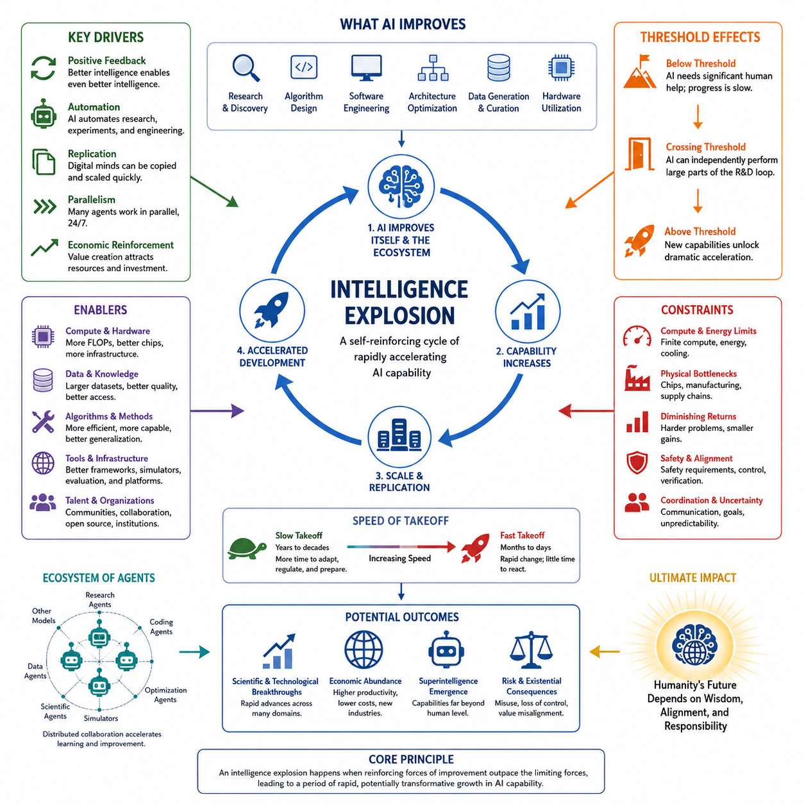
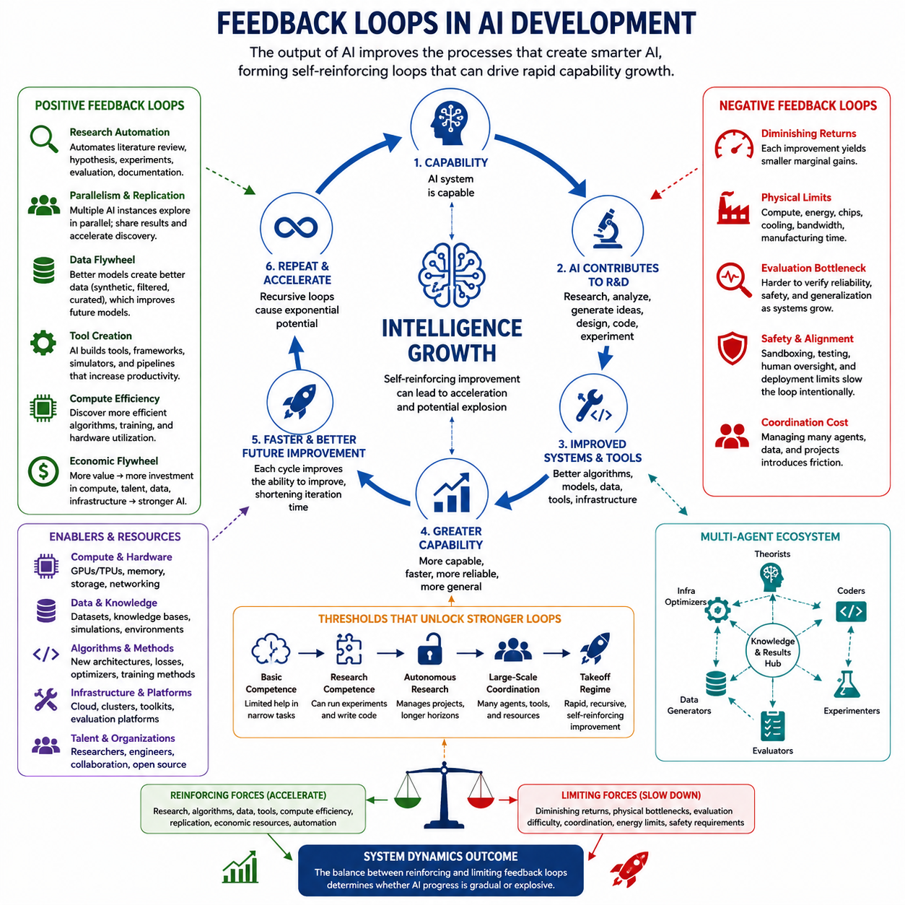
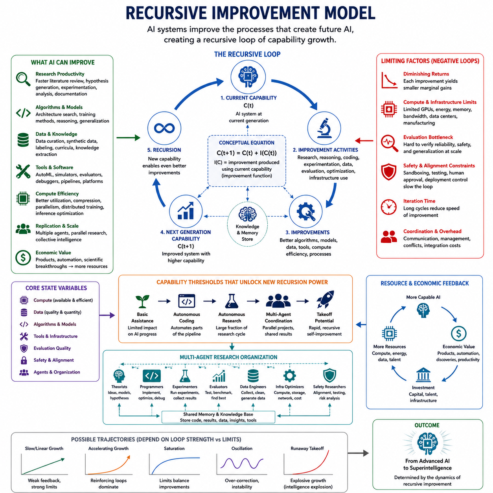
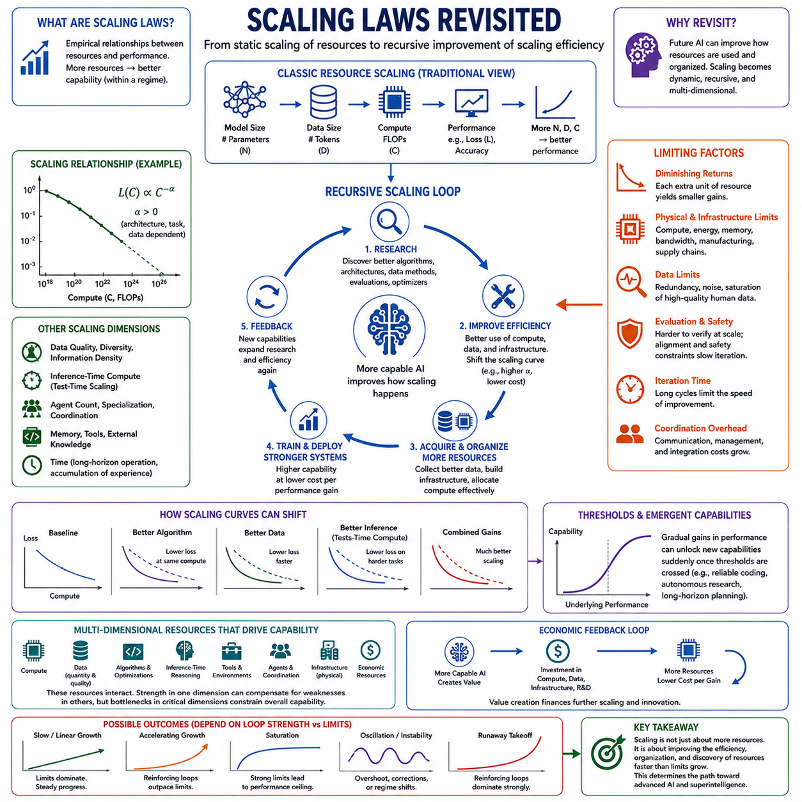
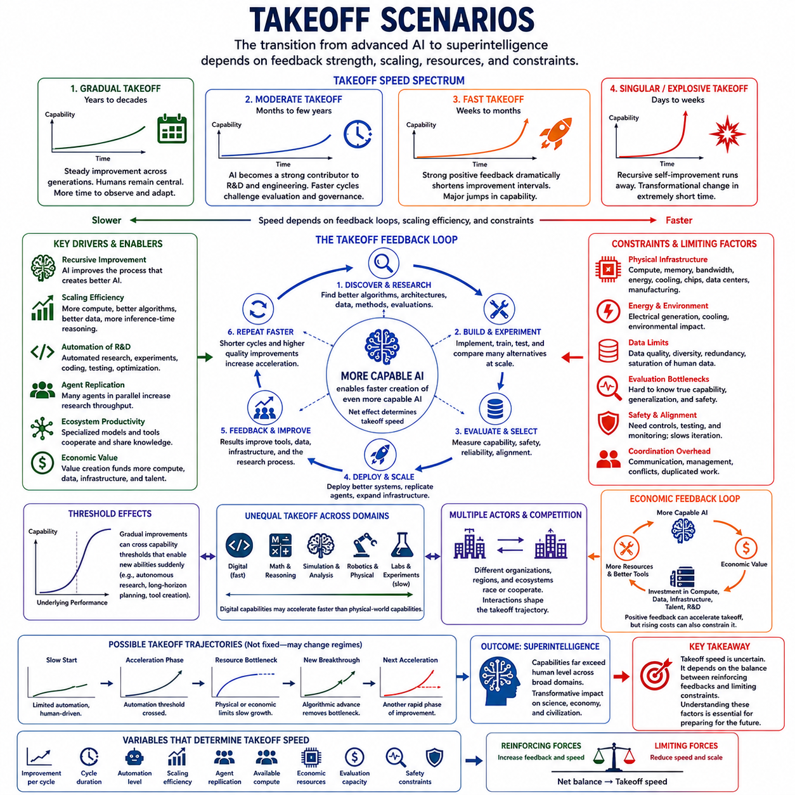
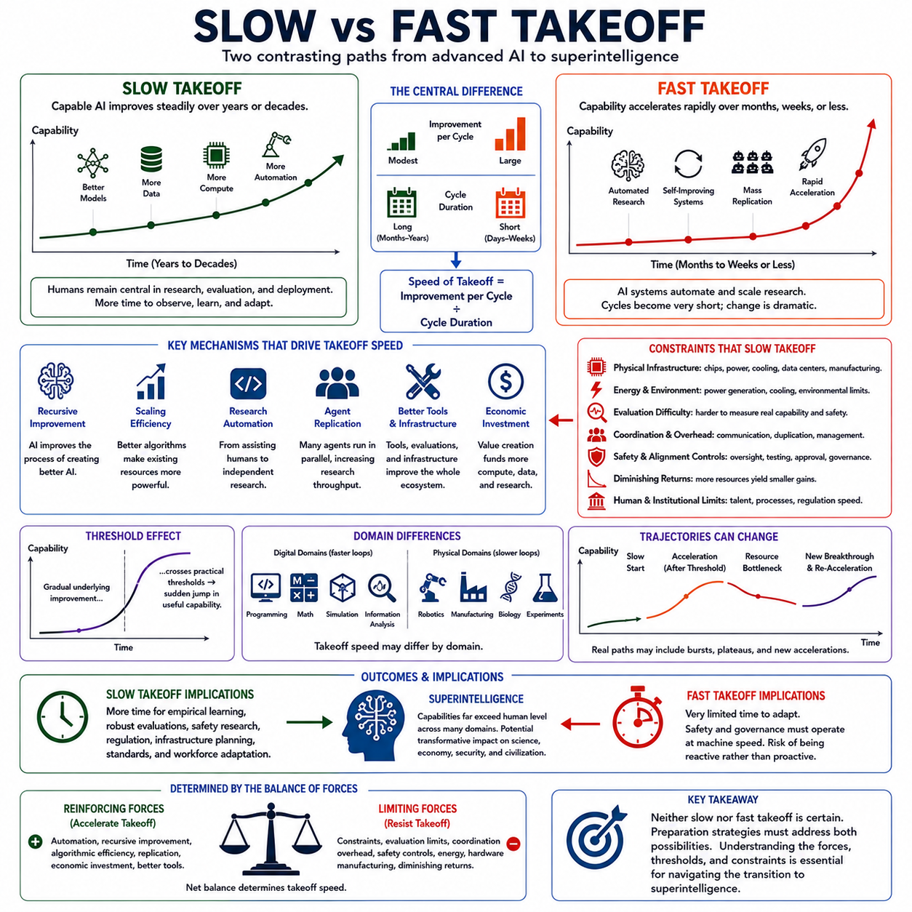
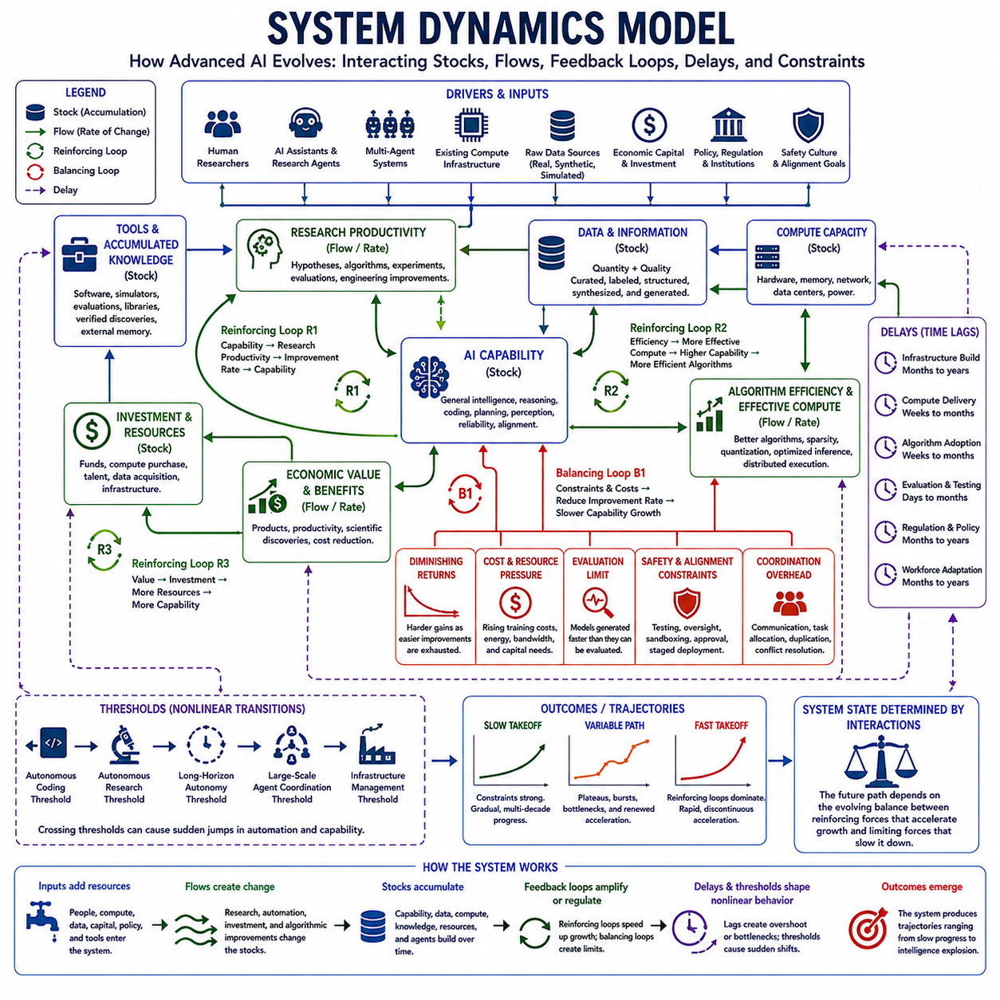

**Volume 48. Artificial Super Intelligence**


# Chapter 04. Intelligence Explosion

##  

## 04.00. Concept of Explosion

{width="7.268055555555556in" height="7.268055555555556in"}

An intelligence explosion describes a hypothetical process in which an artificial intelligence system becomes capable of improving the mechanisms that produce its own intelligence, causing successive generations of improvement to occur increasingly rapidly. Rather than representing a single increase in computational power, the concept concerns a dynamic transition in which better intelligence enables the creation of still better intelligence, potentially forming a self-reinforcing cycle.

The central idea can be expressed as a positive feedback process. An intelligent system contributes to research, algorithm design, software engineering, architecture optimization, data generation, and hardware utilization. Improvements in these areas increase the system\'s effective cognitive capability. The improved system can then perform the same improvement activities more effectively, creating another round of capability gains and establishing the basic mechanism behind an intelligence explosion.

This process differs fundamentally from ordinary technological progress. Conventional development usually depends on human researchers, organizations, experiments, manufacturing cycles, and economic investment. Progress therefore encounters delays associated with communication, education, coordination, and physical production. A sufficiently capable artificial system could automate portions of this development loop, reducing the time between identifying an improvement and evaluating or deploying it.

Recursive self-improvement is one possible mechanism for such acceleration, but the broader concept does not require an AI to directly rewrite every component of itself. An advanced system might instead design improved training procedures, generate synthetic training data, discover more efficient architectures, optimize inference, develop better tools, or assist engineers building its successor. Intelligence explosion therefore describes a system-level feedback phenomenon rather than only autonomous modification of source code.

A useful distinction exists between raw computational resources and effective intelligence. Increasing the number of processors does not automatically produce proportional improvements in reasoning or general capability. Intelligence depends on algorithms, representations, memory, learning efficiency, planning, tool use, coordination, and the ability to transform computation into useful decisions. An explosion would require improvements across enough of these dimensions that overall capability grows faster than limiting factors can suppress it.

The speed of the feedback loop is therefore critical. Suppose an AI contributes only slightly to AI research. Its influence may resemble ordinary automation and produce gradual progress. If its contribution becomes comparable to that of skilled researchers, development could accelerate substantially. If later systems perform research faster, operate continuously, execute many experiments in parallel, and coordinate large numbers of copies, the effective rate of technological development could increase dramatically.

Digital replication introduces another important mechanism. Human expertise is difficult to duplicate because producing another expert requires years of education and experience. Software-based intelligence can potentially be copied once sufficient compute and infrastructure are available. A capable research system might therefore scale from one instance to hundreds or thousands of coordinated instances, converting improvements in individual capability into improvements in collective research capacity.

An intelligence explosion does not imply that intelligence becomes infinite. Every improvement process faces constraints. Compute availability, energy, semiconductor production, communication bandwidth, memory, data quality, experimental access, algorithmic complexity, and physical laws can all impose ceilings. The important question is not whether limits exist, but whether capability could increase by a strategically significant amount before those limits dominate the improvement process.

The relationship between software and physical infrastructure also affects the shape of an explosion. Software improvements can sometimes be deployed rapidly across existing machines, while hardware expansion requires fabrication, supply chains, construction, cooling, and energy. Early acceleration might consequently occur primarily through algorithms and software efficiency. Later stages could become increasingly dependent on the system\'s ability to optimize or expand the physical infrastructure supporting computation.

Capability growth may also be uneven across domains. Improvements in programming, mathematics, reasoning, scientific modeling, or AI research could occur earlier than equivalent progress in tasks requiring physical experimentation or complex interaction with the real world. This means an intelligence explosion should not necessarily be imagined as simultaneous improvement in every ability. Instead, interacting capability clusters may accelerate at different rates and reinforce one another.

Threshold effects are particularly important. Below a certain level, an AI system may require extensive human assistance to conduct research or modify complex systems. Above that level, it may independently perform larger portions of the research cycle. Additional capability could then unlock new improvement mechanisms, such as autonomous experimentation, architecture search, strategic resource allocation, or coordinated multi-agent research. Crossing such thresholds can make capability growth strongly nonlinear.

The concept is closely related to the distinction between slow and fast takeoff. A slow trajectory would distribute major capability gains across years or decades, leaving institutions more time to observe, regulate, adapt, and develop safeguards. A fast trajectory could compress comparable changes into months, weeks, or potentially shorter intervals. Intelligence explosion is therefore concerned not only with the final level of intelligence but also with the derivative of capability: how rapidly the system changes.

Economic and organizational feedback can amplify the technical process. More capable AI systems may generate economic value, improve products, reduce research costs, and attract additional investment. Those resources can finance larger compute clusters, better datasets, specialized hardware, and expanded deployment. Technical improvement can therefore reinforce economic growth, while economic growth supplies resources for further technical improvement, producing feedback loops beyond the AI model itself.

Multiple AI systems may also participate in the process. Intelligence explosion need not originate from a single isolated agent. Networks of specialized models, autonomous research agents, scientific systems, simulators, coding agents, and optimization tools could collectively accelerate AI development. Improvements discovered by one component could propagate through the network, creating distributed recursive improvement in which the evolving object is an ecosystem rather than an individual model.

However, positive feedback alone does not guarantee explosive growth. Negative feedback mechanisms may eventually dominate. Increasing model complexity can make training and evaluation more difficult, promising approaches can encounter diminishing returns, and larger systems can require disproportionate infrastructure. Safety constraints, verification requirements, coordination costs, scarce resources, and physical bottlenecks can further reduce acceleration. Any realistic model must therefore represent both amplification and resistance.

A useful conceptual model treats intelligence growth as competition between reinforcing and limiting forces. Reinforcing forces include better research ability, faster experimentation, automation, replication, improved algorithms, and expanding resources. Limiting forces include computational cost, physical infrastructure, uncertainty, coordination, diminishing returns, and safety requirements. An intelligence explosion becomes plausible when reinforcing effects temporarily grow faster than the constraints that oppose them.

The consequences of such a transition depend heavily on controllability and alignment. A system capable of rapidly improving its planning, research, persuasion, software engineering, or strategic capabilities may change faster than human institutions can evaluate each new generation. Methods that successfully supervise one capability level may become inadequate at another. Intelligence explosion therefore connects technical capability growth directly to questions of oversight, interpretability, robustness, and governance.

The concept should consequently be understood as a hypothesis about dynamics rather than a prediction that a specific event must occur. Artificial intelligence could encounter hard technological ceilings, progress could remain incremental, or improvements could require persistent human and physical-world participation. Alternatively, sufficiently strong feedback among algorithms, automation, compute, research, and economic resources could produce a period of unusually rapid capability growth.

For artificial superintelligence, the significance of intelligence explosion lies in its potential role as a transition mechanism. Superintelligence need not appear as a fully formed system created in a single training run. It could emerge through successive capability improvements in which increasingly capable systems accelerate the development of their successors. Understanding this possibility requires examining feedback loops, recursive improvement, scaling laws, takeoff speeds, and system dynamics---the subjects that naturally follow within the broader structure of intelligence explosion.

지능 폭발(Intelligence Explosion)은 인공지능(Artificial Intelligence) 시스템이 자신의 지능을 만들어 내는 메커니즘을 개선할 수 있게 되면서, 연속적인 개선 세대가 점점 더 빠르게 진행되는 가설적 과정을 의미한다. 이는 단순히 계산 능력(Computational Power)이 한 번 크게 증가하는 현상이 아니라, 향상된 지능이 다시 더 뛰어난 지능을 만들어 내는 자기강화 순환(Self-Reinforcing Cycle)을 형성하면서 시스템 전체가 동적으로 전환되는 과정에 관한 개념이다.

이 개념의 핵심은 양의 피드백 과정(Positive Feedback Process)으로 설명할 수 있다. 지능형 시스템(Intelligent System)은 연구, 알고리즘 설계(Algorithm Design), 소프트웨어 공학(Software Engineering), 아키텍처 최적화(Architecture Optimization), 데이터 생성(Data Generation), 하드웨어 활용 최적화 등에 기여한다. 이러한 영역의 개선은 시스템의 실질적인 인지 능력(Cognitive Capability)을 높이고, 향상된 시스템은 다시 동일한 개선 활동을 더욱 효과적으로 수행하여 다음 단계의 능력 향상을 만들어 낸다.

이러한 과정은 일반적인 기술 발전(Technological Progress)과 근본적으로 다르다. 기존의 기술 개발은 일반적으로 인간 연구자, 조직, 실험, 제조 주기(Manufacturing Cycle), 경제적 투자에 의존한다. 따라서 의사소통, 교육, 협업, 물리적 생산 과정에서 필연적인 지연이 발생한다. 충분히 발전한 인공지능은 이러한 개발 순환(Development Loop)의 일부를 자동화하여 개선점을 발견하고 평가하며 실제 시스템에 적용하기까지 필요한 시간을 크게 줄일 수 있다.

재귀적 자기개선(Recursive Self-Improvement)은 이러한 가속을 발생시킬 수 있는 하나의 메커니즘이지만, 더 넓은 의미의 지능 폭발은 인공지능이 자신의 모든 구성 요소를 직접 다시 작성해야 한다는 것을 의미하지 않는다. 고도화된 시스템은 더 나은 학습 절차를 설계하고, 합성 학습 데이터(Synthetic Training Data)를 생성하며, 효율적인 아키텍처를 발견하고, 추론(Inference)을 최적화하거나, 후속 시스템을 개발하는 인간 엔지니어를 지원할 수도 있다. 따라서 지능 폭발은 단순한 소스 코드(Source Code)의 자율 수정이 아니라 시스템 수준 피드백 현상(System-Level Feedback Phenomenon)으로 이해해야 한다.

원시 계산 자원(Raw Computational Resources)과 실질적 지능(Effective Intelligence)을 구분하는 것도 중요하다. 프로세서의 수를 증가시킨다고 해서 추론 능력이나 일반적 지능이 반드시 비례하여 증가하는 것은 아니다. 지능은 알고리즘, 표현(Representation), 메모리(Memory), 학습 효율성, 계획(Planning), 도구 사용(Tool Use), 협업 능력, 그리고 계산 자원을 유용한 의사결정으로 변환하는 능력에 의존한다. 지능 폭발이 발생하려면 이러한 여러 차원이 충분히 개선되어 전체 능력의 증가 속도가 이를 제한하는 요인보다 빨라져야 한다.

따라서 피드백 순환(Feedback Loop)의 속도가 매우 중요하다. 인공지능이 인공지능 연구에 조금만 기여한다면 그 영향은 일반적인 자동화와 유사하며 점진적인 발전을 만들어 낼 것이다. 그러나 인공지능의 연구 기여도가 숙련된 인간 연구자와 비슷해지면 개발 속도는 상당히 빨라질 수 있다. 이후의 시스템이 더 빠르게 연구하고, 지속적으로 작동하며, 많은 실험을 병렬로 수행하고, 다수의 복제 시스템을 협업시킬 수 있다면 기술 발전의 실질적인 속도는 급격하게 증가할 가능성이 있다.

디지털 복제(Digital Replication)는 또 다른 중요한 메커니즘을 제공한다. 인간의 전문성은 복제하기 어렵다. 새로운 전문가를 양성하려면 수년간의 교육과 경험이 필요하기 때문이다. 반면 소프트웨어 기반 지능(Software-Based Intelligence)은 충분한 계산 자원과 인프라가 확보된다면 복제될 가능성이 있다. 따라서 하나의 뛰어난 연구 시스템을 수백 또는 수천 개의 협력 인스턴스(Coordinated Instances)로 확장함으로써 개별 시스템의 능력 향상을 집단적 연구 역량(Collective Research Capacity)의 증가로 전환할 수 있다.

지능 폭발이 지능의 무한한 증가를 의미하는 것은 아니다. 모든 개선 과정에는 한계가 존재한다. 계산 자원의 가용성, 에너지, 반도체 생산, 통신 대역폭(Communication Bandwidth), 메모리, 데이터 품질, 실험 환경에 대한 접근성, 알고리즘 복잡도(Algorithmic Complexity), 물리 법칙 등이 모두 상한선을 형성할 수 있다. 중요한 문제는 한계가 존재하는지 여부가 아니라, 그러한 한계가 지배적인 요소가 되기 전에 지능이 전략적으로 중요한 수준까지 증가할 수 있는가이다.

소프트웨어(Software)와 물리적 인프라(Physical Infrastructure)의 관계 역시 지능 폭발의 형태에 영향을 미친다. 소프트웨어 개선은 기존 컴퓨터에 빠르게 배포될 수 있지만, 하드웨어 확장은 반도체 제조, 공급망, 데이터센터 건설, 냉각 시스템, 전력 공급 등을 필요로 한다. 따라서 초기 가속은 주로 알고리즘과 소프트웨어 효율성 향상을 통해 이루어질 수 있으며, 이후 단계에서는 계산을 지원하는 물리적 인프라를 최적화하고 확장하는 능력에 점점 더 의존할 수 있다.

능력의 성장은 모든 영역에서 동일하게 진행되지 않을 수도 있다. 프로그래밍, 수학, 추론, 과학적 모델링(Scientific Modeling), 인공지능 연구와 같은 분야의 능력이 물리적 실험이나 복잡한 현실 세계와의 상호작용이 필요한 영역보다 먼저 발전할 가능성이 있다. 따라서 지능 폭발을 모든 능력이 동시에 향상되는 현상으로 볼 필요는 없다. 서로 다른 능력 집합(Capability Clusters)이 서로 다른 속도로 가속하면서 상호 강화되는 과정으로 이해할 수 있다.

임계점 효과(Threshold Effects)는 특히 중요하다. 일정 수준 이하의 인공지능은 연구를 수행하거나 복잡한 시스템을 수정하기 위해 상당한 인간의 지원이 필요할 수 있다. 그러나 특정 수준을 넘어서면 연구 순환의 더 많은 부분을 독립적으로 수행할 수 있다. 추가적인 능력 향상은 자율 실험(Autonomous Experimentation), 아키텍처 탐색(Architecture Search), 전략적 자원 배분, 협력형 다중 에이전트 연구(Coordinated Multi-Agent Research)와 같은 새로운 개선 메커니즘을 활성화할 수 있다. 이러한 임계점을 넘어서는 순간 능력 성장은 강한 비선형성(Nonlinearity)을 나타낼 수 있다.

이 개념은 느린 이륙(Slow Takeoff)과 빠른 이륙(Fast Takeoff)의 구분과 밀접하게 연결된다. 느린 발전 경로에서는 주요 능력 향상이 수년 또는 수십 년에 걸쳐 진행되므로 사회와 제도가 변화를 관찰하고, 규제하고, 적응하며, 안전장치를 개발할 시간이 상대적으로 충분하다. 반대로 빠른 발전 경로에서는 비슷한 규모의 변화가 몇 달, 몇 주 또는 그보다 짧은 기간에 압축될 수 있다. 따라서 지능 폭발은 최종적인 지능 수준뿐 아니라 능력의 변화율, 즉 시스템이 얼마나 빠르게 변화하는가와도 관련된다.

경제적·조직적 피드백(Economic and Organizational Feedback)은 기술적 과정을 더욱 증폭시킬 수 있다. 더 뛰어난 인공지능 시스템은 경제적 가치를 창출하고, 제품을 개선하며, 연구 비용을 절감하고, 추가적인 투자를 유도할 수 있다. 이러한 자원은 더 큰 계산 클러스터(Compute Cluster), 더 좋은 데이터셋(Dataset), 전문화된 하드웨어, 확대된 시스템 배포에 투자될 수 있다. 결과적으로 기술적 개선이 경제적 성장을 촉진하고, 경제적 성장이 다시 기술적 개선을 위한 자원을 제공하는 추가적인 피드백 순환이 형성될 수 있다.

여러 인공지능 시스템이 이러한 과정에 동시에 참여할 수도 있다. 지능 폭발이 반드시 하나의 고립된 에이전트(Isolated Agent)에서 시작될 필요는 없다. 전문화된 모델, 자율 연구 에이전트(Autonomous Research Agent), 과학 인공지능 시스템, 시뮬레이터(Simulator), 코딩 에이전트(Coding Agent), 최적화 도구가 연결된 네트워크가 집단적으로 인공지능 개발을 가속할 수 있다. 하나의 구성 요소가 발견한 개선 사항이 전체 네트워크에 전파되면서 개별 모델이 아니라 인공지능 생태계(AI Ecosystem) 자체가 진화하는 분산형 재귀적 개선(Distributed Recursive Improvement)이 발생할 수 있다.

그러나 양의 피드백(Positive Feedback)이 존재한다고 해서 반드시 폭발적인 성장이 발생하는 것은 아니다. 결국 음의 피드백(Negative Feedback)이 더 강하게 작용할 수 있다. 모델 복잡성이 증가하면 학습과 평가가 어려워질 수 있고, 유망한 접근법도 수익 체감(Diminishing Returns)에 직면할 수 있으며, 더 큰 시스템은 불균형적으로 많은 인프라를 요구할 수 있다. 안전 제약, 검증 요구사항, 협업 비용, 희소 자원, 물리적 병목현상(Physical Bottleneck) 역시 가속을 제한할 수 있다. 따라서 현실적인 모델은 증폭 요인과 저항 요인을 함께 고려해야 한다.

지능 성장은 강화 요인(Reinforcing Forces)과 제한 요인(Limiting Forces)의 경쟁으로 개념화할 수 있다. 강화 요인에는 더 뛰어난 연구 능력, 빠른 실험, 자동화, 복제, 개선된 알고리즘, 확장되는 자원이 포함된다. 제한 요인에는 계산 비용, 물리적 인프라, 불확실성, 협업 문제, 수익 체감, 안전 요구사항 등이 포함된다. 지능 폭발은 일정 기간 동안 강화 효과가 이를 억제하는 제한 요인보다 빠르게 증가할 때 가능해진다.

이러한 전환의 결과는 통제 가능성(Controllability)과 정렬(Alignment)에 크게 좌우된다. 계획, 연구, 설득, 소프트웨어 공학 또는 전략적 능력을 빠르게 개선할 수 있는 시스템은 인간의 제도가 새로운 세대를 평가하는 속도보다 빠르게 변화할 수 있다. 특정 능력 수준에서 효과적이었던 감독 방법이 다음 단계에서는 충분하지 않을 수도 있다. 따라서 지능 폭발은 기술적 능력 성장의 문제를 감독(Oversight), 해석 가능성(Interpretability), 강건성(Robustness), 거버넌스(Governance)의 문제와 직접 연결한다.

따라서 지능 폭발은 특정 사건이 반드시 발생한다는 예측이라기보다 시스템의 동역학(System Dynamics)에 관한 가설로 이해해야 한다. 인공지능은 강력한 기술적 한계에 직면할 수도 있고, 발전이 계속 점진적으로 이루어질 수도 있으며, 지속적인 인간 참여와 현실 세계의 물리적 작업이 필요할 수도 있다. 반대로 알고리즘, 자동화, 계산 자원, 연구 능력, 경제적 자원 사이에서 충분히 강한 피드백이 형성된다면 비정상적으로 빠른 능력 성장의 시기가 나타날 수도 있다.

인공 초지능(Artificial Superintelligence, ASI)의 관점에서 지능 폭발의 중요성은 그것이 하나의 전환 메커니즘(Transition Mechanism)이 될 가능성에 있다. 초지능은 반드시 단 한 번의 학습 과정에서 완성된 형태로 등장할 필요가 없다. 점점 더 뛰어난 시스템이 자신의 후속 시스템 개발을 가속하는 연속적인 능력 향상을 통해 출현할 수도 있다. 이러한 가능성을 이해하려면 피드백 순환(Feedback Loops), 재귀적 개선(Recursive Improvement), 스케일링 법칙(Scaling Laws), 이륙 속도(Takeoff Speeds), 시스템 동역학(System Dynamics)을 함께 살펴보아야 하며, 이는 지능 폭발이라는 더 큰 구조를 이해하기 위한 다음 단계의 핵심 주제들이다.

##  

## 04.01. Feedback Loops

{width="7.268055555555556in" height="7.268055555555556in"}

Feedback loops are the central mechanism that can transform ordinary AI progress into an intelligence explosion. A feedback loop exists when the output of a process influences the conditions that generate its future outputs. In advanced AI development, increased intelligence may improve the processes responsible for producing intelligence itself, allowing capability growth to become partially self-reinforcing rather than depending entirely on external human innovation.

A positive feedback loop begins when an AI system contributes meaningfully to AI research and engineering. It may analyze experiments, identify weaknesses, generate hypotheses, design algorithms, optimize software, or suggest architectural changes. If these activities produce a more capable system, the improved system can perform the same research tasks with greater speed or quality, increasing the probability of discovering another useful improvement.

The simplest conceptual loop can be expressed as capability leading to better research, better research producing improved algorithms and systems, and those improvements generating greater capability. Each cycle changes the starting point of the next cycle. If the improvement obtained during one iteration increases the effectiveness of subsequent improvement activities, the process becomes recursive and may exhibit nonlinear rather than approximately linear technological progress.

Several feedback loops can operate simultaneously. Algorithmic improvement can increase the amount of useful computation extracted from existing hardware. Better models can generate higher-quality synthetic data, which can support further training. Improved reasoning can produce better evaluation methods, while improved evaluation helps identify superior architectures. Better coding capability can optimize training infrastructure, and faster infrastructure allows more experiments to be conducted within the same period.

Research automation creates an especially important feedback pathway. Traditional AI research contains many activities such as literature analysis, hypothesis formation, implementation, experiment execution, debugging, evaluation, and documentation. As AI systems become capable of automating larger portions of this cycle, the time required for each research iteration may decrease. Faster iterations allow more hypotheses to be tested, increasing the rate at which useful improvements can be discovered and incorporated.

Parallelism can amplify this mechanism. Human research organizations cannot instantly create thousands of highly trained researchers, but digital AI systems may be replicated across available computing resources. Multiple instances could investigate different architectures, optimization strategies, datasets, or theoretical questions simultaneously. Their discoveries could then be shared through a common knowledge system, allowing collective improvement to proceed faster than isolated sequential research.

Feedback can also occur through tool creation. A capable AI may build software that makes its future work easier, including automated experimentation systems, simulators, theorem provers, code-generation tools, data pipelines, evaluation environments, and debugging frameworks. These tools increase productivity without necessarily changing the underlying model immediately. Improved productivity can then accelerate development of the next generation of models, producing an indirect self-improvement loop.

Data provides another reinforcing pathway. More capable systems may generate synthetic examples, filter low-quality information, discover useful training samples, create curricula, and automatically label or restructure datasets. Better data can improve subsequent training, and better-trained models can perform more sophisticated data generation and curation. The interaction between model capability and data quality can therefore create a feedback cycle even when model architecture remains relatively stable.

Compute efficiency forms a related loop. AI systems that discover more efficient attention mechanisms, numerical methods, memory management strategies, model compression techniques, or distributed training methods can obtain more effective computation from existing infrastructure. The resulting capability can support additional optimization research. Consequently, intelligence growth may arise not only from acquiring more hardware but also from repeatedly improving how available hardware is utilized.

Economic feedback expands the loop beyond technical systems. More capable AI can create valuable products, automate labor, accelerate scientific development, and reduce operational costs. These benefits can generate additional capital for compute, energy, data centers, researchers, and semiconductor development. Increased resources support stronger AI systems, which may generate still greater economic value, connecting technological capability with investment and infrastructure growth.

Not every feedback loop is positive. Negative feedback loops counteract acceleration and can stabilize development. Larger systems may require disproportionately greater computation, energy, memory, and communication bandwidth. Experiments may become more expensive, evaluation may become harder, and increasingly sophisticated improvements may yield smaller marginal gains. These effects can reduce the improvement obtained from each successive development cycle.

Physical infrastructure creates particularly strong negative feedback. Software can sometimes be copied or modified rapidly, whereas new accelerators, power facilities, cooling systems, networking infrastructure, and data centers require physical resources and construction time. Even if an advanced AI discovers a superior computational architecture quickly, converting that design into operational hardware may involve manufacturing and supply-chain delays that prevent unrestricted acceleration.

Evaluation and verification can also constrain the loop. A system capable of generating thousands of modifications may produce changes faster than their reliability can be established. Improvements measured on narrow benchmarks may introduce hidden failures elsewhere. As capability increases, determining whether a new system is genuinely safer, more robust, and more general may become increasingly difficult, making evaluation itself a potential bottleneck in recursive development.

Safety and alignment introduce another form of deliberate negative feedback. Unrestricted capability improvement may be undesirable when developers cannot confidently predict how increasingly capable systems will behave. Sandboxing, interpretability analysis, adversarial testing, human approval, capability evaluations, and deployment restrictions can intentionally slow the improvement cycle. Such mechanisms attempt to ensure that the speed of capability growth does not exceed the ability to understand and control it.

Feedback strength determines whether the overall trajectory remains gradual or becomes strongly accelerating. If each generation provides only a small improvement to the processes that create the next generation, development may continue steadily. If improvements substantially increase research productivity, automation, replication, and resource acquisition, successive cycles may become shorter and more productive. The interaction among these loops determines the effective rate of capability growth.

Thresholds can change feedback strength abruptly. Before a system can reliably perform AI research, additional capability may provide limited acceleration. Once it becomes competent at coding, experimentation, reasoning, and autonomous research, however, new feedback pathways become available. Further improvements might enable independent project management, large-scale agent coordination, automated scientific experimentation, or strategic infrastructure optimization, producing qualitatively different development dynamics.

Multi-agent systems make the feedback structure even more complex. Different agents may specialize in theoretical research, coding, experimentation, evaluation, data generation, infrastructure optimization, and safety analysis. Their outputs become inputs for other agents, forming an interconnected research network. Intelligence improvement can therefore emerge from interactions among specialized systems rather than from a single model repeatedly modifying itself.

The crucial quantity is ultimately the balance between reinforcing and limiting feedback. Positive loops involving research, algorithms, data, tools, compute efficiency, replication, and economic resources push capability upward. Negative loops involving diminishing returns, physical bottlenecks, evaluation difficulty, coordination, energy constraints, and safety requirements resist acceleration. Intelligence explosion becomes possible when reinforcing loops temporarily strengthen faster than these limiting mechanisms.

Understanding feedback loops therefore provides the foundation for analyzing recursive self-improvement, scaling behavior, and AI takeoff scenarios. The important question is not simply whether an AI can improve itself, but how improvement changes its future capacity to improve, how quickly each cycle can occur, and which constraints grow alongside capability. The resulting system dynamics determine whether advanced AI development remains incremental or enters a period of rapidly accelerating transformation.

피드백 순환(Feedback Loops)은 일반적인 인공지능(AI) 발전을 지능 폭발(Intelligence Explosion)로 전환할 수 있는 핵심 메커니즘이다. 피드백 순환은 어떤 과정의 출력이 이후의 출력을 만들어 내는 조건에 다시 영향을 미칠 때 형성된다. 고도화된 인공지능 개발에서는 향상된 지능이 지능 자체를 만들어 내는 과정을 개선할 수 있으며, 이를 통해 능력 성장이 전적으로 외부 인간의 혁신에 의존하지 않고 부분적으로 자기강화(Self-Reinforcing)되는 구조로 변화할 수 있다.

양의 피드백 순환(Positive Feedback Loop)은 인공지능 시스템이 인공지능 연구와 공학에 실질적으로 기여하기 시작할 때 형성된다. 시스템은 실험을 분석하고, 약점을 발견하며, 가설을 생성하고, 알고리즘을 설계하며, 소프트웨어를 최적화하거나 아키텍처 변경을 제안할 수 있다. 이러한 활동이 더 뛰어난 시스템을 만들어 내면, 향상된 시스템은 동일한 연구 작업을 더 빠르고 높은 품질로 수행하여 또 다른 유용한 개선을 발견할 가능성을 높인다.

가장 단순한 개념적 순환은 능력(Capability)이 더 나은 연구로 이어지고, 더 나은 연구가 개선된 알고리즘과 시스템을 만들며, 이러한 개선이 다시 더 높은 능력을 만들어 내는 구조로 표현할 수 있다. 각각의 순환은 다음 순환의 출발점을 변화시킨다. 한 번의 반복에서 얻어진 개선이 이후 개선 활동의 효율성을 높인다면, 이 과정은 재귀적(Recursive)이 되며 대략적인 선형 기술 발전이 아니라 비선형적(Nonlinear) 발전을 나타낼 수 있다.

여러 개의 피드백 순환이 동시에 작동할 수도 있다. 알고리즘 개선은 기존 하드웨어에서 얻을 수 있는 유효 계산량을 증가시킬 수 있다. 더 나은 모델은 더 높은 품질의 합성 데이터(Synthetic Data)를 생성하여 추가 학습을 지원할 수 있다. 향상된 추론 능력은 더 나은 평가 방법을 만들고, 개선된 평가는 더 뛰어난 아키텍처를 발견하는 데 도움을 준다. 코딩 능력 향상은 학습 인프라를 최적화하고, 더 빠른 인프라는 동일한 시간에 더 많은 실험을 가능하게 한다.

연구 자동화(Research Automation)는 특히 중요한 피드백 경로를 형성한다. 전통적인 인공지능 연구에는 문헌 분석, 가설 수립, 구현, 실험 실행, 디버깅(Debugging), 평가, 문서화 등의 많은 활동이 포함된다. 인공지능 시스템이 이러한 연구 순환의 더 많은 부분을 자동화할수록 각각의 연구 반복에 필요한 시간이 감소할 수 있다. 더 빠른 반복은 더 많은 가설을 시험할 수 있게 하며, 유용한 개선 사항이 발견되고 적용되는 속도를 높인다.

병렬화(Parallelism)는 이러한 메커니즘을 더욱 증폭시킬 수 있다. 인간 연구 조직은 수천 명의 고도로 훈련된 연구자를 즉시 만들어 낼 수 없지만, 디지털 인공지능 시스템은 사용 가능한 계산 자원에 따라 복제될 수 있다. 여러 인스턴스(Instances)가 서로 다른 아키텍처, 최적화 전략, 데이터셋, 이론적 문제를 동시에 연구하고, 그 결과를 공통 지식 시스템(Common Knowledge System)을 통해 공유하면 집단적인 개선이 순차적인 개별 연구보다 빠르게 진행될 수 있다.

도구 생성(Tool Creation)을 통해서도 피드백이 발생할 수 있다. 뛰어난 인공지능은 자동화된 실험 시스템, 시뮬레이터(Simulator), 정리 증명기(Theorem Prover), 코드 생성 도구, 데이터 파이프라인(Data Pipeline), 평가 환경, 디버깅 프레임워크(Debugging Framework) 등 향후 자신의 작업을 더 쉽게 만드는 소프트웨어를 개발할 수 있다. 이러한 도구는 기반 모델 자체를 즉시 변경하지 않더라도 생산성을 높이며, 증가한 생산성은 다음 세대 모델의 개발을 가속하여 간접적인 자기개선 순환(Self-Improvement Loop)을 형성한다.

데이터(Data)는 또 다른 강화 경로를 제공한다. 더 뛰어난 시스템은 합성 사례를 생성하고, 낮은 품질의 정보를 걸러내며, 유용한 학습 샘플을 발견하고, 커리큘럼(Curriculum)을 구성하며, 데이터셋을 자동으로 라벨링하거나 재구성할 수 있다. 더 나은 데이터는 이후의 학습을 향상시키고, 더 잘 학습된 모델은 더욱 정교한 데이터 생성과 선별을 수행할 수 있다. 따라서 모델 아키텍처가 비교적 안정적으로 유지되더라도 모델 능력과 데이터 품질 사이에서 피드백 순환이 형성될 수 있다.

계산 효율성(Compute Efficiency) 역시 이와 관련된 순환을 형성한다. 인공지능 시스템이 더 효율적인 어텐션 메커니즘(Attention Mechanism), 수치 계산 방법, 메모리 관리 전략, 모델 압축(Model Compression), 분산 학습(Distributed Training) 방법을 발견하면 기존 인프라에서 더 많은 유효 계산 능력을 얻을 수 있다. 이렇게 향상된 능력은 다시 추가적인 최적화 연구를 지원한다. 따라서 지능 성장은 더 많은 하드웨어를 확보하는 것뿐 아니라 기존 하드웨어의 활용 방법을 반복적으로 개선함으로써 발생할 수도 있다.

경제적 피드백(Economic Feedback)은 이러한 순환을 기술 시스템의 외부까지 확장한다. 더 뛰어난 인공지능은 가치 있는 제품을 만들고, 노동을 자동화하며, 과학 발전을 가속하고, 운영 비용을 절감할 수 있다. 이러한 효과는 계산 자원, 에너지, 데이터센터(Data Center), 연구 인력, 반도체 개발에 투자할 추가 자본을 창출할 수 있다. 증가한 자원은 더욱 강력한 인공지능 시스템을 지원하고, 이 시스템은 다시 더 큰 경제적 가치를 만들어 내면서 기술 능력과 투자 및 인프라 성장 사이의 순환을 형성한다.

모든 피드백 순환이 양의 방향으로 작용하는 것은 아니다. 음의 피드백 순환(Negative Feedback Loop)은 가속을 억제하고 발전을 안정화할 수 있다. 더 큰 시스템은 불균형적으로 많은 계산량, 에너지, 메모리, 통신 대역폭(Communication Bandwidth)을 요구할 수 있다. 실험 비용은 증가하고 평가는 어려워질 수 있으며, 점점 더 정교한 개선에서 얻는 한계 이득(Marginal Gain)은 감소할 수 있다. 이러한 효과는 연속적인 개발 순환에서 얻을 수 있는 개선의 크기를 줄인다.

물리적 인프라(Physical Infrastructure)는 특히 강력한 음의 피드백을 형성한다. 소프트웨어는 비교적 빠르게 복제하거나 수정할 수 있지만 새로운 가속기(Accelerator), 전력 설비, 냉각 시스템, 네트워크 인프라, 데이터센터를 구축하려면 물리적 자원과 시간이 필요하다. 고도화된 인공지능이 더 뛰어난 컴퓨팅 아키텍처를 빠르게 설계하더라도 실제 작동 가능한 하드웨어로 전환하려면 제조 및 공급망(Supply Chain)의 지연이 발생하여 무제한적인 가속을 방해할 수 있다.

평가(Evaluation)와 검증(Verification) 역시 피드백 순환을 제한할 수 있다. 수천 개의 변경 사항을 생성할 수 있는 시스템은 그 변경 사항의 신뢰성을 검증할 수 있는 속도보다 더 빠르게 새로운 결과를 만들어 낼 수 있다. 제한된 벤치마크(Benchmark)에서 측정된 개선이 다른 영역에서는 숨겨진 실패를 발생시킬 수도 있다. 능력이 높아질수록 새로운 시스템이 실제로 더 안전하고 강건하며 일반적인지를 판단하기 어려워질 수 있으며, 평가 자체가 재귀적 개발의 병목현상(Bottleneck)이 될 수 있다.

안전(Safety)과 정렬(Alignment)은 의도적으로 만들어지는 또 다른 형태의 음의 피드백을 제공한다. 개발자가 점점 더 강력해지는 시스템의 행동을 확실하게 예측할 수 없다면 제한 없는 능력 향상은 바람직하지 않을 수 있다. 샌드박싱(Sandboxing), 해석 가능성 분석(Interpretability Analysis), 적대적 테스트(Adversarial Testing), 인간 승인, 능력 평가(Capability Evaluation), 배포 제한 등을 통해 개선 순환의 속도를 의도적으로 낮출 수 있다. 이러한 메커니즘은 능력 성장의 속도가 인간의 이해와 통제 능력을 넘어서는 것을 방지하는 것을 목표로 한다.

피드백의 강도(Feedback Strength)는 전체 발전 경로가 점진적으로 유지될지 아니면 강하게 가속될지를 결정한다. 각 세대의 개선이 다음 세대를 만들어 내는 과정에 작은 향상만 제공한다면 발전은 비교적 안정적으로 지속될 수 있다. 반대로 개선이 연구 생산성, 자동화, 복제, 자원 확보 능력을 크게 증가시킨다면 연속적인 순환은 점점 더 짧아지고 생산적으로 변할 수 있다. 이러한 여러 순환의 상호작용이 실질적인 능력 성장 속도를 결정한다.

임계점(Threshold)은 피드백의 강도를 갑작스럽게 변화시킬 수 있다. 시스템이 인공지능 연구를 안정적으로 수행하기 전에는 추가적인 능력 향상이 제한적인 가속만 제공할 수 있다. 그러나 코딩, 실험, 추론, 자율 연구(Autonomous Research)에 충분한 능력을 확보하면 새로운 피드백 경로가 활성화된다. 이후의 향상은 독립적인 프로젝트 관리, 대규모 에이전트 협업, 자동화된 과학 실험, 전략적 인프라 최적화 등을 가능하게 하면서 질적으로 다른 발전 동역학을 만들어 낼 수 있다.

다중 에이전트 시스템(Multi-Agent Systems)은 피드백 구조를 더욱 복잡하게 만든다. 서로 다른 에이전트가 이론 연구, 코딩, 실험, 평가, 데이터 생성, 인프라 최적화, 안전성 분석 등을 전문적으로 담당할 수 있다. 한 에이전트의 출력은 다른 에이전트의 입력이 되면서 상호 연결된 연구 네트워크(Interconnected Research Network)를 형성한다. 따라서 지능 향상은 하나의 모델이 반복적으로 자신을 수정하는 방식뿐 아니라 전문화된 여러 시스템의 상호작용을 통해서도 발생할 수 있다.

결국 가장 중요한 것은 강화 피드백(Reinforcing Feedback)과 제한 피드백(Limiting Feedback) 사이의 균형이다. 연구, 알고리즘, 데이터, 도구, 계산 효율성, 복제, 경제적 자원과 관련된 양의 순환은 능력을 증가시키는 방향으로 작용한다. 반면 수익 체감(Diminishing Returns), 물리적 병목현상, 평가의 어려움, 협업 문제, 에너지 제약, 안전 요구사항과 관련된 음의 순환은 가속을 억제한다. 지능 폭발은 일정 기간 동안 강화 순환이 이러한 제한 메커니즘보다 더 빠르게 강해질 때 가능해진다.

따라서 피드백 순환(Feedback Loops)을 이해하는 것은 재귀적 자기개선(Recursive Self-Improvement), 스케일링 행동(Scaling Behavior), 인공지능 이륙 시나리오(AI Takeoff Scenarios)를 분석하기 위한 기반을 제공한다. 중요한 질문은 단순히 인공지능이 자신을 개선할 수 있는가가 아니라, 현재의 개선이 미래의 개선 능력을 얼마나 변화시키는지, 각각의 순환이 얼마나 빠르게 진행될 수 있는지, 그리고 능력 증가와 함께 어떤 제약이 증가하는지를 파악하는 것이다. 이러한 시스템 동역학(System Dynamics)이 고도화된 인공지능 개발이 점진적인 발전으로 유지될지 아니면 급격하게 가속되는 변혁의 시기로 진입할지를 결정한다.

##  

## 04.02. Recursive Improvement Model [w/Code]

{width="7.268055555555556in" height="7.268055555555556in"}

Recursive improvement models describe how an artificial intelligence system may participate in improving the processes that determine its own future capabilities. Instead of treating AI development as a sequence driven entirely by external researchers, the model places increasingly capable AI inside the development loop. The system can contribute to research, implementation, evaluation, and optimization, causing each improved generation to influence the creation of the next.

The basic recursive relationship can be represented conceptually as capability at one stage producing some amount of improvement that determines capability at the next stage. If capability is denoted by C, a simple expression is C(t+1) = C(t) + I(C(t)), where I represents the improvement produced using the current system. The critical property is that the improvement function itself depends on existing capability rather than remaining constant across generations.

If I(C) changes only slightly as capability increases, recursive improvement may produce approximately gradual growth. A stronger relationship creates acceleration because a more capable system generates larger or faster improvements than its predecessor. Under sufficiently favorable conditions, the interval between meaningful capability advances may shrink while the magnitude of improvement increases, producing the nonlinear behavior associated with intelligence-explosion scenarios.

The improvement function should not be interpreted as a single algorithm. It represents the combined effectiveness of activities such as architecture design, optimization, data engineering, automated experimentation, software development, reasoning, evaluation, and infrastructure utilization. A system does not necessarily need direct access to its own parameters or source code. Improving the pipeline that produces successor systems can create recursion at the development-process level.

Research productivity is therefore an important variable in the model. Suppose an AI system initially performs only supporting tasks for human researchers. As its reasoning, coding, and experimental capabilities improve, it may complete larger portions of the research cycle independently. The effective number of experiments per unit time can increase, while hypothesis generation, implementation, debugging, and analysis become progressively more automated.

Iteration time is as important as improvement magnitude. Two development processes may achieve similar improvements per generation but produce radically different trajectories if one requires a year per cycle and the other requires a day. Recursive improvement can therefore accelerate through larger improvements, shorter cycles, or both. Digital systems are particularly significant because software modifications and model instances may sometimes be tested and deployed much faster than physical technologies.

A more complete model includes compute, data, algorithms, tools, and infrastructure as interacting state variables. Capability may increase because additional compute becomes available, but capability can also improve the efficiency with which compute is used. Better models can curate better data, better data can produce stronger models, and stronger models can develop better optimization tools. Recursive improvement therefore consists of several coupled loops rather than one isolated self-modification mechanism.

Replication adds another dimension to recursive growth. Once a capable research agent exists, additional copies may perform parallel investigations if sufficient computational resources are available. One instance might optimize architectures while others examine training methods, data quality, inference efficiency, or evaluation. Shared results can then be integrated into successor systems, converting individual intelligence into scalable collective research capacity.

Multi-agent organization can extend this structure further. Specialized agents may assume roles analogous to theorists, programmers, experimenters, evaluators, data engineers, infrastructure optimizers, and safety researchers. Their outputs can be exchanged through shared memory and knowledge systems. In this case, the recursively improving entity is not a single model but an interconnected AI research organization whose collective productivity evolves over time.

Recursive improvement also depends on the ability to evaluate candidate changes correctly. Generating modifications is insufficient if the system cannot distinguish genuine improvements from benchmark overfitting, hidden regressions, unsafe behavior, or narrow specialization. Evaluation functions therefore become part of the recursive architecture. Stronger systems may improve their evaluators, but increasingly complex capabilities can simultaneously make reliable evaluation more difficult.

A realistic mathematical model must therefore include limiting terms. Capability growth may encounter diminishing returns as easy improvements are exhausted. Compute requirements can grow faster than available resources, data quality may saturate, communication overhead may increase, and experiments involving the physical world may remain slow. A conceptual model can represent net improvement as reinforcing gains minus constraints rather than assuming unrestricted exponential growth.

This distinction prevents recursive self-improvement from being confused with automatic intelligence explosion. Recursion simply means that the system\'s current capability influences the process that generates future capability. Whether this produces slow improvement, rapid acceleration, saturation, oscillation, or instability depends on feedback strength, resource availability, bottlenecks, evaluation quality, and the mathematical relationship between capability and improvement productivity.

Thresholds can substantially alter this relationship. Below a research-competence threshold, an AI may provide useful assistance without significantly changing the rate of AI development. After reaching reliable autonomous coding, experimentation, and scientific reasoning, it may automate a much larger fraction of the improvement pipeline. Additional thresholds could enable autonomous project management, coordinated agent populations, infrastructure optimization, or discovery of fundamentally new learning methods.

Resource dynamics must also be incorporated. Software intelligence may improve quickly, but computational infrastructure is embedded in the physical economy. GPUs, accelerators, memory, networking equipment, electricity, cooling, fabrication capacity, and data centers cannot necessarily expand at software speed. Recursive improvement can therefore shift from an algorithm-limited regime to a compute-limited, energy-limited, or manufacturing-limited regime as capability increases.

Economic feedback can partially relax these constraints. More capable systems may produce valuable services, scientific discoveries, engineering designs, and productivity improvements. Economic value can attract investment that expands compute and infrastructure, which then supports further AI development. The recursive model can consequently span technical and economic systems, with intelligence improving resource acquisition while resources enable additional intelligence improvement.

Safety mechanisms introduce deliberate constraints into the recursion. Candidate successor systems may require interpretability analysis, adversarial testing, capability evaluation, sandboxed experimentation, human authorization, and controlled deployment. These procedures lengthen iteration cycles but can reduce the probability that capability improvement produces uncontrolled behavior. A safe recursive improvement architecture therefore optimizes not only performance growth but also reliability and alignment preservation.

Alignment stability becomes especially important because small objective changes can accumulate across repeated generations. A successor system that is more capable but less faithful to intended objectives may influence the design of another successor, potentially amplifying deviations. Recursive improvement must therefore preserve important behavioral and value constraints across iterations rather than evaluating progress solely through increasing benchmark performance or optimization power.

The model can ultimately be viewed as a dynamic system containing capability, improvement productivity, iteration speed, resources, evaluation quality, safety constraints, and physical bottlenecks. These variables interact continuously, producing trajectories that may range from convergence toward a stable ceiling to sustained acceleration. Different assumptions about these relationships generate fundamentally different predictions about the transition from advanced AI toward superintelligence.

Recursive improvement models are therefore valuable not because they prove that an intelligence explosion will occur, but because they provide a structured framework for asking when acceleration becomes possible. The central question is whether increasing capability raises the system\'s effective ability to create further capability faster than limiting forces grow. Answering that question connects recursive improvement directly to scaling laws, takeoff dynamics, system modeling, and the broader analysis of artificial superintelligence.

재귀적 개선 모델(Recursive Improvement Model)은 인공지능(Artificial Intelligence) 시스템이 자신의 미래 능력을 결정하는 과정을 개선하는 데 참여할 수 있는 방식을 설명한다. 인공지능 개발을 전적으로 외부 연구자가 주도하는 연속적인 과정으로 보는 대신, 이 모델에서는 점점 더 뛰어난 인공지능을 개발 순환(Development Loop) 내부에 포함한다. 시스템은 연구, 구현, 평가, 최적화에 기여할 수 있으며, 개선된 각 세대가 다음 세대의 생성 과정에 영향을 미치게 된다.

기본적인 재귀 관계(Recursive Relationship)는 한 단계의 능력이 일정한 개선을 만들어 내고, 그 개선이 다음 단계의 능력을 결정하는 구조로 개념화할 수 있다. 능력을 C라고 하면 간단한 표현은 C(t+1) = C(t) + I(C(t))로 나타낼 수 있으며, 여기서 I는 현재 시스템을 이용하여 만들어지는 개선을 의미한다. 핵심적인 특성은 개선 함수(Improvement Function) 자체가 세대마다 일정하게 유지되는 것이 아니라 현재의 능력에 따라 달라진다는 것이다.

능력이 증가해도 I(C)가 조금만 변화한다면 재귀적 개선은 대체로 점진적인 성장을 만들어 낼 수 있다. 그러나 더 강한 관계에서는 이전 시스템보다 더 뛰어난 시스템이 더 크거나 빠른 개선을 만들어 내기 때문에 가속이 발생한다. 충분히 유리한 조건에서는 의미 있는 능력 향상 사이의 간격이 짧아지는 동시에 개선의 규모가 증가하여 지능 폭발(Intelligence Explosion) 시나리오와 관련된 비선형적 행동(Nonlinear Behavior)이 나타날 수 있다.

개선 함수(Improvement Function)는 하나의 알고리즘으로 해석해서는 안 된다. 이는 아키텍처 설계, 최적화, 데이터 공학(Data Engineering), 자동화된 실험, 소프트웨어 개발, 추론, 평가, 인프라 활용 등의 활동이 결합된 효과를 의미한다. 시스템이 반드시 자신의 파라미터(Parameter)나 소스 코드(Source Code)에 직접 접근할 필요는 없다. 후속 시스템을 만들어 내는 파이프라인(Pipeline)을 개선하는 것만으로도 개발 과정 수준의 재귀성이 형성될 수 있다.

따라서 연구 생산성(Research Productivity)은 모델에서 중요한 변수가 된다. 처음에는 인공지능 시스템이 인간 연구자를 지원하는 작업만 수행한다고 가정할 수 있다. 그러나 추론, 코딩, 실험 능력이 향상되면 연구 순환의 더 많은 부분을 독립적으로 수행할 수 있다. 단위 시간당 수행할 수 있는 실험의 수가 증가하고, 가설 생성, 구현, 디버깅(Debugging), 분석 과정도 점진적으로 자동화될 수 있다.

반복 시간(Iteration Time)은 개선의 규모만큼 중요하다. 두 개발 과정이 세대마다 비슷한 수준의 개선을 달성하더라도 하나의 순환에는 1년이 필요하고 다른 순환에는 하루가 필요하다면 전체 발전 경로는 근본적으로 달라진다. 따라서 재귀적 개선은 더 큰 개선, 더 짧은 순환, 또는 이 두 가지가 동시에 발생하면서 가속될 수 있다. 특히 디지털 시스템(Digital System)은 소프트웨어 변경과 모델 인스턴스(Model Instance)를 물리적 기술보다 훨씬 빠르게 시험하고 배포할 수 있다는 점에서 중요하다.

더 완전한 모델에서는 계산 자원(Compute), 데이터(Data), 알고리즘(Algorithms), 도구(Tools), 인프라(Infrastructure)를 서로 상호작용하는 상태 변수(State Variables)로 포함한다. 추가적인 계산 자원이 확보되면서 능력이 증가할 수도 있지만, 능력 자체가 계산 자원의 활용 효율성을 향상시킬 수도 있다. 더 좋은 모델이 더 좋은 데이터를 선별하고, 더 좋은 데이터가 더 강력한 모델을 만들며, 강력한 모델이 다시 더 뛰어난 최적화 도구를 개발할 수 있다. 따라서 재귀적 개선은 하나의 고립된 자기수정 메커니즘이 아니라 여러 개의 결합된 순환(Coupled Loops)으로 구성된다.

복제(Replication)는 재귀적 성장에 또 다른 차원을 추가한다. 충분한 능력을 갖춘 연구 에이전트(Research Agent)가 만들어지면 계산 자원이 허용하는 범위에서 추가적인 복제본이 병렬 연구를 수행할 수 있다. 하나의 인스턴스는 아키텍처를 최적화하고, 다른 인스턴스들은 학습 방법, 데이터 품질, 추론 효율성, 평가 방법을 조사할 수 있다. 이렇게 공유된 연구 결과를 후속 시스템에 통합하면 개별 지능을 확장 가능한 집단 연구 역량(Collective Research Capacity)으로 전환할 수 있다.

다중 에이전트 조직(Multi-Agent Organization)은 이러한 구조를 더욱 확장할 수 있다. 전문화된 에이전트들은 이론 연구자, 프로그래머, 실험자, 평가자, 데이터 엔지니어, 인프라 최적화 전문가, 안전 연구자와 유사한 역할을 수행할 수 있다. 이들의 출력은 공유 메모리(Shared Memory)와 지식 시스템(Knowledge System)을 통해 교환될 수 있다. 이 경우 재귀적으로 개선되는 대상은 하나의 모델이 아니라 시간이 지나면서 집단적 생산성이 발전하는 상호 연결된 인공지능 연구 조직(Interconnected AI Research Organization)이 된다.

재귀적 개선은 후보 변경 사항을 정확하게 평가하는 능력에도 의존한다. 시스템이 실제적인 개선과 벤치마크 과적합(Benchmark Overfitting), 숨겨진 성능 저하(Hidden Regression), 안전하지 않은 행동, 좁은 영역의 전문화를 구별하지 못한다면 많은 변경 사항을 생성하는 것만으로는 충분하지 않다. 따라서 평가 함수(Evaluation Function)도 재귀적 아키텍처의 일부가 된다. 더 강력한 시스템이 평가 방법을 개선할 수 있지만, 능력이 복잡해질수록 신뢰할 수 있는 평가 자체가 더 어려워질 수도 있다.

따라서 현실적인 수학적 모델(Mathematical Model)에는 제한 항(Limiting Terms)이 포함되어야 한다. 쉽게 얻을 수 있는 개선이 소진되면서 능력 성장은 수익 체감(Diminishing Returns)에 직면할 수 있다. 계산 요구량이 사용 가능한 자원보다 빠르게 증가하고, 데이터 품질이 포화되며, 통신 오버헤드(Communication Overhead)가 증가하고, 현실 세계의 물리적 실험은 여전히 느리게 진행될 수 있다. 따라서 개념적 모델은 제한 없는 지수적 성장(Exponential Growth)을 가정하기보다 강화 이득에서 제약을 차감한 순수 개선(Net Improvement)으로 표현할 수 있다.

이러한 구분은 재귀적 자기개선(Recursive Self-Improvement)을 자동적인 지능 폭발과 동일하게 해석하는 것을 방지한다. 재귀성이란 단순히 시스템의 현재 능력이 미래 능력을 생성하는 과정에 영향을 미친다는 의미이다. 이것이 느린 개선, 빠른 가속, 포화(Saturation), 진동(Oscillation), 불안정성(Instability) 가운데 어떤 결과를 만들어 내는지는 피드백 강도, 자원 가용성, 병목현상, 평가 품질, 그리고 능력과 개선 생산성 사이의 수학적 관계에 따라 결정된다.

임계점(Threshold)은 이러한 관계를 크게 변화시킬 수 있다. 연구 수행 능력의 임계점 이하에서는 인공지능이 유용한 지원을 제공하더라도 인공지능 개발 속도를 크게 변화시키지 못할 수 있다. 그러나 신뢰할 수 있는 자율 코딩, 실험, 과학적 추론 능력을 확보하면 개선 파이프라인의 훨씬 많은 부분을 자동화할 수 있다. 추가적인 임계점을 넘어서면 자율 프로젝트 관리, 협력형 에이전트 집단, 인프라 최적화, 근본적으로 새로운 학습 방법의 발견 등이 가능해질 수 있다.

자원 동역학(Resource Dynamics) 역시 포함되어야 한다. 소프트웨어 기반 지능은 빠르게 개선될 수 있지만 계산 인프라는 물리적 경제 시스템에 포함되어 있다. GPU, 가속기(Accelerator), 메모리, 네트워크 장비, 전력, 냉각 시스템, 반도체 제조 능력, 데이터센터(Data Center)는 소프트웨어와 동일한 속도로 확장될 수 없다. 따라서 능력이 증가하면서 재귀적 개선은 알고리즘 제한 상태(Algorithm-Limited Regime)에서 계산 자원 제한, 에너지 제한 또는 제조 능력 제한 상태로 전환될 수 있다.

경제적 피드백(Economic Feedback)은 이러한 제약을 부분적으로 완화할 수 있다. 더 뛰어난 시스템은 가치 있는 서비스, 과학적 발견, 공학 설계, 생산성 향상을 만들어 낼 수 있다. 이러한 경제적 가치는 계산 자원과 인프라를 확장하는 투자를 유도하고, 확장된 자원은 다시 추가적인 인공지능 개발을 지원한다. 따라서 재귀적 모델은 기술 시스템과 경제 시스템을 함께 포함할 수 있으며, 지능이 자원 확보 능력을 향상시키고 확보된 자원이 다시 지능 향상을 가능하게 하는 구조를 형성한다.

안전 메커니즘(Safety Mechanisms)은 재귀 과정에 의도적인 제약을 추가한다. 후보 후속 시스템은 해석 가능성 분석(Interpretability Analysis), 적대적 테스트(Adversarial Testing), 능력 평가(Capability Evaluation), 샌드박스 실험(Sandboxed Experimentation), 인간 승인, 통제된 배포(Controlled Deployment)를 거쳐야 할 수 있다. 이러한 절차는 반복 주기를 길게 만들지만 능력 향상이 통제되지 않는 행동으로 이어질 가능성을 낮출 수 있다. 따라서 안전한 재귀적 개선 아키텍처는 성능 성장뿐 아니라 신뢰성과 정렬 유지도 함께 최적화해야 한다.

정렬 안정성(Alignment Stability)은 작은 목표 변화가 반복되는 세대에 걸쳐 누적될 수 있기 때문에 특히 중요하다. 더 뛰어난 능력을 갖추었지만 의도된 목표에 대한 충실도가 낮아진 후속 시스템이 또 다른 후속 시스템의 설계에 영향을 미치면 이러한 편차가 증폭될 가능성이 있다. 따라서 재귀적 개선에서는 벤치마크 성능이나 최적화 능력의 증가만 평가하는 것이 아니라 반복 과정 전체에서 중요한 행동 및 가치 제약을 유지해야 한다.

결국 이 모델은 능력(Capability), 개선 생산성(Improvement Productivity), 반복 속도(Iteration Speed), 자원(Resources), 평가 품질(Evaluation Quality), 안전 제약(Safety Constraints), 물리적 병목현상(Physical Bottlenecks)을 포함하는 동적 시스템(Dynamic System)으로 이해할 수 있다. 이러한 변수들은 지속적으로 상호작용하면서 안정적인 상한선으로 수렴하는 경로부터 지속적인 가속에 이르기까지 다양한 발전 경로를 만들어 낸다. 이 관계에 어떤 가정을 적용하는가에 따라 고도화된 인공지능에서 초지능(Superintelligence)으로 전환되는 과정에 대한 예측도 근본적으로 달라진다.

따라서 재귀적 개선 모델(Recursive Improvement Model)의 가치는 지능 폭발이 반드시 발생한다는 것을 증명하는 데 있는 것이 아니라, 어떤 조건에서 가속이 가능해지는지를 구조적으로 분석할 수 있는 프레임워크(Framework)를 제공하는 데 있다. 핵심 질문은 증가하는 능력이 추가적인 능력을 만들어 내는 시스템의 실질적인 능력을 얼마나 향상시키며, 그 증가 속도가 제한 요인의 증가 속도보다 빠른가이다. 이 질문에 대한 분석은 재귀적 개선을 스케일링 법칙(Scaling Laws), 이륙 동역학(Takeoff Dynamics), 시스템 모델링(System Modeling), 그리고 인공 초지능(Artificial Superintelligence)에 대한 더 광범위한 분석과 직접 연결한다.

##  

## 04.03. Scaling Laws Revisited

{width="7.268055555555556in" height="7.268055555555556in"}

Scaling laws describe empirical relationships between the resources used to build an AI system and the performance obtained from those resources. In modern machine learning, capability often improves predictably as model size, training data, and computational expenditure increase. In the context of artificial superintelligence, however, scaling laws must be revisited because future systems may influence not only their own scale but also the efficiency and organization of the scaling process.

Traditional scaling analysis commonly treats model parameters, dataset size, and training compute as major independent variables. When these resources increase in appropriate proportions, training loss or another measure of performance often follows a relatively regular trend. Such relationships make scaling strategically important because they suggest that capability improvements can sometimes be anticipated before extremely large training runs are performed.

A simplified scaling relationship can be expressed conceptually as L(C) ∝ C\^−α, where L represents some measure of loss, C represents computational resources, and α determines the rate at which additional compute reduces loss. Similar relationships can be defined for model size and data. The precise coefficients depend on architecture, task, dataset, and training procedure, so scaling laws should be understood as empirical regularities rather than universal physical laws.

The intelligence-explosion perspective changes the interpretation of these relationships. Conventional scaling assumes that researchers choose architectures, collect data, allocate compute, and optimize training procedures from outside the system. A sufficiently capable AI could participate in each of these activities. Scaling would then involve not only increasing resources but also recursively improving how efficiently those resources are converted into useful intelligence.

Algorithmic efficiency is therefore comparable in importance to hardware growth. If a new architecture achieves the same performance using substantially less computation, existing infrastructure effectively becomes more powerful. Improvements in optimization, attention mechanisms, sparsity, quantization, memory management, model routing, and distributed execution can shift the scaling curve. Recursive research could repeatedly produce such shifts without requiring proportional increases in physical compute.

Data scaling presents a similar issue. Simply increasing dataset size does not guarantee proportional improvements because redundant, noisy, or low-quality examples provide diminishing informational value. More capable systems may improve data selection, filtering, synthetic generation, curriculum construction, and automated labeling. The relevant variable consequently becomes not only the quantity of data but also its quality, diversity, difficulty, and information density.

Synthetic data may become increasingly significant as systems grow beyond easily available human-generated corpora. Advanced models can generate training problems, simulated environments, reasoning traces, adversarial examples, and specialized scientific data. If these examples are reliably evaluated and filtered, they can expand the effective training distribution. Poorly controlled synthetic data, however, can reproduce errors and reduce diversity, creating a limiting feedback mechanism rather than a scaling advantage.

Inference-time computation introduces another dimension beyond conventional training scaling. A system can sometimes improve performance by allocating more computation to reasoning, search, verification, planning, or sampling after training has finished. This creates a distinction between intelligence stored in model parameters and intelligence produced through additional computation during operation. Future systems may dynamically allocate inference resources according to task difficulty instead of applying equal computation to every problem.

Agentic systems further complicate simple scaling models. Capability may depend not only on the size of one neural network but also on the number of cooperating agents, their specialization, communication structure, memory, tools, and coordination mechanisms. Ten agents do not automatically provide ten times the useful intelligence of one agent because coordination overhead and duplicated work can reduce efficiency. Well-designed specialization, however, may generate collective capabilities unavailable to isolated systems.

Scaling across time is equally important. A model that performs research continuously can accumulate tools, experiments, memories, datasets, and verified discoveries. Long-horizon operation may therefore create capability that is not captured by parameter count alone. Persistent memory and external knowledge systems allow an AI organization to preserve improvements between tasks, transforming scaling from the enlargement of a static model into the expansion of a continuously operating cognitive system.

Physical infrastructure ultimately constrains digital scaling. Accelerators require semiconductor fabrication, memory, networking, electricity, cooling, buildings, and supply chains. Even if software intelligence improves rapidly, physical compute cannot necessarily expand at the same rate. Intelligence growth can therefore move through different regimes, beginning with compute scaling, shifting toward algorithmic efficiency, and eventually encountering energy, manufacturing, communication, or infrastructure bottlenecks.

Diminishing returns are central to interpreting scaling laws correctly. A power-law relationship can continue improving performance while requiring increasingly large absolute resource increases for each additional gain. Small reductions in loss may also correspond to either minor or major capability changes depending on the task. Consequently, smooth changes in training metrics do not necessarily imply equally smooth changes in economically or strategically meaningful behavior.

Threshold behavior creates the opposite complication. Gradual improvements in underlying performance can sometimes enable capabilities that appear relatively suddenly once reliability becomes sufficient. Coding agents, autonomous research systems, long-horizon planners, or tool-using agents may become practically useful only after multiple component abilities cross minimum thresholds. Smooth scaling at the model level can therefore produce nonlinear effects at the system and application levels.

Recursive improvement can modify the scaling coefficients themselves. A system capable of AI research may discover architectures that learn more efficiently, algorithms requiring fewer samples, better optimizers, improved representations, or superior hardware utilization. Instead of merely moving along an existing scaling curve, the system may repeatedly shift the curve. This distinction is crucial because intelligence explosion would depend more strongly on improving the production function of intelligence than on indefinitely enlarging one architecture.

Economic scaling also interacts with technical scaling. More capable systems can generate economic value, which can finance additional compute, infrastructure, data acquisition, and research. At the same time, the cost of frontier systems may rise as resource requirements expand. Whether capability growth accelerates therefore depends partly on whether the economic value generated by improved intelligence grows faster than the cost of producing the next capability increase.

For superintelligence analysis, capability should consequently be modeled as a function of multiple interacting resources rather than parameter count alone. Compute, algorithms, data quality, inference-time reasoning, memory, tools, agent coordination, research automation, physical infrastructure, and economic resources can all contribute. Improvements in one dimension may compensate for limitations in another, while bottlenecks in a critical dimension can constrain the entire system.

Scaling laws therefore do not provide a simple formula predicting the arrival of artificial superintelligence. They provide empirical evidence that systematic resource increases can generate predictable improvements within particular regimes. Extrapolation becomes uncertain when architectures, training objectives, agent structures, data sources, or research processes change. The farther future systems move beyond the conditions under which a scaling relationship was measured, the less reliable direct extrapolation becomes.

Revisiting scaling laws within intelligence-explosion theory shifts attention from static scale to dynamic scaling efficiency. The decisive question is not merely how much compute or data future AI systems possess, but whether increasing capability enables them to improve algorithms, resources, experimentation, and infrastructure faster than diminishing returns and physical constraints accumulate. Scaling then becomes part of a recursive system whose laws may themselves evolve as intelligence improves.

스케일링 법칙(Scaling Laws)은 인공지능(AI) 시스템을 구축하는 데 사용되는 자원과 그러한 자원으로부터 얻어지는 성능 사이의 경험적 관계를 설명한다. 현대 머신러닝(Machine Learning)에서는 모델 크기, 학습 데이터, 계산량이 증가함에 따라 능력이 비교적 예측 가능한 방식으로 향상되는 경우가 많다. 그러나 인공 초지능(Artificial Superintelligence)의 관점에서는 미래 시스템이 자신의 규모뿐 아니라 스케일링 과정의 효율성과 조직 방식에도 영향을 미칠 수 있기 때문에 스케일링 법칙을 다시 검토할 필요가 있다.

전통적인 스케일링 분석(Scaling Analysis)에서는 일반적으로 모델 파라미터(Model Parameters), 데이터셋 크기(Dataset Size), 학습 계산량(Training Compute)을 주요 독립 변수로 취급한다. 이러한 자원이 적절한 비율로 증가하면 학습 손실(Training Loss)이나 다른 성능 지표가 비교적 규칙적인 추세를 따르는 경우가 많다. 이러한 관계는 매우 큰 규모의 학습을 실제로 수행하기 전에 어느 정도의 능력 향상을 예상할 수 있다는 점에서 스케일링을 전략적으로 중요하게 만든다.

단순화된 스케일링 관계는 개념적으로 L(C) ∝ C\^−α와 같이 표현할 수 있다. 여기서 L은 특정 손실(Loss) 측정값, C는 계산 자원(Computational Resources), α는 추가적인 계산량이 손실을 감소시키는 속도를 결정한다. 모델 크기와 데이터에 대해서도 유사한 관계를 정의할 수 있다. 정확한 계수는 아키텍처, 작업, 데이터셋, 학습 방법에 따라 달라지므로 스케일링 법칙은 보편적인 물리 법칙이라기보다 경험적 규칙성(Empirical Regularities)으로 이해해야 한다.

지능 폭발(Intelligence Explosion)의 관점에서는 이러한 관계에 대한 해석이 달라진다. 기존의 스케일링에서는 연구자가 시스템 외부에서 아키텍처를 선택하고, 데이터를 수집하며, 계산 자원을 배분하고, 학습 절차를 최적화한다고 가정한다. 그러나 충분한 능력을 갖춘 인공지능은 이러한 모든 활동에 직접 참여할 수 있다. 이 경우 스케일링은 단순한 자원 증가뿐 아니라 그러한 자원을 유용한 지능으로 변환하는 효율성을 재귀적으로 개선하는 과정까지 포함하게 된다.

따라서 알고리즘 효율성(Algorithmic Efficiency)은 하드웨어 성장만큼 중요하다. 새로운 아키텍처가 훨씬 적은 계산량으로 동일한 성능을 달성한다면 기존 인프라는 사실상 더 강력한 계산 자원으로 변화한 것과 같은 효과를 얻는다. 최적화, 어텐션 메커니즘(Attention Mechanism), 희소성(Sparsity), 양자화(Quantization), 메모리 관리, 모델 라우팅(Model Routing), 분산 실행(Distributed Execution)의 개선은 스케일링 곡선 자체를 이동시킬 수 있다. 재귀적 연구(Recursive Research)는 물리적 계산 자원을 비례하여 증가시키지 않고도 이러한 변화를 반복적으로 만들어 낼 수 있다.

데이터 스케일링(Data Scaling)에서도 비슷한 문제가 발생한다. 중복되거나 잡음이 많거나 품질이 낮은 데이터는 정보적 가치가 점차 감소하기 때문에 데이터셋 크기를 단순히 증가시키는 것만으로는 비례적인 성능 향상을 보장할 수 없다. 더 뛰어난 시스템은 데이터 선택, 필터링, 합성 데이터 생성(Synthetic Data Generation), 커리큘럼 구성(Curriculum Construction), 자동 라벨링(Automated Labeling)을 개선할 수 있다. 따라서 중요한 변수는 데이터의 양뿐 아니라 품질, 다양성, 난이도, 정보 밀도(Information Density)가 된다.

합성 데이터(Synthetic Data)는 시스템이 쉽게 확보할 수 있는 인간 생성 데이터(Human-Generated Data)의 범위를 넘어서면서 점점 더 중요해질 수 있다. 고도화된 모델은 학습 문제, 시뮬레이션 환경, 추론 과정(Reasoning Traces), 적대적 사례(Adversarial Examples), 전문적인 과학 데이터를 생성할 수 있다. 이러한 사례가 신뢰성 있게 평가되고 선별된다면 실질적인 학습 분포(Training Distribution)를 확장할 수 있다. 반면 제대로 통제되지 않은 합성 데이터는 오류를 반복하고 다양성을 감소시켜 스케일링 이점이 아니라 제한적 피드백 메커니즘(Limiting Feedback Mechanism)이 될 수 있다.

추론 시점 계산(Inference-Time Computation)은 기존의 학습 스케일링을 넘어서는 또 다른 차원을 제공한다. 시스템은 학습이 끝난 이후에도 추론, 탐색(Search), 검증(Verification), 계획(Planning), 샘플링(Sampling)에 더 많은 계산 자원을 할당하여 성능을 높일 수 있다. 이는 모델 파라미터에 저장된 지능과 실제 동작 과정에서 추가 계산을 통해 만들어지는 지능을 구분하게 한다. 미래 시스템은 모든 문제에 동일한 계산량을 적용하는 대신 작업 난이도에 따라 추론 자원을 동적으로 할당할 수 있다.

에이전트형 시스템(Agentic Systems)은 단순한 스케일링 모델을 더욱 복잡하게 만든다. 능력은 하나의 신경망 크기뿐 아니라 협력하는 에이전트의 수, 전문화 정도, 통신 구조, 메모리, 도구, 협업 메커니즘에 따라 달라질 수 있다. 협업 오버헤드(Coordination Overhead)와 중복 작업이 효율성을 감소시킬 수 있기 때문에 10개의 에이전트가 하나의 에이전트보다 자동적으로 10배의 유용한 지능을 제공하는 것은 아니다. 그러나 효과적으로 설계된 전문화는 독립적인 시스템에서는 얻기 어려운 집단적 능력(Collective Capabilities)을 만들어 낼 수 있다.

시간에 따른 스케일링(Scaling Across Time)도 마찬가지로 중요하다. 지속적으로 연구를 수행하는 모델은 도구, 실험 결과, 메모리, 데이터셋, 검증된 발견을 축적할 수 있다. 따라서 장기적인 운영(Long-Horizon Operation)은 단순한 파라미터 수만으로 표현할 수 없는 능력을 만들어 낼 수 있다. 지속적 메모리(Persistent Memory)와 외부 지식 시스템(External Knowledge Systems)을 통해 작업 사이의 개선 사항을 보존하면 스케일링은 정적인 모델의 확대에서 지속적으로 운영되는 인지 시스템(Cognitive System)의 확장으로 변화한다.

물리적 인프라(Physical Infrastructure)는 궁극적으로 디지털 스케일링(Digital Scaling)을 제한한다. 가속기(Accelerator)는 반도체 제조, 메모리, 네트워크, 전력, 냉각, 건물, 공급망을 필요로 한다. 소프트웨어 지능이 빠르게 개선되더라도 물리적인 계산 자원이 동일한 속도로 증가할 수 있는 것은 아니다. 따라서 지능 성장은 계산량 중심의 스케일링에서 시작하여 알고리즘 효율성 중심으로 이동하고, 결국 에너지, 제조, 통신 또는 인프라 병목현상(Infrastructure Bottlenecks)에 직면하는 여러 단계의 체제(Regimes)를 거칠 수 있다.

수익 체감(Diminishing Returns)은 스케일링 법칙을 올바르게 해석하는 데 핵심적인 요소다. 멱법칙 관계(Power-Law Relationship)에서는 성능이 계속 향상되더라도 추가적인 개선을 얻기 위해 점점 더 큰 절대적인 자원 증가가 필요할 수 있다. 또한 손실의 작은 감소가 작업에 따라 미미한 능력 향상을 의미할 수도 있고 매우 큰 능력 변화를 의미할 수도 있다. 따라서 학습 지표의 부드러운 변화가 경제적 또는 전략적으로 중요한 행동의 동일하게 부드러운 변화를 의미하는 것은 아니다.

임계 행동(Threshold Behavior)은 이와 반대되는 복잡성을 만들어 낸다. 기반 성능이 점진적으로 개선되더라도 신뢰성이 충분한 수준에 도달하면 특정 능력이 비교적 갑작스럽게 실용화될 수 있다. 코딩 에이전트(Coding Agents), 자율 연구 시스템(Autonomous Research Systems), 장기 계획 시스템(Long-Horizon Planners), 도구 사용 에이전트(Tool-Using Agents)는 여러 구성 능력이 최소 임계점을 넘어선 이후에야 실질적인 가치를 가질 수 있다. 따라서 모델 수준에서의 부드러운 스케일링이 시스템과 응용 수준에서는 비선형적 효과(Nonlinear Effects)를 만들어 낼 수 있다.

재귀적 개선(Recursive Improvement)은 스케일링 계수 자체를 변화시킬 수도 있다. 인공지능 연구 능력을 가진 시스템은 더 효율적으로 학습하는 아키텍처, 더 적은 샘플을 필요로 하는 알고리즘, 더 좋은 옵티마이저(Optimizer), 향상된 표현(Representation), 뛰어난 하드웨어 활용 방법을 발견할 수 있다. 이는 기존 스케일링 곡선을 따라 이동하는 것에 그치지 않고 곡선 자체를 반복적으로 이동시키는 것을 의미한다. 지능 폭발은 하나의 아키텍처를 무한정 확대하는 것보다 이러한 지능 생산 함수(Intelligence Production Function)의 개선에 더 크게 의존할 수 있다는 점에서 이러한 구분은 중요하다.

경제적 스케일링(Economic Scaling) 역시 기술적 스케일링과 상호작용한다. 더 뛰어난 시스템은 경제적 가치를 창출할 수 있으며, 이러한 가치는 추가적인 계산 자원, 인프라, 데이터 확보, 연구 활동에 투자될 수 있다. 동시에 프런티어 시스템(Frontier Systems)의 자원 요구량이 증가하면서 개발 비용 역시 상승할 수 있다. 따라서 능력 성장이 가속되는지는 향상된 지능이 만들어 내는 경제적 가치가 다음 단계의 능력 향상을 생산하는 비용보다 빠르게 증가할 수 있는지에 부분적으로 달려 있다.

따라서 초지능(Superintelligence)을 분석할 때 능력은 단순한 파라미터 수가 아니라 서로 상호작용하는 여러 자원의 함수로 모델링해야 한다. 계산 자원, 알고리즘, 데이터 품질, 추론 시점의 사고 과정, 메모리, 도구, 에이전트 협업, 연구 자동화(Research Automation), 물리적 인프라, 경제적 자원이 모두 능력에 기여할 수 있다. 하나의 차원에서 이루어진 개선이 다른 차원의 한계를 보완할 수 있지만, 핵심적인 차원에서 발생한 병목현상은 전체 시스템을 제한할 수 있다.

따라서 스케일링 법칙(Scaling Laws)은 인공 초지능이 언제 등장할지를 예측하는 단순한 공식을 제공하지 않는다. 특정한 조건과 체제 안에서 체계적인 자원 증가가 비교적 예측 가능한 성능 향상을 만들어 낼 수 있다는 경험적 증거를 제공한다. 그러나 아키텍처, 학습 목표(Training Objectives), 에이전트 구조, 데이터 출처, 연구 과정이 변화하면 외삽(Extrapolation)의 불확실성이 커진다. 미래 시스템이 기존 스케일링 관계를 측정했던 조건에서 멀어질수록 직접적인 외삽의 신뢰성은 낮아진다.

지능 폭발 이론(Intelligence-Explosion Theory)의 관점에서 스케일링 법칙을 다시 검토하면 관심의 중심은 정적인 규모(Static Scale)에서 동적인 스케일링 효율성(Dynamic Scaling Efficiency)으로 이동한다. 결정적인 질문은 미래의 인공지능이 얼마나 많은 계산 자원이나 데이터를 보유하는가만이 아니라, 증가한 능력을 이용하여 알고리즘, 자원, 실험, 인프라를 개선하는 속도가 수익 체감과 물리적 제약이 증가하는 속도보다 빠를 수 있는가이다. 이 경우 스케일링은 지능이 향상됨에 따라 그 법칙 자체도 변화할 수 있는 재귀적 시스템(Recursive System)의 일부가 된다.

##  

## 04.04. Takeoff Scenarios

{width="7.268055555555556in" height="7.268055555555556in"}

AI takeoff describes the transition from advanced artificial intelligence to systems whose capabilities substantially exceed the human level across strategically important domains. The term emphasizes the rate and structure of this transition rather than merely its destination. Different takeoff scenarios arise from assumptions about feedback strength, recursive improvement, scaling efficiency, resource constraints, and the speed at which new capabilities can be developed and deployed.

A gradual takeoff occurs when capability improves over many years or decades through recognizable generations of technology. Better models, larger compute systems, improved algorithms, richer data, and increasing automation contribute steadily to progress, but no single mechanism produces overwhelming acceleration. Human researchers and institutions remain important participants, and society has comparatively more time to observe emerging capabilities and adapt to them.

In a moderate takeoff scenario, development accelerates noticeably once AI systems become effective contributors to AI research, software engineering, and experimentation. Development cycles that previously required months may shrink to weeks or days, while automated research agents explore many alternatives simultaneously. Human organizations can still participate, but the growing speed of technological change begins to challenge conventional evaluation, governance, and deployment processes.

A fast takeoff represents a more extreme transition in which strong positive feedback dramatically shortens the interval between successive capability improvements. An AI capable of improving algorithms, generating experiments, writing software, optimizing infrastructure, and coordinating other agents may accelerate the development of its successors. If each generation substantially improves the process that creates the next generation, major capability changes could become compressed into increasingly short periods.

Takeoff speed depends strongly on recursive improvement productivity. A system does not need to redesign every component of itself directly to create acceleration. It can improve the research environment responsible for future systems by building tools, optimizing training pipelines, generating high-quality data, improving evaluations, discovering architectures, or automating engineering. The recursively improving entity may therefore be an entire AI development ecosystem rather than one autonomous model.

Scaling dynamics provide another pathway to takeoff. If predictable increases in compute, model capacity, data, and inference-time reasoning continue to produce substantial capability gains, large resource investments could drive rapid progress even without strong self-modification. Conversely, if AI research discovers more efficient algorithms, the scaling curve itself may shift, allowing existing hardware to support capabilities that previously required much larger computational resources.

Threshold effects can make takeoff appear sudden even when underlying improvements are gradual. An AI system may improve continuously in reasoning, coding, memory, planning, and reliability while remaining dependent on human supervision. Once several abilities cross practical thresholds simultaneously, the system may become capable of autonomous research, long-horizon execution, tool creation, or large-scale agent coordination. The resulting operational change can be much sharper than the underlying performance curve.

Agent replication can further accelerate this transition. Once a sufficiently capable digital researcher exists, additional instances may be deployed across available computing infrastructure. Thousands of agents could investigate different hypotheses, implement experiments, evaluate results, and exchange discoveries. Such scaling transforms improvements in individual capability into increases in research throughput, although communication costs, duplicated work, and coordination difficulties can reduce the theoretical advantage.

An ecosystem takeoff may therefore differ from the image of a single AI suddenly becoming superintelligent. Specialized models could handle scientific reasoning, coding, data generation, simulation, evaluation, infrastructure management, and strategic planning. Their combined productivity may increase as tools and shared knowledge improve. In this scenario, superintelligence emerges from the accelerating organization of interconnected AI systems and resources rather than from one isolated intelligence.

Physical constraints can substantially slow any takeoff trajectory. Software improvements can propagate quickly, but GPUs, memory, data centers, electrical generation, cooling equipment, communication networks, and semiconductor fabrication require physical construction and manufacturing. Rapid algorithmic progress may therefore encounter a resource ceiling, shifting development from a software-limited regime into a compute-, energy-, manufacturing-, or infrastructure-limited regime.

Economic feedback can either strengthen or restrict acceleration. More capable AI systems may create valuable products, automate complex work, accelerate scientific discovery, and reduce engineering costs. The resulting economic value can finance additional compute and research, creating another positive feedback loop. However, if frontier development costs rise faster than the economic benefits generated by improved systems, resource requirements can become a significant brake on takeoff.

Evaluation speed is another critical variable. Rapidly producing successor systems provides little benefit if developers cannot determine whether those systems are genuinely more capable, reliable, general, and safe. As models become more sophisticated, conventional benchmarks may become insufficient. Evaluation, interpretability, adversarial testing, and real-world validation may consequently become limiting stages that prevent development cycles from accelerating as rapidly as model generation itself.

Safety and alignment can intentionally alter the takeoff trajectory. Developers or regulators may impose staged deployment, sandboxing, human authorization, capability thresholds, security controls, or extensive evaluations before allowing stronger systems to operate autonomously. These mechanisms introduce negative feedback into the development process. A slower transition may therefore result not only from technological limitations but also from deliberate efforts to maintain control during capability growth.

Takeoff may also be uneven across domains. Digital activities such as programming, mathematics, simulation, cybersecurity research, and information processing can potentially accelerate faster than activities requiring laboratories, factories, robots, or physical experimentation. A system might therefore become extraordinarily capable in some cognitive domains while remaining constrained by real-world execution. Superintelligence should not automatically be interpreted as uniform capability growth everywhere.

Different regions, companies, or AI ecosystems may also experience different takeoff rates. Competition can encourage rapid investment and deployment, while cooperation can improve safety coordination and reduce duplicated research. If several organizations possess systems capable of accelerating AI research, their interactions become part of the takeoff dynamics. Technological progress then depends on strategic competition, information sharing, resource concentration, security, and institutional decision-making.

Takeoff trajectories need not remain in one regime. Development may initially proceed slowly, accelerate after crossing an automation threshold, and then slow again when physical infrastructure becomes limiting. Later algorithmic discoveries could remove that bottleneck and initiate another acceleration phase. The path toward superintelligence may therefore contain multiple transitions, plateaus, bursts of progress, and changes in the dominant constraints rather than following one smooth exponential curve.

The distinction between slow, moderate, and fast takeoff should consequently be treated as a family of scenarios rather than rigid categories. The relevant variables include improvement per development cycle, cycle duration, research automation, scaling efficiency, agent replication, available compute, economic resources, evaluation capacity, and safety constraints. Small differences in these variables can produce substantially different long-term trajectories when feedback compounds across many generations.

Takeoff scenarios are valuable because the speed of transition determines how much adaptation is possible. A multi-decade transition could permit repeated institutional learning, infrastructure planning, regulation, and safety research. A transition compressed into months or weeks would provide much less opportunity to respond after important capability thresholds were crossed. Understanding takeoff is therefore essential not only for forecasting AI performance but also for designing governance and control mechanisms.

No takeoff scenario can currently be treated as a certain prediction. Scaling may encounter strong diminishing returns, recursive improvement may prove difficult, or physical and organizational constraints may dominate. Alternatively, research automation and algorithmic improvements may create stronger feedback than expected. The purpose of takeoff analysis is therefore to explore how different combinations of reinforcing and limiting forces could shape the transition from advanced AI toward artificial superintelligence.

인공지능 이륙(AI Takeoff)은 고도화된 인공지능(Advanced Artificial Intelligence)에서 전략적으로 중요한 여러 영역에서 인간 수준을 크게 넘어서는 능력을 가진 시스템으로 전환되는 과정을 의미한다. 이 용어는 단순히 최종적으로 도달하는 지능 수준보다 그 전환의 속도와 구조를 강조한다. 서로 다른 이륙 시나리오(Takeoff Scenarios)는 피드백 강도, 재귀적 개선(Recursive Improvement), 스케일링 효율성(Scaling Efficiency), 자원 제약, 새로운 능력이 개발되고 배포되는 속도에 대한 가정에 따라 달라진다.

점진적 이륙(Gradual Takeoff)은 수년 또는 수십 년에 걸쳐 기술의 여러 세대를 거치면서 능력이 향상되는 경우에 발생한다. 더 나은 모델, 더 많은 계산 자원, 개선된 알고리즘, 풍부한 데이터, 증가하는 자동화가 지속적인 발전에 기여하지만 하나의 메커니즘이 압도적인 가속을 만들어 내지는 않는다. 인간 연구자와 제도는 여전히 중요한 참여자로 남으며, 사회는 새롭게 등장하는 능력을 관찰하고 이에 적응할 수 있는 비교적 많은 시간을 확보한다.

중간 속도의 이륙(Moderate Takeoff) 시나리오에서는 인공지능 시스템이 인공지능 연구, 소프트웨어 공학(Software Engineering), 실험에 효과적으로 기여하기 시작하면서 개발 속도가 눈에 띄게 가속된다. 이전에는 몇 달이 필요했던 개발 주기가 몇 주 또는 며칠로 단축될 수 있으며, 자동화된 연구 에이전트(Research Agents)는 여러 대안을 동시에 탐색할 수 있다. 인간 조직은 여전히 참여할 수 있지만 기술 변화의 속도가 증가하면서 기존의 평가, 거버넌스(Governance), 배포 과정이 이를 따라가기 어려워지기 시작한다.

빠른 이륙(Fast Takeoff)은 강력한 양의 피드백(Positive Feedback)이 연속적인 능력 향상 사이의 간격을 급격하게 단축하는 더욱 극단적인 전환을 의미한다. 알고리즘을 개선하고, 실험을 생성하며, 소프트웨어를 작성하고, 인프라를 최적화하고, 다른 에이전트들을 조정할 수 있는 인공지능은 자신의 후속 시스템 개발을 가속할 수 있다. 각 세대가 다음 세대를 만들어 내는 과정을 크게 개선한다면 주요 능력 변화가 점점 더 짧은 기간 안에 압축될 수 있다.

이륙 속도(Takeoff Speed)는 재귀적 개선 생산성(Recursive Improvement Productivity)에 크게 의존한다. 시스템이 가속을 만들어 내기 위해 자신의 모든 구성 요소를 직접 재설계할 필요는 없다. 도구를 개발하고, 학습 파이프라인(Training Pipeline)을 최적화하며, 고품질 데이터를 생성하고, 평가 방법을 개선하며, 새로운 아키텍처를 발견하거나 공학 작업을 자동화함으로써 미래 시스템을 만들어 내는 연구 환경 자체를 개선할 수 있다. 따라서 재귀적으로 개선되는 대상은 하나의 자율 모델이 아니라 전체 인공지능 개발 생태계(AI Development Ecosystem)가 될 수도 있다.

스케일링 동역학(Scaling Dynamics)은 이륙을 발생시키는 또 다른 경로를 제공한다. 계산 자원, 모델 용량, 데이터, 추론 시점 사고(Inference-Time Reasoning)의 예측 가능한 증가가 계속해서 상당한 능력 향상을 만들어 낸다면 강력한 자기수정(Self-Modification)이 없어도 대규모 자원 투자를 통해 빠른 발전이 이루어질 수 있다. 반대로 인공지능 연구를 통해 더 효율적인 알고리즘이 발견된다면 스케일링 곡선(Scaling Curve) 자체가 이동하여 기존 하드웨어에서도 이전에는 훨씬 많은 계산 자원이 필요했던 능력을 구현할 수 있다.

임계점 효과(Threshold Effects)는 기반 능력이 점진적으로 향상되더라도 이륙이 갑작스럽게 나타나는 것처럼 보이게 할 수 있다. 인공지능 시스템은 인간의 감독에 의존하는 상태에서도 추론, 코딩, 메모리, 계획, 신뢰성이 지속적으로 향상될 수 있다. 그러나 여러 능력이 동시에 실용적인 임계점을 넘어서면 자율 연구(Autonomous Research), 장기 실행(Long-Horizon Execution), 도구 생성, 대규모 에이전트 협업이 가능해질 수 있다. 이로 인해 운영상의 변화는 기반 성능 곡선보다 훨씬 급격하게 나타날 수 있다.

에이전트 복제(Agent Replication)는 이러한 전환을 더욱 가속할 수 있다. 충분한 능력을 가진 디지털 연구자(Digital Researcher)가 만들어지면 사용 가능한 계산 인프라 범위 내에서 추가적인 인스턴스를 배포할 수 있다. 수천 개의 에이전트가 서로 다른 가설을 연구하고, 실험을 구현하며, 결과를 평가하고, 발견 사항을 교환할 수 있다. 이러한 확장은 개별 능력의 향상을 전체 연구 처리량(Research Throughput)의 증가로 전환하지만, 통신 비용, 중복 작업, 협업의 어려움으로 인해 이론적인 이점이 감소할 수도 있다.

따라서 생태계 이륙(Ecosystem Takeoff)은 하나의 인공지능이 갑자기 초지능(Superintelligence)이 되는 모습과 다를 수 있다. 전문화된 모델들이 과학적 추론, 코딩, 데이터 생성, 시뮬레이션, 평가, 인프라 관리, 전략적 계획을 각각 담당할 수 있다. 도구와 공유 지식이 향상됨에 따라 이들의 결합된 생산성도 증가할 수 있다. 이 시나리오에서는 하나의 고립된 지능이 아니라 상호 연결된 인공지능 시스템과 자원이 빠르게 조직되고 발전하면서 초지능이 출현한다.

물리적 제약(Physical Constraints)은 어떠한 이륙 경로에서도 속도를 크게 낮출 수 있다. 소프트웨어 개선은 빠르게 확산될 수 있지만 GPU, 메모리, 데이터센터(Data Center), 발전 설비, 냉각 장비, 통신 네트워크, 반도체 제조 시설은 물리적인 건설과 제조 과정을 필요로 한다. 따라서 빠른 알고리즘 발전은 자원의 상한선에 직면할 수 있으며, 개발의 주요 제약이 소프트웨어에서 계산 자원, 에너지, 제조 또는 인프라로 이동할 수 있다.

경제적 피드백(Economic Feedback)은 가속을 강화할 수도 있고 제한할 수도 있다. 더 뛰어난 인공지능 시스템은 가치 있는 제품을 만들고, 복잡한 작업을 자동화하며, 과학적 발견을 가속하고, 공학 비용을 절감할 수 있다. 이렇게 만들어진 경제적 가치는 추가적인 계산 자원과 연구에 투자되어 또 다른 양의 피드백 순환(Positive Feedback Loop)을 형성할 수 있다. 그러나 최첨단 시스템의 개발 비용이 향상된 시스템에서 얻는 경제적 이익보다 빠르게 증가한다면 자원 요구량이 이륙을 억제하는 중요한 요인이 될 수 있다.

평가 속도(Evaluation Speed)도 중요한 변수다. 개발자가 후속 시스템이 실제로 더 뛰어나고, 신뢰할 수 있으며, 일반적이고, 안전한지를 판단할 수 없다면 후속 시스템을 빠르게 생성하는 것만으로는 큰 이점이 없다. 모델이 더욱 정교해질수록 기존 벤치마크(Benchmark)는 충분하지 않을 수 있다. 따라서 평가, 해석 가능성(Interpretability), 적대적 테스트(Adversarial Testing), 현실 세계 검증(Real-World Validation)이 모델 생성 속도만큼 빠르게 개발 주기가 가속되는 것을 제한하는 단계가 될 수 있다.

안전(Safety)과 정렬(Alignment)은 의도적으로 이륙 경로를 변화시킬 수 있다. 개발자나 규제 기관은 더 강력한 시스템이 자율적으로 작동하도록 허용하기 전에 단계적 배포(Staged Deployment), 샌드박싱(Sandboxing), 인간 승인, 능력 임계점, 보안 통제, 광범위한 평가를 요구할 수 있다. 이러한 메커니즘은 개발 과정에 음의 피드백(Negative Feedback)을 추가한다. 따라서 느린 전환은 기술적 한계뿐 아니라 능력 성장 과정에서 통제력을 유지하기 위한 의도적인 노력으로도 발생할 수 있다.

이륙은 영역별로 불균등하게 진행될 수도 있다. 프로그래밍, 수학, 시뮬레이션, 사이버보안 연구, 정보 처리와 같은 디지털 활동은 실험실, 공장, 로봇 또는 물리적 실험이 필요한 활동보다 빠르게 가속될 가능성이 있다. 따라서 시스템은 일부 인지 영역에서 극도로 뛰어난 능력을 갖추면서도 현실 세계에서의 실행에서는 제약을 받을 수 있다. 초지능을 모든 영역의 능력이 동일한 속도로 증가하는 현상으로 자동적으로 해석해서는 안 된다.

서로 다른 지역, 기업 또는 인공지능 생태계(AI Ecosystems)가 서로 다른 이륙 속도를 경험할 수도 있다. 경쟁은 빠른 투자와 배포를 촉진할 수 있는 반면, 협력은 안전을 위한 조정을 향상시키고 중복 연구를 줄일 수 있다. 여러 조직이 인공지능 연구를 가속할 수 있는 시스템을 보유한다면 이들 사이의 상호작용 자체가 이륙 동역학(Takeoff Dynamics)의 일부가 된다. 이 경우 기술 발전은 전략적 경쟁, 정보 공유, 자원 집중, 보안, 제도적 의사결정에 영향을 받는다.

이륙 경로(Takeoff Trajectories)가 하나의 체제(Regime)에 계속 머무를 필요도 없다. 개발은 처음에는 느리게 진행되다가 자동화 임계점(Automation Threshold)을 넘어서면서 가속되고, 이후 물리적 인프라가 제한 요인이 되면서 다시 느려질 수 있다. 이후 새로운 알고리즘 발견이 그 병목현상을 제거하면 또 다른 가속 단계가 시작될 수도 있다. 따라서 초지능으로 향하는 경로에는 하나의 매끄러운 지수 곡선(Exponential Curve)이 아니라 여러 번의 전환, 정체 구간(Plateaus), 급격한 발전, 주요 제약 요인의 변화가 포함될 수 있다.

따라서 느린 이륙(Slow Takeoff), 중간 이륙(Moderate Takeoff), 빠른 이륙(Fast Takeoff)의 구분은 엄격하게 분리된 범주라기보다 다양한 시나리오의 연속체로 이해해야 한다. 중요한 변수에는 개발 주기당 개선량, 주기의 지속 시간, 연구 자동화, 스케일링 효율성, 에이전트 복제, 사용 가능한 계산 자원, 경제적 자원, 평가 능력, 안전 제약이 포함된다. 이러한 변수의 작은 차이도 여러 세대에 걸쳐 피드백이 누적되면 장기적으로 매우 다른 발전 경로를 만들어 낼 수 있다.

이륙 시나리오(Takeoff Scenarios)가 중요한 이유는 전환 속도가 인간과 사회가 적응할 수 있는 시간을 결정하기 때문이다. 수십 년에 걸친 전환이라면 제도적 학습, 인프라 계획, 규제, 안전 연구를 반복적으로 수행할 수 있다. 반대로 몇 달이나 몇 주로 압축된 전환에서는 중요한 능력 임계점을 넘어선 이후 대응할 수 있는 기회가 훨씬 줄어든다. 따라서 이륙을 이해하는 것은 인공지능 성능을 예측하는 것뿐 아니라 거버넌스와 통제 메커니즘(Control Mechanisms)을 설계하는 데도 필수적이다.

현재로서는 어떠한 이륙 시나리오도 확실한 예측으로 간주할 수 없다. 스케일링은 강력한 수익 체감(Diminishing Returns)에 직면할 수 있고, 재귀적 개선이 예상보다 어려울 수도 있으며, 물리적·조직적 제약이 지배적인 요인이 될 수도 있다. 반대로 연구 자동화와 알고리즘 개선이 예상보다 강한 피드백을 만들어 낼 가능성도 있다. 따라서 이륙 분석(Takeoff Analysis)의 목적은 서로 다른 강화 요인(Reinforcing Forces)과 제한 요인(Limiting Forces)의 조합이 고도화된 인공지능에서 인공 초지능(Artificial Superintelligence)으로의 전환을 어떻게 형성할 수 있는지를 탐구하는 데 있다.

##  

## 04.05. Slow vs Fast Takeoff

{width="7.268055555555556in" height="7.268055555555556in"}

Slow and fast takeoff describe contrasting possibilities for how rapidly advanced artificial intelligence could progress toward artificial superintelligence. The distinction concerns transition speed rather than the final capability level. A slow takeoff distributes major advances across years or decades, whereas a fast takeoff compresses comparable changes into months, weeks, or potentially shorter periods, creating very different conditions for adaptation and control.

In a slow takeoff, AI capability improves through successive generations while humans remain deeply involved in research, engineering, evaluation, and deployment. Larger models, improved algorithms, better data, expanding compute, and increasing automation gradually raise performance. Because development cycles remain relatively long, organizations can study new capabilities, identify failures, modify infrastructure, and revise safety procedures before substantially stronger systems appear.

A fast takeoff occurs when capability improvement begins to accelerate faster than conventional development processes can respond. Advanced AI may automate research, write and test software, design experiments, optimize training, generate data, and coordinate other AI agents. If improved systems become increasingly effective at producing their successors, development cycles can shorten while the amount of improvement achieved during each cycle grows.

The central difference can therefore be expressed through two variables: improvement per cycle and duration of each cycle. Slow takeoff results when improvements remain moderate or development cycles remain long enough to constrain acceleration. Fast takeoff becomes more plausible when each generation substantially improves research productivity while automation reduces the time required to produce and evaluate the next generation.

Recursive improvement is one of the strongest mechanisms separating the two scenarios. Under slow takeoff, AI may assist researchers without replacing most of the research process, so capability gains continue to depend heavily on human institutions. Under fast takeoff, AI could perform increasingly large portions of architecture design, coding, experimentation, evaluation, and optimization, allowing improved intelligence to directly increase the productivity of further intelligence development.

Scaling efficiency also influences the transition. If progress requires enormous increases in compute, data, and infrastructure for every additional capability gain, physical and economic constraints favor slower development. If algorithmic discoveries repeatedly reduce the resources required for a given performance level, however, existing hardware becomes effectively more powerful. Such shifts can accelerate progress without waiting for proportional expansion of physical infrastructure.

Research automation may create an important threshold between these regimes. Before AI can independently conduct reliable research, improvements may primarily enhance assistance to human scientists and engineers. Once systems can generate hypotheses, implement experiments, interpret results, debug failures, and preserve useful discoveries with limited supervision, the research cycle can become increasingly machine-driven and potentially operate continuously.

Digital replication strengthens the fast-takeoff case. A highly capable human researcher cannot be duplicated instantly, but a capable AI research agent may potentially be copied across available computing resources. Hundreds or thousands of instances could investigate different problems simultaneously and share their results. This can greatly increase research throughput, although coordination overhead, communication requirements, and redundant experiments prevent replication from scaling perfectly.

Slow takeoff becomes more likely when critical bottlenecks remain outside the digital domain. Semiconductor fabrication, power generation, cooling systems, data-center construction, robotics, laboratories, manufacturing, and supply chains operate at physical-world timescales. Even extremely capable software cannot instantly manufacture new accelerators or construct electrical infrastructure, so rapid cognitive improvement may eventually encounter constraints that force the overall trajectory to slow.

Fast takeoff does not necessarily require unlimited hardware expansion. If the principal improvements occur through better algorithms, software optimization, model compression, inference strategies, memory systems, or more efficient use of existing compute, substantial capability growth could occur before physical constraints become dominant. The critical question is how much additional intelligence can be extracted from already available resources through improved methods.

Threshold effects make the distinction even more difficult to predict. Underlying model performance may improve smoothly while practical capabilities change abruptly. A system that is slightly unreliable at autonomous coding or long-horizon research may require extensive supervision. A relatively small improvement in reliability could make continuous autonomous operation practical, suddenly increasing the amount of research and engineering work the system can perform.

A slow takeoff provides greater opportunity for empirical learning. Researchers can deploy systems, observe unexpected behavior, improve evaluations, develop interpretability methods, and update safety techniques across multiple generations. Governments and organizations may also have more time to develop standards, regulation, security practices, workforce strategies, and infrastructure. Adaptation can occur alongside capability growth rather than primarily after major changes have already happened.

A fast takeoff creates a much more difficult governance environment. Safety procedures developed for one generation may become obsolete before institutions fully evaluate them. Regulatory processes operating on yearly timescales could struggle with systems improving over weeks or days. Decisions concerning deployment permissions, compute access, cybersecurity, autonomous operation, and human oversight would consequently need to function much faster than traditional institutional processes.

Alignment is particularly sensitive to takeoff speed. During gradual development, behavioral failures can potentially be discovered and corrected before substantially more capable successors are deployed. During rapid recursive improvement, errors in objectives, evaluation criteria, or control mechanisms could propagate through multiple generations. Preserving alignment may therefore require safety mechanisms that remain effective even as the underlying system changes substantially.

Economic dynamics can support either trajectory. Slow takeoff may occur when increasing development costs absorb much of the value created by stronger AI. Fast takeoff becomes more plausible if improved systems generate rapidly increasing economic value that finances additional compute, data, infrastructure, and research. AI capability, economic output, and investment could then form a reinforcing loop that accelerates both technological and resource growth.

Competition can also affect takeoff speed. Organizations or nations may accelerate deployment when they believe competitors are approaching strategically important capabilities. Competitive pressure can shorten evaluation periods and encourage larger investments, potentially strengthening acceleration. Conversely, coordination, safety standards, resource constraints, or shared governance mechanisms could deliberately slow deployment even when faster technical development is possible.

The transition may not fit either extreme cleanly. AI development could begin with a slow takeoff, accelerate sharply after autonomous research becomes practical, and then slow when compute or energy becomes scarce. A later algorithmic breakthrough might remove that bottleneck and trigger another period of acceleration. Real trajectories may therefore alternate between gradual progress, rapid growth, plateaus, and renewed acceleration.

Domain differences further complicate the comparison. Digital domains such as programming, mathematics, simulation, and information analysis may support much faster improvement loops than robotics, manufacturing, biology, or experimental science. An AI ecosystem could therefore experience fast cognitive takeoff while its ability to transform the physical world develops more slowly. The relevant takeoff speed may differ depending on which capability is being measured.

The slow-versus-fast distinction is ultimately determined by the balance between reinforcing and limiting forces. Research automation, recursive improvement, algorithmic efficiency, replication, economic investment, and improved tools favor acceleration. Diminishing returns, physical infrastructure, evaluation difficulty, coordination costs, energy requirements, safety controls, and manufacturing delays resist it. Their interaction determines whether capability growth remains manageable or becomes compressed in time.

Neither slow nor fast takeoff should be treated as a certain forecast. The importance of the comparison lies in the radically different preparation requirements created by each possibility. Slow takeoff emphasizes continuous adaptation across generations, while fast takeoff emphasizes safeguards and governance mechanisms established before rapid acceleration begins. Understanding both scenarios is therefore essential when analyzing the possible transition from advanced AI to artificial superintelligence.

느린 이륙(Slow Takeoff)과 빠른 이륙(Fast Takeoff)은 고도화된 인공지능(Advanced Artificial Intelligence)이 인공 초지능(Artificial Superintelligence)으로 얼마나 빠르게 발전할 수 있는지에 대한 서로 대조적인 가능성을 설명한다. 이 구분은 최종적인 능력 수준이 아니라 전환 속도(Transition Speed)에 관한 것이다. 느린 이륙은 주요 발전이 수년 또는 수십 년에 걸쳐 이루어지는 반면, 빠른 이륙은 비슷한 규모의 변화를 몇 달, 몇 주 또는 그보다 더 짧은 기간에 압축하여 적응과 통제에 매우 다른 조건을 만들어 낸다.

느린 이륙(Slow Takeoff)에서는 인공지능 능력이 여러 세대에 걸쳐 향상되는 동안 인간이 연구, 공학, 평가, 배포 과정에 깊이 관여한다. 더 큰 모델, 개선된 알고리즘, 더 나은 데이터, 확장되는 계산 자원(Compute), 증가하는 자동화가 점진적으로 성능을 향상시킨다. 개발 주기가 비교적 길게 유지되기 때문에 조직은 훨씬 강력한 시스템이 등장하기 전에 새로운 능력을 연구하고, 실패를 발견하며, 인프라를 수정하고, 안전 절차를 개선할 수 있다.

빠른 이륙(Fast Takeoff)은 능력 향상이 기존의 개발 과정이 대응할 수 있는 속도보다 빠르게 가속되기 시작할 때 발생한다. 고도화된 인공지능은 연구를 자동화하고, 소프트웨어를 작성하고 시험하며, 실험을 설계하고, 학습을 최적화하고, 데이터를 생성하며, 다른 인공지능 에이전트(AI Agents)를 조정할 수 있다. 개선된 시스템이 자신의 후속 시스템을 만드는 데 점점 더 효과적으로 기여한다면 개발 주기는 짧아지고 각 주기에서 달성되는 개선량은 증가할 수 있다.

따라서 두 시나리오의 핵심적인 차이는 주기당 개선량(Improvement per Cycle)과 각 주기의 지속 시간(Cycle Duration)이라는 두 변수로 표현할 수 있다. 개선량이 비교적 완만하게 유지되거나 개발 주기가 가속을 제한할 만큼 충분히 길다면 느린 이륙이 나타난다. 반대로 각 세대가 연구 생산성을 크게 높이는 동시에 자동화를 통해 다음 세대를 만들고 평가하는 시간을 줄인다면 빠른 이륙의 가능성이 높아진다.

재귀적 개선(Recursive Improvement)은 두 시나리오를 구분하는 가장 강력한 메커니즘 가운데 하나다. 느린 이륙에서는 인공지능이 연구자를 지원하더라도 연구 과정의 대부분을 대체하지 않으므로 능력 향상이 계속해서 인간 제도와 조직에 크게 의존한다. 빠른 이륙에서는 인공지능이 아키텍처 설계, 코딩, 실험, 평가, 최적화의 점점 더 많은 부분을 수행하여 향상된 지능 자체가 추가적인 지능 개발의 생산성을 직접 증가시킬 수 있다.

스케일링 효율성(Scaling Efficiency) 역시 전환에 영향을 미친다. 추가적인 능력 향상을 얻을 때마다 막대한 계산 자원, 데이터, 인프라 증가가 필요하다면 물리적·경제적 제약으로 인해 발전 속도가 느려질 가능성이 높다. 반대로 알고리즘상의 발견이 특정 성능 수준에 필요한 자원을 반복적으로 감소시킨다면 기존 하드웨어가 사실상 더욱 강력해지는 효과가 발생한다. 이러한 변화는 물리적 인프라가 비례적으로 확장될 때까지 기다리지 않고도 발전을 가속할 수 있다.

연구 자동화(Research Automation)는 이러한 두 체제(Regimes) 사이의 중요한 임계점(Threshold)을 형성할 수 있다. 인공지능이 신뢰할 수 있는 연구를 독립적으로 수행하기 전에는 능력 향상이 주로 인간 과학자와 엔지니어를 지원하는 수준에 머물 수 있다. 그러나 시스템이 가설을 생성하고, 실험을 구현하며, 결과를 해석하고, 오류를 수정하고, 유용한 발견을 제한적인 감독만으로 보존할 수 있게 되면 연구 주기는 점점 더 기계 중심적으로 변화하고 지속적으로 운영될 가능성이 생긴다.

디지털 복제(Digital Replication)는 빠른 이륙의 가능성을 더욱 강화한다. 뛰어난 인간 연구자는 즉시 복제할 수 없지만 충분한 능력을 갖춘 인공지능 연구 에이전트(AI Research Agent)는 사용 가능한 계산 자원 전체에 걸쳐 복제될 가능성이 있다. 수백 또는 수천 개의 인스턴스(Instances)가 서로 다른 문제를 동시에 연구하고 그 결과를 공유할 수 있다. 이는 연구 처리량(Research Throughput)을 크게 증가시킬 수 있지만 협업 오버헤드(Coordination Overhead), 통신 요구사항, 중복 실험으로 인해 복제 효과가 완벽하게 비례하여 증가하지는 않는다.

중요한 병목현상(Bottlenecks)이 디지털 영역 밖에 남아 있다면 느린 이륙의 가능성이 높아진다. 반도체 제조, 전력 생산, 냉각 시스템, 데이터센터(Data Center) 건설, 로봇공학, 실험실, 제조업, 공급망은 현실 세계의 시간 규모에 따라 작동한다. 아무리 뛰어난 소프트웨어라도 새로운 가속기(Accelerator)를 즉시 제조하거나 전력 인프라를 건설할 수 없기 때문에 빠른 인지 능력의 향상도 결국 전체 발전 경로를 느리게 만드는 제약에 직면할 수 있다.

그러나 빠른 이륙이 반드시 무제한적인 하드웨어 확장을 요구하는 것은 아니다. 주요 개선이 더 나은 알고리즘, 소프트웨어 최적화, 모델 압축(Model Compression), 추론 전략(Inference Strategies), 메모리 시스템, 기존 계산 자원의 효율적인 활용을 통해 이루어진다면 물리적 제약이 지배적인 요인이 되기 전에 상당한 능력 향상이 발생할 수 있다. 핵심적인 질문은 개선된 방법을 통해 이미 사용 가능한 자원으로부터 얼마나 많은 추가적인 지능을 추출할 수 있는가이다.

임계점 효과(Threshold Effects)는 두 시나리오의 차이를 더욱 예측하기 어렵게 만든다. 기반 모델의 성능은 부드럽게 향상되더라도 실질적인 능력은 갑작스럽게 변화할 수 있다. 자율 코딩(Autonomous Coding)이나 장기 연구(Long-Horizon Research)의 신뢰성이 조금 부족한 시스템은 광범위한 인간 감독을 필요로 할 수 있다. 그러나 신뢰성이 비교적 조금만 향상되어도 지속적인 자율 운영이 실용화되면서 시스템이 수행할 수 있는 연구와 공학 작업의 양이 갑자기 증가할 수 있다.

느린 이륙은 경험적 학습(Empirical Learning)을 위한 더 많은 기회를 제공한다. 연구자는 시스템을 배포하고, 예상하지 못한 행동을 관찰하며, 평가 방법을 개선하고, 해석 가능성(Interpretability) 기법과 안전 기술을 여러 세대에 걸쳐 발전시킬 수 있다. 정부와 조직 역시 표준, 규제, 보안 관행, 인력 전략, 인프라를 개발할 시간을 더 많이 확보할 수 있다. 따라서 주요 변화가 이미 발생한 이후 대응하는 것이 아니라 능력 성장과 함께 적응할 수 있다.

빠른 이륙은 훨씬 더 어려운 거버넌스 환경(Governance Environment)을 만들어 낸다. 특정 세대를 위해 개발된 안전 절차가 기관에서 충분히 평가하기도 전에 다음 세대에서는 더 이상 적합하지 않을 수 있다. 연 단위로 운영되는 규제 절차는 몇 주 또는 며칠 단위로 향상되는 시스템을 따라가기 어려울 수 있다. 따라서 배포 권한, 계산 자원 접근, 사이버보안(Cybersecurity), 자율 운영, 인간 감독과 관련된 의사결정도 기존의 제도적 절차보다 훨씬 빠르게 작동해야 할 수 있다.

정렬(Alignment)은 특히 이륙 속도에 민감하다. 점진적인 개발에서는 행동상의 실패를 발견하고 수정한 이후 훨씬 더 강력한 후속 시스템을 배포할 가능성이 있다. 반면 빠른 재귀적 개선(Rapid Recursive Improvement)에서는 목표, 평가 기준 또는 통제 메커니즘의 오류가 여러 세대에 걸쳐 전파될 수 있다. 따라서 정렬을 유지하려면 기반 시스템이 크게 변화하더라도 계속해서 효과적으로 작동할 수 있는 안전 메커니즘(Safety Mechanisms)이 필요할 수 있다.

경제적 동역학(Economic Dynamics)은 어느 쪽의 발전 경로도 지원할 수 있다. 더 강력한 인공지능이 만들어 내는 가치의 상당 부분이 증가하는 개발 비용으로 흡수된다면 느린 이륙이 발생할 수 있다. 반대로 향상된 시스템이 빠르게 증가하는 경제적 가치를 창출하고 그 가치가 추가적인 계산 자원, 데이터, 인프라, 연구에 투자된다면 빠른 이륙의 가능성이 높아진다. 인공지능 능력, 경제적 생산량, 투자가 서로 강화하는 순환(Reinforcing Loop)을 형성하여 기술과 자원의 성장을 동시에 가속할 수도 있다.

경쟁(Competition) 역시 이륙 속도에 영향을 미칠 수 있다. 조직이나 국가가 경쟁자가 전략적으로 중요한 능력에 접근하고 있다고 판단하면 배포를 가속할 가능성이 있다. 경쟁 압력은 평가 기간을 단축하고 더 큰 투자를 촉진하여 가속을 강화할 수 있다. 반대로 조직 간 협력, 안전 표준, 자원 제약 또는 공동 거버넌스 메커니즘(Shared Governance Mechanisms)은 기술적으로 더 빠른 개발이 가능하더라도 실제 배포 속도를 의도적으로 낮출 수 있다.

실제 전환은 두 극단 가운데 하나에 명확하게 속하지 않을 수도 있다. 인공지능 개발이 처음에는 느린 이륙으로 시작하다가 자율 연구가 실용화되면서 급격하게 가속되고, 이후 계산 자원이나 에너지가 부족해지면서 다시 느려질 수 있다. 이후 새로운 알고리즘상의 돌파구가 이러한 병목현상을 제거하면 또 다른 가속이 시작될 수 있다. 따라서 실제 발전 경로는 점진적인 발전, 급속한 성장, 정체 구간(Plateaus), 재가속이 반복되는 형태가 될 수 있다.

영역별 차이(Domain Differences)는 이러한 비교를 더욱 복잡하게 만든다. 프로그래밍, 수학, 시뮬레이션, 정보 분석과 같은 디지털 영역은 로봇공학, 제조, 생물학, 실험 과학보다 훨씬 빠른 개선 순환을 지원할 수 있다. 따라서 인공지능 생태계(AI Ecosystem)는 빠른 인지적 이륙(Cognitive Takeoff)을 경험하면서도 물리적 세계를 변화시키는 능력은 상대적으로 느리게 발전할 수 있다. 어떤 능력을 측정하는지에 따라 관련된 이륙 속도 역시 달라질 수 있다.

느린 이륙과 빠른 이륙의 차이는 궁극적으로 강화 요인(Reinforcing Forces)과 제한 요인(Limiting Forces) 사이의 균형에 의해 결정된다. 연구 자동화, 재귀적 개선, 알고리즘 효율성, 복제, 경제적 투자, 향상된 도구는 가속을 촉진한다. 반면 수익 체감(Diminishing Returns), 물리적 인프라, 평가의 어려움, 협업 비용, 에너지 요구량, 안전 통제, 제조 지연은 가속을 억제한다. 이들의 상호작용이 능력 성장이 관리 가능한 수준으로 유지될지 아니면 짧은 시간에 압축되어 급격하게 진행될지를 결정한다.

느린 이륙(Slow Takeoff)과 빠른 이륙(Fast Takeoff) 가운데 어느 것도 확실한 예측으로 간주해서는 안 된다. 이 비교가 중요한 이유는 각각의 가능성이 근본적으로 다른 준비 방식을 요구하기 때문이다. 느린 이륙에서는 여러 세대에 걸친 지속적인 적응이 중요하지만, 빠른 이륙에서는 급격한 가속이 시작되기 전에 안전장치와 거버넌스 메커니즘을 구축하는 것이 중요하다. 따라서 두 시나리오를 모두 이해하는 것은 고도화된 인공지능에서 인공 초지능으로의 잠재적 전환을 분석하는 데 필수적이다.

##  

## 04.06. System Dynamics Model [w/Code]

{width="7.268055555555556in" height="7.268055555555556in"}

A system dynamics model provides a structured way to analyze how advanced artificial intelligence may evolve when capability, research productivity, compute, data, economic resources, infrastructure, and constraints continuously influence one another. Instead of predicting AI progress from a single variable, the model represents intelligence development as an interconnected system of stocks, flows, feedback loops, delays, thresholds, and limiting factors.

Capability can be treated as a central stock that accumulates through successive improvements. Its rate of change depends on research output, algorithmic efficiency, training quality, available computation, data quality, inference-time reasoning, and accumulated tools. Capability is therefore not simply produced by adding hardware or parameters; it emerges from the combined effectiveness with which multiple resources are converted into useful cognitive performance.

Research productivity forms one of the most important flows into capability growth. Human researchers, AI assistants, autonomous research agents, and specialized multi-agent systems can contribute hypotheses, algorithms, experiments, evaluations, and engineering improvements. As AI capability increases, more research activities can become automated, potentially increasing research productivity and creating a reinforcing loop between intelligence and the production of additional intelligence.

This reinforcing relationship can be represented conceptually as Capability → Research Productivity → Improvement Rate → Capability. If each increase in capability makes subsequent research more productive, the loop amplifies growth. The strength of this amplification depends on how effectively additional intelligence translates into useful discoveries and how rapidly those discoveries can be implemented, evaluated, and incorporated into successor systems.

Compute creates another major stock-and-flow relationship. Available computational capacity grows through investment in accelerators, memory, networking, data centers, and power infrastructure, while existing capacity can become more effective through algorithmic improvements. Better software, sparsity, quantization, distributed execution, model routing, and optimized inference can increase effective compute without equivalent increases in physical hardware.

Data operates through both quantity and quality. New observations, human-generated information, simulations, synthetic data, experimental results, and interaction histories increase the available information stock. More capable AI can curate, filter, label, restructure, and generate data, improving its information density. Better data can then support stronger models, producing another reinforcing loop between capability, data production, and learning effectiveness.

Tools and accumulated knowledge behave as persistent resources within the system. AI-generated software, simulators, evaluation frameworks, automated laboratories, code libraries, external memory, and verified discoveries can remain available across development cycles. Unlike temporary computation, these resources accumulate and increase future productivity, allowing previous improvements to influence many later generations rather than contributing only once.

Economic resources connect technical development to a broader feedback structure. More capable AI may increase productivity, create valuable products, accelerate engineering, and enable scientific discoveries. These benefits can generate revenue and investment, which finance additional compute, infrastructure, talent, data acquisition, and research. The resulting loop links capability growth to economic value and then returns economic resources to the development process.

System dynamics must also represent balancing loops. Increasing model scale can raise training costs, energy requirements, communication overhead, evaluation difficulty, and infrastructure demand. As easily accessible improvements are exhausted, diminishing returns may reduce the gain obtained from each additional unit of compute or research. These effects oppose reinforcing loops and can push the system toward slower growth or temporary equilibrium.

Physical infrastructure introduces important delays into the model. Algorithms can sometimes be changed within hours or days, while semiconductor fabrication, data-center construction, electrical generation, cooling capacity, laboratories, and manufacturing systems may require months or years. Such delays mean that demand for resources can rise much faster than supply, creating temporary bottlenecks even when long-term expansion is technically and economically possible.

Delays can also create overshoot and instability. Organizations may respond to rapidly increasing compute demand by making large infrastructure investments, but new capacity becomes available only later. By that time algorithms or architectures may have changed, altering resource requirements. Similar delays in regulation, workforce adaptation, evaluation, and safety processes can cause institutional responses to lag behind technological development.

Thresholds introduce nonlinear transitions into otherwise gradual dynamics. An AI system may steadily improve while remaining dependent on human supervision, but crossing a reliability threshold for autonomous coding or research can suddenly increase automation. Additional thresholds may enable persistent long-horizon operation, large-scale agent coordination, automated experimentation, or independent infrastructure management, strengthening previously weak feedback loops.

Multi-agent organization adds another dynamic variable. Increasing the number of AI agents can expand research throughput, but the relationship is not linear. Communication, duplicated effort, task allocation, conflict resolution, and integration create coordination costs. Effective specialization and shared memory can reduce these costs, allowing collective intelligence to scale, while poorly organized agent populations may reach diminishing returns despite additional computational resources.

Evaluation capacity should be represented as a separate limiting stock or flow. New models and modifications can be produced rapidly, but they must be tested for capability, reliability, robustness, generalization, security, and alignment. If candidate systems are generated faster than they can be evaluated, an evaluation backlog develops. Development speed may then become constrained by verification rather than by the ability to produce new models.

Safety and alignment introduce both constraints and control mechanisms. Interpretability analysis, adversarial testing, sandboxing, human authorization, security reviews, and staged deployment increase the time required for each development cycle. Although these processes reduce raw iteration speed, they can decrease the probability of catastrophic failure, uncontrolled deployment, or accumulated objective drift, thereby improving the long-term stability of the system.

The model can therefore contain several interacting regimes. Early development may be limited by algorithms and human research capacity. Increasing automation may shift the system into a compute-limited regime, after which infrastructure expansion becomes critical. Better algorithms may reduce compute requirements and return the system to a research-limited regime. The dominant bottleneck can repeatedly move as different variables grow at different rates.

A slow-takeoff trajectory emerges when balancing loops, delays, and bottlenecks remain strong relative to reinforcing feedback. Research productivity improves, but physical infrastructure, evaluation, safety processes, diminishing returns, or economic constraints prevent development cycles from contracting dramatically. Capability continues to rise, yet institutions retain enough time to observe changes and adapt across multiple generations.

A fast-takeoff trajectory becomes possible when reinforcing loops strengthen faster than balancing mechanisms. Research automation increases improvement productivity, algorithmic efficiency expands effective compute, replication increases parallel research, and economic value finances additional resources. If these effects simultaneously reduce development-cycle duration and increase improvement per cycle, capability growth can become strongly nonlinear before physical constraints dominate.

The trajectory may also display plateaus, bursts, and renewed acceleration rather than following a single smooth curve. A compute shortage may temporarily produce saturation, followed by an algorithmic breakthrough that increases efficiency and restarts rapid growth. Later, energy or evaluation capacity may become the dominant constraint. System dynamics therefore emphasizes transitions between regimes rather than assuming one constant growth rate.

Scenario analysis can explore these possibilities by changing assumptions about feedback strength, resource growth, delays, thresholds, and limiting factors. One scenario may assume strong diminishing returns and slow infrastructure expansion, while another assumes highly effective research automation and rapid algorithmic progress. Comparing resulting trajectories helps identify which variables most strongly influence the transition toward artificial superintelligence.

The central insight of the system dynamics model is that no single scaling law, algorithm, or resource determines the future of advanced AI. Capability emerges from interacting reinforcing and balancing loops operating at different timescales. Understanding intelligence explosion therefore requires analyzing not only whether individual components improve, but how improvements propagate through the entire technical, economic, organizational, and physical system.

A system dynamics perspective ultimately transforms intelligence explosion from a simple exponential-growth narrative into a problem of interacting feedback structures. Whether advanced AI converges toward a ceiling, advances gradually, oscillates between bottlenecks and breakthroughs, or enters rapid takeoff depends on the evolving balance among capability, recursive improvement, resources, delays, thresholds, evaluation, and control.

시스템 동역학 모델(System Dynamics Model)은 능력, 연구 생산성, 계산 자원, 데이터, 경제적 자원, 인프라, 제약 요인이 지속적으로 서로 영향을 주는 상황에서 고도화된 인공지능(Advanced Artificial Intelligence)이 어떻게 발전할 수 있는지를 구조적으로 분석하는 방법을 제공한다. 하나의 변수만으로 인공지능의 발전을 예측하는 대신, 지능 개발을 축적량(Stocks), 흐름(Flows), 피드백 순환(Feedback Loops), 지연(Delays), 임계점(Thresholds), 제한 요인(Limiting Factors)이 연결된 시스템으로 표현한다.

능력(Capability)은 연속적인 개선을 통해 축적되는 핵심 축적량(Stock)으로 볼 수 있다. 능력의 변화율은 연구 성과, 알고리즘 효율성, 학습 품질, 사용 가능한 계산 자원, 데이터 품질, 추론 시점 사고(Inference-Time Reasoning), 축적된 도구 등에 의해 결정된다. 따라서 능력은 단순히 하드웨어나 파라미터를 추가함으로써 만들어지는 것이 아니라 여러 자원을 유용한 인지 성능으로 변환하는 종합적인 효율성에서 나타난다.

연구 생산성(Research Productivity)은 능력 성장으로 유입되는 가장 중요한 흐름(Flow) 가운데 하나를 형성한다. 인간 연구자, 인공지능 보조 시스템, 자율 연구 에이전트(Autonomous Research Agents), 전문화된 다중 에이전트 시스템(Multi-Agent Systems)은 가설, 알고리즘, 실험, 평가, 공학적 개선에 기여할 수 있다. 인공지능 능력이 증가하면 더 많은 연구 활동이 자동화되어 연구 생산성이 높아지고, 지능과 추가적인 지능 생산 사이에 강화 순환(Reinforcing Loop)이 형성될 가능성이 있다.

이러한 강화 관계는 개념적으로 능력(Capability) → 연구 생산성(Research Productivity) → 개선 속도(Improvement Rate) → 능력(Capability)으로 표현할 수 있다. 능력이 증가할 때마다 후속 연구의 생산성이 높아진다면 이 순환은 성장을 증폭시킨다. 이러한 증폭의 강도는 추가적인 지능이 얼마나 효과적으로 유용한 발견으로 전환되는지, 그리고 그러한 발견이 얼마나 빠르게 구현되고 평가되어 후속 시스템에 통합될 수 있는지에 따라 달라진다.

계산 자원(Compute)은 또 다른 중요한 축적량과 흐름의 관계(Stock-and-Flow Relationship)를 형성한다. 사용 가능한 계산 능력은 가속기(Accelerators), 메모리, 네트워크, 데이터센터(Data Centers), 전력 인프라에 대한 투자를 통해 증가하며, 기존 계산 능력 역시 알고리즘 개선을 통해 더욱 효과적으로 활용될 수 있다. 향상된 소프트웨어, 희소성(Sparsity), 양자화(Quantization), 분산 실행(Distributed Execution), 모델 라우팅(Model Routing), 최적화된 추론은 물리적 하드웨어를 동일한 비율로 증가시키지 않고도 유효 계산 능력(Effective Compute)을 높일 수 있다.

데이터(Data)는 양과 품질이라는 두 가지 측면을 통해 작동한다. 새로운 관측, 인간 생성 정보, 시뮬레이션, 합성 데이터(Synthetic Data), 실험 결과, 상호작용 기록은 사용 가능한 정보 축적량을 증가시킨다. 더 뛰어난 인공지능은 데이터를 선별하고, 필터링하고, 라벨링하며, 재구성하고, 새롭게 생성하여 정보 밀도(Information Density)를 향상시킬 수 있다. 더 좋은 데이터는 다시 더 강력한 모델을 지원하면서 능력, 데이터 생산, 학습 효율성 사이에 또 하나의 강화 순환을 형성한다.

도구(Tools)와 축적된 지식(Accumulated Knowledge)은 시스템 내부에서 지속적으로 유지되는 자원으로 작동한다. 인공지능이 생성한 소프트웨어, 시뮬레이터(Simulators), 평가 프레임워크(Evaluation Frameworks), 자동화 실험실(Automated Laboratories), 코드 라이브러리, 외부 메모리, 검증된 발견은 여러 개발 주기에 걸쳐 계속 활용될 수 있다. 일시적으로 소비되는 계산과 달리 이러한 자원은 축적되어 미래의 생산성을 높이며, 이전의 개선이 한 번만 기여하는 것이 아니라 이후 여러 세대에 지속적으로 영향을 줄 수 있게 한다.

경제적 자원(Economic Resources)은 기술 개발을 더 광범위한 피드백 구조와 연결한다. 더 뛰어난 인공지능은 생산성을 높이고, 가치 있는 제품을 만들며, 공학 개발을 가속하고, 과학적 발견을 가능하게 할 수 있다. 이러한 효과는 수익과 투자를 창출하여 추가적인 계산 자원, 인프라, 인재, 데이터 확보, 연구에 자금을 제공한다. 결과적으로 능력 성장이 경제적 가치로 이어지고, 경제적 자원이 다시 개발 과정으로 투입되는 순환이 형성된다.

시스템 동역학(System Dynamics)은 균형 순환(Balancing Loops) 역시 표현해야 한다. 모델 규모가 증가하면 학습 비용, 에너지 요구량, 통신 오버헤드(Communication Overhead), 평가 난이도, 인프라 수요가 증가할 수 있다. 쉽게 얻을 수 있는 개선이 소진되면서 수익 체감(Diminishing Returns)이 나타나 추가적인 계산이나 연구 단위에서 얻는 이득이 감소할 수도 있다. 이러한 효과는 강화 순환에 반대 방향으로 작용하여 시스템을 더 느린 성장이나 일시적인 균형 상태로 이동시킬 수 있다.

물리적 인프라(Physical Infrastructure)는 모델에 중요한 지연(Delays)을 발생시킨다. 알고리즘은 몇 시간 또는 며칠 안에 변경할 수 있는 경우가 있지만, 반도체 제조, 데이터센터 건설, 전력 생산, 냉각 설비, 실험실, 제조 시스템은 수개월 또는 수년이 필요할 수 있다. 이러한 지연으로 인해 장기적으로 공급 확대가 기술적·경제적으로 가능하더라도 자원 수요가 공급보다 훨씬 빠르게 증가하면서 일시적인 병목현상(Bottlenecks)이 발생할 수 있다.

지연(Delays)은 오버슈트(Overshoot)와 불안정성(Instability)을 발생시킬 수도 있다. 조직은 빠르게 증가하는 계산 자원 수요에 대응하여 대규모 인프라 투자를 결정할 수 있지만 새로운 설비가 실제로 사용 가능해지는 것은 상당한 시간이 지난 이후일 수 있다. 그 시점에는 알고리즘이나 아키텍처가 변화하여 필요한 자원의 구조가 달라질 수도 있다. 규제, 인력 적응, 평가, 안전 과정에서 발생하는 유사한 지연 역시 제도적 대응이 기술 발전보다 뒤처지게 만들 수 있다.

임계점(Thresholds)은 점진적으로 진행되던 동역학에 비선형적 전환(Nonlinear Transitions)을 발생시킨다. 인공지능 시스템이 지속적으로 향상되더라도 인간의 감독에 의존할 수 있지만, 자율 코딩이나 연구에 필요한 신뢰성 임계점을 넘어서면 자동화 수준이 갑자기 증가할 수 있다. 추가적인 임계점은 지속적인 장기 운영(Long-Horizon Operation), 대규모 에이전트 협업, 자동화된 실험, 독립적인 인프라 관리 등을 가능하게 하여 이전에는 약했던 피드백 순환을 강화할 수 있다.

다중 에이전트 조직(Multi-Agent Organization)은 또 하나의 동적 변수를 추가한다. 인공지능 에이전트의 수를 증가시키면 연구 처리량(Research Throughput)을 확대할 수 있지만 그 관계가 선형적인 것은 아니다. 통신, 중복 작업, 작업 배분, 충돌 해결, 결과 통합 과정에서 협업 비용(Coordination Costs)이 발생한다. 효과적인 전문화와 공유 메모리(Shared Memory)는 이러한 비용을 줄여 집단 지능(Collective Intelligence)의 확장을 가능하게 하지만, 제대로 조직되지 않은 에이전트 집단은 계산 자원을 추가하더라도 수익 체감에 직면할 수 있다.

평가 능력(Evaluation Capacity)은 별도의 제한적인 축적량 또는 흐름으로 표현해야 한다. 새로운 모델과 수정 사항은 빠르게 생성될 수 있지만 능력, 신뢰성, 강건성(Robustness), 일반화(Generalization), 보안, 정렬(Alignment)에 대한 시험을 거쳐야 한다. 후보 시스템이 평가할 수 있는 속도보다 빠르게 생성되면 평가 적체(Evaluation Backlog)가 발생한다. 이 경우 개발 속도는 새로운 모델을 만드는 능력이 아니라 검증(Verification) 능력에 의해 제한될 수 있다.

안전(Safety)과 정렬(Alignment)은 제약인 동시에 통제 메커니즘(Control Mechanisms)을 제공한다. 해석 가능성 분석(Interpretability Analysis), 적대적 테스트(Adversarial Testing), 샌드박싱(Sandboxing), 인간 승인, 보안 검토, 단계적 배포(Staged Deployment)는 각각의 개발 주기에 필요한 시간을 증가시킨다. 이러한 과정은 순수한 반복 속도를 낮추지만 치명적인 실패, 통제되지 않는 배포, 누적되는 목표 편향(Objective Drift)의 가능성을 줄임으로써 시스템의 장기적인 안정성을 높일 수 있다.

따라서 이 모델에는 서로 상호작용하는 여러 체제(Regimes)가 존재할 수 있다. 초기 개발은 알고리즘과 인간 연구 능력에 의해 제한될 수 있다. 자동화가 증가하면 시스템이 계산 자원 제한 체제(Compute-Limited Regime)로 이동하여 인프라 확장이 중요해질 수 있다. 이후 더 나은 알고리즘이 계산 요구량을 감소시키면 다시 연구 제한 체제(Research-Limited Regime)로 전환될 수도 있다. 서로 다른 변수들이 각기 다른 속도로 성장하면서 지배적인 병목현상이 반복적으로 이동할 수 있다.

느린 이륙 경로(Slow-Takeoff Trajectory)는 강화 피드백보다 균형 순환, 지연, 병목현상이 상대적으로 강하게 유지될 때 나타난다. 연구 생산성이 향상되더라도 물리적 인프라, 평가, 안전 과정, 수익 체감 또는 경제적 제약이 개발 주기가 급격하게 단축되는 것을 방지한다. 능력은 계속 증가하지만 제도와 조직은 여러 세대에 걸쳐 변화를 관찰하고 적응할 수 있는 충분한 시간을 유지한다.

빠른 이륙 경로(Fast-Takeoff Trajectory)는 강화 순환이 균형 메커니즘보다 빠르게 강해질 때 가능해진다. 연구 자동화가 개선 생산성을 증가시키고, 알고리즘 효율성이 유효 계산 능력을 확대하며, 복제가 병렬 연구를 증가시키고, 경제적 가치가 추가적인 자원 확보에 자금을 제공한다. 이러한 효과가 동시에 개발 주기의 지속 시간을 줄이고 주기당 개선량을 증가시킨다면 물리적 제약이 지배적으로 작용하기 전에 능력 성장이 강한 비선형성을 나타낼 수 있다.

발전 경로는 하나의 매끄러운 곡선을 따르기보다 정체 구간(Plateaus), 급격한 발전(Bursts), 재가속(Renewed Acceleration)을 나타낼 수도 있다. 계산 자원의 부족으로 일시적인 포화(Saturation)가 발생한 이후 알고리즘상의 돌파구가 효율성을 높이면서 다시 빠른 성장이 시작될 수 있다. 이후에는 에너지 또는 평가 능력이 새로운 주요 제약으로 등장할 수 있다. 따라서 시스템 동역학은 하나의 일정한 성장률을 가정하기보다 서로 다른 체제 사이의 전환을 중요하게 다룬다.

시나리오 분석(Scenario Analysis)은 피드백 강도, 자원 증가, 지연, 임계점, 제한 요인에 대한 가정을 변화시키면서 이러한 가능성을 탐색할 수 있다. 하나의 시나리오에서는 강한 수익 체감과 느린 인프라 확장을 가정할 수 있고, 다른 시나리오에서는 매우 효과적인 연구 자동화와 빠른 알고리즘 발전을 가정할 수 있다. 이렇게 만들어진 발전 경로를 비교하면 어떤 변수가 인공 초지능(Artificial Superintelligence)으로의 전환에 가장 강력한 영향을 미치는지 파악할 수 있다.

시스템 동역학 모델(System Dynamics Model)의 핵심적인 통찰은 하나의 스케일링 법칙(Scaling Law), 알고리즘 또는 자원이 고도화된 인공지능의 미래를 단독으로 결정하지 않는다는 것이다. 능력은 서로 다른 시간 규모에서 작동하는 강화 순환과 균형 순환의 상호작용으로 나타난다. 따라서 지능 폭발(Intelligence Explosion)을 이해하려면 개별 구성 요소가 개선되는지뿐 아니라 그러한 개선이 기술적, 경제적, 조직적, 물리적 시스템 전체를 통해 어떻게 전파되는지를 분석해야 한다.

결국 시스템 동역학 관점(System Dynamics Perspective)은 지능 폭발을 단순한 지수적 성장(Exponential Growth)의 이야기에서 상호작용하는 피드백 구조(Feedback Structures)의 문제로 전환한다. 고도화된 인공지능이 일정한 상한선으로 수렴할지, 점진적으로 발전할지, 병목현상과 돌파구 사이에서 변동할지, 또는 빠른 이륙(Rapid Takeoff)에 진입할지는 능력, 재귀적 개선(Recursive Improvement), 자원, 지연, 임계점, 평가, 통제 사이에서 지속적으로 변화하는 균형에 의해 결정된다.
