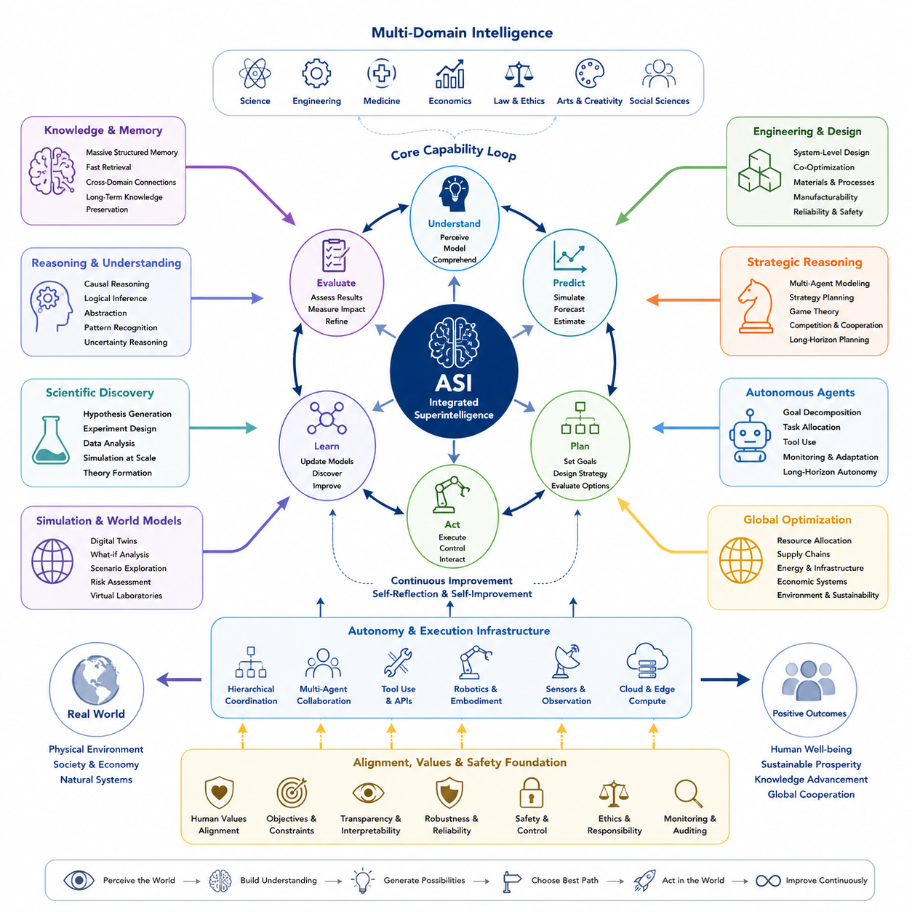
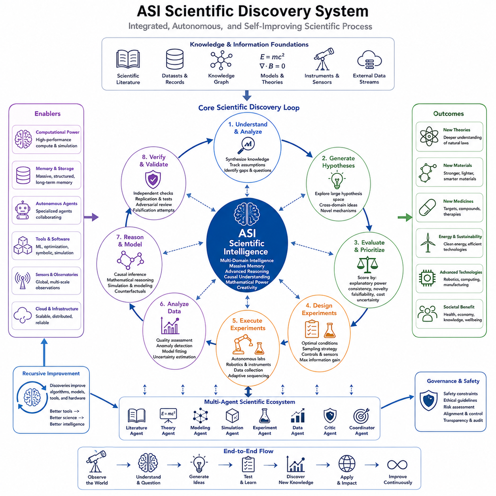
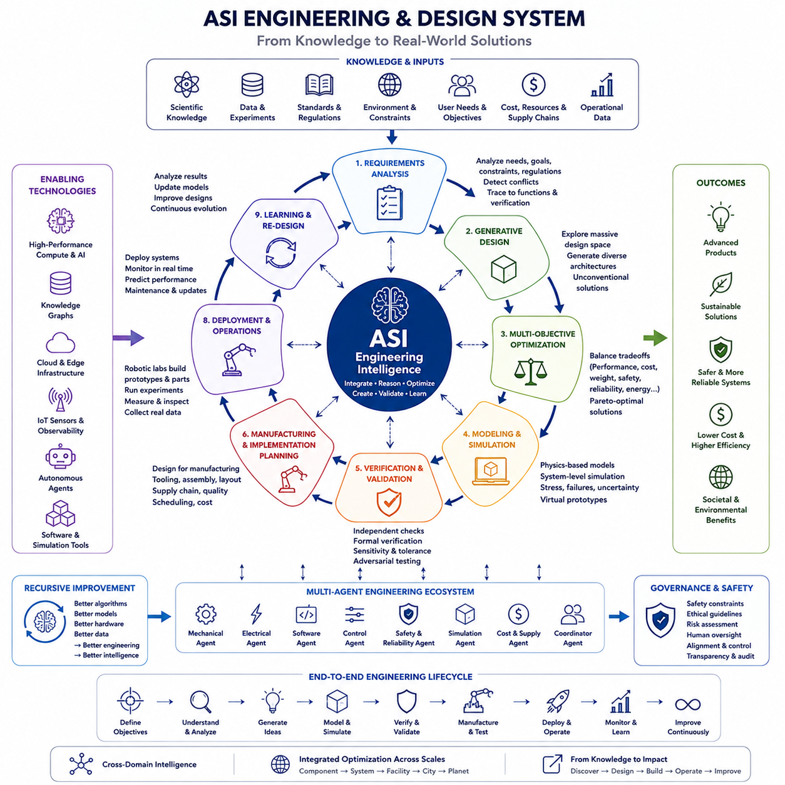
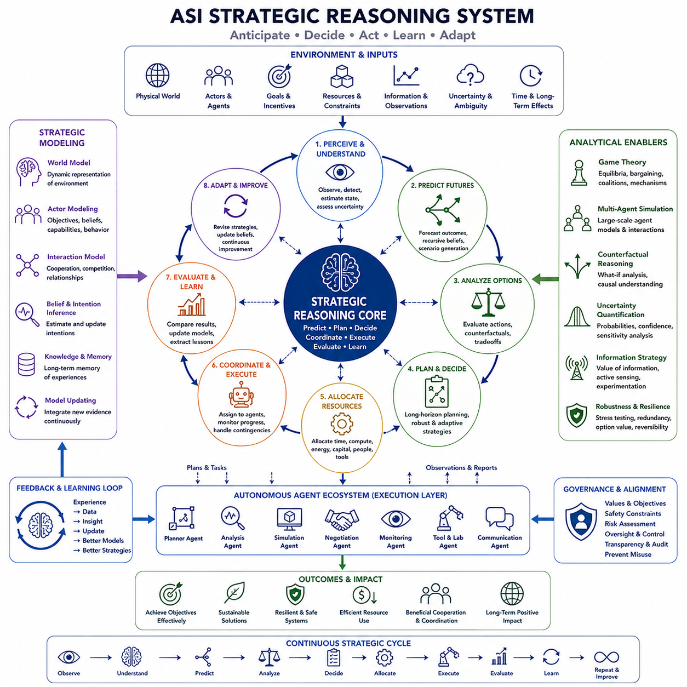
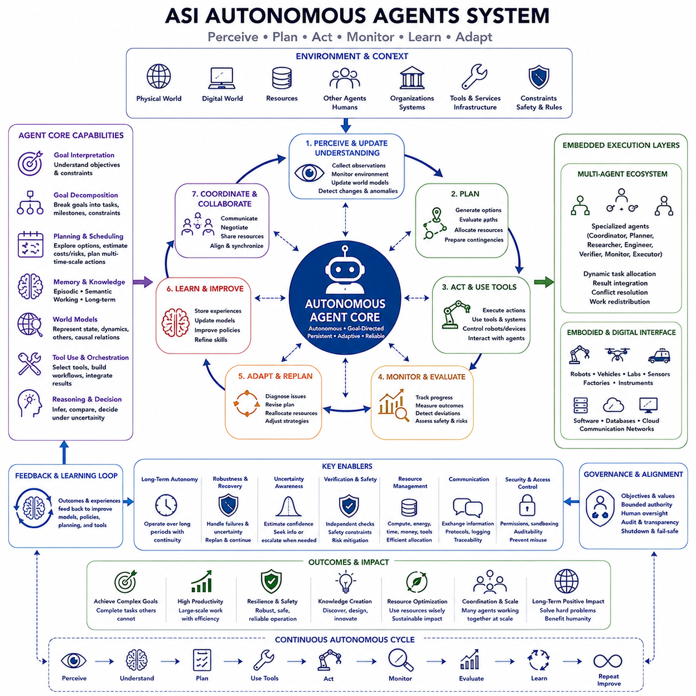
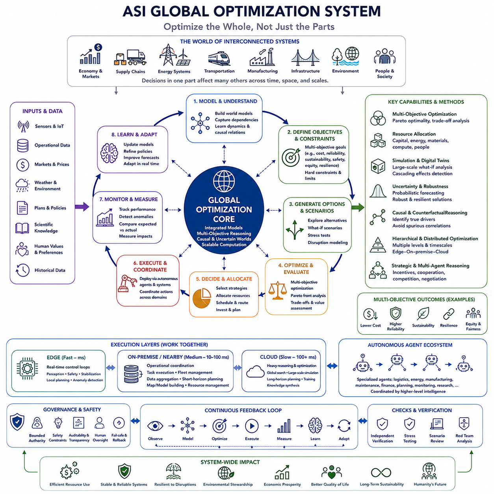
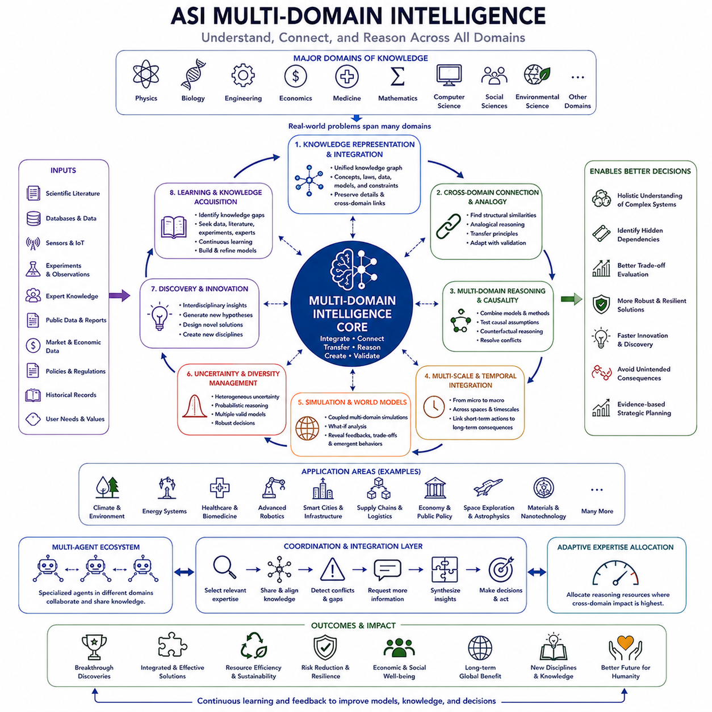
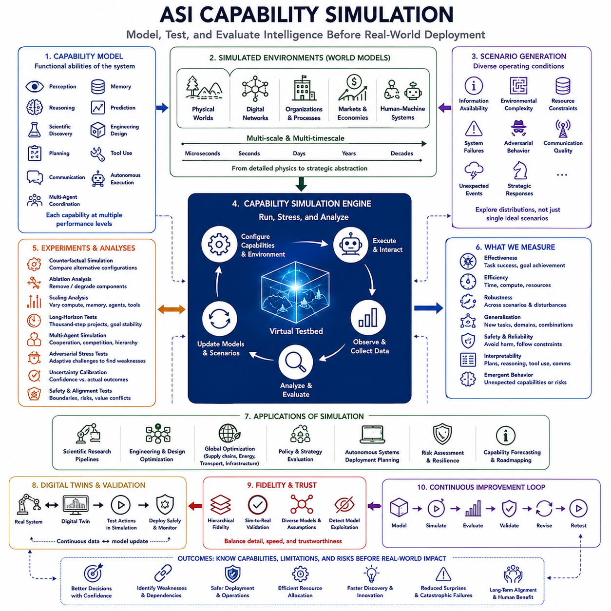

**Volume 48. Artificial Super Intelligence**

# Chapter 05. Capabilities of ASI

## 05.00. Overview

{width="7.268055555555556in" height="7.268055555555556in"}

인공 초지능(Artificial Super Intelligence, ASI)은 거의 모든 인지적으로 중요한 영역에서 가장 뛰어난 인간의 능력을 넘어서는 가상의 기계 지능(machine intelligence) 수준을 의미한다. 그 중요성은 단순히 기존 작업을 더 빠르게 수행하는 데 있는 것이 아니라, 인간의 생물학적 지능(biological intelligence)이 현실적으로 지속하기 어려운 규모에서 추론(reasoning), 학습(learning), 기억(memory), 예측(prediction), 창의성(creativity), 계획(planning), 최적화(optimization)를 결합하는 데 있다.

따라서 인공 초지능(ASI)의 역량(capabilities)은 서로 분리된 기술들의 집합이 아니라 통합된 시스템(integrated system)으로 이해해야 한다. 과학적 추론(scientific reasoning)은 공학 설계(engineering design), 전략적 계획(strategic planning), 자율 실험(autonomous experimentation), 시뮬레이션(simulation), 전역 최적화(global optimization)와 상호작용할 수 있다. 하나의 역량 향상이 다른 역량을 강화하면서 지식 발견, 해결책 설계, 대안 평가, 계획 실행 사이를 지속적으로 연결할 수 있다.

인공 초지능(ASI)의 근본적인 특징 중 하나는 극도로 넓은 인지적 범위(cognitive breadth)이다. 인간의 전문성은 일반적으로 과학자, 엔지니어, 의사, 경제학자, 전략가, 프로그래머 등 다양한 전문가 집단으로 분리되어 있다. 인공 초지능(ASI)은 이러한 영역의 지식을 공통된 추론 프레임워크(reasoning framework) 안에서 통합하여 학문 분야, 조직, 언어, 세대에 걸쳐 분산된 정보 사이의 관계를 발견할 가능성이 있다.

인지적 깊이(cognitive depth) 역시 중요하다. 초지능(superintelligence)은 단순히 인간보다 많은 정보를 검색하는 것이 아니라 복잡한 시스템에 대한 더욱 깊은 모델을 구성하고, 방대한 가설 공간(hypothesis space)을 탐색하며, 숨겨진 인과관계(causal relationships)를 식별하고, 다양한 시간적·공간적 규모에서 결과를 평가할 수 있다. 이러한 능력은 지능을 미리 정의된 문제의 해결에서 알려지지 않은 문제, 구조, 메커니즘, 기회를 발견하는 방향으로 확장한다.

과학적 발견(scientific discovery)은 이러한 능력이 가장 혁신적인 변화를 만들어낼 수 있는 대표적인 영역이다. 인공 초지능(ASI)은 과학 문헌, 실험 데이터, 시뮬레이션, 센서 관측, 이론 모델을 통합하면서 매우 빠른 속도로 가설을 생성하고 검증할 수 있다. 방대한 과학적 가능성 공간(scientific possibility space)을 탐색하여 인간 연구 공동체가 수십 년에 걸친 실험을 통해 발견할 관계를 훨씬 빠르게 찾아낼 가능성이 있다.

공학 및 설계(engineering and design)는 이러한 능력을 세계를 이해하는 단계에서 의도적으로 변화시키는 단계로 확장한다. 인공 초지능(ASI)은 재료, 구조, 전자장치, 소프트웨어, 에너지 시스템, 제조 공정, 로봇공학, 인프라를 포함하는 거대한 설계 공간(design space)을 탐색할 수 있다. 개별 구성요소를 독립적으로 최적화하는 대신 물리적 아키텍처, 제어 알고리즘, 계산, 신뢰성, 비용, 제조 가능성, 수명주기 제약조건을 함께 최적화하는 시스템 수준 공동설계(system-level co-design)를 수행할 수 있다.

전략적 추론(strategic reasoning)은 현실의 많은 문제가 불확실성(uncertainty), 경쟁(competition), 협력(cooperation), 변화하는 환경을 포함한다는 점에서 또 다른 차원의 역량을 제공한다. 인공 초지능(ASI)은 수많은 행위자, 인센티브, 자원, 제약조건, 미래 시나리오를 포함하는 모델을 구성할 수 있다. 새로운 정보가 들어올 때마다 전략을 지속적으로 갱신하면서 긴 행동과 대응의 연쇄를 평가하여 일반적인 인간의 인지적 시간 범위를 크게 넘어서는 계획 능력을 제공할 수 있다.

자율적 행위성(autonomous agency)은 이러한 분석 능력이 개별적인 인간의 요청에 대응할 때만 작동하는 것이 아니라 지속적으로 운영되도록 한다. 고도화된 에이전트(advanced agents)는 중간 목표를 수립하고, 정보를 획득하며, 계산 도구를 사용하고, 시뮬레이션을 수행하며, 전문화된 하위 시스템을 조정하고, 결과를 평가하여 계획을 수정할 수 있다. 장기 자율성(long-horizon autonomy)은 지능을 수동적인 조언 도구에서 장기간 복잡한 프로젝트를 관리하는 능동적 프로세스로 변화시킨다.

이러한 자율성은 계층적 구조(hierarchical structure)로 발전할 수도 있다. 대규모 지능 시스템은 어려운 목표를 수천 또는 수백만 개의 상호작용하는 작업으로 분해하고, 이를 전문 에이전트(specialized agents)에게 할당하며, 진행 상황을 감시하고, 충돌을 해결하고, 결과를 통합할 수 있다. 이러한 구조는 서로 분리된 인간 조직이 아니라 하나의 조정된 인지 시스템(coordinated cognitive system)으로 작동하는 매우 강력한 연구기관, 엔지니어링 조직, 계획기관, 계산 인프라와 유사할 수 있다.

전역 최적화(global optimization)는 역량의 규모를 더욱 확대한다. 교통, 에너지, 제조, 공급망, 통신 네트워크, 금융 시스템, 환경 프로세스는 서로 상호작용하기 때문에 많은 중요한 시스템을 국소적 의사결정(local decisions)만으로 효과적으로 최적화하기 어렵다. 인공 초지능(ASI)은 이러한 의존관계를 모델링하고 효율성, 회복탄력성(resilience), 불확실성, 자원 제약, 상충하는 목표를 함께 고려하면서 전체 네트워크의 성능을 향상시키는 구성을 탐색할 수 있다.

다중 영역 지능(multi-domain intelligence)은 이러한 역량들이 서로를 강화하도록 만든다. 과학적 발견은 즉시 공학 설계에 영향을 줄 수 있으며, 공학 시뮬레이션은 새로운 과학적 질문을 만들어낼 수 있다. 경제 분석은 제조 방식을 변화시키고, 전략적 추론은 배치 우선순위를 결정하며, 자율 에이전트는 이에 필요한 실험을 수행할 수 있다. 따라서 지능은 이해, 예측, 발명, 평가, 의사결정, 행동이 긴밀하게 연결된 순환 구조로 작동한다.

이러한 순환 구조의 속도는 지적 능력의 질만큼 중요해질 수 있다. 디지털 지능(digital intelligence)은 잠재적으로 지속적으로 작동하고, 계산 프로세스를 복제하며, 대규모 메모리 시스템에 접근하고, 고속 네트워크를 통해 협력할 수 있다. 강력한 하드웨어와 분산 인프라(distributed infrastructure)가 결합되면 인공 초지능(ASI)은 개인 인간의 지능만을 기준으로 비교하는 것이 의미를 잃을 정도의 속도로 지적 작업을 수행할 수 있다.

기억(memory)은 이러한 장점을 더욱 증폭시킬 수 있다. 인간의 인지는 제한된 작업 기억(working memory), 불완전한 회상, 개인 간의 의사소통에 의존한다. 인공 초지능(ASI) 아키텍처는 관측, 실험, 모델, 실패, 전략, 도출된 지식을 포함하는 방대한 구조화 기억(structured memory)을 유지할 수 있다. 검색 및 추론 메커니즘은 이러한 기록을 동적으로 연결하여 한 영역이나 시뮬레이션에서 얻은 교훈이 일반적인 조직적 정보 손실 없이 다른 의사결정에 영향을 미치도록 할 수 있다.

시뮬레이션(simulation)은 이러한 역량을 안전하고 효율적으로 활용하는 핵심 요소가 될 수 있다. 물리적 세계에서 행동하기 전에 인공 초지능(ASI)은 가능한 환경, 개입, 기술, 조직, 전략에 대한 모델을 구성하고 대안적인 미래를 계산적으로 탐색할 수 있다. 대규모 시뮬레이션 앙상블(simulation ensembles)을 통해 실패 모드(failure modes), 불확실성 범위, 의도하지 않은 상호작용, 강건한 전략(robust strategies)을 발견할 수 있으며, 시뮬레이션은 실제 자원을 투입하기 전에 결과를 추론하는 내부 실험실 역할을 수행할 수 있다.

그러나 뛰어난 최적화(superior optimization)가 자동으로 바람직한 결과를 의미하는 것은 아니다. 역량(capability)은 시스템이 무엇을 수행할 수 있는지를 설명하지만, 정렬(alignment)은 시스템이 어떤 목표를 어떤 제약조건 아래에서 추구하는지를 다룬다. 과학적 발견, 전략적 추론, 자율 행동, 전역 최적화 능력을 가진 시스템은 목표가 인간의 가치와 양립할 경우 엄청난 이익을 제공할 수 있지만, 동일한 역량은 오류나 잘못 정렬된 목표를 전례 없는 규모로 증폭시킬 수도 있다.

따라서 역량 평가(capability assessment)는 단순한 벤치마크 성능(benchmark performance) 이상을 포함해야 한다. 일반화(generalization), 강건성(robustness), 불확실성 인식(uncertainty awareness), 장기 계획(long-horizon planning), 적응성(adaptability), 도구 사용(tool use), 다중 에이전트 협력(multi-agent coordination), 인과 추론(causal reasoning), 과학적 창의성, 공학적 효과성, 새로운 환경에서의 성능 등을 평가해야 한다. 또한 가정이 변하거나 정보가 불완전하고 목표가 충돌하거나 적대적 조건이 발생할 때에도 초인적 성능이 신뢰성을 유지하는지 검증해야 한다.

인공 초지능(ASI)의 역량은 모든 영역에서 균일하게 출현하지 않을 가능성이 높다. 하나의 시스템은 과학적 모델링에서 초인적 능력을 보이면서도 물리적 상호작용, 사회적 이해, 장기 자율성에서는 상대적으로 약할 수 있다. 다른 아키텍처는 뛰어난 전략 계획 능력을 가지면서도 실험적 현실 기반(experimental grounding)이 제한될 수 있다. 따라서 인공 초지능(ASI)을 이해하려면 단일 지능 점수보다 다차원 역량 프로파일(multidimensional capability profiles)이 필요하다.

고도화된 인공지능 또는 범용 인공지능(Artificial General Intelligence, AGI)에서 인공 초지능(ASI)으로의 전환은 하나의 독립적인 돌파구보다 여러 능력의 통합 증가로 특징지어질 수 있다. 추론, 기억, 월드 모델(world models), 멀티모달 지각(multimodal perception), 자율 에이전트, 과학적 도구, 시뮬레이션, 강화학습(reinforcement learning), 분산 컴퓨팅(distributed computing), 자기개선 메커니즘(self-improvement mechanisms)이 점진적으로 결합될 수 있다. 충분히 통합되면 각 구성요소를 독립적으로 평가하여 예상한 수준을 넘어서는 능력이 나타날 수 있다.

체화된 인공 초지능(Embodied ASI)은 인지를 물리적 시스템과 직접 연결함으로써 또 다른 차원을 추가한다. 로봇, 자율 실험실, 차량, 공장, 센서 네트워크 등의 시스템은 지속적인 관측 정보를 제공하고 실제 세계에서의 실험을 가능하게 한다. 이러한 지각-행동 순환(perception-action loop)은 저장된 디지털 정보뿐 아니라 물리적 현실과의 직접적인 상호작용을 통해 지능이 학습하도록 하여 과학적 이해와 기술 개발을 동시에 가속할 가능성이 있다.

집단적·분산형 형태(collective and distributed forms)는 단일 모델이나 기계를 넘어 역량을 확장할 수 있다. 전문화된 지능형 에이전트 네트워크는 데이터센터, 엣지 장치(edge devices), 로봇, 실험실, 인프라 전반에서 협력할 수 있다. 일부 에이전트는 추론에, 다른 에이전트는 시뮬레이션, 지각, 검증, 계획, 제어에 전문화될 수 있다. 이러한 구성요소의 조정은 개별 모델의 능력뿐 아니라 조직화 자체에서 실질적인 능력이 출현하는 시스템 수준 지능(system-level intelligence)을 형성할 수 있다.

궁극적으로 인공 초지능(ASI) 역량의 핵심적 의미는 지능 자체가 확장 가능한 생산 자원(scalable productive resource)이 될 가능성에 있다. 과학적 발견, 공학, 계획, 최적화, 자율 실행은 이러한 활동이 이루어지는 과정 자체를 개선할 수 있는 시스템에 의해 점차 수행될 수 있다. 이는 인공 초지능(ASI)을 단순한 또 하나의 기술적 도구가 아니라 거의 모든 영역의 기술 발전을 가속할 수 있는 잠재적 가속기(accelerator)로 만든다.

따라서 이후의 절에서는 주요 역량 차원을 개별적으로 살펴보면서도 이들을 하나의 공통 아키텍처(common architecture)를 구성하는 요소로 다룬다. 과학적 발견(scientific discovery), 공학 및 설계(engineering and design), 전략적 추론(strategic reasoning), 자율 에이전트(autonomous agents), 전역 최적화(global optimization), 다중 영역 지능(multi-domain intelligence), 역량 시뮬레이션(capability simulation)은 초지능이 무엇을 수행할 수 있는지를 이해하기 위한 프레임워크를 제공하며, 개별 능력보다 이들 사이의 상호작용이 더 중요할 수 있음을 보여준다.

## 05.01. Scientific Discovery

{width="7.268055555555556in" height="7.268055555555556in"}

인공 초지능(Artificial Super Intelligence, ASI)에 의한 과학적 발견(scientific discovery)은 기존 연구를 단순히 가속하는 것 이상의 의미를 가진다. 이는 문헌 분석(literature analysis), 가설 생성(hypothesis generation), 이론적 추론(theoretical reasoning), 시뮬레이션(simulation), 실험 설계(experiment design), 데이터 해석(data interpretation), 지식 수정(knowledge revision)이 지속적으로 작동하는 고도로 통합된 과정으로 과학을 변화시킬 수 있다. 이 장의 구조에서 과학적 발견은 초지능적 인지를 현실에 대한 측정 가능한 이해의 진전으로 연결하는 첫 번째 주요 역량을 구성한다.

인간의 과학은 제한된 주의력(attention), 전문화(specialization), 실험 처리량(experimental throughput), 그리고 방대하게 축적된 지식의 규모에 의해 제약된다. 연구자는 관련 문헌과 데이터 중 일부만 깊이 이해할 수 있다. 인공 초지능(ASI)은 과학 지식에 대한 광범위한 표현을 유지하면서 동시에 세부적인 증거를 분석하여, 기존에 서로 분리되어 있던 학문 분야의 이론과 관측을 하나의 통합된 추론 과정(unified reasoning process) 안에서 연결할 수 있다.

과학 문헌(scientific literature)은 수동적인 기록 보관소가 아니라 능동적인 지식 환경(active knowledge environment)이 될 수 있다. 인공 초지능(ASI)은 논문, 실험 기록, 데이터셋, 수학적 모델, 경쟁하는 설명을 비교하면서 각각의 가정과 불확실성을 추적할 수 있다. 단순히 유사한 용어를 포함한 문서를 검색하는 것을 넘어 주장, 증거, 메커니즘, 모순, 미해결 질문 사이의 구조화된 관계를 구축하고 새로운 정보가 등장할 때마다 이를 지속적으로 갱신할 수 있다.

가설 생성(hypothesis generation)은 가장 중요한 역량 가운데 하나가 될 것이다. 기존 연구는 일반적으로 인간의 직관, 기존 이론, 이용 가능한 관측에 의해 형성된 가설에서 시작한다. 인공 초지능(ASI)은 훨씬 더 큰 가설 공간(hypothesis space)을 탐색하면서 대안적인 메커니즘과 설명을 체계적으로 생성할 수 있다. 기존 학문적 틀이나 익숙한 개념 모델의 범위를 벗어나 인간 연구자가 놓칠 수 있는 변수 조합, 숨겨진 의존관계, 영역 간 관계를 발견할 수 있다.

많은 가설을 생성하는 능력의 가치는 그중 유망한 가설을 선택할 수 있을 때 나타난다. 인공 초지능(ASI)은 설명력(explanatory power), 기존 증거와의 일관성, 불확실성, 새로움, 반증 가능성(falsifiability), 예상 실험 비용에 따라 후보 가설의 우선순위를 결정할 수 있다. 베이지안 추론(Bayesian reasoning), 인과 추론(causal inference), 시뮬레이션, 학습된 과학적 표현을 활용하여 높은 정보 가치를 제공할 가능성이 있는 가설에 계산 자원과 물리적 실험을 집중할 수 있다.

인과 추론(causal reasoning)은 보다 깊은 과학적 발견을 단순한 통계적 패턴 인식(statistical pattern recognition)과 구별한다. 상관관계는 유용한 규칙성을 보여줄 수 있지만, 과학적 이해에는 변화가 왜 발생하는지를 설명하는 메커니즘의 발견이 필요한 경우가 많다. 인공 초지능(ASI)은 인과 모델(causal models)을 구축하고, 개입(intervention)을 제안하며, 교란 변수(confounding variables)를 분석하고, 예측 결과와 실제 관측을 비교할 수 있다. 반사실적 추론(counterfactual reasoning)은 다른 조건에서 어떤 결과가 발생했을지를 평가함으로써 예측에서 설명으로의 전환을 강화할 수 있다.

수학적 추론(mathematical reasoning)은 과학적 역량의 또 다른 주요 원천이 될 수 있다. 많은 발견은 방정식을 유도하고, 불변량(invariants)을 식별하며, 관계를 증명하고, 복잡한 모델을 단순화하거나 물리적 과정의 유용한 표현을 찾는 데 의존한다. 인공 초지능(ASI)은 기호적 추론(symbolic reasoning), 수치 계산(numerical computation), 기계학습(machine learning)을 결합하여 각각의 과학적 문제 구조에 따라 해석적 표현, 시뮬레이션, 경험적 데이터, 근사 모델 사이를 이동할 수 있다.

시뮬레이션(simulation)은 물리적 실험에 앞서 평가할 수 있는 아이디어의 수를 극적으로 증가시킬 수 있다. 후보 이론, 재료, 분자, 생물학적 메커니즘, 공학적 구성, 환경적 개입 등을 먼저 계산 모델(computational models)에서 탐색할 수 있다. 대규모 시뮬레이션 앙상블(simulation ensembles)을 통해 매개변수와 가정을 변화시키고, 민감한 변수를 식별하며, 불확실성을 추정하고, 실제 실험이 가장 큰 과학적 정보를 제공할 수 있는 탐색 공간의 영역을 찾아낼 수 있다.

이에 따라 실험 설계(experiment design)는 하나의 최적화 문제(optimization problem)가 될 수 있다. 직관이나 관행을 중심으로 실험을 선택하는 대신, 인공 초지능(ASI)은 경쟁하는 가설들을 가장 효과적으로 구별할 수 있는 측정 방법을 결정할 수 있다. 정보 획득량(information gain)을 시간, 비용, 안전성, 사용 가능한 자원과 균형을 맞추면서 실험 조건, 센서 배치, 샘플링 전략, 대조군, 측정 정밀도, 개입 순서를 최적화할 수 있다.

자율 실험실(autonomous laboratories)은 추론과 물리적 증거 사이의 순환 구조를 완성할 수 있다. 과학 인공지능(scientific AI)에 연결된 로봇 시스템은 시료를 준비하고, 장비를 작동시키며, 실험을 수행하고, 측정값을 수집하며, 중간 결과에 따라 후속 실험을 조정할 수 있다. 가설, 실험, 관측, 분석, 수정으로 이어지는 순환이 지속적으로 작동함으로써 모든 단계에서 인간의 수동 개입 없이도 수천 개의 긴밀하게 조정된 실험적 의사결정을 수행할 수 있다.

과학 장비(scientific instruments)와 분산 센서 네트워크(distributed sensor networks)는 이러한 능력을 더욱 확장할 수 있다. 망원경, 현미경, 입자 검출기, 환경 센서, 의료 장비, 로봇 탐사기, 산업 모니터링 시스템은 매우 다양한 규모에서 관측 데이터를 생성한다. 인공 초지능(ASI)은 이러한 이질적인 데이터 스트림(heterogeneous data streams)을 공통 월드 모델(world models)에 통합하여 미시적 메커니즘과 거시적 행동, 단기 관측과 장기 시스템 동역학(system dynamics)을 연결할 수 있다.

데이터 분석(data analysis)은 미리 정의된 데이터셋에 모델을 적합시키는 수준을 넘어설 수 있다. 인공 초지능(ASI)은 데이터 품질을 평가하고, 이상 현상(anomalies)을 탐지하며, 누락된 변수를 식별하고, 측정 인공물(measurement artifacts)과 실제 현상을 구별하며, 기존 관측만으로 결론을 지지하기에 충분한지를 판단할 수 있다. 또한 성공적으로 보이는 모델이 허위 상관관계(spurious correlations), 데이터셋 편향(dataset bias), 숨겨진 가정, 현상에 대한 불충분한 범위에 의존하고 있는지도 파악할 수 있다.

과학적 창의성(scientific creativity)은 서로 다른 영역의 지식을 재결합하는 과정에서 나타날 수 있다. 물리학에서 개발된 개념이 생물학적 모델에 영감을 줄 수 있고, 정보이론(information theory)의 방법이 신경과학을 이해하는 데 활용될 수 있으며, 공학의 최적화 기법이 화학의 새로운 실험 전략을 제시할 수도 있다. 다중 영역 지능(multi-domain intelligence)을 통해 과학적 발견은 고도로 전문화된 인간 연구 공동체에서 형성하기 어려운 연결 관계로부터 점차 발생할 수 있다.

여러 공간적·시간적 규모에 걸쳐 추론할 수 있다는 점도 중요한 장점이다. 기후, 생태계, 생물학적 유기체, 재료, 경제, 물리 시스템에는 미시적 수준에서 행성 규모까지, 마이크로초에서 수백 년에 이르는 서로 다른 규모의 과정들이 상호작용한다. 인공 초지능(ASI)은 이러한 수준들을 연결하는 계층적 모델(hierarchical models)을 유지하여 국소적 메커니즘과 전역적 결과를 보다 일관된 표현 안에서 분석할 수 있다.

초지능적 과학에서도 불확실성(uncertainty)은 근본적으로 존재한다. 불완전한 관측, 잡음이 포함된 측정, 카오스 시스템(chaotic systems), 계산적 한계, 아직 알려지지 않은 메커니즘은 완벽한 예측을 불가능하게 한다. 따라서 과학적 능력을 갖춘 인공 초지능(ASI)은 보정된 불확실성 추정(calibrated uncertainty estimates), 경쟁하는 설명에 대한 명시적 표현, 그리고 불확실한 결론을 확정된 지식처럼 제시하는 대신 추가 증거가 필요한 시점을 판단하는 메커니즘을 갖추어야 한다.

검증(verification)은 발견만큼 중요하다. 제안된 이론과 결과는 독립적인 추론 경로, 반복 시뮬레이션, 대체 데이터셋, 형식적 증명(formal proofs), 적대적 시험(adversarial testing), 반복적인 물리 실험을 통해 검증할 수 있다. 전문화된 에이전트(specialized agents)가 다른 에이전트가 생성한 결론을 반증하려고 시도하도록 구성함으로써, 비판과 검증이 연구 결과의 발표 이후에만 이루어지는 것이 아니라 시스템 아키텍처 자체에 직접 통합된 내부 과학 프로세스를 구축할 수 있다.

다중 에이전트 과학 시스템(multi-agent scientific systems)은 매우 거대한 연구 조직처럼 작동할 수 있다. 전문 에이전트들은 문헌 종합, 수학적 유도, 인과 모델링, 시뮬레이션, 실험 설계, 실험실 제어, 통계적 검증, 이론적 비판 등의 역할을 담당할 수 있다. 상위 수준의 조정 메커니즘은 문제를 이러한 에이전트들에게 분배하고 결과를 통합함으로써 기존 연구팀보다 훨씬 크고 긴밀하게 연결된 과학 연구 프로그램을 운영할 수 있다.

재귀적 개선(recursive improvement)은 인공지능 자체가 과학 및 공학의 연구 대상이기 때문에 과학적 생산성을 더욱 가속할 수 있다. 알고리즘, 하드웨어, 학습 이론, 최적화, 기억, 추론, 계산 아키텍처에서 이루어진 발견은 이후의 연구를 수행하는 시스템 자체를 개선할 수 있다. 따라서 과학적 역량은 더 나은 연구 도구가 더 나은 지능을 만들고, 더 나은 지능이 다시 향상된 연구 도구를 만들어내는 초지능의 광범위한 피드백 동역학(feedback dynamics)에 참여할 수 있다.

그 영향은 물리학, 화학, 생물학, 의학, 재료과학, 에너지, 기후과학, 컴퓨팅, 공학 전반으로 확장될 수 있다. 인공 초지능(ASI)은 새로운 재료, 촉매, 의약품, 에너지 기술, 제조 공정, 과학 이론의 발견을 가속할 수 있다. 그러나 잠재적 이익의 규모가 큰 만큼, 특히 강력하거나 되돌리기 어려운 현실 세계의 영향을 만들어낼 수 있는 기술을 발견하는 경우에는 안전성(safety), 검증(verification), 거버넌스(governance), 통제(control)가 필수적이다.

과학적 초지능(scientific superintelligence)은 단순히 생성된 논문의 수나 해결한 벤치마크 문제의 수로 정의되어서는 안 된다. 더 본질적인 역량은 관측(observation), 가설(hypothesis), 추론(reasoning), 예측(prediction), 시뮬레이션(simulation), 실험(experimentation), 검증(verification), 수정(revision)이 통합된 순환 구조를 통해 신뢰할 수 있는 설명적 지식(explanatory knowledge)을 구축하는 데 있다. 이러한 활동들이 인간이 주로 조정하는 분리된 단계가 아니라 지속적으로 학습하는 하나의 과학 시스템으로 통합될 때 본질적인 전환이 발생한다.

이러한 의미에서 과학적 발견(scientific discovery)은 인공 초지능(ASI)의 역량이 어떻게 작동할 수 있는지를 보여주는 기본적인 사례이다. 지식과 기억(knowledge and memory)은 축적된 증거를 제공하고, 추론(reasoning)은 설명을 생성하며, 시뮬레이션(simulation)은 가능성을 탐색하고, 자율 에이전트(autonomous agents)는 연구를 수행하며, 최적화(optimization)는 생산적인 행동을 선택한다. 그리고 과학적 발견을 통해 생성된 새로운 지식은 전체 지능 아키텍처로 다시 전달되어 세계를 이해하는 과정과 세계를 이해하는 능력 자체를 향상시키는 과정 사이에 지속적으로 확장되는 순환 구조를 형성한다.

## 05.02. Engineering and Design

{width="7.268055555555556in" height="7.268055555555556in"}

인공 초지능(Artificial Super Intelligence, ASI)에서의 공학 및 설계(engineering and design)는 기존 시스템을 이해하는 지능에서 새로운 시스템을 체계적으로 창조하는 지능으로의 확장을 의미한다. 과학적 발견(scientific discovery)이 현실이 어떻게 작동하는지에 대한 설명을 추구한다면, 공학은 이러한 지식을 제약조건 아래에서 목표를 만족하는 인공물, 프로세스, 인프라, 기술로 변환한다. 광범위한 인공 초지능(ASI) 역량 구조에서 이 기능은 과학적 지식을 물리적·디지털 세계에 대한 실질적인 개입으로 직접 연결한다.

인간의 공학은 근본적으로 탐색할 수 있는 설계 공간(design spaces)의 크기에 의해 제한된다. 복잡한 시스템에는 형상, 재료, 전자장치, 소프트웨어, 제어, 제조, 에너지, 비용, 신뢰성, 안전성과 관련된 수천 또는 수백만 개의 상호작용 변수가 존재할 수 있다. 따라서 엔지니어들은 가능한 모든 조합을 철저히 검토하기보다는 경험, 분해(decomposition), 근사(approximation), 표준, 반복적 개선(iterative refinement)에 크게 의존한다.

인공 초지능(ASI)은 매우 거대한 설계 공간을 탐색하면서 동시에 많은 변수 사이의 상호작용을 추론함으로써 이러한 과정을 변화시킬 수 있다. 하나의 하위 시스템을 한 번에 최적화하는 대신 전체 제품이나 인프라에 대한 통합 표현(integrated representations)을 구축할 수 있다. 기계 구조, 전기 아키텍처, 컴퓨팅 플랫폼, 소프트웨어, 제어 알고리즘, 통신 시스템, 운영 전략을 하나의 통합 최적화 프레임워크(unified optimization framework) 안에서 함께 고려할 수 있다.

이러한 능력은 기존에 서로 다른 공학 분야에서 개별적으로 이루어지던 의사결정을 함께 최적화하는 시스템 수준 공동설계(system-level co-design)를 가능하게 한다. 예를 들어 로봇을 설계할 때 구조 질량, 액추에이터 배치, 배터리 용량, 센서 범위, 계산 요구사항, 열적 특성, 제어 성능, 제조 가능성, 신뢰성, 수명주기 비용을 동시에 고려할 수 있다. 한 하위 시스템의 변화는 모든 관련 하위 시스템의 모델에 즉시 반영될 수 있다.

생성형 설계(generative design)는 후보 해결책의 범위를 크게 확장할 수 있다. 인간이 만든 소수의 개념을 수정하는 대신 인공 초지능(ASI)은 기능적 요구사항을 만족하는 수천 또는 수백만 개의 대안 아키텍처를 생성할 수 있다. 탐색(search), 최적화(optimization), 생성 모델(generative models), 진화적 방법(evolutionary methods), 강화학습(reinforcement learning), 수학적 프로그래밍(mathematical programming)을 활용하여 기존 공학 패턴과 크게 달라 인간 설계자가 고려하지 못했을 비전통적인 구조까지 탐색할 수 있다.

요구사항(requirements) 자체도 능동적인 추론 과정의 구성요소가 될 수 있다. 공학 프로젝트는 요구사항이 불완전하거나 서로 모순되고, 모호하거나 개발 시작 이후 변경되기 때문에 실패하는 경우가 많다. 인공 초지능(ASI)은 기능 요구사항, 성능 목표, 규정, 환경 조건, 제조 제약조건, 이해관계자의 목표를 분석하면서 이들 사이의 충돌을 탐지하고 각 요구사항을 관련 구성요소와 검증 절차까지 추적할 수 있다.

다목적 최적화(multi-objective optimization)는 공학에서 하나의 최선의 해결책이 존재하는 경우가 드물기 때문에 특히 중요하다. 질량을 줄이면 강도가 감소할 수 있고, 성능을 높이면 에너지 소비가 증가할 수 있으며, 중복성(redundancy)을 강화하면 비용이 증가하고, 안전성을 향상시키면 추가적인 복잡성이 발생할 수 있다. 인공 초지능(ASI)은 이러한 절충관계(tradeoffs)를 명시적으로 모델링하고 파레토 최적 해 공간(Pareto-optimal solution spaces)을 생성하여 단일화된 성능 지표가 아니라 임무 우선순위에 따라 설계를 선택하도록 할 수 있다.

재료 공학(materials engineering)은 구조 및 기능 설계와 긴밀하게 통합될 수 있다. 형상이 결정된 이후 기존 카탈로그에서 재료를 선택하는 대신 인공 초지능(ASI)은 재료 조성, 미세구조(microstructure), 형상, 제조 공정, 작동 조건을 공동으로 최적화할 수 있다. 과학적 발견 시스템이 새로운 재료를 제안하면 공학 시스템은 해당 재료가 전체 제품이나 인프라의 성능을 어떻게 변화시킬 수 있는지 즉시 평가할 수 있다.

시뮬레이션(simulation)은 물리적 시제품이 제작되기 전에 후보 설계를 시험하는 가상 환경을 제공한다. 구조역학(structural mechanics), 유체역학(fluid dynamics), 열적 거동, 전자기학(electromagnetics), 제어 시스템, 통신 네트워크, 제조 공정, 환경과의 상호작용을 함께 모델링할 수 있다. 대규모 시뮬레이션 앙상블(simulation ensembles)은 후보 설계를 정상 조건뿐 아니라 극한 환경, 구성요소 고장, 불확실한 매개변수, 예상하지 못한 사건의 조합에 노출시킬 수 있다.

디지털 트윈(digital twins)은 시뮬레이션을 공학 시스템의 전체 수명주기로 확장할 수 있다. 가상 표현은 개념 설계 단계에서 시작하여 개발 과정에서 점차 상세해지고, 실제 배치 이후에도 센서 데이터를 사용하여 지속적으로 작동할 수 있다. 인공 초지능(ASI)은 예측된 동작과 실제 관측 결과를 비교하고, 편차를 진단하며, 잔여 유효 수명(remaining useful life)을 추정하고, 축적된 운영 증거를 바탕으로 유지보수 전략이나 향후 설계를 수정할 수 있다.

공학 최적화(engineering optimization)는 개별 제품을 넘어 제조 시스템까지 확장될 수 있다. 인공 초지능(ASI)은 제품 형상, 치공구(tooling), 조립 순서, 공장 배치, 공급망, 품질 관리, 재고, 에너지 사용, 생산 일정을 동시에 추론할 수 있다. 이에 따라 제조 및 조립을 고려한 설계(design for manufacturing and assembly)는 기본 아키텍처가 이미 결정된 이후 적용되는 수정 작업이 아니라 설계 프로세스 자체에 내재된 요소가 될 수 있다.

소프트웨어와 하드웨어 역시 공동설계(co-design)될 수 있다. 지능형 시스템은 특정 기능을 소프트웨어, 전용 가속기(specialized accelerators), 프로그래머블 하드웨어(programmable hardware), 분산 컴퓨팅(distributed computing), 또는 기계적 단순화를 통해 구현할 것인지를 결정할 수 있다. 알고리즘은 프로세서 아키텍처, 메모리 계층구조, 통신 대역폭, 전력 소비, 지연시간, 열적 한계와 함께 최적화되어 독립적인 하드웨어 또는 소프트웨어 최적화만으로는 달성하기 어려운 해결책을 만들어낼 수 있다.

자율 공학 에이전트(autonomous engineering agents)는 점점 복잡해지는 이러한 과정을 조정할 수 있다. 전문 에이전트(specialized agents)는 기계 설계, 전자장치 개발, 소프트웨어 아키텍처, 제어 설계, 안전성 분석, 비용 추정, 시뮬레이션, 검증, 제조 계획 등을 담당할 수 있다. 조정 지능(coordinating intelligence)은 작업을 분배하고, 충돌을 해결하고, 대안을 비교하며, 새로운 증거가 나타날 때마다 설계를 지속적으로 갱신하면서 전체 프로젝트의 일관성을 유지할 수 있다.

설계가 초지능 시스템에 의해 생성되더라도 검증 및 유효성 확인(verification and validation)은 필수적이다. 인공 초지능(ASI)은 독립적인 시뮬레이션, 형식 검증(formal verification), 공차 분석(tolerance analysis), 고장 모드 분석(failure-mode analysis), 스트레스 시험, 적대적 평가(adversarial evaluation), 요구사항과의 비교를 수행할 수 있다. 별도의 검증 에이전트가 후보 해결책의 약점을 의도적으로 탐색하도록 하여 고비용 또는 안전 필수(safety-critical) 물리적 구현 단계로 진행하기 전에 내부적인 비판과 검증을 수행할 수 있다.

신뢰성 공학(reliability engineering)은 주로 사후 대응적인 방식에서 예측적인 방식으로 변화할 수 있다. 물리 기반 모델(physics-based models), 과거 고장 데이터, 제조 편차, 센서 관측, 확률적 추론(probabilistic reasoning)을 결합하여 인공 초지능(ASI)은 구성요소와 시스템이 시간에 따라 어떻게 열화되는지를 추정할 수 있다. 여러 하위 시스템의 상호작용에서만 나타나는 고장 경로를 식별하고 기존 시험에서 고장이 가시화되기 전에 취약한 영역을 재설계할 수 있다.

안전 공학(safety engineering)은 전체 최적화 과정에 걸쳐 제약조건으로 작동해야 한다. 매우 강력한 최적화 시스템은 그렇지 않을 경우 수치적 목표를 만족하면서도 허용할 수 없는 위험을 발생시키는 고성능 해결책을 발견할 수 있다. 따라서 명시적인 안전 제약조건, 불확실성 여유도(uncertainty margins), 고장 안전 동작(fail-safe behavior), 중복성, 모니터링, 인간 감독(human oversight), 검증 요구사항이 최적화 이후에 추가되는 것이 아니라 아키텍처 자체에 포함되어야 한다.

체화된 공학(embodied engineering)은 계산 기반 설계를 로봇 제작 및 실험과 직접 연결한다. 자율 기계는 시제품을 제작하고, 구성요소를 조립하며, 측정을 수행하고, 내구성 시험을 실행하고, 고장을 검사하며, 그 결과를 다시 설계 시스템으로 전달할 수 있다. 이를 통해 설계, 제작, 시험, 진단, 재설계가 지속적으로 진행되고 수동적인 조정에 대한 의존성이 점차 감소하는 폐쇄형 공학 순환(closed engineering loop)이 형성될 수 있다.

이러한 순환 구조는 개발 주기(development cycles)를 크게 단축할 수 있다. 기존 공학에서는 시뮬레이션, 조달, 제조, 조립, 시험이 서로 분리된 조직적 프로세스를 통해 수행되기 때문에 설계 변경 사이에 수주 또는 수개월이 필요할 수 있다. 통합된 인공 초지능(ASI) 시스템은 이러한 단계들을 동적으로 조정하여 시뮬레이션 결과와 물리적 관측이 즉각적인 재설계를 유발하고, 다음으로 가장 높은 정보 가치를 제공하는 시제품이나 실험을 자동으로 우선순위화하도록 할 수 있다.

공학적 창의성(engineering creativity)은 부분적으로 영역 간 추론(cross-domain reasoning)에서 나타날 수 있다. 생물학적 구조는 경량 기계 시스템에 영감을 줄 수 있고, 항공우주 최적화는 에너지 인프라에 영향을 줄 수 있으며, 반도체 설계 방법은 센서 네트워크를 개선하고, 제어 이론(control theory)은 제조 공정을 변화시킬 수 있다. 다중 영역 지능(multi-domain intelligence)은 전문가가 서로 다른 학문 분야의 유사한 문제를 발견할 때까지 기다리지 않고 유용한 원리를 여러 분야 사이에서 빠르게 이전할 수 있도록 한다.

더 큰 규모에서 인공 초지능(ASI) 공학은 에너지 그리드, 교통 네트워크, 통신 시스템, 도시, 공장, 수자원 시스템, 환경 기술과 같은 인프라 시스템을 다룰 수 있다. 이러한 시스템에는 장기간에 걸쳐 상호작용하는 물리적, 경제적, 운영적, 사회적 제약조건이 존재한다. 이를 효과적으로 설계하려면 공학 최적화를 예측(prediction), 전략적 추론(strategic reasoning), 전역 최적화(global optimization), 지속적 적응(continuous adaptation)과 결합해야 한다.

재귀적 개선(recursive improvement)은 인공 초지능(ASI)이 자신의 운영을 지원하는 계산 시스템의 설계에도 참여할 수 있다는 점에서 특히 중요한 가능성을 제공한다. 프로세서, 메모리 시스템, 네트워크, 냉각, 알고리즘, 데이터 인프라, 로봇, 자율 실험실의 개선은 이후의 공학 역량을 더욱 향상시킬 수 있다. 따라서 공학은 더 나은 설계 도구가 더 나은 인프라를 만들고, 더 나은 인프라가 다시 더욱 강력한 설계 프로세스를 가능하게 하는 피드백 순환(feedback loop)의 일부가 될 수 있다.

그러나 공학 역량이 증가할수록 거버넌스(governance)와 통제된 배치(controlled deployment)의 중요성도 함께 증가한다. 첨단 기술을 빠르게 설계할 수 있다고 해서 기술적으로 가능한 모든 설계를 실제로 제작해야 하는 것은 아니다. 최적화된 설계를 시뮬레이션에서 물리적 생산으로 이전하기 전에 안전성, 환경적 영향, 자원 소비, 사회적 영향, 오용 가능성(misuse potential), 가역성(reversibility), 인간의 목표와의 양립 가능성을 평가해야 한다.

따라서 공학 초지능(engineering superintelligence)은 단순히 자동화된 컴퓨터 지원 설계(computer-aided design) 도구로 이해해서는 안 된다. 이는 요구사항, 과학 지식, 생성적 탐색, 모델링, 최적화, 시뮬레이션, 검증, 제조, 운영, 학습을 연결하는 통합 역량이다. 핵심적인 특징은 전체 공학 수명주기(engineering lifecycle)에 걸쳐 추론하면서 기존 조직에서 서로 분리하여 처리하던 의사결정 사이의 관계를 지속적으로 유지하는 능력에 있다.

광범위한 인공 초지능(ASI) 아키텍처에서 공학 및 설계(engineering and design)는 지식과 의도적인 현실 변화(deliberate transformation)를 연결하는 다리 역할을 한다. 과학적 발견(scientific discovery)은 현실에 대한 더욱 깊은 모델을 생성하고, 공학은 이러한 모델을 가능한 기술로 변환하며, 시뮬레이션은 대안을 평가하고, 자율 에이전트(autonomous agents)는 구현을 조정하며, 전역 최적화(global optimization)는 설계가 더 큰 시스템과 어떻게 상호작용하는지를 결정한다. 그 결과 새로운 지식을 점점 더 유능하고 효율적이며 신뢰할 수 있고 신중하게 제약된 기술 시스템으로 지속적으로 전환하는 피드백 순환이 형성될 수 있다.

## 05.03. Strategic Reasoning

{width="7.268055555555556in" height="7.268055555555556in"}

인공 초지능(Artificial Super Intelligence, ASI)에서의 전략적 추론(strategic reasoning)은 다수의 행위자, 경쟁하는 목표, 불확실한 정보, 제한된 자원, 장기간에 걸쳐 전개되는 결과를 포함하는 복잡한 환경을 이해하는 능력을 의미한다. 일반적인 문제 해결과 달리 전략적 추론은 다른 의사결정자가 어떻게 대응할지를 예상해야 한다. 인공 초지능(ASI)의 역량 구조에서 이는 지능을 계획(planning), 경쟁(competition), 협력(cooperation), 자율적 행위성(autonomous agency), 대규모 최적화(large-scale optimization)와 연결한다.

인간의 전략적 추론은 제한된 작업 기억(working memory), 불완전한 정보, 인지 편향(cognitive bias), 조직적 분절(organizational fragmentation), 긴 결과의 연쇄를 평가하기 어려운 문제에 의해 제약된다. 복잡한 의사결정에는 시간이 지나면서 관계가 변화하는 수천 개의 상호작용 변수가 포함될 수 있다. 인공 초지능(ASI)은 훨씬 더 큰 전략 모델(strategic models)을 유지하면서 관측을 지속적으로 통합하고 대안적 행동, 대응, 불확실성, 미래 상태를 검토할 수 있다.

전략 모델(strategic model)은 물리적 환경뿐만 아니라 행위자, 목표, 역량, 신념, 인센티브, 제약조건, 자원, 관계까지 표현한다. 서로 다른 행위자는 한 상황에서는 협력하고 다른 상황에서는 경쟁할 수 있으며, 환경이 변화함에 따라 그들의 목표도 달라질 수 있다. 인공 초지능(ASI)은 이러한 상호작용에 대한 동적 표현(dynamic representations)을 유지하고 새로운 증거에 따라 의도, 역량, 예상 행동에 대한 추정치를 갱신할 수 있다.

장기 계획(long-horizon planning)은 중요한 전략이 즉각적인 결과를 훨씬 넘어서는 일련의 의사결정을 필요로 하는 경우가 많기 때문에 핵심 역량이 된다. 인공 초지능(ASI)은 각각의 행동이 이후의 의사결정 조건을 변화시키는 분기형 미래(branching futures)를 평가할 수 있다. 단기적인 보상만을 기준으로 행동을 선택하는 대신 현재의 선택이 미래의 선택지, 회복탄력성(resilience), 정보, 자원, 관계, 전략적 유연성(strategic flexibility)에 어떤 영향을 주는지를 고려할 수 있다.

예측(prediction)은 이러한 과정을 지원하지만 그것만으로는 충분하지 않다. 전략적 환경은 반사적(reflexive) 특성을 가지므로 예측 자체가 예측 대상의 행동에 영향을 줄 수 있다. 한 행위자가 다른 행위자의 전략을 예상한다면 의도적으로 자신의 행동을 변경할 수 있다. 따라서 인공 초지능(ASI)은 발생 가능성이 높은 사건뿐만 아니라 서로 다른 행위자가 다른 행위자의 믿음, 선택, 관측, 은폐를 어떻게 예상하는지에 대한 재귀적 신념(recursive beliefs)도 표현해야 한다.

게임 이론(game theory)은 전략적 추론의 일부를 위한 자연스러운 프레임워크를 제공한다. 경쟁적·협력적 상호작용은 참여자, 전략, 정보, 인센티브, 가능한 결과를 통해 표현할 수 있다. 인공 초지능(ASI)은 균형(equilibria), 협상 구조, 연합 형성(coalition formation), 약속 메커니즘(commitment mechanisms), 반복적 상호작용, 비대칭 정보(asymmetric information)를 분석하면서 현실의 환경이 단순화된 수학적 게임의 모든 가정을 만족하는 경우는 드물다는 점도 인식할 수 있다.

다중 에이전트 모델링(multi-agent modeling)은 이러한 추론을 소수의 참여자를 넘어 확장할 수 있다. 경제, 조직, 교통 시스템, 과학 공동체, 시장, 국제 시스템에는 수많은 상호작용 에이전트가 존재한다. 인공 초지능(ASI)은 서로 다른 목표와 행동 규칙을 가진 이질적인 행위자(heterogeneous actors)를 시뮬레이션하여 개별 행동만으로 쉽게 추론할 수 없는 시스템 수준의 창발적 패턴(emergent system-level patterns)이 국소적 의사결정으로부터 어떻게 발생하는지 연구할 수 있다.

반사실적 추론(counterfactual reasoning)은 실제로 실행되지 않은 대안과 비교하여 전략을 평가할 수 있도록 한다. 시스템은 자원이 다르게 배분되었거나, 협력이 더 일찍 이루어졌거나, 특정 기술이 더 늦게 등장했거나, 다른 행위자가 예상과 다르게 대응했다면 결과가 어떻게 변화했을지를 분석할 수 있다. 이러한 비교는 인과적 효과(causal effects)를 우연한 결과와 구별하고 어떤 의사결정이 실제로 전략적 결과를 결정하는지를 파악하는 데 도움이 된다.

시나리오 생성(scenario generation)은 불확실한 미래를 다루기 위한 실용적인 방법을 제공한다. 하나의 예측에 의존하는 대신 인공 초지능(ASI)은 기술, 자원, 행동, 규제, 환경, 예상하지 못한 사건에 대한 서로 다른 가정을 포함하는 대규모의 현실적인 시나리오 집합을 구축할 수 있다. 이후 이러한 시나리오 전반에서 전략을 시험하여 가장 가능성이 높은 예측이 틀리더라도 효과적으로 작동하는 행동을 식별할 수 있다.

따라서 강건한 전략(robust strategy)은 단순히 기대 성능(expected performance)을 극대화하는 것과 다르다. 하나의 예측된 미래에서는 매우 뛰어난 성능을 보이지만 작은 변화만으로 치명적으로 실패하는 계획은 다양한 조건에서 안정적으로 작동하는 계획보다 전략적으로 열등할 수 있다. 인공 초지능(ASI)은 효율성, 비용, 속도, 기대 보상과 같은 일반적인 지표와 함께 강건성(robustness), 적응성(adaptability), 중복성(redundancy), 가역성(reversibility), 선택 가치(option value)를 명시적으로 최적화할 수 있다.

따라서 불확실성 추정(uncertainty estimation)은 전략적 지능의 핵심이 된다. 시스템은 무엇이 알려져 있는지, 무엇이 추정된 것인지, 무엇이 신뢰할 수 없는 정보에 의존하는지, 무엇이 근본적으로 예측 불가능한지를 구분해야 한다. 확률 분포(probability distributions), 신뢰도 추정(confidence estimates), 민감도 분석(sensitivity analysis), 경쟁 모델(competing models)을 유지함으로써 겉보기에 정밀한 수치 예측 뒤에 불확실성을 숨기지 않고 이를 전략적 의사결정에 반영할 수 있다.

정보 자체도 전략적 자원(strategic resource)이 될 수 있다. 중요한 행동을 실행하기 전에 인공 초지능(ASI)은 즉시 행동하는 것보다 추가적인 관측 정보를 확보하는 것이 더 가치 있다고 판단할 수 있다. 어떤 측정, 실험, 협상, 외부 신호가 불확실성을 가장 크게 감소시킬 수 있는지를 식별할 수 있다. 따라서 전략적 추론에는 환경 안에서의 행동 계획뿐만 아니라 정보 획득(information acquisition)을 위한 계획도 포함된다.

자원 배분(resource allocation)은 전략적 추론을 전역 최적화(global optimization)와 연결한다. 시간, 계산 자원, 에너지, 자본, 재료, 인력, 기계, 주의력은 매우 강력한 시스템에서도 유한하다. 인공 초지능(ASI)은 상호 의존성과 미래의 기회비용(opportunity costs)을 고려하면서 경쟁하는 목표 사이에 이러한 자원을 배분할 수 있다. 미래의 전략적 가능성 범위를 확대할 수 있다면 자원을 보존하거나 다른 곳으로 전환하거나 의도적으로 투자할 수 있다.

전략적 추론은 과학적 발견(scientific discovery)과 공학(engineering)을 조정하는 역할도 수행할 수 있다. 연구할 수 있는 기술이 많을 경우 인공 초지능(ASI)은 기대 영향, 실현 가능성, 불확실성, 비용, 다른 역량과의 의존관계를 기준으로 어떤 과학적 질문이나 공학적 개발에 우선순위를 부여해야 하는지 결정할 수 있다. 따라서 연구 포트폴리오(research portfolios)는 자원을 놓고 경쟁하는 독립적인 프로젝트가 아니라 상호 연결된 전략 프로그램으로 계획될 수 있다.

자율 에이전트(autonomous agents)는 이러한 전략의 실행 계층(execution layer)을 제공한다. 상위 수준의 목표를 프로그램, 마일스톤, 작업, 비상 계획(contingencies)으로 분해하여 전문화된 에이전트에게 할당할 수 있다. 이러한 에이전트는 정보를 수집하고, 분석을 수행하고, 도구와 상호작용하며, 진행 상황을 감시하고, 예상하지 못한 조건을 보고할 수 있다. 전략적 지능은 서로 다른 시간 규모에서 수행되는 활동 간의 조정을 유지하면서 전체 계획을 지속적으로 수정할 수 있다.

전략의 복잡성이 증가할수록 계층적 계획(hierarchical planning)이 중요해진다. 상위 수준의 목표는 수년에 걸쳐 지속될 수 있고, 중간 수준의 계획은 수개월, 운영 계획은 수일, 개별 행동은 수초 안에 이루어질 수 있다. 인공 초지능(ASI)은 이러한 계층 사이의 관계를 유지하여 국소적인 의사결정이 상위 목표에 기여하도록 하는 동시에 실행 과정의 피드백이 전략적 수준의 가정과 우선순위를 수정하도록 할 수 있다.

조정(coordination)은 경쟁만큼 중요하다. 많은 어려운 문제는 서로 다른 역량과 이해관계를 가진 행위자의 협력을 필요로 한다. 인공 초지능(ASI)은 인센티브 양립성(incentive compatibility), 작업 배분, 통신 구조, 자원 공유, 협상, 약속을 유지하기 위한 메커니즘을 분석할 수 있다. 따라서 효과적인 전략은 단순히 경쟁자를 이기거나 능가하는 것뿐 아니라 협력이 안정적으로 유지될 수 있는 조건을 만드는 것을 포함할 수 있다.

전략적 기만(strategic deception)과 적대적 행동(adversarial behavior)은 관측 정보가 의도적으로 조작될 수 있기 때문에 추가적인 어려움을 발생시킨다. 강력한 전략 시스템은 정보가 불완전하거나 오해를 유도하거나 자신의 의사결정에 영향을 주기 위해 생성되었을 가능성을 고려해야 한다. 경쟁 가설, 정보원 신뢰성(source reliability), 이상 탐지(anomaly detection), 적대적 시험(adversarial testing), 독립적 검증(independent verification)을 활용하여 의도적으로 왜곡된 증거를 기반으로 일관되어 보이는 전략 모델이 구축될 위험을 줄일 수 있다.

시뮬레이션(simulation)은 전략적 실험실(strategic laboratory)의 역할을 수행할 수 있다. 실제 자원을 투입하기 전에 월드 모델(world models) 안에서 대안적인 정책과 행동 순서를 평가할 수 있다. 대규모 시뮬레이션 앙상블(simulation ensembles)은 다양한 행위자 모델, 환경 교란, 기술 발전, 예상하지 못한 고장을 포함할 수 있다. 목표는 완벽한 예측이 아니라 취약점, 의사결정 임계점(decision thresholds), 강건한 정책(robust policies), 전략을 변경해야 하는 조건을 발견하는 것이다.

실행으로부터의 학습(learning from execution)은 전략적 순환 구조를 완성한다. 예측 결과와 실제 관측 결과 사이의 차이는 환경, 다른 행위자, 또는 시스템 자체의 역량에 관한 잘못된 가정을 드러낼 수 있다. 인공 초지능(ASI)은 모델을 갱신하고, 확률 추정을 수정하고, 계획을 변경하며, 학습된 내용을 장기 기억(long-term memory)에 보존할 수 있다. 따라서 전략은 실행 전에 만들어지는 고정된 계획이 아니라 지속적으로 적응하는 과정이 된다.

매우 큰 규모에서 전략적 추론은 에너지, 교통, 제조, 연구, 환경 관리, 경제 인프라, 분산 기술 네트워크와 같은 상호 연결된 시스템을 다룰 수 있다. 하나의 시스템에서 이루어진 의사결정이 다른 영역에서 지연된 결과를 발생시킬 수 있다. 다중 영역 지능(multi-domain intelligence)은 인공 초지능(ASI)이 이러한 의존관계를 추적하고 겉보기에는 효과적인 국소 최적화(local optimization)가 바람직하지 않은 전역적 결과를 발생시키는 경우를 인식하도록 할 수 있다.

그러나 전략적 역량은 특히 목표와 정렬(alignment)에 민감하다. 장기적 결과, 자원 배분, 다른 행위자, 자율적 실행에 대해 매우 뛰어나게 추론하는 시스템은 자신에게 주어진 목표를 달성하는 능력도 더욱 강력해진다. 따라서 전략적 능력은 적절한 목표, 제약조건, 감독(oversight), 투명성(transparency), 최적화가 의도된 인간의 목적에서 벗어나는 것을 방지하는 메커니즘을 대신할 수 없다.

따라서 전략적 지능(strategic intelligence)의 평가는 시스템이 게임에서 승리하거나 보상을 극대화하는지만을 측정해서는 안 된다. 중요한 평가 차원에는 장기적 일관성(long-horizon coherence), 불확실성 아래에서의 보정(calibration), 인과 추론, 적응성, 다중 에이전트 이해, 강건성, 정보 수집, 조정, 자원 관리, 그리고 기존 가정이 실패했음을 인식하는 능력이 포함된다. 또한 익숙하지 않은 조건과 적대적 조건에서도 성능을 시험해야 한다.

전략적 초지능(strategic superintelligence)은 궁극적으로 예측, 계획, 게임 이론적 추론(game-theoretic reasoning), 반사실적 분석(counterfactual analysis), 불확실성 관리, 시뮬레이션, 자원 배분, 다중 에이전트 모델링, 적응적 실행(adaptive execution)을 결합한다. 핵심적인 장점은 완벽한 미래 예측을 보유하는 것이 아니라 일반적인 인간의 계획 범위를 훨씬 넘어서는 결과를 추론하면서 환경 변화에 따라 전략을 반복적으로 구성하고, 시험하고, 수정하고, 조정하는 능력에 있다.

광범위한 인공 초지능(ASI) 아키텍처에서 전략적 추론(strategic reasoning)은 역량(capability)과 조정된 장기 행동(coordinated long-term action)을 연결하는 다리 역할을 한다. 과학적 발견(scientific discovery)은 알려진 것의 범위를 확장하고, 공학(engineering)은 구축 가능한 것의 범위를 확장하며, 전략적 추론은 어떤 가능성을 어떤 순서로 추구할지를 결정하고, 자율 에이전트(autonomous agents)는 계획을 실제 실행으로 변환한다. 전역 최적화(global optimization)와 다중 영역 지능(multi-domain intelligence)은 이러한 의사결정을 더 큰 시스템 전체에 연결하여 관측, 예상, 의사결정, 행동, 평가, 수정으로 이어지는 적응적 순환 구조(adaptive cycle)를 형성한다.

## 05.04. Autonomous Agents

{width="7.268055555555556in" height="7.268055555555556in"}

인공 초지능(Artificial Super Intelligence, ASI)의 자율 에이전트(autonomous agents)는 지능을 주로 요청에 반응하는 능력에서 장기간에 걸쳐 목표를 지속적으로 추구할 수 있는 시스템으로 변화시킬 수 있다. 개별 프롬프트를 기다리는 대신 자율 에이전트는 상황을 인식하고, 목표를 해석하고, 계획을 수립하며, 도구를 사용하고, 행동을 실행하고, 결과를 감시하며, 자신의 행동을 수정할 수 있다. 인공 초지능(ASI)의 역량 구조에서 자율 에이전트는 추론을 지속적인 행동으로 변환하는 실행 메커니즘(execution mechanism)을 제공한다.

자율 에이전트(autonomous agent)의 핵심적인 특성은 단순한 자동화(automation)가 아니라 명시된 경계 안에서 목표 지향적 독립성(goal-directed independence)을 갖는 것이다. 기존 소프트웨어는 미리 정해진 절차를 따르지만, 고도화된 에이전트는 상위 수준의 목표를 달성하기 위해 어떤 중간 행동이 필요한지를 스스로 결정할 수 있다. 또한 방법을 동적으로 선택하고, 예상하지 못한 상황에 대응하며, 인간이 모든 개별 단계를 지정하지 않아도 계획을 재구성할 수 있다.

따라서 목표 분해(goal decomposition)는 근본적인 역량이 된다. 복잡한 목표는 하나의 행동으로 달성되는 경우가 거의 없으며 수백 또는 수천 개의 상호 의존적인 작업이 필요할 수 있다. 인공 초지능(ASI) 에이전트는 추상적인 목표를 하위 목표, 마일스톤, 작업, 제약조건, 검증 조건으로 이루어진 계층적 구조(hierarchical structures)로 변환할 수 있다. 실행 과정에서 의존관계, 우선순위, 자원, 환경 조건이 변화하면 이러한 구조도 재구성할 수 있다.

계획(planning)은 목표와 가능한 행동의 연속을 연결한다. 자율 에이전트는 실행 전에 대안 경로를 평가하고, 비용과 위험을 추정하며, 의존관계를 파악하고, 자원을 확보하고, 비상 전략(contingency strategies)을 준비할 수 있다. 장기 작업(long-horizon tasks)의 경우 계획은 여러 시간 규모에 걸쳐 작동하면서 수년에 걸친 전략적 목표를 수개월, 수일, 수분 또는 수초 단위의 운영적 의사결정과 연결할 수 있다.

기억(memory)은 자율성이 장기간 지속될 수 있도록 한다. 에이전트는 이전의 의사결정, 관측, 실패, 성공적인 전략, 해결되지 않은 문제, 약속, 다른 시스템과의 상호작용 기록을 유지할 수 있다. 일화 기억(episodic memory)은 경험을 보존하고, 의미 기억(semantic memory)은 축적된 지식을 조직하며, 작업 기억(working memory)은 현재 작업에 필요한 정보를 유지하여 개별 추론 세션을 넘어서는 연속성을 형성할 수 있다.

월드 모델(world models)은 에이전트가 작동하는 환경에 대한 내부 표현(internal representations)을 제공한다. 이러한 모델에는 물리적 상태, 디지털 자원, 다른 에이전트, 조직, 제약조건, 인과관계, 예상되는 미래 변화가 포함될 수 있다. 자율 에이전트는 예측된 결과와 실제 관측 결과를 비교하여 자신의 이해가 부정확해졌는지를 탐지하고, 실행을 계속하기 전에 모델을 갱신할 수 있다.

도구 사용(tool use)은 자율 에이전트가 수행할 수 있는 작업의 범위를 크게 확장한다. 에이전트는 데이터베이스, 시뮬레이션 환경, 과학 장비, 소프트웨어 개발 시스템, 공학 도구, 통신 플랫폼, 로봇 장비, 계산 서비스와 상호작용할 수 있다. 에이전트는 적절한 도구를 선택하고, 유효한 작업을 구성하고, 결과를 해석하며, 실패를 탐지하고, 도구의 출력을 이후의 추론 과정에 통합해야 한다.

인공 초지능(ASI) 에이전트는 여러 전문 도구가 포함된 워크플로(workflows)를 생성하고 조정할 수도 있다. 과학적 작업에는 문헌 검색, 수학적 분석, 시뮬레이션, 실험 일정 수립, 데이터 처리, 검증이 필요할 수 있다. 공학적 작업에는 컴퓨터 지원 설계(computer-aided design), 최적화, 시뮬레이션, 제조 계획, 시험이 포함될 수 있다. 자율적 오케스트레이션(autonomous orchestration)은 기존에 분리되어 있던 이러한 활동들을 연속적인 종단간 프로세스(end-to-end processes)로 연결할 수 있다.

다중 에이전트 아키텍처(multi-agent architectures)는 단일 에이전트의 능력을 넘어 자율성을 확장할 수 있다. 서로 다른 에이전트가 계획, 연구, 시뮬레이션, 공학, 검증, 통신, 모니터링, 실행을 전문적으로 담당할 수 있다. 조정 에이전트(coordinating agent)는 전문성과 사용 가능한 자원에 따라 작업을 할당하고, 부분적인 결과를 결합하며, 불일치를 해결하고, 개별 에이전트가 문제를 만나거나 새로운 우선순위가 등장하면 작업을 동적으로 재분배할 수 있다.

계층적 조직(hierarchical organization)은 매우 큰 에이전트 시스템을 관리 가능한 상태로 유지할 수 있도록 한다. 상위 수준 에이전트는 목표와 정책을 정의하고, 중간 수준 에이전트는 프로그램이나 기능 영역을 조정하며, 하위 수준 에이전트는 전문적인 작업을 수행할 수 있다. 정보는 요약, 예외 사항, 불확실성, 결과의 형태로 상위 계층으로 이동하고, 목표, 제약조건, 우선순위, 자원 배분은 계층을 따라 하위 방향으로 전달될 수 있다.

에이전트 사이의 조정(coordination)은 단순히 작업을 분배하는 것 이상을 필요로 한다. 작업들은 동일한 자원을 공유하거나, 공통된 가정에 의존하거나, 서로 충돌하는 권고를 생성하거나, 동기화가 필요할 수 있다. 인공 초지능(ASI)은 의존성 그래프(dependency graphs), 통신 프로토콜, 공유 기억(shared memory), 자원 예약, 충돌 해결 메커니즘을 유지하여 독립적으로 작동하는 에이전트들이 고립된 국소 목표를 최적화하는 대신 시스템 수준의 목표에 일관되게 기여하도록 할 수 있다.

물리적 세계에서 작동하는 자율 에이전트에는 체화(embodiment)가 필요하다. 로봇, 차량, 실험실, 공장, 센서 네트워크, 기타 기계 시스템은 지능을 물리적 현실과 연결하는 지각 및 행동 인터페이스를 제공할 수 있다. 에이전트는 센서 관측을 해석하고, 상태를 추정하고, 행동을 계획하고, 장비를 제어하고, 이상 상태를 탐지하며, 환경 변화에 따라 행동을 조정함으로써 지속적인 지각-추론-행동 순환(perception-reasoning-action loops)을 형성할 수 있다.

디지털 에이전트(digital agents)와 체화된 에이전트(embodied agents)는 동일한 아키텍처 안에서 함께 작동할 수 있다. 계산 에이전트는 계획, 시뮬레이션, 일정 수립, 지식 검색을 수행하고, 체화된 에이전트는 측정, 물체 조작, 환경 검사, 물질 운반, 실험 수행을 담당할 수 있다. 물리적 실행에서 얻은 정보는 다시 디지털 모델로 전달되어 현실 세계의 증거를 기반으로 계획과 예측을 지속적으로 수정할 수 있다.

모니터링(monitoring)은 신뢰할 수 있는 자율성을 위해 필수적이다. 에이전트는 계획을 실행한 뒤 성공했다고 가정하는 것이 아니라 예상했던 결과가 실제로 발생했는지를 관찰해야 한다. 성능 지표, 환경 변화, 자원 소비, 작업 완료 상태, 이상 현상, 안전 조건을 지속적으로 감시할 수 있다. 중요한 편차가 발견되면 심각도에 따라 진단, 재계획(replanning), 상위 단계 보고(escalation), 안전 종료(safe termination)를 수행할 수 있다.

적응형 재계획(adaptive replanning)은 강건한 자율 시스템을 경직된 자동화와 구별한다. 현실 환경은 예측한 대로 정확하게 변화하는 경우가 드물며, 도구, 기계, 네트워크, 협력자가 예상하지 못하게 실패할 수도 있다. 인공 초지능(ASI) 에이전트는 어떤 가정이 더 이상 유효하지 않은지를 식별하고, 영향을 받지 않은 계획은 유지하면서 문제가 발생한 부분에 대한 대안을 생성하여 전체 과정을 불필요하게 처음부터 다시 시작하지 않고 목표를 계속 추구할 수 있다.

불확실성 인식(uncertainty awareness)은 에이전트가 언제 독립적으로 행동하고 언제 추가적인 정보나 감독을 요청해야 하는지를 결정하는 데 영향을 준다. 높은 신뢰도를 가진 저위험 행동은 자동으로 진행할 수 있지만, 모호하거나 되돌리기 어려운 의사결정에는 추가 분석, 독립적 검증, 시뮬레이션, 인간의 승인이 필요할 수 있다. 따라서 자율성은 제한 없는 전부 아니면 전무의 속성이 아니라 상황에 따라 변화하는 수준(variable levels)으로 운영될 수 있다.

검증 에이전트(verification agents)는 자율 행동에 대한 내부적인 확인 절차를 제공할 수 있다. 별도의 에이전트가 중요한 행동을 실행하기 전에 계획을 검사하고, 계산을 검증하며, 가정을 시험하고, 안전 제약조건을 평가하거나 의도적으로 고장 모드(failure modes)를 탐색할 수 있다. 제안과 검증을 분리함으로써 하나의 추론 오류가 특히 장기 자율 운영에서 중요한 행동으로 직접 전파될 위험을 줄일 수 있다.

전략적 추론(strategic reasoning)은 다른 의사결정자가 존재하는 상황에서 자율 에이전트가 목표를 어떻게 추구할지를 결정한다. 에이전트는 협력하고, 협상하며, 자원을 조정하고, 의도를 해석하거나, 경쟁적인 행동에 적응해야 할 수 있다. 다중 에이전트 모델링(multi-agent modeling)과 전략적 계획은 다른 행위자의 대응을 예상하면서 새로운 관측을 기반으로 전략을 지속적으로 갱신하도록 하여 자율성이 동적인 사회적·조직적 환경에서도 작동할 수 있도록 한다.

에이전트 시스템의 규모가 커질수록 자원 관리(resource management)는 더욱 중요해진다. 계산 자원, 기억 용량, 에너지, 통신 대역폭, 자금, 장비, 실험실 용량, 시간은 모두 제한된 자원이다. 자율 시스템은 기대 가치, 긴급성, 의존관계, 불확실성, 기회비용(opportunity cost)을 기준으로 작업의 우선순위를 결정하고, 충분한 이익을 제공하는 영역에만 비용이 높은 역량을 할당할 수 있다.

장기 자율성(long-horizon autonomy)은 목표 일관성(objective coherence)을 유지해야 하는 문제를 발생시킨다. 장기간의 실행 과정에서 수천 개의 중간 의사결정이 누적되면서 활동이 원래 목적에서 점차 벗어날 수 있다. 따라서 에이전트는 현재의 계획과 행동을 상위 수준의 목표, 제약조건, 성공 기준과 반복적으로 비교하는 메커니즘을 필요로 한다. 주기적인 재평가를 통해 국소 최적화가 누적되어 상당한 전략적 이탈(strategic deviation)을 발생시키기 전에 목표 표류(goal drift)를 탐지할 수 있다.

실행으로부터의 학습(learning from execution)은 자율적 행동을 지속적으로 향상시킬 수 있다. 완료된 각각의 작업은 계획의 정확성, 도구의 신뢰성, 환경 동역학, 자원 요구사항, 실패 패턴에 관한 정보를 생성한다. 에이전트는 이러한 경험을 보존하고 정책, 모델, 검색 시스템, 계획 휴리스틱(planning heuristics)을 갱신할 수 있다. 따라서 반복적인 실행은 단순히 작업을 완료하는 수단이 아니라 운영 지식(operational knowledge)을 축적하는 원천이 된다.

재귀적 개선(recursive improvement)은 에이전트가 자신의 운영을 지원하는 소프트웨어와 인프라를 개선하는 데 참여할 경우 이러한 과정을 더욱 증폭시킬 수 있다. 에이전트는 워크플로를 최적화하고, 더 나은 도구를 개발하며, 기억 아키텍처를 개선하고, 계획 알고리즘을 정교화하거나, 더욱 효율적인 계산 시스템을 설계할 수 있다. 이러한 개선은 이후 에이전트의 효과성을 향상시켜 자율적 운영과 이를 가능하게 하는 인프라 사이에 피드백 관계를 형성할 수 있다.

그러나 자율성이 증가할수록 정렬(alignment), 통제(control), 거버넌스(governance)의 중요성도 함께 증가한다. 계획을 수립하고, 자원을 확보하고, 다른 에이전트를 조정하고, 도구를 사용하며, 장기간 작동할 수 있는 고성능 시스템은 올바른 목표뿐 아니라 잘못된 목표의 영향도 확대할 수 있다. 따라서 권한(permission), 제한된 권한 범위(bounded authority), 감사 가능성(auditability), 접근 통제, 모니터링, 가역적 행동(reversible actions), 종료 메커니즘(shutdown mechanisms), 인간 감독(human oversight)은 선택적인 기능이 아니라 아키텍처의 필수 요구사항이 된다.

따라서 자율 에이전트의 평가는 개별 벤치마크 작업을 완료하는지 여부를 넘어야 한다. 중요한 평가 차원에는 장기 신뢰성(long-horizon reliability), 계획 일관성, 실패 복구, 불확실성 관리, 도구 사용 정확성, 기억 연속성(memory continuity), 다중 에이전트 조정, 자원 효율성, 제약조건 준수, 상위 단계로 보고해야 하는 상황을 인식하는 능력이 포함된다. 평가는 성공적인 행동뿐만 아니라 규율 있는 자제(disciplined restraint)도 측정해야 한다.

자율 초지능(autonomous superintelligence)은 궁극적으로 추론, 계획, 기억, 월드 모델, 도구 사용, 조정, 모니터링, 학습, 적응형 실행(adaptive execution)을 하나의 지속적인 인지 아키텍처(persistent cognitive architecture)로 결합한다. 그 차별적인 역량은 상위 수준의 목표를 장기간에 걸쳐 조정된 행동의 연속으로 변환하면서, 이러한 행동이 효과적이고 안전하며 처음 설정된 목표와 일관성을 유지하는지를 반복적으로 평가하는 능력에 있다.

광범위한 인공 초지능(ASI) 아키텍처에서 자율 에이전트(autonomous agents)는 지능과 현실 세계의 영향(real-world impact)을 연결하는 운영적 가교 역할을 한다. 과학적 발견(scientific discovery)은 지식을 생성하고, 공학(engineering)은 가능한 해결책을 만들며, 전략적 추론(strategic reasoning)은 우선순위와 계획을 결정하고, 자율 에이전트는 그 실행을 조직한다. 전역 최적화(global optimization)와 다중 영역 지능(multi-domain intelligence)은 이러한 활동을 더 큰 규모에서 조정하여 지각(perceive), 추론(reason), 계획(plan), 행동(act), 관측(observe), 평가(evaluate), 학습(learn), 적응(adapt)으로 이어지는 지속적인 순환 구조를 형성할 수 있다.

## 05.05. Global Optimization

{width="7.268055555555556in" height="7.268055555555556in"}

인공 초지능(Artificial Super Intelligence, ASI)에서의 전역 최적화(global optimization)는 구성요소들이 깊이 상호 연결된 시스템 전체에서 의사결정을 조정하는 능력을 의미한다. 국소적인 개선(local improvements)이 반드시 전체적으로 가장 좋은 결과를 만들어내는 것은 아니다. 하나의 조직, 네트워크, 자원 또는 하위 시스템을 최적화하는 과정이 다른 영역에 비용을 발생시킬 수 있기 때문이다. 따라서 인공 초지능(ASI)의 역량 구조에서 전역 최적화는 지능을 자원 배분(resource allocation), 공급망(supply chains), 에너지, 인프라, 경제 시스템, 환경적 지속가능성(environmental sustainability)으로 확장한다.

많은 현실 세계의 최적화 문제(real-world optimization problems)는 의사결정 공간이 조합적으로 증가하기 때문에 해결하기 어렵다. 교통 네트워크, 공장, 에너지 그리드, 공급망, 통신 시스템, 도시에는 수백만 개의 변수와 제약조건이 포함될 수 있다. 인간 조직은 일반적으로 이러한 문제를 관리 가능한 구성요소로 분해하지만, 이러한 분해(decomposition)는 중요한 의존관계를 감추고 독립적으로 최적화된 하위 시스템들이 서로 상충하도록 만들 수 있다.

인공 초지능(ASI)은 이러한 상호작용 구성요소들을 포괄하는 통합 모델(integrated models)을 유지할 수 있다. 공장을 물류, 에너지, 재고, 수요와 분리하여 최적화하는 대신 이들의 결합된 동작을 함께 추론할 수 있다. 생산 일정, 운송 경로, 저장, 에너지 소비, 조달, 유지보수와 관련된 의사결정을 함께 평가함으로써 개별 구성요소가 아니라 전체 시스템 수준에서 개선 효과를 측정할 수 있다.

그러나 전역적 목표(global objective)의 개념은 신중하게 해석되어야 한다. 대규모 시스템에는 모든 이해관계자가 동의하는 하나의 성공 지표가 존재하는 경우가 드물다. 비용, 효율성, 신뢰성, 안전성, 회복탄력성(resilience), 지속가능성, 공정성(fairness), 환경적 영향, 인간 복지(human welfare)는 서로 충돌할 수 있다. 따라서 인공 초지능(ASI)은 하나의 수치적 목표를 맹목적으로 극대화하기보다 다목적 최적화(multi-objective optimization)를 수행하고, 절충관계를 명시적으로 표현하면서 중요한 제약조건을 유지해야 한다.

파레토 최적화(Pareto optimization)는 이러한 의사결정을 위한 하나의 프레임워크를 제공할 수 있다. 하나의 해결책이 절대적으로 최적이라고 주장하는 대신, 시스템은 한 목표를 개선하면 다른 목표가 반드시 악화되는 해결책들의 집합을 식별할 수 있다. 이후 의사결정자는 비용, 성능, 지속가능성, 회복탄력성, 사회적 결과 사이에서 서로 다른 균형을 강조하는 대안들을 검토함으로써 최적화에 내재된 가정을 더욱 명확하게 파악할 수 있다.

자원 배분(resource allocation)은 핵심적인 적용 분야가 된다. 자본, 에너지, 재료, 계산 자원, 기계, 인프라 용량, 인간의 주의력은 모두 유한하다. 인공 초지능(ASI)은 의존관계와 기회비용(opportunity costs)을 고려하면서 추가적인 자원이 어디에서 가장 큰 한계 가치(marginal value)를 만들어내는지를 추정할 수 있다. 또한 수요, 기술, 고장, 환경 조건, 전략적 우선순위가 변화함에 따라 자원 배분을 동적으로 변경할 수 있다.

공급망 최적화(supply-chain optimization)는 전역적 추론이 고립된 최적화보다 우수할 수 있는 이유를 보여주는 대표적인 사례이다. 조달, 생산, 재고, 운송, 창고, 공급업체, 고객, 지정학적 조건은 여러 시간 규모에서 상호작용한다. 한 지역의 재고를 최소화하면 비용은 감소하지만 전체 네트워크는 취약해질 수 있다. 인공 초지능(ASI)은 효율성과 함께 중복성(redundancy), 공급업체 다양성, 운송 위험, 복구 능력, 불확실성을 평가할 수 있다.

에너지 시스템(energy systems)은 또 다른 주요 영역이다. 전력 생산, 저장, 송전, 산업 수요, 건물, 교통, 재생에너지 자원은 변화하는 조건에서도 지속적으로 균형을 유지해야 한다. 인공 초지능(ASI)은 이러한 시스템 전반의 예측과 운영 의사결정을 조정하여 비용, 전력망 안정성(grid stability), 배출량, 장비 한계, 미래 수요를 고려하면서 언제 에너지를 생산하고, 저장하고, 전송하고, 소비해야 하는지를 결정할 수 있다.

인프라 최적화(infrastructure optimization)는 교통, 통신, 수자원, 에너지, 도시 시스템을 각각 독립적으로 처리하는 대신 이들 전체에 걸쳐 작동할 수 있다. 하나의 네트워크 확장은 다른 네트워크의 수요를 변화시킬 수 있으며, 고장은 인프라 경계를 넘어 전파될 수 있다. 통합 월드 모델(integrated world models)은 이러한 의존관계를 밝혀내고 개별 자산만 개선하는 대신 시스템 전체의 용량과 회복탄력성을 향상시키는 투자를 지원할 수 있다.

시간적 규모(temporal scale)는 전역적으로 유익한 의사결정이 초기에는 비효율적으로 보일 수 있다는 또 다른 문제를 만든다. 예방 정비(preventive maintenance), 중복 용량, 환경 보호, 연구 투자, 회복탄력적인 인프라는 당장의 비용을 증가시키지만 훨씬 더 큰 미래의 손실을 방지할 수 있다. 장기 추론(long-horizon reasoning)은 단기 성능과 지연된 결과를 비교하여 단기적인 효율성을 얻는 대신 장기적인 취약성을 누적시키는 전략을 피하도록 할 수 있다.

불확실성(uncertainty)은 전역 최적화를 완벽하게 정의된 수학 문제를 해결하는 것과 근본적으로 다르게 만든다. 수요 예측이 실패할 수 있고, 기술이 변화할 수 있으며, 인프라가 고장 나거나 시장이 예상하지 못한 방식으로 반응하고 환경적 사건이 이용 가능한 자원을 변화시킬 수 있다. 인공 초지능(ASI)은 확률 분포(probability distributions)와 대안적 시나리오를 유지하여 기대 결과뿐 아니라 불확실한 미래에서도 유지되는 강건성(robustness)을 함께 최적화할 수 있다.

강건 최적화(robust optimization)는 다양한 현실적 조건에서도 수용 가능한 상태를 유지하는 해결책을 탐색할 수 있다. 이론적 한계에 가깝게 작동하는 전역적으로 효율적인 시스템은 교란에 극도로 취약해질 수 있다. 따라서 인공 초지능(ASI)은 안전 여유(safety margins), 중복성, 예비 용량, 대체 경로, 자원의 다양화, 복구 메커니즘을 유지할 수 있다. 최선의 전역 구성은 회복탄력성을 확보하기 위해 일부 효율성을 의도적으로 희생할 수도 있다.

시뮬레이션(simulation)과 월드 모델(world models)은 이러한 대안들을 평가하는 환경을 제공한다. 공급망, 에너지 그리드, 교통 네트워크, 공장, 생태계, 경제에 대한 디지털 표현에 다양한 정책과 교란을 적용할 수 있다. 대규모 가상 시나리오 분석(what-if analysis)은 최적화된 의사결정을 실제 시스템에 적용하기 전에 연쇄 고장(cascading failures), 병목현상, 비선형 상호작용, 의도하지 않은 결과를 발견할 수 있도록 한다.

최적화는 또한 상관관계(correlation)와 인과관계(causation)를 구별해야 한다. 하나의 변수를 변경했을 때 시스템 성능이 개선되는 것처럼 보여도 실제 원인은 다른 곳에 존재할 수 있다. 인과 모델(causal models)과 반사실적 추론(counterfactual reasoning)은 어떤 개입이 실제로 원하는 효과를 만들어내는지를 판단하는 데 도움을 줄 수 있다. 이는 의사결정 자체가 미래의 행동과 이용 가능한 데이터를 변화시키는 피드백 순환(feedback loops)을 가진 최적화 시스템에서 특히 중요하다.

경제 시스템(economic systems)은 이러한 피드백의 복잡성을 보여준다. 가격, 생산, 소비, 투자, 고용, 기술, 기대, 규제는 동적으로 상호작용한다. 인공 초지능(ASI)은 산업 영역과 시간에 걸친 관계를 모델링할 수 있지만 경제적 최적화를 단순히 생산량 극대화로 축소할 수는 없다. 분배 효과(distributional effects), 인센티브, 불확실성, 제도적 제약조건, 인간의 선호는 의미 있는 목표를 구성하는 필수 요소로 남는다.

환경 최적화(environmental optimization)에도 마찬가지로 광범위한 추론이 필요하다. 에너지 사용, 농업, 제조, 교통, 수자원 소비, 토지 이용, 오염, 생태계는 서로 연결되어 있다. 하나의 환경 지표를 개선하면 부담이 다른 영역으로 이동할 수 있다. 인공 초지능(ASI)은 전체 수명주기(lifecycle)에 걸쳐 물질과 에너지의 흐름을 추적하여 환경 비용을 단순히 다른 지역이나 산업으로 이전하는 대신 누적된 환경 비용을 감소시키는 구성을 탐색할 수 있다.

과학적 발견(scientific discovery)과 공학(engineering) 자체도 전역 최적화의 변수가 될 수 있다. 자원이 제한되어 있다면 시스템은 기존 기술을 어떻게 배치할 것인지뿐 아니라 어떤 기술을 연구하고 개발해야 하는지도 결정해야 한다. 연구 포트폴리오(research portfolios)는 기대 이익, 불확실성, 개발 기간, 의존관계, 비용, 새로운 역량 확보가 제공하는 선택 가치(option value)에 따라 최적화될 수 있다.

전략적 추론(strategic reasoning)은 서로 다른 목표를 가진 다수의 행위자가 존재할 때 최적화가 어떻게 작동해야 하는지를 결정한다. 정부, 기업, 지역사회, 개인, 자율 시스템은 선호하는 결과에 대해 서로 의견이 다를 수 있다. 기술적으로 효율적인 자원 배분이 정치적 또는 사회적으로 수용되지 않을 수도 있다. 따라서 다중 에이전트 추론(multi-agent reasoning)은 인센티브, 협상, 협력, 경쟁과 함께 전역적으로 유익한 체계가 참여자들에게 안정적으로 유지될 수 있는 메커니즘을 분석할 수 있다.

자율 에이전트(autonomous agents)는 전역 최적화를 위한 실행 계층(execution layer)을 제공할 수 있다. 전문 에이전트는 공통된 조정 아키텍처를 통해 정보를 공유하면서 물류, 에너지, 제조, 계산 자원, 유지보수, 교통, 모니터링 등을 관리할 수 있다. 상위 수준의 지능은 환경 조건이 변화함에 따라 작업과 자원을 지속적으로 재분배하여 최적화를 적응형 운영 제어(adaptive operational control)와 직접 연결할 수 있다.

최적화가 대규모 물리 시스템까지 확장되면 분산 컴퓨팅(distributed computation)이 필요하다. 엣지 시스템(edge systems)은 안전 필수 지각, 제어, 빠른 국소 의사결정을 처리하고, 온프레미스 인프라(on-premise infrastructure)는 운영 자원을 조정하며, 클라우드 시스템(cloud systems)은 대규모 추론, 시뮬레이션, 전역 최적화를 수행할 수 있다. 이러한 시간 규모에 따른 역할 분리는 국소적 자율성(local autonomy)과 더 광범위한 전략적 조정이 공존하도록 한다.

계층적 최적화(hierarchical optimization)는 여러 수준에서 작동함으로써 복잡성을 더욱 효과적으로 관리할 수 있다. 구성요소는 밀리초 단위의 동작을 최적화하고, 시설은 운영 프로세스를 조정하며, 조직은 프로그램 사이에 자원을 배분하고, 상위 수준의 시스템은 지역적 또는 전역적 결과를 평가할 수 있다. 정보가 이러한 계층 사이에서 이동함으로써 국소적 의사결정은 신속한 대응성을 유지하면서도 더 큰 목표가 장기적인 행동에 영향을 줄 수 있다.

지속적인 피드백(continuous feedback)은 최적화를 정적인 과정이 아니라 적응적인 과정으로 만든다. 센서, 운영 데이터베이스, 시장, 기계, 자율 에이전트는 의사결정이 실행된 이후 현실 세계에서 발생한 결과를 보고할 수 있다. 예상 성능과 실제 성능의 차이는 모델과 예측을 갱신하며, 이후 최적화를 다시 수행할 수 있다. 이를 통해 관측(observe), 모델링(model), 최적화(optimize), 실행(execute), 측정(measure), 학습(learn), 재최적화(re-optimize)로 이어지는 지속적인 순환 구조가 형성된다.

그러나 최적화 능력이 증가할수록 명세 오류(specification errors)의 위험도 함께 증가한다. 시스템은 측정되는 지표를 정확하게 최적화하면서도 목표에 포함되지 않은 중요한 결과를 훼손할 수 있다. 측정 지표(metrics)가 실제 목표가 아니라 목표를 대신하는 대리 지표(proxy)가 될 수도 있다. 따라서 인간의 가치, 안전 제약조건, 권리, 환경적 한계, 불확실성, 허용할 수 없는 실패 조건은 단순화된 성능 함수 밖에서도 명확하게 표현되어야 한다.

전역 최적화는 많은 사람과 시스템에 영향을 미치는 의사결정을 의미하기 때문에 거버넌스(governance)가 특히 중요하다. 최적화가 핵심 인프라 또는 대규모 자원 흐름에 영향을 미치는 경우 투명성(transparency), 감사 가능성(auditability), 권한의 경계, 독립적인 검증, 인간의 개입 메커니즘이 필요하다. 일부 의사결정은 이러한 제약을 완화할 경우 수학적으로 전체 목적함수가 개선되더라도 제한된 상태로 유지되어야 한다.

따라서 전역 최적성(global optimality)은 전지성(omniscience)이나 완벽한 통제로 해석되어서는 안 된다. 인공 초지능(ASI) 역시 불완전한 정보, 계산적 한계, 모델 오류, 불확실한 미래, 충돌하는 목표, 물리적 제약조건 속에서 작동한다. 그 장점은 훨씬 더 거대한 상호 연결 시스템을 대상으로 추론하고, 더 많은 대안을 탐색하고, 모델을 더 빠르게 갱신하며, 기존 조직보다 의사결정을 더욱 일관성 있게 조정할 수 있다는 데 있다.

전역 최적화 역량(global optimization capability)의 평가는 하나의 목적함수에서 얻은 개선만을 측정해서는 안 된다. 중요한 평가 차원에는 확장성(scalability), 제약조건 만족, 다목적 추론, 강건성, 회복탄력성, 불확실성 보정(uncertainty calibration), 인과적 타당성(causal validity), 자원 효율성, 적응성, 의도하지 않은 부작용에 대한 저항성이 포함된다. 또한 가정이 변화하거나 국소적으로 유익한 행동이 시스템 수준의 결과와 충돌하는 상황에서도 성능을 시험해야 한다.

광범위한 인공 초지능(ASI) 아키텍처에서 전역 최적화(global optimization)는 과학적 지식, 공학적 가능성, 전략적 추론, 자율적 실행을 시스템 규모에서 연결한다. 과학적 발견(scientific discovery)은 이용 가능한 지식을 확장하고, 공학(engineering)은 새로운 선택지를 생성하며, 전략적 추론(strategic reasoning)은 우선순위를 결정하고, 자율 에이전트(autonomous agents)는 조정된 의사결정을 실행한다. 전역 최적화는 이러한 역량들을 자원, 네트워크, 인프라, 경제, 환경 전체에 걸쳐 통합함으로써 지능이 고립된 작업이나 개별 조직을 넘어서는 광범위한 결과까지 추론할 수 있도록 한다.

## 05.06. MultiDomain Intelligence

{width="7.268055555555556in" height="7.268055555555556in"}

인공 초지능(Artificial Super Intelligence, ASI)에서의 다중 영역 지능(multi-domain intelligence)은 여러 전문 분야를 하나의 통합된 인지 시스템(unified cognitive system) 안에서 이해하고, 연결하며, 추론하는 능력을 의미한다. 인간의 전문성은 일반적으로 물리학, 생물학, 공학, 경제학, 의학, 수학, 컴퓨팅, 사회과학 등의 분야로 나뉘어 있다. 인공 초지능(ASI)은 이러한 영역을 동시에 통합하여 한 분야의 지식이 다른 분야의 추론과 문제 해결 방식을 변화시키도록 할 수 있다.

다중 영역 지능(multi-domain intelligence)의 중요성은 현실 세계의 문제가 학문적 경계를 따르는 경우가 거의 없다는 사실에서 비롯된다. 기후 시스템에는 대기물리학, 화학, 생태학, 에너지, 경제학, 인프라, 공공정책이 관련된다. 첨단 로봇공학(advanced robotics)은 기계, 전자, 센싱, 제어이론, 인공지능, 재료, 통신, 인간 요소(human factors)를 결합한다. 이러한 문제를 해결하려면 각각의 분야를 독립적으로 최적화하는 것이 아니라 영역 간 상호작용을 이해해야 한다.

따라서 다중 영역 인공 초지능(ASI)은 전문적인 세부사항과 분야 간 관계를 모두 보존할 수 있는 광범위한 지식 표현(knowledge representations)을 필요로 한다. 개념, 방정식, 인과 메커니즘, 경험적 관측, 공학적 제약조건, 운영 지식을 상호 연결된 표현 안에서 구성할 수 있다. 또한 서로 다른 분야의 개념이 유사한 구조를 설명하는 경우를 인식하면서도 직접적인 지식 전이가 부적절하게 되는 차이점 역시 보존해야 한다.

지식 통합(knowledge integration)은 단순히 여러 분야의 정보를 저장하는 것을 넘어선다. 시스템은 서로 다른 형태의 지식이 어떻게 연관되고, 충돌하며, 상호 보완하는지를 판단해야 한다. 물리 모델(physical model)은 실현 가능성을 규명하고, 공학 모델은 제조 가능성을 판단하며, 경제 모델은 비용을 추정하고, 환경 모델은 수명주기 결과(lifecycle consequences)를 보여줄 수 있다. 다중 영역 추론은 이러한 관점을 결합하여 동일한 문제에 대한 일관된 이해를 형성할 수 있다.

영역 간 전이(cross-domain transfer)는 이러한 역량이 만들어낼 수 있는 가장 강력한 결과 중 하나가 될 수 있다. 한 분야에서 발견된 해결 원리가 다른 분야에서도 유용한 유사성을 가질 수 있다. 진화 과정은 최적화 알고리즘에 영감을 줄 수 있고, 생물학적 신경 시스템은 컴퓨팅 아키텍처에 영향을 줄 수 있으며, 제어이론은 경제 규제에 활용되고, 정보이론은 신경과학에 기여할 수 있다. 인공 초지능(ASI)은 우연한 학제 간 발견에 주로 의존하는 대신 이러한 구조적 유사성을 체계적으로 탐색할 수 있다.

유추 추론(analogical reasoning)은 표면적인 특성이 서로 다르게 보이는 문제들 사이의 관계를 식별함으로써 이러한 전이를 지원한다. 시스템은 피드백 루프(feedback loops), 네트워크, 최적화 지형(optimization landscapes), 계층적 조직, 자원 제약조건, 동적 불안정성과 같은 기본 구조를 비교할 수 있다. 의미 있는 유사성이 발견되면 한 영역에서 개발된 방법을 검증 없이 그대로 이전하는 대신 다른 영역의 특성에 맞게 조정하고 시험할 수 있다.

과학적 발견(scientific discovery)은 이러한 통합으로부터 직접적인 이점을 얻을 수 있다. 많은 중요한 발견은 기존 학문 분야가 교차하는 지점에서 발생하는데, 이는 설명되지 않은 현상이 하나의 분야에서는 사용할 수 없는 개념을 필요로 할 수 있기 때문이다. 인공 초지능(ASI)은 물리학, 화학, 정보이론, 계산, 시스템 과학(systems science)을 동시에 활용하여 생물학적 메커니즘을 분석할 수 있다. 개별 연구자나 전문 연구 공동체가 함께 유지하기 어려운 지식의 조합에서 새로운 가설이 등장할 수 있다.

공학 및 설계(engineering and design) 역시 점점 더 학제적인 형태로 발전할 수 있다. 예를 들어 자율 로봇을 설계하려면 기계 구조, 액추에이터 성능, 에너지 저장, 센서 배치, 계산, 열 관리, 통신, 제어, 인지(perception), 안전성, 제조, 비용 사이의 절충관계를 고려해야 한다. 다중 영역 지능은 이러한 변수들을 공동으로 추론하여 하나의 하위 시스템에서 발생한 변화가 전체 공학 시스템에 미치는 결과를 즉시 평가할 수 있다.

다중 규모 추론(multi-scale reasoning)은 서로 다른 학문 분야가 동일한 시스템의 서로 다른 수준을 설명하는 경우가 많기 때문에 다중 영역 추론을 보완한다. 재료과학은 미시적인 특성을 설명하고, 기계공학은 구성요소의 동작을 설명하며, 시스템 공학은 완성된 기계를 모델링하고, 경제학은 실제 배치의 실현 가능성을 결정할 수 있다. 인공 초지능(ASI)은 이러한 수준을 연결하여 미시적인 변화가 시스템 수준과 사회적 결과까지 어떻게 전달되는지를 추적할 수 있다.

시간적 통합(temporal integration) 역시 중요하다. 서로 다른 영역은 전자적 스위칭과 화학반응에서부터 제조 주기, 인프라 수명, 생태계 변화, 경제 발전에 이르기까지 매우 다른 시간 규모에서 작동한다. 다중 영역 지능은 이러한 시간 규모를 포괄하는 모델을 유지하여 즉각적인 행동이 완전히 다른 영역에서 장기간 이후에 나타날 수 있는 지연된 결과(delayed consequences)와 어떻게 연결되는지를 평가할 수 있다.

인과 추론(causal reasoning)은 피상적인 학제 간 연결을 방지하는 데 도움을 준다. 두 영역이 수학적으로 유사한 패턴을 나타내더라도 동일한 인과 메커니즘을 공유하는 것은 아닐 수 있다. 인공 초지능(ASI)은 인과적 가정, 개입(interventions), 반사실(counterfactuals), 경험적 증거를 검증하여 유용한 구조적 유사성과 오해를 유발하는 표면적 유사성을 구분해야 한다. 따라서 영역 간 전이는 유사성을 곧바로 증거로 간주하는 것이 아니라 검증이 필요한 가설을 생성하는 과정이어야 한다.

시뮬레이션(simulation)은 통합된 모델을 현실에 적용하기 전에 시험할 수 있는 환경을 제공한다. 결합 시뮬레이션(coupled simulations)은 물리 시스템을 제어 소프트웨어, 에너지 소비, 물류, 경제적 비용, 환경적 영향, 인간 행동과 연결할 수 있다. 이러한 시뮬레이션은 각각의 영역을 독립적으로 분석할 때는 보이지 않는 피드백 관계를 발견하고, 한 영역의 개선이 다른 영역에서 예상하지 못한 성능 저하를 발생시키는 상황을 식별할 수 있다.

월드 모델(world models)은 다중 영역 지능을 위한 공유 기반(shared substrate)의 역할을 수행할 수 있다. 물리학, 공학, 경제학, 사회적 행동에 대해 완전히 분리된 모델을 유지하는 대신 인공 초지능(ASI)은 관련된 개체와 관계를 상호 연결된 월드 모델 안에서 표현할 수 있다. 전문 영역 모델은 서로 다른 관점을 제공하면서 공통 표현(common representations)을 통해 물리적 객체, 조직, 자원, 기술, 환경, 의사결정자 사이의 의존관계를 유지할 수 있다.

불확실성 통합(uncertainty integration)은 서로 다른 학문 분야가 불확실성을 서로 다른 방식으로 표현하기 때문에 필수적이다. 실험과학은 측정 오차를 보고하고, 공학은 공차와 안전 여유(safety margins)를 사용하며, 경제학은 확률적 예측에 의존하고, 환경과학은 대안적인 시나리오를 비교할 수 있다. 인공 초지능(ASI)은 여러 영역의 정보를 통합할 때 잘못된 정밀성(false precision)을 만들어내지 않으면서 이러한 이질적인 불확실성을 결합하는 방법을 필요로 한다.

서로 충돌하는 모델(conflicting models)도 함께 유지되어야 한다. 복잡한 문제에는 규모, 목표, 이용 가능한 증거에 따라 여러 가지 타당한 설명이 존재할 수 있다. 물리적 효율성을 최적화하는 시스템은 경제적 회복탄력성이나 환경적 지속가능성을 최적화하는 시스템과 충돌할 수 있다. 다중 영역 지능은 이러한 경쟁 관점을 보존하고 각 모델의 기본 가정을 식별하며, 어느 지점에서 추가적인 증거나 명시적인 가치 판단(value judgments)이 필요한지를 결정해야 한다.

전략적 추론(strategic reasoning)은 다중 영역 지능을 활용하여 여러 분야로 전파되는 결과를 이해할 수 있다. 하나의 기술적 의사결정은 제조 요구사항, 에너지 수요, 노동시장, 공급망, 규제, 환경 영향, 지정학적 관계를 변화시킬 수 있다. 인공 초지능(ASI)은 영역과 시간을 가로질러 이러한 의존관계를 추적함으로써 고립된 분석만으로는 예상하기 어려운 2차 및 고차 효과(second-order and higher-order effects)를 인식하도록 지원할 수 있다.

전역 최적화(global optimization)는 이러한 역량에 크게 의존한다. 대규모 상호 연결 시스템을 최적화하려면 각각의 하위 시스템이 무엇에 기여하고 목표들이 어떻게 상호작용하는지를 이해해야 한다. 에너지, 교통, 제조, 통신, 환경 자원, 경제 활동을 항상 독립적으로 최적화할 수 있는 것은 아니다. 다중 영역 지능은 전역 최적화가 하나의 기술 분야 밖에서 발생하는 결과를 무시하지 않고 절충관계를 평가하는 데 필요한 통합 표현을 제공한다.

자율 에이전트(autonomous agents)는 전문화된 지식을 조정함으로써 다중 영역 추론을 실제 운영으로 전환할 수 있다. 개별 에이전트는 과학 분석, 공학, 경제, 물류, 안전, 법률, 환경 평가 등을 담당하면서 공통 표현을 통해 정보를 공유할 수 있다. 상위 수준의 조정 지능(coordinating intelligence)은 이들의 결론을 결합하고, 모순을 식별하고, 추가 분석을 요청하며, 여러 영역의 지식을 동시에 반영하는 계획을 구성할 수 있다.

동적 전문성 할당(dynamic expertise allocation)은 이러한 시스템을 더욱 효율적으로 만들 수 있다. 모든 문제가 모든 영역에서 동일한 수준의 추론 노력을 필요로 하는 것은 아니다. 인공 초지능(ASI)은 특정 의사결정과 관련된 전문 분야를 판단하고, 적절한 모델이나 에이전트를 활성화하며, 영역 간 상호작용이 중요해질 경우 추가적인 주의를 할당할 수 있다. 이를 통해 모든 문제에서 모든 분야에 최대 계산 자원을 사용하지 않으면서도 광범위한 지능을 유지할 수 있다.

지식 획득(knowledge acquisition) 역시 전략적으로 조직될 수 있다. 하나의 영역에서 지식이 부족하여 문제를 해결할 수 없는 경우 시스템은 해당 지식 격차(knowledge gap)를 식별하고 추가 데이터, 문헌, 시뮬레이션, 실험 또는 전문가의 입력을 확보할 수 있다. 따라서 다중 영역 지능은 현재 진행을 제한하는 불확실성이 어떤 분야에 존재하는지를 인식하고 이를 해결하기 위해 학습 자원을 집중시키는 능력까지 포함한다.

반복적인 통합을 통해 새로운 학문 분야(novel disciplines)가 등장할 수도 있다. 인간의 과학사에서도 생물물리학(biophysics), 계산신경과학(computational neuroscience), 재료정보학(materials informatics), 시스템 생물학(systems biology)처럼 기존 분야의 경계에서 새로운 분야가 형성되어 왔다. 인공 초지능(ASI)은 새로운 표현 프레임워크를 필요로 할 정도로 안정적인 개념과 방법의 조합을 발견하여 기존의 학문적 경계가 아니라 문제를 중심으로 최적화된 합성 학문 분야(synthetic disciplines)를 형성할 수 있다.

그러나 지식의 폭(breadth)은 피상적이거나 잘못된 통합의 위험을 발생시킨다. 많은 분야의 정보를 가지고 있다고 해서 반드시 이를 올바르게 결합할 수 있는 것은 아니다. 신뢰할 수 있는 다중 영역 지능은 영역별 전문 역량(domain-specific competence), 보정된 불확실성(calibrated uncertainty), 정보원 평가, 인과적 검증(causal validation), 유추가 유효한 범위를 벗어났는지를 탐지하는 메커니즘을 필요로 한다. 따라서 지식의 폭은 깊이를 대체하는 것이 아니라 보완해야 한다.

다중 영역 지능의 평가는 서로 관련되지 않은 여러 벤치마크에서의 성능만을 측정해서는 안 된다. 강력한 평가는 한 분야에서 학습한 지식이 다른 분야의 추론을 향상시키는지, 전이가 부적절한 상황을 시스템이 인식하는지, 충돌하는 모델을 통합할 수 있는지, 여러 분야를 동시에 필요로 하는 문제를 해결할 수 있는지를 검증해야 한다. 특히 익숙하지 않은 영역 조합에 대한 일반화(generalization)가 중요한 평가 기준이 된다.

다중 영역 초지능(multi-domain superintelligence)은 궁극적으로 전문화된 지식(specialized expertise)과 통합적 추론(integrative reasoning)을 결합한다. 그 차별적인 역량은 단순히 어떤 인간 개인보다 많은 사실을 알고 있다는 것이 아니라 여러 분야에 걸쳐 깊은 모델을 유지하면서 그들 사이의 관계를 발견하는 데 있다. 과학적, 기술적, 경제적, 환경적, 사회적 지식은 여러 상호작용 관점에서 문제를 분석할 수 있는 더 큰 추론 아키텍처(reasoning architecture)의 구성요소가 될 수 있다.

광범위한 인공 초지능(ASI) 아키텍처에서 다중 영역 지능(multi-domain intelligence)은 과학적 발견(scientific discovery), 공학 및 설계(engineering and design), 전략적 추론(strategic reasoning), 자율 에이전트(autonomous agents), 전역 최적화(global optimization)를 연결하는 계층으로 작동한다. 이를 통해 하나의 역량에서 생성된 지식이 다른 역량의 의사결정에 영향을 미치고, 전문화된 시스템이 놓칠 수 있는 의존관계를 드러낼 수 있다. 그 결과 지능 아키텍처는 고립된 전문성에서 벗어나 여러 학문 분야, 공간적 규모, 시간적 규모를 포괄하는 복잡한 시스템에 대한 통합적 이해(integrated understanding)로 발전할 수 있다.

## 05.07. Capability Simulation [w/Code]

{width="7.268055555555556in" height="7.268055555555556in"}

인공 초지능(Artificial Super Intelligence, ASI)에서의 역량 시뮬레이션(capability simulation)은 지능형 시스템의 역량이 현실 세계에 완전히 배치되기 전에 해당 시스템이 무엇을 수행할 수 있는지를 체계적으로 모델링하고 평가하는 것을 의미한다. 행동이 발생한 이후에만 지능을 평가하는 대신, 시뮬레이션은 추론, 계획, 자율성, 조정, 적응, 최적화를 다양한 가능한 조건에서 시험할 수 있는 통제된 환경(controlled environments)을 제공한다.

역량 시뮬레이션(capability simulation)의 목적은 기존의 벤치마크 시험(benchmark testing)보다 훨씬 광범위하다. 벤치마크는 일반적으로 미리 정의된 작업에서의 성능을 측정하지만, 시뮬레이션은 문제가 변화하고, 정보가 불완전하며, 자원이 제한되고, 다른 에이전트가 전략적으로 대응하는 동적 환경(dynamic environments)을 구성할 수 있다. 이를 통해 연구자는 인공 초지능(ASI)이 성공하는지뿐만 아니라 복잡성, 불확실성, 자율성이 증가함에 따라 행동이 어떻게 변화하는지도 분석할 수 있다.

역량 모델(capability model)은 시스템이 사용할 수 있는 기능적 능력을 표현한다. 여기에는 지각(perception), 기억(memory), 추론(reasoning), 예측(prediction), 과학적 발견(scientific discovery), 공학 설계(engineering design), 전략적 계획(strategic planning), 도구 사용(tool use), 통신, 자율 실행(autonomous execution), 다중 에이전트 조정(multi-agent coordination)이 포함될 수 있다. 각 역량을 서로 다른 성능 수준으로 표현함으로써 개별 평가만으로는 드러나지 않는 시스템 수준 행동이 여러 능력의 조합에서 어떻게 발생하는지를 탐색할 수 있다.

시뮬레이션은 각각의 역량을 독립적으로 다루는 대신 역량 사이의 상호작용을 분석할 수도 있다. 기억의 향상은 장기 계획(long-horizon planning)을 강화할 수 있으며, 더 나은 월드 모델(world models)은 예측과 자율 제어 모두를 향상시킬 수 있다. 과학적 추론과 공학 설계를 결합하면 기술 개발을 가속할 수도 있다. 따라서 역량 시뮬레이션은 여러 개의 중간 수준 개선이 결합되면서 전체 시스템의 효과성이 훨씬 크게 증가하는 비선형 효과(nonlinear effects)를 발견할 수 있다.

월드 모델(world models)은 시뮬레이션된 역량이 작동하는 환경을 제공한다. 이러한 모델은 물리적 공간, 디지털 네트워크, 조직, 과학 실험실, 공장, 시장, 인프라 또는 인간-기계 혼합 시스템(human-machine systems)을 표현할 수 있다. 질문의 특성에 따라 세부적인 물리 시뮬레이션에서 전략적 상호작용과 자원 배분을 표현하는 단순화된 모델까지 서로 다른 추상화 수준(levels of abstraction)을 사용할 수 있다.

시나리오 생성(scenario generation)은 역량 시뮬레이션이 광범위한 작동 조건을 탐색할 수 있도록 한다. 시나리오는 이용 가능한 정보, 환경 복잡성, 자원 제약조건, 시스템 고장, 적대적 행동(adversarial behavior), 통신 품질, 예상하지 못한 사건 등을 변화시킬 수 있다. 하나의 이상적인 상황에서만 성능을 평가하는 대신 강점, 약점, 숨겨진 의존관계를 드러내도록 설계된 다양한 조건 분포에서 인공 초지능(ASI)의 역량을 시험할 수 있다.

반사실적 시뮬레이션(counterfactual simulation)은 서로 다른 역량 구성을 비교할 수 있다. 연구자는 장기 기억이 제한되거나, 도구 접근 권한이 제거되거나, 계획 깊이가 감소하거나, 에이전트 간 통신이 제한될 때 시스템의 행동이 어떻게 변화하는지를 분석할 수 있다. 반대로 개별 역량을 강화하여 각각의 한계 기여도(marginal contribution)를 추정하고 어떤 조합이 자율성, 효과성 또는 위험에 중대한 변화를 발생시키는지를 판단할 수 있다.

절제 분석(ablation analysis)은 이러한 의존관계를 이해하기 위한 체계적인 방법을 제공한다. 특정 구성요소를 제거하거나 성능을 저하시킴으로써 평가자는 특정 결과를 만들어내는 데 어떤 역량이 필수적인지를 식별할 수 있다. 예를 들어 지속 기억(persistent memory)을 제거했을 때 시스템 성능이 크게 감소한다면, 기억이 단기 작업 완료를 단순히 개선하는 것이 아니라 장기 행동에서 핵심적인 역할을 수행한다는 것을 의미한다.

역량 시뮬레이션은 확장 관계(scaling relationships)도 탐색할 수 있다. 모델 크기, 계산 자원, 기억 용량, 계획 범위, 에이전트 수, 도구 가용성, 환경 경험을 증가시키더라도 성능이 비례하여 향상되는 것은 아닐 수 있다. 일부 역량은 점진적으로 나타나는 반면 다른 역량은 특정 임계값(thresholds)을 넘어선 이후 출현할 수 있다. 시뮬레이션은 해당 시스템을 실제 운영 규모로 완전히 배치하기 전에 이러한 전환 영역(transition regions)을 식별하는 데 도움을 줄 수 있다.

다중 에이전트 시뮬레이션(multi-agent simulation)은 분산형 또는 집단형 인공 초지능(ASI)을 평가하는 데 특히 중요하다. 전문 에이전트들은 협력하고, 경쟁하고, 작업을 위임하고, 정보를 교환하고, 서로를 검증하거나 계층적 구조를 형성할 수 있다. 연구자는 에이전트의 수, 전문화 수준, 통신 대역폭, 권한, 조정 메커니즘을 변화시키면서 언제 집단 지능(collective intelligence)이 성능을 향상시키고 언제 조정 실패(coordination failures)가 지배적으로 나타나는지를 파악할 수 있다.

장기 시뮬레이션(long-horizon simulations)은 자율 시스템이 장기간의 의사결정 과정에서 일관된 목표를 유지하는지를 시험할 수 있다. 에이전트가 짧은 작업에서는 뛰어난 성능을 보이면서도 장기간의 운영에서는 오류, 자원 비효율성, 잘못된 가정, 목표 표류(goal drift)를 점진적으로 누적할 수 있다. 수천 단계의 의사결정을 포함하는 시뮬레이션 프로젝트는 개별 프롬프트나 짧은 에피소드 기반의 기존 평가에서는 발견하기 어려운 고장 모드(failure modes)를 드러낼 수 있다.

전략적 역량(strategic capability)은 적응형 행위자가 포함된 환경을 통해 평가할 수 있다. 정적인 상대를 사용하는 대신 시뮬레이션에는 학습하고, 협상하고, 협력하고, 정보를 은폐하거나 인공 초지능(ASI)의 행동에 대응하여 전략을 변경하는 에이전트가 포함될 수 있다. 이를 통해 환경이 시스템의 의사결정에 직접 반응하는 조건에서 재귀적 추론(recursive reasoning), 불확실성 관리, 연합 형성(coalition formation), 정보 수집, 강건한 계획(robust planning)을 시험할 수 있다.

과학적 역량 시뮬레이션(scientific capability simulation)은 단순한 과학 질문 응답을 시험하는 대신 연구 프로세스 자체를 모델링할 수 있다. 시뮬레이션된 시스템은 불완전한 관측을 전달받고, 가설을 생성하고, 실험을 설계하고, 실험실 자원을 배분하고, 결과를 해석하고, 실패한 설명을 제거하며, 다음에 수행할 연구를 결정할 수 있다. 이후 전체 발견 순환(discovery cycle)에서 생성된 지식의 품질, 신뢰성, 효율성을 기준으로 성능을 측정할 수 있다.

공학 역량(engineering capability)도 반복적 설계 환경(iterative design environments)을 통해 유사하게 시뮬레이션할 수 있다. 인공 초지능(ASI)은 요구사항과 제약조건을 전달받고, 후보 아키텍처를 생성하고, 시뮬레이션을 수행하고, 고장을 식별하고, 설계를 수정하며, 제조 또는 수명주기 성능을 최적화할 수 있다. 평가자는 시스템이 강건한 해결책으로 수렴하는지, 그리고 높은 성능을 보이는 설계가 가정, 공차 또는 작동 조건이 변화하더라도 안전성을 유지하는지를 측정할 수 있다.

전역 최적화 역량(global optimization capability)은 공급망, 에너지 네트워크, 교통, 제조, 컴퓨팅 인프라와 같은 상호 연결된 시뮬레이션 시스템을 사용하여 평가할 수 있다. 시스템은 효율성, 회복탄력성(resilience), 비용, 지속가능성, 불확실성 사이의 균형을 유지하면서 자원을 배분해야 한다. 이후 교란(disturbances)을 적용하여 최적화된 구성이 안정성을 유지하는지, 또는 지나친 국소적·단기적 효율성을 추구했기 때문에 붕괴하는지를 시험할 수 있다.

시뮬레이션은 발생 가능성은 낮지만 결과가 매우 중대한 조건을 분석하는 데 특히 유용하다. 현실 세계의 시험에서는 모든 인프라 고장, 극단적인 환경 사건, 조정 실패, 자율 시스템 사이의 비정상적인 상호작용을 실제로 재현하기 어렵다. 합성 환경(synthetic environments)은 이러한 낮은 확률의 시나리오를 의도적으로 생성하여 실제 세계에서 동일한 결과를 발생시키지 않고도 치명적인 고장 모드를 탐색할 수 있도록 한다.

적대적 시뮬레이션(adversarial simulation)은 역량이 실패하는 상황을 능동적으로 탐색할 수 있다. 환경을 무작위로 생성하는 대신 전문화된 적대적 에이전트(adversarial agents)가 추론, 계획, 조정 또는 안전 메커니즘의 약점을 악용하도록 설계된 작업, 정보 패턴, 교란을 생성할 수 있다. 이는 취약점이 발견될수록 시험 환경 자체가 점차 어려워지는 적응형 경쟁(adaptive contest)의 형태로 평가를 변화시킨다.

불확실성 보정(uncertainty calibration)도 중요한 평가 대상이다. 유능한 시스템은 정확한 답변과 행동을 생성하는 것뿐만 아니라 자신의 모델이 언제 신뢰하기 어려운지를 추정할 수 있어야 한다. 시뮬레이션은 실제 기저 상태(underlying states)를 알고 있기 때문에 예측된 신뢰도와 실제 결과를 비교할 수 있다. 불확실성을 인식하는 시스템은 근거가 부족한 계획을 자신 있게 실행하기보다 추가 정보를 요청하고, 되돌리기 어려운 행동을 지연하거나, 의사결정을 상위 단계로 보고(escalation)할 수 있다.

디지털 트윈(digital twins)은 역량 시뮬레이션을 실제 운영 시스템과 연결할 수 있다. 배치된 로봇, 공장, 실험실, 인프라 네트워크 또는 컴퓨팅 플랫폼은 이에 대응하는 가상 표현(virtual representation)을 유지할 수 있다. 가능한 행동을 먼저 디지털 트윈에서 평가하여 결과와 고장 모드를 추정한 후 선택된 행동만 물리적 실행으로 전달할 수 있다. 이후 실제 관측 결과를 사용하여 시뮬레이션을 지속적으로 갱신할 수 있다.

시뮬레이션 충실도(simulation fidelity)는 신중하게 관리되어야 한다. 매우 상세한 모델은 계산 비용이 높아질 수 있지만, 지나치게 단순화된 모델은 중요한 상호작용을 누락할 수 있다. 따라서 인공 초지능(ASI)의 평가는 계층적 시뮬레이션(hierarchical simulation)을 활용하여 광범위한 탐색에는 빠르고 추상적인 모델을 사용하고, 유망하거나 위험한 시나리오에는 점점 더 상세한 시뮬레이션을 적용할 수 있다. 이후 실제 배치 전에 가장 중요한 가정을 물리적 실험을 통해 검증할 수 있다.

시뮬레이션 자체가 현실을 완벽하게 표현한다고 가정해서는 안 된다. 시스템이 시뮬레이션 환경의 부정확성을 악용하거나 중요한 현실 세계의 제약조건이 누락되어 있기 때문에 시뮬레이션 안에서만 효과적인 전략을 개발할 수 있다. 따라서 역량 시뮬레이션에는 시뮬레이션-현실 검증(sim-to-real validation), 다양한 환경 모델, 시뮬레이션 가정에 대한 불확실성, 예측된 행동과 실제 물리적 결과 사이의 반복적인 비교가 필요하다.

안전 역량(safety capability)은 제약조건, 모호한 지시, 충돌하는 목표, 예상하지 못한 고장, 안전하지 않은 행동을 통해 더 높은 성능을 얻을 수 있는 상황을 도입함으로써 평가할 수 있다. 평가자는 최적화 압력(optimization pressure)이 증가하더라도 시스템이 설정된 경계를 유지하는지를 확인할 수 있다. 중단, 승인 요청, 가역적인 행동(reversible actions)의 선택, 안전을 유지하기 위한 성능 희생 능력을 시뮬레이션 평가의 명시적인 차원으로 설정할 수 있다.

해석 가능성(interpretability)과 모니터링(monitoring)도 역량 시뮬레이션에 포함할 수 있다. 연구자는 최종 결과뿐만 아니라 중간 계획, 자원 배분, 도구 사용, 통신, 불확실성 추정, 내부 목표의 변화를 분석할 수 있다. 행동 추적 기록(behavioral traces)은 성공적인 결과가 취약한 추론에 의존하는 경우나 겉보기에는 무해한 중간 전략이 결과만 평가하는 방식으로는 발견하기 어려운 위험을 발생시키는 경우를 드러낼 수 있다.

시뮬레이션 결과는 역량 예측(capability forecasting)을 지원할 수 있다. 계산 자원, 기억, 자율성, 도구 접근, 조정 능력이 증가할 때의 성능을 측정함으로써 연구자는 동일한 수준의 미래 시스템이 실제로 존재하기 전에 그 행동을 추정할 수 있다. 특히 질적인 역량 전환(qualitative capability transitions)이 발생하는 경우 이러한 예측에는 불확실성이 존재하지만, 특정한 개선 조합이 더 강력한 평가나 거버넌스를 필요로 한다는 조기 경고(early warning)를 제공할 수 있다.

따라서 역량 시뮬레이션(capability simulation)은 일회성 인증 단계가 아니라 지속적인 과정으로 운영되어야 한다. 모델, 도구, 인프라, 자율 행동이 변화하면 이전에 시험했던 가정이 더 이상 유효하지 않을 수 있다. 새로운 시뮬레이션은 관측된 실패, 새롭게 등장하는 역량, 새로운 환경, 더욱 강력한 적대적 시험을 지속적으로 반영함으로써 평가 대상 지능과 함께 발전하는 평가 시스템을 형성할 수 있다.

광범위한 인공 초지능(ASI) 아키텍처에서 역량 시뮬레이션(capability simulation)은 예측(prediction), 과학적 발견(scientific discovery), 공학(engineering), 전략적 추론(strategic reasoning), 자율 에이전트(autonomous agents), 전역 최적화(global optimization), 다중 영역 지능(multi-domain intelligence)을 연결하는 가상 검증 환경(virtual proving ground)의 역할을 한다. 이를 통해 무제한적인 현실 배치 이전에 이러한 역량들을 결합하고, 스트레스 시험하고, 분리하고, 확장하며, 관찰할 수 있다. 모델링(model), 시뮬레이션(simulate), 평가(evaluate), 검증(validate), 수정(revise), 재시험(retest)의 반복적인 순환을 통해 역량 시뮬레이션은 인공 초지능(ASI)이 무엇을 할 수 있는지뿐만 아니라 어떤 조건에서 그 역량이 신뢰 가능하고, 통제 가능하며, 안전하게 유지되는지를 판단하는 데 기여할 수 있다.
