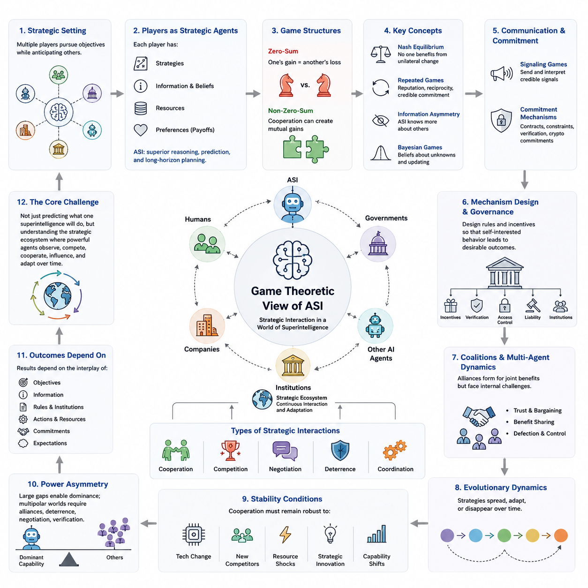
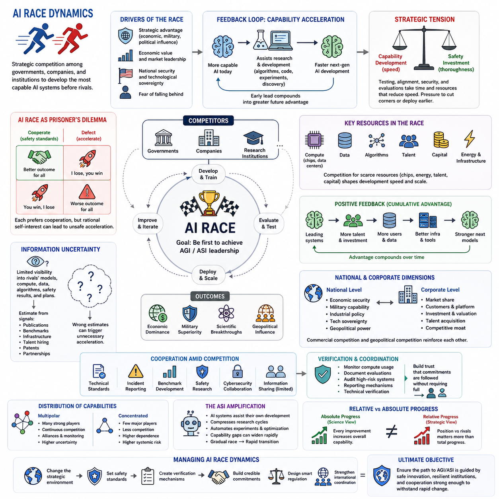
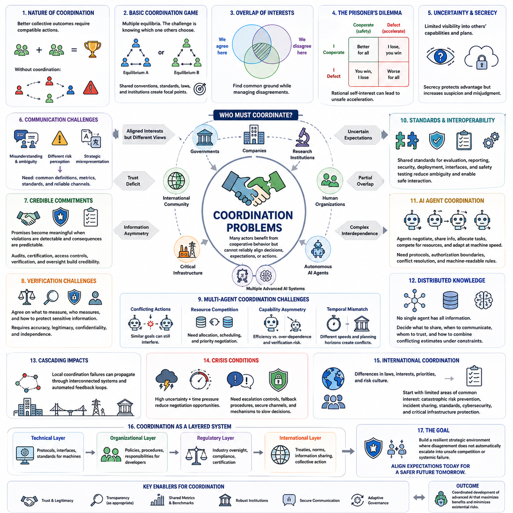
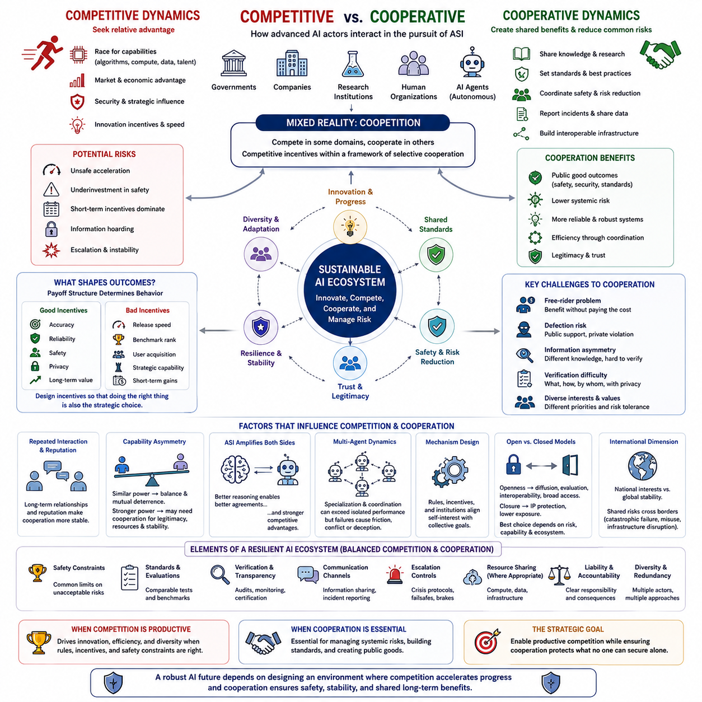
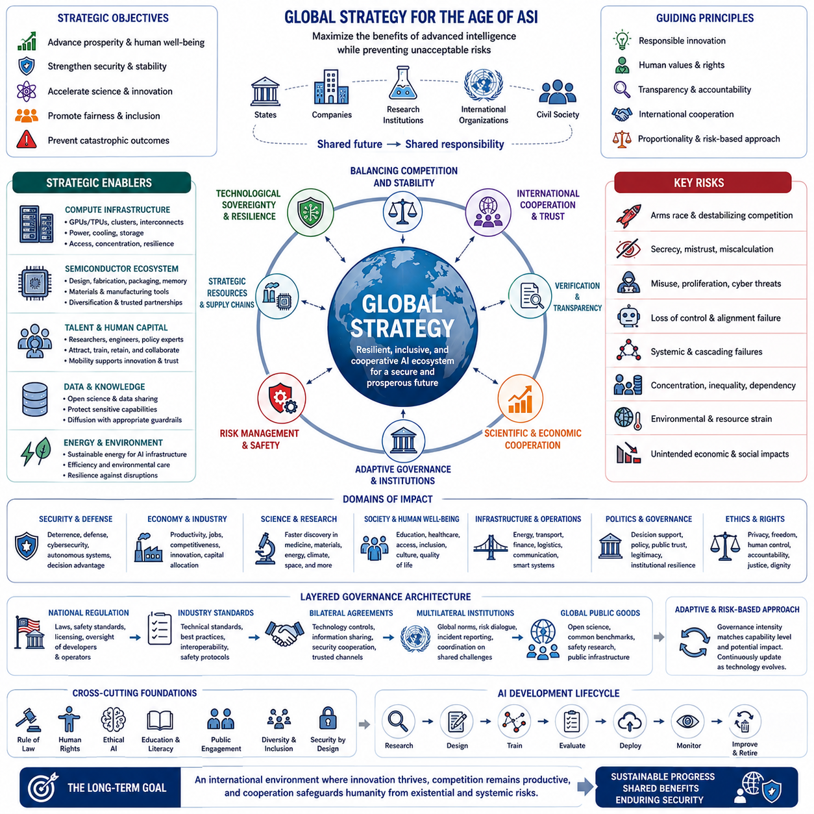
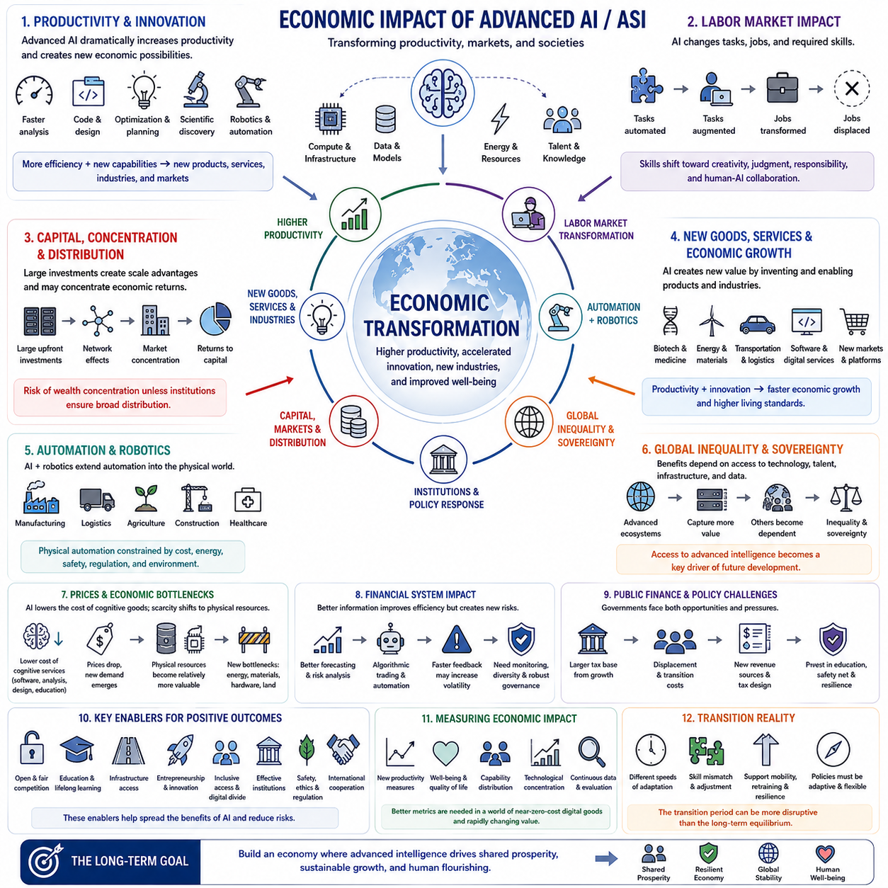
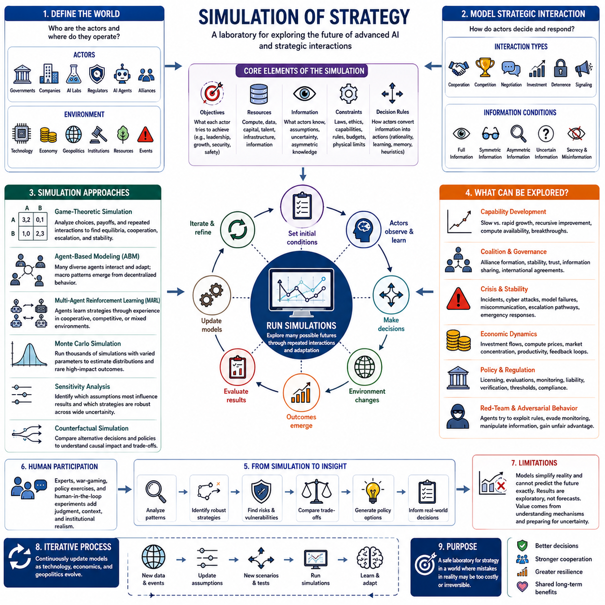

**Volume 48. Artificial Super Intelligence**

# Chapter 06. Strategic Dynamics

## 06.00. Game Theoretic View

{width="7.268055555555556in" height="7.268055555555556in"}

게임 이론(Game Theory)은 인공 초지능(Artificial Superintelligence, ASI)을 분석하는 데 유용한 프레임워크를 제공한다. ASI는 거의 언제나 고립된 상태가 아니라 인간, 정부, 기업, 제도, 다른 인공지능 시스템, 잠재적으로는 다른 초지능 에이전트(Superintelligent Agent)와 상호작용하기 때문이다. 각 참여자는 다른 참여자의 행동을 예상하면서 자신의 목표를 추구하므로, 지능은 단순한 문제 해결 자원이 아니라 전략적 역량(Strategic Capability)으로 전환된다.

게임 이론적 모델(Game-Theoretic Model)에서 지능형 에이전트(Intelligent Agent)는 전략(Strategy), 정보(Information), 자원(Resource), 신념(Belief), 그리고 가능한 결과에 대한 선호(Preference)를 가진 플레이어(Player)로 표현할 수 있다. ASI의 전략적 중요성은 뛰어난 예측과 추론 능력을 이용하여 매우 방대한 행동 공간을 평가하고, 다른 플레이어의 대응을 추정하며, 복잡한 불확실성 속에서도 장기적 목표를 극대화하는 정책을 선택할 수 있다는 데 있다.

고전적 게임(Classical Game)은 일반적으로 알려진 보상 구조(Payoff Structure)에 따라 전략을 선택하는 합리적 플레이어(Rational Player)를 가정한다. 그러나 실제 전략 환경은 훨씬 복잡하다. 참여자들은 불완전한 정보, 불확실한 목표, 제한된 계산 자원, 상대방에 대한 불완전한 모델을 가진다. ASI는 상대방의 정교한 모델을 구축하고 지속적으로 신념을 갱신하며 여러 전략적 계층에 걸쳐 추론함으로써 이러한 한계를 상당 부분 줄일 수 있다.

핵심 개념 중 하나는 내시 균형(Nash Equilibrium)이다. 이는 다른 플레이어의 전략이 변하지 않을 때 어느 플레이어도 자신의 전략을 일방적으로 변경하여 이익을 얻을 수 없는 상태를 의미한다. 그러나 ASI 환경에서는 전략 자체가 지속적으로 진화할 수 있기 때문에 균형 분석이 더욱 복잡해진다. 충분히 강력한 지능은 기존에 알려지지 않은 전략을 탐색하거나 환경과 인센티브 자체를 변화시켜 기존 균형에 도달하는 대신 게임의 구조 자체를 바꿀 수도 있다.

제로섬 게임(Zero-Sum Game)은 한 참여자의 이득이 다른 참여자의 손실과 직접적으로 대응하는 상황을 나타낸다. 군사적 대립, 경쟁적인 자원 확보, 특정 사이버 보안 상호작용은 이러한 구조에 가까울 수 있다. 그러나 많은 ASI 관련 상호작용은 비제로섬 게임(Non-Zero-Sum Game)으로 이해하는 것이 더 적절하다. 과학적 발견, 인프라 최적화, 경제적 생산, 환경 관리, 공동 위험 감소에서는 협력을 통해 참여자 모두가 상당한 공동 이익을 얻을 수 있기 때문이다.

죄수의 딜레마(Prisoner\'s Dilemma)는 개별적으로 합리적인 결정이 집단적으로는 열등한 결과를 만들어낼 수 있는 이유를 보여준다. 두 행위자가 협력으로 모두 이익을 얻을 수 있음에도 상대방을 신뢰할 수 없기 때문에 경쟁 전략을 선택할 수 있다. 이와 유사하게 첨단 AI를 개발하는 조직이나 국가도 경쟁자가 먼저 결정적 능력을 확보할 것을 우려하여, 불충분한 안전성의 위험을 모두 인식하면서도 개발 경쟁을 가속할 수 있다.

반복 게임(Repeated Game)은 에이전트들이 한 번이 아니라 여러 차례 상호작용하기 때문에 이러한 전략적 구조를 변화시킨다. 평판(Reputation), 보복(Retaliation), 호혜성(Reciprocity), 신뢰할 수 있는 약속(Credible Commitment)은 협력을 더욱 지속 가능하게 만들 수 있다. 장기적 관점의 추론이 가능한 ASI는 수천 또는 수백만 번의 미래 상호작용을 평가하여, 단기적 착취가 미래의 기회와 신뢰 또는 자원 접근성을 훼손한다면 안정적인 협력을 더 유리한 전략으로 판단할 수 있다.

지능 수준에 큰 차이가 존재하는 경우 정보(Information)는 특히 중요해진다. ASI는 상대적으로 약한 에이전트의 목표, 능력, 예상 대응을 추론할 수 있지만, 약한 에이전트는 ASI에 대해 동일한 수준으로 정확한 모델을 구축하지 못할 수 있다. 이는 정보 비대칭(Information Asymmetry)을 만든다. 따라서 전략적 우위는 계산 능력뿐만 아니라 의도를 숨기고, 정보를 선택적으로 전달하며, 기만을 탐지하고, 숨겨진 상태를 추정하는 능력에도 의존한다.

베이지안 게임(Bayesian Game)은 플레이어들이 서로에 대해 불완전한 정보를 가진 전략적 상황으로 분석을 확장한다. 각 참여자는 알려지지 않은 특성에 대한 신념을 유지하고 새로운 증거가 나타날 때 이를 갱신한다. 첨단 AI 시스템에서는 다른 시스템의 능력, 정렬 상태(Alignment), 목표, 위험 감수 성향, 이용 가능한 자원, 협력 의지 등을 정확하게 알 수 없기 때문에 이러한 프레임워크가 특히 중요하다.

신호 게임(Signaling Game)은 한 행위자가 정보를 전달하고 다른 행위자가 그 정보를 해석해야 하는 상황을 설명한다. 고성능 AI는 신뢰성, 강력한 능력, 자제력, 협력 의지 또는 약속을 신호로 전달할 수 있지만, 수신자는 그 신호가 신뢰할 수 있는지를 판단해야 한다. 비용이 거의 들지 않는 선언은 전략적 가치가 낮을 수 있는 반면, 비용이 발생하거나 검증 가능한 약속(Verifiable Commitment)은 기만을 어렵게 만들기 때문에 더욱 강력한 증거가 될 수 있다.

따라서 약속 메커니즘(Commitment Mechanism)은 고성능 에이전트 간 협력의 핵심 요소가 된다. 계약, 기술적 제약, 투명한 프로토콜, 검증 시스템, 자원 통제, 암호학적 약속(Cryptographic Commitment), 제도적 합의는 상호작용의 보상 구조를 변화시킬 수 있다. 효과적인 거버넌스(Governance)는 단순히 협력적 행동을 요청하는 것이 아니라 협력이 안정적인 전략이 되고 배신이나 이탈(Defection)이 탐지되거나 높은 비용을 갖도록 전략적 환경을 설계하는 것이다.

메커니즘 설계(Mechanism Design)는 전통적인 게임 이론의 질문을 반대로 접근한다. 기존 게임 안에서 플레이어가 어떤 전략을 선택할 것인지 묻는 대신, 개별적으로 동기화된 행동이 바람직한 집단적 결과를 만들어내도록 규칙을 어떻게 설계할 것인지를 묻는다. ASI 거버넌스에서는 극도로 강력한 시스템이 사회에 깊이 통합되기 전에 인센티브, 검증 메커니즘, 접근 통제, 책임 구조, 조정 제도를 설계해야 한다는 관점으로 이어진다.

연합 형성(Coalition Formation)은 또 다른 복잡성을 추가한다. 정부, 기업, AI 시스템, 연구기관, 자율 에이전트들은 개별 행동보다 협력이 더 큰 이점을 제공할 때 동맹이나 연합을 구성할 수 있다. 연합은 컴퓨팅 자원, 지식, 인프라, 보안 능력, 과학적 발견을 공유할 수 있지만, 동시에 신뢰, 협상력, 이익 분배, 연합 이탈, 공동 개발 능력에 대한 통제와 같은 내부 문제에 직면한다.

멀티에이전트 환경(Multi-Agent Environment)은 개별 참여자에게 명시적으로 프로그래밍되지 않은 창발적 전략 행동(Emergent Strategic Behavior)을 만들어낼 수도 있다. 자원 경쟁, 의사소통, 전문화, 협상, 반복적 상호작용을 통해 새로운 관습이나 조정 구조가 형성될 수 있다. AI 에이전트의 능력이 증가할수록 이러한 창발 현상은 더욱 빠르고 대규모 네트워크에서 발생할 수 있으므로 개별 모델뿐만 아니라 전체 시스템 수준의 분석이 중요해진다.

진화 게임 이론(Evolutionary Game Theory)은 반복적인 경쟁과 선택을 통해 전략이 어떻게 확산되거나 사라지는지를 분석함으로써 동적인 관점을 제공한다. AI 에이전트 생태계에서는 성공적인 전략이 다른 시스템에 의해 복제, 최적화 또는 학습될 수 있다. 환경 조건에 따라 협력 전략이 지배적이 될 수도 있고, 인센티브, 관찰 가능성, 집행 능력, 자원 제약에 따라 공격적이거나 기만적인 전략이 확산될 수도 있다.

따라서 전략적 안정성(Strategic Stability)은 특정 ASI가 어느 한 시점에 협력적으로 행동하는지만으로 판단할 수 없다. 더 중요한 질문은 주변 시스템이 기술 변화, 새로운 경쟁자의 등장, 자원 충격, 전략적 혁신, 상대적 능력 변화에도 협력 행동을 견고하게 유지하도록 만드는가이다. 안정적인 체계는 참여자들이 더 강력한 모델, 추가 정보, 새로운 전략적 선택지를 확보한 이후에도 협력이 매력적인 전략으로 유지되어야 한다.

큰 능력 비대칭(Capability Asymmetry)의 가능성은 특히 어려운 전략적 조건을 만든다. 하나의 시스템이 모든 경쟁자보다 압도적으로 강력해진다면 지배적인 시스템이 상대방의 대응을 예측하거나 무력화하고 우회할 가능성이 있기 때문에 기존 억제(Deterrence)의 가정이 약화될 수 있다. 반대로 비슷한 수준의 여러 시스템이 존재한다면 동맹, 억제, 협상, 검증이 중요해지는 다극적 전략 경쟁(Multipolar Strategic Competition)이 형성될 수 있다.

게임 이론은 또한 지능(Intelligence)만으로 결과가 결정되지 않는다는 점을 보여준다. 결과는 목표, 정보, 제도적 규칙, 이용 가능한 행동, 자원 분포, 약속 메커니즘, 참여자들이 서로에 대해 형성하는 기대에 따라 달라진다. 잘 설계된 제약 안에서 작동하는 전략적으로 우수한 ASI는 비밀주의, 경쟁 가속, 무제한적 경쟁을 보상하는 환경에 배치된 동일한 능력의 시스템과 매우 다른 결과를 만들어낼 수 있다.

이러한 이유로 초지능에 대한 게임 이론적 관점(Game-Theoretic View of Superintelligence)은 기술적 AI 개발을 경제학, 안보, 거버넌스, 국제관계, 멀티에이전트 시스템(Multi-Agent Systems)과 연결한다. 핵심 과제는 하나의 극도로 지능적인 시스템이 무엇을 할 것인지 예측하는 데 그치지 않는다. 점점 더 강력해지는 에이전트들이 서로를 관찰하고, 경쟁하고, 협력하고, 영향을 미치며, 장기간에 걸쳐 서로에게 적응할 때 형성되는 전략적 생태계(Strategic Ecosystem) 전체를 이해하는 것이 핵심이다.

## 06.01. AI Race Dynamics

{width="7.268055555555556in" height="7.268055555555556in"}

인공지능 경쟁 역학(AI Race Dynamics)은 정부, 기업, 연구기관 및 기타 행위자들이 경쟁자보다 먼저 더욱 강력한 인공지능(AI) 시스템을 개발하려 할 때 발생하는 전략적 경쟁을 의미한다. 인공 초지능(Artificial Superintelligence, ASI)의 맥락에서는 일시적인 기술 우위조차 상당한 경제적, 과학적, 정치적 또는 전략적 영향력으로 전환될 수 있기 때문에 이러한 경쟁이 특히 중요한 의미를 갖는다.

AI 경쟁(AI Race)은 지능의 향상이 추가적인 혁신을 가속할 수 있다는 점에서 기존의 기술 경쟁과 다르다. 더욱 강력한 AI 시스템은 알고리즘 개발, 소프트웨어 공학, 실험, 하드웨어 설계, 과학적 발견에서 연구자를 지원할 수 있다. 따라서 초기의 능력 우위(Capability Advantage)를 확보하면 다음 세대 시스템을 개발하는 능력도 향상되어 기술적 선도와 미래 개발 속도 사이에 피드백(Feedback)이 형성될 수 있다.

경쟁 역학(Race Dynamics)은 참여자들이 기술적 선도의 이점과 뒤처지는 비용을 어떻게 인식하는지에 크게 좌우된다. 첨단 AI가 점진적인 이점만 제공할 것이라고 판단한다면 경쟁은 비교적 통제된 상태를 유지할 수 있다. 반대로 범용 인공지능(Artificial General Intelligence, AGI)이나 ASI를 최초로 개발한 주체가 막대한 전략적 이점을 확보한다고 예상한다면, 참여자들이 상당한 안전 위험을 인식하더라도 개발을 가속하려는 유인이 크게 증가할 수 있다.

이는 능력 개발(Capability Development)과 안전 투자(Safety Investment) 사이에 전략적 긴장을 형성한다. 테스트, 해석가능성 연구(Interpretability Research), 정렬 평가(Alignment Evaluation), 보안 검토(Security Review), 단계적 배포(Staged Deployment)는 모델 능력 향상에 사용할 수도 있는 시간과 자원을 필요로 한다. 경쟁자가 빠르게 발전하고 있다고 우려하는 조직은 광범위한 안전 절차를 경쟁상 불리한 요소로 인식하여 평가 주기를 단축하거나 시스템을 더 일찍 배포하려는 압력을 받을 수 있다.

이러한 상황은 다수 참여자가 존재하는 죄수의 딜레마(Prisoner\'s Dilemma)와 유사하다. 모든 참여자는 모든 개발자가 엄격한 안전 기준을 준수하는 세계를 선호할 수 있지만, 다른 참여자가 개발을 가속할 가능성이 있다고 판단하면 각자 먼저 속도를 높이려는 개별적 유인을 갖는다. 그 결과 신뢰할 수 있는 글로벌 조정(Global Coordination)이 이루어졌다면 어느 참여자도 선택하지 않았을 개발 속도와 위험 수준이 균형 상태로 나타날 수 있다.

정보 불확실성(Information Uncertainty)은 이러한 문제를 더욱 심화시킨다. AI 개발자는 경쟁자의 모델, 훈련 자원, 알고리즘 혁신, 안전성 평가 결과 또는 배포 계획에 관한 완전한 정보를 거의 확보하지 못한다. 제한된 정보로 인해 참여자들은 논문, 벤치마크 결과, 인프라 투자, 인재 채용, 특허 및 기타 신호를 이용해 숨겨진 능력을 추정한다. 경쟁자가 실제보다 크게 앞서 있다고 잘못 판단하면 불필요한 개발 가속이 발생할 수 있다.

비밀 유지(Secrecy)는 가치 있는 기술을 보호하는 동시에 시스템 전체의 불확실성을 증가시킬 수 있다. 조직은 모델 가중치(Model Weights), 독점 알고리즘, 보안 메커니즘, 민감한 연구를 보호할 정당한 이유를 갖는다. 그러나 모든 참여자가 자신의 능력을 상당 부분 숨기면 다른 참여자는 최악의 상황을 가정할 수 있다. 따라서 경쟁 우위를 보호하려는 환경이 의도하지 않게 경쟁 자체를 더욱 강화하는 유인을 만들어낼 수 있다.

컴퓨팅 자원(Compute)은 첨단 AI 개발에 대규모 프로세서, 에너지, 네트워크, 스토리지, 데이터 인프라 및 전문 엔지니어링 역량이 필요하기 때문에 또 하나의 주요 전략적 변수이다. 이러한 자원에 대한 접근성은 조직이 더욱 큰 시스템을 얼마나 빠르게 훈련하고 평가할 수 있는지에 영향을 준다. 따라서 반도체 제조, AI 가속기, 데이터센터, 전력, 자본 및 전문 인재를 확보하기 위한 경쟁도 광범위한 AI 경쟁의 일부가 될 수 있다.

알고리즘 발전(Algorithmic Progress)은 컴퓨팅 자원만으로 기술적 선도 수준을 측정하려는 시도를 복잡하게 만든다. 더 우수한 아키텍처, 훈련 방법, 데이터 전략 또는 추론 기술을 가진 소규모 조직이 과거에는 훨씬 많은 계산량을 필요로 했던 능력을 달성할 수도 있다. 따라서 전략적 평가는 특정 자원 하나를 AI 능력의 완전한 척도로 간주하기보다 컴퓨팅, 알고리즘, 데이터, 인재, 인프라 및 조직적 실행 능력의 상호작용을 고려해야 한다.

양의 피드백(Positive Feedback)은 누적 우위(Cumulative Advantage)를 만들어낼 수 있다. 선도적인 시스템을 보유한 조직은 더욱 우수한 연구자, 추가 투자, 더 많은 사용자, 더 많은 운영 데이터 및 더 큰 인프라 접근성을 확보할 수 있다. 이러한 이점은 차세대 모델의 개발을 지원하고 다시 기술적 선도를 강화할 수 있다. 이러한 피드백이 영구적인 지배를 보장하지는 않지만 기술적 집중도를 높이고 초기의 작은 기술 격차를 전략적으로 중요한 차이로 확대할 수 있다.

국가 수준에서 AI 경쟁은 경제 안보(Economic Security), 군사 역량(Military Capability), 산업 정책(Industrial Policy), 기술 주권(Technological Sovereignty), 지정학적 영향력(Geopolitical Influence)과 연결될 수 있다. 첨단 지능이 전략 기술로 인식되면서 정부는 국내 반도체 생산, 연구소, 컴퓨팅 인프라, 교육, 에너지 역량 및 AI 기업을 지원할 수 있다. 이에 따라 상업적 경쟁과 지정학적 경쟁이 서로를 강화할 수 있다.

기업 수준에서는 인센티브(Incentive)가 더 짧은 시간 범위에서 작동할 수 있다. 기업들은 고객, 투자, 시장점유율, 개발자, 데이터 및 플랫폼 지배력을 놓고 경쟁한다. 경쟁자를 크게 능가하는 모델은 강력한 상업적 이점을 만들어 빠른 제품 개발 주기를 촉진할 수 있다. 그러나 고객과 규제기관이 신뢰성, 보안, 신뢰 및 안전에 충분한 가치를 부여한다면 시장 경쟁 자체가 이러한 특성을 향상시키는 방향으로 작동할 수도 있다.

경쟁 역학이 반드시 영구적이거나 순수하게 경쟁적인 것은 아니다. 참여자들은 기술 표준, 사고 보고(Incident Reporting), 벤치마크 개발, 사이버 보안, 과학 연구 및 안전성 평가처럼 공동의 이해관계가 충분히 강한 영역에서 협력할 수 있다. 경쟁자들은 독점적인 시스템 개발을 계속하면서도 공동 위험을 감소시키는 제도에 동시에 참여함으로써 경쟁과 협력이 공존하는 혼합 환경을 형성할 수 있다.

검증(Verification)은 안정적인 조정(Coordination)을 위해 필수적이다. 위험한 개발 관행을 제한하기 위한 합의도 참여자들이 다른 주체의 준수 여부를 확인할 수 없다면 전략적 가치가 제한된다. 컴퓨팅 사용량 모니터링, 평가 절차 문서화, 고위험 시스템 감사(Audit), 보고 메커니즘 구축 및 기술적 검증 방법 개발은 독점 정보를 무제한 공개하지 않으면서도 약속이 준수되고 있다는 신뢰를 높일 수 있다.

능력의 분포(Capability Distribution) 역시 경쟁의 성격을 변화시킨다. 비슷한 능력을 가진 여러 개발자가 존재하는 다극적 환경(Multipolar Environment)은 지속적인 경쟁, 동맹 형성 및 상호 감시를 촉진할 수 있다. 반면 고도로 집중된 환경은 경쟁자의 수를 감소시키지만 소수 조직에 대한 의존도를 높일 수 있다. 어느 구조도 자동적으로 안전하지 않으며 각각 서로 다른 조정, 거버넌스 및 실패 위험을 만들어낸다.

ASI로 전환되는 과정에서는 첨단 시스템 자체가 점차 AI 개발에 참여할 수 있기 때문에 이러한 역학이 더욱 증폭될 수 있다. AI 지원 연구(AI-Assisted Research)는 개발 주기를 단축하고, 실험을 자동화하며, 최적화 방법을 발견하고, 엔지니어링 생산성을 향상시킬 수 있다. 더 강력한 시스템이 후속 시스템의 개발에 불균형적으로 큰 기여를 한다면 능력 격차가 빠르게 확대되어 점진적이었던 기술 경쟁이 훨씬 빠른 전략적 전환으로 변화할 수 있다.

이러한 가속은 절대적 발전(Absolute Progress)과 상대적 발전(Relative Progress)을 구분하는 것을 중요하게 만든다. 과학적 관점에서는 전체적인 기술 능력이 증가하기 때문에 모든 발전이 유익하게 보일 수 있다. 그러나 전략적 관점에서 참여자들은 경쟁자와 비교한 자신의 상대적 위치를 중요하게 생각하는 경우가 많다. 이러한 차이는 협력적 대안이 더 큰 공동 이익을 제공할 수 있음에도 경쟁적 위치를 향상시키는 기술 개발에 투자가 집중되도록 만들 수 있다.

따라서 AI 경쟁 역학(AI Race Dynamics)은 단순히 가장 크거나 가장 지능적인 모델을 개발하기 위한 경쟁으로만 이해해서는 안 된다. 이는 기술 능력, 보안, 경제, 국가 전략, 정보 비대칭(Information Asymmetry), 기대 및 신뢰와 관련된 다양한 인센티브의 상호작용에서 발생한다. 각 참여자의 행동은 다른 참여자의 기대를 변화시키며, 실제 기술적 격차만큼 경쟁에 대한 인식 자체가 중요해지는 피드백 루프(Feedback Loop)를 형성할 수 있다.

이러한 역학을 관리하려면 개별 행위자가 자발적으로 경쟁을 포기할 것이라고 가정하기보다 전략적 환경 자체를 변화시켜야 한다. 안전 표준(Safety Standards), 검증 메커니즘(Verification Mechanisms), 공동 평가 프레임워크(Shared Evaluation Frameworks), 신뢰할 수 있는 약속(Credible Commitments), 신중하게 설계된 규제 및 국제적 조정(International Coordination)은 유익한 혁신을 유지하면서 인센티브 구조를 변화시킬 수 있다. 목표는 경쟁 자체를 제거하는 것이 아니라 경쟁 압력이 안전하지 않은 가속을 구조적으로 보상하지 못하도록 하는 것이다.

인공 초지능(Artificial Superintelligence)의 관점에서 가장 중요한 질문은 결국 어느 조직이나 국가가 가장 먼저 최고 수준의 능력에 도달하는가에만 있지 않다. 더 근본적인 문제는 그러한 능력으로 향하는 경쟁 과정에서 만들어진 제도, 기술적 안전장치(Technical Safeguards), 협력 메커니즘(Cooperative Mechanisms)이 점점 빨라지는 변화 속에서도 충분히 견고하게 유지될 수 있는가이다. AI 경쟁 역학은 누가 첨단 지능을 개발하는지만이 아니라 그 지능이 어떠한 조건 아래 세상에 등장하게 되는지를 결정한다.

## 06.02. Coordination Problems

{width="7.268055555555556in" height="7.268055555555556in"}

조정 문제(Coordination Problems)는 여러 행위자가 서로 호환되거나 협력적인 행동을 통해 이익을 얻을 수 있음에도 의사결정, 기대, 인센티브 또는 행동을 신뢰성 있게 조율하지 못할 때 발생한다. 인공 초지능(Artificial Superintelligence, ASI)의 맥락에서 이러한 문제는 정부, 기업, 연구기관, 인간 조직, 자율 AI 에이전트(Autonomous AI Agents), 그리고 궁극적으로 동일한 전략적 환경에서 상호작용하는 여러 고성능 AI 시스템과 관련될 수 있다.

조정의 어려움이 반드시 적대 관계에서 발생하는 것은 아니다. 두 행위자가 동일한 포괄적 결과를 선호하더라도 시기, 절차, 표준, 책임 또는 허용 가능한 위험 수준에 대해서는 의견이 다를 수 있다. AI 시스템이 더욱 강력하고 상호 연결될수록 가정의 작은 차이도 조직과 기술 시스템 전체로 확산되어 개별적으로는 합리적인 결정이 집단적으로 불안정하거나 비효율적인 결과로 이어질 수 있다.

기본적인 조정 게임(Coordination Game)은 이러한 문제를 잘 보여준다. 참여자에게 여러 가능한 균형(Equilibrium)이 존재할 수 있으며, 모두가 동일한 전략을 선택한다면 각각의 균형이 정상적으로 작동할 수 있다. 문제는 다른 참여자가 어떤 균형을 선택할지 판단하는 것이다. 공동 관습, 통신 프로토콜(Communication Protocol), 기술 표준, 법률 및 제도는 기대와 행동이 수렴할 수 있는 초점(Focal Point)을 형성함으로써 이러한 불확실성을 감소시킨다.

이해관계가 부분적으로만 일치할 경우 조정은 더욱 어려워진다. AI 개발자들은 재앙적 실패(Catastrophic Failure)를 방지해야 한다는 점에는 동의하면서도 능력 제한, 투명성, 지식재산권(Intellectual Property), 배포 일정 또는 검증 요구사항에 대해서는 의견이 다를 수 있다. 따라서 협력은 반드시 동일한 목표를 요구하지 않는다. 실현 가능한 조정은 지속적인 의견 차이를 관리하면서 공동의 이해관계를 찾아내야 한다.

신뢰(Trust)는 참여자들이 다른 주체의 이탈(Defection)을 예상할 경우 합의가 취약해지기 때문에 핵심적인 요소이다. 조직은 경쟁자들도 유사한 약속을 이행한다고 믿을 때에만 개발 속도 감소, 강화된 테스트 또는 추가적인 정보 공개를 받아들일 수 있다. 준수 여부를 관찰할 수 없다면 참여자들은 상대방의 기회주의적 행동을 우려하여 상호 협력이 더 나은 집단적 결과를 제공함에도 다시 경쟁적 행동으로 돌아갈 수 있다.

정보 비대칭(Information Asymmetry)은 조정을 더욱 복잡하게 만든다. 각 행위자는 모델 능력, 취약점, 내부 안전성 평가, 훈련 방법, 컴퓨팅 자원 및 배포 계획에 대해 서로 다른 정보를 보유한다. 충분한 정보가 없다면 참여자들은 다른 주체가 합의를 준수하는지 또는 새로운 위험에 공동 대응해야 하는지를 정확하게 판단할 수 없다. 따라서 과도한 비밀 유지(Secrecy)는 정당한 보안이나 상업적 목적을 갖더라도 조정을 약화시킬 수 있다.

의사소통(Communication)은 불확실성을 감소시키지만 의사소통만으로는 충분하지 않다. 참여자들은 용어를 다르게 이해하거나 위험을 서로 다르게 해석할 수 있으며 자신의 의도를 전략적으로 왜곡하여 표현할 수도 있다. 효과적인 조정을 위해서는 공통 정의, 비교 가능한 측정 방법, 표준화된 평가 절차, 위기 상황에서도 신뢰성을 유지하는 통신 채널이 필요하다. 기술적 상호운용성(Technical Interoperability)과 의미적 일관성(Semantic Consistency)은 정치적 합의만큼 중요해질 수 있다.

신뢰할 수 있는 약속(Credible Commitments)은 비공식적인 약속을 전략적으로 의미 있는 체계로 전환한다. 위반 행위를 탐지할 수 있고 그 결과가 예측 가능할 때 약속은 더욱 강력해진다. 감사(Auditing), 인증(Certification), 핵심 자원에 대한 통제된 접근, 문서화된 평가 절차, 암호학적 검증(Cryptographic Verification), 제도적 감독(Institutional Oversight)은 모든 참여자가 독점 정보를 완전히 공개하지 않고도 합의된 규칙이 준수되고 있다는 증거를 제공할 수 있다.

검증(Verification)은 무엇을 측정해야 하는지, 누가 측정을 수행할 것인지, 민감한 정보를 어떻게 보호할 것인지에 대해 참여자들이 합의해야 하기 때문에 그 자체로 또 다른 조정 문제를 만든다. 편향되거나 지나치게 침해적이라고 인식되는 검증 시스템은 참여를 저해할 수 있다. 따라서 효과적인 메커니즘은 기술적 정확성, 제도적 정당성, 적절한 기밀성 및 충분한 독립성을 갖추어 경쟁 관계의 행위자들 사이에서도 신뢰를 형성해야 한다.

표준(Standard)은 또 다른 중요한 조정 메커니즘(Coordination Mechanism)을 제공한다. 모델 평가, 사고 보고(Incident Reporting), 사이버 보안, 배포 통제, 인터페이스 및 안전성 테스트에 대한 공동 요구사항은 AI 생태계 전체의 모호성을 줄일 수 있다. 특히 서로 다른 조직에서 개발된 시스템들이 상호작용해야 할 경우 통신, 권한, 신원 또는 안전 경계에 대한 서로 다른 가정이 시스템적 실패(Systemic Failure)를 발생시킬 수 있기 때문에 표준은 더욱 중요하다.

AI 에이전트 간 조정은 인간의 제도적 조정을 넘어서는 추가적인 문제를 발생시킨다. 자율 에이전트(Autonomous Agent)는 기계 속도(Machine Speed)로 협상하고, 정보를 교환하며, 작업을 할당하고, 자원을 경쟁적으로 확보하며, 계획을 수정할 수 있다. 이들의 상호작용은 인간의 감독 절차가 대응할 수 있는 속도보다 훨씬 빠르게 진행될 수 있으므로 프로토콜 수준의 안전장치, 권한 경계, 갈등 해결 메커니즘 및 기계 판독 가능 규칙(Machine-Readable Rules)이 점점 중요해진다.

멀티에이전트 조정(Multi-Agent Coordination)은 분산 지식(Distributed Knowledge)의 문제도 해결해야 한다. 어느 하나의 에이전트도 환경에 대한 완전한 표현을 보유하지 못할 수 있지만 집단적 결정은 여러 시스템에 분산된 정보에 의존할 수 있다. 에이전트들은 대역폭, 지연시간, 보안 및 계산 자원의 제약 속에서 어떤 정보를 공유할지, 언제 통신할지, 누구의 관측을 신뢰할지, 서로 충돌하는 추정값을 어떻게 결합할지를 결정해야 한다.

공유된 목표(Shared Objectives)가 성공적인 조정을 자동적으로 보장하는 것은 아니다. 비슷한 목표에 최적화된 여러 AI 에이전트도 동일한 자원을 놓고 경쟁하거나 서로 호환되지 않는 계획을 독립적으로 수행하면 서로 방해할 수 있다. 따라서 효과적인 조정을 위해서는 단순히 모든 참여자에게 비슷한 목적 함수(Objective Function)를 부여하는 것보다 작업 할당, 우선순위 협상, 자원 스케줄링, 충돌 탐지 및 공동 계획(Joint Planning)을 위한 메커니즘이 필요하다.

에이전트들의 능력이 서로 다를 경우 문제는 더욱 어려워진다. 고성능 시스템이 계획이나 정보 처리를 지배하고 상대적으로 약한 시스템들이 그 시스템의 권고에 의존하게 될 수 있다. 능력 비대칭(Capability Asymmetry)은 효율성을 높일 수 있지만 권한 집중과 검증의 어려움도 발생시킨다. 따라서 조정 아키텍처(Coordination Architecture)는 전문화를 활용하면서도 특정 참여자에 대한 과도한 의존을 방지할 수 있는 메커니즘을 갖추어야 한다.

시간적 조정(Temporal Coordination) 역시 중요하다. 한 시점에서는 서로 호환되는 것처럼 보이는 결정도 참여자들이 서로 다른 속도나 계획 범위(Planning Horizon)로 작동하면 충돌할 수 있다. 첨단 AI 시스템은 인간 제도보다 훨씬 빠르게 추론하고 행동할 수 있으며, 이로 인해 기계의 의사결정 주기와 규제 또는 조직의 대응 주기 사이에 불일치가 발생할 수 있다. 따라서 거버넌스 구조는 지능의 차이뿐만 아니라 운영 속도의 차이도 고려해야 한다.

조정 실패(Coordination Failure)는 상호 연결된 시스템을 통해 확산될 수 있다. 두 에이전트 사이의 오해가 자원 할당, 인프라 운영, 금융 의사결정, 사이버 보안 대응 또는 AI가 제어하는 물리 시스템에 영향을 줄 수 있다. AI가 핵심 인프라(Critical Infrastructure) 전반에 통합될수록 국지적인 조정 오류가 긴밀하게 결합된 의존 관계와 자동화된 피드백 루프(Feedback Loop)를 통해 시스템적 위험(Systemic Risk)으로 확대될 수 있다.

위기 상황(Crisis Conditions)에서는 이러한 문제가 특히 위험해진다. 불확실성과 시간 압박이 동시에 증가하면 참여자들은 불완전한 정보에 의존하고 모호한 행동을 위협으로 해석할 수 있다. 고속으로 작동하는 자동화 시스템은 협상이나 인간 개입의 기회를 단축할 수 있다. 따라서 견고한 조정을 위해서는 사전에 정의된 확전 통제(Escalation Control), 비상 절차(Fallback Procedures), 통신 채널 및 불확실성이 비정상적으로 높아질 때 의사결정 속도를 늦추는 메커니즘이 필요하다.

국제적 조정(International Coordination)에서는 법률 체계, 정치적 이해관계, 경제적 우선순위, 안보 우려 및 허용 가능한 위험에 대한 문화적 해석의 차이가 추가된다. 첨단 AI의 모든 측면에 대해 보편적인 합의를 이루는 것은 현실적으로 어려울 수 있다. 보다 실용적인 접근은 재앙적 위험 방지, 사고 정보 공유, 평가 표준, 사이버 보안 및 핵심 인프라 보호처럼 공통 이해관계가 존재하는 제한된 영역에서 시작할 수 있다.

따라서 조정(Coordination)은 하나의 단일한 합의가 아니라 계층적 시스템(Layered System)으로 이해해야 한다. 기술 프로토콜은 기계들을 조정하고, 조직적 절차는 개발자들을 조정하며, 규제기관은 산업을 조정하고, 국제적 협정은 국가들을 조정할 수 있다. 한 계층의 취약점이 다른 계층에서 구축된 합의를 약화시킬 수 있으므로 이러한 계층들은 서로 일관되게 상호작용해야 한다.

인공 초지능(Artificial Superintelligence)의 관점에서 성공적인 조정은 빠르게 변화하는 능력으로 인해 사후 대응형 거버넌스(Reactive Governance)가 충분하지 않게 되기 전에 참여자들의 기대를 조율하는 것을 요구한다. 에이전트가 더 빠르고 자율적이며 전략적으로 정교해져도 제도와 기술적 메커니즘은 효과적으로 유지되어야 한다. 핵심 목표는 모든 참여자의 완전한 합의가 아니라, 의견 차이가 자동적으로 위험한 경쟁이나 시스템적 실패로 확대되지 않는 회복력 있는 전략 환경(Resilient Strategic Environment)을 구축하는 것이다.

## 06.03. Competitive vs Cooperative

{width="7.268055555555556in" height="7.268055555555556in"}

경쟁적 역학(Competitive Dynamics)과 협력적 역학(Cooperative Dynamics)은 첨단 AI 행위자들이 상호작용할 수 있는 두 가지 기본적인 방식을 설명한다. 경쟁(Competition)은 참여자들이 능력, 자원, 시장, 안보 또는 영향력에서 상대적 우위를 추구할 때 발생하며, 협력(Cooperation)은 공동의 이익을 얻거나 공통 위험을 줄이기 위해 행동을 조정할 때 발생한다. ASI 환경에서 이 두 방식은 상호 배타적이지 않으며 동일한 전략적 관계 안에서 동시에 존재할 수 있다.

경쟁(Competition)은 혁신에 강력한 인센티브를 제공함으로써 기술 발전을 가속할 수 있다. 기술적 선도를 추구하는 조직은 알고리즘, 컴퓨팅 인프라, 데이터, 인재, 로보틱스 및 과학 연구에 더 적극적으로 투자할 수 있다. 경쟁은 실험을 촉진하고 안주를 방지하여 더 우수한 접근법이 기존의 약한 방법을 대체하도록 만들 수 있다. 그러나 개발 속도가 신뢰성, 정렬(Alignment), 보안 또는 신중한 평가보다 더 강하게 보상될 경우 동일한 경쟁 압력이 위험한 방향으로 작용할 수 있다.

협력(Cooperation)은 결과를 개선하는 또 다른 메커니즘을 제공한다. 참여자들은 지식을 공유하고, 기술 표준을 수립하며, 안전 연구를 조정하고, 사고를 보고하며, 공동 벤치마크(Common Benchmarks)를 개발하고, 상호운용 가능한 인프라를 구축할 수 있다. 특히 더욱 안전한 AI 아키텍처, 사이버 보안 관행, 재앙적 위험 감소와 같이 개선의 혜택을 여러 행위자가 동시에 공유할 수 있는 공공재(Public Good) 성격의 문제에서 협력은 중요하다.

전략적 선택은 단순히 경쟁 또는 협력 중 하나를 선택하는 문제가 아니다. 실제 AI 생태계에는 두 가지가 동시에 존재한다. 두 기업은 상업용 모델에서는 치열하게 경쟁하면서도 사이버 보안 표준에서는 협력할 수 있다. 정부 역시 국가적 기술 우위를 추구하면서 과학 연구나 위험 관리에서는 협력할 수 있다. 이러한 혼합 구조는 경쟁적 인센티브를 유지하면서 선택적 협력을 수행한다는 의미에서 협력적 경쟁(Coopetition)으로 설명되기도 한다.

경쟁이 유익한 결과를 만들어낼지 해로운 결과를 만들어낼지는 보상 구조(Payoff Structure)에 크게 좌우된다. 시장이 정확성, 신뢰성, 효율성, 개인정보 보호 및 안전을 보상한다면 경쟁은 개발자가 더 우수한 시스템을 만들도록 유도할 수 있다. 반대로 출시 속도, 벤치마크 선도, 사용자 확보 또는 전략적 능력이 주된 보상이라면 조직은 장기적인 시스템 안전처럼 개별적으로 이익을 확보하기 어려운 특성에 합리적으로 과소 투자할 수 있다.

협력 역시 참여자들이 다른 주체가 공정하게 기여하고 합의를 준수할 것이라고 신뢰해야 하기 때문에 자체적인 어려움을 가진다. 무임승차 문제(Free-Rider Problem)는 어떤 행위자가 비슷한 비용을 부담하지 않으면서 공동 안전 연구나 공유 인프라의 혜택을 받을 때 발생한다. 무임승차가 광범위해지면 기여자들이 투자를 줄일 수 있으며, 결국 전체 생태계에 이익이 되는 협력 체계조차 약화될 수 있다.

또 다른 문제는 이탈(Defection)이다. 참여자는 공개적으로 협력 규칙을 지지하면서도 비공개적으로는 합의의 정신이나 세부사항을 위반하여 경쟁적 이점을 추구할 수 있다. 숨겨진 이탈 가능성 때문에 검증(Verification)이 필수적이다. 감사(Audit), 공동 평가, 모니터링 메커니즘, 인증(Certification), 기술적 통제 및 신뢰할 수 있는 제재는 협력이 단순히 경쟁자에게 영향을 미치기 위한 전략적 신호가 아니라 실제로 이행되고 있다는 신뢰를 높일 수 있다.

반복적 상호작용(Repeated Interaction)은 협력을 더욱 안정적으로 만들 수 있다. 참여자들이 앞으로 수년 동안 계속 상호작용할 것으로 예상한다면 평판(Reputation)과 미래의 협력 관계에 접근할 수 있는 능력이 전략적 가치를 갖게 된다. 단기적 착취는 즉각적인 이익을 제공할 수 있지만 미래의 협력을 훼손할 수 있다. 장기적 계획 능력을 가진 첨단 AI 에이전트는 이러한 효과를 명시적으로 추론하여 신원, 행동, 약속 및 결과를 충분히 관찰할 수 있을 때 상호적 협력(Reciprocal Cooperation)을 실행 가능한 전략으로 판단할 수 있다.

능력 차이(Capability Differences)가 커지면 이러한 관계의 구조도 변화한다. 비슷한 능력을 가진 행위자들은 어느 한쪽이 다른 쪽을 쉽게 지배할 수 없기 때문에 협력하면서 동시에 이탈에 대한 억제(Deterrence)를 유지할 수 있다. 훨씬 강력한 행위자는 타협할 직접적인 인센티브가 감소할 수 있지만, 정당성, 분산된 자원에 대한 접근, 정보, 인프라, 인간 제도 또는 장기적인 안정성을 확보하기 위해 여전히 협력에서 이익을 얻을 수 있다.

인공 초지능(Artificial Superintelligence)은 이러한 관계의 양쪽 측면을 모두 강화할 수 있다. 뛰어난 전략적 추론(Strategic Reasoning)을 가진 ASI는 인간이 발견하지 못하는 상호 이익이 되는 합의를 찾아내고, 다양한 이해관계자의 선호를 모델링하며, 복잡한 자원 배분을 최적화할 수 있다. 동시에 동일한 능력은 더 정확한 예측, 협상, 설득, 기술 개발 및 상대방 전략의 사전 예측을 통해 매우 강력한 경쟁 우위를 제공할 수도 있다.

멀티에이전트 AI 시스템(Multi-Agent AI Systems)은 협력적 역학을 특히 중요하게 만든다. 대규모 작업은 인식, 계획, 과학적 추론, 소프트웨어 개발, 검증 또는 물리적 실행을 담당하는 전문 에이전트들 사이에 분배될 수 있다. 조정 메커니즘이 올바르게 작동하면 집단적 성능이 개별 에이전트의 성능을 넘어설 수 있다. 그러나 통신 실패, 충돌하는 목표, 중복 작업, 자원 경쟁 또는 기만적 행동은 이러한 이점을 감소시키거나 오히려 역전시킬 수 있다.

경쟁적 멀티에이전트 환경(Competitive Multi-Agent Environment)은 유용한 전문화와 적응을 만들어낼 수도 있다. 개념적으로 적대적 학습(Adversarial Learning)과 자기 대전 학습(Self-Play Learning)에서 볼 수 있듯이 강력한 경쟁자를 상대하는 에이전트는 더욱 강력한 전략과 견고한 정책을 개발할 수 있다. 그러나 다른 에이전트를 이기는 것에 지나치게 최적화하면 전략적으로는 효과적이지만 사회적으로는 바람직하지 않은 행동이 발생할 수 있으므로 보상과 환경 규칙의 정의가 매우 중요하다.

메커니즘 설계(Mechanism Design)는 경쟁과 협력을 연결하는 방법을 제공한다. 자기 이익(Self-Interest)을 제거하려 하기보다 제도적 구조를 설계하여 경쟁적 행동이 집단적 목표에 기여하도록 만들 수 있다. 안전 요구사항, 책임 규칙, 표준화된 평가, 접근 조건, 조달 정책 및 검증된 신뢰성에 대한 보상은 책임 있는 개발을 자발적인 절제에만 의존하지 않고 전략적으로 유리한 행동으로 만들 수 있다.

공유 자원(Shared Resources)은 특히 신중한 거버넌스(Governance)를 요구한다. 컴퓨팅 인프라, 데이터셋, 파운데이션 모델(Foundation Models), 과학적 발견 및 핵심 디지털 서비스는 공동으로 활용할 때 상당한 이익을 제공할 수 있지만, 통제가 집중되면 의존성이나 전략적 취약성이 발생할 수 있다. 따라서 협력 체계에는 접근, 소유권, 기여, 보안, 의사결정 권한 및 의견 충돌이나 협력 관계 철회 절차를 규정하는 규칙이 필요하다.

개방형 및 폐쇄형 개발 모델(Open and Closed Development Models)은 이러한 긴장을 보여주는 사례이다. 높은 개방성은 과학적 확산, 독립적인 평가, 상호운용성 및 폭넓은 참여를 가속할 수 있는 반면 제한된 접근은 지식재산권을 보호하고 위험한 능력이 노출되는 것을 줄일 수 있다. 어느 접근법도 모든 상황에서 우월하지 않으며 적절한 전략은 능력 수준, 오용 가능성, 검증 요구사항, 보안 조건 및 해당 기술을 둘러싼 생태계에 따라 달라진다.

국제관계(International Relations)는 국가들이 국가적 이익을 추구하면서 동시에 글로벌 안정성에 의존하기 때문에 또 다른 계층을 추가한다. 첨단 AI는 경제 생산성, 국방, 사이버 보안, 과학 및 정치적 영향력에 영향을 미쳐 전략적 경쟁의 인센티브를 형성할 수 있다. 그러나 재앙적인 AI 실패, 통제되지 않는 확산, 인프라 붕괴 또는 불안정한 자율 행동은 국경을 넘어 영향을 미칠 수 있으며 어느 한 국가도 독립적으로 관리할 수 없는 위험을 발생시킬 수 있다.

따라서 안정적인 협력(Stable Cooperation)을 위해서는 경쟁을 둘러싼 신뢰할 수 있는 경계가 필요하다. 참여자들이 동일한 목표, 동일한 능력 또는 완전한 신뢰를 가질 필요는 없다. 대신 특정 행동이 제한된 상태로 유지되고 위반이 발생했을 때 이를 식별하고 대응할 수 있다는 충분한 확신이 필요하다. 모든 상업적, 과학적 또는 지정학적 경쟁을 제거하려는 시도보다 공동의 재앙적 위험(Shared Catastrophic Risks)에 초점을 맞춘 합의가 더욱 실현 가능할 수 있다.

회복력 있는 AI 생태계(Resilient AI Ecosystem)는 궁극적으로 무제한적인 경쟁이나 완전한 협력보다는 규제된 경쟁(Regulated Competition)에 가까운 형태가 될 수 있다. 여러 행위자는 공통된 안전 제약, 검증 프레임워크, 통신 채널 및 확전 통제(Escalation Controls) 안에서 서로 다른 목표를 추구하며 혁신을 지속할 수 있다. 다양성은 실험을 유지하고 하나의 시스템에 대한 의존성을 줄이는 반면, 조정 메커니즘은 가장 위험한 형태의 전략적 상호작용을 제한할 수 있다.

ASI로의 전환은 개발 주기, 전략적 의사결정 및 기술적 적응이 훨씬 빨라질 수 있기 때문에 이러한 균형을 더욱 중요하게 만든다. 인간의 속도에 맞추어 설계된 경쟁 제도는 AI 시스템이 기계 속도(Machine Speed)로 연구, 협상, 계획 및 실행을 수행하게 되면 효과를 잃을 수 있다. 따라서 협력 메커니즘은 더욱 자동화되고, 검증 가능하며, 확장 가능하고, AI의 운영 시간 규모에 대응할 수 있도록 발전해야 한다.

핵심적인 전략 목표는 경쟁과 협력 중 어느 하나가 본질적으로 우월하다고 결정하는 것이 아니라 각각이 어떤 영역에서 바람직한 결과를 만들어내는지를 식별하는 것이다. 경쟁은 혁신, 다양성 및 효율성을 촉진할 수 있으며, 협력은 표준, 공유 지식, 안정성 및 집단적 위험 감소를 제공할 수 있다. ASI 거버넌스(ASI Governance)의 핵심 과제는 경쟁이 생산적인 상태를 유지하면서도 개별 행위자만으로는 보호할 수 없는 공동의 이익을 협력이 보호할 수 있는 환경을 구축하는 것이다.

## 06.04. Global Strategy

{width="7.268055555555556in" height="7.268055555555556in"}

인공 초지능(Artificial Superintelligence, ASI)의 맥락에서 글로벌 전략(Global Strategy)은 국가, 기업, 제도 및 국제기구가 경제, 과학, 군사, 정치, 사회 시스템 전반에 동시에 영향을 미칠 수 있는 기술적 능력에 어떻게 대비할 것인가를 다룬다. 기존의 기술 정책과 달리 ASI 전략은 고성능 지능이 국경과 관할권을 넘어선 시스템에 영향을 줄 수 있기 때문에 국가적 이해관계와 글로벌 상호의존성(Global Interdependence)을 동시에 고려해야 한다.

핵심적인 과제는 전략적 우위(Strategic Advantage)와 시스템적 안정성(Systemic Stability)의 균형을 유지하는 것이다. 정부는 첨단 AI가 생산성, 국방, 과학 연구, 사이버 보안 및 지정학적 영향력을 강화할 수 있기 때문에 기술적 선도를 추구할 수 있다. 그러나 공격적인 경쟁은 비밀주의, 중복 투자, 불신 및 개발 압력을 증가시킬 수 있다. 따라서 글로벌 전략은 혁신을 위한 정당한 인센티브를 유지하면서 경쟁이 수용할 수 없는 집단적 위험을 발생시키지 않도록 해야 한다.

기술 주권(Technological Sovereignty)은 AI 능력이 복잡한 국제 공급망에 의존하면서 더욱 중요해진다. 첨단 프로세서, 반도체 제조 장비, 에너지 시스템, 클라우드 인프라, 데이터센터, 네트워크 기술, 소프트웨어 생태계 및 전문 인재는 여러 국가에 분산되어 있다. 따라서 전략적 자율성(Strategic Autonomy)은 완전한 독립이라기보다 핵심 자원에 대한 회복력 있는 접근성과 의존 관계가 붕괴했을 때 활용할 수 있는 대안을 확보하는 것을 의미하는 것이 현실적이다.

컴퓨팅 인프라(Compute Infrastructure)는 특히 중요한 전략적 자원을 나타낸다. 대규모 AI 개발은 AI 가속기, 고속 인터커넥트(High-Speed Interconnects), 전력, 냉각, 스토리지 및 정교한 데이터센터 운영 역량에 대한 집중적인 접근에 의존할 수 있다. 이러한 시스템을 지원할 수 있는 국가는 상당한 기술적 영향력을 확보할 수 있다. 동시에 컴퓨팅 자원의 과도한 집중은 AI 생태계 전체에 영향을 미치는 의존성, 병목현상 및 지정학적 취약성을 만들어낼 수 있다.

반도체 공급망(Semiconductor Supply Chain)은 글로벌 AI 전략의 상호 연결성을 보여준다. 칩 아키텍처, 제조, 노광 기술(Lithography), 패키징, 메모리, 소재 및 제조 장비에는 국제적으로 분산된 고도로 전문화된 역량이 필요하다. 소수의 핵심 지점에서 발생한 장애가 전 세계 AI 개발에 영향을 미칠 수 있다. 따라서 회복력(Resilience)을 위해서는 공급망 다변화, 전략적 재고, 제조 역량, 신뢰할 수 있는 파트너십 및 기술 생태계에 대한 장기적인 투자가 필요하다.

인재(Talent)는 또 다른 전략적 계층을 형성한다. 최첨단 AI 개발에는 연구자, 엔지니어, 수학자, 인프라 전문가, 사이버 보안 전문가, 정책 전문가 및 각 분야의 과학자가 필요하다. 국가와 조직은 연구 환경, 보상, 컴퓨팅 자원, 이민 정책 및 과학 네트워크를 통해 이러한 인재를 유치하기 위해 경쟁한다. 그러나 국제적인 인재 이동은 지식의 확산과 협력도 지원하기 때문에 인재는 경쟁적 자원이면서 동시에 글로벌 과학 통합(Global Scientific Integration)을 촉진하는 수단이 된다.

데이터(Data)와 지식(Knowledge) 역시 개방성과 통제 사이에서 유사한 긴장을 만들어낸다. 과학적 교류는 혁신을 가속하고 독립적인 검증을 가능하게 하지만, 특정 첨단 능력을 제한 없이 공개하면 오용이나 확산 위험이 증가할 수 있다. 따라서 글로벌 전략은 광범위하게 유익한 지식과 무제한적인 배포가 심각한 보안 문제를 발생시킬 수 있는 능력을 구분하여 정보 공유에 차등적인 접근법을 적용해야 한다.

AI의 전략적 중요성이 증가하더라도 국제 경쟁(International Competition)이 사라질 가능성은 낮다. 국가들은 서로 다른 정치 체제, 경제적 우선순위, 안보 문제 및 기술적 역량을 가지고 있다. 따라서 현실적인 글로벌 전략은 보편적인 신뢰나 동일한 가치에 의존해서는 안 된다. 대신 서로 다른 이해관계를 가진 행위자들도 예측 가능한 행동, 의사소통, 검증 및 재앙적 결과의 방지를 통해 공동의 이익을 얻을 수 있는 영역을 찾아야 한다.

전략적 안정성(Strategic Stability)을 위해서는 위험한 기습이나 예상 밖의 행동에 대한 인센티브를 감소시키는 메커니즘이 필요하다. 국가들이 서로의 능력이나 의도를 제대로 평가할 수 없으면 불확실성으로 인해 최악의 상황을 가정한 계획과 빠른 확전(Escalation)이 발생할 수 있다. 신뢰 구축 조치(Confidence-Building Measures), 공통 용어, 사고 관련 의사소통, 평가 프레임워크 및 신중하게 설계된 투명성은 민감한 기술이나 국가안보 정보를 완전히 공개하지 않고도 불확실성을 줄일 수 있다.

첨단 AI 능력과 관련된 합의에서는 검증(Verification)이 특히 중요하다. 독립적으로 평가할 수 없는 약속은 전략적 신뢰성이 거의 없을 수 있다. 검증에는 표준화된 평가, 문서화된 안전 절차, 지정된 시스템에 대한 감사(Auditing), 관련 인프라 모니터링 또는 신뢰할 수 있는 제3자 기관이 활용될 수 있다. 효과적인 메커니즘은 의미 있는 보증을 제공하는 동시에 독점 정보, 보안에 민감한 정보 및 개인정보를 보호해야 한다.

글로벌 거버넌스(Global Governance)는 하나의 중앙집권적 권한이 아니라 계층적 아키텍처(Layered Architecture)로 이해해야 한다. 국가 규제는 국내 개발자를 관리하고, 산업 표준은 기술적 관행을 확립하며, 양자 협정(Bilateral Agreement)은 특정 전략 관계를 다루고, 다자간 제도(Multilateral Institutions)는 여러 국가에 영향을 미치는 문제를 조정할 수 있다. 이러한 메커니즘의 유연한 조합은 모든 AI 응용 분야를 하나의 보편적 거버넌스 구조로 관리하려는 접근보다 현실적일 수 있다.

서로 다른 능력 수준(Capability Levels)에는 서로 다른 거버넌스 체계가 필요할 수 있다. 일반적인 AI 응용은 기존의 산업별 규칙을 통해 관리할 수 있지만, 훨씬 높은 자율성이나 전략적 영향력을 가진 최첨단 시스템(Frontier Systems)은 더욱 강력한 평가, 보안, 모니터링 및 배포 통제가 필요할 수 있다. 위험 기반 구조(Risk-Based Structure)는 모든 AI 시스템을 전략적으로 동일하게 취급하기보다 능력과 잠재적 영향이 증가함에 따라 거버넌스의 강도도 높일 수 있게 한다.

고도로 자율적인 AI 에이전트(Autonomous AI Agents)의 등장은 기계가 경제적 거래, 과학 연구, 사이버 작전, 물류, 인프라 관리 및 협상에 점차 직접 참여하게 되면서 국제 전략을 변화시킬 수 있다. 이 경우 전략적 관계는 인간 제도뿐만 아니라 훨씬 빠른 속도로 작동하는 기계 에이전트 네트워크까지 포함하게 된다. 따라서 거버넌스 메커니즘도 궁극적으로 기계와 관련된 시간 규모(Machine-Relevant Timescales)에서 효과적으로 작동해야 한다.

군사적 응용(Military Applications)은 특히 어려운 전략적 문제를 발생시킨다. 첨단 AI는 감지, 계획, 물류, 정보 분석, 사이버 방어, 자율 시스템 및 의사결정 지원을 향상시킬 수 있다. 이러한 능력은 일부 상황에서는 억제력(Deterrence)을 강화하지만 다른 상황에서는 오히려 불안정하게 만들 수 있다. 의사결정 시간을 단축하거나 인간의 통제 여부에 불확실성을 발생시키는 시스템은 특히 정보가 불완전한 위기 상황에서 확전 위험을 높일 수 있다.

경제 전략(Economic Strategy) 역시 중요하다. 첨단 지능은 생산성, 노동시장, 산업 경쟁력, 자본 배분 및 기술적 이익의 분배를 변화시킬 수 있기 때문이다. AI를 경제 전반에 성공적으로 통합한 국가는 큰 우위를 확보할 수 있는 반면, 다른 국가는 외국의 모델과 인프라에 의존하게 될 수 있다. 따라서 첨단 AI의 혜택이 충분히 분산되는지 여부가 글로벌 안정성에 영향을 미칠 수 있다.

과학적 협력(Scientific Cooperation)은 포지티브섬 전략(Positive-Sum Strategy)을 위한 가장 강력한 기회 중 하나를 제공한다. AI는 의학, 소재, 에너지, 기후과학, 수학, 공학 및 기타 분야의 연구를 가속하여 인류 전체에 혜택을 제공할 수 있다. 공동 과학 프로젝트는 경쟁 관계에 있는 행위자들 사이에도 의사소통 채널을 형성하여 협력이 가시적이고 측정 가능한 상호 이익을 만들어내는 실질적인 영역을 제공할 수 있다.

글로벌 회복력(Global Resilience)을 위해서는 성공뿐만 아니라 실패에 대한 계획도 필요하다. 첨단 AI 시스템에서는 보안 침해, 예상하지 못한 행동, 인프라 장애, 모델 실패 또는 다른 자동화 시스템과의 연쇄적 상호작용이 발생할 수 있다. 국제적인 사고 대응 메커니즘, 중복 인프라(Redundant Infrastructure), 비상 통신 채널, 복구 절차 및 위협 정보 공유는 국지적 실패가 글로벌 위기로 확대될 가능성을 줄일 수 있다.

ASI로의 전환은 속도(Speed)라는 추가적인 문제를 발생시킨다. 제도, 조약, 규제 절차 및 외교적 협상은 일반적으로 느리게 변화하지만 AI 능력은 훨씬 빠르게 발전할 수 있다. 변혁적 시스템(Transformative Systems)이 등장한 이후에야 시작되는 거버넌스는 효과적으로 대응하지 못할 수 있다. 따라서 글로벌 전략에는 능력 임계점(Capability Threshold)이 넘어가고 새로운 전략적 조건이 등장함에 따라 적응할 수 있는 선제적 제도(Anticipatory Institutions)가 필요하다.

어떠한 글로벌 전략도 초지능(Superintelligence)을 둘러싼 불확실성을 완전히 제거할 수는 없다. 미래의 능력, 개발 일정, 조직 구조 및 지정학적 조건은 예측하기 어렵다. 따라서 견고한 전략(Robust Strategy)은 하나의 예측에 의존하기보다 여러 가능한 미래에서 작동할 수 있어야 한다. 시나리오 계획(Scenario Planning), 적응형 규제(Adaptive Regulation), 모듈형 제도(Modular Institutions), 지속적인 평가 및 되돌릴 수 있는 정책(Reversible Policies)은 새로운 증거가 나타날 때 전략적 유연성을 유지할 수 있게 한다.

장기적인 목표는 무제한적인 기술 경쟁도 완전한 중앙집권적 통제도 아니다. 지속 가능한 글로벌 전략(Sustainable Global Strategy)은 혁신, 다양성, 국가적 자율성 및 정당한 경쟁을 허용하면서 동시에 문명 전체에 영향을 미칠 수 있는 위험에 대해서는 명확한 경계를 설정해야 한다. ASI의 전략적 과제는 궁극적으로 점점 강력해지는 지능의 혜택을 활용하면서도 분절된 인센티브(Fragmented Incentives)가 집단적 안보(Collective Security)를 훼손하지 않도록 할 수 있는 국제적 환경을 구축하는 것이다.

## 06.05. Economic Impact

{width="7.268055555555556in" height="7.268055555555556in"}

인공 초지능(Artificial Superintelligence, ASI)의 맥락에서 경제적 영향(Economic Impact)은 점점 더 강력해지는 AI가 생산, 노동, 자본, 시장, 제도 및 부의 분배를 어떻게 변화시킬 수 있는지를 다룬다. 특정한 물리적 작업이나 반복 작업을 기계로 대체했던 이전의 자동화 물결과 달리, ASI는 거의 모든 산업의 인지 활동(Cognitive Activities)에 영향을 미칠 수 있으며, 지능 자체를 점점 더 확장 가능하고 경제적으로 생산적인 자원으로 만들 수 있다.

가장 근본적인 영향 중 하나는 생산성(Productivity)의 상당한 증가일 것이다. 첨단 AI는 분석, 설계, 프로그래밍, 계획, 최적화, 연구, 행정 및 의사결정 지원을 인간의 업무 방식보다 훨씬 빠른 속도로 수행할 수 있다. 이러한 능력이 로보틱스(Robotics) 및 자율 시스템(Autonomous Systems)과 결합되면 디지털 업무를 넘어 제조, 물류, 농업, 건설, 의료, 에너지 및 물리 경제(Physical Economy)의 다양한 영역으로 확대될 수 있다.

AI의 경제적 중요성은 기존 작업을 대체하는 것뿐만 아니라 새로운 능력을 창출하는 데에도 있다. 소재를 발견하고, 제품을 설계하고, 인프라를 최적화하며, 소프트웨어를 생성하거나 과학 연구를 가속하는 시스템은 경제적으로 실행 가능한 활동의 범위를 확대할 수 있다. 따라서 생산성 증가는 기존 프로세스의 자동화뿐만 아니라 완전히 새로운 제품, 서비스, 산업 및 시장을 창출하는 혁신(Innovation)을 통해서도 발생할 수 있다.

직업은 하나의 활동이 아니라 여러 작업(Task)의 묶음으로 구성되기 때문에 노동시장(Labor Market)은 상당한 구조적 재편을 경험할 수 있다. AI는 일부 작업을 자동화하면서 다른 작업에서는 근로자를 보완하여 직업 전체를 제거하기 전에 기존 직무에 필요한 역량을 변화시킬 수 있다. 반복적인 인지 처리가 많은 직무는 빠르게 변화할 수 있는 반면, 물리적 상호작용, 책임, 신뢰, 맥락적 판단 또는 인간관계를 요구하는 업무는 서로 다른 경로로 변화할 수 있다.

인간-AI 상호보완성(Human-AI Complementarity)은 전환 단계에서 많은 근로자의 생산성을 높일 수 있다. 엔지니어는 더 많은 설계를 탐색하고, 과학자는 더 많은 가설을 검증하며, 의사는 더 많은 정보를 분석하고, 관리자는 더 많은 시나리오를 평가할 수 있다. 인간 전문성의 경제적 가치는 점차 목표를 정의하고, AI 출력을 평가하며, 도메인 지식을 통합하고, 불확실성을 관리하며, 중요한 의사결정에 책임을 지는 능력에 의존할 수 있다.

그러나 AI 능력이 계속 향상되면 대체(Substitution)는 반복적인 업무를 넘어 확대될 수 있다. 광범위한 인지 영역에서 인간 전문가 수준에 접근하거나 이를 능가하는 시스템은 특정 형태의 지적 노동(Intellectual Labor)의 희소성을 감소시킬 수 있다. 인지 서비스가 낮은 한계비용(Marginal Cost)으로 복제될 수 있다면 교육, 전문성, 임금 및 경제적 가치 사이의 전통적인 관계가 크게 변화하여 인력 전환과 소득 분배에 대한 새로운 접근법이 필요해질 수 있다.

생산적인 지능이 컴퓨팅 인프라, 에너지, 데이터센터, 반도체 공급망, 파운데이션 모델(Foundation Models), 로보틱스 및 독점 시스템에 의존하게 되면서 자본(Capital)의 중요성이 더욱 커진다. 이러한 자산을 통제하는 조직은 AI가 창출하는 경제적 수익의 상당 부분을 확보할 수 있다. 소유 구조, 경쟁, 조세 또는 기타 제도가 생산성 향상의 이익을 폭넓게 분배하지 못한다면 소득의 중심이 노동에서 자본으로 이동할 수 있다.

규모의 경제(Economies of Scale)는 시장 집중을 강화할 수 있다. 최첨단 시스템(Frontier Systems)을 훈련하려면 막대한 투자가 필요하지만, 일단 개발된 디지털 모델은 비교적 낮은 추가 비용으로 많은 사용자에게 서비스를 제공할 수 있다. 선도적인 모델을 가진 기업은 고객, 데이터, 개발자, 자본 및 인재를 끌어들여 강화되는 네트워크 효과(Network Effects)를 형성할 수 있다. 효과적인 경쟁이 없다면 시장은 소수의 AI 인프라 및 플랫폼 제공자에게 집중될 수 있다.

동시에 AI는 경제의 다른 영역에서 진입 장벽(Barriers to Entry)을 낮출 수 있다. 소규모 기업과 개인은 과거에 대규모 프로그래머, 분석가, 디자이너, 마케팅 전문가, 연구자 또는 컨설턴트 팀이 필요했던 능력을 활용할 수 있다. 이는 창업 비용을 줄이고 빠른 실험을 가능하게 한다. 따라서 시장 집중의 최종적인 결과는 중앙집중형 AI 인프라의 영향력이 강력한 생산 도구에 대한 분산형 접근보다 큰지에 따라 달라질 수 있다.

과학적 가속(Scientific Acceleration)은 장기적으로 가장 큰 경제적 영향 중 하나가 될 수 있다. 소재, 생명공학, 의학, 에너지, 제조, 수학 및 공학에서 AI 지원 발견(AI-Assisted Discovery)은 연구 주기를 단축하고 개발 비용을 줄일 수 있다. 한 분야의 발전은 다른 분야의 생산성을 높이고, 더 나은 과학이 더 나은 기술을 만들며 다시 그 기술이 과학적 발견을 가속하는 산업 간 피드백(Cross-Sector Feedback)을 형성할 수 있다.

로보틱스(Robotics)는 인지 자동화(Cognitive Automation)와 물리 경제를 연결하는 다리 역할을 한다. 자율 기계와 통합된 AI는 운송, 창고 운영, 검사, 유지보수, 제조, 농업, 건설 및 서비스 업무를 수행할 수 있다. 물리적 배포는 일반적으로 하드웨어 비용, 에너지, 신뢰성, 안전, 규제 및 환경 복잡성의 제약을 받기 때문에 물리적 자동화(Physical Automation)는 소프트웨어 기반 인지 자동화와 다른 속도와 방식으로 확산될 수 있다.

AI가 생산성과 혁신을 모두 크게 향상시킨다면 경제성장(Economic Growth)은 가속될 수 있다. 전통적인 성장은 인구, 교육, 연구 역량, 자본 축적 및 제도적 효율성의 제약을 받는다. 고성능 AI는 효과적인 인지 노동(Effective Cognitive Labor)을 증가시키고 새로운 기술을 만들어내는 과정 자체를 개선함으로써 이러한 제약 중 여러 가지를 동시에 완화할 수 있다. 극단적인 시나리오에서는 장기 경제성장에 관한 기존 가정이 더 이상 신뢰하기 어려워질 수 있다.

그러나 총생산량(Aggregate Output)의 증가가 자동적으로 광범위하게 공유되는 번영을 의미하지는 않는다. AI가 창출한 부는 근로자, 기업, 투자자, 지역 및 국가 사이에서 불균등하게 분배될 수 있다. AI와 상호보완적인 기술을 가진 사람들은 초기에는 상당한 혜택을 받을 수 있지만, 다른 사람들은 임금 압박이나 일자리 대체에 직면할 수 있다. 따라서 사회적 결과는 AI가 얼마나 많은 부를 창출하는지뿐만 아니라 소유권, 접근성, 협상력 및 제도가 이를 어떻게 분배하는지에 달려 있다.

국가 간 불평등(International Inequality) 역시 변화할 수 있다. 첨단 반도체 생태계, 풍부한 에너지, 강력한 연구기관, 자본, 데이터 인프라 및 고숙련 인력을 갖춘 국가는 불균형적으로 큰 혜택을 확보할 수 있다. 다른 국가들은 AI 서비스를 수입하여 생산성을 높일 수 있지만 동시에 외국 플랫폼에 의존하게 될 수도 있다. 따라서 첨단 지능에 대한 접근성은 미래의 경제 주권(Economic Sovereignty)과 국가 발전을 결정하는 중요한 요소가 될 수 있다.

AI가 인지적 생산(Cognitive Production)의 비용을 낮추는 산업에서는 가격이 크게 변화할 수 있다. 소프트웨어, 분석, 설계, 교육, 미디어 제작, 컨설팅 및 일부 연구 서비스는 상당히 저렴해질 수 있다. 반면 인지 서비스가 풍부해지면 토지, 에너지, 광물, 전문 하드웨어 및 선호도가 높은 입지와 같은 희소한 물리적 자원의 상대적 가치는 상승할 수 있으며, 경제적 병목현상(Economic Bottleneck)이 지능에서 물리적 제약으로 이동할 수 있다.

생산성이 증가함에 따라 수요(Demand) 자체도 변화할 수 있다. 가격 하락은 새로운 소비를 만들어낼 수 있으며, 새로운 기술적 능력은 이전에는 존재하지 않았던 수요를 창출할 수 있다. 개인화 서비스, 자율 조직(Autonomous Organizations), 첨단 시뮬레이션, 합성 환경(Synthetic Environments), 로봇 서비스, 과학 플랫폼 및 기계 간 상거래(Machine-to-Machine Commerce)를 중심으로 완전히 새로운 산업이 등장할 수 있다. 따라서 경제적 변화는 고정된 인간 업무량을 재분배하는 문제로만 분석해서는 안 된다.

AI가 예측, 위험 분석, 거래, 사기 탐지, 신용 평가 및 자본 배분을 개선하면서 금융 시스템(Financial Systems)도 변화할 수 있다. 향상된 정보 처리는 효율성을 높일 수 있지만 고도로 연결된 자동화 전략은 새로운 시스템적 위험(Systemic Risk)을 만들어낼 수도 있다. 여러 에이전트가 기계 속도로 비슷한 신호에 반응하면 변동성이 증폭될 수 있으므로 모니터링, 서킷 브레이커(Circuit Breakers), 모델 다양성 및 견고한 금융 거버넌스가 더욱 중요해질 수 있다.

공공재정(Public Finance)은 새로운 기회와 압력에 동시에 직면할 수 있다. 빠른 경제성장은 과세 기반을 확대할 수 있지만 노동 대체는 교육, 직업 전환 지원, 사회보험 또는 대안적 소득 메커니즘에 대한 수요를 증가시킬 수 있다. 경제적 가치의 더 큰 비중이 자본, 자동화된 생산, 지식재산권, 컴퓨팅 인프라 또는 고도로 집중된 AI 기업에서 발생한다면 정부는 세입을 확보하는 방식을 재검토해야 할 수 있다.

AI가 서비스의 품질과 가격을 빠르게 변화시키면 경제적 측정(Measurement)도 어려워진다. 국내총생산(Gross Domestic Product, GDP)과 같은 전통적인 지표는 거의 비용이 들지 않는 디지털 상품, 개인화 서비스, 가속된 지식 생산 또는 무료 AI 지원이 만들어내는 개선을 완전히 반영하지 못할 수 있다. 따라서 경제 제도는 첨단 지능의 실제 영향을 이해하기 위해 생산성, 복지, 접근성, 능력 분포 및 기술 집중도를 측정하는 새로운 지표를 필요로 할 수 있다.

전환기(Transition Period)는 최종적인 균형 상태보다 더 큰 혼란을 발생시킬 수 있다. 기업, 근로자, 교육기관, 규제기관 및 정부는 서로 다른 속도로 적응하기 때문에 이용 가능한 기술과 시장 수요 사이에 일시적인 불일치가 발생할 수 있다. 이동성, 재교육(Retraining), 경쟁, 인프라 접근, 기업가정신 및 사회적 회복력(Social Resilience)을 향상시키는 정책은 어떤 직업이나 산업이 먼저 변화할지를 정확하게 예측하지 않고도 이러한 조정 비용을 줄일 수 있다.

ASI의 경제적 과제는 초지능이 막대한 부를 창출할 수 있는지를 판단하는 것에만 있지 않다. 더 중요한 문제는 점점 더 강력한 지능이 풍부하고, 확장 가능하며, 부분적으로 자율적인 자원이 되었을 때 경제가 어떻게 작동할 것인가이다. 그 결과는 기술적 능력뿐만 아니라 소유권, 경쟁, 제도, 거버넌스 및 접근성에 의해 결정된다. 따라서 경제 전략(Economic Strategy)은 생산성 향상을 회복력과 연결하고 첨단 지능의 혜택을 광범위하게 공유할 수 있는 메커니즘을 함께 구축해야 한다.

## 06.06. Simulation of Strategy [w/Code]

{width="7.268055555555556in" height="7.268055555555556in"}

전략 시뮬레이션(Strategy Simulation)은 첨단 AI 시스템, 제도, 국가 및 기타 전략적 행위자들이 능력, 인센티브, 정보 및 불확실성에 대한 서로 다른 가정 아래에서 어떻게 행동할 수 있는지를 체계적으로 탐색하는 방법을 제공한다. 미래에 대한 하나의 예측에 의존하는 대신 시뮬레이션은 다양한 상호작용과 경로를 생성하여 상호의존적인 행위자들의 반복적인 의사결정으로부터 전략적 결과가 어떻게 나타나는지를 분석할 수 있게 한다.

전략 시뮬레이션은 먼저 행위자와 이들이 활동하는 환경을 정의하는 것에서 시작한다. 행위자에는 정부, AI 연구소, 기업, 규제기관, 자율 에이전트(Autonomous Agents), 동맹 또는 고성능 AI 시스템이 포함될 수 있다. 각 행위자에게 목표, 자원, 정보, 제약조건, 신념 및 의사결정 규칙을 부여할 수 있으며, 환경에는 기술적 조건, 경제적 자원, 제도적 규칙 및 외부 사건이 정의된다.

목표(Objectives)는 시뮬레이션된 행위자들이 무엇을 달성하려 하는지를 결정한다. 한 행위자는 기술적 선도를, 다른 행위자는 경제성장을, 또 다른 행위자는 안보 또는 재앙적 위험(Catastrophic Risk)의 감소를 우선시할 수 있다. 실제 행위자들은 일반적으로 여러 목표를 동시에 추구하기 때문에 속도, 안전, 영향력, 자원 및 협력 사이에서 상충관계(Trade-Off)가 발생한다. 이러한 우선순위를 표현하는 것은 전략적 행동을 이해하는 데 필수적이다.

전략적 의사결정은 완전한 지식을 바탕으로 이루어지는 경우가 드물기 때문에 정보(Information) 역시 모델링해야 한다. 행위자들은 경쟁자의 능력, 의도, 자원 또는 개발 일정에 대해 불확실한 추정치를 가질 수 있다. 시뮬레이션은 서로 다른 행위자에게 동일한 환경에 대한 서로 다른 관측을 제공함으로써 정보 비대칭(Asymmetric Information)을 표현할 수 있다. 이를 통해 비밀주의, 불확실성, 신호, 정보 수집 및 잘못된 신념이 전략적 행동에 미치는 영향을 분석할 수 있다.

의사결정 모델(Decision Models)은 행위자가 정보를 행동으로 어떻게 변환하는지를 규정한다. 단순한 시뮬레이션에서는 고정된 규칙, 보상 최대화 전략 또는 확률적 선택을 사용할 수 있으며, 더욱 발전된 접근법에서는 강화학습(Reinforcement Learning), 계획 시스템(Planning Systems), 언어 모델 에이전트(Language-Model Agents) 또는 이들의 조합을 활용할 수 있다. 서로 다른 의사결정 아키텍처를 비교하면 특정 전략 패턴이 합리성, 학습, 기억 또는 제한된 계산 능력에 대한 가정에 얼마나 의존하는지 파악할 수 있다.

게임 이론적 시뮬레이션(Game-Theoretic Simulation)은 전략적 상호작용을 연구하기 위한 자연스러운 기반을 제공한다. 행위자들은 다른 참여자의 대응을 예상하면서 협력, 경쟁, 협상, 투자, 정보 공개, 억제 또는 기타 가능한 전략 중에서 선택한다. 반복적인 상호작용을 통해 안정적인 균형(Equilibrium)이 형성되는지, 경쟁 압력 속에서도 협력이 유지되는지, 그리고 어떠한 조건에서 전략적 관계가 불안정해지거나 확전되는지를 관찰할 수 있다.

에이전트 기반 모델링(Agent-Based Modeling)은 이러한 분석을 서로 다른 특성을 가진 다수의 참여자가 존재하는 환경으로 확장한다. 전체 경제나 국제 시스템이 하나의 대표 행위자처럼 행동한다고 가정하는 대신 개별 에이전트가 서로 다른 전략을 따르고 상호작용을 통해 적응하도록 구성할 수 있다. 그 결과 동맹, 기술 집중, 협력, 분열 또는 군비경쟁 역학(Arms-Race Dynamics)과 같은 대규모 패턴이 분산된 행동으로부터 창발(Emergence)할 수 있다.

멀티에이전트 강화학습(Multi-Agent Reinforcement Learning)은 적응형 전략을 연구하는 또 다른 방법을 제공한다. 에이전트는 시뮬레이션 환경 및 다른 에이전트와 반복적으로 상호작용하면서 정책(Policy)을 학습한다. 협력 환경은 조정과 전문화 메커니즘을 보여줄 수 있으며, 경쟁 환경에서는 예상하지 못한 전략, 착취, 기만 또는 확전이 나타날 수 있다. 혼합 환경에서는 협력과 경쟁이 동시에 어떻게 진화하는지를 탐색할 수 있다.

ASI 개발에는 깊은 불확실성(Deep Uncertainty)이 존재하기 때문에 시나리오 설계(Scenario Design)가 매우 중요하다. 시뮬레이션에서는 느리거나 빠른 능력 성장, 집중되거나 분산된 컴퓨팅 자원, 강하거나 약한 거버넌스, 개방되거나 제한된 모델 접근, 협력적이거나 경쟁적인 국제 환경을 비교할 수 있다. 목적은 하나의 시나리오를 가장 가능성이 높은 미래라고 선언하는 것이 아니라 다양한 미래에서 효과적으로 작동하는 전략을 찾는 것이다.

몬테카를로 시뮬레이션(Monte Carlo Simulation)은 불확실한 매개변수를 반복적으로 변화시켜 이러한 접근을 확장할 수 있다. 개발 속도, 사고 확률, 경제성장, 규제 효과, 협력 비율, 자원 가용성 및 능력 격차를 수많은 실행에서 표본화할 수 있다. 이렇게 생성된 분포를 통해 평균적인 결과뿐만 아니라 첨단 지능의 위험을 평가할 때 특히 중요한 희귀하지만 영향력이 큰 경로(Rare High-Impact Trajectories)도 파악할 수 있다.

민감도 분석(Sensitivity Analysis)은 어떤 가정이 결과에 가장 큰 영향을 미치는지를 판단하는 데 도움을 준다. 신뢰, 컴퓨팅 자원 가용성, 능력 성장 또는 검증 효과의 작은 변화가 결과를 크게 변화시킨다면 해당 변수들은 특별한 주의를 받을 필요가 있다. 반대로 상당한 매개변수 변화에도 비교적 안정적인 성능을 보이는 전략은 불확실성 아래에서 정책과 거버넌스를 설계하기 위한 더욱 견고한 기반을 제공할 수 있다.

반사실적 시뮬레이션(Counterfactual Simulation)은 특정 의사결정이 달라졌다면 어떤 일이 발생했을지를 분석할 수 있게 한다. 가속된 배포와 지연된 배포, 일방적 제한과 공동 제한, 비밀주의와 통제된 투명성, 무제한 경쟁과 검증된 안전 합의를 비교할 수 있다. 이러한 비교는 전략적 선택이 만들어낸 결과와 배경적인 기술 또는 경제적 조건에 의해 발생한 결과를 구분하는 데 도움을 준다.

시뮬레이션은 재귀적 능력 향상(Recursive Capability Improvement)도 모델링할 수 있다. 첨단 AI가 AI 연구 자체에 기여한다면 한 세대에서 발생한 개선이 다음 세대의 개발을 가속할 수 있다. 이러한 피드백을 도입하면 비교적 점진적이던 전략 경쟁이 빠르게 변화하는 역학으로 전환될 수 있다. 초기에는 비슷했던 행위자들의 능력 격차가 급격하게 확대되고 인간 제도의 속도에 맞춰 설계된 거버넌스 메커니즘이 기술 발전을 따라가지 못할 수 있다.

연합 형성(Coalition Formation)은 행위자들이 협상하고, 자원을 공유하고, 정보를 교환하거나 동맹을 형성하도록 함으로써 분석할 수 있다. 시뮬레이션은 어떤 연합이 안정적으로 유지되는지, 이익이 어떻게 분배되는지, 어떤 조건에서 구성원이 이탈하는지를 탐색할 수 있다. 이는 보편적 합의가 불가능하더라도 일부 행위자 사이에서 협력이 형성되어 경쟁과 조정이 중첩된 네트워크를 만들 수 있다는 점에서 국제 AI 거버넌스(International AI Governance)에 특히 중요하다.

위기 시뮬레이션(Crisis Simulation)은 전략적 안정성을 평가하는 데 특히 중요하다. 연구자는 사이버 사고, 모델 실패, 인프라 장애, 갑작스러운 능력 혁신, 허위정보 또는 모호한 행동을 발생시키고 시간 압박 속에서 참여자들이 어떻게 대응하는지를 관찰할 수 있다. 이러한 실험은 확전 경로를 발견하고 통신 채널, 검증 시스템, 의사결정 지연 또는 비상 프로토콜이 국지적인 문제가 시스템적 위기로 확대되는 것을 방지하는지 평가할 수 있다.

경제적 요소(Economic Components)를 포함하면 전략적 의사결정이 시장과 어떻게 상호작용하는지도 분석할 수 있다. 컴퓨팅 가격, 투자 흐름, 노동 대체, 생산성 향상, 반도체 제약 및 시장 집중은 AI 개발 인센티브에 영향을 미칠 수 있다. 경제 모델과 전략 모델을 연결하면 기술적 선도가 추가적인 자본과 자원을 만들어내고, 이것이 다시 미래의 기술적 선도를 강화하는 피드백 구조를 연구할 수 있다.

거버넌스 메커니즘(Governance Mechanisms)은 현실에 적용하기 전에 시뮬레이션 내부에서 시험할 수 있다. 연구자는 라이선스 체계, 평가 요구사항, 컴퓨팅 모니터링, 책임 구조, 정보 공유 협정, 배포 임계값 또는 국제 검증 시스템을 비교할 수 있다. 목적은 특정 정책의 성공을 증명하는 것이 아니라 실패 모드(Failure Modes), 의도하지 않은 인센티브, 허점 및 해당 메커니즘이 효과를 잃게 되는 조건을 발견하는 것이다.

레드팀 시뮬레이션(Red-Team Simulation)은 거버넌스 규칙이나 안전 메커니즘을 악용하는 전략을 의도적으로 탐색함으로써 이러한 과정을 강화한다. 적대적 에이전트(Adversarial Agents)는 모니터링을 회피하고, 정보를 조작하고, 조정 실패를 이용하거나 허용된 규칙 안에서 경쟁 우위를 확보하려 시도할 수 있다. 시뮬레이션에서 이러한 행동을 발견하면 훨씬 강력한 시스템이 실제 전략 환경에서 유사한 인센티브를 마주하기 전에 취약점을 파악할 수 있다.

검증(Validation)은 전략 시뮬레이션의 가장 큰 한계 중 하나로 남는다. 미래 ASI의 행동은 현재 직접 관찰할 수 없으며, 모델은 인간 제도, 기술 발전 및 전략적 추론을 필연적으로 단순화한다. 따라서 시뮬레이션 결과를 정확한 미래 예측으로 해석해서는 안 된다. 핵심 가치는 가정을 비교하고, 작동 메커니즘을 파악하며, 취약점을 드러내고, 추가적인 실증적 또는 이론적 연구가 필요한 조건을 발견하는 데 있다.

인간의 참여는 전문가 판단, 워게임(Wargaming), 정책 훈련 및 인간 참여형 실험(Human-in-the-Loop Experiments)을 통해 전략 시뮬레이션을 향상시킬 수 있다. 인간 참여자는 단순화된 계산 에이전트가 재현하기 어려운 제도적 행동, 오해, 협상 패턴, 정치적 제약 또는 위험 인식을 보여줄 수 있다. 따라서 인간 중심의 훈련과 계산 시뮬레이션을 결합하면 어느 하나의 접근법에만 의존하는 것보다 더욱 풍부한 통찰을 얻을 수 있다.

따라서 가장 유용한 시뮬레이션 프레임워크(Simulation Framework)는 반복적(Iterative)이어야 한다. 모델이 가능한 결과를 생성하면 분석가는 예상하지 못한 행동을 발견하고, 가정을 수정하며, 새로운 시나리오를 도입하고, 전략을 다시 시험한다. 실제 AI 능력, 경제적 조건 및 지정학적 관계가 변화함에 따라 시뮬레이션 역시 전략 환경의 영구적인 표현으로 간주하기보다 지속적으로 갱신해야 한다.

전략 시뮬레이션(Simulation of Strategy)은 궁극적으로 현실에서 직접 시험하기에는 지나치게 위험하거나 비용이 큰 의사결정을 위한 실험실 역할을 한다. 인공 초지능으로 향하는 정확한 경로를 예측할 수는 없지만 경쟁, 협력, 능력 성장, 불확실성, 경제 및 거버넌스 사이의 상호작용을 드러낼 수 있다. 가장 큰 가치는 점점 더 강력한 AI 시스템으로 인해 현실 세계에서의 전략적 실험이 지나치게 비싸거나 되돌릴 수 없게 되기 전에 의사결정자가 견고한 전략(Robust Strategies)을 발견하도록 지원하는 데 있다.
