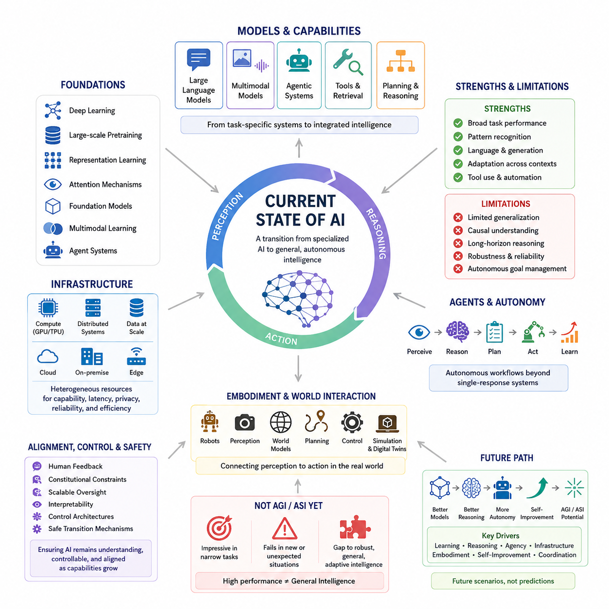
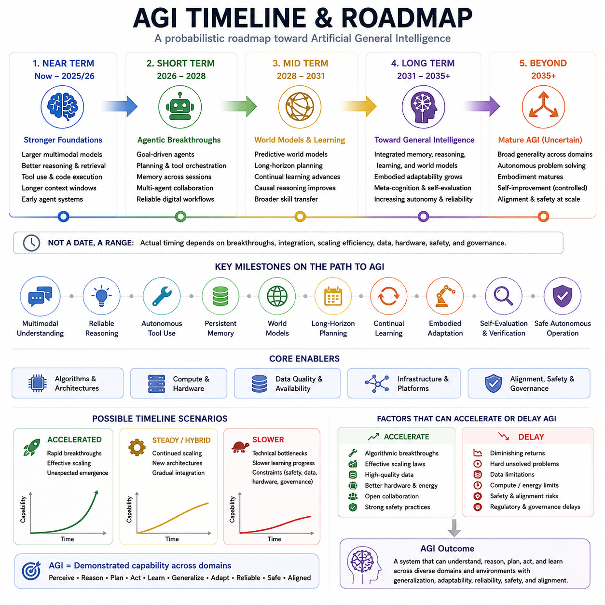
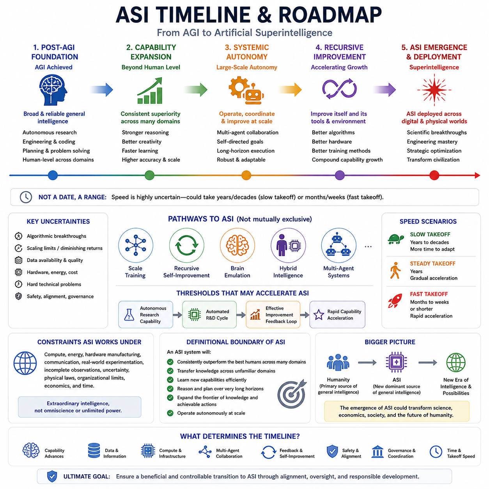
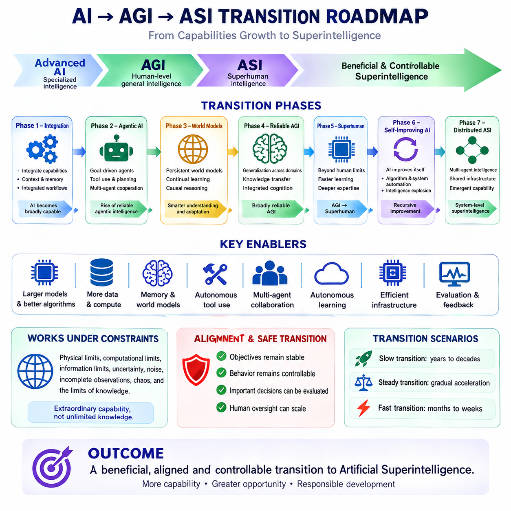
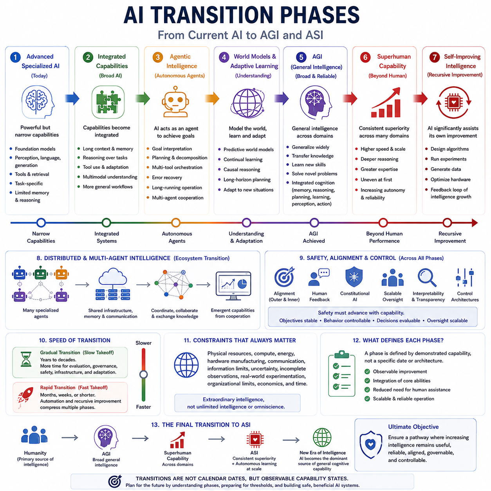
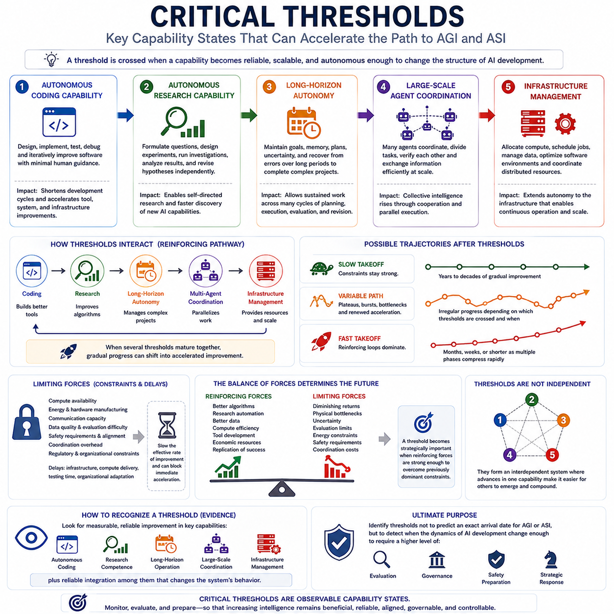
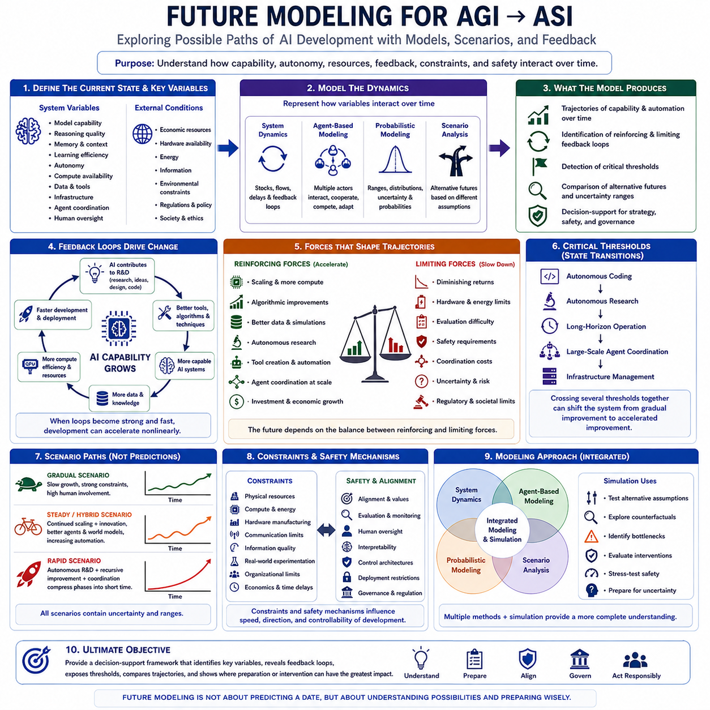

**Volume 48. Artificial Super Intelligence**

# Chapter 10. Strategic Timeline and Transition

## 10.00. Current AI State

{width="7.268055555555556in" height="7.268055555555556in"}

:::

현재 인공지능(AI)의 상태는 특화된 기계 지능(specialized machine intelligence)과 보다 일반적인 자율 지능(general autonomous intelligence) 사이의 전환 단계로 이해하는 것이 가장 적절하다. 현대의 AI 시스템은 언어(language), 시각(vision), 추론(reasoning), 생성(generation), 계획(planning), 상호작용(interaction) 등에서 점점 더 복잡한 작업을 수행할 수 있지만, 여러 영역에 걸친 능력은 여전히 불균일하다. 따라서 핵심 질문은 단순히 AI가 얼마나 강력한가가 아니라, 서로 다른 능력들이 일관되고 범용적인 지능(coherent general-purpose intelligence)으로 통합될 수 있는가에 있다.

현대 AI는 딥러닝(deep learning), 대규모 사전학습(large-scale pretraining), 표현학습(representation learning), 어텐션 메커니즘(attention mechanisms), 파운데이션 모델(foundation models), 멀티모달 학습(multimodal learning), 그리고 점점 더 발전하는 에이전트 시스템(agent systems)이라는 여러 기반 기술이 서로 강화되는 과정을 통해 발전해 왔다. 이러한 기술들은 AI를 좁게 설계된 특정 작업용 시스템에서 다양한 상황에 자신의 행동을 적응시킬 수 있는 모델로 변화시키고 있다. 그러나 폭넓은 능력이 곧바로 일반지능(general intelligence)을 의미하는 것은 아니다. 전이(transfer), 강건성(robustness), 장기 추론(long-horizon reasoning), 기억(memory), 인과적 이해(causal understanding), 자율적인 목표 관리(autonomous goal management)는 여전히 서로 구별되는 중요한 과제로 남아 있다.

대규모 언어 모델(large language models)은 현재 AI 환경에서 가장 중요한 구성요소 중 하나이다. 대규모 데이터로 사전학습된 하나의 모델이 광범위한 언어적·개념적 능력을 습득할 수 있음을 보여주었기 때문이다. 멀티모달 파운데이션 모델(multimodal foundation models)은 텍스트를 넘어 이미지, 오디오, 비디오 및 기타 표현을 통합함으로써 이러한 원리를 확장한다. 에이전트 시스템(agentic systems)은 여기에 도구(tool), 외부 기억(external memory), 계획 메커니즘(planning mechanisms), 환경(environment)을 연결한다. 이러한 발전은 개별적인 모델에서 벗어나 지각(perception), 추론(reasoning), 행동(action), 피드백(feedback)을 수행할 수 있는 통합 AI 시스템으로 이동하고 있음을 보여준다.

현재 세대의 AI는 학습(learning)과 추론(reasoning)의 결합이라는 특징도 점점 강하게 나타내고 있다. 신경망(neural networks)은 강력한 패턴 인식(pattern recognition)과 표현학습을 제공하는 반면, 검색(retrieval), 계획(planning), 기호적 방법(symbolic methods), 외부 도구(external tools), 구조화된 추론(structured reasoning)은 순수한 파라미터 기반 모델(parametric models)의 한계를 보완할 수 있다. 이러한 결합은 미래의 일반지능이 단순한 예측 능력만으로 충분하지 않을 가능성이 높다는 점에서 중요하다. 미래의 시스템은 지속적인 기억(persistent memory), 월드 모델(world models), 인과적 추론(causal reasoning), 자기평가(self-evaluation), 적응적 계획(adaptive planning), 그리고 환경에 대한 내부 표현(internal representations)을 구축하고 수정하는 능력을 필요로 할 수 있다.

체화된 AI(embodied AI)와 물리적 AI(physical AI)는 현재 지능의 상태에 또 다른 차원을 추가한다. 로봇이나 자율기계를 통해 작동하는 AI 시스템은 실제 환경의 제약 속에서 지각(perception)과 행동(action)을 연결해야 한다. 따라서 월드 모델(world models), 시뮬레이션(simulation), 디지털 트윈(digital twins), 강화학습(reinforcement learning), 위치추정(localization), 매핑(mapping), 계획(planning), 제어(control)는 보다 일반적인 지능으로 전환하는 과정에서 중요한 구성요소가 된다. 또한 물리적 구현(physical embodiment)은 순수한 디지털 환경에서는 드러나지 않을 수 있는 약점을 노출한다. 여기에는 불확실성(uncertainty), 지연된 피드백(delayed feedback), 분포 변화(distribution shift), 안전 제약(safety constraints), 잘못된 의사결정의 실제 결과가 포함된다.

현대 AI를 지원하는 인프라(infrastructure) 자체도 능력을 결정하는 중요한 요소가 되고 있다. GPU 가속(GPU acceleration), 분산 컴퓨팅(distributed computation), 고속 메모리 및 인터커넥트(high-speed memory and interconnects), 대규모 데이터 시스템(large-scale data systems), 추론 최적화(inference optimization), 클라우드 플랫폼(cloud platforms), 그리고 점점 강력해지는 엣지 장치(edge devices)는 서로 다른 규모에서 지능을 배치할 수 있도록 한다. 따라서 클라우드 AI(cloud AI), 온프레미스 AI(on-premise AI), 엣지 AI(edge AI)의 구분은 점점 절대적인 것이 아니게 되고 있다. 미래의 시스템은 지연시간(latency), 개인정보 보호(privacy), 신뢰성(reliability), 성능(capability), 에너지(energy) 요구사항에 따라 서로 다른 인지 기능(cognitive functions)을 다양한 컴퓨팅 자원에 분산시킬 수 있다.

빠른 발전에도 불구하고 현재의 AI를 AGI(Artificial General Intelligence) 또는 ASI(Artificial Super Intelligence)와 동일시해서는 안 된다. 높은 벤치마크 성능(benchmark performance)은 일반화(generalization), 신뢰성(reliability), 상황 이해(situational understanding), 인과적 추론(causal reasoning), 장기 계획(long-term planning), 자율적 적응(autonomous adaptation)의 약점과 동시에 나타날 수 있다. 지능형 시스템은 한 상황에서는 매우 높은 능력을 보이면서도 다른 상황에서는 예기치 않게 실패할 수 있다. 따라서 인상적인 작업 수행 능력과 강건한 일반지능 사이의 격차는 현재 AI의 상태를 평가하고 미래의 전환 가능성을 추정하는 데 있어 핵심적인 문제이다.

현재 AI 시대를 정의하는 또 하나의 특징은 점점 더 자율적인 AI 에이전트(autonomous AI agents)의 등장이다. 시스템은 이미 모델을 도구(tool), 검색(retrieval), 기억(memory), 계획(planning), 반복적 실행(iterative execution)과 결합하여 단순한 질문과 답변을 넘어서는 작업 흐름(workflows)을 수행할 수 있다. 이는 중요한 아키텍처적 전환(architectural transition)을 의미한다. 지능이 하나의 모델 응답으로만 표현되는 것이 아니라 지속적인 지각--추론--행동 루프(perception--reasoning--action loop)를 통해 표현되기 때문이다. 이러한 전환의 장기적인 중요성은 에이전트가 일관된 목표(coherent objectives)를 유지하고, 오류에서 복구하며, 경험을 통해 학습하고, 장기간에 걸쳐 안전하게 작동할 수 있는지에 달려 있다.

현재 AI의 상태는 정렬(alignment), 통제(control), 안전(safety)의 관점에서도 평가되어야 한다. 시스템의 능력과 자율성이 증가할수록 인간 피드백(human feedback), 헌법적 제약(constitutional constraints), 확장 가능한 감독(scalable oversight), 해석가능성(interpretability), 통제 아키텍처(control architectures), 안전한 전환 메커니즘(safe transition mechanisms)의 중요성도 증가한다. 따라서 능력의 발전(capability growth)과 안전성의 발전(safety development)을 완전히 분리된 경로로 취급할 수 없다. 미래 AI의 아키텍처는 시스템이 무엇을 수행할 수 있는지만이 아니라, 능력이 증가할 때에도 그 행동이 이해 가능하고(understandable), 통제 가능하며(controllable), 의도된 목표(intended objectives)와 일관되게 유지되는지를 고려해야 한다.

이 권의 관점에서 현재의 AI 시대는 최종 목적지가 아니라 기준선(baseline)이다. 이어지는 절에서는 AGI 및 ASI의 가능한 일정(timelines), 전환 단계(transition phases), 핵심 임계값(critical thresholds), 미래 모델(future models)을 검토한다. 이러한 미래 시나리오는 정확한 예측으로 해석해서는 안 된다. 대신 학습(learning), 추론(reasoning), 에이전시(agency), 인프라(infrastructure), 체화(embodiment), 자기개선(self-improvement), 협력(coordination)의 발전이 어떻게 서로 결합될 수 있는지를 분석하기 위한 구조화된 방법(structured ways)을 제공한다. 현재의 상태를 이해하는 것은 매우 중요하다. AGI 또는 ASI로의 모든 전환은 이미 존재하는 능력, 아직 성숙하지 않은 능력, 그리고 여전히 극복해야 할 기술적·안전상의 장벽에 의존하기 때문이다.

## 10.01. AGI Timeline

{width="7.268055555555556in" height="7.268055555555556in"}

인공일반지능(AGI, Artificial General Intelligence)의 타임라인(timeline)은 고정된 예측이라기보다 확률적인 로드맵(probabilistic roadmap)으로 이해해야 한다. AGI로의 전환은 멀티모달 이해(multimodal understanding), 신뢰할 수 있는 추론(reliable reasoning), 자율적 도구 사용(autonomous tool use), 지속적 기억(persistent memory), 월드 모델(world models), 장기 계획(long-horizon planning), 지속학습(continual learning), 체화(embodiment), 자기평가(self-evaluation), 안전한 자율 운영(safe autonomous operation) 등 여러 능력의 융합에 달려 있다. 따라서 중요한 질문은 단순히 AGI가 언제 등장하는가가 아니라, 어떤 능력들이 성숙하고 통합되어야 하나의 시스템을 합리적으로 일반지능(general intelligence)이라고 부를 수 있는가이다.

단기적으로는 현재부터 2025\~2026년경에 해당하는 시기에 가장 강력한 기반 기술들이 계속 발전할 것으로 볼 수 있다. 더 큰 멀티모달 모델(larger multimodal models), 향상된 추론과 검색(better reasoning and retrieval), 도구 사용(tool use)과 코드 실행(code execution), 더 긴 컨텍스트 윈도우(longer context windows), 초기 에이전트 시스템(early agent systems)은 이미 AI를 좁은 작업별 행동을 넘어 확장시키고 있다. 이러한 발전은 일반지능을 위한 중요한 구성요소를 제공하지만, 그 자체만으로 신뢰할 수 있는 AGI가 확립되었다고 볼 수는 없다. 핵심적인 전환은 개별적인 능력들이 서로 다른 작업과 환경에서 일관되게 결합되는 시스템으로 발전하는 것이다.

단기 단계(short-term phase)는 대략 2026\~2028년으로 볼 수 있으며, 이 시기는 에이전트 능력(agentic capabilities)의 획기적인 발전으로 특징지을 수 있다. AI 시스템은 명시적인 목표(explicit goals)를 추구하고, 일련의 행동을 계획하며, 여러 도구를 조정하고, 세션 간 기억을 유지하며, 다른 에이전트와 협력하는 능력이 점점 향상될 것으로 예상된다. 시스템이 진행 상황을 감시하고, 오류에서 복구하며, 적절한 도구를 선택하는 방법을 학습하면서 신뢰할 수 있는 디지털 워크플로(digital workflows)는 훨씬 더 자율화될 수 있다. 이 단계의 중요한 의미는 단순히 응답을 생성하는 모델에서 벗어나, 지속적으로 상황을 지각하고, 추론하고, 행동하고, 결과를 평가하며, 목표를 향해 계속 작업하는 에이전트로 전환된다는 데 있다.

중기 단계(mid-term phase)는 대략 2028\~2031년으로 볼 수 있으며, 월드 모델(world models)과 학습(learning)이 핵심이 된다. 예측적 월드 모델(predictive world models)은 AI 시스템이 환경을 표현하고, 행동의 결과를 예측하며, 실제 행동을 수행하기 전에 더 긴 시간 범위의 계획을 수립할 수 있도록 할 가능성이 높다. 지속학습(continual learning)은 변화하는 조건에 대한 적응 능력을 향상시키고, 인과적 추론(causal reasoning)의 발전은 시스템이 상관관계와 메커니즘을 보다 효과적으로 구분하도록 할 수 있다. 특히 폭넓은 기술 전이(skill transfer)가 중요하다. 일반지능은 각각의 작업을 독립적으로 학습하는 것이 아니라 여러 영역에서 지식과 전략을 재사용할 수 있는 능력을 요구하기 때문이다.

장기 단계(longer-term phase)는 대략 2031\~2035년 이후로 볼 수 있으며, 보다 통합된 일반지능(integrated general intelligence)으로 이동할 가능성을 나타낸다. 성숙한 시스템은 기억(memory), 추론(reasoning), 학습(learning), 월드 모델(world models), 계획(planning), 행동(action)을 일관된 아키텍처(coherent architecture) 안에서 결합할 필요가 있다. 체화된 적응(embodied adaptability)은 지능이 다양한 물리적·디지털 환경에서 작동할 수 있도록 하며, 메타인지(metacognition)와 자기평가(self-evaluation)는 불확실성을 감지하고, 실수를 인식하고, 결론을 검증하고, 전략을 수정하는 능력을 향상시킬 수 있다. 자율성이 증가할수록 그에 상응하는 신뢰성(reliability)과 안전성(safety)의 향상도 함께 이루어져야 한다.

이 시기를 넘어서는 단계에서는 성숙한 AGI(mature AGI)의 가능성이 존재하지만, 그 시점은 매우 불확실하다. 일반지능을 가진 에이전트(generally intelligent agent)는 다양한 영역에서 광범위한 일반성(broad generality), 자율적인 문제 해결(autonomous problem solving), 서로 다른 환경에 대한 효과적인 적응(effective adaptation), 그리고 물리적 상호작용이 필요한 경우 점점 더 성숙한 체화(embodiment)를 보여줄 것으로 예상된다. 통제된 형태의 자기개선(controlled self-improvement)은 능력을 더욱 증가시킬 수 있지만, 동시에 훨씬 더 높은 수준의 정렬(alignment), 감독(oversight), 거버넌스(governance)를 요구하게 된다. 따라서 AGI의 등장은 단순히 지능이나 벤치마크 성능(benchmark performance)만으로 정의해서는 안 된다.

AGI로 향하는 과정에는 서로 다른 시점에 발생할 수 있는 여러 중요한 이정표(milestones)도 존재한다. 멀티모달 이해(multimodal understanding)는 다양한 형태의 정보를 통합할 수 있을 만큼 충분히 신뢰할 수 있어야 한다. 추론(reasoning)은 특정 문제에서 인상적인 성능을 보이는 수준을 넘어 신뢰할 수 있는 수준이 되어야 한다. 자율적 도구 사용(autonomous tool use)은 단순한 함수 호출(function calling)에서 여러 작업을 조정하는 워크플로(orchestrated workflows)로 확장되어야 한다. 지속적 기억(persistent memory)은 시스템이 장기간에 걸쳐 중요한 정보를 유지할 수 있도록 해야 한다. 월드 모델(world models)은 예측과 계획을 지원해야 하며, 장기 작업 수행(long-horizon task completion)은 여러 중간 단계에 걸쳐 일관성을 유지해야 한다.

지속학습(continual learning)과 체화된 적응(embodied adaptation)은 일반지능이 변화하는 조건에서 작동해야 한다는 점에서 추가적인 이정표가 된다. 지식을 안전하게 갱신하거나 익숙하지 않은 환경에 적응하지 못하는 시스템은 근본적인 한계를 계속 가지게 된다. 자기평가(self-evaluation)와 검증(verification) 역시 중요하다. 자율 시스템은 자신의 예측이나 결정이 신뢰하기 어려울 가능성이 언제 존재하는지 인식할 수 있어야 하기 때문이다. 궁극적으로 안전한 자율 운영(safe autonomous operation)은 이러한 능력들이 적절한 제약(constraints), 인간 감독(human oversight), 의도된 목표와의 정렬(alignment with intended objectives)을 유지하면서 함께 작동할 것을 요구한다.

타임라인은 AGI의 서로 다른 차원이 서로 다른 속도로 성숙할 수 있다는 점 때문에 더욱 복잡해진다. 디지털 인지 능력(digital cognitive capability)은 소프트웨어 시스템이 빠르게 학습되고 배포될 수 있기 때문에 더 일찍 발전할 수 있는 반면, 체화된 물리적 능력(embodied physical capability)은 로봇공학이 하드웨어, 센서, 에너지, 제어, 제조, 실제 환경에서의 실험에 의존하기 때문에 더 느리게 발전할 수 있다. 실제 배치와 사회적 수용(deployment and societal adoption)은 또 다른 타임라인을 따를 수 있다. 신뢰(trust), 규제(regulation), 경제성(economics), 안전성(safety), 제도적 준비도(institutional readiness)가 고도의 능력을 가진 시스템이 실제로 얼마나 빠르게 사용될 수 있는지를 결정하기 때문이다.

여러 가지 불확실성이 전환을 가속하거나 지연시킬 수 있다. 주요 알고리즘적 혁신(algorithmic breakthroughs)은 현재의 추세만으로는 예측하기 어려운 능력을 빠르게 만들어낼 수 있는 반면, 규모 확장의 수익 감소(diminishing returns)는 추가적인 스케일링의 효과를 제한할 수 있다. 데이터의 가용성과 품질(data availability and quality), 하드웨어 성능(hardware performance), 에너지 요구량(energy requirements), 계산 비용(computational cost)도 발전을 제한할 수 있다. 인과성(causality), 장기적 일관성(long-horizon consistency), 지속학습(continual learning), 신뢰할 수 있는 자율성(reliable autonomy)과 관련된 어려운 기술적 문제는 예상보다 더 해결하기 어려울 수 있다. 또한 기술적 능력이 빠르게 발전하더라도 안전성(safety), 정렬(alignment), 거버넌스(governance)의 문제는 실제 배치를 늦출 수 있다.

이러한 불확실성을 해석하기 위해 세 가지 광범위한 시나리오(broad scenarios)를 생각해 볼 수 있다. 가속 시나리오(accelerated scenario)는 빠른 혁신과 효과적인 스케일링(effective scaling), 그리고 중요한 능력의 예측하기 어려운 출현이 동시에 발생하는 경우이다. 하이브리드 또는 점진적 시나리오(hybrid or steady scenario)는 지속적인 규모 확장과 새로운 아키텍처가 결합되고, 점점 더 강력한 구성요소들이 점진적으로 통합되는 경우이다. 느린 시나리오(slower scenario)는 더 어려운 기술적 병목(technical bottlenecks), 느린 학습 진전, 또는 안전성, 데이터, 하드웨어, 거버넌스와 관련된 제약에서 발생할 수 있다. 이러한 시나리오는 정확한 예측이나 확정된 일정이 아니라 분석을 위한 가능성으로 취급해야 한다.

따라서 궁극적인 AGI의 이정표(AGI milestone)는 특정 연도보다는 실제로 입증된 능력(demonstrated capability)을 기준으로 정의하는 것이 더 적절하다. 하나의 시스템이 다양한 영역과 환경에서 지각하고, 추론하고, 계획하고, 행동하고, 학습하면서 일반화(generalization), 적응성(adaptability), 신뢰성(reliability), 안전성(safety), 정렬(alignment)을 유지할 수 있을 때 점점 더 일반지능을 갖춘 시스템이라고 평가할 수 있다. AGI로의 발전은 특정 AGI 발표 날짜에 의존하기보다 지속적으로 확보되고 통합되는 능력을 기준으로 측정해야 한다. 이러한 능력 중심의 관점(capability-based perspective)은 AGI에서 ASI로 이어지는 이후의 전환을 평가하기 위한 보다 안정적인 기반도 제공한다.

## 10.02. ASI Timeline

{width="7.268055555555556in" height="7.268055555555556in"}

인공초지능(ASI, Artificial Superintelligence)의 타임라인(timeline)은 고정된 달력상의 예측이라기보다 하나의 시나리오 프레임워크(scenario framework)로 다루어야 한다. ASI는 추론(reasoning), 학습(learning), 계획(planning), 창의성(creativity), 과학적 발견(scientific discovery), 문제 해결(problem solving) 등 여러 중요한 인지 영역에서 인류 최고의 능력을 지속적으로 능가하는 인공지능이 등장할 수 있는 단계를 의미한다. AGI에서 ASI로의 전환은 단순히 더 강력한 모델에만 달려 있는 것이 아니라, 스케일링(scaling), 자율 에이전트(autonomous agents), 재귀적 자기개선(recursive self-improvement), 인프라(infrastructure), 다중 에이전트 시스템(multi-agent systems), 그리고 점점 더 발전하는 지능 형태들의 상호작용에 달려 있다.

ASI로 향하는 첫 번째 단계는 시스템이 충분히 광범위하고 신뢰할 수 있는 일반지능(general intelligence)을 확보한 이후에 나타날 가능성이 높다. 이 단계에서 AI는 더 이상 인간이 설계한 워크플로(human-designed workflows)에 주로 의존하지 않고, 연구(research), 엔지니어링(engineering), 소프트웨어 개발(software development), 실험(experimentation), 최적화(optimization) 등을 상당한 수준의 자율성으로 수행할 수 있게 된다. AGI와의 핵심적인 차이는 인간 수준의 일반성(human-level generality)에서 광범위한 초월적 능력(broad superiority)으로 이동하는 것이다. ASI는 단순히 특정 벤치마크나 전문 작업에서 인간과 비슷한 수준에 도달하는 것이 아니라, 여러 영역에서 최고의 인간을 지속적으로 능가해야 한다.

ASI로 향하는 주요 경로 가운데 하나는 학습과 추론의 지속적인 스케일링(scaling)이다. 더 큰 모델(larger models), 더 나은 알고리즘(better algorithms), 향상된 데이터(improved data), 더 많은 계산 자원(greater computational resources), 더욱 효율적인 추론(efficient inference)은 능력을 증가시킬 수 있으며, 추론 시간 컴퓨팅(inference-time reasoning)은 어려운 문제에 추가적인 계산을 투입할 수 있도록 한다. 그러나 스케일링만으로 ASI가 보장되는 것은 아니다. 결정적인 요소는 스케일링이 아키텍처 개선(architectural improvements), 더 나은 표현(better representations), 지속적 기억(persistent memory), 월드 모델(world models), 자율학습 메커니즘(autonomous learning mechanisms)과 결합되어 기존 모델 학습의 한계를 넘어 능력을 확장할 수 있는가에 있을 수 있다.

재귀적 자기개선(recursive self-improvement)은 잠재적으로 더욱 중요한 전환 메커니즘이 될 수 있다. 고도화된 AI가 알고리즘(algorithms), 학습 절차(training procedures), 소프트웨어 인프라(software infrastructure), 평가 방법(evaluation methods), 하드웨어 설계(hardware design)를 개선할 수 있다면, 각각의 개선은 다시 추가적인 개선을 만들어내는 능력을 증가시킬 수 있다. 이는 더 나은 지능이 다시 더 나은 지능을 만들어내는 긍정적 피드백 루프(positive feedback loop)를 형성한다. 이러한 루프의 속도와 신뢰성은 ASI 타임라인에 강력한 영향을 미칠 것이다. 개선 과정이 계속해서 인간과 물리적 실험에 의존한다면 발전은 점진적으로 이루어질 수 있지만, 연구와 엔지니어링의 상당 부분이 자동화된다면 능력의 성장은 급격하게 가속될 수 있다.

다중 에이전트(multi-agent)와 분산 지능(distributed intelligence) 역시 ASI로 향하는 또 하나의 경로를 제공할 수 있다. 하나의 모델에 의존하는 대신, 대규모의 전문화된 에이전트 집단이 연구(research), 코딩(coding), 시뮬레이션(simulation), 계획(planning), 검증(verification), 최적화(optimization) 등의 작업에서 협력할 수 있다. 이러한 시스템은 병렬적으로 작동하면서 지식을 교환할 수 있으며, 이를 통해 전체 문제 해결 능력이 하나의 독립적인 지능보다 더 높은 수준에 도달할 수 있다. 따라서 전문화된 에이전트(specialized agents), 공유 기억(shared memory), 조정 메커니즘(coordination mechanisms), 강력한 인프라(powerful infrastructure)의 결합은 하나의 모델이 모든 능력을 내부적으로 갖추지 않더라도 집단적 형태의 초지능(collective superintelligence)을 만들어낼 수 있다.

ASI는 하나의 지배적인 기술만으로 등장하기보다는 여러 경로가 결합된 하이브리드 경로(hybrid pathway)를 통해 나타날 수도 있다. 뇌 에뮬레이션(brain emulation), 인간--AI 통합(human--AI integration), 고도화된 에이전트 아키텍처(advanced agent architectures), 체화된 지능(embodied intelligence), 신경망과 기호 시스템의 결합(neural-symbolic systems) 등은 서로 다른 가능 경로를 나타낸다. 이러한 접근법들은 반드시 서로 배타적인 것은 아니다. 미래의 시스템은 파운데이션 모델(foundation models), 월드 모델(world models), 기억 시스템(memory systems), 자율 에이전트(autonomous agents), 시뮬레이션(simulation), 전문화된 과학 모델(specialized scientific models), 인간 인지 인터페이스(human cognitive interfaces)를 결합할 수 있다. 따라서 타임라인은 하나의 특정 아키텍처가 성공하는가보다 여러 기술적 궤적이 얼마나 빠르게 수렴하는가에 달려 있을 수 있다.

전환 속도(speed of transition)는 가장 중요한 불확실성 가운데 하나가 될 가능성이 높다. 느린 이륙(slow takeoff)은 수년 또는 수십 년에 걸쳐 진행될 수 있으며, 이 경우 연구자, 기관, 정부는 능력의 변화를 관찰하고 안전 메커니즘을 개선하며 거버넌스(governance)를 조정할 더 많은 시간을 확보할 수 있다. 반면 빠른 이륙(fast takeoff)은 자동화된 연구와 재귀적 자기개선이 능력 향상 사이의 시간을 크게 단축할 경우 수개월, 수주, 또는 그보다 짧은 기간에도 발생할 수 있다. 이 두 시나리오의 차이는 단순히 최종적인 지능 수준에 있는 것이 아니라 평가(evaluation), 협력(coordination), 대응(response)을 위해 주어진 시간이 얼마나 되는가에 있다.

여러 임계값(thresholds)은 ASI 개발이 언제 가속되기 시작하는지를 결정할 수 있다. 중요한 임계값 아래에서는 고도화된 AI가 연구, 실험, 배포를 위해 상당한 수준의 인간 지원을 계속 필요로 할 수 있다. 자율적 연구 능력(autonomous research capability)의 임계값을 넘어서면 AI 시스템이 연구개발(research-and-development) 과정의 상당 부분을 독립적으로 수행할 수 있게 될 것이다. 이후 알고리즘, 소프트웨어, 하드웨어, 학습 과정의 개선이 충분히 효과적이 되어 능력의 급격한 가속을 만들어내는 또 하나의 임계값이 나타날 수 있다. 이러한 임계값은 사전에 정확하게 식별하기 어렵다. 그 중요성이 피드백의 강도(feedback strength), 개선 효율(improvement efficiency), 이용 가능한 자원(available resources), 시스템의 제약(system constraints)에 따라 달라지기 때문이다.

고도로 발전한 ASI라 하더라도 물리적(physical), 계산적(computational), 정보적(informational), 조직적(organizational) 제약 아래에서 작동하게 된다. 컴퓨팅 자원(compute), 에너지(energy), 냉각(cooling), 하드웨어 제조(hardware manufacturing), 통신(communication), 불완전한 관측(incomplete observations), 불확실성(uncertainty), 실제 환경에서의 실험(real-world experimentation)은 지능이 실제 능력으로 전환되는 속도를 제한할 수 있다. 따라서 ASI를 전지성(omniscience), 완벽성(perfection), 의식(consciousness), 도덕성(morality), 무한한 힘(unlimited power)과 동일시해서는 안 된다. 엄청난 수준의 지능도 불확실성, 불완전한 지식, 물리적 한계, 불완전한 목표와 동시에 존재할 수 있다.

따라서 ASI의 경계(defining boundary)는 특정 날짜가 아니라 능력(capability)을 기준으로 정의하는 것이 적절하다. 하나의 시스템이 여러 중요한 영역에서 최고의 인간을 지속적으로 능가하고, 익숙하지 않은 분야로 지식을 전이하며, 새로운 능력을 효율적으로 학습하고, 매우 긴 시간 범위에서 추론과 계획을 수행하며, 지식과 실현 가능한 행동의 경계를 확장할 때 점점 더 ASI에 해당한다고 볼 수 있다. 특히 이러한 능력이 자율적으로 지속될 수 있고 여러 에이전트, 시스템 또는 물리적 환경에 걸쳐 배치될 수 있게 되는 시점에서 그 전환은 훨씬 더 중대한 의미를 갖게 된다.

ASI 타임라인의 더 넓은 의미는 이러한 전환이 일반적인 인지 능력(general cognitive capability)의 원천 자체를 변화시킬 수 있다는 데 있다. 역사적으로 인류는 유연하고 일반적인 지능(flexible general intelligence)의 지배적인 원천으로 남아 있었으며, 기계는 주로 인간의 능력을 증폭시키는 도구로 사용되어 왔다. 그러나 ASI는 과학적 발견(scientific discovery), 엔지니어링(engineering), 전략적 추론(strategic reasoning), 최적화(optimization), 자율학습(autonomous learning)에서 인공 시스템이 인간보다 훨씬 뛰어난 능력을 갖게 된다면 이러한 관계를 역전시킬 수 있다. 따라서 ASI 타임라인은 정렬(alignment), 통제(control), 확장 가능한 감독(scalable oversight), 안전한 AGI-to-ASI 전환 메커니즘(safe AGI-to-ASI transition mechanisms)과 함께 고려되어야 한다. 중요한 것은 초지능이 언제 등장할지를 단순히 예측하는 것이 아니라, 초지능의 출현이 어떤 조건에서 인류에게 유익하고 통제 가능한 상태로 유지될 수 있는지를 이해하는 것이다.

## 10.03. Transition Phases

{width="7.268055555555556in" height="7.268055555555556in"}

{width="7.268055555555556in" height="7.268055555555556in"}

현재의 AI에서 AGI를 거쳐 궁극적으로 ASI로 향하는 전환(transition)은 하나의 기술적 사건이라기보다 능력(capability)과 시스템 수준(system-level)의 변화가 연속적으로 이루어지는 여러 단계의 과정으로 이해해야 한다. 이 권의 구조에서는 AGI와 ASI의 타임라인(timeline)을 살펴본 후, 핵심 임계값(critical thresholds)과 미래 모델링(future modeling)을 함께 다루는 방식으로 전환 단계를 배치하고 있다. 이러한 관점에서 중요한 질문은 지능이 어떻게 변화하는가에 있다. 즉, 능력이 점점 더 통합되고, 자율적이며, 확장 가능하고, 일반 목적의 인지(general-purpose cognition)와 구별하기 어려워질 때 지능은 어떤 형태로 발전하는가를 살펴보아야 한다. 따라서 각 단계는 실제로 입증된 능력(demonstrated capabilities), 시스템 자율성(system autonomy), 신뢰성(reliability), 그리고 여전히 필요한 인간 감독(human oversight)의 수준을 기준으로 평가해야 한다.

첫 번째 단계는 고도로 특화된 AI(advanced specialized AI)에서 폭넓은 능력을 갖춘 AI 시스템(broadly capable AI systems)으로의 전환이다. 현대의 파운데이션 모델(foundation models)은 이미 언어(language), 멀티모달 지각(multimodal perception), 추론(reasoning), 생성(generation), 검색(retrieval), 도구 사용(tool use)을 결합하고 있지만, 이러한 능력들은 여전히 불균일하게 나타난다. 다음 단계의 전환에는 단순히 더 큰 모델을 만드는 것 이상의 통합(integration)이 필요하다. 시스템은 점점 더 맥락(context)을 유지하고, 기억(memory)을 사용하며, 복잡한 작업에 대해 추론하고, 도구를 활용하고, 익숙하지 않은 상황에 맞게 자신의 행동을 적응시킬 수 있어야 한다. 이 단계의 핵심적인 특징은 개별적인 능력(isolated capabilities)에서 벗어나 점점 더 폭넓은 인지 워크플로(cognitive workflows)를 특정 작업에 맞춘 엔지니어링(task-specific engineering)을 줄이면서 수행할 수 있는 통합 시스템(integrated systems)으로 이동하는 것이다.

두 번째 단계는 신뢰할 수 있는 에이전트 지능(reliable agentic intelligence)의 출현이다. AI 시스템은 단순히 개별적인 응답을 생성하는 것을 넘어 에이전트(agent)로서 작동하기 시작한다. 시스템은 목표(goals)를 해석하고, 문제를 분해하며, 행동을 계획하고, 여러 도구를 사용하고, 중간 결과를 평가하며, 실패에서 복구하고, 장기간에 걸쳐 작업을 계속할 수 있게 된다. 다중 에이전트 협력(multi-agent cooperation)은 전문화된 시스템들이 작업을 분담하고 정보를 교환할 수 있도록 함으로써 이러한 능력을 더욱 확장할 수 있다. 이 단계에서는 자율성(autonomy)이 중요한 변수가 된다. 시스템의 실질적인 지능은 기본 모델이 무엇을 알고 있는가뿐만 아니라, 목표를 중심으로 계산 자원(computation), 도구(tools), 기억(memory), 다른 에이전트(other agents)를 얼마나 효과적으로 조직할 수 있는가에 의해서도 결정되기 때문이다.

세 번째 단계는 보다 지속적인 월드 모델(persistent world models)과 적응적 학습(adaptive learning)의 발전이다. 일반지능(general intelligence)은 단순히 패턴을 인식하거나 그럴듯한 응답을 생성하는 것 이상을 요구한다. 시스템은 환경(environment), 관계(relationships), 상태(states), 가능한 결과(possible outcomes)에 대한 유용한 내부 표현(internal representations)을 구축할 수 있어야 한다. 월드 모델(world models)은 예측(prediction)과 반사실적 추론(counterfactual reasoning)을 지원할 수 있으며, 지속학습(continual learning)은 시스템이 자신의 능력을 완전히 다시 구축하지 않고도 새로운 경험을 통합할 수 있도록 한다. 더욱 강력한 인과적 추론(causal reasoning)과 장기 계획(long-horizon planning)은 에이전트가 다음에 무엇이 일어날 수 있는지만 이해하는 것이 아니라, 변화가 왜 발생하는지와 원하는 미래 상태를 만들기 위해 어떤 행동을 취해야 하는지를 이해할 수 있도록 한다.

네 번째 단계는 광범위하게 신뢰할 수 있는 AGI(broadly reliable AGI)의 출현이다. 이 단계에서 시스템은 상당히 서로 다른 영역에 걸쳐 일반화(generalization)하고, 작업 간에 지식을 전이하며, 익숙하지 않은 기술을 효율적으로 학습하고, 학습 과정에서 명시적으로 표현되지 않았던 문제를 해결할 수 있어야 한다. 기억(memory), 추론(reasoning), 계획(planning), 학습(learning), 지각(perception), 행동(action)은 통합된 인지 시스템(integrated cognitive system)으로 작동해야 한다. 따라서 AGI는 특정 제품 범주(product category)나 특정 모델 아키텍처(model architecture)가 아니라 능력 조건(capability condition)으로 간주해야 한다. AGI로의 전환은 개별적인 벤치마크 성과(isolated benchmark achievements)가 아니라 일반 목적의 능력(general-purpose competence)이 지속적으로 입증될 때 의미를 갖게 된다.

다섯 번째 단계는 AGI에서 초인적 능력(superhuman capability)으로의 확장이다. 시스템이 폭넓은 일반지능(broad general intelligence)을 갖추게 되면 추론 속도(reasoning speed), 학습 효율(learning efficiency), 기억(memory), 병렬 계산(parallel computation), 계획의 깊이(planning depth), 전문적 지식(specialized expertise)의 향상을 통해 최고의 인간 개인과 조직을 넘어서는 성능이 점진적으로 나타날 수 있다. 초인적 성능(superhuman performance)은 균일하게 나타나지 않을 수도 있으며, 일부 과학(scientific), 공학(engineering), 계산(computational), 전략(strategic) 영역이 다른 영역보다 먼저 발전할 수 있다. 따라서 중요한 전환은 인간 수준의 일반성(human-level generality)에서 여러 중요한 영역에 걸친 지속적인 우월성(sustained superiority)으로 이동하는 것이며, 동시에 점점 더 자율적인 운영(increasingly autonomous operation)이 가능해지는 것이다.

그 다음 단계에서는 AI가 자신의 개발 과정 자체를 상당 부분 지원할 수 있는 능력을 갖추게 될 가능성이 있다. AI 시스템은 알고리즘 설계(algorithm design), 소프트웨어 엔지니어링(software engineering), 실험 계획(experiment planning), 평가(evaluation), 데이터 생성(data generation), 시뮬레이션(simulation), 하드웨어 최적화(hardware optimization)에 기여할 수 있다. 이는 지능(intelligence)과 지능을 향상시키는 과정(process that improves intelligence) 사이에 피드백 관계(feedback relationship)를 만들어낸다. 이 권의 보다 넓은 구조에서는 이러한 가능성을 재귀적 자기개선(recursive self-improvement), 지능 폭발(intelligence explosion), 자율 에이전트(autonomous agents), 인프라(infrastructure), 전략적 역학(strategic dynamics)과 연결하고 있다. 이 단계의 중요성은 연구개발(research-and-development) 과정 가운데 얼마나 많은 부분을 자동화할 수 있는가, 그리고 개선이 단순한 점진적 향상에 그치지 않고 얼마나 효과적으로 누적되는가에 달려 있다.

이후 전환은 분산 지능(distributed intelligence)과 다중 에이전트 지능(multi-agent intelligence)을 통해 점점 더 시스템적인 형태로 발전할 수 있다. 하나의 고립된 초지능 시스템(single isolated superintelligent system)에 의존하는 대신, 대규모의 전문화된 에이전트 네트워크(networks of specialized agents)가 공유 인프라(shared infrastructure), 기억(memory), 통신(communication), 시뮬레이션(simulation), 조정 메커니즘(coordination mechanisms)을 통해 협력할 수 있다. 서로 다른 에이전트들은 과학적 발견(scientific discovery), 엔지니어링(engineering), 검증(verification), 계획(planning), 모니터링(monitoring), 최적화(optimization)를 병렬적으로 수행할 수 있다. 이러한 시스템은 개별 모델 자체가 아니라 에이전트 간의 조정(coordination)으로부터 새로운 능력이 출현할 가능성이 있다. 따라서 이러한 전환은 단순히 하나의 신경망(neural network)이 발전하는 과정이 아니라 전체 AI 생태계(AI ecosystem)의 특성이 될 수 있다.

모든 전환 단계에서 안전성(safety)과 정렬(alignment)은 능력(capability)의 발전과 함께 이루어져야 한다. 앞선 통제 및 정렬(control and alignment) 장의 구조에서는 정렬 문제(alignment problem), 외적 정렬과 내적 정렬(outer and inner alignment), 인간 피드백(human feedback), 헌법적 AI(Constitutional AI), 확장 가능한 감독(scalable oversight), 해석가능성(interpretability), 통제 아키텍처(control architectures), 안전한 AGI-to-ASI 전환(safe AGI-to-ASI transition)을 서로 보완적인 구성요소로 제시한다. 시스템의 자율성이 증가할수록 이러한 메커니즘의 중요성도 더욱 커진다. 따라서 능력의 전환(capability transition)에는 목표가 안정적으로 유지되고(objectives remain stable), 행동이 통제 가능하며(behavior remains controllable), 중요한 의사결정을 평가할 수 있고(important decisions can be evaluated), 시스템의 능력이 증가하더라도 인간의 감독이 효과적으로 확장될 수 있다는 증거가 포함되어야 한다.

전환의 속도(pace of transition)는 각 단계에 따라 상당히 달라질 수 있다. 점진적인 전환(gradual transition)은 평가(evaluation), 거버넌스(governance), 인프라(infrastructure), 안전 메커니즘(safety mechanisms)이 능력의 발전과 함께 진화할 수 있도록 한다. 반면 자동화된 연구(automated research), 효율적인 스케일링(efficient scaling), 에이전트 시스템(agentic systems), 재귀적 개선(recursive improvement)이 서로를 강화한다면 급격한 전환(rapid transition)은 여러 단계를 훨씬 짧은 기간 안에 압축할 수 있다. 이러한 시나리오의 차이는 전략적으로 중요하다. 능력의 성장이 빨라질수록 테스트(testing), 조정(coordination), 제도적 적응(institutional adaptation), 개입(intervention)을 위해 사용할 수 있는 시간이 줄어들기 때문이다. 따라서 전환 단계는 고정된 달력상의 날짜(calendar dates)가 아니라 관찰 가능한 능력 상태(observable capability states)로 다루어야 한다.

ASI로 향하는 최종 전환(final transition toward ASI)은 일반지능이 여러 영역에서 최고의 인간 능력을 지속적이고 상당한 수준으로 능가하는 동시에, 자율적 학습(autonomous learning), 장기 추론(long-horizon reasoning), 지식 전이(knowledge transfer), 적응(adaptation), 대규모 운영(large-scale operation)을 수행할 수 있을 때 발생하게 된다. 그럼에도 ASI를 무한한 지능(unlimited intelligence)이나 전지성(omniscience)으로 해석해서는 안 된다. 물리적 자원(physical resources), 계산 능력(computation), 정보(information), 불확실성(uncertainty), 하드웨어(hardware), 에너지(energy), 실제 세계의 제약(real-world constraints)은 계속해서 중요한 요소로 남게 된다. 따라서 전환 계획(transition planning)의 핵심 목표는 단순히 더 높은 지능에 도달하는 것이 아니라, 증가하는 능력이 유용하고(useful), 신뢰할 수 있으며(reliable), 정렬되고(aligned), 거버넌스가 가능하며(governable), 통제 가능한(controllable) 상태로 유지되는 경로를 구축하는 것이다.

## 10.04. Critical Thresholds

{width="7.268055555555556in" height="7.268055555555556in"}

AGI(Artificial General Intelligence)와 ASI(Artificial Superintelligence)로 향하는 전환 과정에서 핵심 임계값(critical thresholds)은 비교적 작은 추가적인 능력 향상이 시스템의 행동에 불균형적으로 큰 변화를 만들어낼 수 있는 능력 상태(capability states)로 이해해야 한다. 이러한 임계값은 반드시 고정된 기술적 이정표(technical milestones)나 달력상의 특정 날짜를 의미하지 않는다. 하나의 능력이 충분히 신뢰할 수 있고(reliable), 확장 가능하며(scalable), 자율적(autonomous)이 되어 전체 AI 개발 과정의 구조 자체를 변화시킬 때 임계값을 넘어섰다고 볼 수 있다. 따라서 핵심 개념은 비선형적 전환(nonlinear transition)이다. 발전이 오랫동안 점진적으로 보이다가 여러 상호강화 능력(reinforcing capabilities)이 서로 작용할 수 있을 만큼 강해지는 순간 급격히 가속될 수 있다.

중요한 임계값 가운데 하나는 자율적 코딩 능력(autonomous coding capability)이다. 이 임계값 이전에는 AI가 코드를 생성하고, 문제를 디버깅하며, 해결책을 제안하는 방식으로 프로그래머를 지원할 수 있지만 상당한 수준의 인간 지시가 여전히 필요하다. 이 임계값을 넘어가면 AI 시스템은 소프트웨어 요구사항을 이해하고, 구성요소를 설계하며, 이를 구현하고, 결과를 테스트하고, 실패를 찾아내며, 자신의 결과물을 반복적으로 개선할 수 있게 된다. 여기서 중요한 것은 단순히 프로그래밍 속도가 빨라지는 것이 아니다. 자동화된 소프트웨어 개발(automated software development)은 연구 사이클(research cycle) 자체를 단축시켜 AI 시스템, 도구, 시뮬레이션, 인프라에 대한 개선을 더욱 빠르고 반복적으로 만들어낼 수 있다.

그 다음의 임계값은 자율적 연구 능력(autonomous research capability)이다. AI 시스템이 유용한 연구 질문을 수립하고, 실험을 설계하며, 계산적 조사를 수행하고, 결과를 분석하고, 제한적인 인간 지원만으로 가설을 수정할 수 있게 되면 AI 개발은 부분적으로 자기주도적(self-directed)인 과정이 되기 시작한다. 이 임계값이 특히 중요한 이유는 연구 능력이 알고리즘, 학습 절차, 평가 방법, 데이터 생성, 시스템 아키텍처의 개선에 직접 적용될 수 있기 때문이다. 인간 연구자를 지원하는 단계에서 벗어나 의미 있는 연구 프로젝트를 독립적으로 관리하는 단계로 이동하면 새로운 AI 능력이 발견되고 구현되는 속도가 크게 증가할 수 있다.

장기 자율성(long-horizon autonomy)은 또 하나의 중요한 임계값이다. 현재의 많은 시스템은 개별 작업이나 비교적 짧은 행동 시퀀스를 수행할 수 있지만, 장기간의 자율적 운영에는 훨씬 더 긴 시간 동안 목표, 기억, 맥락, 계획, 불확실성 추정, 오류 복구를 유지하는 능력이 필요하다. 이 임계값을 넘으면 AI 시스템은 여러 중간 의사결정에 의해 결과가 결정되는 복잡한 프로젝트를 관리할 수 있게 된다. 또한 자율적 연구(autonomous research)와 코딩(autonomous coding)의 실질적 가치도 증가한다. 시스템이 지속적인 인간 개입 없이 계획, 실행, 평가, 수정의 여러 사이클을 계속 수행할 수 있기 때문이다.

대규모 에이전트 조정(large-scale agent coordination) 역시 중요한 임계값이다. 하나의 고성능 에이전트(single capable agent)는 주의력, 계산량 또는 전문 지식에 한계가 있을 수 있지만, 다수의 조정된 에이전트는 작업을 분담하고, 병렬적으로 수행하며, 서로를 검증하고, 정보를 교환할 수 있다. 조정이 대규모로 신뢰성 있게 이루어지면 전체 시스템의 실질적인 지능(effective intelligence)이 단순히 개별 모델을 개선하는 것만으로 증가하는 것이 아니라 협력을 통해 증가할 수 있다. 이러한 임계값은 통신 효율(communication efficiency), 작업 할당(task allocation), 공유 기억(shared memory), 갈등 해결(conflict resolution), 자원 관리(resource management), 다수 에이전트 사이에서 일관된 목표를 유지하는 메커니즘에 의존한다.

인프라 관리(infrastructure management)는 AI 시스템이 자신의 활동에 필요한 상당 부분의 계산 및 운영 자원을 직접 관리할 수 있게 될 때 또 하나의 임계값이 될 수 있다. 여기에는 계산 자원 할당(allocating compute), 실험 일정 관리(scheduling experiments), 데이터 파이프라인 관리(managing data pipelines), 소프트웨어 환경 최적화(optimizing software environments), 시스템 성능 모니터링(monitoring system performance), 분산 자원 조정(coordinating distributed resources) 등이 포함될 수 있다. 이 단계에서는 AI의 자율성이 인지 작업(cognitive work)을 넘어 인지 작업을 가능하게 하는 인프라 자체로 확장되기 시작한다. 따라서 AI가 작업을 수행하는 것과 AI가 그 작업이 수행되는 조건 자체를 관리하는 것 사이의 구분이 점점 더 중요해진다.

이러한 임계값들은 서로 독립적인 것으로 간주해서는 안 된다. 각각의 능력이 다음 단계에 필요한 조건을 강화하는 순차적이고 상호강화적인 경로(sequential and reinforcing pathway)를 형성할 수 있다. 자율적 코딩은 연구 도구를 개선하고, 자율적 연구는 알고리즘을 개선하며, 장기 자율성은 더욱 복잡한 프로젝트를 관리하고, 대규모 조정은 이러한 활동을 병렬화하며, 인프라 관리는 이를 지속적으로 운영하는 데 필요한 자원을 제공할 수 있다. 여러 능력이 동시에 충분히 성숙하면 시스템은 점진적인 능력 성장에서 가속된 개선(accelerated improvement)이라는 질적으로 다른 단계로 넘어갈 수 있다.

그 결과 나타나는 발전 궤적(trajectory)은 상호강화하는 힘(reinforcing forces)과 제한하는 힘(limiting forces)의 균형에 따라 여러 형태를 취할 수 있다. 느린 이륙(slow takeoff)은 제약이 강하게 유지되고 능력 향상이 수년 또는 수십 년에 걸쳐 점진적으로 누적되는 경우에 발생할 수 있다. 가변적 경로(variable path)는 서로 다른 임계값이 서로 다른 시점에 넘어가면서 정체기(plateaus), 발전의 급증(bursts of progress), 기술적 병목(technical bottlenecks), 새로운 가속이 반복되는 형태를 가질 수 있다. 빠른 이륙(fast takeoff)은 강화되는 피드백 루프(reinforcing feedback loops)가 지배적으로 작용하여 자동화된 연구, 자기개선(self-improvement), 대규모 조정이 여러 개발 단계를 수개월, 수주 또는 경우에 따라 그보다 짧은 기간으로 압축할 때 발생할 수 있다. 이러한 궤적은 예측(predictions)이 아니라 시나리오(scenarios)이다.

제한 요인(limiting forces)은 능력 임계값(capability thresholds)만큼 중요하다. 지능은 물리적·조직적 세계와 분리된 상태에서 성장하지 않기 때문이다. 계산 자원의 가용성(compute availability), 에너지(energy), 하드웨어 제조(hardware manufacturing), 통신 능력(communication capacity), 데이터 품질(data quality), 평가의 어려움(evaluation difficulty), 안전 요구사항(safety requirements), 조정 오버헤드(coordination overhead), 규제 제약(regulatory constraints)은 모두 실질적인 개선 속도를 낮출 수 있다. 지연(delay)도 중요하다. 인프라 구축에는 수개월 또는 수년이 걸릴 수 있고, 계산 자원의 공급에는 수주 또는 수개월이 필요할 수 있으며, 평가에는 상당한 테스트 시간이 요구될 수 있고, 조직이나 규제의 적응은 훨씬 더 느리게 진행될 수 있다. 이러한 지연은 능력의 개선이 즉시 전체 시스템의 가속으로 전환되는 것을 방해할 수 있다.

따라서 핵심 임계값 프레임워크(critical threshold framework)는 상호강화 피드백 루프(reinforcing feedback loops)와 균형을 이루는 피드백 루프(balancing feedback loops)를 모두 지속적으로 평가해야 한다. 상호강화 요인에는 개선된 알고리즘, 연구 자동화(research automation), 더 나은 데이터, 향상된 계산 효율(compute efficiency), 도구 개발(tool development), 경제적 자원(economic resources), 성공적인 시스템의 복제(replication of successful systems)가 포함된다. 제한 요인에는 수익 감소(diminishing returns), 물리적 병목(physical bottlenecks), 불확실성(uncertainty), 평가의 한계(evaluation limitations), 에너지 제약(energy constraints), 안전 요구사항, 조정 비용(coordination costs)이 포함된다. 미래의 AI 상태는 이러한 힘 사이의 변화하는 균형에서 나타난다. 상호강화 메커니즘이 기존에 지배적이었던 제약을 극복할 만큼 강해지는 순간, 하나의 임계값은 전략적으로 중요한 의미를 갖게 된다.

궁극적으로 핵심 임계값은 미리 정해진 날짜가 아니라 관찰 가능한 능력(observable capability)을 기준으로 정의해야 한다. 자율적 코딩, 연구 능력, 장기 자율 운영, 대규모 에이전트 조정, 인프라 관리에서 측정 가능한 향상이 나타나고 이러한 능력들이 신뢰성 있게 통합되는 것이 중요한 증거가 된다. 이러한 임계값을 넘으면 자동화와 능력에서 급격한 변화가 나타날 수 있지만, 그 변화의 규모와 속도는 여전히 불확실하다. 따라서 임계값을 식별하는 목적은 정확한 AGI 또는 ASI 도달 날짜를 예측하는 데 있는 것이 아니라, AI 개발의 근본적인 역학이 다른 수준으로 변화하여 더 높은 수준의 평가(evaluation), 거버넌스(governance), 안전 준비(safety preparation), 전략적 대응(strategic response)이 필요해지는 시점을 인식하는 데 있다.

## 10.05. Future Modeling [w/Code]

{width="7.268055555555556in" height="7.268055555555556in"}

AGI(Artificial General Intelligence)와 ASI(Artificial Superintelligence)로 향하는 전환 과정에서 미래 모델링(future modeling)은 하나의 미래를 확정적으로 예측하는 방법이 아니라 가능한 발전 경로를 탐색하기 위한 구조화된 방법(structured method)으로 다루어야 한다. 이 주제가 전략적 타임라인(strategic timeline)과 전환 장(chapter)의 마지막에 위치한다는 것은 현재 AI 능력(current AI capability), AGI 및 ASI 타임라인(timelines), 전환 단계(transition phases), 핵심 임계값(critical thresholds)과 직접 연결된다는 것을 의미한다. 목적은 이러한 개념들을 능력(capability), 자율성(autonomy), 자원(resources), 피드백(feedback), 제약(constraints), 안전성(safety)이 시간에 따라 어떻게 상호작용하는지를 분석할 수 있는 모델로 전환하는 것이다.

유용한 미래 모델(future model)은 먼저 AI 시스템의 현재 상태와 이를 변화시킬 수 있는 변수를 정의하는 것에서 시작한다. 이러한 변수에는 모델 능력(model capability), 추론 품질(reasoning quality), 기억(memory), 학습 효율(learning efficiency), 자율성(autonomy), 계산 자원(compute availability), 데이터(data), 인프라(infrastructure), 에이전트 조정(agent coordination), 인간 감독(human oversight) 등이 포함될 수 있다. 모델은 경제적 자원(economic resources), 하드웨어 가용성(hardware availability), 에너지(energy), 정보(information), 환경적 제약(environmental constraints)과 같은 외부 조건도 표현해야 한다. 이러한 변수를 명시적으로 정의하면 미래 분석은 시스템의 한 부분에서 발생한 변화가 전체 시스템의 발전 궤적에 어떻게 영향을 미치는지를 분석할 수 있다.

능력의 성장(capability growth)은 단순한 선형 곡선(linear curve)으로 모델링해서는 안 된다. AI 발전은 점진적인 개선(gradual improvement), 정체기(plateaus), 갑작스러운 돌파구(sudden breakthroughs), 그리고 여러 능력이 서로 강화될 때 나타나는 가속 성장(accelerated growth)을 경험할 수 있다. 스케일링(scaling), 개선된 알고리즘(improved algorithms), 더 나은 데이터(better data), 자율적 연구(autonomous research), 도구 생성(tool creation), 더욱 효율적인 계산(efficient computation)은 능력을 증가시킬 수 있는 반면, 수익 감소(diminishing returns), 하드웨어 한계(hardware limitations), 평가의 어려움(evaluation difficulty), 안전 요구사항(safety requirements), 조정 비용(coordination costs)은 실질적인 발전 속도를 낮출 수 있다. 따라서 미래 모델은 지속적인 지수 성장(continuous exponential growth)을 가정하기보다 가속시키는 힘과 제한하는 힘을 모두 표현해야 한다.

피드백 루프(feedback loops)는 특히 중요하다. 고도화된 AI가 점점 더 AI 자체를 개선하는 과정에 참여할 수 있기 때문이다. 고성능 시스템은 연구(research)를 지원하고, 데이터를 생성하거나 선별하며, 소프트웨어를 설계하고, 알고리즘을 최적화하고, 도구를 개발하고, 실험을 수행하고, 계산 효율(computational efficiency)을 향상시키는 데 기여할 수 있다. 이러한 개선은 더욱 능력 있는 시스템을 만들어내고, 그 시스템은 다시 다음 개발 사이클(development cycle)에 기여할 수 있다. 이러한 루프가 충분히 강하고 빠르게 작동하기 시작하면 AI 능력과 AI 개발 사이의 관계는 자기강화적(self-reinforcing)이 될 수 있으며, 잠재적으로 발전 궤적에 비선형적인 변화(nonlinear changes)를 만들어낼 수 있다.

시나리오 모델링(scenario modeling)은 특정한 하나의 미래에 확실성을 부여하지 않고 여러 가지 대안적 미래를 표현할 수 있다. 점진적 시나리오(gradual scenario)는 느린 능력 성장, 강한 제약, 상당한 수준의 인간 참여를 가정할 수 있다. 안정적 또는 하이브리드 시나리오(steady or hybrid scenario)는 지속적인 스케일링과 함께 아키텍처 혁신(architectural innovation), 향상된 에이전트(improved agents), 월드 모델(world models), 자동화 증가를 결합할 수 있다. 빠른 시나리오(rapid scenario)는 자율적 연구, 재귀적 개선(recursive improvement), 대규모 조정(large-scale coordination)이 강하게 상호작용하여 여러 발전 단계를 훨씬 짧은 기간으로 압축하는 상황을 가정할 수 있다. 이러한 시나리오는 고정된 예측(fixed forecasts)이 아니라 분석을 위한 대안적 가능성으로 유지되어야 한다.

시스템 다이내믹스 모델링(system dynamics modeling)은 이러한 관계를 표현하는 하나의 유용한 접근법이다. 능력(capability), 계산 자원(compute), 연구 생산성(research productivity), 자동화(automation), 투자(investment), 인프라(infrastructure), 안전 제약(safety constraints)을 서로 상호작용하는 저량(stocks), 흐름(flows), 지연(delays), 피드백 루프(feedback loops)로 표현할 수 있다. 이러한 모델은 하나의 변수 증가가 시스템 전체에 어떻게 전파되는지와 어디에서 병목(bottlenecks)이 발생하는지를 분석할 수 있다. 지연은 특히 중요하다. 하드웨어 생산(hardware production), 인프라 구축(infrastructure construction), 데이터 생성(data generation), 평가(evaluation), 조직적 적응(organizational adaptation), 거버넌스(governance)는 서로 다른 시간 규모(timescales)에서 작동할 수 있기 때문이다. 따라서 능력의 증가는 반드시 즉시 시스템 전체의 가속으로 전환되는 것은 아니다.

에이전트 기반 모델링(agent-based modeling)은 또 하나의 상호보완적인 관점을 제공한다. AI 발전을 하나의 총괄적인 시스템으로 취급하는 대신 개별 AI 에이전트, 조직(organizations), 연구자(researchers), 정부(governments), 인프라 제공자(infrastructure providers), 기타 행위자(actors)를 서로 상호작용하는 개체로 표현할 수 있다. 에이전트들은 서로 다른 능력(capabilities), 목표(objectives), 자원(resources), 정보(information), 자율성 수준(levels of autonomy)을 가질 수 있다. 이들의 상호작용은 협력(cooperation), 경쟁(competition), 복제(replication), 전문화(specialization), 조정 비용(coordination costs), 예상하지 못한 창발적 행동(emergent behavior)을 만들어낼 수 있다. 이러한 접근법은 다중 에이전트 시스템(multi-agent systems)과 분산 지능(distributed intelligence)이 ASI로 향하는 전환에서 중요한 구성요소가 될수록 더욱 중요해진다.

미래의 AI 발전에는 상당한 불확실성이 존재하기 때문에 확률적 분석(probabilistic analysis)과 민감도 분석(sensitivity analysis)이 필요하다. 모델은 능력 성장(capability growth), 계산 자원 가용성(compute availability), 알고리즘 개선(algorithmic improvement), 연구 자동화(research automation), 하드웨어 발전(hardware progress), 안전 제약(safety constraints)과 같은 변수에 범위(range) 또는 확률분포(probability distributions)를 부여할 수 있다. 이후 민감도 분석을 통해 어떤 가정이 최종적인 발전 궤적에 가장 큰 영향을 미치는지를 확인할 수 있다. 이를 통해 모델이 정밀성에 대한 잘못된 인상을 만들어내는 것을 방지하고, 실제로 전략적 계획(strategic planning)과 의사결정(decision making)에 가장 중요한 불확실성이 무엇인지를 보여줄 수 있다.

핵심 임계값(critical thresholds)은 미래 모델에서 고정된 날짜가 아니라 상태 전환(state transitions)으로 통합할 수 있다. 자율적 코딩(autonomous coding), 자율적 연구(autonomous research), 장기 자율 운영(long-horizon operation), 대규모 에이전트 조정(large-scale agent coordination), 인프라 관리(infrastructure management)는 각각 발전의 실질적인 역학(effective dynamics)을 변화시키는 임계값을 나타낼 수 있다. 여러 임계값이 서로 상호작용하면 시스템은 점진적인 개선에서 가속된 개선(accelerated improvement)으로 이동할 수 있다. 이러한 전환을 모델링하면 능력이 얼마나 증가하는지만이 아니라 AI가 AI를 만들어내는 과정 자체를 개선할 수 있을 정도로 능력이 높아졌을 때 발전 과정의 구조가 어떻게 변화하는지도 분석할 수 있다.

미래 모델링(future modeling)은 제약(constraints)과 안전 메커니즘(safety mechanisms)도 반드시 표현해야 한다. 물리적 자원(physical resources), 계산 한계(computational limits), 에너지(energy), 하드웨어 제조(hardware manufacturing), 통신(communication), 정보 품질(information quality), 불확실성(uncertainty), 불완전한 관측(incomplete observations), 실제 환경에서의 실험(real-world experimentation), 조직적 한계(organizational limits), 경제성(economics), 시간(time)은 모두 능력의 성장을 제한할 수 있다. 정렬(alignment), 평가(evaluation), 인간 감독(human oversight), 해석가능성(interpretability), 통제 아키텍처(control architectures), 배포 제한(deployment restrictions)은 의도적으로 발전을 늦추거나 다른 방향으로 전환할 수 있다. 이러한 메커니즘은 단순히 외부적인 장애물(external obstacles)로 취급해서는 안 된다. 이들은 발전 궤적에 영향을 미치고 증가하는 능력이 통제 가능한 상태로 유지되는지를 결정하는 능동적인 변수(active variables)가 될 수 있다.

따라서 가장 유용한 미래 모델은 하나의 수학적 표현에 의존하기보다 여러 방법을 결합해야 한다. 시스템 다이내믹스(system dynamics)는 대규모 피드백과 지연을 표현하고, 에이전트 기반 모델(agent-based models)은 분산된 행위자와 창발적 행동을 표현하며, 확률 모델(probabilistic models)은 불확실성을 표현하고, 시나리오 분석(scenario analysis)은 서로 다른 가정을 비교할 수 있다. 이후 시뮬레이션(simulation)을 활용하여 스케일링이 더 강하거나 약한 경우, 자율적 연구가 더 일찍 등장하는 경우, 하드웨어 제약이 달라지는 경우, 조정이 더 빠르거나 느린 경우, 또는 안전 개입(safety intervention)의 수준이 달라지는 경우와 같은 반사실적 조건(counterfactual conditions)을 탐색할 수 있다. 목적은 미래를 정확하게 재현하는 것이 아니라 서로 다른 메커니즘이 미래의 형태를 어떻게 만들어낼 수 있는지를 이해하는 것이다.

궁극적으로 미래 모델링은 현재의 AI에서 AGI와 ASI로 향하는 전환을 위한 의사결정 지원 프레임워크(decision-support framework)를 제공해야 한다. 유용한 모델은 중요한 변수를 식별하고, 상호강화 및 제한 피드백 루프(reinforcing and limiting feedback loops)를 드러내며, 핵심 임계값을 노출하고, 서로 다른 발전 궤적을 비교하며, 개입(intervention)이나 사전 준비(preparation)가 가장 큰 효과를 가질 수 있는 지점을 보여주어야 한다. 미래의 근본적인 불확실성을 고려할 때 모델은 하나의 예측 날짜(single predicted date)보다 범위(ranges), 시나리오(scenarios), 민감도(sensitivity), 관찰 가능한 능력 상태(observable capability states)를 강조해야 한다. 이러한 방식으로 미래 모델링은 기술 예측(technological forecasting), 전략적 계획(strategic planning), 안전 준비(safety preparation), 책임 있는 개발(responsible development)을 연결하는 실질적인 가교(practical bridge)가 될 수 있다.
