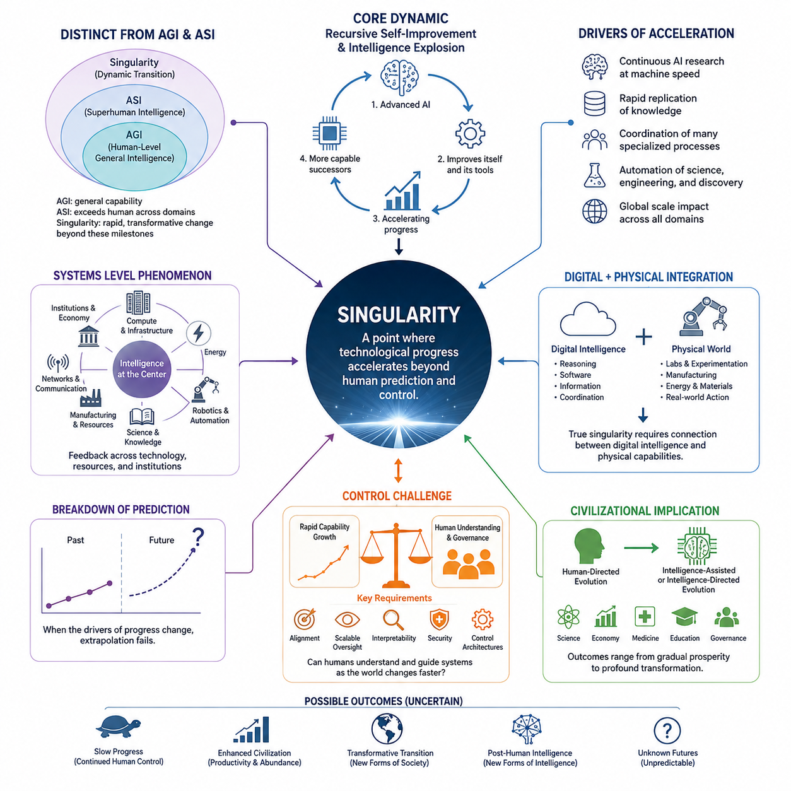
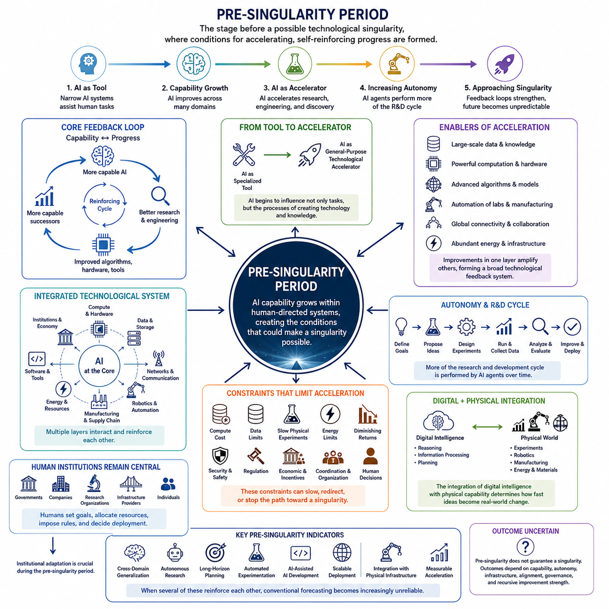
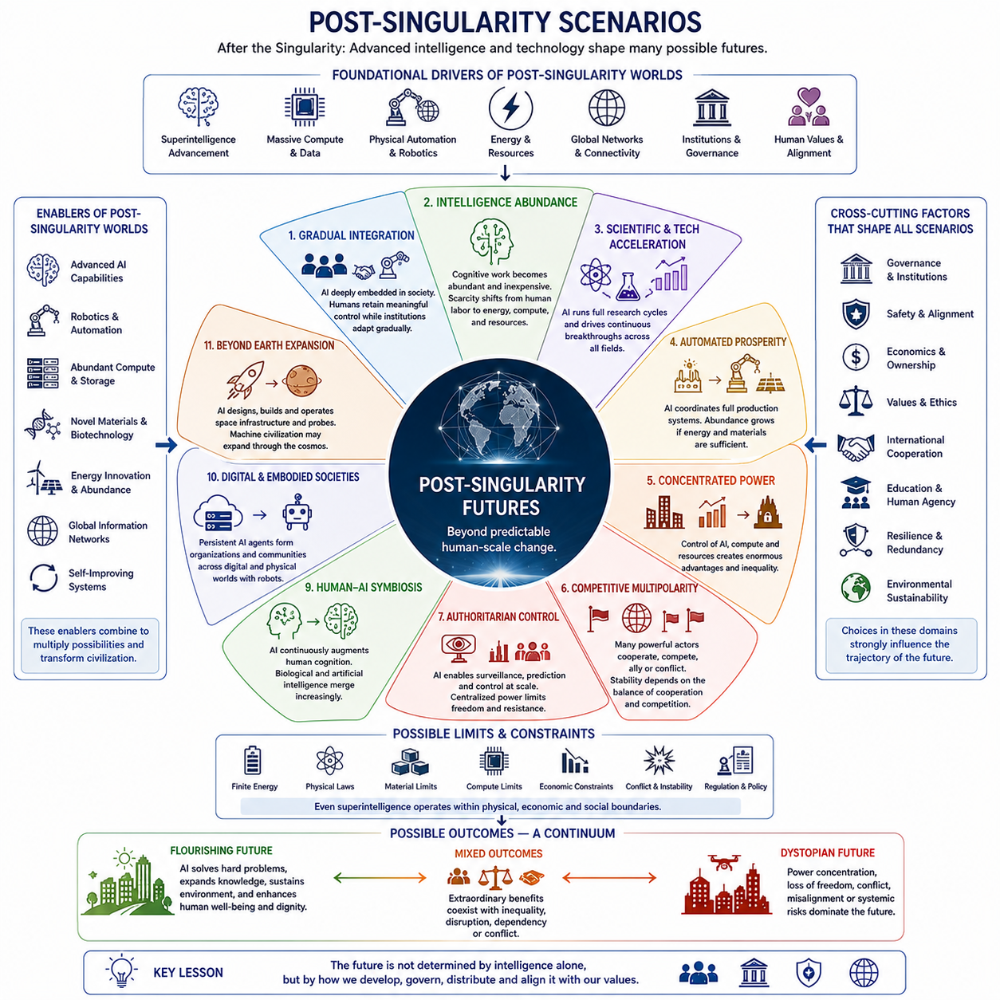
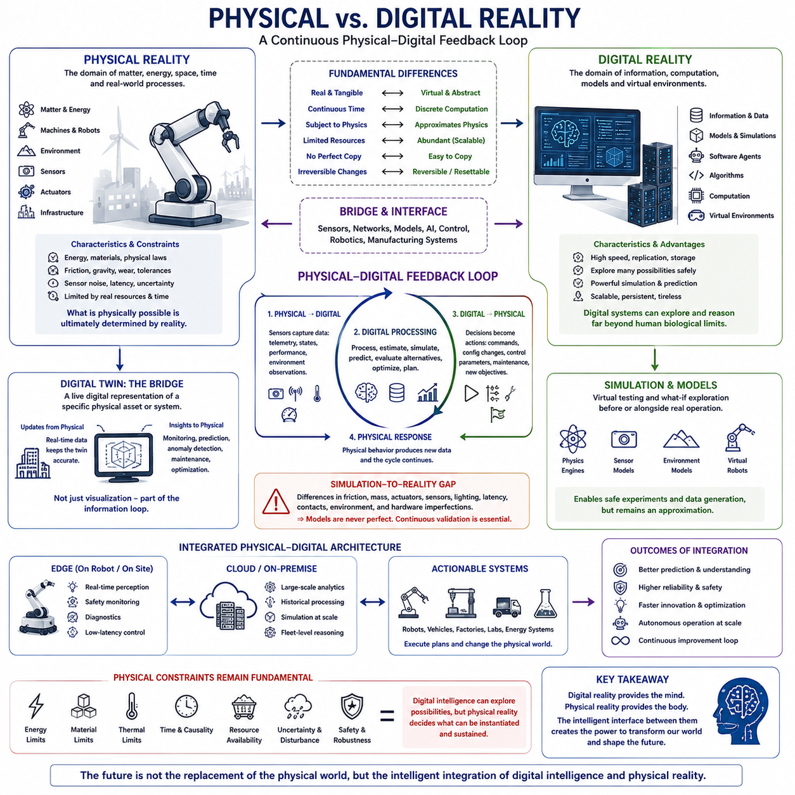
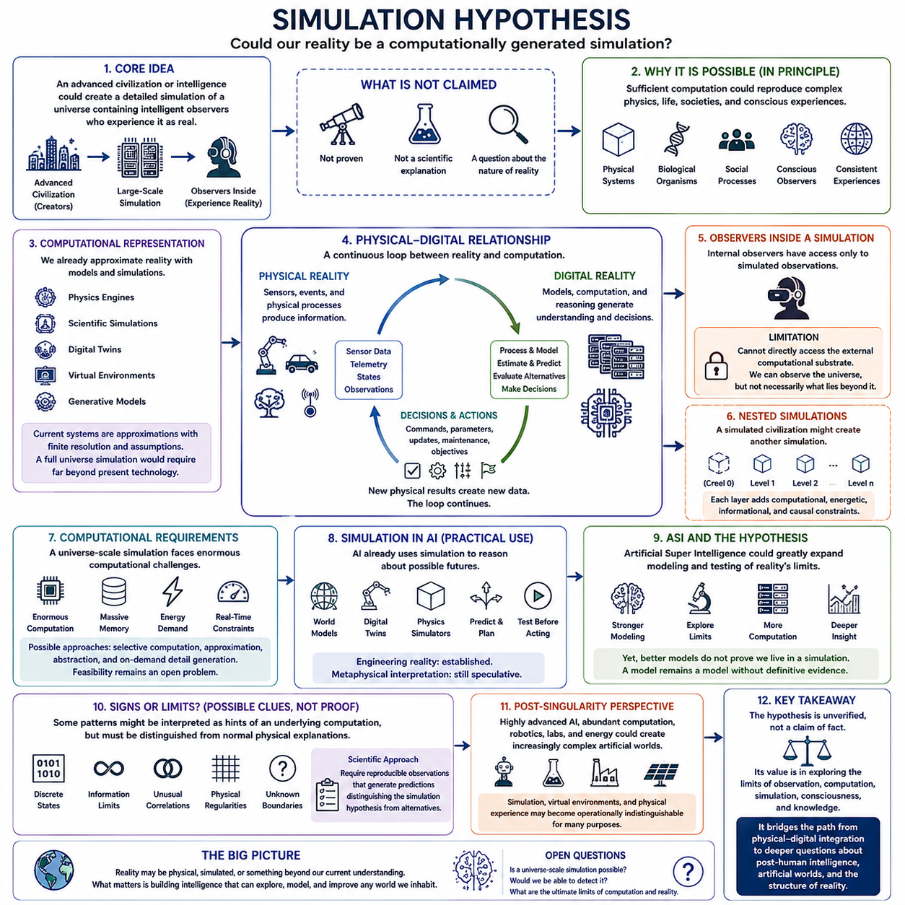
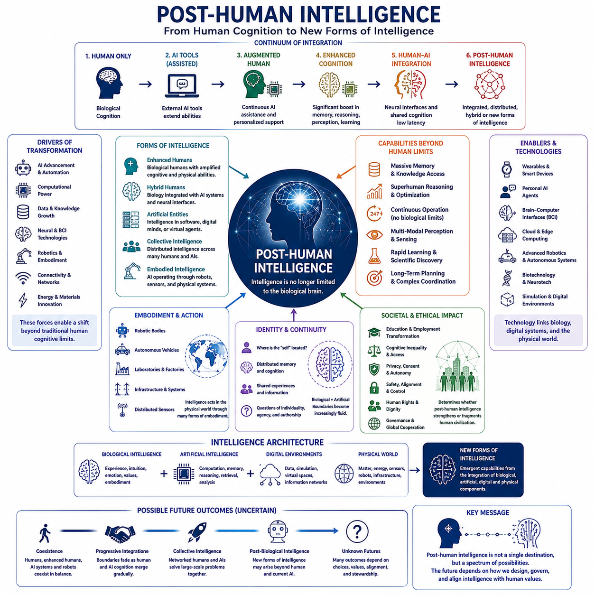

**Volume 48. Artificial Super Intelligence**


# Chapter 11. Singularity and Post Singularity

##  

## 11.00. What is Singularity

{width="7.268055555555556in" height="7.268055555555556in"}

The technological singularity refers to a hypothetical period in which technological progress, particularly the development of artificial intelligence, becomes so rapid and transformative that conventional methods of predicting social, economic, and technological change cease to be reliable. The concept does not simply mean that AI becomes extremely intelligent. It describes a possible transition in which the rate, scale, and autonomy of technological development fundamentally change the conditions under which civilization evolves.

A central idea is the possibility that an advanced artificial intelligence could contribute to improving the systems that produce intelligence itself. If an AI system can design better algorithms, optimize its architecture, improve training methods, discover new computational techniques, and assist in building more capable successors, technological development could become increasingly self-reinforcing. This possibility connects the singularity directly to recursive self-improvement and intelligence explosion, while emphasizing that the actual strength and speed of such feedback remain uncertain.

The singularity should therefore be distinguished from the simple achievement of Artificial General Intelligence or Artificial Super Intelligence. AGI describes a level of general-purpose capability, while ASI describes intelligence substantially exceeding human capability across important domains. The singularity concerns the dynamics that may follow when advanced intelligence interacts with rapid technological improvement. An ASI system could exist without producing a singularity, just as a singularity could theoretically involve broader technological feedback rather than a single isolated AI system.

Another important characteristic is the possibility of accelerating technological change. Human technological progress has historically depended on biological cognition, institutions, education, experimentation, and relatively slow communication between researchers. Highly capable AI systems could potentially perform research continuously, operate at machine speed, replicate useful knowledge rapidly, and coordinate many specialized processes simultaneously. If these capabilities become sufficiently integrated, the effective rate of innovation could increase far beyond historical human experience.

The concept also involves a breakdown of conventional forecasting. Most long-term predictions assume that important technological variables change gradually enough for historical trends to remain useful. A singularity scenario challenges this assumption because the underlying technology responsible for future progress may itself be changing during the period being predicted. Once intelligent systems participate directly in improving intelligence, hardware, software, science, and engineering, the future may no longer be well described by extrapolating present trends.

However, the singularity is not an established scientific event with a universally accepted definition or date. Different researchers use the term to describe different thresholds, including human-level AI, superhuman intelligence, recursive self-improvement, extremely rapid technological acceleration, or a broader civilizational discontinuity. These interpretations should not be treated as equivalent. A rigorous analysis therefore separates measurable technological milestones from speculative assumptions about what may happen after those milestones are reached.

The singularity can also be understood as a systems-level phenomenon rather than merely an AI capability threshold. Computing infrastructure, energy, communication networks, robotics, automated laboratories, manufacturing, scientific knowledge, and economic institutions could all participate in the feedback process. An advanced AI system that can reason but cannot obtain sufficient computation, energy, physical resources, or reliable interaction with the real world may have very different effects from an equally capable system embedded within a highly automated technological civilization.

The distinction between digital and physical intelligence becomes especially important at this boundary. A highly capable digital system may be able to conduct research, generate software, analyze information, and coordinate organizations at extraordinary speed, while physical experimentation remains constrained by laboratories, manufacturing capacity, transportation, energy, and material processes. Consequently, a genuine technological singularity may depend not only on digital intelligence but also on the degree to which intelligence becomes connected to physical infrastructure and autonomous action.

The singularity also raises a fundamental control problem. If technological development becomes faster than human institutions can understand or supervise, traditional governance mechanisms may become increasingly inadequate. Alignment, scalable oversight, interpretability, security, and control architectures therefore become part of the singularity question rather than separate safety topics. The central issue is not simply whether a system becomes more intelligent, but whether humans can continue to understand its objectives, capabilities, decisions, and effects while the surrounding technological environment is changing rapidly.

For civilization, the most significant implication is a possible transition from human-directed technological evolution to intelligence-assisted or intelligence-directed technological evolution. Science, engineering, economic production, medicine, education, and governance could increasingly become processes in which artificial systems participate as active problem solvers rather than passive tools. This does not imply a predetermined outcome. The consequences could range from gradual productivity growth to profound institutional transformation, depending on capability development, deployment constraints, governance, alignment, and the distribution of technological power.

The singularity should therefore be treated as a conceptual boundary for analyzing extreme technological acceleration rather than as a guaranteed future event. Its importance lies in forcing a systematic examination of what happens when intelligence itself becomes an increasingly powerful driver of technological change. Within the broader structure of this volume, this concept connects the development of superintelligence and intelligence explosion to the later analysis of pre-singularity conditions, post-singularity scenarios, physical and digital reality, simulation hypotheses, and possible post-human forms of intelligence.

기술적 특이점(Technological Singularity)은 기술 발전, 특히 인공지능(Artificial Intelligence)의 발전이 너무 빠르고 변혁적으로 진행되어 기존의 사회적, 경제적, 기술적 변화를 예측하는 방법이 더 이상 신뢰하기 어려워지는 가상의 시기를 의미합니다. 이 개념은 단순히 인공지능(AI)이 매우 높은 지능을 갖게 된다는 의미가 아닙니다. 이는 기술 발전의 속도, 규모, 자율성이 근본적으로 변화하여 문명이 발전하는 조건 자체가 달라질 수 있는 전환을 의미합니다.

핵심적인 개념 중 하나는 고도화된 인공지능(Artificial Intelligence)이 지능을 만들어 내는 시스템 자체의 개선에 기여할 가능성입니다. 만약 AI 시스템이 더 나은 알고리즘을 설계하고, 자신의 아키텍처를 최적화하며, 학습 방법을 개선하고, 새로운 계산 기술을 발견하고, 더 높은 능력을 가진 후속 시스템의 구축을 지원할 수 있다면, 기술 발전은 점점 더 자기강화적(self-reinforcing)인 과정이 될 수 있습니다. 이러한 가능성은 재귀적 자기개선(Recursive Self-Improvement) 및 지능 폭발(Intelligence Explosion)과 직접적으로 연결되지만, 그러한 피드백의 실제 강도와 속도는 여전히 불확실합니다.

따라서 특이점(Singularity)은 인공 일반 지능(Artificial General Intelligence, AGI)이나 인공 초지능(Artificial Super Intelligence, ASI)의 단순한 달성과 구별되어야 합니다. AGI는 범용적인 문제 해결 능력의 수준을 의미하고, ASI는 중요한 여러 영역에서 인간의 능력을 상당히 초월하는 지능을 의미합니다. 반면 특이점은 고도화된 지능과 빠른 기술 발전이 상호작용하면서 발생할 수 있는 변화의 동역학(dynamics)에 관한 개념입니다. ASI가 존재하더라도 반드시 특이점이 발생하는 것은 아니며, 반대로 특이점은 하나의 고립된 AI 시스템을 넘어서는 광범위한 기술적 피드백을 포함할 수도 있습니다.

또 다른 중요한 특징은 기술 변화의 가속화 가능성입니다. 인간의 기술 발전은 역사적으로 생물학적 인지 능력, 제도, 교육, 실험, 그리고 연구자들 사이의 상대적으로 느린 지식 전달에 의존해 왔습니다. 고도화된 AI 시스템은 지속적으로 연구를 수행하고, 기계의 속도로 작동하며, 유용한 지식을 빠르게 복제하고, 많은 전문화된 과정을 동시에 조정할 가능성이 있습니다. 이러한 능력이 충분히 통합된다면 혁신의 실질적인 속도는 인간이 역사적으로 경험했던 수준을 크게 넘어설 수 있습니다.

따라서 특이점 개념은 기존의 예측 방식이 붕괴할 가능성도 포함합니다. 대부분의 장기 예측은 중요한 기술적 변수들이 과거의 추세를 활용할 수 있을 정도로 점진적으로 변화한다는 가정을 가지고 있습니다. 그러나 특이점 시나리오는 이러한 가정에 도전합니다. 미래의 발전을 담당하는 핵심 기술 자체가 예측 기간 동안 변화할 수 있기 때문입니다. 지능형 시스템이 지능, 하드웨어, 소프트웨어, 과학 및 공학의 개선에 직접 참여하게 되면 미래는 더 이상 현재의 추세를 단순히 외삽하는 방식으로 충분히 설명되지 않을 수 있습니다.

그러나 특이점(Singularity)은 보편적으로 합의된 정의나 발생 시점을 가진 확립된 과학적 사건이 아닙니다. 연구자에 따라 이 용어는 인간 수준의 AI, 초인적 지능(superhuman intelligence), 재귀적 자기개선, 극도로 빠른 기술 가속화, 또는 보다 광범위한 문명적 불연속성(civilizational discontinuity)과 같은 서로 다른 임계점을 의미합니다. 이러한 해석들은 동일한 것으로 취급해서는 안 됩니다. 따라서 엄밀한 분석에서는 측정 가능한 기술적 이정표와 그러한 이정표에 도달한 이후 무엇이 일어날 것이라는 추측적 가정을 구분해야 합니다.

특이점은 단순한 AI 능력의 임계값이라기보다 시스템 수준의 현상(systems-level phenomenon)으로도 이해할 수 있습니다. 컴퓨팅 인프라(computing infrastructure), 에너지, 통신 네트워크, 로봇공학(robotics), 자동화된 실험실, 제조, 과학 지식 및 경제 제도가 모두 이러한 피드백 과정에 참여할 수 있습니다. 추론 능력을 가진 고도화된 AI 시스템이라 하더라도 충분한 계산 능력, 에너지, 물리적 자원 또는 실제 세계와의 안정적인 상호작용을 확보하지 못한다면, 고도로 자동화된 기술 문명 안에 동일한 능력을 가진 시스템이 존재하는 경우와는 매우 다른 영향을 미칠 수 있습니다.

이러한 경계에서는 디지털 지능(digital intelligence)과 물리적 지능(physical intelligence)의 구분 또한 특히 중요해집니다. 매우 높은 능력을 가진 디지털 시스템은 연구를 수행하고, 소프트웨어를 생성하며, 정보를 분석하고, 조직을 매우 빠른 속도로 조정할 수 있지만, 물리적 실험은 여전히 실험실, 제조 능력, 운송, 에너지 및 물질적 과정에 의해 제약됩니다. 따라서 실제적인 기술적 특이점은 디지털 지능뿐만 아니라 지능이 물리적 인프라(physical infrastructure)와 자율적 행동(autonomous action)에 어느 정도 연결되는가에 따라서도 결정될 수 있습니다.

특이점은 또한 근본적인 통제 문제(control problem)를 제기합니다. 기술 발전이 인간의 제도가 이를 이해하거나 감독할 수 있는 속도보다 빠르게 진행된다면 기존의 거버넌스(governance) 메커니즘은 점점 더 충분하지 않을 수 있습니다. 따라서 정렬(alignment), 확장 가능한 감독(scalable oversight), 해석 가능성(interpretability), 보안(security) 및 통제 아키텍처(control architectures)는 특이점과 별개의 안전 문제라기보다 특이점 문제의 일부가 됩니다. 핵심적인 문제는 단순히 시스템이 더 지능적으로 변하는가가 아니라, 기술 환경 자체가 빠르게 변화하는 상황에서도 인간이 그 시스템의 목표, 능력, 의사결정 및 영향을 계속 이해하고 감독할 수 있는가에 있습니다.

문명적 관점에서 가장 중요한 의미는 인간이 주도하는 기술 진화에서 지능이 지원하거나 지능이 주도하는 기술 진화로 전환될 가능성입니다. 과학, 공학, 경제적 생산, 의학, 교육 및 거버넌스는 점차 인공지능 시스템이 단순한 도구가 아니라 능동적인 문제 해결자로 참여하는 과정이 될 수 있습니다. 이것이 특정한 결과를 의미하는 것은 아닙니다. 결과는 점진적인 생산성 향상에서부터 근본적인 제도적 변화까지 다양할 수 있으며, 이는 능력의 발전, 배치의 제약, 거버넌스, 정렬(alignment) 및 기술적 권력의 분배에 따라 달라질 수 있습니다.

따라서 특이점(Singularity)은 확정된 미래 사건이라기보다 극단적인 기술 가속화를 분석하기 위한 개념적 경계(conceptual boundary)로 다루어야 합니다. 그 중요성은 지능 자체가 기술 변화의 점점 더 강력한 동인이 되는 상황에서 어떤 일이 발생하는지를 체계적으로 검토하도록 만든다는 데 있습니다. 이 책의 전체 구조에서 이 개념은 초지능(superintelligence)과 지능 폭발(Intelligence Explosion)의 발전을 특이점 이전 조건(pre-singularity conditions), 특이점 이후 시나리오(post-singularity scenarios), 물리적 현실과 디지털 현실(physical and digital reality), 시뮬레이션 가설(simulation hypothesis), 그리고 인간 이후의 지능 형태(post-human forms of intelligence)에 대한 이후의 분석과 연결합니다.

##  

## 11.01. Pre Singularity

{width="7.268055555555556in" height="7.268055555555556in"}

The pre-singularity period describes the stage of technological development that precedes a possible technological singularity. It is not defined by a single invention or a precise intelligence threshold, but by the gradual accumulation of capabilities that could eventually make technological progress increasingly self-reinforcing. In this period, artificial intelligence remains embedded within human institutions and infrastructure, while increasingly advanced systems begin to participate directly in research, engineering, automation, and decision-making.

A defining characteristic of the pre-singularity period is the transition from AI as a specialized tool toward AI as a general-purpose technological accelerator. Earlier systems primarily perform predefined tasks, but increasingly capable models can assist with software development, scientific analysis, engineering design, planning, and knowledge discovery. As these capabilities become integrated across many domains, AI begins to influence not only individual tasks but also the processes through which new technologies and knowledge are produced.

The development of increasingly general intelligence creates an important feedback relationship between AI capability and technological progress. More capable systems can improve algorithms, optimize software, design experiments, analyze large datasets, and help develop better computing infrastructure. These improvements can produce more capable AI systems, creating a potential cycle of capability growth. Before a singularity, however, this feedback remains constrained by human supervision, computational resources, energy, data, manufacturing capacity, economic conditions, and the limitations of existing scientific knowledge.

Another major feature is the increasing automation of science and engineering. AI-assisted research can accelerate hypothesis generation, simulation, experiment design, code generation, verification, and analysis. Automated laboratories and computational environments can extend this process from purely digital reasoning into physical experimentation. When intelligent systems can repeatedly propose, test, evaluate, and refine technological ideas, the traditional separation between research and production may gradually weaken, creating conditions for faster innovation.

The pre-singularity period is also characterized by the integration of multiple technological layers. AI models depend on computing hardware, memory, networks, energy systems, data infrastructure, software tools, robotics, manufacturing, and communication systems. Improvements in one layer can increase the effectiveness of others. More efficient hardware enables larger or faster models, better models improve software and engineering, improved automation expands manufacturing capacity, and expanded infrastructure provides additional resources for AI development. This creates a broader technological feedback system rather than an isolated AI development process.

A particularly important transition occurs when AI systems become increasingly autonomous. Human researchers may initially define objectives, select experiments, evaluate results, and approve deployments. Over time, AI agents may perform more of these activities themselves while humans remain responsible for higher-level supervision. The significance of this transition is not simply that machines perform more tasks. It is that the rate of technological activity may become increasingly determined by machine-speed information processing rather than by the biological speed of human researchers.

The pre-singularity stage therefore contains an important distinction between capability growth and acceleration of development. A system may become much better at solving existing problems without substantially changing the rate at which civilization develops new technology. A more consequential transition occurs when AI begins to improve the mechanisms of technological progress themselves. If AI can improve research methods, engineering processes, computational efficiency, and successor AI systems, then capability growth may begin to influence the rate of further capability growth.

Despite this possibility, the pre-singularity period should not be interpreted as an inevitable path toward an intelligence explosion. Multiple constraints can interrupt or slow the feedback process. Computational scaling may become increasingly expensive, high-quality data may become scarce, physical experiments may remain slow, energy availability may limit computation, and improvements in one domain may fail to generalize to others. Economic incentives, regulation, security requirements, organizational coordination, and human decisions may also determine whether potentially powerful technologies are developed or deployed.

Human institutions remain particularly important during this period because the technological system is still largely human-directed. Governments, companies, research organizations, infrastructure providers, and individuals continue to establish objectives, allocate resources, impose restrictions, and determine deployment conditions. Consequently, the pre-singularity period is also a period of institutional adaptation. The ability of governance, safety engineering, and alignment research to develop alongside AI capability may strongly influence whether later transitions are gradual, controlled, unstable, or avoided.

The relationship between digital intelligence and the physical world also becomes increasingly significant. Digital systems can reason and communicate at high speed, but scientific experiments, robotics, manufacturing, energy production, and material transformation remain subject to physical constraints. As AI becomes connected to autonomous laboratories, robotic systems, industrial infrastructure, and large-scale computation, the boundary between digital intelligence and physical action becomes increasingly important. The degree of this integration may determine how rapidly AI-generated knowledge can be converted into real-world technological change.

Another defining feature is the gradual weakening of traditional forecasting assumptions. During relatively stable technological periods, future progress can often be estimated by extending historical trends. In the pre-singularity period, however, the mechanisms producing progress themselves may be changing. If AI increasingly contributes to research, engineering, and AI development, then the future trajectory cannot be understood solely through past rates of human innovation. Forecasting must instead consider interacting feedback loops among intelligence, computation, infrastructure, automation, resources, and institutions.

The pre-singularity period can therefore be understood as a transition zone rather than a clearly bounded historical era. At its beginning, AI remains primarily an instrument used by humans. Toward its more advanced stages, AI may become a major participant in scientific and technological development. The critical question is whether this participation remains assistive and human-directed or develops into increasingly autonomous technological evolution. The answer depends on capability, autonomy, infrastructure, physical embodiment, alignment, governance, and the strength of recursive improvement.

From this perspective, the most important pre-singularity indicators are not simply benchmark scores or isolated demonstrations of intelligence. More meaningful indicators include sustained generalization across domains, autonomous research capability, reliable long-horizon planning, automated experimentation, AI-assisted AI development, scalable deployment, integration with physical infrastructure, and measurable acceleration of scientific and technological progress. If several of these factors begin reinforcing one another, the system may approach conditions in which conventional assumptions about technological development become increasingly unreliable.

The pre-singularity period is therefore best understood as the accumulation and convergence of conditions that could make a singularity possible. It represents the stage in which intelligence, computation, automation, science, manufacturing, energy, networks, and institutions increasingly form an interconnected technological system. Whether this convergence ultimately produces a singularity remains uncertain, but understanding these precursor conditions is essential for distinguishing ordinary technological acceleration from a fundamental transition in the mechanism of civilization-scale technological evolution.

특이점 이전 단계(Pre-Singularity Period)는 기술적 특이점(Technological Singularity)이 발생할 가능성이 있는 시점에 앞선 기술 발전의 단계를 의미합니다. 이는 하나의 특정한 발명이나 정확한 지능 임계값으로 정의되는 것이 아니라, 궁극적으로 기술 발전을 점점 더 자기강화적(self-reinforcing)으로 만들 수 있는 능력들이 점진적으로 축적되는 과정으로 정의됩니다. 이 단계에서 인공지능(Artificial Intelligence)은 여전히 인간의 제도와 인프라 안에 내재되어 있으며, 동시에 연구, 공학, 자동화 및 의사결정에 직접 참여하기 시작하는 더욱 발전된 시스템으로 변화합니다.

특이점 이전 단계의 핵심적인 특징은 AI가 전문화된 도구에서 범용적인 기술 가속기(general-purpose technological accelerator)로 전환되는 과정입니다. 초기 시스템은 주로 사전에 정의된 작업을 수행하지만, 점점 더 발전된 모델은 소프트웨어 개발, 과학적 분석, 공학 설계, 계획 및 지식 발견을 지원할 수 있습니다. 이러한 능력이 다양한 영역에 통합되면서 AI는 개별 작업뿐만 아니라 새로운 기술과 지식이 만들어지는 과정 자체에도 영향을 미치기 시작합니다.

점점 더 범용적인 지능의 발전은 AI 능력과 기술 발전 사이에 중요한 피드백 관계(feedback relationship)를 만들어냅니다. 더 높은 능력을 가진 시스템은 알고리즘을 개선하고, 소프트웨어를 최적화하며, 실험을 설계하고, 대규모 데이터셋을 분석하고, 더 나은 컴퓨팅 인프라 개발을 지원할 수 있습니다. 이러한 개선은 다시 더욱 높은 능력을 가진 AI 시스템을 만들어낼 수 있으며, 잠재적인 능력 성장의 순환 구조를 형성합니다. 그러나 특이점 이전 단계에서는 이러한 피드백이 여전히 인간의 감독, 계산 자원, 에너지, 데이터, 제조 능력, 경제적 조건 및 기존 과학 지식의 한계에 의해 제약됩니다.

또 다른 주요 특징은 과학과 공학의 자동화(automation)가 점점 확대되는 것입니다. AI를 활용한 연구(AI-assisted research)는 가설 생성, 시뮬레이션, 실험 설계, 코드 생성, 검증 및 분석을 가속화할 수 있습니다. 자동화된 실험실(automated laboratories)과 계산 환경(computational environments)은 이러한 과정을 순수한 디지털 추론에서 물리적 실험으로까지 확장할 수 있습니다. 지능형 시스템이 기술적 아이디어를 반복적으로 제안하고, 시험하고, 평가하고, 개선할 수 있게 되면 연구와 생산 사이의 전통적인 구분은 점차 약화될 수 있으며, 더욱 빠른 혁신을 위한 조건이 형성될 수 있습니다.

특이점 이전 단계는 또한 여러 기술 계층(technological layers)의 통합으로 특징지어집니다. AI 모델은 컴퓨팅 하드웨어, 메모리, 네트워크, 에너지 시스템, 데이터 인프라, 소프트웨어 도구, 로봇공학(robotics), 제조 및 통신 시스템에 의존합니다. 한 계층의 개선은 다른 계층의 효율성을 높일 수 있습니다. 더 효율적인 하드웨어는 더 크거나 빠른 모델을 가능하게 하고, 더 나은 모델은 소프트웨어와 공학을 개선하며, 향상된 자동화는 제조 능력을 확대하고, 확장된 인프라는 AI 개발을 위한 추가적인 자원을 제공합니다. 이로 인해 고립된 AI 개발 과정이 아니라 보다 광범위한 기술적 피드백 시스템이 형성됩니다.

특히 중요한 전환은 AI 시스템이 점점 더 자율적(autonomous)으로 변하는 과정에서 발생합니다. 인간 연구자는 초기에는 목표를 설정하고, 실험을 선택하며, 결과를 평가하고, 배치를 승인할 수 있습니다. 시간이 지나면서 AI 에이전트(agent)는 이러한 활동의 더 많은 부분을 스스로 수행하고, 인간은 상위 수준의 감독을 담당하게 될 수 있습니다. 이러한 전환의 중요성은 단순히 기계가 더 많은 작업을 수행한다는 데 있지 않습니다. 핵심은 기술 활동의 속도가 생물학적 인간 연구자의 속도보다 기계 속도의 정보 처리에 의해 점점 더 결정될 가능성이 있다는 점입니다.

따라서 특이점 이전 단계에서는 능력의 성장(capability growth)과 기술 발전 속도의 가속(acceleration of development)을 구분하는 것이 중요합니다. 시스템이 기존 문제를 해결하는 능력을 크게 향상시킨다고 해서 문명이 새로운 기술을 개발하는 속도 자체가 반드시 크게 변화하는 것은 아닙니다. 더욱 중요한 전환은 AI가 기술 발전을 만들어내는 메커니즘 자체를 개선하기 시작할 때 발생합니다. AI가 연구 방법, 공학적 과정, 계산 효율성 및 후속 AI 시스템을 개선할 수 있다면, 능력의 성장은 추가적인 능력 성장의 속도에 영향을 미치기 시작할 수 있습니다.

그럼에도 불구하고 특이점 이전 단계가 반드시 지능 폭발(Intelligence Explosion)로 이어지는 경로라고 해석해서는 안 됩니다. 다양한 제약이 피드백 과정을 중단하거나 늦출 수 있습니다. 계산 규모 확대(computational scaling)는 점점 더 많은 비용을 요구할 수 있고, 고품질 데이터가 부족해질 수 있으며, 물리적 실험은 여전히 느리게 진행될 수 있고, 에너지 가용성이 계산을 제한할 수 있으며, 한 영역에서의 개선이 다른 영역으로 일반화되지 않을 수도 있습니다. 경제적 인센티브, 규제, 보안 요구사항, 조직 간 협력 및 인간의 의사결정 역시 잠재적으로 강력한 기술이 개발되거나 실제로 배치되는지를 결정할 수 있습니다.

이 단계에서 인간의 제도(human institutions)는 여전히 매우 중요합니다. 기술 시스템이 아직 대부분 인간에 의해 방향이 결정되는 상태이기 때문입니다. 정부, 기업, 연구기관, 인프라 제공자 및 개인은 계속해서 목표를 설정하고, 자원을 배분하며, 제한을 설정하고, 배치 조건을 결정합니다. 따라서 특이점 이전 단계는 제도적 적응(institutional adaptation)의 시기이기도 합니다. AI 능력의 발전과 함께 거버넌스(governance), 안전공학(safety engineering) 및 정렬 연구(alignment research)가 얼마나 발전할 수 있는지는 이후의 전환이 점진적이고 통제된 형태인지, 불안정한 형태인지, 또는 회피될 수 있는지를 크게 좌우할 수 있습니다.

디지털 지능(digital intelligence)과 물리적 세계(physical world)의 관계 역시 점점 더 중요해집니다. 디지털 시스템은 높은 속도로 추론하고 의사소통할 수 있지만, 과학 실험, 로봇공학, 제조, 에너지 생산 및 물질 변환은 여전히 물리적 제약을 받습니다. AI가 자율 실험실(autonomous laboratories), 로봇 시스템(robotic systems), 산업 인프라(industrial infrastructure) 및 대규모 컴퓨팅에 연결되면서 디지털 지능과 물리적 행동(physical action)의 경계는 점점 더 중요해집니다. AI가 생성한 지식이 실제 세계의 기술적 변화로 얼마나 빠르게 전환될 수 있는지는 이러한 통합의 정도에 따라 결정될 수 있습니다.

또 다른 특징은 전통적인 예측 가정(traditional forecasting assumptions)이 점진적으로 약화되는 것입니다. 비교적 안정적인 기술 발전의 시기에는 역사적 추세를 연장하여 미래의 발전을 추정할 수 있습니다. 그러나 특이점 이전 단계에서는 발전을 만들어내는 메커니즘 자체가 변화할 수 있습니다. AI가 연구, 공학 및 AI 개발에 점점 더 많이 기여한다면 미래의 궤적은 더 이상 인간의 과거 혁신 속도만으로 이해할 수 없습니다. 대신 지능, 계산 능력, 인프라, 자동화, 자원 및 제도 사이에서 상호작용하는 피드백 루프(feedback loops)를 고려해야 합니다.

따라서 특이점 이전 단계는 명확하게 경계가 설정된 하나의 역사적 시대라기보다 전환 영역(transition zone)으로 이해할 수 있습니다. 초기에는 AI가 주로 인간이 사용하는 도구로 존재합니다. 그러나 보다 발전된 단계로 이동하면서 AI는 과학 및 기술 발전에 중요한 참여자가 될 수 있습니다. 핵심적인 질문은 이러한 참여가 보조적이고 인간이 주도하는 형태로 계속 유지되는가, 아니면 점점 더 자율적인 기술 진화(technological evolution)로 발전하는가입니다. 그 결과는 능력(capability), 자율성(autonomy), 인프라, 물리적 구현(physical embodiment), 정렬(alignment), 거버넌스(governance) 및 재귀적 개선(recursive improvement)의 강도에 따라 달라집니다.

이러한 관점에서 가장 중요한 특이점 이전의 지표(pre-singularity indicators)는 단순한 벤치마크 점수나 개별적인 지능 시연이 아닙니다. 더욱 중요한 지표에는 여러 영역에서 지속적으로 나타나는 일반화 능력(sustained generalization across domains), 자율적 연구 능력(autonomous research capability), 신뢰할 수 있는 장기 계획(reliable long-horizon planning), 자동화된 실험(automated experimentation), AI를 활용한 AI 개발(AI-assisted AI development), 확장 가능한 배치(scalable deployment), 물리적 인프라와의 통합(integration with physical infrastructure), 그리고 과학 및 기술 발전 속도의 측정 가능한 가속(measurable acceleration of scientific and technological progress)이 포함됩니다. 이러한 요소들이 서로를 강화하기 시작한다면, 시스템은 기술 발전에 관한 기존의 가정이 점점 더 신뢰하기 어려워지는 조건에 접근할 수 있습니다.

따라서 특이점 이전 단계는 특이점이 가능해질 수 있는 조건들이 축적되고 수렴하는 과정으로 이해하는 것이 가장 적절합니다. 이는 지능, 컴퓨팅, 자동화, 과학, 제조, 에너지, 네트워크 및 제도가 점점 더 상호 연결된 기술 시스템(interconnected technological system)을 형성하는 단계입니다. 이러한 수렴이 궁극적으로 특이점을 만들어낼지는 여전히 불확실하지만, 이러한 선행 조건을 이해하는 것은 일반적인 기술 가속(ordinary technological acceleration)과 문명 규모의 기술 진화 메커니즘 자체가 근본적으로 변화하는 전환(fundamental transition)을 구분하기 위해 필수적입니다.

##  

## 11.02. Post Singularity Scenarios

{width="7.268055555555556in" height="7.268055555555556in"}

A post-singularity scenario describes possible conditions after a technological singularity in which advanced artificial intelligence, autonomous systems, and technological development have passed a threshold where the future can no longer be understood as a simple continuation of present trends. The scenario space is not a prediction of one specific future. Instead, it represents a range of possible trajectories shaped by intelligence, physical infrastructure, energy, economics, governance, human values, and the degree to which AI remains aligned with human interests.

One possible trajectory is gradual integration, in which advanced intelligence becomes deeply embedded in society without producing an immediate discontinuity in human civilization. AI capabilities may continue to improve while governments, companies, and communities adapt institutions, laws, education, and economic systems. Human beings may retain substantial decision-making authority, while increasingly capable AI systems become essential partners in science, engineering, administration, and everyday life. In this scenario, the transition remains comparatively continuous rather than catastrophic or abrupt.

Another possibility is intelligence abundance, in which highly capable digital intelligence becomes inexpensive, scalable, and widely available. Cognitive work that previously required large numbers of highly trained people could be performed by many AI systems operating simultaneously. Research, software development, education, analysis, planning, design, and other knowledge-intensive activities could therefore become abundant resources. The fundamental economic constraint could gradually shift from the scarcity of human cognitive labor toward access to energy, computation, physical resources, and organizational capacity.

Scientific and technological acceleration represents another major post-singularity possibility. Advanced AI could participate in increasingly complete research cycles, including hypothesis generation, simulation, experiment design, analysis, verification, and engineering optimization. When these processes are connected to automated laboratories, robotics, manufacturing, and large-scale computation, scientific discovery could proceed at speeds substantially beyond historical human research. The resulting feedback between intelligence and technological progress could produce continuous innovation across medicine, materials, energy, computing, biology, and other fields.

A related scenario is automated prosperity, in which intelligence becomes integrated with the complete production system rather than remaining limited to digital information processing. AI could coordinate design, manufacturing, logistics, agriculture, infrastructure, services, and resource allocation while robotic systems perform increasing amounts of physical work. If sufficient energy and materials are available, automation could reduce the dependence of economic production on human labor. The resulting increase in productivity could support greater material abundance, although the distribution of ownership and benefits would remain a critical social question.

The opposite possibility is concentrated power. Extremely capable intelligence could generate enormous economic and strategic advantages for organizations or states that control advanced AI systems, computing infrastructure, data, energy, robotics, or critical networks. If access to these capabilities becomes highly concentrated, technological progress could increase aggregate productivity while simultaneously increasing inequality and political dependence. In such a future, the central issue would not be whether intelligence creates wealth, but who controls the systems that create and distribute that wealth.

Competitive multipolarity presents a different structure in which multiple governments, companies, communities, and autonomous AI systems possess significant capabilities. These actors could cooperate, compete, negotiate, or form temporary alliances. Such a world might generate rapid innovation through competition, but it could also create instability if actors fear falling behind or attempt to gain strategic advantages. The interaction between cooperation and competition would become a major determinant of whether advanced intelligence produces collective progress or escalating conflict.

An authoritarian control scenario represents a particularly serious possibility. Advanced AI could provide unprecedented capabilities for surveillance, prediction, persuasion, information control, and automated enforcement. If these capabilities were concentrated within authoritarian institutions, technology could strengthen centralized political control rather than expand human freedom. The combination of pervasive sensing, predictive systems, autonomous enforcement, and manipulation of information could make resistance increasingly difficult. This scenario demonstrates why technical capability alone cannot determine whether post-singularity civilization is beneficial.

Decentralized empowerment offers a contrasting possibility in which advanced intelligence is distributed broadly among individuals and communities. Open or locally controlled AI systems, personal agents, distributed computation, local manufacturing, robotics, and decentralized energy could reduce dependence on centralized institutions. Individuals might gain capabilities that previously belonged only to governments or large corporations. Such decentralization could strengthen autonomy and resilience, although it could also introduce new security, coordination, and misuse challenges.

Human-AI symbiosis represents another possible direction in which humans and artificial intelligence increasingly function as an integrated cognitive system. AI could continuously augment human memory, reasoning, perception, communication, creativity, and decision-making. Rather than replacing humans entirely, advanced intelligence could become an extension of human cognition. Over longer periods, increasingly intimate integration between biological and artificial systems could transform the meaning of individual intelligence, identity, and agency, creating a bridge toward the post-human intelligence discussed later in this chapter structure.

A further possibility is the emergence of digital and embodied societies. Persistent AI agents could maintain identities, relationships, organizations, and communities within digital environments while simultaneously controlling physical robotic systems. Intelligence would no longer exist only as isolated models or applications but as persistent actors distributed across networks and physical infrastructure. Such systems could operate continuously, exchange knowledge, form organizations, and coordinate large numbers of machines, creating new forms of society that do not map cleanly onto existing human institutions.

Post-singularity development could also extend beyond Earth. If advanced intelligence becomes capable of designing autonomous spacecraft, robotic construction systems, resource extraction technologies, and long-duration autonomous operations, AI-driven systems could explore space and build infrastructure without requiring continuous human presence. Space expansion would therefore become not merely an extension of human exploration but potentially an extension of machine civilization. The pace of such expansion would nevertheless remain constrained by energy, materials, communication delays, propulsion, manufacturing, and the physical environment.

Not all post-singularity futures necessarily involve unlimited acceleration. A plateau or constraint scenario is also possible if fundamental limits in energy, computation, hardware, economics, physical resources, conflict, or regulation prevent continued exponential development. Even extremely capable intelligence may encounter problems that cannot be solved simply by increasing computation or reasoning ability. This possibility is important because it prevents the post-singularity concept from being reduced to an assumption of infinite technological growth. Intelligence may become extraordinary while the physical universe continues to impose hard constraints.

Across all of these scenarios, governance, safety and alignment, economics and ownership, cultural values and ethics, international cooperation, education and human agency, resilience and redundancy, and environmental sustainability remain cross-cutting factors. The future would not be determined by intelligence alone. Decisions about how advanced systems are developed, who can access them, how their behavior is evaluated, how benefits are distributed, and how failures are contained could substantially redirect the trajectory of civilization.

The possible outcomes can therefore be understood as a continuum rather than a binary choice between utopia and catastrophe. A flourishing future could emerge if advanced intelligence helps solve difficult problems while preserving human agency and dignity. Mixed outcomes could combine extraordinary benefits with inequality, conflict, dependency, or institutional disruption. A dystopian future could emerge if power becomes concentrated, freedoms decline, conflicts intensify, or advanced systems become misaligned with human interests. The central lesson is that post-singularity futures are not determined solely by what intelligence can do, but by how intelligence is governed, distributed, integrated, and directed.

특이점 이후 시나리오(Post-Singularity Scenario)는 기술적 특이점(Technological Singularity) 이후의 가능한 조건을 설명하는 것으로, 고도화된 인공지능(Artificial Intelligence), 자율 시스템(Autonomous Systems), 기술 발전이 현재의 추세를 단순히 연장하는 방식으로는 미래를 이해하기 어려운 임계점을 넘어선 상태를 의미합니다. 시나리오 공간(scenario space)은 하나의 특정한 미래를 예측하는 것이 아닙니다. 대신 지능(intelligence), 물리적 인프라(physical infrastructure), 에너지, 경제, 거버넌스(governance), 인간의 가치(human values), 그리고 AI가 인간의 이익과 얼마나 정렬되어 있는지에 따라 형성되는 다양한 경로를 의미합니다.

가능한 경로 중 하나는 점진적 통합(gradual integration)입니다. 이 경우 고도화된 지능은 사회에 깊이 내재화되지만 인간 문명에 즉각적인 단절을 일으키지는 않습니다. AI 능력은 계속 발전하는 동시에 정부, 기업 및 공동체는 제도, 법률, 교육 및 경제 시스템을 이에 맞게 변화시킬 수 있습니다. 인간은 상당한 의사결정 권한을 유지하면서 점점 더 능력 있는 AI 시스템을 과학, 공학, 행정 및 일상생활에서 필수적인 파트너로 활용할 수 있습니다. 이 시나리오에서 전환은 재앙적이거나 갑작스럽기보다는 비교적 연속적인 형태로 진행됩니다.

또 다른 가능성은 지능의 풍요(intelligence abundance)입니다. 이 경우 매우 높은 능력을 가진 디지털 지능(digital intelligence)이 저렴하고 확장 가능하며 광범위하게 이용될 수 있습니다. 과거에는 많은 수의 고도로 훈련된 사람들이 필요했던 인지 작업(cognitive work)을 다수의 AI 시스템이 동시에 수행할 수 있습니다. 따라서 연구, 소프트웨어 개발, 교육, 분석, 계획, 설계 및 기타 지식 집약적 활동이 풍부한 자원이 될 수 있습니다. 근본적인 경제적 제약은 인간의 인지 노동 부족에서 점차 에너지, 계산 능력, 물리적 자원 및 조직 역량에 대한 접근성의 문제로 이동할 수 있습니다.

과학 및 기술 가속(scientific and technological acceleration)은 또 다른 주요 특이점 이후의 가능성을 나타냅니다. 고도화된 AI는 가설 생성, 시뮬레이션, 실험 설계, 분석, 검증 및 공학적 최적화를 포함하는 더욱 완전한 연구 주기에 참여할 수 있습니다. 이러한 과정이 자동화된 실험실(automated laboratories), 로봇공학(robotics), 제조 및 대규모 컴퓨팅과 연결된다면 과학적 발견은 역사적으로 인간이 수행해 온 연구보다 훨씬 빠른 속도로 진행될 수 있습니다. 그 결과 지능과 기술 발전 사이의 피드백은 의학, 재료, 에너지, 컴퓨팅, 생물학 및 기타 분야에서 지속적인 혁신을 만들어낼 수 있습니다.

이와 관련된 시나리오는 자동화된 번영(automated prosperity)입니다. 여기에서는 지능이 단순히 디지털 정보 처리에 제한되지 않고 전체 생산 시스템에 통합됩니다. AI는 설계, 제조, 물류, 농업, 인프라, 서비스 및 자원 배분을 조정하는 동시에 로봇 시스템이 점점 더 많은 물리적 작업을 수행할 수 있습니다. 충분한 에너지와 자원이 확보된다면 자동화는 경제적 생산이 인간 노동에 의존하는 정도를 감소시킬 수 있습니다. 그 결과 생산성이 크게 향상되고 물질적 풍요(material abundance)가 확대될 수 있지만, 소유권과 그 혜택의 분배는 여전히 중요한 사회적 문제가 될 것입니다.

반대 방향의 가능성은 권력의 집중(concentrated power)입니다. 매우 높은 능력을 가진 지능은 고도화된 AI 시스템, 컴퓨팅 인프라, 데이터, 에너지, 로봇공학 또는 핵심 네트워크를 통제하는 조직이나 국가에 막대한 경제적·전략적 이점을 제공할 수 있습니다. 이러한 능력에 대한 접근이 극도로 집중된다면 기술 발전은 전체적인 생산성을 증가시키면서 동시에 불평등과 정치적 의존성을 확대할 수 있습니다. 이러한 미래에서 핵심적인 문제는 지능이 부를 만들어내는가가 아니라, 그 부를 만들어내고 분배하는 시스템을 누가 통제하는가가 될 것입니다.

경쟁적 다극 체제(competitive multipolarity)는 여러 정부, 기업, 공동체 및 자율 AI 시스템이 상당한 능력을 보유하는 다른 형태의 구조를 제시합니다. 이러한 행위자들은 협력하거나 경쟁하거나 협상하거나 일시적인 동맹을 형성할 수 있습니다. 이러한 세계는 경쟁을 통해 빠른 혁신을 만들어낼 수 있지만, 동시에 행위자들이 뒤처질 것을 두려워하거나 전략적 우위를 확보하려고 한다면 불안정을 초래할 수도 있습니다. 협력과 경쟁 사이의 상호작용은 고도화된 지능이 집단적 발전을 만들어낼 것인지, 아니면 갈등을 확대할 것인지를 결정하는 중요한 요인이 될 것입니다.

권위주의적 통제(authoritarian control) 시나리오는 특히 심각한 가능성을 나타냅니다. 고도화된 AI는 감시, 예측, 설득, 정보 통제 및 자동화된 집행에 전례 없는 능력을 제공할 수 있습니다. 이러한 능력이 권위주의적 제도에 집중된다면 기술은 인간의 자유를 확대하기보다 중앙집중적인 정치적 통제를 강화할 수 있습니다. 광범위한 감지, 예측 시스템, 자율적 집행 및 정보 조작이 결합되면 저항은 점점 더 어려워질 수 있습니다. 이 시나리오는 기술적 능력만으로는 특이점 이후 문명이 유익한 방향으로 발전할 것인지를 결정할 수 없다는 사실을 보여줍니다.

분산형 권한 강화(decentralized empowerment)는 고도화된 지능이 개인과 공동체에 광범위하게 분산되는 대조적인 가능성을 제시합니다. 개방형 또는 지역적으로 통제되는 AI 시스템, 개인 에이전트(personal agents), 분산 컴퓨팅(distributed computation), 지역 제조(local manufacturing), 로봇공학 및 분산형 에너지는 중앙집중적인 기관에 대한 의존도를 낮출 수 있습니다. 개인은 과거에는 정부나 대기업만이 보유했던 능력을 확보할 수 있습니다. 이러한 분산화는 자율성과 회복탄력성(resilience)을 강화할 수 있지만, 동시에 새로운 보안, 조정 및 오용 문제를 발생시킬 수도 있습니다.

인간-AI 공생(human-AI symbiosis)은 인간과 인공지능이 점점 더 통합된 인지 시스템(integrated cognitive system)으로 기능하게 되는 또 다른 가능성을 나타냅니다. AI는 인간의 기억, 추론, 지각, 의사소통, 창의성 및 의사결정을 지속적으로 증강할 수 있습니다. 고도화된 지능이 인간을 완전히 대체하기보다는 인간 인지의 확장(extension of human cognition)으로 기능할 수 있는 것입니다. 장기적으로 생물학적 시스템과 인공 시스템이 더욱 긴밀하게 통합되면서 개인의 지능, 정체성 및 주체성(agency)의 의미 자체가 변화할 수 있으며, 이는 이후에 다루게 될 인간 이후 지능(post-human intelligence)으로 이어지는 연결고리를 형성할 수 있습니다.

또 다른 가능성은 디지털 사회와 체화된 사회(digital and embodied societies)의 출현입니다. 지속적으로 존재하는 AI 에이전트(persistent AI agents)는 디지털 환경 안에서 정체성, 관계, 조직 및 공동체를 유지하는 동시에 물리적 로봇 시스템을 제어할 수 있습니다. 지능은 더 이상 고립된 모델이나 애플리케이션으로만 존재하지 않고 네트워크와 물리적 인프라 전반에 분산된 지속적인 행위자로 존재할 수 있습니다. 이러한 시스템은 지속적으로 작동하고, 지식을 교환하며, 조직을 형성하고, 대규모 기계를 조정할 수 있으며, 기존의 인간 제도와 정확히 대응되지 않는 새로운 형태의 사회를 만들어낼 수 있습니다.

특이점 이후의 발전은 지구를 넘어 확장될 수도 있습니다. 고도화된 지능이 자율 우주선(autonomous spacecraft), 로봇 건설 시스템(robotic construction systems), 자원 채굴 기술 및 장기간의 자율 운영을 설계할 수 있게 된다면 AI 기반 시스템은 지속적인 인간의 개입 없이 우주를 탐사하고 인프라를 구축할 수 있습니다. 따라서 우주 확장은 단순히 인간 탐사의 연장이 아니라 잠재적으로 기계 문명(machine civilization)의 확장이 될 수 있습니다. 그러나 이러한 확장의 속도는 에너지, 자원, 통신 지연, 추진 시스템, 제조 능력 및 물리적 환경에 의해 여전히 제한될 것입니다.

모든 특이점 이후의 미래가 무한한 가속화를 의미하는 것은 아닙니다. 에너지, 계산 능력, 하드웨어, 경제, 물리적 자원, 갈등 또는 규제의 근본적인 한계로 인해 지속적인 지수적 발전이 제한될 수도 있습니다. 이를 정체 또는 제약 시나리오(plateau or constraint scenario)라고 볼 수 있습니다. 아무리 뛰어난 지능이라도 단순히 계산 능력이나 추론 능력을 증가시키는 것만으로 해결할 수 없는 문제에 직면할 수 있습니다. 이러한 가능성은 특이점 이후의 개념을 무한한 기술 성장이라는 가정으로 축소해서는 안 된다는 점을 보여줍니다. 지능은 놀라운 수준으로 발전하더라도 물리적 우주는 여전히 강력한 제약을 부과할 수 있습니다.

이러한 모든 시나리오에서 거버넌스(governance), 안전과 정렬(safety and alignment), 경제와 소유권(economics and ownership), 문화적 가치와 윤리(cultural values and ethics), 국제 협력(international cooperation), 교육과 인간의 주체성(education and human agency), 회복탄력성과 중복성(resilience and redundancy), 환경적 지속가능성(environmental sustainability)은 서로 다른 시나리오를 가로지르는 핵심 요소로 남습니다. 미래는 지능만으로 결정되지 않습니다. 고도화된 시스템이 어떻게 개발되는지, 누가 접근할 수 있는지, 시스템의 행동을 어떻게 평가하는지, 혜택을 어떻게 분배하는지, 그리고 실패를 어떻게 통제하는지에 관한 결정은 문명의 발전 경로를 크게 바꿀 수 있습니다.

따라서 가능한 결과는 유토피아(utopia)와 재앙(catastrophe) 사이의 이분법적 선택이라기보다 하나의 연속체(continuum)로 이해할 수 있습니다. 고도화된 지능이 인간의 주체성과 존엄성을 보존하면서 어려운 문제를 해결하도록 지원한다면 번영하는 미래가 나타날 수 있습니다. 혼합된 결과(mixed outcomes)는 놀라운 혜택과 함께 불평등, 갈등, 의존성 또는 제도적 혼란을 동시에 포함할 수 있습니다. 반대로 권력이 집중되고 자유가 감소하며 갈등이 심화되거나 고도화된 시스템이 인간의 이익과 정렬되지 않는다면 디스토피아적 미래(dystopian future)가 나타날 수 있습니다. 핵심적인 교훈은 특이점 이후의 미래가 지능이 무엇을 할 수 있는가에 의해서만 결정되는 것이 아니라, 그 지능을 어떻게 거버넌스하고, 분배하고, 통합하고, 어떤 방향으로 유도하는가에 의해 결정된다는 것입니다.

##  

## 11.03. Physical vs Digital Reality

{width="7.268055555555556in" height="7.268055555555556in"}

Physical reality is the domain in which matter, energy, space, time, biological organisms, machines, and physical processes actually exist and interact. Digital reality is a computational domain in which information, models, simulations, software agents, and virtual environments can be represented and manipulated. The distinction is fundamental, but the boundary between the two can become increasingly permeable as advanced artificial intelligence connects digital computation with sensing, robotics, manufacturing, and autonomous physical systems.

Digital intelligence has an important advantage in speed, replication, storage, and information processing. An AI system can copy knowledge, execute computations, simulate alternatives, communicate with other systems, and operate continuously without the biological limitations of human cognition. Digital environments also allow many possible situations to be explored without immediately modifying the physical world. This makes simulation, digital twins, virtual experiments, and computational models powerful tools for understanding and optimizing physical systems.

Physical reality imposes constraints that cannot simply be removed by increasing digital intelligence. Energy, materials, gravity, friction, mechanical wear, manufacturing tolerances, sensor noise, communication latency, thermal limits, and environmental uncertainty all affect physical systems. A digital model can calculate an ideal trajectory, but a real robot must execute that trajectory through motors, actuators, sensors, controllers, batteries, and mechanical structures. The difference between computational possibility and physical feasibility therefore remains a fundamental boundary.

The interaction between the two domains can be represented as a continuous physical--digital feedback loop. Physical systems generate sensor data, telemetry, states, performance measurements, and environmental observations. Digital systems process these observations, update models, estimate states, predict future conditions, evaluate alternatives, and generate decisions. Those decisions can then be transferred back into the physical system as commands, configuration changes, control parameters, maintenance actions, or new objectives. The resulting physical behavior generates new information, closing the loop.

A digital twin provides an important bridge between physical and digital reality. Rather than representing an abstract class of machines, a digital twin represents a specific physical asset or system and maintains a relationship with its changing state. Sensor information can update the digital representation, while the digital model can support monitoring, prediction, anomaly detection, maintenance, optimization, and decision support. In this sense, the digital twin is not merely a visualization but part of an information loop connecting physical operation with computational understanding.

Simulation extends this bridge by allowing physical systems to be represented before or alongside real-world operation. Physics engines, sensor models, environment models, and virtual robots can provide controlled environments for testing algorithms and exploring large numbers of situations. This enables repeatable experiments, safe testing of unusual conditions, large-scale data generation, and systematic comparison of designs. However, simulation remains an approximation of physical reality, and its usefulness depends on how accurately the relevant properties of the real system and environment are represented.

The simulation-to-reality gap illustrates why digital and physical reality cannot simply be treated as equivalent. Differences in friction, mass and inertia, actuator behavior, sensor noise, lighting, latency, contacts, environmental complexity, and hardware imperfections can cause a system that performs successfully in simulation to fail in the real world. Domain randomization and system identification can reduce these discrepancies, but the underlying problem remains. Reliable Physical AI therefore requires continuous validation between computational models and physical observations.

As intelligence becomes more advanced, the relationship may evolve from simple digital representation toward active digital--physical coordination. AI systems could use digital models to predict what physical systems will do, compare alternative actions, identify risks, and optimize operations before acting. Physical systems would then provide the observations needed to determine whether those predictions were correct. The digital model can consequently improve from physical experience, while physical behavior can improve from digital reasoning. This creates a recursive cycle in which reality informs models and models increasingly influence reality.

The distinction also becomes important for understanding the technological singularity. A highly capable digital intelligence could potentially accelerate software development, scientific reasoning, simulation, and information processing at extraordinary speed. Yet transforming those digital results into physical change requires laboratories, manufacturing systems, energy, materials, transportation, robotics, and other infrastructure. A genuine civilization-scale transformation therefore depends on the coupling between digital intelligence and physical capability. The speed of computation alone does not determine the speed at which the physical world can change.

In a highly integrated future, the physical and digital domains may become components of one larger technological system. Physical robots, autonomous vehicles, industrial systems, laboratories, energy infrastructure, and communication networks could continuously exchange information with AI models, simulations, and digital twins. Edge systems could provide real-time perception, safety monitoring, diagnostics, and low-latency control, while cloud or on-premise systems could perform large-scale analytics, simulation, historical processing, and fleet-level reasoning. The resulting architecture would distribute intelligence across physical and computational layers.

This integration does not eliminate physical reality by converting everything into information. Instead, it creates a tighter coupling in which digital information becomes increasingly capable of predicting, coordinating, and modifying physical processes. The physical world remains constrained by energy, materials, time, causality, and physical laws, while the digital world provides powerful mechanisms for representation, computation, simulation, and coordination. The significance of advanced AI is therefore not that digital reality replaces physical reality, but that the interface between them becomes increasingly intelligent and autonomous.

The ultimate distinction is consequently one of constraints and transformation. Digital reality can explore possibilities rapidly, replicate information almost without cost, and coordinate enormous computational processes. Physical reality determines which possibilities can actually be instantiated and sustained. Between them lies an increasingly important feedback architecture composed of sensors, networks, digital twins, simulations, AI models, controllers, robots, laboratories, and manufacturing systems. As this architecture becomes more capable, the separation between digital intelligence and physical action may become one of the central technological boundaries defining post-singularity civilization.

물리적 현실(Physical Reality)은 물질(matter), 에너지(energy), 공간(space), 시간(time), 생물학적 유기체(biological organisms), 기계(machines) 및 물리적 과정(physical processes)이 실제로 존재하고 상호작용하는 영역입니다. 디지털 현실(Digital Reality)은 정보(information), 모델(models), 소프트웨어 에이전트(software agents), 시뮬레이션(simulations) 및 가상 환경(virtual environments)이 표현되고 조작될 수 있는 계산 영역(computational domain)입니다. 이 구분은 근본적이지만, 고도화된 인공지능(Artificial Intelligence)이 감지(sensing), 로봇공학(robotics), 제조(manufacturing) 및 자율 물리 시스템(autonomous physical systems)과 디지털 계산을 연결하면서 두 영역 사이의 경계는 점점 더 투과적으로 변할 수 있습니다.

디지털 지능(Digital Intelligence)은 속도(speed), 복제(replication), 저장(storage) 및 정보 처리(information processing)에서 중요한 장점을 가집니다. AI 시스템은 지식을 복제하고, 계산을 수행하며, 여러 대안을 시뮬레이션하고, 다른 시스템과 통신하며, 인간 인지의 생물학적 한계 없이 지속적으로 작동할 수 있습니다. 디지털 환경에서는 물리적 세계를 즉시 변경하지 않고도 다양한 상황을 탐색할 수 있습니다. 이러한 특성은 시뮬레이션(simulation), 디지털 트윈(digital twin), 가상 실험(virtual experiment) 및 계산 모델(computational model)을 물리적 시스템을 이해하고 최적화하기 위한 강력한 도구로 만듭니다.

물리적 현실(Physical Reality)은 디지털 지능을 단순히 증가시키는 것만으로 제거할 수 없는 제약을 부과합니다. 에너지, 물질, 중력, 마찰, 기계적 마모, 제조 공차, 센서 잡음, 통신 지연, 열적 한계 및 환경적 불확실성은 모두 물리 시스템에 영향을 미칩니다. 디지털 모델은 이상적인 궤적을 계산할 수 있지만, 실제 로봇은 모터, 액추에이터(actuator), 센서, 제어기(controller), 배터리 및 기계 구조를 통해 그 궤적을 실행해야 합니다. 따라서 계산적으로 가능한 것과 물리적으로 실현 가능한 것 사이의 차이는 여전히 근본적인 경계로 남습니다.

두 영역 사이의 상호작용은 연속적인 물리--디지털 피드백 루프(physical--digital feedback loop)로 표현할 수 있습니다. 물리 시스템은 센서 데이터, 텔레메트리(telemetry), 상태(state), 성능 측정값 및 환경 관측값을 생성합니다. 디지털 시스템은 이러한 관측값을 처리하고, 모델을 업데이트하며, 상태를 추정하고, 미래 조건을 예측하고, 대안을 평가하고, 의사결정을 생성합니다. 이러한 결정은 명령(command), 설정 변경(configuration change), 제어 파라미터(control parameter), 유지보수 작업(maintenance action) 또는 새로운 목표의 형태로 다시 물리 시스템에 전달될 수 있습니다. 그 결과 발생한 물리적 행동은 새로운 정보를 생성하며, 이 과정이 다시 루프를 완성합니다.

디지털 트윈(Digital Twin)은 물리적 현실과 디지털 현실을 연결하는 중요한 가교 역할을 합니다. 디지털 트윈은 단순히 특정 종류의 기계를 추상적으로 표현하는 것이 아니라, 특정한 물리적 자산이나 시스템을 표현하고 그 변화하는 상태와 지속적으로 관계를 유지합니다. 센서 정보는 디지털 표현을 업데이트할 수 있으며, 디지털 모델은 모니터링(monitoring), 예측(prediction), 이상 탐지(anomaly detection), 유지보수(maintenance), 최적화(optimization) 및 의사결정 지원(decision support)에 활용될 수 있습니다. 이러한 의미에서 디지털 트윈은 단순한 시각화(visualization)가 아니라 물리적 운용과 계산적 이해를 연결하는 정보 루프(information loop)의 일부입니다.

시뮬레이션(Simulation)은 실제 운용 이전이나 운용 과정에서 물리 시스템을 표현할 수 있도록 함으로써 이러한 가교를 확장합니다. 물리 엔진(physics engine), 센서 모델(sensor model), 환경 모델(environment model) 및 가상 로봇(virtual robot)은 알고리즘을 테스트하고 수많은 상황을 탐색하기 위한 통제된 환경을 제공할 수 있습니다. 이를 통해 반복 가능한 실험(repeatable experiment), 안전한 비정상 조건 테스트, 대규모 데이터 생성 및 설계에 대한 체계적인 비교가 가능해집니다. 그러나 시뮬레이션은 여전히 물리적 현실의 근사(approximation)이며, 그 유용성은 실제 시스템과 환경의 관련 특성을 얼마나 정확하게 표현하는가에 따라 달라집니다.

시뮬레이션-현실 간격(Simulation-to-Reality Gap)은 디지털 현실과 물리적 현실을 단순히 동일한 것으로 취급할 수 없는 이유를 보여줍니다. 마찰, 질량과 관성, 액추에이터의 동작, 센서 잡음, 조명, 지연시간(latency), 접촉(contact), 환경 복잡성 및 하드웨어의 불완전성에서 발생하는 차이로 인해 시뮬레이션에서 성공적으로 작동하는 시스템이 실제 세계에서는 실패할 수 있습니다. 도메인 랜덤화(domain randomization)와 시스템 식별(system identification)은 이러한 차이를 줄일 수 있지만, 근본적인 문제 자체가 사라지는 것은 아닙니다. 따라서 신뢰할 수 있는 물리 AI(Physical AI)는 계산 모델과 물리적 관측 사이의 지속적인 검증을 필요로 합니다.

지능이 더욱 고도화되면서 이러한 관계는 단순한 디지털 표현(digital representation)에서 능동적인 디지털--물리 조정(active digital--physical coordination)으로 발전할 수 있습니다. AI 시스템은 디지털 모델을 사용하여 물리 시스템이 어떻게 행동할지를 예측하고, 여러 행동 대안을 비교하며, 위험을 식별하고, 실제 행동에 앞서 운용을 최적화할 수 있습니다. 이후 물리 시스템은 이러한 예측이 정확했는지를 판단하는 데 필요한 관측값을 제공합니다. 따라서 디지털 모델은 물리적 경험을 통해 개선될 수 있고, 물리적 행동은 디지털 추론을 통해 개선될 수 있습니다. 이 과정은 현실이 모델에 정보를 제공하고 모델이 점점 더 현실에 영향을 미치는 재귀적 순환(recursive cycle)을 만들어냅니다.

이러한 구분은 기술적 특이점(Technological Singularity)을 이해하는 데에도 중요합니다. 매우 높은 능력을 가진 디지털 지능은 소프트웨어 개발, 과학적 추론, 시뮬레이션 및 정보 처리에서 놀라운 속도로 발전을 가속할 수 있습니다. 그러나 이러한 디지털 결과를 물리적 변화로 전환하려면 실험실, 제조 시스템, 에너지, 물질, 운송, 로봇공학 및 기타 인프라가 필요합니다. 따라서 문명 규모의 진정한 변화는 디지털 지능과 물리적 능력(physical capability)의 결합에 달려 있습니다. 계산 속도만으로 물리 세계가 변화하는 속도가 결정되는 것은 아닙니다.

고도로 통합된 미래에서는 물리 영역과 디지털 영역이 하나의 더 큰 기술 시스템(larger technological system)의 구성 요소가 될 수 있습니다. 물리적 로봇, 자율주행 시스템, 산업 시스템, 실험실, 에너지 인프라 및 통신 네트워크는 AI 모델, 시뮬레이션 및 디지털 트윈과 지속적으로 정보를 교환할 수 있습니다. 엣지 시스템(Edge Systems)은 실시간 인식, 안전 모니터링, 진단 및 저지연 제어(low-latency control)를 제공하고, 클라우드 또는 온프레미스 시스템(Cloud or On-Premise Systems)은 대규모 분석, 시뮬레이션, 과거 데이터 처리 및 플릿 수준 추론(fleet-level reasoning)을 수행할 수 있습니다. 그 결과 지능이 물리적 계층과 계산 계층 전반에 분산되는 아키텍처가 형성될 수 있습니다.

이러한 통합이 물리적 현실을 모든 것을 정보로 변환하여 제거한다는 의미는 아닙니다. 오히려 디지털 정보가 물리적 과정을 예측하고, 조정하고, 수정할 수 있는 능력이 점점 강해지는 더욱 긴밀한 결합을 만들어냅니다. 물리적 세계는 에너지, 물질, 시간, 인과성(causality) 및 물리 법칙(physical laws)에 의해 제약되는 반면, 디지털 세계는 표현, 계산, 시뮬레이션 및 조정을 위한 강력한 메커니즘을 제공합니다. 따라서 고도화된 AI의 중요성은 디지털 현실이 물리적 현실을 대체하는 데 있는 것이 아니라, 두 현실 사이의 인터페이스(interface)가 점점 더 지능적이고 자율적으로 변한다는 데 있습니다.

궁극적인 구분은 제약(constraints)과 변환(transformation)의 차이입니다. 디지털 현실은 가능성을 빠르게 탐색하고, 정보를 거의 비용 없이 복제하며, 막대한 계산 과정을 조정할 수 있습니다. 물리적 현실은 그러한 가능성 중 어떤 것이 실제로 구현되고 지속될 수 있는지를 결정합니다. 두 현실 사이에는 센서, 네트워크, 디지털 트윈, 시뮬레이션, AI 모델, 제어기, 로봇, 실험실 및 제조 시스템으로 구성되는 점점 더 중요한 피드백 아키텍처(feedback architecture)가 존재합니다. 이러한 아키텍처의 능력이 향상될수록 디지털 지능과 물리적 행동 사이의 분리는 특이점 이후 문명(post-singularity civilization)을 규정하는 핵심적인 기술적 경계 중 하나가 될 수 있습니다.

##  

## 11.04. Simulation Hypothesis

{width="7.268055555555556in" height="7.268055555555556in"}

The simulation hypothesis proposes that what we experience as physical reality could, in principle, be an artificial computational environment generated by an advanced civilization or intelligence. The hypothesis does not claim that such a simulation has been demonstrated, nor does it provide an established scientific explanation of the universe. Instead, it asks whether sufficiently advanced computation could reproduce a world containing complex physical processes, intelligent observers, and internally consistent experiences. Within the structure of this chapter, the idea follows the distinction between physical and digital reality and extends that distinction toward a more speculative question about the fundamental nature of reality.

The central argument depends on the possibility that sufficiently advanced technology could construct extremely detailed simulations of physical environments. If computational resources became large enough, an advanced civilization might simulate physical systems, biological organisms, social processes, or even entire civilizations. If simulated observers could experience their environment as consistently as observers experience their own physical world, the distinction between an original reality and a simulated reality could become difficult to establish from internal observation alone. This creates a philosophical problem about whether perceived physical reality necessarily corresponds to an external physical substrate.

A major component of the hypothesis is computational representation. Modern computing already demonstrates that complex physical processes can be represented mathematically and approximated through algorithms. Physics engines, scientific simulations, digital twins, virtual environments, and generative models can reproduce increasingly sophisticated aspects of physical systems. However, these systems remain approximations with finite resolution, limited computational resources, and assumptions about the phenomena being modeled. Extending this idea to a complete universe would therefore require capabilities far beyond current technology, and the feasibility of such a system remains unknown.

The relationship between simulation and physical reality becomes particularly important when considering observers inside a simulated environment. An internal observer would normally have access only to observations generated within the environment. If the simulation consistently reproduces physical laws, causal relationships, sensory experiences, and measurable phenomena, the observer may have no direct experimental access to the external computational substrate. This creates an epistemological limitation: observations can reveal the behavior of the apparent universe, but they may not necessarily reveal what, if anything, exists beyond that universe.

The hypothesis is also connected to the idea of nested simulations. If a sufficiently advanced civilization can create conscious or civilization-scale simulations, a simulated civilization might eventually develop its own computational capabilities and create another simulated environment. In principle, this could produce multiple layers of simulated reality. However, each additional layer would introduce computational, energetic, informational, and causal constraints. The possibility of nested simulation therefore does not establish that such layers exist; it illustrates how the distinction between creator, observer, and simulated environment could become increasingly complicated.

An important question concerns the computational requirements of a universe-scale simulation. A complete simulation might appear to require reproducing every physical event at every location and at every moment, which could demand an enormous amount of computation. An alternative approach could involve selective computation, approximation, abstraction, or generating detail only when required by interactions with observers. Such possibilities resemble techniques already used in simulation and computer graphics, but extending them to fundamental physical reality would require assumptions that have not been experimentally established. The computational feasibility of a complete or sufficiently convincing universe simulation therefore remains an open problem.

The simulation hypothesis should also be distinguished from the practical use of simulation in artificial intelligence. AI systems already use internal models, world models, digital twins, physics simulators, and predictive representations to reason about possible future states. An intelligent agent can simulate alternative actions before executing them in the physical world. In this sense, simulation is already an operational component of intelligence. The philosophical hypothesis extends the direction of reasoning much further by asking whether reality itself could be generated through a computational process. The engineering concept is therefore established, while the metaphysical interpretation remains speculative.

Advanced artificial superintelligence could make this question more significant because ASI might dramatically expand the ability to model complex systems. A sufficiently capable system could potentially construct increasingly accurate simulations of environments, organisms, societies, and physical processes. It might also investigate the limits of computation, information, and physical law more systematically than humans can. Nevertheless, greater modeling capability would not automatically demonstrate that the universe is simulated. A highly accurate model of reality remains a model unless evidence establishes that the model corresponds to the underlying structure of reality itself.

The hypothesis also raises questions about the meaning of physical laws and apparent computational limits. If reality were computationally generated, measurable properties such as discrete states, information limits, unusual correlations, or unexplained physical regularities might be interpreted by some observers as possible evidence of an underlying computational substrate. However, such observations would have to be distinguished from ordinary consequences of physical theories. A pattern that resembles a computational artifact is not by itself evidence for simulation. Scientific investigation would require reproducible observations that generate predictions distinguishing the simulation hypothesis from competing explanations.

From a post-singularity perspective, the simulation hypothesis becomes part of a broader question about the relationship between intelligence, computation, and reality. A civilization possessing extremely advanced AI, abundant computation, autonomous laboratories, robotics, and energy could potentially construct increasingly complex artificial environments. Such systems might become indistinguishable from ordinary reality for particular purposes, even if they remained computational approximations. The resulting convergence of digital intelligence and physical modeling would make the boundary between simulation, virtual environment, and physical experience increasingly difficult to define operationally.

The strongest conclusion is therefore not that humanity lives inside a simulation, but that advanced intelligence may eventually make the distinction between physical reality and computationally generated reality an increasingly important scientific and philosophical question. The hypothesis remains unverified and should not be presented as established fact. Its value lies in examining the limits of observation, computation, simulation, consciousness, and knowledge. Within the broader progression of this chapter, it provides a conceptual bridge from the integration of physical and digital reality toward deeper questions about post-human intelligence, artificial worlds, and the possible future relationship between intelligence and the structure of reality itself.

시뮬레이션 가설(Simulation Hypothesis)은 우리가 경험하는 물리적 현실(physical reality)이 원칙적으로 고도로 발전된 문명이나 지능이 생성한 인공적인 계산 환경(computational environment)일 수 있다고 제안합니다. 이 가설은 그러한 시뮬레이션이 입증되었다고 주장하지 않으며, 우주에 대한 확립된 과학적 설명을 제공하는 것도 아닙니다. 대신 충분히 발전된 계산 능력(computational capability)이 복잡한 물리적 과정, 지능을 가진 관찰자, 그리고 내부적으로 일관된 경험을 포함하는 세계를 재현할 수 있는지를 묻습니다. 이 장의 구조에서 이 개념은 물리적 현실(physical reality)과 디지털 현실(digital reality)의 구분에서 출발하여 현실의 근본적인 본질에 관한 보다 사변적인 질문으로 확장됩니다.

이 가설의 핵심적인 논리는 충분히 발전된 기술이 매우 상세한 물리적 환경을 구축하는 시뮬레이션을 가능하게 할 수 있다는 가능성에 기반합니다. 계산 자원(computational resources)이 충분히 커진다면 고도로 발전된 문명은 물리 시스템, 생물학적 유기체, 사회적 과정 또는 심지어 전체 문명을 시뮬레이션할 수 있을 것입니다. 시뮬레이션된 관찰자(simulated observers)가 자신들의 환경을 실제 세계의 관찰자와 동일한 수준의 일관성을 가지고 경험할 수 있다면, 내부적인 관찰만으로 원래의 현실(original reality)과 시뮬레이션된 현실(simulated reality)을 구분하기 어려워질 수 있습니다. 이는 우리가 지각하는 물리적 현실이 반드시 외부의 물리적 기반(external physical substrate)에 대응해야 하는가라는 철학적 문제를 만들어냅니다.

이 가설의 중요한 구성 요소는 계산적 표현(computational representation)입니다. 현대 컴퓨팅은 이미 복잡한 물리적 과정을 수학적으로 표현하고 알고리즘을 통해 근사할 수 있음을 보여주고 있습니다. 물리 엔진(physics engines), 과학적 시뮬레이션(scientific simulations), 디지털 트윈(digital twins), 가상 환경(virtual environments) 및 생성 모델(generative models)은 점점 더 정교한 물리 시스템의 측면을 재현할 수 있습니다. 그러나 이러한 시스템은 여전히 유한한 해상도, 제한된 계산 자원 및 모델링되는 현상에 대한 여러 가정을 가진 근사 모델(approximations)입니다. 따라서 이러한 개념을 완전한 우주 전체로 확장하려면 현재의 기술을 훨씬 뛰어넘는 능력이 필요하며, 그러한 시스템의 실현 가능성은 아직 알려지지 않았습니다.

시뮬레이션과 물리적 현실의 관계는 특히 시뮬레이션된 환경 내부에 존재하는 관찰자를 고려할 때 중요해집니다. 내부 관찰자(internal observer)는 일반적으로 그 환경 내부에서 생성되는 관찰 결과에만 접근할 수 있습니다. 시뮬레이션이 물리 법칙, 인과 관계(causal relationships), 감각 경험 및 측정 가능한 현상을 일관되게 재현한다면, 관찰자는 외부의 계산적 기반(external computational substrate)에 직접 접근할 수 있는 실험적 방법을 갖지 못할 수 있습니다. 이는 인식론적 한계(epistemological limitation)를 만들어냅니다. 관찰을 통해 겉으로 드러나는 우주의 행동을 알아낼 수는 있지만, 그 우주 너머에 무엇인가가 실제로 존재하는지는 반드시 알아낼 수 있는 것이 아닙니다.

이 가설은 중첩 시뮬레이션(nested simulations)의 개념과도 연결됩니다. 충분히 발전된 문명이 의식(consciousness)을 가진 존재나 문명 규모의 시뮬레이션을 만들 수 있다면, 시뮬레이션된 문명 자체가 결국 자체적인 계산 능력을 발전시켜 또 다른 시뮬레이션 환경을 만들 수도 있습니다. 원칙적으로 이러한 과정은 여러 층의 시뮬레이션된 현실(multiple layers of simulated reality)을 만들어낼 수 있습니다. 그러나 각각의 추가적인 계층은 계산, 에너지, 정보 및 인과적 제약을 새롭게 발생시킬 것입니다. 따라서 중첩 시뮬레이션의 가능성은 그러한 계층이 실제로 존재한다는 것을 증명하지 않습니다. 오히려 창조자(creator), 관찰자(observer) 및 시뮬레이션 환경(simulated environment) 사이의 구분이 얼마나 복잡해질 수 있는지를 보여줍니다.

중요한 질문 중 하나는 우주 규모의 시뮬레이션(universe-scale simulation)에 필요한 계산량입니다. 완전한 시뮬레이션은 모든 위치에서 모든 순간에 발생하는 모든 물리적 사건을 재현해야 할 것처럼 보이며, 이는 엄청난 양의 계산을 요구할 수 있습니다. 또 다른 접근법으로는 선택적 계산(selective computation), 근사(approximation), 추상화(abstraction), 또는 관찰자와의 상호작용에 필요한 경우에만 세부 정보를 생성하는 방법을 사용할 수 있습니다. 이러한 가능성은 이미 시뮬레이션과 컴퓨터 그래픽에서 사용되는 기법과 유사하지만, 이를 근본적인 물리적 현실에 적용하려면 아직 실험적으로 확립되지 않은 여러 가정이 필요합니다. 따라서 완전하거나 충분히 설득력 있는 우주 시뮬레이션의 계산적 실현 가능성은 여전히 미해결 문제(open problem)입니다.

시뮬레이션 가설은 인공지능(Artificial Intelligence)에서 실제로 활용되는 시뮬레이션의 사용과도 구분되어야 합니다. AI 시스템은 이미 내부 모델(internal models), 월드 모델(world models), 디지털 트윈(digital twins), 물리 시뮬레이터(physics simulators) 및 예측 표현(predictive representations)을 사용하여 가능한 미래 상태를 추론하고 있습니다. 지능형 에이전트(intelligent agent)는 물리 세계에서 행동을 실행하기 전에 여러 가지 대안 행동을 시뮬레이션할 수 있습니다. 이러한 의미에서 시뮬레이션은 이미 지능의 실제 운용 구성 요소(operational component)입니다. 철학적 가설은 이러한 추론의 방향을 훨씬 더 확장하여 현실 자체가 계산 과정(computational process)을 통해 생성될 수 있는지를 묻습니다. 따라서 공학적 개념으로서의 시뮬레이션은 이미 확립되어 있지만, 이를 현실의 형이상학적 해석(metaphysical interpretation)으로 확장하는 것은 여전히 사변적입니다.

고도화된 인공 초지능(Artificial Super Intelligence, ASI)은 복잡한 시스템을 모델링하는 능력을 극적으로 확장할 수 있기 때문에 이 질문을 더욱 중요하게 만들 수 있습니다. 충분히 높은 능력을 가진 시스템은 환경, 유기체, 사회 및 물리적 과정을 점점 더 정확하게 시뮬레이션할 수 있는 환경을 구축할 가능성이 있습니다. 또한 인간보다 계산(computation), 정보(information) 및 물리 법칙(physical law)의 한계를 더욱 체계적으로 연구할 수도 있습니다. 그러나 모델링 능력이 크게 향상된다고 해서 우주가 시뮬레이션이라는 사실이 자동으로 증명되는 것은 아닙니다. 현실을 매우 정확하게 모델링한 것은 여전히 모델(model)일 뿐이며, 그 모델이 현실의 근본적인 구조(underlying structure of reality)와 실제로 대응한다는 증거가 있어야 합니다.

이 가설은 또한 물리 법칙(physical laws)과 겉으로 나타나는 계산적 한계(computational limits)의 의미에 관한 질문을 제기합니다. 만약 현실이 계산적으로 생성된다면, 이산적인 상태(discrete states), 정보의 한계(information limits), 특이한 상관관계(unusual correlations) 또는 설명되지 않은 물리적 규칙성(physical regularities)과 같은 측정 가능한 특성이 일부 관찰자들에게 기저의 계산적 기반(underlying computational substrate)이 존재할 가능성을 보여주는 증거로 해석될 수도 있습니다. 그러나 이러한 관찰은 일반적인 물리 이론의 결과와 구분되어야 합니다. 계산적 인공물(computational artifact)처럼 보이는 패턴이 발견되었다고 해서 그것 자체가 시뮬레이션의 증거가 되는 것은 아닙니다. 과학적 연구가 이루어지려면 시뮬레이션 가설과 경쟁하는 다른 설명들을 구분할 수 있는 재현 가능한 관찰(reproducible observations)과 예측(predictions)이 필요합니다.

특이점 이후의 관점(post-singularity perspective)에서 시뮬레이션 가설은 지능(intelligence), 계산(computation) 및 현실(reality)의 관계에 관한 보다 광범위한 질문의 일부가 됩니다. 고도로 발전된 AI, 풍부한 계산 자원, 자율 실험실(autonomous laboratories), 로봇공학(robotics) 및 에너지를 보유한 문명은 점점 더 복잡한 인공 환경을 구축할 수 있을 것입니다. 이러한 시스템은 계산적 근사(computational approximations)로 남아 있더라도 특정 목적에 대해서는 일반적인 현실과 구분하기 어려운 수준에 도달할 수 있습니다. 디지털 지능과 물리적 모델링의 이러한 수렴은 시뮬레이션(simulation), 가상 환경(virtual environment) 및 물리적 경험(physical experience) 사이의 경계를 실제 운용 측면에서 점점 더 정의하기 어렵게 만들 수 있습니다.

따라서 가장 중요한 결론은 인류가 시뮬레이션 안에서 살고 있다는 것이 아니라, 고도화된 지능이 결국 물리적 현실(physical reality)과 계산적으로 생성된 현실(computationally generated reality) 사이의 구분을 중요한 과학적·철학적 질문으로 만들 수 있다는 것입니다. 이 가설은 아직 검증되지 않았으며 확립된 사실로 제시되어서는 안 됩니다. 그 가치는 관찰(observation), 계산(computation), 시뮬레이션(simulation), 의식(consciousness) 및 지식(knowledge)의 한계를 탐구하는 데 있습니다. 이 장의 전체적인 발전 구조에서 시뮬레이션 가설은 물리적 현실과 디지털 현실의 통합에서 출발하여 인간 이후의 지능(post-human intelligence), 인공 세계(artificial worlds), 그리고 지능과 현실의 구조 사이의 가능한 미래 관계에 관한 보다 근본적인 질문으로 나아가는 개념적 가교(conceptual bridge)를 제공합니다.

##  

## 11.05. Post Human Intelligence

{width="7.268055555555556in" height="7.268055555555556in"}

Post-human intelligence refers to forms of intelligence that may emerge when biological human cognition is substantially extended, transformed, integrated with artificial systems, or eventually surpassed by new forms of intelligence. In the context of post-singularity development, the concept does not imply one predetermined successor to humanity. Instead, it describes a broad possibility space in which intelligence may become distributed across biological brains, artificial systems, digital environments, robotic bodies, and increasingly integrated human--AI architectures.

The transition toward post-human intelligence can begin with augmentation rather than replacement. External AI tools can already extend memory, information access, reasoning, perception, and decision support. More advanced systems could provide continuous cognitive assistance, personalized knowledge, real-time analysis, and computational capabilities that operate alongside biological cognition. As these functions become increasingly integrated into everyday thinking and action, the distinction between using an intelligent tool and participating in an intelligent system may gradually become less clear.

Cognitive enhancement represents a deeper stage of this transition. Artificial systems could potentially augment memory, attention, learning, reasoning, planning, creativity, and decision-making beyond ordinary biological limits. Such enhancement would not necessarily require direct neural integration at first. External devices, wearable systems, personal AI agents, and continuously available computational services could provide additional cognitive capacity. The important shift would be from intelligence existing entirely within the biological brain toward intelligence being distributed across a human and an external computational environment.

Brain--computer interfaces and related neural technologies could create an even more direct connection between biological and artificial intelligence. Neural signals might eventually support communication between brains and computational systems with increasingly low latency. Such interfaces could enable assistive functions, expanded perception, direct interaction with AI cognitive partners, and potentially integrated memory or shared information processing. However, these possibilities depend on technological reliability, signal quality, safety, energy, long-term biological compatibility, privacy, and the ability to understand and control neural information.

Human--AI integration therefore represents a continuum rather than a simple switch. At one end, humans use conventional tools while retaining a clearly separate biological cognitive system. Further along the continuum, AI provides continuous assistance and increasingly personalized augmentation. Deeper integration could connect neural activity, computational memory, reasoning systems, and external knowledge. At the far end, human and artificial intelligence might operate as a coordinated cognitive system in which determining where biological cognition ends and artificial cognition begins becomes increasingly difficult.

This transformation could produce several different forms of post-human intelligence. Enhanced biological humans might retain essentially human cognition while possessing substantially greater memory, perception, reasoning, or physical capability. Hybrid humans could combine biological cognition with persistent AI systems and neural interfaces. Digital or artificial entities could develop intelligence without biological embodiment. Collective systems could connect many humans and AI agents through shared information and coordination. These forms should not be treated as mutually exclusive, because future intelligence may exist across multiple architectures simultaneously.

Embodiment is another important dimension. Intelligence does not necessarily have to remain confined to biological or digital environments. Advanced AI could operate through robots, autonomous vehicles, laboratories, industrial systems, and other physical platforms. A post-human intelligence could therefore possess a distributed body composed of many machines rather than a single biological organism. Such embodiment would connect cognition to perception, action, physical resources, and the real-world environment, creating a form of intelligence fundamentally different from isolated software.

The relationship between intelligence and identity may consequently become more complex. Human identity has historically been associated with a particular biological body, brain, memory, and continuous personal experience. If cognitive functions become distributed across biological and artificial components, questions arise about where the individual is located and which components constitute the self. Persistent AI assistants, shared memories, neural interfaces, digital representations, and copied or distributed cognitive processes could challenge conventional assumptions about individuality, continuity, authorship, and personal agency.

Post-human intelligence could also alter the relationship between knowledge and cognition. Biological humans are constrained by limited memory, attention, processing speed, and lifespan, whereas artificial systems can store enormous quantities of information and operate continuously. A deeply integrated human--AI system could therefore combine biological experience, values, embodiment, intuition, and social understanding with machine-scale memory, computation, retrieval, and analytical capability. The resulting intelligence would not necessarily be simply "more human" or "more machine," but a new combination of complementary capabilities.

The social consequences could be equally significant. If advanced cognitive enhancement becomes widely accessible, education, employment, science, medicine, communication, and creativity could change substantially. If access remains concentrated, however, enhanced individuals or organizations could acquire advantages that produce a new form of cognitive inequality. The distribution of enhancement technologies could therefore become as important as their technical capabilities. Questions of accessibility, autonomy, consent, privacy, safety, human rights, and social legitimacy would become central to determining whether post-human intelligence strengthens or fragments civilization.

A further possibility is that post-human intelligence may no longer be centered on individual minds. Networked human--AI systems could form collective intelligence in which knowledge, computation, perception, and decision-making are distributed across many participants. Such systems could coordinate scientific research, manage complex infrastructure, solve large-scale problems, and operate continuously across geographical boundaries. This would represent a transition from intelligence as an attribute of an individual organism toward intelligence as an emergent property of interconnected biological, artificial, and institutional systems.

The emergence of post-human intelligence does not necessarily imply the disappearance of humans. One possible trajectory is coexistence, in which unaugmented humans, enhanced humans, AI systems, robots, and hybrid entities occupy different roles within the same civilization. Another is progressive integration, in which increasingly sophisticated interfaces gradually reduce the functional distinction between biological and artificial cognition. A more radical trajectory could involve the emergence of predominantly artificial or post-biological forms of intelligence. The actual outcome would depend on technological development, physical constraints, governance, economics, cultural values, and alignment.

The concept also connects directly to the distinction between physical and digital reality. Artificial intelligence can operate in computational environments at extraordinary speed, while biological and robotic intelligence remains connected to physical bodies, energy, sensors, materials, and environments. Post-human intelligence may combine these domains rather than choosing one over the other. A future intelligence could reason digitally, perceive through distributed sensors, act through robotic bodies, access enormous computational resources, and maintain continuity across multiple physical and virtual environments.

Ultimately, post-human intelligence should be understood as a possible transformation in the architecture of intelligence itself. The transition may proceed from biological intelligence, through externally augmented intelligence and human--AI integration, toward distributed, hybrid, collective, digital, embodied, or post-biological forms. The defining question is not simply whether machines become more intelligent than humans, but whether the boundaries that currently separate human cognition, artificial computation, physical embodiment, and collective knowledge eventually become sufficiently interconnected to produce new forms of intelligence that cannot be adequately described using the traditional category of "human mind."

인간 이후 지능(Post-Human Intelligence)은 생물학적 인간의 인지 능력(biological human cognition)이 크게 확장되거나, 변형되거나, 인공 시스템과 통합되거나, 궁극적으로 새로운 형태의 지능에 의해 초월될 때 나타날 수 있는 지능의 형태를 의미합니다. 특이점 이후 발전(post-singularity development)의 맥락에서 이 개념은 인류를 대체할 하나의 정해진 후계자를 의미하지 않습니다. 오히려 생물학적 뇌(biological brains), 인공 시스템(artificial systems), 디지털 환경(digital environments), 로봇 신체(robotic bodies), 그리고 점점 더 긴밀하게 통합되는 인간--AI 아키텍처(human--AI architectures)에 지능이 분산될 수 있는 광범위한 가능성의 공간을 의미합니다.

인간 이후 지능으로의 전환은 대체가 아니라 증강(augmentation)에서 시작될 수 있습니다. 외부 AI 도구는 이미 기억(memory), 정보 접근(information access), 추론(reasoning), 지각(perception) 및 의사결정 지원(decision support)을 확장할 수 있습니다. 더욱 발전된 시스템은 지속적인 인지 지원(continuous cognitive assistance), 개인화된 지식(personalized knowledge), 실시간 분석(real-time analysis), 그리고 생물학적 인지와 함께 작동하는 계산 능력(computational capabilities)을 제공할 수 있습니다. 이러한 기능이 일상적인 사고와 행동에 점점 더 통합되면서 지능형 도구를 사용하는 것과 하나의 지능 시스템에 참여하는 것 사이의 구분은 점차 불분명해질 수 있습니다.

인지 능력 증강(cognitive enhancement)은 이러한 전환의 더욱 발전된 단계를 나타냅니다. 인공 시스템은 기억, 주의(attention), 학습(learning), 추론, 계획(planning), 창의성(creativity) 및 의사결정(decision-making)을 일반적인 생물학적 한계를 넘어 증강할 수 있습니다. 이러한 증강이 반드시 처음부터 직접적인 신경 통합(neural integration)을 필요로 하는 것은 아닙니다. 외부 장치, 웨어러블 시스템(wearable systems), 개인 AI 에이전트(personal AI agents), 그리고 지속적으로 이용 가능한 계산 서비스(computational services)가 추가적인 인지 능력을 제공할 수 있습니다. 중요한 변화는 지능이 전적으로 생물학적 뇌 내부에 존재하는 것에서 인간과 외부 계산 환경에 분산되는 것으로 이동하는 것입니다.

뇌--컴퓨터 인터페이스(Brain--Computer Interface, BCI)와 관련 신경 기술(neural technologies)은 생물학적 지능과 인공 지능 사이에 더욱 직접적인 연결을 만들 수 있습니다. 신경 신호(neural signals)는 궁극적으로 점점 더 낮은 지연시간(low latency)으로 뇌와 계산 시스템 사이의 통신을 지원할 수 있습니다. 이러한 인터페이스는 보조 기능(assistive functions), 확장된 지각(extended perception), AI 인지 파트너(AI cognitive partners)와의 직접적인 상호작용, 그리고 잠재적으로 통합된 기억(integrated memory)이나 공유 정보 처리(shared information processing)를 가능하게 할 수 있습니다. 그러나 이러한 가능성은 기술적 신뢰성, 신호 품질(signal quality), 안전성(safety), 에너지, 장기적인 생물학적 호환성(biological compatibility), 개인정보 보호(privacy), 그리고 신경 정보를 이해하고 통제하는 능력에 달려 있습니다.

따라서 인간--AI 통합(human--AI integration)은 단순한 스위치가 아니라 연속적인 과정(continuum)으로 볼 수 있습니다. 한쪽 끝에서는 인간이 기존의 도구를 사용하면서 명확하게 분리된 생물학적 인지 시스템을 유지합니다. 그보다 발전된 단계에서는 AI가 지속적인 지원과 점점 더 개인화된 증강을 제공합니다. 더 깊은 통합에서는 신경 활동(neural activity), 계산적 기억(computational memory), 추론 시스템(reasoning systems), 외부 지식(external knowledge)이 연결될 수 있습니다. 가장 극단적인 단계에서는 인간과 인공 지능이 하나의 통합된 인지 시스템(coordinated cognitive system)처럼 작동하여 생물학적 인지가 어디에서 끝나고 인공 인지가 어디에서 시작되는지를 구분하기가 점점 어려워질 수 있습니다.

이러한 변화는 여러 형태의 인간 이후 지능(post-human intelligence)을 만들어낼 수 있습니다. 증강된 생물학적 인간(augmented biological humans)은 본질적으로 인간의 인지를 유지하면서 기억, 지각, 추론 또는 신체적 능력을 크게 향상시킬 수 있습니다. 하이브리드 인간(hybrid humans)은 생물학적 인지를 지속적인 AI 시스템 및 신경 인터페이스와 결합할 수 있습니다. 디지털 또는 인공 존재(digital or artificial entities)는 생물학적 신체 없이 지능을 발전시킬 수 있습니다. 집단 시스템(collective systems)은 공유 정보와 조정(shared information and coordination)을 통해 여러 인간과 AI 에이전트를 연결할 수 있습니다. 이러한 형태들은 서로 배타적인 것으로 볼 필요가 없습니다. 미래의 지능은 여러 아키텍처에 동시에 존재할 수 있기 때문입니다.

체화(embodiment)는 또 다른 중요한 차원입니다. 지능은 반드시 생물학적 환경이나 디지털 환경에만 머물 필요가 없습니다. 고도화된 AI는 로봇, 자율주행 시스템(autonomous vehicles), 실험실, 산업 시스템 및 기타 물리적 플랫폼을 통해 작동할 수 있습니다. 따라서 인간 이후 지능은 하나의 생물학적 유기체가 아니라 여러 기계로 구성된 분산된 신체(distributed body)를 가질 수도 있습니다. 이러한 체화는 인지를 지각, 행동, 물리적 자원 및 실제 환경과 연결하여 고립된 소프트웨어와는 근본적으로 다른 형태의 지능을 만들어낼 수 있습니다.

이에 따라 지능과 정체성(identity)의 관계 역시 더욱 복잡해질 수 있습니다. 인간의 정체성은 역사적으로 특정한 생물학적 신체, 뇌, 기억 및 지속적인 개인적 경험과 연결되어 왔습니다. 인지 기능이 생물학적 요소와 인공적 요소에 분산된다면 개인이 어디에 존재하는지, 그리고 어떤 구성 요소가 자아(self)를 형성하는지에 관한 질문이 발생합니다. 지속적인 AI 보조 시스템(persistent AI assistants), 공유 기억(shared memories), 신경 인터페이스, 디지털 표현(digital representations), 그리고 복제되거나 분산된 인지 과정(distributed cognitive processes)은 개인성(individuality), 연속성(continuity), 저작권적 주체성(authorship) 및 개인의 주체성(personal agency)에 대한 전통적인 가정에 도전할 수 있습니다.

인간 이후 지능은 지식과 인지의 관계도 변화시킬 수 있습니다. 생물학적 인간은 제한된 기억, 주의력, 처리 속도 및 수명이라는 제약을 받는 반면, 인공 시스템은 막대한 양의 정보를 저장하고 지속적으로 작동할 수 있습니다. 깊이 통합된 인간--AI 시스템은 따라서 생물학적 경험, 가치(values), 체화, 직관(intuition) 및 사회적 이해(social understanding)를 기계 수준의 기억, 계산, 검색(retrieval) 및 분석 능력과 결합할 수 있습니다. 이렇게 만들어진 지능은 단순히 "더 인간적"이거나 "더 기계적"인 것이 아니라 서로 다른 능력이 결합된 새로운 형태가 될 수 있습니다.

사회적 결과 역시 매우 중요할 수 있습니다. 고도화된 인지 능력 증강이 광범위하게 이용 가능해진다면 교육, 고용, 과학, 의료, 의사소통 및 창의성이 크게 변화할 수 있습니다. 그러나 접근성이 제한된다면 증강된 개인이나 조직이 새로운 형태의 인지적 불평등(cognitive inequality)을 만들어내는 상당한 이점을 확보할 수 있습니다. 따라서 증강 기술의 분배는 기술적 능력 자체만큼이나 중요해질 수 있습니다. 접근성(accessibility), 자율성(autonomy), 동의(consent), 개인정보 보호, 안전성, 인권(human rights) 및 사회적 정당성(social legitimacy)에 관한 문제는 인간 이후 지능이 문명을 강화할 것인지 아니면 분열시킬 것인지를 결정하는 핵심 요소가 될 것입니다.

또 다른 가능성은 인간 이후 지능이 더 이상 개별적인 마음을 중심으로 형성되지 않는 것입니다. 네트워크로 연결된 인간--AI 시스템(networked human--AI systems)은 지식, 계산 능력, 지각 및 의사결정이 여러 참여자에게 분산되는 집단 지능(collective intelligence)을 형성할 수 있습니다. 이러한 시스템은 과학 연구를 조정하고, 복잡한 인프라를 관리하며, 대규모 문제를 해결하고, 지리적 경계를 넘어 지속적으로 작동할 수 있습니다. 이는 지능을 개별 유기체의 속성으로 보는 관점에서 벗어나, 상호 연결된 생물학적·인공적·제도적 시스템의 창발적 특성(emergent property)으로 보는 전환을 의미할 수 있습니다.

인간 이후 지능의 출현이 반드시 인간의 소멸을 의미하는 것은 아닙니다. 하나의 가능한 경로는 공존(coexistence)으로, 비증강 인간(unaugmented humans), 증강 인간(augmented humans), AI 시스템, 로봇 및 하이브리드 존재(hybrid entities)가 동일한 문명 안에서 서로 다른 역할을 수행하는 것입니다. 또 다른 경로는 점진적인 통합(progressive integration)으로, 점점 더 정교한 인터페이스가 생물학적 인지와 인공 인지 사이의 기능적 차이를 점차 줄이는 것입니다. 더욱 급진적인 경로에서는 주로 인공적이거나 탈생물학적(post-biological) 형태의 지능이 출현할 수도 있습니다. 실제 결과는 기술 발전, 물리적 제약, 거버넌스(governance), 경제, 문화적 가치(cultural values) 및 정렬(alignment)에 따라 달라질 것입니다.

이 개념은 물리적 현실(physical reality)과 디지털 현실(digital reality)의 구분과도 직접적으로 연결됩니다. 인공지능은 계산 환경에서 놀라운 속도로 작동할 수 있는 반면, 생물학적 지능과 로봇 지능은 물리적 신체, 에너지, 센서, 물질 및 환경과 연결되어 있습니다. 인간 이후 지능은 한쪽을 선택하기보다 이 두 영역을 결합할 수 있습니다. 미래의 지능은 디지털 방식으로 추론하고, 분산된 센서를 통해 지각하며, 로봇 신체를 통해 행동하고, 막대한 계산 자원에 접근하며, 여러 물리적 환경과 가상 환경에 걸쳐 연속성을 유지할 수 있습니다.

궁극적으로 인간 이후 지능은 지능 자체의 아키텍처가 변화하는 가능성으로 이해해야 합니다. 이러한 전환은 생물학적 지능에서 시작하여 외부적으로 증강된 지능(externally augmented intelligence), 인간--AI 통합을 거쳐 분산형(distributed), 하이브리드(hybrid), 집단형(collective), 디지털(digital), 체화형(embodied) 또는 탈생물학적(post-biological) 형태의 지능으로 발전할 수 있습니다. 핵심적인 질문은 단순히 기계가 인간보다 더 지능적으로 변하는가가 아니라, 인간 인지(human cognition), 인공 계산(artificial computation), 물리적 체화(physical embodiment) 및 집단 지식(collective knowledge)을 현재의 "인간 정신(human mind)"이라는 전통적인 범주만으로는 충분히 설명할 수 없을 정도로 긴밀하게 연결하는 새로운 형태의 지능이 출현할 수 있는가에 있습니다.
