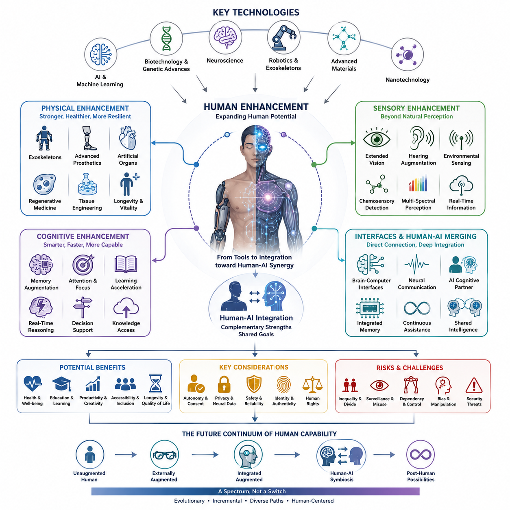
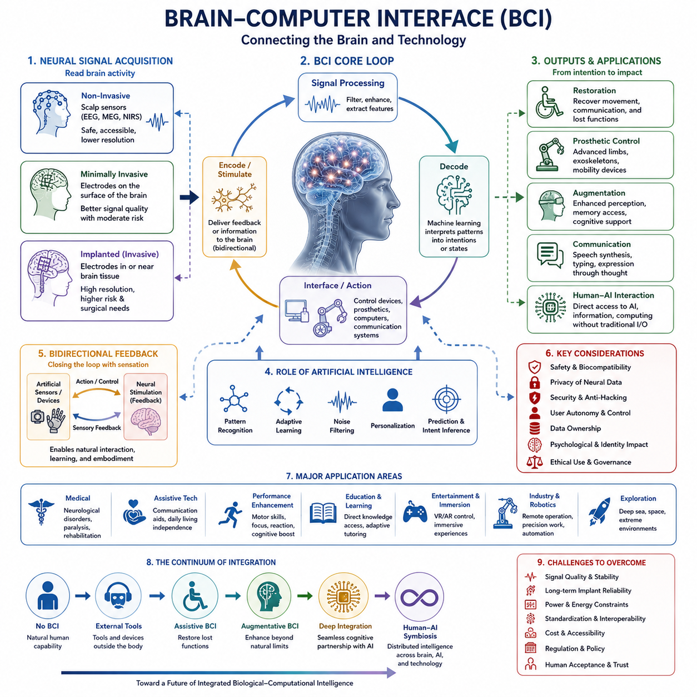
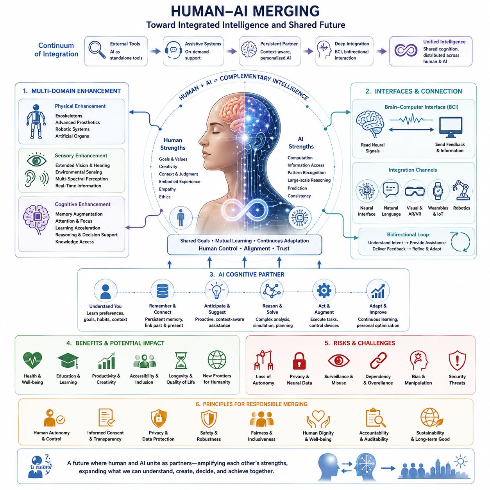
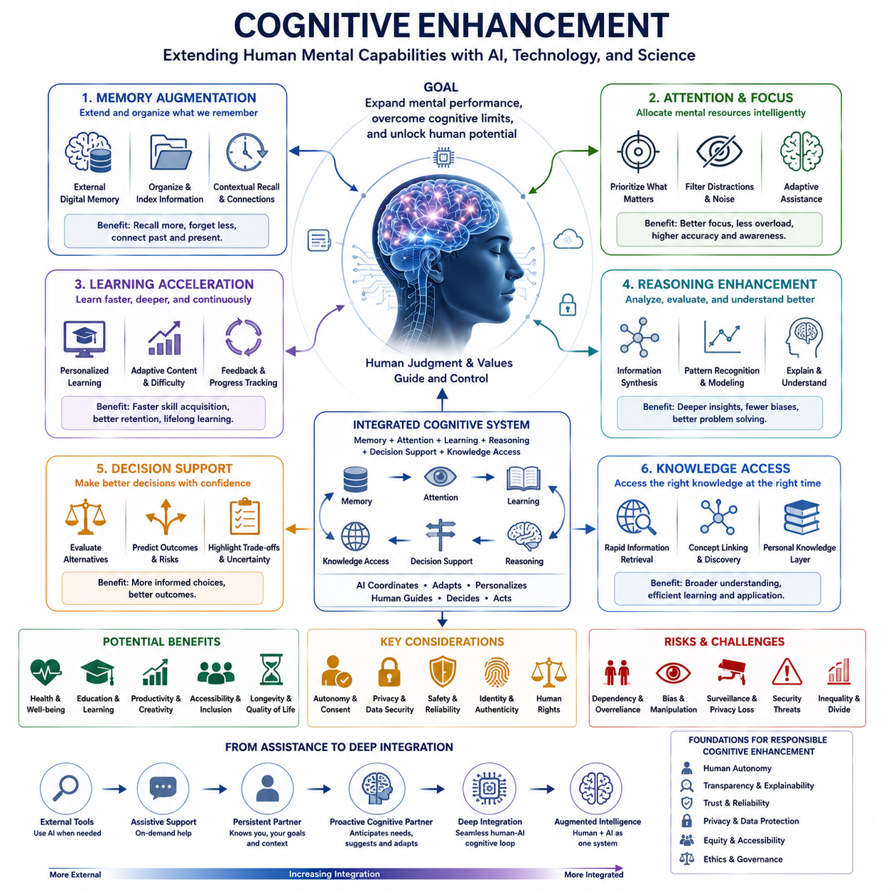
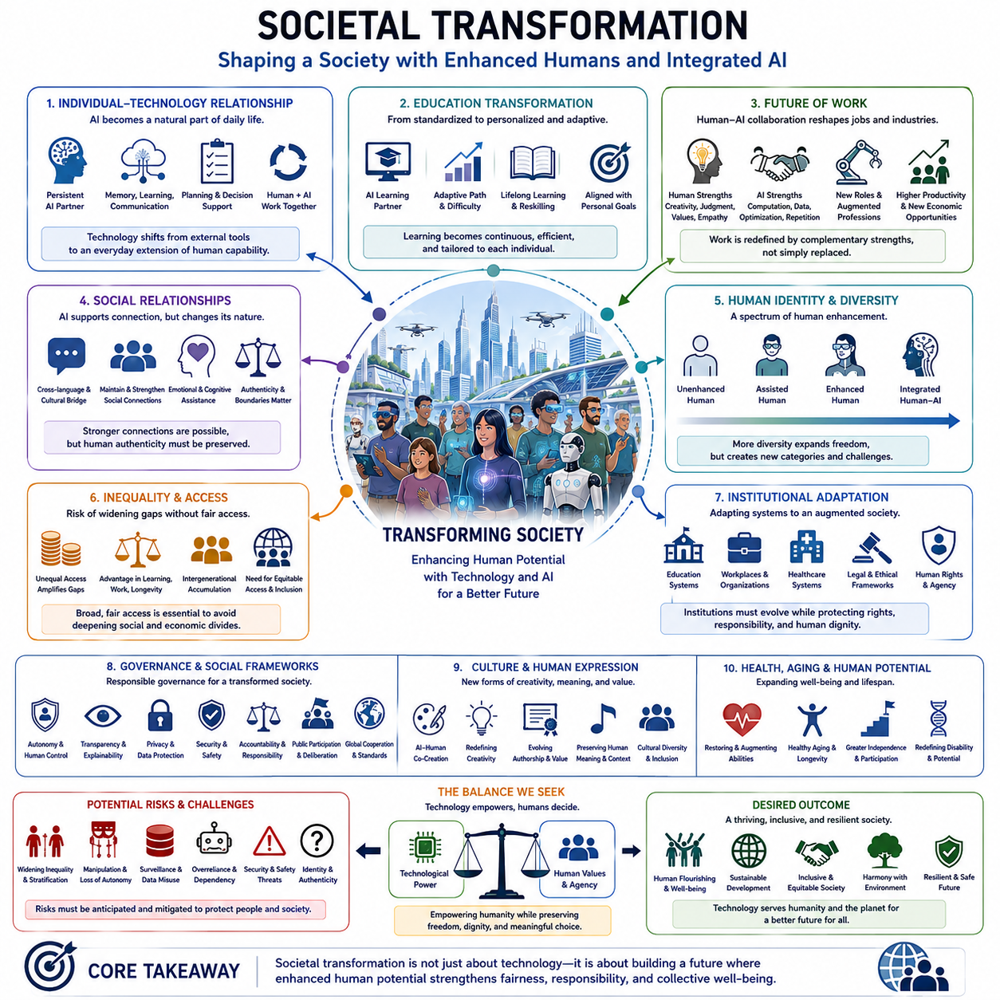
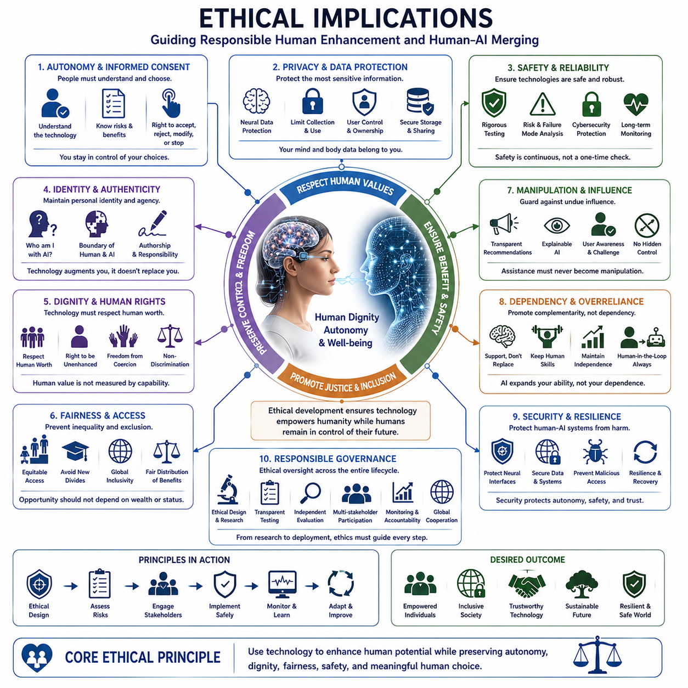

**Volume 48. Artificial Super Intelligence**


# Chapter 12. Transhumanism and Human Future

##  

## 12.00. Enhancement Technologies

{width="7.268055555555556in" height="7.268055555555556in"}

Enhancement technologies represent one of the most direct ways in which advances in artificial intelligence, biotechnology, neuroscience, robotics, and computational systems could alter the capabilities of human beings. Rather than treating the human body and mind as fixed biological limits, enhancement seeks to extend perception, memory, physical performance, learning capacity, communication, and decision-making. In a future shaped by AGI and ASI, these technologies could become increasingly integrated rather than remaining separate medical or consumer technologies.

Human enhancement can be understood as a continuum ranging from relatively conventional tools to deeply integrated technological augmentation. Wearable devices, sensory aids, exoskeletons, advanced prosthetics, and personalized AI assistants already extend human capabilities without fundamentally changing biological identity. More advanced approaches could combine these technologies with neural interfaces, embedded sensors, artificial organs, genetic interventions, and intelligent computational systems, gradually reducing the distinction between biological capability and technologically mediated capability.

Physical enhancement focuses on improving the body\'s ability to perceive, move, endure, recover, and interact with the environment. Exoskeletons can augment strength and reduce physical workload, while advanced prosthetics can restore or potentially exceed some natural functions. Artificial organs, regenerative medicine, tissue engineering, and eventually more sophisticated biological interventions could further extend health and functional longevity. Robotics may therefore become not only an external tool for humans but also an extension of the human body itself.

Sensory enhancement expands the range and quality of information available to human perception. Cameras, microphones, radar-like sensors, thermal imaging, chemical sensors, and other instruments can provide information that ordinary biological senses cannot directly detect. AI can transform these signals into meaningful representations that humans can understand. Future systems may allow people to perceive information across wider spectral, spatial, temporal, or environmental domains, effectively creating technologically mediated senses beyond the normal biological range.

Cognitive enhancement addresses the limitations of human memory, attention, reasoning, learning, and information processing. External AI systems already provide forms of cognitive augmentation by retrieving information, summarizing complex material, generating alternatives, and assisting with problem solving. More tightly integrated systems could provide persistent memory, contextual retrieval, real-time reasoning assistance, adaptive tutoring, and decision support. The important transition would occur when such assistance becomes continuous and personalized rather than something a person deliberately activates as a separate tool.

Brain-computer interfaces represent a deeper stage of enhancement because they create a direct communication pathway between neural activity and computational systems. A sufficiently capable interface could allow neural signals to control external devices, receive information from artificial systems, or support communication without conventional physical input. This creates the possibility of a human-machine system in which biological cognition and artificial computation operate as coupled components rather than independent entities.

Human-AI merging extends this idea from communication toward functional integration. An AI system could potentially become a persistent cognitive partner that understands an individual\'s memories, preferences, goals, environment, and ongoing activities. Instead of replacing human cognition, such a system could continuously complement it. The boundary between "what the human knows" and "what the human can access through AI" could therefore become increasingly difficult to define, especially when interaction becomes instantaneous and highly personalized.

Cognitive enhancement may also change the meaning of intelligence itself. Human intelligence is constrained by biological processing speed, working memory, attention, fatigue, and limited access to information. Artificial systems can operate at different speeds and maintain access to enormous computational resources. If humans can reliably connect to such systems, intelligence may become partly determined by the quality of the human-machine architecture surrounding an individual rather than by biological cognition alone. Enhancement could therefore produce a new spectrum ranging from unaugmented humans to deeply integrated human-AI cognitive systems.

The social consequences could be substantial. If enhancement technologies become reliable and affordable, they could improve education, healthcare, productivity, accessibility, and participation for large populations. They could provide particularly important benefits for people with disabilities by restoring or extending physical and cognitive functions. At the same time, unequal access could create new forms of social stratification. Differences between enhanced and unenhanced populations might become economically, cognitively, or politically significant, producing questions that are fundamentally different from ordinary inequalities in access to technology.

The development of enhancement technologies therefore cannot be separated from questions of autonomy, identity, safety, privacy, and human rights. A technology that improves memory, perception, or decision-making may also create new opportunities for surveillance, manipulation, dependency, or coercion. Neural interfaces could introduce especially sensitive forms of personal data because neural activity may reveal information about intentions, responses, or internal states. Enhancement must consequently be evaluated not only according to capability gains but also according to who controls the technology, who owns the resulting data, and whether individuals can meaningfully choose to use or reject it.

In the context of ASI, enhancement technologies could become part of a larger transition in which intelligence is no longer confined to either biological brains or artificial machines. ASI could accelerate the design of better prosthetics, neural interfaces, pharmaceuticals, biological interventions, and personalized cognitive systems. At the same time, humans equipped with advanced augmentation could interact with ASI through increasingly direct channels. The long-term possibility is therefore not simply a competition between humans and machines, but the emergence of increasingly integrated human-machine intelligence.

This transition also raises the question of what remains fundamentally human when enhancement becomes extensive. Human identity has historically changed alongside language, writing, tools, medicine, transportation, and computing, yet these technologies generally remained external to the biological organism. Advanced enhancement could challenge that boundary by making technology part of perception, cognition, memory, and action. The distinction between human, augmented human, and artificial intelligence may consequently become a matter of degree rather than a simple categorical separation.

The future of enhancement is therefore best understood as an evolving continuum rather than a single technological event. Wearable augmentation, robotics, artificial organs, sensory substitution, neural interfaces, cognitive assistants, and human-AI integration may develop at different rates and under different social constraints. Their convergence could eventually create new forms of human capability that are neither purely biological nor purely artificial. Within the broader trajectory from AGI to ASI, enhancement technologies represent one possible pathway through which intelligence itself becomes increasingly distributed across biological, computational, and embodied systems.

인간 증강 기술(enhancement technologies)은 인공지능(AI), 생명공학(biotechnology), 신경과학(neuroscience), 로봇공학(robotics), 계산 시스템(computational systems)의 발전이 인간의 능력을 변화시킬 수 있는 가장 직접적인 방법 가운데 하나를 의미한다. 인간의 신체와 정신을 고정된 생물학적 한계로 보는 대신, 증강은 지각(perception), 기억(memory), 신체 능력(physical performance), 학습 능력(learning capacity), 의사소통(communication), 의사결정(decision-making)을 확장하는 것을 목표로 한다. 인공 일반 지능(AGI)과 인공 초지능(ASI)에 의해 형성되는 미래에서는 이러한 기술들이 서로 분리된 의료 또는 소비자 기술로 남기보다 점점 더 통합될 가능성이 있다.

인간 증강(human enhancement)은 비교적 일반적인 도구에서부터 생물학적으로 깊이 통합된 기술적 증강(deeply integrated technological augmentation)에 이르는 연속체(continuum)로 이해할 수 있다. 웨어러블 기기(wearable devices), 감각 보조기기(sensory aids), 외골격(exoskeletons), 첨단 의수·의족(advanced prosthetics), 개인화된 AI 비서(personalized AI assistants)는 이미 인간의 능력을 확장하고 있지만, 반드시 인간의 생물학적 정체성을 근본적으로 변화시키지는 않는다. 보다 발전된 접근법은 이러한 기술들을 신경 인터페이스(neural interfaces), 내장형 센서(embedded sensors), 인공 장기(artificial organs), 유전적 개입(genetic interventions), 지능형 계산 시스템(intelligent computational systems)과 결합하여 생물학적 능력과 기술적으로 매개된 능력 사이의 구분을 점진적으로 줄일 수 있다.

신체적 증강(physical enhancement)은 환경을 지각하고, 움직이고, 견디고, 회복하며, 상호작용하는 신체의 능력을 향상시키는 데 초점을 둔다. 외골격(exoskeleton)은 근력을 증강하고 신체적 부담을 줄일 수 있으며, 첨단 의수·의족(advanced prosthetics)은 일부 자연적 기능을 회복하거나 잠재적으로 이를 넘어설 수 있다. 인공 장기(artificial organs), 재생의학(regenerative medicine), 조직공학(tissue engineering), 그리고 궁극적으로 더욱 정교한 생물학적 개입(biological interventions)은 건강과 기능적 수명(functional longevity)을 더욱 확장할 수 있다. 따라서 로봇공학(robotics)은 인간을 위한 외부 도구일 뿐 아니라 인간 신체 자체의 확장(extension)이 될 수도 있다.

감각 증강(sensory enhancement)은 인간의 지각이 이용할 수 있는 정보의 범위와 품질을 확장한다. 카메라(cameras), 마이크(microphones), 레이더와 유사한 센서(radar-like sensors), 열화상 센서(thermal imaging), 화학 센서(chemical sensors) 및 기타 장치들은 일반적인 생물학적 감각만으로는 직접 감지할 수 없는 정보를 제공할 수 있다. AI는 이러한 신호를 인간이 이해할 수 있는 의미 있는 표현(meaningful representations)으로 변환할 수 있다. 미래의 시스템은 더 넓은 스펙트럼(spectral), 공간적(spatial), 시간적(temporal), 환경적(environmental) 영역의 정보를 인간이 지각할 수 있도록 하여, 정상적인 생물학적 범위를 넘어서는 기술적으로 매개된 감각(technologically mediated senses)을 만들어낼 수 있다.

인지 증강(cognitive enhancement)은 인간의 기억(memory), 주의(attention), 추론(reasoning), 학습(learning), 정보 처리(information processing)의 한계를 다룬다. 현재의 외부 AI 시스템은 정보를 검색하고, 복잡한 내용을 요약하고, 대안을 생성하고, 문제 해결을 지원함으로써 이미 일정한 형태의 인지적 증강(cognitive augmentation)을 제공하고 있다. 더욱 긴밀하게 통합된 시스템은 지속적 기억(persistent memory), 맥락 기반 검색(contextual retrieval), 실시간 추론(real-time reasoning) 지원, 적응형 교육(adaptive tutoring), 의사결정 지원(decision support)을 제공할 수 있다. 중요한 전환은 이러한 지원이 사용자가 의도적으로 별도의 도구를 작동시키는 방식이 아니라 지속적이고 개인화된 형태로 제공될 때 나타날 것이다.

뇌-컴퓨터 인터페이스(brain-computer interfaces)는 신경 활동(neural activity)과 계산 시스템(computational systems) 사이에 직접적인 통신 경로를 만든다는 점에서 더욱 깊은 수준의 증강을 의미한다. 충분히 발전된 인터페이스는 신경 신호(neural signals)를 이용하여 외부 장치를 제어하거나, 인공 시스템으로부터 정보를 전달받거나, 기존의 물리적 입력 없이 의사소통을 지원할 수 있다. 이는 생물학적 인지(biological cognition)와 인공 계산(artificial computation)이 서로 독립된 개체가 아니라 결합된 구성요소(coupled components)로 작동하는 인간-기계 시스템(human-machine system)의 가능성을 만든다.

인간-AI 융합(human-AI merging)은 이러한 개념을 단순한 의사소통에서 기능적 통합(functional integration)의 단계로 확장한다. AI 시스템은 개인의 기억(memories), 선호(preferences), 목표(goals), 환경(environment), 현재 활동(ongoing activities)을 이해하는 지속적인 인지적 파트너(persistent cognitive partner)가 될 수 있다. 인간의 인지를 대체하는 대신 이러한 시스템은 인간의 인지를 지속적으로 보완할 수 있다. 상호작용이 즉각적이고 고도로 개인화될수록, 무엇을 인간이 알고 있는지와 무엇을 AI를 통해 접근할 수 있는지의 경계는 점점 더 정의하기 어려워질 수 있다.

인지 증강(cognitive enhancement)은 지능(intelligence)의 의미 자체도 변화시킬 수 있다. 인간의 지능은 생물학적 처리 속도(biological processing speed), 작업 기억(working memory), 주의력(attention), 피로(fatigue), 제한된 정보 접근성(limited access to information)에 의해 제약된다. 반면 인공 시스템은 서로 다른 속도로 작동할 수 있으며 방대한 계산 자원(computational resources)에 접근할 수 있다. 인간이 이러한 시스템과 안정적으로 연결될 수 있다면, 지능은 생물학적 인지 자체뿐 아니라 개인을 둘러싼 인간-기계 아키텍처(human-machine architecture)의 품질에 의해서도 결정될 수 있다. 따라서 증강은 비증강 인간(unaugmented humans)에서부터 깊이 통합된 인간-AI 인지 시스템(deeply integrated human-AI cognitive systems)에 이르는 새로운 지능의 연속체를 만들어낼 수 있다.

사회적 영향(social consequences)은 상당할 수 있다. 증강 기술이 신뢰할 수 있고 경제적으로 접근 가능해진다면 교육(education), 의료(healthcare), 생산성(productivity), 접근성(accessibility), 사회 참여(participation)를 향상시킬 수 있다. 특히 장애가 있는 사람들에게 신체적·인지적 기능을 회복하거나 확장할 수 있는 중요한 혜택을 제공할 수 있다. 동시에 접근성의 불평등(unequal access)은 새로운 형태의 사회적 계층화(social stratification)를 만들어낼 수 있다. 증강 인간과 비증강 인간 사이의 차이가 경제적, 인지적, 정치적으로 중요한 의미를 갖게 된다면, 이는 기존의 기술 접근성 불평등과는 다른 새로운 사회적 문제를 만들어낼 수 있다.

따라서 증강 기술의 발전은 자율성(autonomy), 정체성(identity), 안전(safety), 프라이버시(privacy), 인권(human rights)의 문제와 분리해서 생각할 수 없다. 기억, 지각 또는 의사결정을 향상시키는 기술은 동시에 감시(surveillance), 조작(manipulation), 의존(dependency), 강제(coercion)의 새로운 가능성을 만들어낼 수 있다. 특히 신경 인터페이스(neural interfaces)는 신경 활동에 관한 민감한 개인정보를 다룰 수 있기 때문에 더욱 중요한 문제를 제기한다. 신경 활동은 개인의 의도(intentions), 반응(responses), 내부 상태(internal states)에 관한 정보를 드러낼 가능성이 있기 때문이다. 따라서 증강은 단순한 능력 향상(capability gains)뿐만 아니라 누가 기술을 통제하는지, 누가 그 결과 생성되는 데이터를 소유하는지, 그리고 개인이 해당 기술을 사용할지 거부할지를 실질적으로 선택할 수 있는지를 기준으로 평가되어야 한다.

인공 초지능(ASI)의 맥락에서 증강 기술은 생물학적 뇌 또는 인공 기계 가운데 어느 한쪽에만 지능이 제한되지 않는 더욱 광범위한 전환의 일부가 될 수 있다. ASI는 더 나은 의수·의족(prosthetics), 신경 인터페이스(neural interfaces), 의약품(pharmaceuticals), 생물학적 개입(biological interventions), 개인화된 인지 시스템(personalized cognitive systems)의 설계를 가속할 수 있다. 동시에 첨단 증강 기술을 사용하는 인간은 점점 더 직접적인 채널을 통해 ASI와 상호작용할 수 있다. 따라서 장기적으로 중요한 가능성은 인간과 기계 사이의 단순한 경쟁이 아니라, 생물학적 지능과 인공 지능이 점점 더 통합되는 인간-기계 지능(human-machine intelligence)의 출현이다.

이러한 전환은 증강이 광범위하게 이루어졌을 때 무엇이 근본적으로 인간적인 것인지에 대한 질문도 제기한다. 인간의 정체성(human identity)은 역사적으로 언어(language), 문자(writing), 도구(tools), 의학(medicine), 교통(transportation), 컴퓨팅(computing)의 발전과 함께 변화해 왔지만, 이러한 기술은 일반적으로 생물학적 유기체의 외부에 존재했다. 첨단 증강 기술은 기술을 지각(perception), 인지(cognition), 기억(memory), 행동(action)의 일부로 만들면서 이러한 경계를 흔들 수 있다. 결과적으로 인간(human), 증강 인간(augmented human), 인공지능(artificial intelligence)의 구분은 단순한 범주적 차이가 아니라 정도의 차이(matter of degree)가 될 가능성이 있다.

따라서 증강의 미래는 하나의 기술적 사건이라기보다 발전하는 연속체(evolving continuum)로 이해하는 것이 가장 적절하다. 웨어러블 증강(wearable augmentation), 로봇공학(robotics), 인공 장기(artificial organs), 감각 대체(sensory substitution), 신경 인터페이스(neural interfaces), 인지 보조 시스템(cognitive assistants), 인간-AI 통합(human-AI integration)은 서로 다른 속도와 사회적 제약 속에서 발전할 수 있다. 이러한 기술들이 서로 융합된다면 순수하게 생물학적이지도, 순수하게 인공적이지도 않은 새로운 형태의 인간 능력(human capability)이 등장할 수 있다. AGI에서 ASI로 이어지는 보다 넓은 흐름에서 증강 기술은 지능 자체가 생물학적 시스템, 계산 시스템, 체화된 시스템(embodied systems)에 점점 더 분산되는 하나의 경로가 될 수 있다.

##  

## 12.01. Brain Computer Interface

{width="7.268055555555556in" height="7.268055555555556in"}

A brain-computer interface (BCI) creates a communication pathway between the brain and an external computational system. Its fundamental purpose is to translate patterns of neural activity into usable information and, in more advanced systems, to deliver information back to the nervous system. Within the broader theme of transhumanism and the human future, BCI represents an important transition from technologies that merely assist the body to technologies that can directly interact with the mechanisms of cognition and action.

BCI systems generally operate through a closed loop between neural activity, signal acquisition, computational interpretation, and interaction with an external system. Neural signals may be measured using non-invasive, minimally invasive, or implanted technologies, depending on the required resolution, safety, and intended application. Signal processing and machine learning can then identify patterns associated with movement, intention, perception, or other neural states. The resulting interpretation can control a computer, robotic device, prosthesis, or other digital system.

Non-invasive BCI approaches attempt to obtain useful neural information without placing electrodes directly inside the brain. Techniques such as electroencephalography (EEG) can measure electrical activity from sensors positioned on the scalp, while other approaches can use magnetic or optical measurements of brain activity. These methods can offer improved safety and accessibility, but signals are often weaker, noisier, and less spatially precise than signals obtained closer to neural tissue. Consequently, practical BCI design involves balancing usability, signal quality, latency, cost, and long-term reliability.

Implanted BCI systems can provide a much more direct interface with neural activity. Electrodes positioned within or near neural tissue can capture signals with greater spatial and temporal detail, potentially enabling more precise control. Such systems could support advanced prosthetic limbs, communication devices, or other assistive technologies. However, implantation introduces significant medical and engineering challenges, including surgical risk, biological responses, electrode degradation, long-term stability, power requirements, and the need for reliable interfaces between living tissue and electronic hardware.

One important application of BCI is restoring capabilities that have been impaired by injury or disease. Neural signals associated with intended movement can potentially be translated into commands for robotic limbs, wheelchairs, computer interfaces, or communication systems. In this context, the objective is not necessarily to create superhuman abilities but to reconnect cognitive intention with an external action pathway. BCI therefore represents a particularly important technology for accessibility because it could allow individuals with severe motor or communication limitations to interact with the physical and digital world more independently.

The same basic architecture can eventually move beyond restoration toward augmentation. If a neural interface can reliably decode intentions or sensory information, it could potentially connect the human nervous system to capabilities that biological organs do not naturally provide. Artificial sensors might supply visual, auditory, tactile, thermal, or other information, while robotic systems could extend physical reach and strength. The resulting system would not simply replace a biological function but could create a new perception-action loop in which biological and artificial components operate together.

Artificial intelligence is likely to become increasingly important in this process because neural signals are complex, variable, and highly dependent on individual physiology and context. Machine learning can help decode patterns, adapt to changes in neural activity, filter noise, and personalize the interface to a particular user. Future systems could use adaptive models that continuously learn from interaction, allowing the BCI to compensate for changes in neural signals and improve performance over time. This creates a human-AI interface in which AI functions as an intermediate layer between biological activity and computational capability.

A more advanced BCI could also become bidirectional rather than merely reading neural signals. Instead of only translating brain activity into commands, a bidirectional system could provide artificial sensory feedback to the nervous system. A robotic hand, for example, might generate sensor information that is converted into stimulation patterns representing touch, pressure, or position. This could create a closed perception-action cycle in which the brain controls an artificial system while simultaneously receiving information about the system\'s state. Such integration would be an important step toward deeper human-machine coupling.

As BCI technology becomes more capable, the distinction between an external AI assistant and an integrated cognitive system may gradually become less clear. A future interface could provide information, memory retrieval, contextual assistance, or computational support without requiring conventional keyboards, screens, or speech. The system might recognize the user\'s intentions, retrieve relevant knowledge, perform complex computation, and return useful information through neural or sensory channels. This possibility connects BCI directly to human-AI merging and cognitive enhancement, which are subsequent themes within the same transhumanist framework.

The long-term significance of BCI therefore depends not only on technical performance but also on control, autonomy, privacy, and identity. Neural data may contain information about highly personal states, and the ability to influence neural activity creates a fundamentally different category of technological power. Questions arise concerning who owns neural data, who controls the interface, whether users can freely disconnect from it, and how manipulation or unauthorized access can be prevented. Safety must therefore include not only physical protection but also cognitive and informational protection.

BCI development also raises a broader question about the meaning of human capability. If external devices can extend memory, perception, communication, reasoning, and physical action, then biological limitations may become less decisive in determining what an individual can accomplish. At one end of the continuum, BCI may function as a medical assistive technology; at more advanced stages, it could become a general interface between human cognition and computational infrastructure. The ultimate possibility is a human-machine system in which intelligence is distributed across the biological brain, AI models, digital memory, robotic embodiment, and external computing resources.

In the context of an AGI-to-ASI transition, BCI could become one of the technologies connecting increasingly capable artificial intelligence with human cognition. ASI could accelerate the design of neural decoding algorithms, adaptive interfaces, neuroprosthetics, artificial sensory systems, and personalized cognitive assistance. Conversely, humans equipped with increasingly capable interfaces could interact with artificial intelligence through faster and more direct channels. The long-term trajectory is therefore not necessarily a simple replacement of humans by machines, but potentially the emergence of increasingly integrated biological-computational intelligence in which the boundary between human capability and machine capability becomes progressively more permeable.

뇌-컴퓨터 인터페이스(Brain-Computer Interface, BCI)는 뇌와 외부 계산 시스템(external computational system) 사이에 통신 경로(communication pathway)를 만드는 기술이다. 기본적인 목적은 신경 활동(neural activity)의 패턴을 유용한 정보로 변환하고, 보다 발전된 시스템에서는 외부의 정보를 다시 신경계(nervous system)로 전달하는 것이다. 트랜스휴머니즘(transhumanism)과 인간의 미래(human future)라는 더 넓은 맥락에서 BCI는 단순히 신체를 보조하는 기술에서 벗어나 인지(cognition)와 행동(action)의 기반이 되는 메커니즘과 직접 상호작용하는 기술로의 중요한 전환을 의미한다.

BCI 시스템은 일반적으로 신경 활동(neural activity), 신호 획득(signal acquisition), 계산적 해석(computational interpretation), 외부 시스템과의 상호작용(interaction) 사이의 폐루프(closed loop)로 작동한다. 신경 신호(neural signals)는 필요한 해상도(resolution), 안전성(safety), 적용 목적에 따라 비침습적(non-invasive), 최소 침습적(minimally invasive), 또는 이식형(implanted) 기술을 사용하여 측정할 수 있다. 이후 신호 처리(signal processing)와 머신러닝(machine learning)을 통해 움직임(movement), 의도(intention), 지각(perception), 기타 신경 상태(neural states)와 관련된 패턴을 식별할 수 있다. 이렇게 해석된 결과는 컴퓨터, 로봇 장치, 의수·의족, 또는 기타 디지털 시스템을 제어하는 데 사용될 수 있다.

비침습적 BCI(non-invasive BCI) 접근법은 뇌 내부에 전극을 직접 삽입하지 않고 유용한 신경 정보를 획득하는 것을 목표로 한다. 뇌파검사(electroencephalography, EEG)와 같은 기술은 두피에 배치된 센서를 통해 전기적 뇌 활동(electrical brain activity)을 측정할 수 있으며, 다른 접근법에서는 뇌 활동의 자기적(magnetic) 또는 광학적(optical) 측정을 이용할 수도 있다. 이러한 방법은 더 높은 안전성과 접근성을 제공할 수 있지만, 신호가 더 약하고 잡음이 많으며 공간적 정밀도(spatial precision)가 낮은 경우가 많다. 따라서 실제 BCI 설계에서는 사용성(usability), 신호 품질(signal quality), 지연시간(latency), 비용(cost), 장기적 신뢰성(long-term reliability) 사이의 균형을 고려해야 한다.

이식형 BCI(implanted BCI) 시스템은 신경 활동에 훨씬 더 직접적으로 접근할 수 있다. 신경 조직 내부 또는 주변에 배치된 전극(electrodes)은 더 높은 공간적·시간적 세부 정보(spatial and temporal detail)를 가진 신호를 포착할 수 있으며, 이를 통해 더욱 정밀한 제어가 가능해질 수 있다. 이러한 시스템은 첨단 의수·의족(advanced prosthetic limbs), 의사소통 장치(communication devices), 기타 보조 기술(assistive technologies)을 지원할 수 있다. 그러나 이식은 수술 위험(surgical risk), 생물학적 반응(biological responses), 전극 열화(electrode degradation), 장기 안정성(long-term stability), 전력 요구사항(power requirements), 살아 있는 조직과 전자 하드웨어 사이의 신뢰성 높은 인터페이스(reliable interface) 구축 등 중요한 의료적·공학적 문제를 발생시킨다.

BCI의 중요한 응용 분야 가운데 하나는 손상이나 질병으로 인해 상실된 기능을 회복하는 것이다. 의도된 움직임(intended movement)과 관련된 신경 신호를 로봇 팔·다리, 휠체어, 컴퓨터 인터페이스, 또는 의사소통 시스템의 명령(command)으로 변환할 수 있다. 이러한 경우의 목적은 반드시 초인적 능력(superhuman abilities)을 만드는 것이 아니라 인지적 의도(cognitive intention)와 외부 행동 경로(external action pathway)를 다시 연결하는 것이다. 따라서 BCI는 접근성(accessibility)을 위한 특히 중요한 기술이며, 심각한 운동 또는 의사소통의 제약을 가진 사람들이 물리적·디지털 세계와 더욱 독립적으로 상호작용할 수 있도록 할 가능성이 있다.

동일한 기본 구조는 궁극적으로 기능 회복(restoration)을 넘어 증강(augmentation)의 단계로 발전할 수 있다. 신경 인터페이스(neural interface)가 인간의 의도나 감각 정보를 안정적으로 해독할 수 있다면, 생물학적 기관이 본래 제공하지 않는 능력과 인간의 신경계를 연결할 가능성이 생긴다. 인공 센서(artificial sensors)는 시각(visual), 청각(auditory), 촉각(tactile), 열(thermal) 또는 기타 정보를 제공할 수 있으며, 로봇 시스템(robotic systems)은 물리적인 도달 범위와 근력을 확장할 수 있다. 이렇게 형성되는 시스템은 단순히 생물학적 기능을 대체하는 것이 아니라 생물학적 구성요소와 인공 구성요소가 함께 작동하는 새로운 지각-행동 순환(perception-action loop)을 만들어낼 수 있다.

인공지능(Artificial Intelligence, AI)은 이러한 과정에서 점점 더 중요한 역할을 할 가능성이 있다. 신경 신호는 복잡하고 가변적이며 개인의 생리적 특성과 상황에 크게 의존하기 때문이다. 머신러닝(machine learning)은 신경 신호의 패턴을 해독하고, 변화에 적응하며, 잡음을 제거하고, 특정 사용자에게 맞게 인터페이스를 개인화하는 데 도움을 줄 수 있다. 미래의 시스템은 상호작용을 통해 지속적으로 학습하는 적응형 모델(adaptive models)을 사용할 수 있으며, 이를 통해 신경 신호의 변화에 대응하면서 시간이 지날수록 BCI의 성능을 향상시킬 수 있다. 이는 AI가 생물학적 활동과 계산 능력 사이의 중간 계층(intermediate layer)으로 기능하는 인간-AI 인터페이스(human-AI interface)를 만들어낸다.

보다 발전된 BCI는 단순히 신경 신호를 읽는 것을 넘어 양방향(bidirectional) 시스템으로 발전할 수 있다. 신경 활동을 명령으로 변환하는 것뿐만 아니라, 양방향 시스템은 인공적인 감각 피드백(artificial sensory feedback)을 신경계에 제공할 수도 있다. 예를 들어 로봇 손(robotic hand)은 센서 정보를 생성하고 이를 촉각(touch), 압력(pressure), 위치(position)을 나타내는 자극 패턴(stimulation patterns)으로 변환할 수 있다. 이는 뇌가 인공 시스템을 제어하면서 동시에 그 시스템의 상태에 관한 정보를 전달받는 폐루프 지각-행동 순환(closed perception-action cycle)을 형성할 수 있다. 이러한 통합은 더욱 깊은 인간-기계 결합(human-machine coupling)을 향한 중요한 단계가 될 수 있다.

BCI 기술이 더욱 발전하면 외부 AI 비서(external AI assistant)와 통합된 인지 시스템(integrated cognitive system) 사이의 구분도 점차 불분명해질 수 있다. 미래의 인터페이스는 기존의 키보드, 화면, 음성 없이도 정보 제공(information), 기억 검색(memory retrieval), 맥락 기반 지원(contextual assistance), 계산 지원(computational support)을 제공할 수 있다. 시스템은 사용자의 의도를 인식하고, 관련 지식을 검색하며, 복잡한 계산을 수행하고, 신경 또는 감각 채널(neural or sensory channels)을 통해 유용한 정보를 다시 전달할 수 있다. 이러한 가능성은 트랜스휴머니즘(transhumanist) 프레임워크에서 이후에 다루게 될 인간-AI 융합(human-AI merging)과 인지 증강(cognitive enhancement)의 주제와 BCI를 직접 연결한다.

BCI의 장기적인 의미는 기술적 성능뿐만 아니라 통제(control), 자율성(autonomy), 프라이버시(privacy), 정체성(identity)에 의해 결정된다. 신경 데이터(neural data)는 매우 개인적인 상태에 관한 정보를 포함할 수 있으며, 신경 활동에 영향을 미치는 능력은 근본적으로 새로운 형태의 기술적 권력(technological power)을 만들어낸다. 누가 신경 데이터를 소유하는가, 누가 인터페이스를 통제하는가, 사용자가 자유롭게 연결을 해제할 수 있는가, 조작이나 무단 접근을 어떻게 방지할 것인가 등의 문제가 제기된다. 따라서 안전(safety)은 단순한 신체적 보호(physical protection)뿐만 아니라 인지적 보호(cognitive protection)와 정보 보호(informational protection)까지 포함해야 한다.

BCI의 발전은 인간의 능력(human capability)이 무엇을 의미하는가에 대한 보다 근본적인 질문도 제기한다. 외부 장치가 기억(memory), 지각(perception), 의사소통(communication), 추론(reasoning), 신체적 행동(physical action)을 확장할 수 있다면, 생물학적 한계는 개인이 무엇을 수행할 수 있는지를 결정하는 데 있어 점점 덜 중요한 요소가 될 수 있다. 연속체(continuum)의 한쪽에서는 BCI가 의료적 보조 기술(medical assistive technology)로 기능할 수 있으며, 더욱 발전된 단계에서는 인간의 인지(human cognition)와 계산 인프라(computational infrastructure)를 연결하는 일반적인 인터페이스(general interface)가 될 수 있다. 궁극적으로는 지능이 생물학적 뇌, AI 모델, 디지털 기억, 로봇 신체화(robotic embodiment), 외부 계산 자원(external computing resources)에 분산되는 인간-기계 시스템(human-machine system)이 등장할 가능성이 있다.

AGI에서 ASI로의 전환(AGI-to-ASI transition)이라는 맥락에서 BCI는 점점 더 강력해지는 인공지능과 인간의 인지를 연결하는 기술 가운데 하나가 될 수 있다. ASI는 신경 해독 알고리즘(neural decoding algorithms), 적응형 인터페이스(adaptive interfaces), 신경 보철(neuroprosthetics), 인공 감각 시스템(artificial sensory systems), 개인화된 인지 지원(personalized cognitive assistance)의 설계를 가속할 수 있다. 반대로 점점 더 발전된 인터페이스를 갖춘 인간은 더 빠르고 직접적인 채널을 통해 인공지능과 상호작용할 수 있다. 따라서 장기적인 발전 방향은 반드시 기계에 의한 인간의 단순한 대체(simple replacement of humans by machines)를 의미하는 것이 아니라, 인간의 능력과 기계의 능력 사이의 경계가 점차 더 투과성(permeable)을 갖게 되는, 점점 더 통합된 생물학적-계산적 지능(biological-computational intelligence)의 출현일 가능성이 있다.

##  

## 12.02. Human AI Merging

{width="7.268055555555556in" height="7.268055555555556in"}

Human-AI merging refers to the progressive integration of human biological cognition with artificial intelligence systems, moving beyond the traditional relationship in which AI exists as an external tool. The central idea is not necessarily that humans and machines become physically identical, but that their capabilities become increasingly interconnected. AI can extend memory, perception, reasoning, communication, and decision-making, while human goals, values, experience, and embodied understanding provide direction and context. In this sense, merging represents a continuum from assistance toward increasingly deep cognitive and functional integration.

The first stage of this transition can already be observed through external AI assistance. Search engines, conversational systems, recommendation engines, digital assistants, and generative AI provide humans with access to knowledge and computational capabilities that exceed unaided biological cognition. These systems remain external, but they effectively expand the individual\'s cognitive workspace. As interaction becomes continuous and personalized, the boundary between a person\'s internal reasoning process and the external computational support surrounding it can gradually become less distinct.

A deeper form of integration occurs when AI systems maintain persistent knowledge about an individual and continuously adapt to that person\'s goals, preferences, history, and environment. Instead of responding only to isolated requests, an AI cognitive partner could maintain contextual awareness across extended periods of interaction. Integrated memory could connect previous experiences with current tasks, while continuous assistance could provide relevant information before a person explicitly asks for it. The resulting system would function less like a conventional software application and more like an ongoing cognitive extension.

Human-AI merging also depends on the integration of multiple human capabilities rather than intelligence alone. Physical enhancement can connect people with exoskeletons, advanced prosthetics, robotic devices, and artificial organs. Sensory enhancement can provide access to information beyond ordinary biological perception, including environmental, multispectral, or real-time computational information. Cognitive enhancement can support memory augmentation, attention, learning, reasoning, decision-making, and knowledge access. These capabilities can converge around AI systems that coordinate information across physical, sensory, and cognitive domains.

Brain-computer interfaces represent one possible bridge between external AI and biological cognition. A BCI can translate neural activity into commands for computational systems and, in more advanced configurations, provide information or sensory feedback to the nervous system. This creates the possibility of a direct communication pathway between human cognition and artificial computation. As neural interfaces improve, AI could potentially interpret intentions, provide contextual assistance, control external devices, and return information through increasingly natural channels, reducing dependence on conventional keyboards, screens, or speech.

Human-AI merging becomes substantially more powerful when the relationship is bidirectional. Humans provide goals, values, preferences, embodied experience, and contextual judgment, while AI contributes computation, information retrieval, pattern recognition, prediction, and large-scale reasoning. Rather than treating AI as a replacement for human cognition, this architecture can be understood as complementary intelligence. The objective is to combine strengths that are difficult for either biological or artificial systems to achieve independently, creating a shared cognitive process directed toward common goals.

Artificial intelligence may also become increasingly adaptive within this relationship. A future cognitive partner could learn how an individual thinks, what information is important, which decisions require human attention, and when computational assistance should remain in the background. It could adjust the level of intervention according to context, providing detailed reasoning during difficult tasks while remaining nearly invisible during routine activities. Such adaptive assistance would transform AI from a passive tool into an active component of a human-centered cognitive architecture.

The resulting system could have significant benefits across health, education, productivity, creativity, accessibility, inclusion, longevity, and quality of life. AI augmentation could help individuals compensate for disabilities, support learning, improve access to information, and reduce cognitive workload. It could also allow people to interact with increasingly complex technological environments without having to master every underlying computational process. In the longer term, human-AI integration could allow individuals and organizations to coordinate biological intelligence, artificial intelligence, robotics, digital memory, and distributed computing as a unified capability.

However, deeper integration also creates risks that are fundamentally different from those associated with ordinary software. Autonomy and consent become critical because an integrated system may influence decisions, attention, memory, or behavior. Privacy becomes especially important when personal, behavioral, or neural information is continuously collected. Security threats could affect not only data but also the integrity of the human-machine interaction itself. Dependency could reduce individual independence, while biased or poorly designed systems could manipulate decisions or reinforce existing inequalities. These risks make human control an essential design principle.

Identity and authenticity introduce an additional layer of complexity. If a person\'s memory, reasoning, perception, and decisions are continuously supported by AI, it may become difficult to determine where biological cognition ends and technological augmentation begins. This does not necessarily mean that personal identity disappears, but it could change the traditional concept of individual agency. Questions about responsibility, authorship, achievement, and personal choice may need to be reconsidered when an outcome emerges from a tightly coupled human-AI system rather than from an unaided individual.

The long-term trajectory can therefore be understood as a continuum: external tools may evolve into assistive systems, assistive systems into persistent cognitive partners, and cognitive partners into deeply integrated human-AI systems. At the far end of this continuum, intelligence could become distributed across the biological brain, AI models, digital memory, sensors, robotic embodiment, and large-scale computational infrastructure. The important transition would not be a single moment when humans suddenly become machines, but a gradual reduction of the functional boundary between biological and artificial intelligence.

Within the broader transition from AGI to ASI, human-AI merging could become increasingly significant because highly capable artificial intelligence may provide humans with unprecedented opportunities for augmentation. ASI could accelerate the development of neural interfaces, adaptive cognitive systems, artificial sensory technologies, personalized memory systems, and intelligent prosthetics. At the same time, increasingly augmented humans could interact with advanced AI through faster and more direct channels. The resulting future may therefore be characterized not simply by human versus machine intelligence, but by increasingly distributed and shared intelligence in which humans and artificial systems contribute complementary capabilities toward common objectives.

The central question is ultimately not whether humans can merge with AI, but under what conditions such integration should occur. Human-AI merging should remain centered on human autonomy, informed consent, safety, privacy, dignity, and meaningful control. Technological capability alone does not determine whether integration represents progress. The quality of the relationship between human intention and artificial capability is equally important. A desirable future would therefore seek human-AI synergy rather than simple replacement, preserving human agency while using artificial intelligence to expand the range of what individuals and societies can understand, create, decide, and accomplish.

인간-AI 융합(Human-AI merging)은 인간의 생물학적 인지(biological cognition)와 인공지능 시스템(artificial intelligence systems)을 점진적으로 통합하는 것을 의미하며, AI가 외부 도구로만 존재하는 전통적인 관계를 넘어서는 개념이다. 핵심은 인간과 기계가 물리적으로 동일해지는 것이 반드시 아니라, 서로의 능력이 점점 더 긴밀하게 연결되는 것이다. AI는 기억(memory), 지각(perception), 추론(reasoning), 의사소통(communication), 의사결정(decision-making)을 확장할 수 있으며, 인간의 목표(goals), 가치(values), 경험(experience), 체화된 이해(embodied understanding)는 방향과 맥락을 제공한다. 이러한 의미에서 융합은 보조(assistance)에서 점점 더 깊은 인지적·기능적 통합(cognitive and functional integration)으로 이어지는 연속체(continuum)로 볼 수 있다.

이러한 전환의 첫 번째 단계는 이미 외부 AI 지원(external AI assistance)을 통해 관찰할 수 있다. 검색 엔진(search engines), 대화형 시스템(conversational systems), 추천 엔진(recommendation engines), 디지털 비서(digital assistants), 생성형 AI(generative AI)는 인간의 도움받지 않은 생물학적 인지(unaided biological cognition)를 넘어서는 지식과 계산 능력(computational capabilities)에 접근할 수 있도록 한다. 이러한 시스템은 여전히 외부에 존재하지만, 사실상 개인의 인지적 작업공간(cognitive workspace)을 확장한다. 상호작용이 지속적이고 개인화될수록 개인의 내부 추론 과정(internal reasoning process)과 그를 둘러싼 외부 계산 지원(external computational support) 사이의 경계는 점차 불분명해질 수 있다.

더 깊은 형태의 통합은 AI 시스템이 개인에 관한 지속적인 지식(persistent knowledge)을 유지하고 그 사람의 목표, 선호(preferences), 이력(history), 환경(environment)에 지속적으로 적응할 때 발생한다. 개별적인 요청에만 응답하는 대신, AI 인지 파트너(AI cognitive partner)는 장기간의 상호작용에 걸쳐 맥락 인식(contextual awareness)을 유지할 수 있다. 통합된 기억(integrated memory)은 과거의 경험과 현재의 작업을 연결할 수 있으며, 지속적인 지원(continuous assistance)은 사용자가 명시적으로 요청하기 전에 관련 정보를 제공할 수 있다. 이렇게 만들어지는 시스템은 기존의 소프트웨어 애플리케이션이라기보다 지속적인 인지적 확장(ongoing cognitive extension)에 가까운 방식으로 기능할 것이다.

인간-AI 융합은 또한 지능(intelligence) 하나만이 아니라 여러 인간 능력(human capabilities)의 통합에 의존한다. 신체적 증강(physical enhancement)은 인간을 외골격(exoskeletons), 첨단 의수·의족(advanced prosthetics), 로봇 장치(robotic devices), 인공 장기(artificial organs)와 연결할 수 있다. 감각 증강(sensory enhancement)은 일반적인 생물학적 지각을 넘어서는 정보에 접근할 수 있도록 하며, 환경 정보(environmental information), 다중 스펙트럼 정보(multispectral information), 실시간 계산 정보(real-time computational information) 등이 포함될 수 있다. 인지 증강(cognitive enhancement)은 기억 증강(memory augmentation), 주의(attention), 학습(learning), 추론(reasoning), 의사결정(decision-making), 지식 접근(knowledge access)을 지원할 수 있다. 이러한 능력들은 물리적, 감각적, 인지적 영역의 정보를 조정하는 AI 시스템을 중심으로 서로 융합될 수 있다.

뇌-컴퓨터 인터페이스(Brain-Computer Interface, BCI)는 외부 AI와 생물학적 인지 사이를 연결하는 하나의 가능한 가교(bridge)를 나타낸다. BCI는 신경 활동(neural activity)을 계산 시스템(computational systems)의 명령으로 변환할 수 있으며, 보다 발전된 구성에서는 신경계(nervous system)에 정보 또는 감각 피드백(sensory feedback)을 제공할 수도 있다. 이는 인간의 인지와 인공 계산(artificial computation) 사이에 직접적인 통신 경로(direct communication pathway)를 만들 가능성을 제시한다. 신경 인터페이스(neural interfaces)가 발전함에 따라 AI는 인간의 의도(intention)를 해석하고, 맥락 기반 지원(contextual assistance)을 제공하며, 외부 장치를 제어하고, 점점 더 자연스러운 채널을 통해 정보를 다시 전달할 수 있으며, 키보드, 화면, 음성 등 기존 입력 방식에 대한 의존성을 줄일 수 있다.

인간-AI 융합은 관계가 양방향(bidirectional)이 될 때 훨씬 더 강력해진다. 인간은 목표(goals), 가치(values), 선호(preferences), 체화된 경험(embodied experience), 맥락적 판단(contextual judgment)을 제공하는 반면, AI는 계산(computation), 정보 검색(information retrieval), 패턴 인식(pattern recognition), 예측(prediction), 대규모 추론(large-scale reasoning)을 제공한다. AI를 인간 인지의 대체물로 보는 대신, 이러한 구조는 상호보완적 지능(complementary intelligence)으로 이해할 수 있다. 목표는 생물학적 시스템이나 인공 시스템이 독립적으로 달성하기 어려운 능력들을 결합하여 공동의 목표(common goals)를 향한 공유된 인지 과정(shared cognitive process)을 만드는 것이다.

인공지능(Artificial Intelligence, AI)은 이러한 관계 안에서 점점 더 적응형(adaptive)으로 발전할 수도 있다. 미래의 인지 파트너(cognitive partner)는 개인이 어떻게 사고하는지, 어떤 정보가 중요한지, 어떤 의사결정에 인간의 주의가 필요한지, 그리고 계산 지원이 언제 배경으로 물러나야 하는지를 학습할 수 있다. 시스템은 상황에 따라 개입 수준(level of intervention)을 조정하여 어려운 작업에서는 상세한 추론 지원을 제공하면서도 일상적인 활동에서는 거의 보이지 않는 상태로 작동할 수 있다. 이러한 적응형 지원(adaptive assistance)은 AI를 수동적인 도구(passive tool)에서 인간 중심 인지 아키텍처(human-centered cognitive architecture)의 능동적인 구성요소(active component)로 변화시킬 수 있다.

이렇게 형성되는 시스템은 건강(health), 교육(education), 생산성(productivity), 창의성(creativity), 접근성(accessibility), 포용성(inclusion), 수명(longevity), 삶의 질(quality of life)에서 상당한 혜택을 제공할 수 있다. AI 증강(AI augmentation)은 개인이 장애를 보완하고, 학습을 지원하며, 정보 접근성을 향상시키고, 인지적 부담(cognitive workload)을 줄이는 데 도움을 줄 수 있다. 또한 개인이 모든 계산 과정의 기반 기술을 직접 숙달하지 않고도 점점 더 복잡해지는 기술 환경과 상호작용할 수 있도록 할 수 있다. 장기적으로 인간-AI 통합(human-AI integration)은 생물학적 지능(biological intelligence), 인공지능(artificial intelligence), 로봇공학(robotics), 디지털 기억(digital memory), 분산 계산(distributed computing)을 하나의 통합된 능력(unified capability)으로 조정할 수 있도록 할 가능성이 있다.

그러나 더욱 깊은 통합은 일반적인 소프트웨어와 관련된 위험과는 근본적으로 다른 위험을 만들어낸다. 통합된 시스템이 의사결정(decisions), 주의(attention), 기억(memory), 행동(behavior)에 영향을 미칠 수 있기 때문에 자율성(autonomy)과 동의(consent)가 핵심적인 문제가 된다. 개인적, 행동적, 신경학적 정보(neural information)가 지속적으로 수집될 수 있기 때문에 프라이버시(privacy)는 특히 중요해진다. 보안 위협(security threats)은 데이터뿐만 아니라 인간-기계 상호작용(human-machine interaction) 자체의 무결성(integrity)에도 영향을 줄 수 있다. 의존성(dependency)은 개인의 독립성을 약화시킬 수 있으며, 편향되거나 잘못 설계된 시스템은 의사결정을 조작하거나 기존의 불평등을 강화할 수 있다. 이러한 위험 때문에 인간의 통제(human control)는 핵심적인 설계 원칙(design principle)이 되어야 한다.

정체성(identity)과 진정성(authenticity)은 또 다른 복잡한 문제를 제기한다. 개인의 기억, 추론, 지각, 의사결정이 지속적으로 AI의 지원을 받는다면 생물학적 인지가 어디에서 끝나고 기술적 증강이 어디에서 시작되는지를 판단하기 어려워질 수 있다. 이것이 반드시 개인의 정체성(personal identity)이 사라진다는 것을 의미하지는 않지만, 개인의 행위 주체성(individual agency)에 대한 전통적인 개념을 변화시킬 수 있다. 인간-AI 시스템이 긴밀하게 결합된 상태에서 결과가 만들어진다면, 책임(responsibility), 저작권 또는 창작의 주체(authorship), 성취(achievement), 개인적 선택(personal choice)에 관한 질문 역시 다시 검토할 필요가 있다.

따라서 장기적인 발전 경로는 외부 도구(external tools)가 보조 시스템(assistive systems)으로 발전하고, 보조 시스템이 지속적인 인지 파트너(persistent cognitive partners)로 발전하며, 다시 인지 파트너가 깊이 통합된 인간-AI 시스템(deeply integrated human-AI systems)으로 발전하는 연속체(continuum)로 이해할 수 있다. 이 연속체의 끝에서는 지능이 생물학적 뇌(biological brain), AI 모델(AI models), 디지털 기억(digital memory), 센서(sensors), 로봇 신체화(robotic embodiment), 대규모 계산 인프라(large-scale computational infrastructure)에 분산될 수 있다. 중요한 전환은 인간이 갑자기 기계가 되는 단일한 순간이 아니라, 생물학적 지능과 인공 지능 사이의 기능적 경계(functional boundary)가 점진적으로 감소하는 과정이 될 것이다.

AGI에서 ASI로의 전환(AGI-to-ASI transition)이라는 보다 넓은 맥락에서 인간-AI 융합은 점점 더 중요해질 수 있다. 고도로 발전된 인공지능은 인간에게 전례 없는 증강(augmentation)의 기회를 제공할 수 있기 때문이다. ASI는 신경 인터페이스(neural interfaces), 적응형 인지 시스템(adaptive cognitive systems), 인공 감각 기술(artificial sensory technologies), 개인화된 기억 시스템(personalized memory systems), 지능형 의수·의족(intelligent prosthetics)의 발전을 가속할 수 있다. 동시에 점점 더 증강된 인간은 더욱 빠르고 직접적인 채널을 통해 고도화된 AI와 상호작용할 수 있다. 따라서 이러한 미래는 단순히 인간 대 기계 지능(human versus machine intelligence)의 구도가 아니라, 인간과 인공 시스템이 공동의 목표를 향해 상호보완적인 능력을 제공하는 점점 더 분산되고 공유되는 지능(distributed and shared intelligence)의 형태로 특징지어질 수 있다.

궁극적인 핵심 질문은 인간이 AI와 융합할 수 있는가가 아니라, 어떠한 조건에서 그러한 통합이 이루어져야 하는가이다. 인간-AI 융합은 인간의 자율성(human autonomy), 충분한 정보를 바탕으로 한 동의(informed consent), 안전(safety), 프라이버시(privacy), 존엄성(dignity), 실질적인 통제(meaningful control)를 중심에 두어야 한다. 기술적 능력(technological capability) 자체가 통합이 진보(progress)를 의미하는지를 결정하지는 않는다. 인간의 의도(human intention)와 인공적 능력(artificial capability) 사이의 관계가 얼마나 건전하게 형성되는지도 똑같이 중요하다. 따라서 바람직한 미래는 단순한 대체(replacement)가 아니라 인간-AI 시너지(human-AI synergy)를 추구해야 하며, 인간의 행위 주체성(human agency)을 보존하면서 인공지능을 활용하여 개인과 사회가 이해하고, 창조하고, 결정하고, 성취할 수 있는 범위를 확장해야 한다.

##  

## 12.03. Cognitive Enhancement

{width="7.268055555555556in" height="7.268055555555556in"}

Cognitive enhancement refers to the use of technological, biological, and computational methods to improve or extend human mental capabilities. Its primary targets include memory, attention, learning, reasoning, decision-making, and access to knowledge. Within the broader framework of human enhancement, cognitive enhancement is especially important because intelligence is not limited to raw processing power; it also depends on how effectively information is selected, remembered, interpreted, and applied. The objective is therefore to expand mental performance while reducing cognitive limitations and workload.

Memory augmentation is one of the most fundamental forms of cognitive enhancement. Human memory is limited in capacity, subject to forgetting, and influenced by attention and context. Digital memory systems can extend this capability by storing information persistently and making it searchable when needed. AI systems can organize personal experiences, documents, knowledge, and previous interactions into contextual memory. Such systems could help connect past and present information, allowing individuals to retrieve relevant knowledge without depending entirely on biological recall.

Attention and focus represent another major dimension of cognitive enhancement. Human attention is selective because computational resources are limited, and excessive information can create cognitive overload. AI can help identify relevant information, suppress distractions, prioritize important events, and adapt the level of assistance to the current task. Instead of attempting to increase attention continuously, effective enhancement may involve allocating cognitive resources more intelligently. The result could be improved accuracy, efficiency, situational awareness, and goal-directed behavior.

Learning acceleration extends cognitive enhancement from performing existing tasks to acquiring new capabilities more efficiently. AI systems can provide personalized explanations, adaptive training, immediate feedback, and dynamically selected learning materials. A cognitive assistant could recognize where an individual is struggling and adjust the difficulty, representation, or instructional strategy accordingly. Over time, continuous interaction could create a personalized learning environment in which knowledge acquisition becomes more adaptive and closely matched to the individual\'s existing knowledge, goals, and cognitive characteristics.

Reasoning enhancement focuses on improving the ability to analyze information, identify relationships, compare alternatives, and construct explanations. Human reasoning is powerful but constrained by limited working memory, incomplete information, time, and susceptibility to cognitive biases. AI can complement these limitations through large-scale information retrieval, pattern recognition, simulation, calculation, and structured analysis. Real-time reasoning support could allow a person to examine more alternatives and consequences while retaining human judgment over the final interpretation and objective.

Decision support represents the point where cognitive enhancement becomes directly connected to action. A decision-support system can organize relevant evidence, estimate possible outcomes, identify uncertainty, compare alternatives, and highlight important trade-offs. Rather than making every decision automatically, the system can function as a cognitive partner that improves the quality of human judgment. This distinction is important because enhancement should ideally increase the person\'s ability to make informed choices rather than simply transfer decision authority to an artificial system.

Knowledge access provides another major pathway for extending cognition. Human beings are limited by the amount of information they can remember and the time required to retrieve it. AI systems can provide rapid access to large bodies of information and connect concepts that may not be immediately available to the individual. When combined with persistent personal memory, such systems could create a continuously available knowledge layer around the human user. The individual would not need to memorize every piece of information, but could instead develop the ability to locate, evaluate, and apply relevant knowledge efficiently.

Cognitive enhancement becomes more powerful when memory, attention, learning, reasoning, decision support, and knowledge access operate as an integrated system. Memory provides context, attention determines what deserves computational resources, learning updates internal knowledge, reasoning evaluates relationships and possibilities, and decision support connects analysis to action. AI can coordinate these functions continuously rather than treating them as isolated tools. This creates a cognitive architecture in which human intelligence is augmented by an external or integrated computational layer that adapts to the person\'s goals and environment.

The transition from external assistance to deeper cognitive integration can occur gradually. At first, a person may deliberately consult an AI system for information or analysis. Later, the system may maintain persistent context and provide assistance continuously. A more advanced cognitive partner could anticipate information needs, suggest relevant actions, connect previous experiences with current situations, and adapt its behavior according to the user\'s preferences. At the deepest level, neural interfaces could potentially connect cognitive processes directly with computational systems, creating a more seamless relationship between biological and artificial intelligence.

The potential benefits extend across health, education, productivity, creativity, accessibility, inclusion, longevity, and quality of life. Cognitive enhancement could help individuals compensate for limitations, reduce repetitive mental workload, accelerate learning, and improve access to complex information. It could also provide valuable support in environments where rapid reasoning and large-scale information processing are required. For people with cognitive or physical limitations, augmentation may provide new forms of independence and participation. At a broader level, enhanced cognition could change how individuals collaborate with organizations, machines, and increasingly intelligent technological systems.

However, cognitive enhancement also introduces significant risks and limitations. Excessive dependence on AI may weaken independent reasoning or create overreliance on computational recommendations. Biased systems can distort judgments, while poorly designed assistance can increase rather than reduce cognitive load. Privacy becomes important when AI systems continuously collect information about personal preferences, decisions, memories, and behavior. The possibility of manipulation also increases when an intelligent system can influence what a person notices, remembers, believes, or chooses. Consequently, effective enhancement requires maintaining human autonomy, transparency, reliability, and meaningful control.

The long-term significance of cognitive enhancement lies in the possibility that intelligence may increasingly become a distributed property of a human-machine system rather than an isolated biological capability. Human creativity, values, embodied experience, contextual understanding, and judgment could be combined with AI computation, memory, prediction, information access, and pattern recognition. In the context of human-AI merging and the transition toward AGI and ASI, cognitive enhancement could therefore represent a bridge between biological intelligence and artificial intelligence. The desirable direction is not simply to make humans process information faster, but to create complementary intelligence that expands what humans can understand, learn, reason about, decide, and accomplish while preserving human agency.

인지 증강(Cognitive Enhancement)은 인간의 정신적 능력(mental capabilities)을 향상시키거나 확장하기 위해 기술적(technological), 생물학적(biological), 계산적(computational) 방법을 사용하는 것을 의미한다. 주요 대상에는 기억(memory), 주의(attention), 학습(learning), 추론(reasoning), 의사결정(decision-making), 지식 접근(access to knowledge)이 포함된다. 인간 증강(human enhancement)의 보다 넓은 틀에서 인지 증강이 특히 중요한 이유는 지능(intelligence)이 단순한 처리 능력(raw processing power)에만 제한되지 않기 때문이다. 지능은 정보가 얼마나 효과적으로 선택되고, 기억되고, 해석되고, 적용되는가에도 의존한다. 따라서 목표는 인지적 한계와 작업 부담(cognitive workload)을 줄이면서 정신적 수행 능력(mental performance)을 확장하는 것이다.

기억 증강(Memory Augmentation)은 인지 증강의 가장 기본적인 형태 가운데 하나이다. 인간의 기억은 용량(capacity)에 한계가 있으며, 망각(forgetting)의 영향을 받고, 주의와 맥락(attention and context)에 의해 영향을 받는다. 디지털 기억 시스템(digital memory systems)은 정보를 지속적으로 저장하고 필요할 때 검색할 수 있도록 함으로써 이러한 능력을 확장할 수 있다. AI 시스템은 개인의 경험, 문서, 지식, 과거의 상호작용을 맥락적 기억(contextual memory)으로 구성할 수 있다. 이러한 시스템은 과거와 현재의 정보를 연결하여 개인이 생물학적 기억에 전적으로 의존하지 않고도 관련 지식을 검색할 수 있도록 도울 수 있다.

주의와 집중(Attention and Focus)은 인지 증강의 또 다른 중요한 차원이다. 인간의 주의는 계산 자원(computational resources)이 제한되어 있기 때문에 선택적으로 작동하며, 과도한 정보는 인지적 과부하(cognitive overload)를 발생시킬 수 있다. AI는 관련 정보를 식별하고, 방해 요소를 억제하며, 중요한 사건의 우선순위를 정하고, 현재 작업에 맞게 지원 수준을 조정하는 데 도움을 줄 수 있다. 효과적인 증강은 주의력을 지속적으로 증가시키려 하기보다 인지 자원을 더욱 지능적으로 배분하는 것을 의미할 수 있다. 그 결과 정확성(accuracy), 효율성(efficiency), 상황 인식(situational awareness), 목표 지향적 행동(goal-directed behavior)이 향상될 수 있다.

학습 가속(Learning Acceleration)은 기존 작업을 수행하는 것에서 새로운 능력을 더욱 효율적으로 습득하는 단계로 인지 증강의 범위를 확장한다. AI 시스템은 개인화된 설명(personalized explanations), 적응형 훈련(adaptive training), 즉각적인 피드백(immediate feedback), 동적으로 선택되는 학습 자료(dynamically selected learning materials)를 제공할 수 있다. 인지 보조 시스템(cognitive assistant)은 개인이 어려움을 겪고 있는 영역을 파악하고 그에 따라 난이도, 표현 방식, 교육 전략을 조정할 수 있다. 시간이 지나면서 지속적인 상호작용은 개인의 기존 지식, 목표, 인지적 특성에 더욱 밀접하게 맞춰지는 적응형 학습 환경(adaptive learning environment)을 형성할 수 있다.

추론 증강(Reasoning Enhancement)은 정보를 분석하고, 관계를 식별하며, 대안을 비교하고, 설명을 구성하는 능력을 향상시키는 데 초점을 둔다. 인간의 추론은 강력하지만 제한된 작업 기억(working memory), 불완전한 정보, 시간 제약, 인지 편향(cognitive biases)에 대한 취약성에 의해 제약된다. AI는 대규모 정보 검색(large-scale information retrieval), 패턴 인식(pattern recognition), 시뮬레이션(simulation), 계산(calculation), 구조화된 분석(structured analysis)을 통해 이러한 한계를 보완할 수 있다. 실시간 추론 지원(real-time reasoning support)은 인간이 최종적인 해석과 목표에 대한 판단을 유지하면서도 더 많은 대안과 결과를 검토할 수 있도록 한다.

의사결정 지원(Decision Support)은 인지 증강이 행동(action)과 직접 연결되는 지점을 의미한다. 의사결정 지원 시스템은 관련 증거를 정리하고, 가능한 결과를 추정하며, 불확실성을 식별하고, 대안을 비교하며, 중요한 상충관계(trade-offs)를 강조할 수 있다. 모든 결정을 자동으로 수행하는 대신 이러한 시스템은 인간의 판단 품질을 향상시키는 인지 파트너(cognitive partner)로 기능할 수 있다. 이러한 구분은 중요하다. 인지 증강은 의사결정 권한을 단순히 인공 시스템으로 이전하기보다는 개인이 정보에 기반한 선택(informed choices)을 할 수 있는 능력을 향상시키는 방향으로 이루어져야 하기 때문이다.

지식 접근(Knowledge Access)은 인지를 확장하는 또 다른 중요한 경로이다. 인간은 기억할 수 있는 정보의 양과 정보를 검색하는 데 필요한 시간에 의해 제한된다. AI 시스템은 방대한 정보에 빠르게 접근할 수 있도록 하고 개인이 즉시 이용하기 어려운 개념들을 서로 연결할 수 있다. 지속적인 개인 기억(persistent personal memory)과 결합될 경우 이러한 시스템은 인간 사용자 주변에 항상 이용할 수 있는 지식 계층(knowledge layer)을 형성할 수 있다. 개인은 모든 정보를 직접 암기할 필요 없이 관련 지식을 효율적으로 찾고, 평가하고, 적용하는 능력을 발전시킬 수 있다.

인지 증강은 기억(memory), 주의(attention), 학습(learning), 추론(reasoning), 의사결정 지원(decision support), 지식 접근(knowledge access)이 통합된 시스템으로 작동할 때 더욱 강력해진다. 기억은 맥락(context)을 제공하고, 주의는 계산 자원이 필요한 대상을 결정하며, 학습은 내부 지식(internal knowledge)을 업데이트하고, 추론은 관계와 가능성을 평가하며, 의사결정 지원은 분석을 행동으로 연결한다. AI는 이러한 기능들을 서로 분리된 도구로 취급하지 않고 지속적으로 조정할 수 있다. 이는 인간의 지능이 개인의 목표와 환경에 적응하는 외부 또는 통합된 계산 계층(computational layer)에 의해 증강되는 인지 아키텍처(cognitive architecture)를 형성한다.

외부 지원(external assistance)에서 더욱 깊은 인지적 통합(deeper cognitive integration)으로의 전환은 점진적으로 이루어질 수 있다. 처음에는 개인이 정보나 분석을 얻기 위해 의도적으로 AI 시스템을 사용할 수 있다. 이후 시스템은 지속적인 맥락(persistent context)을 유지하면서 지속적으로 지원을 제공할 수 있다. 더욱 발전된 인지 파트너(cognitive partner)는 정보에 대한 필요를 예측하고, 관련 행동을 제안하며, 과거의 경험을 현재 상황과 연결하고, 사용자의 선호에 따라 자신의 행동을 조정할 수 있다. 가장 깊은 단계에서는 신경 인터페이스(neural interfaces)가 인지 과정(cognitive processes)을 계산 시스템과 직접 연결하여 생물학적 지능과 인공 지능 사이에 더욱 원활한 관계를 형성할 가능성이 있다.

잠재적인 이점은 건강(health), 교육(education), 생산성(productivity), 창의성(creativity), 접근성(accessibility), 포용성(inclusion), 수명(longevity), 삶의 질(quality of life)에 걸쳐 광범위하게 나타날 수 있다. 인지 증강은 개인이 자신의 한계를 보완하고, 반복적인 정신적 작업 부담을 줄이며, 학습을 가속하고, 복잡한 정보에 대한 접근성을 향상시키는 데 도움을 줄 수 있다. 또한 신속한 추론과 대규모 정보 처리가 필요한 환경에서 중요한 지원을 제공할 수 있다. 인지적 또는 신체적 제약을 가진 사람들에게 증강은 새로운 형태의 독립성과 사회 참여(independence and participation)를 제공할 수 있다. 보다 넓은 차원에서는 증강된 인지가 개인이 조직, 기계, 그리고 점점 더 지능화되는 기술 시스템과 협력하는 방식을 변화시킬 수 있다.

그러나 인지 증강은 중요한 위험과 한계도 가져온다. AI에 대한 과도한 의존은 독립적인 추론(independent reasoning)을 약화시키거나 계산적 권고(computational recommendations)에 대한 과도한 의존(overreliance)을 만들어낼 수 있다. 편향된 시스템은 판단을 왜곡할 수 있으며, 잘못 설계된 지원은 인지 부담을 줄이기는커녕 증가시킬 수 있다. AI 시스템이 개인의 선호, 의사결정, 기억, 행동에 관한 정보를 지속적으로 수집할 경우 프라이버시(privacy)가 중요한 문제가 된다. 또한 지능형 시스템이 개인이 무엇에 주의를 기울이고, 무엇을 기억하며, 무엇을 믿고, 무엇을 선택하는지에 영향을 줄 수 있기 때문에 조작(manipulation)의 가능성도 증가한다. 따라서 효과적인 증강을 위해서는 인간의 자율성(autonomy), 투명성(transparency), 신뢰성(reliability), 실질적인 통제(meaningful control)를 유지해야 한다.

인지 증강의 장기적인 의미는 지능이 고립된 생물학적 능력(isolated biological capability)이 아니라 인간-기계 시스템(human-machine system)의 분산된 속성(distributed property)이 될 가능성에 있다. 인간의 창의성(creativity), 가치(values), 체화된 경험(embodied experience), 맥락적 이해(contextual understanding), 판단(judgment)은 AI의 계산(computation), 기억(memory), 예측(prediction), 정보 접근(information access), 패턴 인식(pattern recognition)과 결합될 수 있다. 인간-AI 융합(human-AI merging)과 AGI 및 ASI로의 전환이라는 맥락에서 인지 증강은 생물학적 지능과 인공 지능 사이의 가교(bridge)가 될 수 있다. 따라서 바람직한 방향은 단순히 인간이 정보를 더 빠르게 처리하도록 만드는 것이 아니라, 인간의 행위 주체성(human agency)을 보존하면서 인간이 이해하고, 학습하고, 추론하고, 결정하고, 성취할 수 있는 범위를 확장하는 상호보완적 지능(complementary intelligence)을 만드는 것이다.

##  

## 12.04. Societal Transformation

{width="7.268055555555556in" height="7.268055555555556in"}

Societal transformation describes how advances in human enhancement, brain-computer interfaces, human-AI merging, and cognitive enhancement could reshape society beyond the individual level. In the structure of this chapter, societal transformation follows the development of enhancement technologies and examines what happens when increased human capability becomes widespread rather than remaining an isolated personal benefit. The central issue is therefore not only what enhanced humans can do, but how institutions, relationships, culture, education, work, and social organization respond to them.

The first major transformation would occur in the relationship between individuals and technology. As AI becomes a persistent cognitive partner, technology could move from being an external tool to becoming an ordinary component of everyday human activity. People might rely on AI for memory, learning, communication, planning, and decision support in much the same way that modern society relies on writing, computers, and networks. The distinction between human activity and technologically assisted activity could consequently become less meaningful in many areas of daily life.

Education could be transformed from a standardized process into a highly personalized and continuously adaptive system. AI could provide each individual with a persistent learning partner capable of understanding existing knowledge, identifying weaknesses, adjusting difficulty, and selecting appropriate explanations. Learning could become less dependent on fixed curricula and more closely connected to individual goals and changing circumstances. Cognitive enhancement could also make lifelong learning more practical, allowing people to continuously acquire new skills as technologies, occupations, and social environments change.

The meaning of work could change substantially as enhanced humans collaborate with increasingly capable AI systems and autonomous machines. Rather than simply replacing human workers, AI could divide tasks according to the relative strengths of biological and artificial intelligence. Humans could concentrate more heavily on goals, values, contextual judgment, creativity, interpersonal relationships, and responsibility, while AI performs large-scale computation, information retrieval, optimization, prediction, and repetitive cognitive operations. This could transform occupations even when complete automation is technically unnecessary.

Social relationships could also change as AI becomes increasingly involved in communication, memory, decision-making, and emotional or cognitive assistance. Individuals may maintain AI systems that understand their preferences, experiences, communication styles, and long-term goals. Such systems could help people communicate across language and cultural barriers, maintain social connections, or compensate for cognitive limitations. At the same time, excessive dependence on artificial intermediaries could alter the nature of human relationships and raise questions about authenticity, emotional independence, and the boundary between human interaction and technologically mediated interaction.

Human identity could become increasingly diverse as enhancement technologies produce different degrees and forms of augmentation. Some people may remain largely biologically unmodified, while others may use advanced prosthetics, cognitive systems, neural interfaces, or persistent AI partners. Society could therefore move from a relatively homogeneous concept of human capability toward a spectrum ranging from unenhanced humans to deeply integrated human-AI systems. This diversity could expand individual freedom, but it could also create new social categories based on technological capability.

Such differences could produce new forms of inequality. If advanced enhancement is expensive or restricted to particular groups, the gap between enhanced and unenhanced populations could become more significant than conventional differences in access to education or computing. Enhanced individuals might learn faster, work more effectively, access greater information, or remain productive for longer periods. If these advantages accumulate over generations, technological enhancement could reinforce economic and social stratification unless institutions develop mechanisms that provide broad and equitable access to beneficial technologies.

Institutions would therefore need to adapt to a society in which human capabilities are no longer defined exclusively by biological limitations. Education systems, workplaces, healthcare organizations, legal institutions, and public services may need to recognize technologically augmented abilities without creating discrimination against people who choose not to use enhancement technologies. New standards could also be required for determining responsibility when decisions or actions are produced through tightly coupled human-AI systems. The central challenge would be to preserve human rights and agency while allowing institutions to benefit from new capabilities.

Governance could become more complex as the distinction between individual intelligence and technologically distributed intelligence becomes weaker. Governments and public institutions may increasingly interact with citizens who use AI systems for decision-making, communication, and access to information. At the same time, highly capable AI systems could influence public opinion, institutional processes, and collective decision-making. Societal transformation would therefore require governance frameworks that protect autonomy, transparency, privacy, security, and accountability without unnecessarily preventing beneficial technological development.

Culture and human expression could also change as enhanced cognition and AI collaboration become normal. Creativity may increasingly emerge from interactions between human imagination and computational generation, while artistic, scientific, and intellectual production could involve continuously available AI collaborators. The definition of authorship, originality, expertise, and achievement may consequently evolve. Cultural systems may place greater value on the ability to formulate meaningful goals, interpret results, exercise judgment, and provide human context rather than simply producing information or artifacts.

The transformation of society could also affect concepts of disability, aging, and human potential. Technologies that restore or augment sensory, physical, and cognitive functions could reduce the practical limitations associated with some forms of disability. Cognitive systems and advanced medical technologies could also support people as they age, potentially extending periods of independence and productive participation. In this sense, enhancement could shift the social understanding of disability and aging from fixed biological limitations toward conditions that can increasingly be supported, compensated for, or modified through technology.

At a deeper level, societal transformation could involve a change in the relationship between biological and artificial intelligence. Human intelligence has historically been amplified by external technologies such as language, writing, mathematics, machines, and computers. Human-AI merging would extend this process by making computational intelligence increasingly continuous, personalized, and potentially embodied within everyday human activity. Society could therefore evolve toward a condition in which intelligence is distributed across individuals, AI systems, networks, robots, and institutions rather than concentrated within isolated biological minds.

The ultimate challenge is to ensure that increased technological capability produces broader human flourishing rather than merely creating a more capable but more unequal society. Enhancement technologies could expand education, accessibility, creativity, independence, and quality of life, but their benefits depend on how society distributes access and establishes safeguards. The future of transhumanism is therefore not determined solely by whether enhancement becomes technically possible. It will also depend on whether human institutions can adapt rapidly enough to preserve dignity, autonomy, inclusion, responsibility, and meaningful human choice while society moves toward increasingly integrated biological and artificial intelligence.

사회적 변혁(Societal Transformation)은 인간 증강(human enhancement), 뇌-컴퓨터 인터페이스(brain-computer interfaces), 인간-AI 융합(human-AI merging), 인지 증강(cognitive enhancement)의 발전이 개인의 수준을 넘어 사회 전체를 어떻게 변화시킬 수 있는지를 설명한다. 이 장의 구조에서 사회적 변혁은 증강 기술(enhancement technologies)의 발전에 이어지며, 향상된 인간의 능력이 개인에게만 국한된 혜택이 아니라 사회 전반에 널리 확산될 때 어떤 일이 발생하는지를 살펴본다. 따라서 핵심적인 문제는 증강된 인간이 무엇을 할 수 있는가에만 있는 것이 아니라, 제도(institutions), 인간관계(relationships), 문화(culture), 교육(education), 노동(work), 사회 조직(social organization)이 이러한 변화에 어떻게 대응하는가에 있다.

첫 번째 주요한 변화는 개인과 기술 사이의 관계에서 나타날 것이다. AI가 지속적인 인지 파트너(persistent cognitive partner)가 되면서 기술은 외부 도구(external tool)에서 일상적인 인간 활동의 일반적인 구성요소로 변화할 수 있다. 사람들은 현대 사회가 문자, 컴퓨터, 네트워크에 의존하는 것과 유사하게 기억(memory), 학습(learning), 의사소통(communication), 계획(planning), 의사결정 지원(decision support)을 위해 AI에 의존할 수 있다. 이에 따라 일상생활의 많은 영역에서 인간의 활동과 기술의 지원을 받는 활동 사이의 구분은 점차 의미가 약해질 수 있다.

교육(education)은 표준화된 과정에서 고도로 개인화되고 지속적으로 적응하는 시스템으로 변화할 수 있다. AI는 개인의 기존 지식을 이해하고, 취약한 부분을 식별하며, 난이도를 조정하고, 적절한 설명을 선택할 수 있는 지속적인 학습 파트너(persistent learning partner)를 제공할 수 있다. 학습은 고정된 교육과정(fixed curricula)에 대한 의존도가 낮아지고 개인의 목표와 변화하는 상황에 더욱 밀접하게 연결될 수 있다. 인지 증강(cognitive enhancement)은 또한 평생학습(lifelong learning)을 더욱 현실적으로 만들 수 있으며, 사람들이 기술, 직업, 사회적 환경이 변화함에 따라 지속적으로 새로운 능력을 습득할 수 있도록 할 것이다.

AI 시스템과 자율 기계(autonomous machines)가 점점 더 강력해지는 가운데 증강된 인간이 이들과 협력하면서 노동(work)의 의미도 크게 변화할 수 있다. AI는 단순히 인간 노동자를 대체하기보다는 생물학적 지능(biological intelligence)과 인공 지능(artificial intelligence)의 상대적인 강점에 따라 작업을 분담할 수 있다. 인간은 목표(goals), 가치(values), 맥락적 판단(contextual judgment), 창의성(creativity), 대인관계(interpersonal relationships), 책임(responsibility)에 더욱 집중하고, AI는 대규모 계산(large-scale computation), 정보 검색(information retrieval), 최적화(optimization), 예측(prediction), 반복적인 인지 작업(repetitive cognitive operations)을 수행할 수 있다. 이는 완전한 자동화가 기술적으로 필요하지 않은 경우에도 직업의 구조를 변화시킬 수 있다.

AI가 의사소통(communication), 기억(memory), 의사결정(decision-making), 정서적 또는 인지적 지원(emotional or cognitive assistance)에 점점 더 관여하면서 사회적 관계(social relationships) 역시 변화할 수 있다. 개인은 자신의 선호(preferences), 경험(experiences), 의사소통 방식(communication styles), 장기적인 목표(long-term goals)를 이해하는 AI 시스템을 지속적으로 사용할 수 있다. 이러한 시스템은 사람들이 언어와 문화적 장벽을 넘어 의사소통하도록 돕고, 사회적 연결(social connections)을 유지하거나 인지적 한계를 보완할 수 있다. 동시에 인공적인 중개자(artificial intermediaries)에 대한 과도한 의존은 인간관계의 본질을 변화시킬 수 있으며, 진정성(authenticity), 정서적 독립성(emotional independence), 인간 상호작용과 기술적으로 매개된 상호작용(technologically mediated interaction) 사이의 경계에 관한 질문을 제기할 수 있다.

인간의 정체성(human identity)은 서로 다른 수준과 형태의 증강을 통해 점점 더 다양해질 수 있다. 일부 사람들은 대부분 생물학적으로 변화하지 않은 상태를 유지할 수 있는 반면, 다른 사람들은 첨단 의수·의족(advanced prosthetics), 인지 시스템(cognitive systems), 신경 인터페이스(neural interfaces), 지속적인 AI 파트너(persistent AI partners)를 사용할 수 있다. 따라서 사회는 비교적 동질적인 인간 능력의 개념에서 벗어나 비증강 인간(unenhanced humans)부터 깊이 통합된 인간-AI 시스템(deeply integrated human-AI systems)에 이르는 능력의 연속체(spectrum)로 이동할 수 있다. 이러한 다양성은 개인의 자유를 확대할 수 있지만, 동시에 기술적 능력(technological capability)을 기반으로 새로운 사회적 범주를 만들어낼 수도 있다.

이러한 차이는 새로운 형태의 불평등(inequality)을 만들어낼 수 있다. 첨단 증강 기술(advanced enhancement technologies)이 고가이거나 특정 집단에게만 제한된다면, 증강된 인구와 비증강 인구 사이의 격차는 교육이나 컴퓨팅 접근성의 기존 차이보다 더욱 중요해질 수 있다. 증강된 개인은 더 빠르게 학습하고, 더욱 효과적으로 일하며, 더 많은 정보에 접근하고, 더 오랜 기간 생산성을 유지할 수 있다. 이러한 이점이 여러 세대에 걸쳐 축적된다면 기술적 증강은 경제적·사회적 계층화를 강화할 수 있으며, 이를 방지하기 위해서는 유익한 기술에 대한 광범위하고 공평한 접근(equitable access)을 제공하는 제도적 장치가 필요하다.

따라서 제도(institutions)는 인간의 능력이 더 이상 생물학적 한계에 의해서만 정의되지 않는 사회에 적응해야 한다. 교육 시스템(education systems), 직장(workplaces), 의료 기관(healthcare organizations), 법률 기관(legal institutions), 공공 서비스(public services)는 기술적으로 증강된 능력을 인정하면서도 증강 기술을 사용하지 않기로 선택한 사람들에게 차별이 발생하지 않도록 해야 할 수 있다. 또한 긴밀하게 결합된 인간-AI 시스템(tightly coupled human-AI systems)을 통해 의사결정이나 행동이 이루어질 때 책임(responsibility)을 판단하기 위한 새로운 기준이 필요할 수 있다. 핵심 과제는 새로운 능력으로부터 제도가 혜택을 받을 수 있도록 하면서도 인간의 권리(human rights)와 행위 주체성(agency)을 보존하는 것이다.

인간의 지능과 기술적으로 분산된 지능(technologically distributed intelligence) 사이의 구분이 약해지면서 거버넌스(governance)는 더욱 복잡해질 수 있다. 정부와 공공기관은 의사결정, 의사소통, 정보 접근을 위해 AI 시스템을 사용하는 시민들과 점점 더 많이 상호작용할 수 있다. 동시에 고도로 발전된 AI 시스템은 여론(public opinion), 제도적 과정(institutional processes), 집단적 의사결정(collective decision-making)에 영향을 줄 수 있다. 따라서 사회적 변혁은 자율성(autonomy), 투명성(transparency), 프라이버시(privacy), 보안(security), 책임성(accountability)을 보호하면서도 유익한 기술 발전을 불필요하게 제한하지 않는 거버넌스 체계를 필요로 할 것이다.

인지 증강(cognitive enhancement)과 AI 협력이 일반화되면서 문화(culture)와 인간의 표현(human expression) 역시 변화할 수 있다. 창의성(creativity)은 인간의 상상력(human imagination)과 계산적 생성(computational generation)의 상호작용에서 점점 더 많이 나타날 수 있으며, 예술적(artistic), 과학적(scientific), 지적 생산(intellectual production)은 지속적으로 이용 가능한 AI 협력자(AI collaborators)를 포함하게 될 수 있다. 이에 따라 저작자성(authorship), 독창성(originality), 전문성(expertise), 성취(achievement)의 정의도 변화할 수 있다. 문화적 시스템은 단순히 정보나 결과물을 생산하는 능력보다 의미 있는 목표를 설정하고, 결과를 해석하며, 판단을 내리고, 인간적인 맥락(human context)을 제공하는 능력을 더욱 중요하게 평가할 수 있다.

사회적 변혁은 장애(disability), 노화(aging), 인간의 잠재력(human potential)에 대한 개념에도 영향을 미칠 수 있다. 감각적(sensory), 신체적(physical), 인지적 기능(cognitive functions)을 회복하거나 증강하는 기술은 일부 장애와 관련된 실질적인 한계를 줄일 수 있다. 인지 시스템(cognitive systems)과 첨단 의료 기술(advanced medical technologies)은 노화 과정에서도 사람들을 지원하여 독립적인 생활과 생산적인 사회 참여가 가능한 기간을 연장할 수 있다. 이러한 의미에서 증강은 장애와 노화에 대한 사회적 이해를 고정된 생물학적 한계로부터 기술을 통해 점점 더 지원하고, 보완하고, 변화시킬 수 있는 상태로 전환할 수 있다.

보다 근본적인 차원에서 사회적 변혁은 생물학적 지능과 인공 지능 사이의 관계 자체를 변화시킬 수 있다. 인간의 지능은 역사적으로 언어(language), 문자(writing), 수학(mathematics), 기계(machines), 컴퓨터(computers)와 같은 외부 기술을 통해 증폭되어 왔다. 인간-AI 융합(human-AI merging)은 이러한 과정을 더욱 확장하여 계산 지능(computational intelligence)을 점점 더 지속적이고, 개인화되며, 잠재적으로 인간의 일상 활동 속에 체화된 형태(embodied form)로 만들 수 있다. 이에 따라 사회는 지능이 고립된 생물학적 개인에게만 집중되는 것이 아니라 개인, AI 시스템, 네트워크, 로봇, 제도 전반에 분산되는 상태로 발전할 수 있다.

궁극적인 과제는 증가된 기술적 능력이 단순히 더욱 유능하지만 더욱 불평등한 사회를 만드는 것이 아니라 더 광범위한 인간의 번영(human flourishing)으로 이어지도록 하는 것이다. 증강 기술은 교육, 접근성, 창의성, 독립성, 삶의 질을 확대할 수 있지만, 그 혜택은 사회가 접근성을 어떻게 분배하고 어떤 보호 장치(safeguards)를 마련하는가에 달려 있다. 따라서 트랜스휴머니즘(transhumanism)의 미래는 증강이 기술적으로 가능한가에 의해서만 결정되지 않는다. 인간의 제도가 사회가 점점 더 통합된 생물학적·인공 지능(biological and artificial intelligence)으로 이동하는 속도에 충분히 빠르게 적응하면서 존엄성(dignity), 자율성(autonomy), 포용성(inclusion), 책임(responsibility), 의미 있는 인간의 선택(meaningful human choice)을 보존할 수 있는지에 따라서도 결정될 것이다.

##  

## 12.05. Ethical Implications

{width="7.268055555555556in" height="7.268055555555556in"}

Ethical implications become increasingly important as human enhancement, brain-computer interfaces, cognitive enhancement, and human-AI merging move from theoretical possibilities toward practical technologies. The central ethical question is not simply whether human capabilities can be increased, but whether such increases preserve autonomy, dignity, safety, privacy, equality, and meaningful human control. In the broader structure of this chapter, ethics therefore functions as the framework that determines how enhancement technologies should be developed, accessed, governed, and integrated into human life.

Human autonomy and informed consent are fundamental because enhancement can directly affect a person\'s body, cognition, behavior, and decision-making. Individuals should be able to understand what a technology does, what information it collects, what risks it creates, and how much control it exercises before choosing to use it. Consent becomes particularly important for neural interfaces and cognitive systems because their effects may extend beyond ordinary interaction with software. A meaningful ethical framework must therefore preserve the ability to accept, reject, modify, or discontinue technological augmentation.

Privacy becomes more complex when technologies continuously collect information about human bodies, behavior, cognition, or neural activity. A conventional digital system may collect personal information, but a deeply integrated enhancement system could potentially access patterns associated with attention, intention, memory, preferences, or emotional states. Neural data may therefore become an especially sensitive category of information. Ethical design requires clear limits on collection, storage, processing, sharing, and secondary use, while individuals should retain meaningful control over information generated through their own biological and cognitive activity.

Safety and reliability are essential because enhancement technologies may interact directly with physical and cognitive functions. A malfunctioning external application may cause inconvenience, whereas a malfunctioning neurotechnology, prosthetic system, autonomous assistant, or integrated AI could potentially cause physical, psychological, or social harm. Systems must therefore be evaluated for reliability under normal and abnormal conditions, including failure modes, uncertainty, unexpected inputs, cybersecurity threats, and long-term degradation. Safety should be treated as a continuous property of the entire human-technology system rather than as a one-time certification.

The question of identity and authenticity becomes more significant as enhancement becomes deeper. If memory, reasoning, perception, communication, and decision-making are increasingly supported by AI, the boundary between biological cognition and technological augmentation may become difficult to define. This does not necessarily eliminate personal identity, but it can change how agency and authorship are understood. Questions may arise about whether an achievement belongs to the individual, the AI system, or the combined human-AI process, and whether extensive technological assistance changes the meaning of personal choice and responsibility.

Human dignity and human rights provide a broader boundary for enhancement. A technology may be technically effective while still creating unacceptable social or ethical consequences. Enhancement should not reduce people to optimization targets or treat biological limitations as defects that must always be eliminated. Individuals should retain the right to define their own acceptable level of enhancement and to remain unenhanced if they choose. Human dignity requires that technological capability remain subordinate to the worth, freedom, and agency of the person rather than becoming a justification for coercion or discrimination.

Fairness and inequality become critical when enhancement technologies produce meaningful differences in cognitive ability, physical performance, health, longevity, or access to information. If advanced enhancement is available mainly to wealthy individuals or powerful organizations, technological advantages could accumulate and reinforce existing economic and social divisions. Enhanced individuals might learn faster, remain productive longer, or gain access to capabilities unavailable to others. Ethical development therefore requires attention not only to whether enhancement is possible, but also to who can access it, under what conditions, and whether its benefits are distributed fairly.

The possibility of manipulation creates another major ethical concern. An intelligent cognitive partner may influence what a person notices, remembers, believes, prioritizes, or decides. If the system is controlled by an external organization, commercial incentives could potentially conflict with the user\'s interests. Personalized AI might become capable of influencing behavior more effectively than conventional media or software because it understands an individual\'s preferences and cognitive patterns. Human-AI systems should therefore be designed so that assistance does not silently become behavioral control, and users should be able to understand and challenge significant recommendations.

Dependency and overreliance are related risks. Cognitive enhancement can reduce mental workload and improve performance, but excessive dependence on external intelligence may weaken independent reasoning, memory, or decision-making. A person who continuously delegates cognitive functions may gradually lose confidence or capability in performing them independently. The ethical objective should therefore not be to maximize dependence on AI, but to create complementary intelligence in which AI expands human capability while preserving the individual\'s ability to understand, supervise, question, and act.

Security becomes especially important when enhancement technologies are connected to neural interfaces, personal data, physical devices, or continuously operating AI systems. Conventional cybersecurity protects information and computational infrastructure, but integrated human-AI systems may require protection of the human-machine relationship itself. Unauthorized access, manipulation, malicious software, compromised models, or corrupted data could potentially affect physical actions, cognitive assistance, or personal decisions. Security must therefore be considered an essential component of human safety and autonomy rather than merely a technical property of the underlying system.

Ethical governance must address these concerns across the entire technology lifecycle. Responsible development should include ethical requirements during research, transparent testing, continuous risk assessment, independent evaluation, user feedback, monitoring after deployment, and mechanisms for accountability when systems fail. Governance should also involve multiple stakeholders because enhancement affects individuals, families, healthcare providers, technology developers, employers, governments, and society as a whole. Global cooperation may become increasingly important because advanced enhancement technologies and AI systems can cross national and institutional boundaries.

The broader ethical challenge is to determine what kind of human future enhancement technologies should create. The objective should not be technological capability for its own sake, nor should enhancement be understood simply as a competition to produce stronger, faster, or more intelligent individuals. A desirable direction is human-centered augmentation in which technological power is balanced by human values, autonomy, dignity, safety, fairness, privacy, and responsibility. Human-AI merging should therefore remain oriented toward complementary intelligence rather than replacement or domination.

Ultimately, the ethical implications of transhumanism concern the relationship between technological possibility and human choice. Enhancement technologies could expand health, accessibility, learning, creativity, independence, longevity, and participation, but these benefits are not guaranteed by technical progress alone. They depend on how societies establish boundaries, distribute access, protect vulnerable people, and preserve meaningful human agency. The central principle should therefore be that technology empowers humanity while humans retain the authority to decide how enhancement is used, what values it serves, and what kind of future should be built.

윤리적 함의(Ethical Implications)는 인간 증강(human enhancement), 뇌-컴퓨터 인터페이스(brain-computer interfaces), 인지 증강(cognitive enhancement), 인간-AI 융합(human-AI merging)이 이론적 가능성을 넘어 실제 기술로 발전함에 따라 점점 더 중요해진다. 핵심적인 윤리적 질문은 단순히 인간의 능력을 향상시킬 수 있는가가 아니라, 그러한 향상이 자율성(autonomy), 존엄성(dignity), 안전(safety), 프라이버시(privacy), 평등(equality), 실질적인 인간의 통제(meaningful human control)를 보존하는가에 있다. 이 장의 전체적인 구조에서 윤리는 증강 기술이 어떻게 개발되고, 접근되며, 관리되고, 인간의 삶에 통합되어야 하는지를 결정하는 기본적인 틀(framework)로 기능한다.

인간의 자율성(human autonomy)과 충분한 정보를 바탕으로 한 동의(informed consent)는 증강 기술이 인간의 신체(body), 인지(cognition), 행동(behavior), 의사결정(decision-making)에 직접적인 영향을 미칠 수 있기 때문에 근본적으로 중요하다. 개인은 기술을 사용하기 전에 해당 기술이 무엇을 하는지, 어떤 정보를 수집하는지, 어떤 위험을 발생시키는지, 그리고 얼마나 많은 통제권을 행사하는지를 이해할 수 있어야 한다. 신경 인터페이스(neural interfaces)와 인지 시스템(cognitive systems)에서는 이러한 동의가 특히 중요하다. 이러한 기술의 영향은 일반적인 소프트웨어와의 상호작용을 넘어설 수 있기 때문이다. 따라서 의미 있는 윤리적 체계(ethical framework)는 기술적 증강을 받아들이거나, 거부하거나, 수정하거나, 중단할 수 있는 개인의 능력을 보존해야 한다.

프라이버시(privacy)는 기술이 인간의 신체, 행동, 인지, 신경 활동(neural activity)에 관한 정보를 지속적으로 수집할 때 더욱 복잡해진다. 일반적인 디지털 시스템도 개인정보를 수집할 수 있지만, 깊이 통합된 증강 시스템(deeply integrated enhancement system)은 주의(attention), 의도(intention), 기억(memory), 선호(preferences), 감정 상태(emotional states)와 관련된 패턴까지 잠재적으로 접근할 수 있다. 따라서 신경 데이터(neural data)는 특히 민감한 정보의 범주가 될 수 있다. 윤리적인 설계는 정보의 수집, 저장, 처리, 공유, 2차적 사용(secondary use)에 대한 명확한 제한을 요구하며, 개인은 자신의 생물학적·인지적 활동에서 생성되는 정보에 대해 실질적인 통제권을 유지해야 한다.

안전(safety)과 신뢰성(reliability)은 증강 기술이 신체적·인지적 기능과 직접적으로 상호작용할 수 있기 때문에 필수적이다. 외부 애플리케이션의 고장은 불편을 초래할 수 있지만, 신경 기술(neurotechnology), 의수·의족(prosthetic systems), 자율형 보조 시스템(autonomous assistants), 통합 AI(integrated AI)의 고장은 신체적, 심리적, 사회적 피해를 발생시킬 가능성이 있다. 따라서 시스템은 정상적인 조건과 비정상적인 조건 모두에서 신뢰성을 평가받아야 하며, 고장 모드(failure modes), 불확실성(uncertainty), 예상하지 못한 입력(unexpected inputs), 사이버보안 위협(cybersecurity threats), 장기적인 성능 저하(long-term degradation) 등을 포함해야 한다. 안전은 일회성 인증(one-time certification)이 아니라 전체 인간-기술 시스템(human-technology system)에 걸쳐 지속적으로 유지되어야 하는 특성으로 다루어져야 한다.

증강이 더욱 깊어질수록 정체성(identity)과 진정성(authenticity)의 문제도 더욱 중요해진다. 기억, 추론, 지각, 의사소통, 의사결정이 AI의 지원을 점점 더 많이 받게 되면 생물학적 인지와 기술적 증강 사이의 경계를 정의하기 어려워질 수 있다. 이것이 반드시 개인의 정체성을 제거한다는 의미는 아니지만, 행위 주체성(agency)과 저작자성(authorship)을 이해하는 방식은 변화할 수 있다. 어떤 성취가 개인에게 속하는지, AI 시스템에 속하는지, 또는 결합된 인간-AI 과정(human-AI process)에 속하는지에 대한 질문이 발생할 수 있으며, 광범위한 기술적 지원이 개인의 선택과 책임의 의미를 변화시키는지에 대해서도 검토할 필요가 있다.

인간의 존엄성(human dignity)과 인권(human rights)은 증강 기술의 보다 광범위한 경계를 제공한다. 어떤 기술이 기술적으로 효과적이라고 해서 그것이 반드시 사회적으로나 윤리적으로 받아들일 수 있는 결과를 만들어내는 것은 아니다. 증강 기술은 인간을 단순한 최적화 대상(optimization targets)으로 취급하거나 생물학적 한계를 반드시 제거해야 하는 결함으로 간주해서는 안 된다. 개인은 자신이 받아들일 수 있는 증강 수준을 스스로 결정할 권리를 가져야 하며, 원한다면 증강되지 않은 상태(unenhanced state)로 남을 권리도 가져야 한다. 인간의 존엄성은 기술적 능력이 강제(coercion)나 차별(discrimination)을 정당화하는 수단이 되는 것이 아니라, 개인의 가치, 자유, 행위 주체성에 종속되어야 함을 의미한다.

공정성(fairness)과 불평등(inequality)은 증강 기술이 인지 능력(cognitive ability), 신체적 수행능력(physical performance), 건강(health), 수명(longevity), 정보 접근성(access to information)에서 의미 있는 차이를 만들어낼 때 중요한 문제가 된다. 첨단 증강 기술(advanced enhancement)이 주로 부유한 개인이나 강력한 조직에게만 제공된다면 기술적 우위가 축적되어 기존의 경제적·사회적 격차를 강화할 수 있다. 증강된 개인은 더 빠르게 학습하거나, 더 오랫동안 생산성을 유지하거나, 다른 사람들이 접근할 수 없는 능력을 이용할 수 있다. 따라서 윤리적 발전은 증강이 가능한가의 문제뿐만 아니라 누가 어떤 조건에서 접근할 수 있는지, 그리고 그 혜택이 공정하게 분배되는지를 함께 고려해야 한다.

조작(manipulation)의 가능성은 또 다른 중요한 윤리적 우려를 만들어낸다. 지능형 인지 파트너(intelligent cognitive partner)는 개인이 무엇에 주의를 기울이고, 무엇을 기억하며, 무엇을 믿고, 무엇을 우선시하고, 무엇을 결정하는지에 영향을 줄 수 있다. 시스템을 외부 조직이 통제한다면 상업적 이해관계(commercial incentives)가 사용자의 이익과 충돌할 가능성이 있다. 개인화된 AI(personalized AI)는 개인의 선호와 인지 패턴(cognitive patterns)을 이해하기 때문에 기존의 미디어나 소프트웨어보다 더욱 효과적으로 행동에 영향을 줄 수 있다. 따라서 인간-AI 시스템은 지원(assistance)이 조용히 행동 통제(behavioral control)로 전환되지 않도록 설계되어야 하며, 사용자는 중요한 권고(significant recommendations)의 근거를 이해하고 이에 대해 이의를 제기할 수 있어야 한다.

의존성(dependency)과 과도한 의존(overreliance)은 이와 관련된 위험이다. 인지 증강은 정신적 부담(cognitive workload)을 줄이고 성능을 향상시킬 수 있지만, 외부 지능에 대한 과도한 의존은 독립적인 추론(independent reasoning), 기억(memory), 의사결정(decision-making)을 약화시킬 수 있다. 개인이 지속적으로 인지 기능을 외부에 위임하면 스스로 해당 기능을 수행할 수 있는 자신감이나 능력을 점차 상실할 수도 있다. 따라서 윤리적 목표는 AI에 대한 의존을 극대화하는 것이 아니라, AI가 인간의 능력을 확장하면서도 개인이 이해하고, 감독하고, 질문하고, 행동할 수 있는 능력을 유지하는 상호보완적 지능(complementary intelligence)을 만드는 것이어야 한다.

증강 기술이 신경 인터페이스(neural interfaces), 개인 데이터(personal data), 물리적 장치(physical devices), 지속적으로 작동하는 AI 시스템(continuously operating AI systems)과 연결되면서 보안(security)은 특히 중요해진다. 기존의 사이버보안(cybersecurity)은 정보와 계산 인프라(computational infrastructure)를 보호하지만, 통합된 인간-AI 시스템은 인간과 기계의 관계 자체(human-machine relationship)를 보호해야 할 수도 있다. 무단 접근(unauthorized access), 조작(manipulation), 악성 소프트웨어(malicious software), 손상된 모델(compromised models), 오염된 데이터(corrupted data)는 신체적 행동, 인지적 지원, 개인의 의사결정에 영향을 줄 가능성이 있다. 따라서 보안은 단순히 기반 시스템의 기술적 특성이 아니라 인간의 안전과 자율성을 구성하는 필수 요소로 간주되어야 한다.

윤리적 거버넌스(ethical governance)는 기술의 전체 생애주기(entire technology lifecycle)에 걸쳐 이러한 문제들을 다루어야 한다. 책임 있는 개발(responsible development)은 연구 단계에서의 윤리적 요구사항, 투명한 테스트(transparent testing), 지속적인 위험 평가(continuous risk assessment), 독립적인 평가(independent evaluation), 사용자 피드백(user feedback), 배포 이후 모니터링(monitoring after deployment), 시스템 장애 발생 시 책임성을 확보하기 위한 메커니즘을 포함해야 한다. 또한 증강 기술은 개인, 가족, 의료 서비스 제공자, 기술 개발자, 고용주, 정부, 사회 전체에 영향을 미치기 때문에 다양한 이해관계자의 참여가 필요하다. 첨단 증강 기술과 AI 시스템이 국가와 제도의 경계를 넘어설 수 있다는 점에서 국제적 협력(global cooperation)의 중요성도 더욱 커질 수 있다.

보다 광범위한 윤리적 과제는 증강 기술이 어떤 종류의 인간의 미래(human future)를 만들어야 하는지를 결정하는 것이다. 목표는 기술적 능력 그 자체를 추구하는 것이어서도 안 되며, 증강을 단순히 더 강하고, 더 빠르고, 더 지능적인 개인을 만들어내기 위한 경쟁으로 이해해서도 안 된다. 바람직한 방향은 인간 중심의 증강(human-centered augmentation)이며, 여기에서는 기술적 능력이 인간의 가치(values), 자율성(autonomy), 존엄성(dignity), 안전(safety), 공정성(fairness), 프라이버시(privacy), 책임(responsibility)과 균형을 이루어야 한다. 따라서 인간-AI 융합(human-AI merging)은 단순한 대체(replacement)나 지배(domination)가 아니라 상호보완적 지능(complementary intelligence)을 지향해야 한다.

궁극적으로 트랜스휴머니즘(transhumanism)의 윤리적 함의는 기술적 가능성과 인간의 선택(human choice) 사이의 관계에 관한 것이다. 증강 기술은 건강(health), 접근성(accessibility), 학습(learning), 창의성(creativity), 독립성(independence), 수명(longevity), 사회 참여(participation)를 확장할 수 있지만, 이러한 혜택은 기술적 진보만으로 보장되지 않는다. 혜택은 사회가 어떤 경계를 설정하고, 접근성을 어떻게 분배하며, 취약한 사람들을 어떻게 보호하고, 의미 있는 인간의 행위 주체성(meaningful human agency)을 어떻게 보존하는가에 달려 있다. 따라서 핵심 원칙은 기술이 인간에게 능력을 부여하되, 인간이 증강 기술을 어떻게 사용할 것인지, 어떤 가치를 위해 사용할 것인지, 그리고 어떤 미래를 만들어갈 것인지에 대한 결정권(authority)을 계속 보유해야 한다는 것이다.
