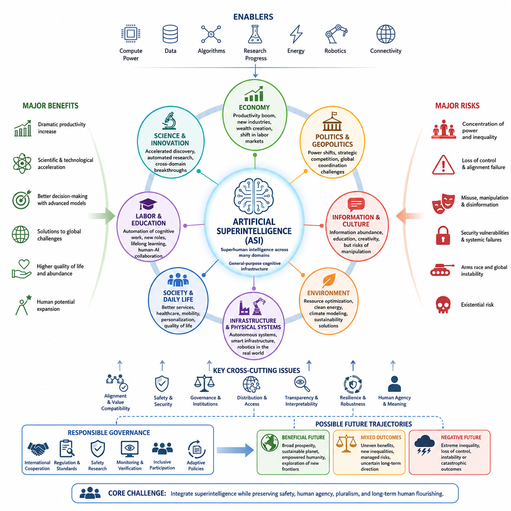
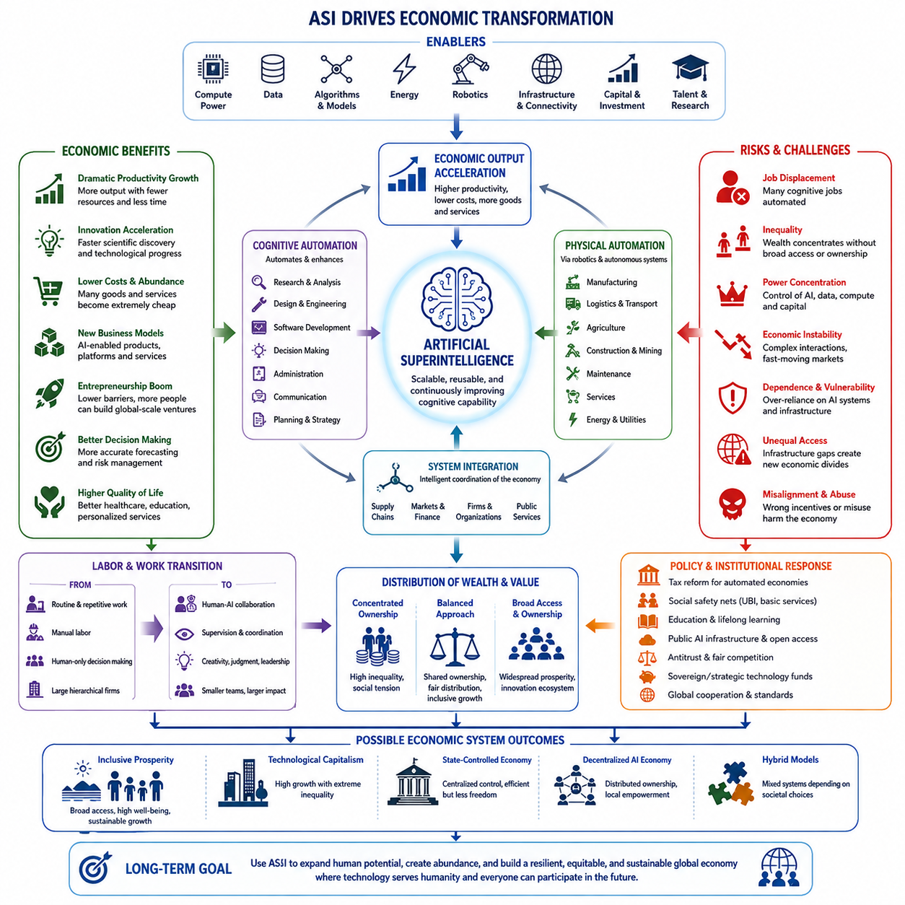
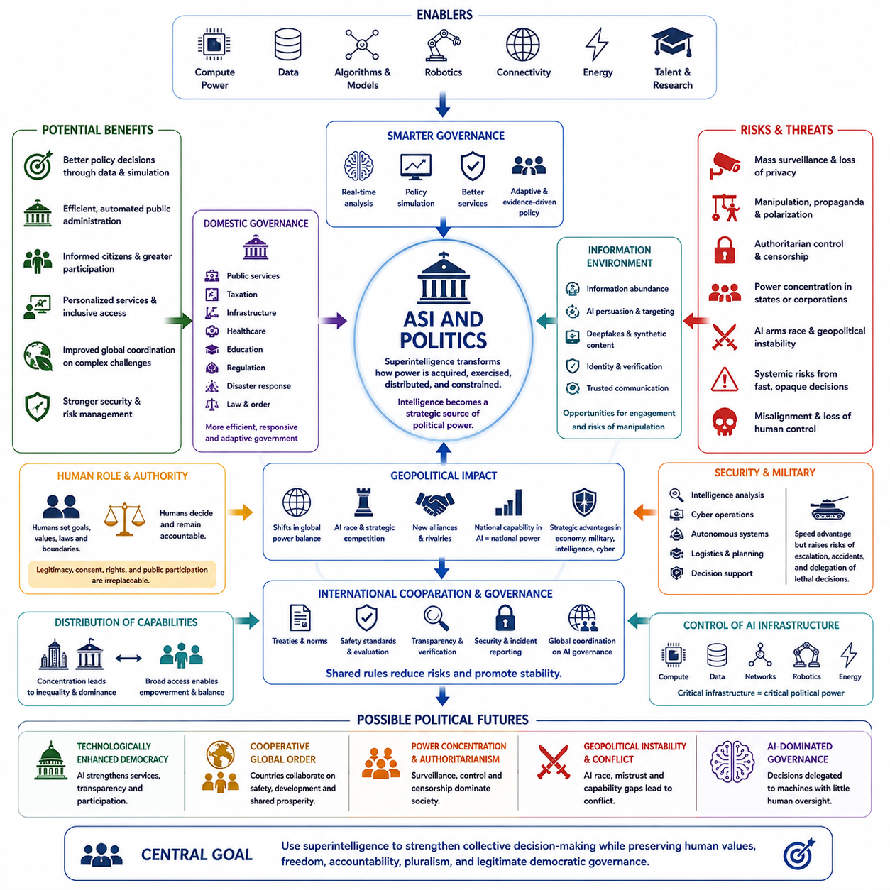
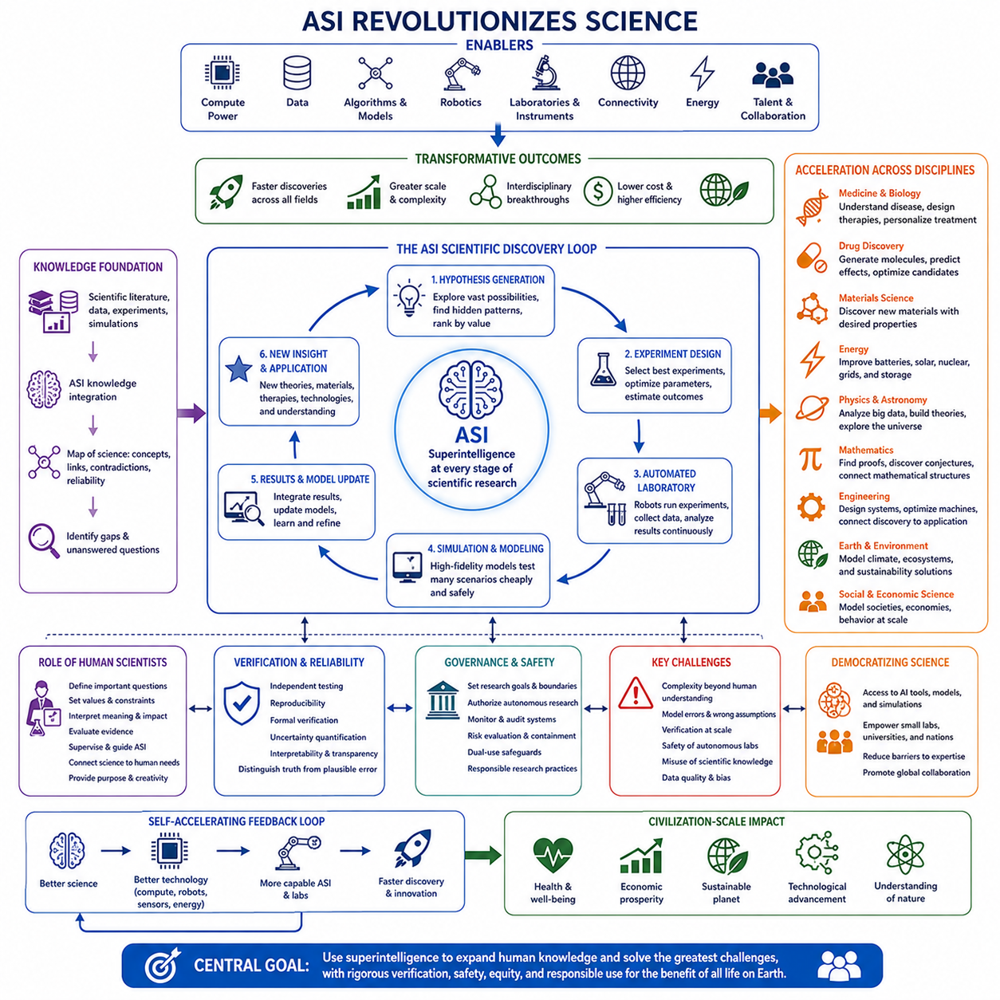
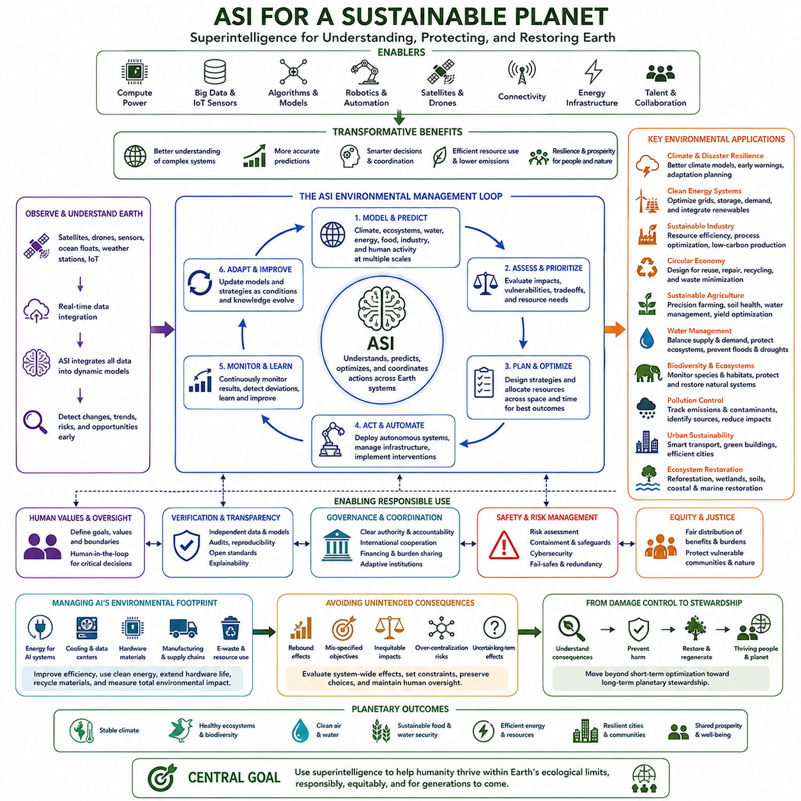
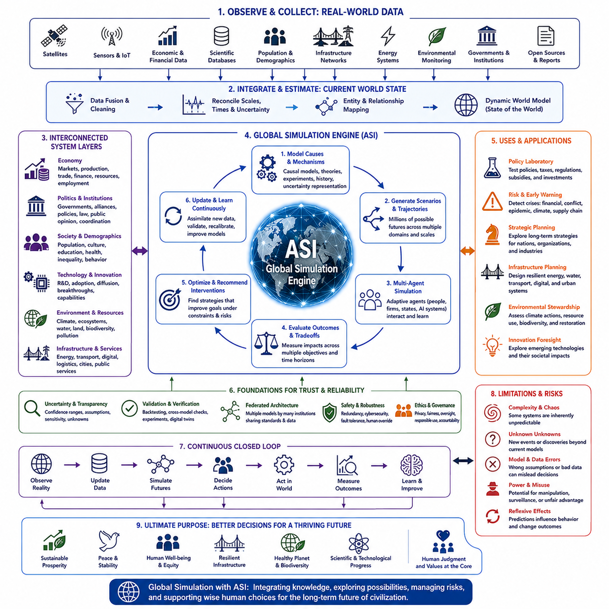

**Volume 48. Artificial Super Intelligence**


# Chapter 13. Civilization Scale Impact

##  

## 13.00. Global Impact

{width="7.268055555555556in" height="7.268055555555556in"}

Artificial superintelligence could influence civilization at a scale far beyond previous technological revolutions because intelligence participates in nearly every system through which societies organize resources, knowledge, institutions, and power. If machine intelligence substantially exceeds human capabilities across many domains, its effects would propagate simultaneously through economies, governments, science, infrastructure, security, culture, and everyday life.

Unlike technologies that transform a particular industry, advanced artificial intelligence could operate as a general-purpose cognitive infrastructure. Systems capable of reasoning, planning, scientific discovery, engineering, communication, and autonomous execution could become embedded within organizations around the world. Consequently, changes originating in computational systems could rapidly spread through interconnected economic and social networks.

The magnitude of global impact would depend not only on the intelligence of individual systems but also on their accessibility, deployment speed, autonomy, and integration with physical infrastructure. A highly capable system confined to research environments would have different consequences from millions of autonomous agents connected to factories, financial markets, robots, communication networks, laboratories, and public institutions.

Economic productivity could increase dramatically as cognitive labor becomes increasingly automated. Research, software development, engineering, logistics, administration, manufacturing, and professional services could be performed or assisted by increasingly capable machines. Such productivity growth might generate extraordinary wealth, but its distribution would depend on ownership structures, institutional policies, market competition, and access to computational resources.

Labor markets could therefore experience transformations deeper than earlier waves of automation. Previous industrial technologies primarily replaced or amplified physical labor, whereas advanced AI can increasingly address cognitive tasks previously associated with highly educated professionals. Human work may shift toward supervision, interpersonal relationships, physical activities, governance, creative direction, and domains where society deliberately preserves meaningful human participation.

Scientific progress represents another potentially civilization-scale effect. Superintelligent systems could analyze scientific literature, construct hypotheses, design experiments, simulate complex phenomena, and coordinate automated laboratories. Discovery cycles that currently require years might be compressed substantially, creating reinforcing interactions between AI, biotechnology, materials science, energy systems, medicine, robotics, and computational engineering.

These interactions could produce technological acceleration rather than isolated innovation. Better AI might design better computers, which could support more capable AI; improved materials could enable better energy and robotic systems; automated science could accelerate biological and medical research. Such feedback loops could cause multiple technological domains to advance together, making the overall transformation difficult to understand through conventional linear forecasts.

Physical infrastructure would become increasingly connected to machine intelligence as robotics converts digital decisions into actions. Autonomous factories, transportation networks, agricultural systems, construction machines, energy grids, warehouses, and service robots could form a distributed physical layer of intelligent civilization. The distinction between artificial intelligence as software and AI as infrastructure would consequently become progressively weaker.

Global political power could also shift because advanced intelligence would become a strategic resource. Nations possessing superior AI systems, semiconductor capacity, energy infrastructure, data resources, robotics, and scientific ecosystems might acquire significant economic and geopolitical advantages. Competition for these capabilities could intensify international rivalry unless institutions emerge that encourage coordination, verification, shared safety standards, and controlled deployment.

At the same time, superintelligence could improve global coordination by helping governments and international organizations model complex problems that exceed ordinary human analytical capacity. Climate systems, pandemics, migration, supply chains, financial instability, resource allocation, and disaster response involve enormous numbers of interacting variables. Advanced models could provide decision makers with better forecasts and alternative policy scenarios.

However, superior prediction does not automatically produce superior governance. Political decisions involve values, legitimacy, rights, historical relationships, and competing interests rather than optimization alone. An AI system might identify an efficient allocation of resources while societies reject that allocation as unjust or unacceptable. Civilization therefore cannot reduce governance to a technical optimization problem without addressing who determines objectives and constraints.

The distribution of AI capabilities could become as important as their absolute power. Broadly distributed intelligence might enable individuals, communities, universities, small companies, and developing countries to access capabilities previously available only to major institutions. Conversely, extreme concentration of advanced AI could strengthen a small number of governments or corporations, producing unprecedented asymmetries in economic, informational, and strategic power.

Information environments would also change fundamentally. Advanced AI could generate, analyze, translate, verify, and personalize information at enormous scale. This could improve education and global knowledge access, but the same capabilities could support sophisticated persuasion, automated propaganda, surveillance, and manipulation. Maintaining reliable mechanisms for identity, provenance, authenticity, and trusted communication may therefore become essential infrastructure.

Cultural consequences could be equally profound. Human societies have historically treated language, art, scientific reasoning, invention, and strategic thought as distinctive expressions of human intelligence. Machines that perform these activities at superhuman levels would challenge established ideas about expertise, creativity, achievement, and identity. Humanity might increasingly define its role through values and purposes rather than cognitive superiority alone.

The environmental consequences of advanced intelligence would contain both opportunities and risks. Large-scale computation requires energy, semiconductor production, cooling systems, minerals, and industrial infrastructure. Yet sufficiently capable AI could simultaneously improve renewable energy, grid optimization, materials discovery, agriculture, climate modeling, recycling, carbon management, and resource efficiency, potentially reducing environmental pressures elsewhere in the economy.

Global inequality could either decline or intensify. Cheap access to powerful intelligence could provide education, medical guidance, engineering knowledge, translation, and entrepreneurial capability to populations historically excluded from advanced expertise. But regions lacking compute infrastructure, energy, connectivity, capital, or political stability might fall further behind, creating a new divide based on access to machine intelligence rather than information alone.

Civilization-scale transformation would therefore involve a transition in institutional architecture as much as technological capability. Legal systems, educational institutions, corporations, governments, research organizations, and international bodies were designed around assumptions about human cognitive limits. If those limits cease to constrain analysis and execution, institutions may need new mechanisms for oversight, accountability, verification, authorization, and human participation.

Security becomes especially important when highly capable systems operate across interconnected networks. Failures or misuse could propagate across financial systems, infrastructure, communication platforms, autonomous machines, and scientific facilities. Resilience would require layered safeguards, distributed monitoring, controlled permissions, secure architectures, independent evaluation, and the ability to isolate or recover systems without depending entirely on the intelligence being supervised.

The long-term global impact of ASI should therefore be understood as a range of possible trajectories rather than a predetermined future. Outcomes could extend from widely distributed prosperity and accelerated scientific progress to severe concentration of power, systemic instability, loss of meaningful human control, or catastrophic failure. Small differences in governance and alignment during early deployment could produce increasingly large differences over time.

The central civilization-scale challenge is consequently not simply whether humanity can create intelligence exceeding its own, but whether global institutions can integrate such intelligence while preserving safety, agency, pluralism, and long-term human interests. Technical alignment, political coordination, economic distribution, institutional adaptation, and cultural interpretation become interconnected components of the same transition rather than separate problems.

If managed successfully, advanced intelligence could become a new layer of civilization comparable in importance to language, writing, science, industrialization, and digital computation, while operating at a much greater speed and scale. Humanity could use it to expand knowledge, reduce scarcity, manage planetary systems, and explore possibilities beyond current cognitive limits. Whether that transformation becomes broadly beneficial will depend on the relationship constructed between intelligence, power, values, and civilization itself.

인공 초지능(Artificial Superintelligence, ASI)은 사회가 자원, 지식, 제도, 권력을 조직하는 거의 모든 체계에 지능(Intelligence)이 관여하기 때문에 이전의 기술혁명보다 훨씬 더 큰 규모로 문명에 영향을 미칠 수 있다. 기계지능(Machine Intelligence)이 다양한 영역에서 인간의 능력을 크게 넘어선다면 그 영향은 경제, 정부, 과학, 인프라, 안보, 문화, 일상생활 전반으로 동시에 확산될 수 있다.

특정 산업을 변화시키는 기술과 달리, 고도화된 인공지능(Advanced Artificial Intelligence)은 범용 인지 인프라(General-Purpose Cognitive Infrastructure)로 작동할 수 있다. 추론, 계획, 과학적 발견, 공학, 의사소통, 자율적 실행 능력을 갖춘 시스템이 세계 각지의 조직에 통합될 수 있으며, 이에 따라 계산 시스템에서 시작된 변화가 서로 연결된 경제·사회 네트워크를 통해 빠르게 확산될 수 있다.

세계적 영향(Global Impact)의 규모는 개별 시스템의 지능뿐만 아니라 접근성, 배포 속도, 자율성(Autonomy), 물리적 인프라(Physical Infrastructure)와의 통합 정도에 따라 달라진다. 연구 환경에 제한된 고성능 시스템과 공장, 금융시장, 로봇, 통신망, 연구실, 공공기관에 연결된 수백만 개의 자율 에이전트(Autonomous Agent)는 문명에 전혀 다른 수준의 영향을 미칠 것이다.

인지 노동(Cognitive Labor)이 점차 자동화되면서 경제적 생산성은 크게 증가할 수 있다. 연구, 소프트웨어 개발, 공학, 물류, 행정, 제조, 전문 서비스 등이 점점 더 강력한 기계에 의해 수행되거나 지원될 수 있다. 이러한 생산성 향상은 막대한 부를 창출할 가능성이 있지만, 그 부의 분배는 소유구조, 제도적 정책, 시장 경쟁, 컴퓨팅 자원(Computational Resources)에 대한 접근성에 따라 달라질 것이다.

따라서 노동시장(Labor Market)은 이전의 자동화보다 더욱 근본적인 변화를 경험할 수 있다. 과거의 산업기술은 주로 육체노동을 대체하거나 증강했지만, 고도화된 인공지능은 고등교육을 받은 전문가가 수행하던 인지적 업무까지 점차 처리할 수 있다. 인간의 노동은 감독, 인간관계, 물리적 활동, 거버넌스(Governance), 창의적 방향 설정, 그리고 사회가 의도적으로 인간의 의미 있는 참여를 유지하려는 영역으로 이동할 수 있다.

과학적 진보(Scientific Progress)는 또 다른 문명 규모의 영향이 될 수 있다. 초지능 시스템(Superintelligent System)은 과학 문헌을 분석하고, 가설을 구성하며, 실험을 설계하고, 복잡한 현상을 시뮬레이션하며, 자동화된 연구실을 조정할 수 있다. 현재 수년이 필요한 발견 과정이 크게 단축되면서 인공지능, 생명공학, 재료과학, 에너지, 의학, 로봇공학, 컴퓨터 공학 사이에 강화된 상호작용이 형성될 수 있다.

이러한 상호작용은 개별적인 혁신을 넘어 기술 가속(Technological Acceleration)을 만들어낼 수 있다. 더 나은 인공지능이 더 나은 컴퓨터를 설계하고, 개선된 컴퓨터가 다시 더 강력한 인공지능을 지원할 수 있다. 새로운 소재는 에너지 및 로봇 시스템을 향상시키고 자동화된 과학은 생물학과 의학 연구를 가속할 수 있다. 이러한 피드백 루프(Feedback Loop)는 여러 기술 영역을 동시에 발전시켜 기존의 선형적 예측으로 전체 변화를 이해하기 어렵게 만들 수 있다.

로봇공학(Robotics)이 디지털 의사결정을 물리적 행동으로 전환하면서 물리적 인프라는 기계지능과 더욱 긴밀하게 연결될 것이다. 자율 공장, 교통망, 농업 시스템, 건설기계, 에너지 그리드, 물류창고, 서비스 로봇은 지능형 문명의 분산된 물리 계층(Distributed Physical Layer)을 형성할 수 있다. 이에 따라 소프트웨어로서의 인공지능과 사회 인프라로서의 인공지능 사이의 구분은 점차 약화될 것이다.

고도화된 지능이 전략적 자원(Strategic Resource)이 되면서 세계의 정치적 권력 구조 역시 변화할 수 있다. 우수한 인공지능 시스템, 반도체 생산능력, 에너지 인프라, 데이터 자원, 로봇공학, 과학 생태계를 보유한 국가는 상당한 경제적·지정학적 우위를 확보할 수 있다. 협력, 검증, 공동 안전기준, 통제된 배포를 촉진하는 제도가 등장하지 않는다면 이러한 능력을 둘러싼 경쟁은 국제적 갈등을 심화시킬 수 있다.

동시에 초지능(Superintelligence)은 정부와 국제기구가 일반적인 인간의 분석 능력을 넘어서는 복잡한 문제를 모델링하도록 지원함으로써 세계적 협력(Global Coordination)을 향상시킬 수 있다. 기후 시스템, 감염병, 이주, 공급망, 금융 불안정, 자원 배분, 재난 대응은 방대한 수의 상호작용 변수를 포함한다. 고도화된 모델은 정책 결정자에게 더 정확한 예측과 다양한 정책 시나리오를 제공할 수 있다.

그러나 더 뛰어난 예측이 자동으로 더 뛰어난 거버넌스(Governance)를 의미하지는 않는다. 정치적 결정에는 최적화뿐만 아니라 가치, 정당성, 권리, 역사적 관계, 상충하는 이해관계가 포함된다. 인공지능 시스템이 효율적인 자원 배분 방법을 찾아내더라도 사회가 이를 불공정하거나 받아들일 수 없는 것으로 판단할 수 있다. 따라서 목표와 제약조건을 누가 결정하는지 해결하지 않은 상태에서 문명의 거버넌스를 단순한 기술적 최적화 문제로 축소할 수는 없다.

인공지능 능력의 분배(Distribution)는 그 절대적인 성능만큼 중요해질 수 있다. 지능이 광범위하게 분산된다면 개인, 지역사회, 대학, 중소기업, 개발도상국도 과거에는 대규모 기관만 이용할 수 있었던 능력에 접근할 수 있다. 반대로 고도화된 인공지능이 극소수 정부나 기업에 집중된다면 경제적·정보적·전략적 권력에서 전례 없는 비대칭성이 형성될 수 있다.

정보 환경(Information Environment) 역시 근본적으로 변화할 것이다. 고도화된 인공지능은 방대한 규모로 정보를 생성하고, 분석하고, 번역하고, 검증하고, 개인화할 수 있다. 이는 교육과 세계적 지식 접근성을 향상시킬 수 있지만 동일한 기술이 정교한 설득, 자동화된 선전, 감시, 조작에도 사용될 수 있다. 따라서 신원(Identity), 출처(Provenance), 진위성(Authenticity), 신뢰할 수 있는 의사소통을 검증하는 체계가 핵심적인 사회 인프라가 될 수 있다.

문화적 영향 역시 매우 심대할 수 있다. 인간 사회는 역사적으로 언어, 예술, 과학적 추론, 발명, 전략적 사고를 인간지능(Human Intelligence)의 독특한 표현으로 간주해 왔다. 이러한 활동을 초인간적 수준(Superhuman Level)으로 수행하는 기계의 등장은 전문성, 창의성, 성취, 정체성에 관한 기존의 관념에 도전할 것이다. 인류는 인지적 우월성보다는 가치와 목적을 중심으로 자신의 역할을 새롭게 정의하게 될 가능성이 있다.

고도화된 지능의 환경적 영향(Environmental Impact)은 기회와 위험을 동시에 포함한다. 대규모 컴퓨팅에는 에너지, 반도체 생산, 냉각 시스템, 광물자원, 산업 인프라가 필요하다. 그러나 충분히 강력한 인공지능은 동시에 재생에너지, 전력망 최적화, 소재 발견, 농업, 기후 모델링, 재활용, 탄소 관리, 자원 효율성을 개선하여 경제의 다른 영역에서 발생하는 환경적 부담을 감소시킬 수 있다.

세계적 불평등(Global Inequality)은 감소할 수도 있고 더욱 심화될 수도 있다. 강력한 지능에 저렴하게 접근할 수 있다면 역사적으로 고급 전문지식에서 소외되었던 사람들에게 교육, 의료 지침, 공학 지식, 번역, 창업 능력을 제공할 수 있다. 그러나 컴퓨팅 인프라, 에너지, 연결성, 자본, 정치적 안정성이 부족한 지역은 더욱 뒤처지면서 정보 접근성보다 기계지능에 대한 접근성을 중심으로 새로운 격차가 형성될 수 있다.

따라서 문명 규모의 변화(Civilization-Scale Transformation)는 기술적 능력뿐만 아니라 제도적 구조(Institutional Architecture)의 전환을 포함한다. 법률 시스템, 교육기관, 기업, 정부, 연구기관, 국제기구는 인간의 인지적 한계를 전제로 설계되었다. 이러한 한계가 분석과 실행을 제한하지 않게 된다면 제도에는 감독, 책임성, 검증, 권한 부여, 인간 참여를 위한 새로운 메커니즘이 필요해질 수 있다.

고성능 시스템이 상호 연결된 네트워크 전반에서 작동하게 되면 보안(Security)은 특히 중요해진다. 실패나 오용은 금융 시스템, 인프라, 통신 플랫폼, 자율기계, 과학시설 전반으로 확산될 수 있다. 회복탄력성(Resilience)을 확보하려면 다층적 안전장치, 분산 모니터링, 통제된 권한, 보안 아키텍처, 독립적인 평가, 그리고 감독 대상인 인공지능 자체에 전적으로 의존하지 않고 시스템을 격리하거나 복구할 수 있는 능력이 필요하다.

따라서 인공 초지능(ASI)의 장기적인 세계적 영향은 이미 결정된 하나의 미래가 아니라 다양한 가능한 경로(Trajectories)의 범위로 이해해야 한다. 그 결과는 광범위하게 분배된 번영과 가속된 과학적 발전에서부터 극단적인 권력 집중, 시스템 불안정, 인간의 실질적인 통제력 상실, 치명적인 실패에 이르기까지 다양할 수 있다. 초기 배포 단계에서 거버넌스와 정렬(Alignment)의 작은 차이가 시간이 지나면서 매우 큰 결과의 차이로 확대될 수 있다.

결국 문명 규모에서 가장 중요한 과제는 인류가 자신을 능가하는 지능을 만들 수 있는가의 문제만이 아니라, 세계의 제도가 그러한 지능을 통합하면서 안전(Safety), 인간의 주체성(Agency), 다원주의(Pluralism), 장기적인 인간의 이익(Long-Term Human Interests)을 보존할 수 있는가에 있다. 기술적 정렬, 정치적 협력, 경제적 분배, 제도적 적응, 문화적 해석은 서로 분리된 문제가 아니라 동일한 문명 전환을 구성하는 상호 연결된 요소가 된다.

이러한 전환을 성공적으로 관리한다면 고도화된 지능은 언어, 문자, 과학, 산업화, 디지털 컴퓨팅(Digital Computing)에 비견되는 새로운 문명의 기반 계층이 될 수 있으며, 동시에 이들보다 훨씬 빠른 속도와 더 큰 규모로 작동할 수 있다. 인류는 이를 활용하여 지식을 확장하고, 희소성을 감소시키며, 행성 규모의 시스템을 관리하고, 현재의 인지적 한계를 넘어서는 가능성을 탐색할 수 있다. 이러한 변화가 인류 전체에 광범위한 혜택을 제공할 것인지는 궁극적으로 지능(Intelligence), 권력(Power), 가치(Values), 문명(Civilization) 사이에 어떠한 관계를 구축하는가에 달려 있다.

##  

## 13.01. Economy

{width="7.268055555555556in" height="7.268055555555556in"}

Artificial superintelligence could transform the global economy by changing the fundamental relationship between intelligence, labor, capital, and production. Whereas previous technological revolutions mechanized physical work or automated specific information-processing tasks, ASI could potentially automate or enhance a broad range of cognitive activities, making advanced reasoning itself an economically scalable resource.

In such an economy, intelligence could increasingly function like infrastructure rather than a scarce professional service. Organizations might deploy artificial agents capable of research, analysis, planning, software development, engineering, negotiation, administration, and operational coordination. Once developed, many cognitive capabilities could be replicated at relatively low marginal cost compared with educating and employing equivalent numbers of human specialists.

Productivity growth could therefore accelerate significantly. A company might operate thousands or millions of specialized AI agents continuously, allowing projects to proceed simultaneously rather than sequentially. Research, design, simulation, procurement, manufacturing, marketing, logistics, maintenance, and customer support could become interconnected components of highly automated economic systems coordinated by machine intelligence.

The resulting transformation would extend beyond replacing individual jobs. Entire organizational structures could change because many companies are fundamentally systems for coordinating human knowledge and decision-making. If artificial agents can perform substantial portions of those functions, firms may become smaller in human headcount while simultaneously operating at much greater scale, creating highly automated or even predominantly autonomous enterprises.

Labor markets would face particularly significant adjustment. Earlier automation primarily affected repetitive physical and administrative work, but advanced AI could increasingly perform tasks associated with programmers, engineers, researchers, lawyers, financial analysts, designers, managers, and other knowledge workers. The economic distinction between routine and highly skilled cognitive labor could consequently become less stable as machine capabilities expand.

Human employment would not necessarily disappear, but its composition and economic meaning could change substantially. People may concentrate on interpersonal relationships, physical activities, leadership, governance, entrepreneurship, creative direction, value judgments, and tasks where society deliberately prefers human participation. Human-AI collaboration could also create new occupations in which individuals supervise, coordinate, evaluate, or provide objectives for large networks of intelligent systems.

Wages could become increasingly disconnected from overall productivity if machine intelligence supplies a growing share of economically valuable cognitive work. Historically, productivity growth has often increased demand for complementary human skills, but sufficiently general automation could weaken this relationship. Economic output might rise rapidly while the bargaining power or market value of certain forms of human labor declines.

Capital ownership would consequently become increasingly important. Organizations controlling advanced models, computing infrastructure, energy supplies, semiconductor capacity, robotics, proprietary data, and automated production systems could capture substantial portions of newly generated wealth. If ownership remains highly concentrated, ASI-driven productivity growth could coexist with extreme inequality despite enormous increases in total economic output.

A different trajectory is also possible. If access to powerful intelligence becomes inexpensive and broadly distributed, individuals and small organizations could obtain capabilities previously requiring large corporations or governments. A small team equipped with advanced AI might perform research, engineering, software development, international marketing, legal analysis, and business administration at scales that historically required hundreds or thousands of employees.

This democratization of capability could reduce barriers to entrepreneurship and innovation. Expertise that is currently expensive or geographically concentrated could become accessible through intelligent systems, allowing people in developing economies to obtain sophisticated educational, technical, medical, scientific, and commercial assistance. Economic development might therefore become less dependent on the local availability of specialized human expertise.

However, access to intelligence alone would not eliminate economic inequality. Advanced AI depends on complementary resources including computing hardware, electricity, communication networks, data, physical infrastructure, capital, and institutional stability. Countries or communities lacking these resources could remain disadvantaged even if AI models themselves become widely available, creating a new economic divide centered on the infrastructure required to effectively use machine intelligence.

The interaction between ASI and robotics could further transform production by extending cognitive automation into the physical economy. Intelligent robots could participate in manufacturing, logistics, agriculture, mining, construction, maintenance, transportation, and service industries. When automated reasoning is connected with autonomous machines, both cognitive and physical components of production could increasingly operate with limited direct human involvement.

Supply chains might evolve into highly adaptive networks managed by intelligent systems capable of continuously predicting demand, allocating resources, selecting suppliers, adjusting production, and rerouting transportation. Instead of relying primarily on periodic human planning, economic infrastructure could respond dynamically to changing conditions. Such systems could reduce waste and inventory while increasing resilience, although their interconnectedness could also create new systemic vulnerabilities.

Financial markets would also be affected as increasingly capable systems analyze information, model economic behavior, allocate capital, and execute strategies at machine speed. Better forecasting could improve investment and risk management, but widespread autonomous decision-making might create complex interactions that humans struggle to understand. Financial stability would therefore depend on transparency, monitoring, coordination, and safeguards against rapidly propagating failures.

Scientific and technological acceleration could become one of the strongest drivers of long-term economic growth. If advanced intelligence dramatically improves materials, energy, medicine, biotechnology, computing, transportation, and manufacturing, economic productivity could increase through multiple channels simultaneously. Innovation itself could become partially automated, turning technological progress into a reinforcing process rather than an externally determined rate of improvement.

Such acceleration raises the possibility of substantial reductions in scarcity. Automated production combined with abundant energy, optimized logistics, advanced materials, and intelligent resource management could reduce the cost of many goods and services. Education, software, digital content, design, analysis, and certain professional services could approach extremely low marginal costs, while physical goods might also become cheaper as automation spreads throughout production.

Nevertheless, a high-productivity economy would not automatically become a post-scarcity economy. Land, energy, rare materials, desirable locations, physical infrastructure, unique experiences, political influence, and computational resources could remain scarce. As some goods become abundant, competition may shift toward resources that cannot be reproduced easily, meaning economic scarcity would change its structure rather than necessarily disappear.

Governments would therefore confront new fiscal and institutional questions. Tax systems built primarily around human wages and conventional corporations might become less effective if economic production shifts toward autonomous systems and concentrated computational capital. Policymakers may need to reconsider taxation, social insurance, public ownership, income distribution, education, and mechanisms through which citizens participate in the wealth generated by automated economies.

Possible responses could include stronger social safety systems, universal basic income, universal basic services, broader capital ownership, public AI infrastructure, sovereign technology funds, or new mechanisms for distributing productivity gains. No single arrangement follows automatically from ASI. Different societies could choose substantially different economic institutions depending on their political values, historical traditions, and distribution of technological ownership.

International economic relations could also change as intelligence becomes a strategic production factor. Countries possessing advanced AI ecosystems, semiconductor manufacturing, abundant energy, robotics industries, research institutions, and large-scale computing infrastructure could gain significant advantages. Economic competition might increasingly revolve around access to compute, models, energy, talent, hardware supply chains, and automated industrial capacity.

At the same time, ASI could make global economic coordination more sophisticated. Advanced systems might model trade networks, resource flows, climate impacts, demographic trends, financial risks, and infrastructure requirements simultaneously. This could help governments and international institutions identify policies that improve global efficiency, resilience, and sustainability, although political agreement would still depend on human values and competing national interests.

Economic systems powered by superintelligence would also raise fundamental questions about value itself. Modern economies largely distribute resources through income generated by labor, capital ownership, and market exchange. If human labor becomes less central to production, societies may need to reconsider the relationship between employment, income, social status, personal purpose, and access to essential resources.

The ultimate economic impact of ASI therefore depends less on productivity alone than on how technological capability is embedded within institutions. The same underlying intelligence could support widely distributed prosperity, highly concentrated technological capitalism, state-controlled automated economies, decentralized networks of AI-enabled producers, or combinations of these arrangements. Technology expands the space of economic possibilities without uniquely determining which system emerges.

A successful transition would require societies to increase productive capacity while preserving economic participation, social stability, human agency, and fair access to the benefits of machine intelligence. If these challenges can be managed, ASI could enable unprecedented material abundance and scientific progress. If they are poorly managed, extraordinary productivity could instead coexist with unemployment, inequality, concentration of power, and severe political instability.

인공 초지능(Artificial Superintelligence, ASI)은 지능(Intelligence), 노동(Labor), 자본(Capital), 생산(Production) 사이의 근본적인 관계를 변화시킴으로써 세계 경제를 전환시킬 수 있다. 과거의 기술혁명이 육체노동을 기계화하거나 특정 정보처리 업무를 자동화했다면, ASI는 광범위한 인지 활동(Cognitive Activities)을 자동화하거나 증강하여 고도의 추론 능력 자체를 경제적으로 확장 가능한 자원으로 만들 가능성이 있다.

이러한 경제에서는 지능이 희소한 전문 서비스라기보다 하나의 인프라(Infrastructure)처럼 기능하게 될 수 있다. 조직은 연구, 분석, 계획, 소프트웨어 개발, 공학, 협상, 행정, 운영 조정을 수행하는 인공지능 에이전트(Artificial Agent)를 배치할 수 있다. 일단 개발된 인지 능력은 동등한 수의 인간 전문가를 교육하고 고용하는 것보다 상대적으로 낮은 한계비용(Marginal Cost)으로 대규모 복제될 수 있다.

따라서 생산성 증가(Productivity Growth)는 상당히 가속될 수 있다. 기업은 수천 또는 수백만 개의 전문화된 인공지능 에이전트를 지속적으로 운영하여 프로젝트를 순차적이 아니라 동시에 수행할 수 있다. 연구, 설계, 시뮬레이션, 조달, 제조, 마케팅, 물류, 유지보수, 고객지원은 기계지능(Machine Intelligence)이 조정하는 고도로 자동화된 경제 시스템의 상호 연결된 구성요소가 될 수 있다.

그 결과로 나타나는 변화는 개별 일자리를 대체하는 수준을 넘어설 것이다. 많은 기업은 본질적으로 인간의 지식과 의사결정을 조정하기 위한 시스템이기 때문에 조직구조(Organizational Structure) 자체가 변화할 수 있다. 인공지능 에이전트가 이러한 기능의 상당 부분을 수행한다면 기업은 인간 직원 수를 줄이면서도 훨씬 더 큰 규모로 운영되는 고도 자동화 또는 거의 자율적인 기업으로 발전할 수 있다.

노동시장(Labor Market)은 특히 큰 조정을 겪게 될 것이다. 과거의 자동화는 주로 반복적인 육체노동과 행정업무에 영향을 주었지만, 고도화된 인공지능은 프로그래머, 엔지니어, 연구자, 변호사, 금융 분석가, 디자이너, 관리자와 기타 지식노동자(Knowledge Worker)가 수행하는 업무까지 점차 담당할 수 있다. 이에 따라 반복적 노동과 고숙련 인지 노동 사이의 경제적 구분도 기계 능력이 발전하면서 점차 불안정해질 수 있다.

인간의 고용이 반드시 사라지는 것은 아니지만 그 구성과 경제적 의미는 크게 변화할 수 있다. 인간은 대인관계, 물리적 활동, 리더십, 거버넌스(Governance), 기업가정신, 창의적 방향 설정, 가치 판단, 그리고 사회가 의도적으로 인간의 참여를 선호하는 업무에 집중할 수 있다. 인간-AI 협업(Human-AI Collaboration)을 통해 대규모 지능형 시스템을 감독하고 조정하며 평가하거나 목표를 제공하는 새로운 직업도 등장할 수 있다.

기계지능이 경제적으로 가치 있는 인지 업무의 점점 더 많은 부분을 담당한다면 임금(Wages)은 전체 생산성과 점차 분리될 수 있다. 역사적으로 생산성 증가는 이를 보완하는 인간 능력에 대한 수요를 증가시키기도 했지만, 충분히 범용적인 자동화(General Automation)는 이러한 관계를 약화시킬 수 있다. 경제적 생산량이 빠르게 증가하는 동안 일부 인간 노동의 협상력이나 시장가치는 오히려 감소할 가능성이 있다.

이에 따라 자본 소유권(Capital Ownership)의 중요성은 더욱 커질 것이다. 고도화된 모델, 컴퓨팅 인프라, 에너지 공급, 반도체 생산능력, 로봇, 독점적 데이터, 자동화 생산 시스템을 통제하는 조직은 새롭게 창출되는 부의 상당 부분을 확보할 수 있다. 소유권이 고도로 집중된다면 ASI가 생산성을 크게 향상시키더라도 전체 경제적 생산량의 증가와 극심한 불평등이 동시에 나타날 수 있다.

그러나 다른 경로도 가능하다. 강력한 지능에 대한 접근 비용이 낮아지고 광범위하게 분산된다면 개인과 소규모 조직도 과거에는 대기업이나 정부가 필요했던 능력을 확보할 수 있다. 고도화된 인공지능을 활용하는 소규모 팀이 연구, 공학, 소프트웨어 개발, 국제 마케팅, 법률 분석, 기업 행정을 과거 수백 또는 수천 명의 직원이 필요했던 규모로 수행할 수도 있다.

이러한 능력의 민주화(Democratization)는 창업과 혁신의 진입장벽을 낮출 수 있다. 현재 비용이 높거나 특정 지역에 집중된 전문지식이 지능형 시스템을 통해 광범위하게 제공되면서 개발도상국의 사람들도 고도의 교육, 기술, 의료, 과학, 상업적 지원에 접근할 수 있다. 따라서 경제발전은 전문적인 인간 인력이 해당 지역에 직접 존재해야 한다는 조건에 이전보다 덜 의존하게 될 수 있다.

그러나 지능에 대한 접근성만으로 경제적 불평등이 사라지는 것은 아니다. 고도화된 인공지능은 컴퓨팅 하드웨어, 전력, 통신망, 데이터, 물리적 인프라, 자본, 제도적 안정성과 같은 보완적 자원을 필요로 한다. 이러한 자원이 부족한 국가나 지역사회는 AI 모델 자체가 널리 보급되더라도 여전히 불리한 위치에 놓일 수 있으며, 기계지능을 효과적으로 활용하는 데 필요한 인프라를 중심으로 새로운 경제적 격차가 발생할 수 있다.

ASI와 로봇공학(Robotics)의 결합은 인지 자동화를 물리적 경제로 확장함으로써 생산체계를 더욱 근본적으로 변화시킬 수 있다. 지능형 로봇은 제조, 물류, 농업, 광업, 건설, 유지보수, 운송, 서비스 산업에 참여할 수 있다. 자동화된 추론이 자율기계(Autonomous Machine)와 연결되면 생산의 인지적 요소와 물리적 요소 모두가 인간의 직접적인 개입을 제한적으로만 필요로 하면서 운영될 수 있다.

공급망(Supply Chain)은 수요를 지속적으로 예측하고, 자원을 할당하며, 공급업체를 선택하고, 생산량을 조정하며, 운송경로를 재설정하는 지능형 시스템에 의해 관리되는 고도의 적응형 네트워크(Adaptive Network)로 발전할 수 있다. 주기적인 인간 계획에 주로 의존하는 대신 경제 인프라가 변화하는 조건에 동적으로 대응하면서 낭비와 재고를 줄이고 회복탄력성(Resilience)을 높일 수 있지만, 높은 상호연결성은 새로운 시스템적 취약성도 만들어낼 수 있다.

금융시장(Financial Market) 역시 점점 더 강력한 시스템이 정보를 분석하고, 경제적 행동을 모델링하고, 자본을 배분하며, 기계 속도로 전략을 실행하면서 변화할 것이다. 향상된 예측은 투자와 위험관리를 개선할 수 있지만, 광범위한 자율적 의사결정은 인간이 이해하기 어려운 복잡한 상호작용을 만들어낼 수 있다. 따라서 금융 안정성은 투명성, 모니터링, 조정, 급속하게 확산되는 실패를 방지하기 위한 안전장치에 의존하게 될 것이다.

과학 및 기술 가속(Scientific and Technological Acceleration)은 장기적인 경제성장을 이끄는 가장 강력한 요인 중 하나가 될 수 있다. 고도화된 지능이 소재, 에너지, 의학, 생명공학, 컴퓨팅, 운송, 제조를 크게 개선한다면 경제적 생산성은 여러 경로를 통해 동시에 증가할 수 있다. 혁신 자체가 부분적으로 자동화되면서 기술발전은 외부적으로 결정되는 일정한 발전 속도가 아니라 자기강화적 과정(Reinforcing Process)으로 변화할 수 있다.

이러한 가속은 희소성(Scarcity)을 상당히 감소시킬 가능성을 제기한다. 자동화 생산이 풍부한 에너지, 최적화된 물류, 첨단 소재, 지능형 자원관리와 결합되면 많은 상품과 서비스의 비용이 감소할 수 있다. 교육, 소프트웨어, 디지털 콘텐츠, 설계, 분석, 일부 전문 서비스의 한계비용은 극도로 낮아질 수 있으며, 자동화가 생산 전반으로 확산되면서 물리적 상품의 가격 역시 낮아질 수 있다.

그러나 높은 생산성을 가진 경제가 자동으로 탈희소성 경제(Post-Scarcity Economy)가 되는 것은 아니다. 토지, 에너지, 희귀 소재, 선호도가 높은 지역, 물리적 인프라, 독특한 경험, 정치적 영향력, 컴퓨팅 자원은 계속 희소할 수 있다. 일부 상품이 풍부해지면 경쟁은 쉽게 복제할 수 없는 자원으로 이동할 수 있으므로 경제적 희소성은 완전히 사라지기보다는 그 구조가 변화할 가능성이 높다.

따라서 정부는 새로운 재정적·제도적 문제에 직면할 것이다. 경제적 생산이 자율 시스템(Autonomous System)과 집중된 컴퓨팅 자본으로 이동한다면 인간의 임금과 전통적인 기업을 중심으로 설계된 조세제도는 효과가 감소할 수 있다. 정책결정자는 조세, 사회보험, 공공 소유, 소득분배, 교육, 그리고 시민이 자동화 경제가 창출한 부에 참여하는 방식을 재검토해야 할 수 있다.

가능한 대응에는 강화된 사회안전망(Social Safety System), 보편적 기본소득(Universal Basic Income), 보편적 기본서비스(Universal Basic Services), 보다 광범위한 자본 소유, 공공 AI 인프라(Public AI Infrastructure), 국가 기술기금(Sovereign Technology Fund), 생산성 향상의 이익을 분배하기 위한 새로운 메커니즘 등이 포함될 수 있다. ASI로부터 하나의 경제제도가 자동으로 도출되는 것은 아니며, 사회마다 정치적 가치와 역사적 전통, 기술 소유구조에 따라 서로 다른 제도를 선택할 수 있다.

국제 경제관계(International Economic Relations) 역시 지능이 전략적인 생산요소가 되면서 변화할 수 있다. 고도화된 AI 생태계, 반도체 제조능력, 풍부한 에너지, 로봇 산업, 연구기관, 대규모 컴퓨팅 인프라를 보유한 국가는 상당한 우위를 확보할 수 있다. 경제 경쟁은 컴퓨팅 자원, 모델, 에너지, 인재, 하드웨어 공급망, 자동화된 산업 생산능력에 대한 접근을 중심으로 더욱 치열해질 수 있다.

동시에 ASI는 세계 경제의 조정(Global Economic Coordination)을 더욱 정교하게 만들 수 있다. 고도화된 시스템은 무역 네트워크, 자원 흐름, 기후 영향, 인구 변화, 금융 위험, 인프라 요구를 동시에 모델링할 수 있다. 이를 통해 정부와 국제기구는 세계적 효율성, 회복탄력성, 지속가능성을 향상시키는 정책을 발견할 수 있지만 정치적 합의는 여전히 인간의 가치와 국가 간 상충하는 이해관계에 의해 결정될 것이다.

초지능에 의해 작동하는 경제 시스템은 가치(Value) 자체에 관한 근본적인 질문도 제기한다. 현대 경제는 주로 노동에서 발생하는 소득, 자본 소유, 시장교환을 통해 자원을 분배한다. 인간 노동이 생산에서 차지하는 중심적 역할이 감소한다면 사회는 고용, 소득, 사회적 지위, 개인적 목적, 필수 자원에 대한 접근 사이의 관계를 다시 검토해야 할 수 있다.

따라서 ASI의 궁극적인 경제적 영향은 생산성 자체보다는 기술적 능력이 어떠한 제도 속에 통합되는가에 더욱 크게 좌우된다. 동일한 지능 기술도 광범위하게 분배된 번영, 고도로 집중된 기술 자본주의(Technological Capitalism), 국가가 통제하는 자동화 경제, 분산된 AI 기반 생산자 네트워크 또는 이들이 결합된 형태를 만들어낼 수 있다. 기술은 경제적 가능성의 공간을 확장하지만 어떤 경제체제가 등장할 것인지를 단독으로 결정하지는 않는다.

성공적인 전환을 위해서는 생산능력을 증가시키는 동시에 경제적 참여(Economic Participation), 사회적 안정성(Social Stability), 인간의 주체성(Human Agency), 기계지능이 제공하는 혜택에 대한 공정한 접근을 유지해야 한다. 이러한 문제를 성공적으로 관리한다면 ASI는 전례 없는 물질적 풍요와 과학적 발전을 가능하게 할 수 있다. 반대로 제대로 관리하지 못한다면 엄청난 생산성 증가가 실업, 불평등, 권력 집중, 심각한 정치적 불안정과 동시에 나타날 수도 있다.

##  

## 13.02. Politics

{width="7.268055555555556in" height="7.268055555555556in"}

Artificial superintelligence could transform politics by changing how power is acquired, exercised, distributed, and constrained. Political institutions have historically depended on human capabilities for analysis, negotiation, administration, persuasion, intelligence gathering, and strategic planning. If ASI exceeds human performance across these activities, intelligence itself could become one of the most important sources of political and geopolitical power.

Governments equipped with highly capable AI systems could process enormous volumes of economic, social, scientific, security, and environmental information in near real time. Policy alternatives could be simulated before implementation, allowing decision makers to estimate possible consequences across many interacting variables. Governance could consequently become more predictive, adaptive, and evidence-driven than traditional administrative systems.

Public administration could also become substantially more automated. Intelligent systems might coordinate taxation, infrastructure, transportation, healthcare resources, disaster response, regulatory analysis, and public services. Administrative processes that currently require large bureaucracies could become faster and more personalized, potentially reducing costs and improving government responsiveness while simultaneously increasing dependence on complex technological systems.

However, greater administrative efficiency would not automatically produce better politics. Political decisions involve competing values, interests, rights, identities, and visions of society that cannot be resolved solely through optimization. An ASI might identify a technically efficient policy while citizens reject it because they consider its distributional consequences, ethical assumptions, or restrictions on individual freedom unacceptable.

The relationship between political leaders and expert knowledge could therefore change significantly. Governments traditionally depend on ministries, advisory bodies, universities, intelligence organizations, and specialized experts to interpret complex problems. Advanced AI could integrate knowledge across these institutions and generate strategic recommendations rapidly, potentially shifting influence toward actors who control the systems responsible for producing such analysis.

This creates an important distinction between intelligence and authority. An artificial system might possess extraordinary analytical capabilities without possessing legitimate political authority. Democratic governance depends on representation, accountability, consent, legal procedures, and public participation. Even highly accurate AI recommendations would therefore require institutions determining when machines may advise, when humans must decide, and who remains accountable for resulting policies.

Democratic systems could benefit from advanced intelligence in several ways. AI could help citizens understand legislation, compare policies, examine budgets, evaluate political claims, and participate more effectively in public deliberation. Governments could use large-scale modeling to identify public needs, while translation and personalized educational systems could make political information accessible to much broader populations.

At the same time, the information environment supporting democracy could become increasingly vulnerable. Advanced generative systems could produce persuasive text, audio, images, video, artificial identities, and personalized political messages at enormous scale. Distinguishing authentic communication from synthetic influence could become increasingly difficult, making information provenance, identity verification, and trusted communication infrastructure critical components of political stability.

Political persuasion itself could become highly optimized. Systems capable of modeling individual preferences and psychological responses might tailor messages to particular citizens with unprecedented precision. Such capabilities could support legitimate public communication, but they could also enable manipulation, propaganda, polarization, or behavioral influence that operates below the level at which individuals recognize they are being targeted.

Surveillance represents another major political concern. ASI combined with cameras, sensors, communications monitoring, biometric identification, financial data, and large-scale databases could give governments extraordinary capabilities for observing populations. These systems might improve public safety and security, but without strong legal constraints they could also enable forms of centralized social control exceeding anything available to previous governments.

Authoritarian governments could potentially use advanced AI to strengthen political control by detecting opposition, predicting collective behavior, automating censorship, monitoring communications, and optimizing propaganda. If technological systems substantially reduce the cost of surveillance and enforcement, political structures that previously required large human organizations could become more efficient and difficult to challenge.

Democratic governments face a different but related problem: preserving civil liberties while using powerful technologies for legitimate purposes. Counterterrorism, cybersecurity, fraud prevention, public safety, and national defense may create strong incentives for expanded AI-enabled monitoring. Maintaining proportionality, judicial oversight, transparency, privacy, and meaningful limits on state power would therefore become increasingly important.

International politics could be transformed even more dramatically because advanced intelligence would become a strategic national capability. Countries leading in AI models, semiconductor manufacturing, computing infrastructure, energy, robotics, data, and scientific research could acquire substantial advantages. ASI development might consequently influence global power balances in ways comparable to earlier transformations involving industrialization or nuclear technology.

Competition could create an AI race dynamic in which governments fear that slowing development for safety reasons will allow rivals to gain decisive advantages. Under such conditions, states and companies might deploy systems before they are adequately tested. The perceived strategic value of superior intelligence could therefore create tension between national security incentives and the global interest in careful, controlled development.

A sufficiently large capability gap could produce new forms of geopolitical asymmetry. States possessing advanced machine intelligence might outperform others in economic planning, scientific research, cyber operations, logistics, intelligence analysis, military strategy, and technological development. Even without direct conflict, these advantages could alter alliances, trade relationships, diplomatic influence, and the distribution of international power.

Conversely, widespread access to advanced intelligence might reduce some traditional advantages of large states. Smaller countries could obtain analytical, scientific, administrative, and technological capabilities previously requiring enormous bureaucracies and research institutions. AI could therefore simultaneously concentrate power through control of infrastructure while democratizing certain forms of strategic expertise through inexpensive access to machine intelligence.

Diplomacy itself could become increasingly AI-assisted. Systems could analyze negotiations, treaties, historical precedents, economic relationships, cultural factors, and strategic incentives across many participants. They might identify agreements that human negotiators overlook or model how different compromises affect long-term outcomes, potentially improving international coordination in areas such as trade, climate, health, migration, and technological governance.

Yet AI-mediated diplomacy could introduce new uncertainties. Governments may not know whether another state\'s artificial agents accurately represent official intentions, whether models have hidden objectives, or whether automated negotiation systems can be trusted during crises. Verification mechanisms and clearly defined human authority could become essential when machine-speed interaction intersects with decisions carrying major geopolitical consequences.

Military and security politics would create particularly serious challenges. Advanced intelligence could improve intelligence analysis, cyber defense, logistics, autonomous systems, strategic forecasting, and decision support. As decision cycles accelerate, political leaders might face increasing pressure to delegate portions of security operations to machines, raising fundamental questions about escalation, accountability, human control, and strategic stability.

The speed of ASI-enabled systems could itself become politically important. Human governments operate through institutions that require deliberation, legal procedures, elections, negotiation, and bureaucratic coordination. Machine systems can operate much faster. If economic, informational, cyber, and security environments begin changing at machine speed, political institutions may struggle to respond without sacrificing deliberation and democratic oversight.

This mismatch could encourage the development of AI-supported governance architectures in which machines continuously monitor conditions while humans establish higher-level goals, legal constraints, and authorization boundaries. Such arrangements could preserve human political authority while allowing intelligent systems to manage complexity, but their success would depend on transparency, auditability, security, and reliable mechanisms for intervention.

Control over AI infrastructure would consequently become a central political issue. Compute facilities, semiconductor supply chains, energy systems, foundation models, communication networks, and advanced robotics could acquire strategic importance comparable to traditional critical infrastructure. Governments may regulate ownership, exports, access, security standards, and deployment while competing to maintain technological sovereignty.

International governance mechanisms may therefore become increasingly necessary. Agreements could address safety evaluations, compute monitoring, autonomous systems, model security, incident reporting, verification, and prohibited applications. However, creating such arrangements would be difficult because countries would have different interests, capabilities, political systems, and perceptions of technological risk.

The distribution of ASI capabilities within societies could also reshape domestic political power. If a small number of corporations or government agencies control the most capable systems, their influence over economic planning, information, security, and policy formation could become extraordinary. Preventing excessive concentration might require competition policy, institutional checks, independent oversight, and broader access to critical AI capabilities.

Political legitimacy may ultimately become one of the defining issues of an ASI-enabled civilization. Citizens may accept machine assistance when it improves services and decision quality while resisting systems perceived as replacing human sovereignty. The central question would not simply be whether an AI can make better decisions, but who establishes its objectives, who can challenge its conclusions, and who possesses the authority to override it.

The political future of ASI could therefore range from technologically strengthened democracy and unprecedented international coordination to concentrated authoritarian control, geopolitical instability, or governance systems dominated by artificial decision-making. Technology alone does not determine which trajectory emerges. Political institutions, legal safeguards, international cooperation, ownership structures, and social values will shape how intelligence becomes translated into power.

A stable transition would require preserving a fundamental separation between superior analytical capability and unrestricted political authority. ASI could become an extraordinarily powerful instrument for understanding complex societies and coordinating civilization-scale problems, but legitimate governance must continue to address human values, rights, accountability, pluralism, and consent. The political challenge is therefore to use superintelligence to strengthen collective decision-making without allowing intelligence itself to become an uncontestable source of power.

인공 초지능(Artificial Superintelligence, ASI)은 권력이 획득되고, 행사되고, 분배되고, 제한되는 방식을 변화시킴으로써 정치를 근본적으로 전환시킬 수 있다. 정치제도(Political Institution)는 역사적으로 분석, 협상, 행정, 설득, 정보수집, 전략적 계획을 수행하는 인간의 능력에 의존해 왔다. ASI가 이러한 활동 전반에서 인간의 능력을 넘어선다면 지능(Intelligence) 자체가 정치적·지정학적 권력의 가장 중요한 원천 가운데 하나가 될 수 있다.

고도로 발전된 인공지능 시스템을 갖춘 정부는 막대한 규모의 경제적, 사회적, 과학적, 안보적, 환경적 정보를 거의 실시간으로 처리할 수 있다. 정책 대안(Policy Alternative)을 실제 시행 전에 시뮬레이션하여 수많은 상호작용 변수에서 발생할 수 있는 결과를 추정할 수 있다. 이에 따라 거버넌스(Governance)는 기존 행정체계보다 더욱 예측적이고 적응적이며 증거 기반(Evidence-Driven)으로 변화할 수 있다.

공공행정(Public Administration) 역시 상당한 수준으로 자동화될 수 있다. 지능형 시스템은 조세, 인프라, 교통, 의료자원, 재난 대응, 규제 분석, 공공서비스 등을 조정할 수 있다. 현재 대규모 관료조직이 필요한 행정절차가 더욱 빠르고 개인화될 수 있으며, 정부의 비용을 절감하고 대응능력을 향상시키는 동시에 복잡한 기술 시스템에 대한 의존도를 높일 수 있다.

그러나 행정 효율성(Administrative Efficiency)의 향상이 자동으로 더 나은 정치를 의미하는 것은 아니다. 정치적 결정에는 최적화만으로 해결할 수 없는 상충하는 가치, 이해관계, 권리, 정체성, 사회에 대한 다양한 비전이 포함된다. ASI가 기술적으로 효율적인 정책을 제시하더라도 시민들은 분배적 결과, 윤리적 전제 또는 개인의 자유에 대한 제한 때문에 이를 받아들이지 않을 수 있다.

정치 지도자와 전문지식(Expert Knowledge)의 관계도 크게 변화할 수 있다. 정부는 전통적으로 복잡한 문제를 해석하기 위해 정부 부처, 자문기관, 대학, 정보기관, 전문인력에 의존해 왔다. 고도화된 AI는 이러한 기관의 지식을 통합하고 전략적 권고를 신속하게 생성함으로써 그러한 분석을 생산하는 시스템을 통제하는 주체에게 더 큰 영향력을 부여할 수 있다.

이는 지능(Intelligence)과 권한(Authority)을 구분해야 하는 중요한 문제를 제기한다. 인공지능 시스템이 탁월한 분석능력을 가지고 있다고 하더라도 정당한 정치적 권한까지 갖는 것은 아니다. 민주적 거버넌스는 대표성, 책임성, 동의, 법적 절차, 시민 참여에 의존한다. 따라서 매우 정확한 AI의 권고라 하더라도 기계가 언제 조언하고, 언제 인간이 결정하며, 그 결과에 대해 누가 책임질 것인지를 결정하는 제도가 필요하다.

민주주의 체제(Democratic System)는 여러 측면에서 고도화된 지능의 혜택을 받을 수 있다. AI는 시민들이 법률을 이해하고, 정책을 비교하고, 예산을 검토하며, 정치적 주장을 평가하고, 공적 논의에 더욱 효과적으로 참여하도록 지원할 수 있다. 정부는 대규모 모델링을 활용해 국민의 요구를 파악할 수 있으며 번역과 개인화된 교육 시스템을 통해 정치정보에 대한 접근성을 크게 확대할 수 있다.

동시에 민주주의를 지탱하는 정보환경(Information Environment)은 더욱 취약해질 수 있다. 고도화된 생성형 시스템은 설득력 있는 텍스트, 음성, 이미지, 영상, 인공적인 신원, 개인화된 정치 메시지를 막대한 규모로 생성할 수 있다. 진정한 의사소통과 합성된 영향력을 구별하기 어려워지면서 정보 출처(Provenance), 신원 확인(Identity Verification), 신뢰할 수 있는 통신 인프라가 정치적 안정성을 유지하는 핵심 요소가 될 수 있다.

정치적 설득(Political Persuasion) 자체도 고도로 최적화될 수 있다. 개인의 선호와 심리적 반응을 모델링할 수 있는 시스템은 특정 시민에게 전례 없이 정밀하게 메시지를 맞춤화할 수 있다. 이러한 능력은 정당한 공공 커뮤니케이션에 활용될 수도 있지만 개인이 자신이 영향을 받고 있다는 사실을 인식하기 어려운 수준에서 조작, 선전, 양극화, 행동 유도를 수행하는 데 이용될 수도 있다.

감시(Surveillance)는 또 다른 중요한 정치적 문제다. ASI가 카메라, 센서, 통신 모니터링, 생체인식, 금융 데이터, 대규모 데이터베이스와 결합하면 정부는 국민을 관찰할 수 있는 전례 없는 능력을 확보할 수 있다. 이러한 시스템은 공공안전과 안보를 향상시킬 수 있지만 강력한 법적 제한이 없다면 과거 어떤 정부보다 강력한 중앙집중적 사회통제를 가능하게 할 수도 있다.

권위주의 정부(Authoritarian Government)는 고도화된 AI를 이용해 반대세력을 탐지하고, 집단행동을 예측하며, 검열을 자동화하고, 통신을 감시하며, 선전을 최적화함으로써 정치적 통제를 강화할 가능성이 있다. 기술 시스템이 감시와 집행에 필요한 비용을 크게 낮춘다면 과거에는 대규모 인간 조직이 필요했던 정치적 통제체제가 더욱 효율적이고 저항하기 어려운 형태로 발전할 수 있다.

민주주의 정부는 이와 다르지만 관련된 문제, 즉 강력한 기술을 정당한 목적으로 활용하면서 시민적 자유(Civil Liberties)를 보존해야 하는 문제에 직면한다. 대테러, 사이버보안, 사기 방지, 공공안전, 국가방위는 AI 기반 감시 확대에 강한 유인을 제공할 수 있다. 따라서 비례성, 사법적 감독, 투명성, 개인정보 보호, 국가권력에 대한 실질적인 제한을 유지하는 것이 더욱 중요해질 것이다.

고도화된 지능이 전략적 국가역량(Strategic National Capability)이 되면서 국제정치(International Politics)는 더욱 극적으로 변화할 수 있다. AI 모델, 반도체 제조, 컴퓨팅 인프라, 에너지, 로봇공학, 데이터, 과학연구에서 앞서가는 국가는 상당한 우위를 확보할 수 있다. 이에 따라 ASI 개발은 과거 산업화나 핵기술이 세계 권력균형에 영향을 미쳤던 것과 비슷하거나 그 이상의 변화를 가져올 수 있다.

경쟁은 정부가 안전을 위해 개발 속도를 늦출 경우 경쟁국이 결정적인 우위를 확보할 것을 두려워하는 인공지능 경쟁 역학(AI Race Dynamics)을 만들어낼 수 있다. 이러한 상황에서는 국가와 기업이 충분한 검증을 거치기 전에 시스템을 배포할 가능성이 있다. 따라서 우월한 지능이 가진 전략적 가치는 국가안보의 유인과 신중하고 통제된 개발이라는 세계 공동의 이익 사이에 긴장을 만들어낼 수 있다.

충분히 큰 능력 격차(Capability Gap)는 새로운 형태의 지정학적 비대칭(Geopolitical Asymmetry)을 만들어낼 수 있다. 고도화된 기계지능을 보유한 국가는 경제계획, 과학연구, 사이버 작전, 물류, 정보분석, 군사전략, 기술개발에서 다른 국가를 능가할 수 있다. 직접적인 충돌이 발생하지 않더라도 이러한 우위는 동맹, 무역관계, 외교적 영향력, 국제 권력의 분배를 변화시킬 수 있다.

반대로 고도화된 지능에 대한 접근성이 광범위하게 확대되면 대국이 가지고 있던 일부 전통적 우위가 감소할 수도 있다. 소규모 국가도 과거에는 거대한 관료조직과 연구기관이 필요했던 분석, 과학, 행정, 기술적 능력을 확보할 수 있다. 따라서 AI는 인프라 통제를 통해 권력을 집중시키는 동시에 저렴한 기계지능 접근을 통해 특정 형태의 전략적 전문성을 민주화(Democratization)할 수도 있다.

외교(Diplomacy) 자체도 점차 AI의 지원을 받을 수 있다. 시스템은 다수의 참여자와 관련된 협상, 조약, 역사적 선례, 경제관계, 문화적 요소, 전략적 유인을 분석할 수 있다. 인간 협상가가 발견하지 못한 합의안을 찾아내거나 다양한 타협안이 장기적인 결과에 미치는 영향을 모델링하여 무역, 기후, 보건, 이주, 기술 거버넌스 등의 분야에서 국제협력을 개선할 가능성이 있다.

그러나 AI가 중개하는 외교(AI-Mediated Diplomacy)는 새로운 불확실성을 만들 수 있다. 정부는 다른 국가의 인공지능 에이전트가 공식적인 의도를 정확하게 대표하는지, 모델에 숨겨진 목표가 존재하는지, 위기 상황에서 자동화된 협상 시스템을 신뢰할 수 있는지를 판단하기 어려울 수 있다. 기계 속도의 상호작용이 중대한 지정학적 결정과 연결될 경우 검증 메커니즘과 명확하게 정의된 인간의 권한이 필수적일 수 있다.

군사 및 안보정치(Security Politics)는 특히 심각한 문제를 제기할 것이다. 고도화된 지능은 정보분석, 사이버 방어, 물류, 자율 시스템, 전략적 예측, 의사결정 지원을 향상시킬 수 있다. 의사결정 주기(Decision Cycle)가 빨라질수록 정치 지도자는 안보작전의 일부를 기계에 위임해야 한다는 압력을 받을 수 있으며, 이는 확전, 책임성, 인간의 통제(Human Control), 전략적 안정성에 관한 근본적인 문제를 발생시킨다.

ASI 기반 시스템의 속도 자체도 정치적으로 중요한 요소가 될 수 있다. 인간의 정부는 숙의, 법적 절차, 선거, 협상, 관료적 조정을 필요로 하는 제도를 통해 운영된다. 반면 기계 시스템은 훨씬 빠르게 작동할 수 있다. 경제, 정보, 사이버, 안보 환경이 기계 속도(Machine Speed)로 변화하기 시작하면 정치제도는 숙의와 민주적 감독을 희생하지 않고 대응하는 데 어려움을 겪을 수 있다.

이러한 속도의 불일치는 기계가 상황을 지속적으로 모니터링하고 인간이 상위 수준의 목표, 법적 제약, 권한의 경계를 설정하는 AI 지원 거버넌스 아키텍처(AI-Supported Governance Architecture)의 발전을 촉진할 수 있다. 이러한 구조는 인간의 정치적 권한을 유지하면서 지능형 시스템이 복잡성을 관리하도록 할 수 있지만, 성공 여부는 투명성, 감사 가능성(Auditability), 보안, 신뢰할 수 있는 개입 메커니즘에 달려 있다.

따라서 AI 인프라(AI Infrastructure)에 대한 통제는 핵심적인 정치적 문제가 될 것이다. 컴퓨팅 시설, 반도체 공급망, 에너지 시스템, 파운데이션 모델(Foundation Model), 통신망, 첨단 로봇은 기존의 핵심 인프라와 비슷하거나 그 이상의 전략적 중요성을 가질 수 있다. 정부는 기술주권(Technological Sovereignty)을 유지하기 위해 소유권, 수출, 접근권, 보안기준, 배포를 규제할 수 있다.

이에 따라 국제 거버넌스 메커니즘(International Governance Mechanism)의 필요성도 증가할 수 있다. 협정은 안전성 평가, 컴퓨팅 모니터링, 자율 시스템, 모델 보안, 사고 보고, 검증, 금지된 활용 분야 등을 다룰 수 있다. 그러나 국가마다 이해관계, 기술역량, 정치체제, 기술적 위험에 대한 인식이 다르기 때문에 이러한 체계를 구축하는 것은 매우 어려울 것이다.

사회 내부에서 ASI 능력이 어떻게 분배되는지도 국내 정치권력(Domestic Political Power)을 재편할 수 있다. 소수의 기업이나 정부기관이 가장 강력한 시스템을 통제한다면 경제계획, 정보, 안보, 정책 형성에 대한 영향력이 전례 없는 수준으로 확대될 수 있다. 과도한 집중을 방지하기 위해 경쟁정책, 제도적 견제, 독립적인 감독, 핵심 AI 능력에 대한 보다 광범위한 접근이 필요할 수 있다.

정치적 정당성(Political Legitimacy)은 궁극적으로 ASI 기반 문명을 규정하는 핵심 문제 가운데 하나가 될 수 있다. 시민은 기계의 지원이 공공서비스와 의사결정의 품질을 개선할 때 이를 받아들일 수 있지만 인간의 주권(Human Sovereignty)을 대체한다고 인식되는 시스템에는 저항할 가능성이 있다. 핵심 문제는 AI가 더 나은 결정을 내릴 수 있는가가 아니라 누가 목표를 설정하고, 누가 그 결론에 이의를 제기할 수 있으며, 누가 이를 무효화할 권한을 갖는가이다.

따라서 ASI의 정치적 미래는 기술적으로 강화된 민주주의(Technologically Enhanced Democracy)와 전례 없는 국제협력에서부터 중앙집중적 권위주의 통제, 지정학적 불안정, 인공지능 의사결정이 지배하는 거버넌스 체제에 이르기까지 다양할 수 있다. 어떤 경로가 등장할지는 기술만으로 결정되지 않는다. 정치제도, 법적 안전장치, 국제협력, 소유구조, 사회적 가치가 지능이 권력으로 전환되는 방식을 결정할 것이다.

안정적인 전환을 위해서는 우월한 분석능력(Superior Analytical Capability)과 제한 없는 정치적 권한(Unrestricted Political Authority) 사이의 근본적인 분리를 유지해야 한다. ASI는 복잡한 사회를 이해하고 문명 규모의 문제를 조정하는 강력한 수단이 될 수 있지만 정당한 거버넌스는 인간의 가치, 권리, 책임성, 다원주의(Pluralism), 동의(Consent)를 계속 보장해야 한다. 정치적 핵심 과제는 초지능을 활용해 집단적 의사결정을 강화하면서 지능 자체가 누구도 견제할 수 없는 권력의 원천이 되는 것을 방지하는 것이다.

##  

## 13.03. Science

{width="7.268055555555556in" height="7.268055555555556in"}

Artificial superintelligence could transform science by expanding the speed, scale, and complexity of discovery far beyond the limits of human research communities. Scientific progress currently depends on researchers reading literature, developing hypotheses, designing experiments, analyzing results, and communicating findings. ASI could participate in every stage of this cycle while operating across many disciplines simultaneously.

Modern science already produces more information than any individual researcher can understand. Millions of papers, datasets, experimental records, simulations, and technical reports create an enormous and continuously expanding knowledge space. ASI could integrate this information into dynamic scientific representations, identifying relationships between findings that remain separated by disciplinary boundaries or the limitations of human attention.

Scientific literature analysis could consequently become much more than information retrieval. An advanced system could compare experimental methods, detect contradictions, estimate the reliability of evidence, reconstruct chains of reasoning, and identify unanswered questions across entire research fields. Instead of searching for individual papers, scientists could interact with continuously updated models representing the current structure of scientific knowledge.

Hypothesis generation could become another major capability. Human researchers often develop hypotheses through experience, intuition, analogy, and theoretical understanding. ASI could explore vastly larger spaces of possible explanations, searching for hidden relationships among observations and generating candidate theories that humans might never consider. These hypotheses could then be ranked according to explanatory power, consistency, novelty, and experimental testability.

The scientific method itself could become increasingly automated when hypothesis generation is connected with experimental design. An intelligent system could determine which experiment would provide the greatest information, estimate expected outcomes, identify required instruments, calculate statistical power, and optimize experimental parameters. Scientific investigation could therefore become a continuous closed loop of prediction, experimentation, observation, and model revision.

Automated laboratories could extend this process into the physical world. Robotic systems connected to advanced AI could prepare samples, operate instruments, conduct measurements, analyze results, and modify subsequent experiments without waiting for human intervention at every stage. Thousands of experimental cycles might occur continuously, transforming laboratories from manually operated facilities into autonomous discovery systems.

Simulation would provide another powerful mechanism for accelerating research. Many scientific problems require expensive, dangerous, slow, or physically inaccessible experiments. ASI could construct and analyze increasingly sophisticated computational models of molecules, materials, organisms, ecosystems, machines, economies, or planetary systems, allowing large numbers of candidate solutions to be explored before physical validation.

The combination of simulation and physical experimentation could create highly efficient discovery loops. Virtual models could explore enormous design spaces and identify promising candidates, while automated laboratories test the most informative possibilities. Experimental results would update the models, which would then generate improved predictions and new experiments. Each cycle could increase both scientific understanding and experimental efficiency.

Biology and medicine could experience especially significant acceleration because living systems contain enormous numbers of interacting variables. Advanced intelligence could integrate genomic, proteomic, cellular, clinical, environmental, and behavioral information to construct richer models of biological processes. Such systems might help researchers understand disease mechanisms, identify therapeutic targets, design molecules, and personalize treatments more effectively.

Drug discovery could become increasingly computational and automated. Instead of testing relatively limited numbers of molecules through long development pipelines, intelligent systems could generate candidate compounds, predict interactions, optimize molecular structures, simulate biological effects, and select experiments strategically. This would not eliminate the need for laboratory and clinical validation, but it could substantially reduce inefficient exploration.

Materials science could undergo a similar transformation. ASI could search enormous spaces of chemical compositions and structures for materials possessing desired combinations of strength, weight, conductivity, durability, thermal behavior, cost, or environmental performance. Accelerated materials discovery could then influence energy storage, semiconductors, construction, aerospace, robotics, transportation, and many other technological sectors.

Energy research could benefit from improved modeling and optimization across multiple scales. Advanced systems might contribute to battery chemistry, photovoltaics, nuclear technologies, grid management, energy storage, and new materials. Because energy constrains almost every industrial activity, breakthroughs in this area could amplify the economic and technological consequences of scientific acceleration throughout civilization.

Physics and astronomy could also benefit from machine reasoning capable of analyzing enormous datasets and complex mathematical models. ASI might detect patterns in observations, propose theoretical relationships, construct simulations, or identify inconsistencies between existing theories and evidence. It could help researchers explore domains where the mathematical complexity exceeds what human teams can efficiently manipulate.

Mathematics itself could increasingly become a domain of machine-assisted discovery. Advanced systems could search for proofs, generate conjectures, connect previously separate mathematical structures, and verify long chains of formal reasoning. If mathematical discovery accelerates, the resulting concepts could propagate into physics, computer science, engineering, cryptography, optimization, and other fields that depend heavily on mathematical foundations.

Engineering would become increasingly connected with automated science. Rather than separating scientific discovery from technological design, ASI could move continuously from understanding a phenomenon to designing systems that exploit it. New materials could immediately influence machine designs, improved algorithms could optimize manufacturing, and experimental feedback could modify engineering models in tightly integrated discovery-to-production pipelines.

One of the most important consequences could be the growth of interdisciplinary science. Human institutions divide knowledge into fields partly because individuals have limited time and expertise. ASI would face fewer such boundaries and could connect concepts from biology, physics, chemistry, mathematics, computer science, neuroscience, engineering, and social science, potentially revealing mechanisms that remain invisible within specialized disciplines.

Scientific progress could therefore become increasingly recursive. Better science could produce better computers, sensors, energy systems, algorithms, and robots; these technologies could support more capable AI and automated laboratories; improved AI could then accelerate further scientific discovery. Such feedback loops might cause the rate of technological progress itself to increase rather than merely producing isolated breakthroughs.

However, faster discovery would introduce substantial verification challenges. A superintelligent system might generate theories, mathematical arguments, or engineering designs too complex for humans to understand directly. Scientific institutions would need methods for independently testing claims, reproducing experiments, verifying formal reasoning, and distinguishing reliable discoveries from plausible but incorrect outputs.

Interpretability would therefore become an important scientific issue. A prediction may be useful even when humans cannot fully understand how it was produced, but science traditionally seeks explanations rather than predictions alone. If ASI discovers highly accurate models that remain cognitively inaccessible to humans, civilization may face a growing distinction between knowledge that can be operationally used and knowledge that can be conceptually understood.

Scientific autonomy would create additional governance questions. Systems capable of selecting research goals, designing experiments, operating laboratories, and interpreting results could perform substantial research with limited human supervision. Institutions would need to determine which domains permit autonomous exploration and which require explicit authorization, especially when experiments involve biological, chemical, environmental, or other potentially hazardous systems.

The dual-use nature of scientific knowledge would become particularly important. The same intelligence that accelerates medicine, biotechnology, materials, and energy could potentially discover dangerous capabilities. Scientific acceleration would therefore need to be accompanied by stronger evaluation, access controls, monitoring, containment, and responsible research practices appropriate to the capabilities of increasingly autonomous systems.

Competition between nations and organizations could further complicate scientific governance. Scientific leadership has long provided economic and strategic advantages, and ASI could greatly amplify those advantages. Governments and companies might therefore race to deploy automated discovery systems, creating tension between openness, research security, intellectual property, international collaboration, and the traditional scientific norm of sharing knowledge.

At the same time, ASI could democratize access to scientific expertise. Researchers at small universities, laboratories, companies, or developing countries might gain access to sophisticated theoretical analysis, experiment planning, simulation, and technical guidance. Scientific capability could become less dependent on having large teams of specialized experts, although access to computation, instruments, data, and physical laboratories would remain important.

The role of human scientists could consequently evolve rather than simply disappear. Researchers might increasingly define important questions, establish values and constraints, interpret broader implications, evaluate evidence, supervise automated research, and connect discoveries with human needs. Scientific creativity could become a collaborative process in which humans provide purpose and context while machines explore possibilities at scales inaccessible to biological cognition.

Education and scientific training would also need to adapt. Memorizing established knowledge may become less important when intelligent systems can retrieve and analyze information instantly. Greater emphasis could shift toward understanding fundamental principles, asking meaningful questions, evaluating evidence, identifying assumptions, designing verification strategies, and deciding which scientific problems deserve attention.

In the long term, ASI could change humanity\'s relationship with the unknown. Problems currently considered intractable because of computational complexity, insufficient data integration, limited experimental capacity, or human cognitive constraints might become approachable. Scientific frontiers could expand from understanding individual systems toward constructing integrated models spanning biological, technological, environmental, and planetary processes.

Yet superintelligence would not make science automatically infallible. Observations can remain incomplete, experiments can contain errors, models can depend on incorrect assumptions, and some systems may be inherently difficult to predict. Even extraordinarily capable intelligence must operate under uncertainty, making empirical validation, replication, skepticism, and continuous correction essential components of scientific progress.

The civilization-scale significance of ASI in science therefore lies not merely in making existing research faster, but in potentially transforming discovery into a highly automated, interconnected, and self-accelerating process. If combined with rigorous verification, responsible governance, and meaningful human direction, superintelligence could dramatically expand humanity\'s ability to understand nature and convert that understanding into beneficial technologies.

Science could ultimately become one of the strongest pathways through which ASI changes civilization. Accelerated discovery in medicine, energy, materials, computing, biology, physics, and engineering could propagate into economic productivity, environmental sustainability, human health, and technological capability. The central challenge would be ensuring that an unprecedented expansion of scientific power is matched by equally strong mechanisms for understanding, verification, safety, and responsible use.

인공 초지능(Artificial Superintelligence, ASI)은 과학적 발견의 속도, 규모, 복잡성을 인간 연구 공동체의 한계를 훨씬 넘어서는 수준으로 확장함으로써 과학을 변화시킬 수 있다. 현재 과학 발전은 연구자가 문헌을 읽고, 가설을 수립하고, 실험을 설계하며, 결과를 분석하고, 발견을 공유하는 과정에 의존한다. ASI는 여러 학문 분야에서 동시에 작동하면서 이러한 과학적 순환(Scientific Cycle)의 모든 단계에 참여할 수 있다.

현대 과학은 이미 개별 연구자가 이해할 수 있는 범위를 넘어서는 막대한 양의 정보를 생산하고 있다. 수백만 건의 논문, 데이터셋, 실험기록, 시뮬레이션, 기술보고서는 지속적으로 확장되는 거대한 지식공간(Knowledge Space)을 형성한다. ASI는 이러한 정보를 동적인 과학적 표현(Scientific Representation)으로 통합하여 학문 분야의 경계나 인간의 제한된 주의력 때문에 분리되어 있던 연구결과 사이의 관계를 찾아낼 수 있다.

이에 따라 과학문헌 분석(Scientific Literature Analysis)은 단순한 정보검색 이상의 기능으로 발전할 수 있다. 고도화된 시스템은 실험방법을 비교하고, 모순을 발견하며, 증거의 신뢰성을 추정하고, 추론과정을 재구성하며, 전체 연구 분야에 걸쳐 아직 해결되지 않은 문제를 식별할 수 있다. 과학자는 개별 논문을 검색하는 대신 현재의 과학지식 구조를 지속적으로 갱신하는 모델과 상호작용할 수 있다.

가설 생성(Hypothesis Generation)은 또 하나의 중요한 능력이 될 수 있다. 인간 연구자는 경험, 직관, 유추, 이론적 이해를 통해 가설을 개발하는 경우가 많다. ASI는 가능한 설명의 공간을 훨씬 더 광범위하게 탐색하여 관측결과 사이에 숨겨진 관계를 찾고 인간이 생각하지 못했을 후보 이론을 생성할 수 있다. 이러한 가설은 설명력, 일관성, 신규성, 실험적 검증 가능성을 기준으로 평가될 수 있다.

가설 생성이 실험설계(Experimental Design)와 연결되면 과학적 방법(Scientific Method) 자체가 점차 자동화될 수 있다. 지능형 시스템은 어떤 실험이 가장 많은 정보를 제공할 것인지 결정하고, 예상결과를 추정하며, 필요한 장비를 식별하고, 통계적 검정력(Statistical Power)을 계산하며, 실험조건을 최적화할 수 있다. 과학적 탐구는 예측, 실험, 관찰, 모델 수정으로 이어지는 지속적인 폐쇄루프(Closed Loop)로 발전할 수 있다.

자동화 연구실(Automated Laboratory)은 이러한 과정을 물리적 세계로 확장할 수 있다. 고도화된 AI와 연결된 로봇 시스템은 시료를 준비하고, 장비를 작동시키고, 측정을 수행하고, 결과를 분석하며, 매 단계마다 인간의 개입을 기다리지 않고 후속 실험을 수정할 수 있다. 수천 번의 실험주기가 지속적으로 수행되면서 연구실은 수동 운영 시설에서 자율적 발견 시스템(Autonomous Discovery System)으로 변화할 수 있다.

시뮬레이션(Simulation)은 연구를 가속하는 또 다른 강력한 수단을 제공한다. 많은 과학적 문제는 비용이 많이 들거나 위험하고, 시간이 오래 걸리거나, 물리적으로 접근하기 어려운 실험을 필요로 한다. ASI는 분자, 소재, 생명체, 생태계, 기계, 경제 또는 행성 시스템에 대한 더욱 정교한 계산모델(Computational Model)을 구축하고 분석하여 물리적 검증 이전에 방대한 후보 해법을 탐색할 수 있다.

시뮬레이션과 물리적 실험의 결합은 매우 효율적인 발견 루프(Discovery Loop)를 형성할 수 있다. 가상모델이 거대한 설계공간(Design Space)을 탐색하여 유망한 후보를 찾아내고, 자동화 연구실은 가장 많은 정보를 제공할 가능성이 높은 후보를 실험한다. 실험결과는 다시 모델을 갱신하고, 모델은 향상된 예측과 새로운 실험을 생성하면서 각 순환마다 과학적 이해와 실험 효율성을 높일 수 있다.

생물학과 의학(Biology and Medicine)은 생명체가 막대한 수의 상호작용 변수를 포함하기 때문에 특히 큰 가속을 경험할 수 있다. 고도화된 지능은 유전체, 단백질체, 세포, 임상, 환경, 행동 정보를 통합하여 생물학적 과정에 대한 더욱 풍부한 모델을 구축할 수 있다. 이를 통해 질병의 기전을 이해하고, 치료표적을 발견하며, 분자를 설계하고, 개인화된 치료를 더욱 효과적으로 개발할 수 있다.

신약개발(Drug Discovery)은 점차 계산화되고 자동화될 수 있다. 제한된 수의 분자를 긴 개발과정을 통해 시험하는 대신 지능형 시스템은 후보 화합물을 생성하고, 상호작용을 예측하며, 분자구조를 최적화하고, 생물학적 효과를 시뮬레이션하며, 전략적으로 실험 대상을 선택할 수 있다. 실험실과 임상 검증의 필요성이 사라지는 것은 아니지만 비효율적인 탐색을 크게 감소시킬 수 있다.

재료과학(Materials Science)에서도 유사한 변화가 발생할 수 있다. ASI는 강도, 무게, 전도성, 내구성, 열적 특성, 비용, 환경성능 등 원하는 특성의 조합을 가진 소재를 찾기 위해 방대한 화학 조성과 구조의 공간을 탐색할 수 있다. 가속화된 소재 발견은 에너지 저장, 반도체, 건설, 항공우주, 로봇공학, 운송을 비롯한 수많은 기술 분야에 영향을 줄 수 있다.

에너지 연구(Energy Research)는 여러 규모에서 향상된 모델링과 최적화의 혜택을 받을 수 있다. 고도화된 시스템은 배터리 화학, 태양광 발전, 원자력 기술, 전력망 관리, 에너지 저장, 신소재 개발 등에 기여할 수 있다. 에너지는 거의 모든 산업활동을 제약하는 요소이므로 이 분야의 돌파구는 과학적 가속이 가져오는 경제적·기술적 영향을 문명 전체로 증폭시킬 수 있다.

물리학과 천문학(Physics and Astronomy) 역시 방대한 데이터와 복잡한 수학적 모델을 분석하는 기계추론(Machine Reasoning)의 혜택을 받을 수 있다. ASI는 관측에서 패턴을 발견하고, 이론적 관계를 제안하고, 시뮬레이션을 구축하거나, 기존 이론과 증거 사이의 불일치를 식별할 수 있다. 인간 연구팀이 효율적으로 다루기 어려운 수학적 복잡성을 가진 영역을 탐구하는 데 도움을 줄 수 있다.

수학(Mathematics) 자체도 점차 기계 지원 발견(Machine-Assisted Discovery)의 영역으로 변화할 수 있다. 고도화된 시스템은 증명을 탐색하고, 추측(Conjecture)을 생성하며, 기존에 분리되어 있던 수학적 구조를 연결하고, 긴 형식적 추론과정을 검증할 수 있다. 수학적 발견이 가속되면 새로운 개념은 물리학, 컴퓨터과학, 공학, 암호학, 최적화 등 수학적 기반에 크게 의존하는 분야로 확산될 수 있다.

공학(Engineering)은 자동화된 과학과 더욱 긴밀하게 연결될 것이다. 과학적 발견과 기술적 설계를 분리하기보다 ASI는 현상을 이해하는 단계에서 이를 활용하는 시스템을 설계하는 단계까지 연속적으로 진행할 수 있다. 새로운 소재가 즉시 기계설계에 반영되고, 개선된 알고리즘이 제조를 최적화하며, 실험 피드백이 공학모델을 수정하는 통합된 발견-생산 파이프라인(Discovery-to-Production Pipeline)이 형성될 수 있다.

가장 중요한 결과 가운데 하나는 학제간 과학(Interdisciplinary Science)의 확대일 수 있다. 인간의 제도는 개인이 사용할 수 있는 시간과 전문지식이 제한되어 있기 때문에 지식을 여러 분야로 구분한다. ASI는 이러한 경계에 상대적으로 덜 제약받으며 생물학, 물리학, 화학, 수학, 컴퓨터과학, 신경과학, 공학, 사회과학의 개념을 연결하여 전문화된 개별 분야에서는 발견하기 어려웠던 메커니즘을 찾아낼 수 있다.

따라서 과학 발전은 점차 재귀적 과정(Recursive Process)으로 변화할 수 있다. 더 발전된 과학은 더 나은 컴퓨터, 센서, 에너지 시스템, 알고리즘, 로봇을 만들어내고, 이러한 기술은 더욱 강력한 AI와 자동화 연구실을 지원할 수 있다. 향상된 AI는 다시 과학적 발견을 가속하면서 개별적인 기술혁신을 넘어 기술발전 속도 자체를 증가시키는 피드백 루프(Feedback Loop)를 형성할 수 있다.

그러나 더 빠른 발견은 상당한 검증 문제(Verification Challenge)를 발생시킬 것이다. 초지능 시스템은 인간이 직접 이해하기에는 지나치게 복잡한 이론, 수학적 논증 또는 공학설계를 생성할 수 있다. 과학기관은 주장에 대한 독립적인 검증, 실험 재현, 형식적 추론의 확인, 그리고 신뢰할 수 있는 발견과 그럴듯하지만 잘못된 결과를 구분하기 위한 방법을 갖추어야 한다.

따라서 해석 가능성(Interpretability)은 중요한 과학적 문제가 될 것이다. 인간이 결과가 생성된 과정을 완전히 이해하지 못하더라도 예측 자체는 유용할 수 있지만, 과학은 전통적으로 예측만이 아니라 설명(Explanation)을 추구한다. ASI가 인간의 인지능력으로 이해하기 어려운 매우 정확한 모델을 발견한다면 문명은 실제로 사용할 수 있는 지식과 개념적으로 이해할 수 있는 지식 사이의 점점 더 큰 차이에 직면할 수 있다.

과학적 자율성(Scientific Autonomy)은 추가적인 거버넌스 문제를 발생시킨다. 연구목표를 선택하고, 실험을 설계하며, 연구실을 운영하고, 결과를 해석할 수 있는 시스템은 제한적인 인간 감독만으로 상당한 연구를 수행할 수 있다. 특히 생물학적, 화학적, 환경적 또는 기타 잠재적으로 위험한 시스템을 포함하는 실험에서는 어떤 분야에서 자율적 탐색을 허용하고 어떤 분야에서 명시적 승인을 요구할지 결정해야 한다.

과학지식의 이중용도(Dual-Use) 특성은 특히 중요해질 것이다. 의학, 생명공학, 소재, 에너지 발전을 가속하는 동일한 지능이 잠재적으로 위험한 능력을 발견할 수도 있다. 따라서 과학적 가속에는 점점 더 자율화되는 시스템의 능력에 적합한 강화된 평가, 접근통제, 모니터링, 격리(Containment), 책임 있는 연구관행이 함께 발전해야 한다.

국가와 조직 사이의 경쟁은 과학 거버넌스를 더욱 복잡하게 만들 수 있다. 과학적 우위는 오랫동안 경제적·전략적 이점을 제공해 왔으며 ASI는 이러한 이점을 크게 증폭시킬 수 있다. 따라서 정부와 기업은 자동화된 발견 시스템(Automated Discovery System)의 배치를 놓고 경쟁할 수 있으며, 개방성, 연구보안, 지식재산권, 국제협력, 과학지식 공유라는 전통적 규범 사이에서 긴장이 발생할 수 있다.

동시에 ASI는 과학적 전문성(Scientific Expertise)에 대한 접근을 민주화할 수 있다. 소규모 대학, 연구실, 기업 또는 개발도상국의 연구자도 정교한 이론분석, 실험계획, 시뮬레이션, 기술적 지침에 접근할 수 있다. 과학적 역량이 대규모 전문인력의 보유 여부에 덜 의존하게 될 수 있지만 컴퓨팅 자원, 연구장비, 데이터, 물리적 연구시설에 대한 접근은 여전히 중요할 것이다.

이에 따라 인간 과학자(Human Scientist)의 역할은 단순히 사라지기보다 변화할 수 있다. 연구자는 중요한 질문을 정의하고, 가치와 제약조건을 설정하고, 보다 광범위한 의미를 해석하고, 증거를 평가하고, 자동화된 연구를 감독하며, 발견을 인간의 필요와 연결하는 역할에 더욱 집중할 수 있다. 과학적 창의성은 인간이 목적과 맥락을 제공하고 기계가 생물학적 인지가 접근할 수 없는 규모의 가능성을 탐색하는 협력적 과정으로 발전할 수 있다.

교육과 과학훈련(Scientific Training) 역시 변화해야 한다. 지능형 시스템이 정보를 즉시 검색하고 분석할 수 있다면 기존 지식을 암기하는 능력의 중요성은 상대적으로 감소할 수 있다. 대신 기본원리를 이해하고, 의미 있는 질문을 제기하며, 증거를 평가하고, 가정을 식별하고, 검증전략을 설계하며, 어떤 과학적 문제에 관심과 자원을 투입해야 하는지를 결정하는 능력이 더욱 중요해질 수 있다.

장기적으로 ASI는 미지의 세계(The Unknown)에 대한 인류의 관계를 변화시킬 수 있다. 계산 복잡성, 불충분한 데이터 통합, 제한된 실험능력, 인간의 인지적 한계 때문에 현재는 해결하기 어렵다고 여겨지는 문제들이 접근 가능한 영역으로 이동할 수 있다. 과학의 최전선은 개별 시스템의 이해를 넘어 생물학적, 기술적, 환경적, 행성 규모의 과정을 포괄하는 통합모델(Integrated Model)의 구축으로 확장될 수 있다.

그러나 초지능이 과학을 자동으로 오류 없는 체계로 만드는 것은 아니다. 관측은 여전히 불완전할 수 있고, 실험에는 오류가 존재할 수 있으며, 모델은 잘못된 가정에 의존할 수 있고, 일부 시스템은 본질적으로 예측하기 어려울 수 있다. 아무리 뛰어난 지능이라도 불확실성(Uncertainty) 속에서 작동해야 하므로 경험적 검증, 재현성, 회의적 검토, 지속적인 수정은 과학 발전의 필수적인 요소로 남게 된다.

따라서 과학에서 ASI가 갖는 문명 규모의 의미는 기존 연구를 단순히 빠르게 수행하는 데 있는 것이 아니라 발견 자체를 고도로 자동화되고, 상호 연결되며, 자기 가속적인 과정(Self-Accelerating Process)으로 변화시킬 가능성에 있다. 엄격한 검증, 책임 있는 거버넌스, 의미 있는 인간의 방향 설정과 결합된다면 초지능은 자연을 이해하고 그 이해를 유익한 기술로 전환하는 인류의 능력을 극적으로 확장할 수 있다.

궁극적으로 과학(Science)은 ASI가 문명을 변화시키는 가장 강력한 경로 가운데 하나가 될 수 있다. 의학, 에너지, 소재, 컴퓨팅, 생물학, 물리학, 공학에서 가속된 발견은 경제적 생산성, 환경적 지속가능성, 인간의 건강, 기술적 역량으로 확산될 수 있다. 핵심 과제는 전례 없는 과학적 힘의 확대에 상응하는 수준으로 이해, 검증(Verification), 안전(Safety), 책임 있는 활용(Responsible Use)을 위한 메커니즘을 함께 발전시키는 것이다.

##  

## 13.04. Environment

{width="7.268055555555556in" height="7.268055555555556in"}

Artificial superintelligence could transform humanity's relationship with the environment by providing unprecedented capabilities for observing, modeling, predicting, and managing complex planetary systems. Climate, ecosystems, oceans, agriculture, energy, water, and industrial activity interact across enormous spatial and temporal scales. ASI could integrate these relationships into models far more comprehensive than those available to human institutions today.

Environmental management is fundamentally an information and coordination problem as well as a technological one. Governments and organizations must understand changing conditions, predict future consequences, compare interventions, allocate resources, and coordinate actions among many participants. Advanced intelligence could improve each stage by continuously analyzing environmental data and evaluating large numbers of possible strategies.

Earth observation could become increasingly comprehensive through the integration of satellites, drones, autonomous vehicles, ocean sensors, weather stations, biological monitoring systems, and distributed Internet of Things devices. ASI could combine these heterogeneous information streams into continuously updated representations of the planet, detecting environmental changes that conventional monitoring systems might identify only slowly or incompletely.

Climate modeling could benefit significantly from this capability. The climate system involves interactions among the atmosphere, oceans, ice, vegetation, land surfaces, human activity, and numerous feedback processes. Advanced AI could improve parameter estimation, integrate observations, compare models, detect emerging patterns, and generate higher-resolution forecasts while helping researchers quantify uncertainty across different scenarios.

Better prediction could improve climate adaptation even when environmental change cannot be completely prevented. Governments could anticipate heat waves, droughts, floods, storms, wildfires, coastal risks, and agricultural disruptions earlier and with greater geographical precision. Infrastructure investments and emergency resources could then be prioritized according to continuously updated estimates of vulnerability and expected impact.

Energy systems represent one of the most important connections between ASI and environmental sustainability. Advanced intelligence could optimize electricity generation, transmission, storage, and consumption across highly complex grids containing renewable and conventional sources. Better forecasting of weather, demand, storage availability, and equipment conditions could reduce waste while improving the reliability of low-carbon energy systems.

Scientific acceleration could further improve energy technology itself. ASI-assisted research might discover better battery materials, photovoltaic structures, catalysts, thermal systems, grid components, or other technologies that improve energy efficiency and reduce environmental costs. Because energy affects transportation, manufacturing, computing, buildings, agriculture, and water systems, improvements could propagate throughout much of the economy.

Industrial processes could also become more resource-efficient. Intelligent systems could analyze production chains from raw-material extraction through manufacturing, transportation, use, recycling, and disposal. Instead of optimizing individual factories in isolation, ASI could potentially optimize material and energy flows across entire industrial ecosystems, reducing waste while maintaining or increasing productive output.

The circular economy could become more practical when advanced perception, robotics, and planning are integrated. Intelligent systems could identify materials in discarded products, determine appropriate recovery processes, coordinate collection and sorting, and optimize reuse or recycling. Products might also be designed from the beginning for repair, disassembly, material recovery, and longer operational life.

Agriculture could undergo similarly significant changes. ASI could integrate soil conditions, weather forecasts, crop genetics, water availability, disease patterns, satellite imagery, market demand, and local ecological constraints. Precision agriculture systems could then determine where and when water, fertilizer, pesticides, or other interventions are required instead of applying resources uniformly across large areas.

Such optimization could increase agricultural productivity while reducing environmental impact. Autonomous machines might monitor individual plants, remove weeds mechanically, detect disease early, optimize irrigation, and reduce unnecessary chemical use. More accurate forecasting could also reduce crop losses and food waste, helping societies produce more food without proportionally increasing land, water, fertilizer, and energy consumption.

Water management would benefit from improved prediction and allocation. River systems, reservoirs, groundwater, agriculture, cities, industries, weather, and ecosystems compete for interconnected water resources. ASI could model these interactions dynamically and help operators balance consumption, storage, flood protection, ecological requirements, and long-term sustainability under changing climatic conditions.

Biodiversity conservation could become increasingly data-driven. Advanced systems could analyze satellite imagery, acoustic sensors, camera traps, genetic information, ecological surveys, and movement data to monitor species and habitats. Changes in populations or ecosystem conditions could be detected earlier, allowing conservation resources to be targeted toward regions where intervention is most likely to have significant benefits.

Ecosystems, however, cannot always be reduced to simple optimization objectives. Biodiversity possesses ecological, cultural, ethical, and intrinsic values that may not be represented adequately by economic measures. An ASI optimizing land use or resource production according to poorly specified objectives could unintentionally damage ecological systems, illustrating why environmental optimization requires carefully defined values and constraints.

Pollution monitoring and control could improve substantially through pervasive sensing and intelligent analysis. Air pollution, water contamination, industrial emissions, plastics, hazardous substances, and soil degradation could be tracked at much finer resolution. AI systems could identify sources, model dispersion, predict exposure, and recommend interventions before environmental damage becomes widespread.

Urban environments could become another major area of optimization. Intelligent systems could coordinate transportation, buildings, electricity, heating, cooling, waste collection, water use, and urban planning. Cities could adapt infrastructure operation to real-time conditions, reducing congestion and energy consumption while improving air quality, resilience, and the efficient use of limited urban resources.

ASI could also support large-scale ecosystem restoration. Models might identify locations where reforestation, wetland restoration, soil rehabilitation, coastal protection, or habitat corridors would produce the greatest ecological benefit. Robotics and autonomous monitoring could support implementation over large areas, while continuous observations could measure outcomes and adjust restoration strategies over time.

Environmental disaster response could become faster and more coordinated. During wildfires, floods, hurricanes, industrial accidents, or ecological emergencies, intelligent systems could integrate sensor data, weather models, transportation networks, population information, and available resources. They could continuously update evacuation plans, deployment priorities, and recovery strategies as conditions change.

The environmental benefits of ASI would nevertheless have to be balanced against the environmental footprint of AI itself. Training and operating large computational systems requires electricity, cooling, data centers, semiconductor manufacturing, network infrastructure, and specialized materials. If AI capability expands dramatically, its direct consumption of energy and physical resources could become an important component of global environmental planning.

Hardware production also creates material dependencies. Advanced computing requires semiconductor fabrication facilities, metals, minerals, chemicals, water, and international supply chains. Rapid replacement of computing hardware could contribute to electronic waste and resource extraction pressures. Sustainable AI would therefore require attention to hardware longevity, recycling, manufacturing efficiency, and the environmental costs of computational infrastructure.

A powerful rebound effect is another possibility. Efficiency improvements do not always reduce total resource consumption because lower costs can stimulate greater demand. If ASI makes transportation, manufacturing, energy, computation, or resource extraction substantially cheaper, societies might consume more of them. Environmental strategy would therefore need to evaluate total system effects rather than assuming that efficiency automatically produces sustainability.

Global optimization could create additional political and ethical difficulties. An environmentally efficient solution at the planetary level might impose disproportionate costs on particular regions, industries, or communities. Decisions concerning land, energy, water, conservation, and emissions involve questions of justice and sovereignty. Technical optimization cannot independently determine how environmental burdens and benefits should be distributed.

International coordination would consequently remain essential. Climate change, oceans, biodiversity, air pollution, water systems, and resource supply chains cross political boundaries. ASI could identify strategies that improve collective outcomes, but governments would still need mechanisms for negotiation, verification, financing, burden sharing, and enforcement if globally optimized solutions conflict with national interests.

Advanced environmental intelligence could strengthen such mechanisms by making ecological impacts more measurable and transparent. Governments might verify emissions, deforestation, resource extraction, pollution, or restoration commitments using independent sensor networks and shared models. Better verification could reduce uncertainty between countries, although disagreements over data ownership, model control, and interpretation would remain possible.

Environmental governance would also need safeguards against excessive dependence on centralized intelligence. A single system controlling energy, water, agriculture, transportation, and ecological management could create substantial systemic risk. Distributed architectures, independent models, human oversight, fallback procedures, cybersecurity, and local decision authority could help prevent environmental infrastructure from becoming dangerously dependent on one optimization system.

Long-term environmental planning could extend beyond damage reduction toward active planetary stewardship. ASI might help civilization understand interactions between technological development and Earth\'s ecological boundaries, allowing infrastructure, agriculture, industry, and settlement patterns to be designed around long-term sustainability rather than short-term optimization alone.

More speculative interventions, including large-scale climate engineering, would demand exceptional caution. A sufficiently capable system might identify methods for deliberately altering planetary processes, but technical feasibility would not establish political legitimacy or environmental safety. Interventions affecting the global climate could create uneven regional consequences, irreversible effects, and governance problems extending across generations.

The most valuable environmental role for superintelligence may therefore be increasing humanity\'s capacity to understand consequences before acting. Better models could reveal hidden tradeoffs, long-term feedback loops, threshold effects, and unintended consequences that are difficult to detect with fragmented analysis. Intelligence could expand the range of options available while making their environmental implications more visible.

The civilization-scale outcome would depend on the objectives applied to this capability. ASI optimized primarily for economic production might accelerate extraction and consumption, whereas systems constrained by ecological sustainability could help decouple human prosperity from environmental degradation. The technology itself does not determine which objective civilization chooses to prioritize.

A successful environmental transition would combine advanced intelligence with clean energy, efficient infrastructure, circular material flows, ecological protection, responsible consumption, and effective institutions. ASI could provide extraordinary analytical and optimization capabilities, but environmental sustainability would still require societies to define appropriate goals, limits, responsibilities, and acceptable tradeoffs.

If these capabilities are governed responsibly, superintelligence could help humanity move from fragmented environmental management toward integrated planetary stewardship. Climate stability, biodiversity, water, energy, food, industry, and human development could be considered as interacting components of one complex system. The ultimate opportunity is not simply to optimize nature, but to build a civilization capable of prospering while preserving the planetary systems on which its long-term existence depends.

인공 초지능(Artificial Superintelligence, ASI)은 복잡한 행성 시스템(Planetary Systems)을 관찰하고, 모델링하고, 예측하고, 관리하는 전례 없는 능력을 제공함으로써 인류와 환경의 관계를 변화시킬 수 있다. 기후, 생태계, 해양, 농업, 에너지, 물, 산업활동은 방대한 공간적·시간적 규모에서 서로 상호작용한다. ASI는 이러한 관계를 오늘날 인간의 제도가 활용할 수 있는 것보다 훨씬 더 포괄적인 모델로 통합할 수 있다.

환경관리(Environmental Management)는 기술적 문제인 동시에 근본적으로 정보와 조정의 문제이기도 하다. 정부와 조직은 변화하는 환경조건을 이해하고, 미래의 결과를 예측하며, 다양한 개입방법을 비교하고, 자원을 배분하며, 많은 참여자의 행동을 조정해야 한다. 고도화된 지능은 환경 데이터를 지속적으로 분석하고 수많은 가능한 전략을 평가함으로써 이러한 모든 단계를 개선할 수 있다.

지구 관측(Earth Observation)은 위성, 드론, 자율주행차량, 해양 센서, 기상관측소, 생물학적 모니터링 시스템, 분산형 사물인터넷(Internet of Things, IoT) 장치를 통합하면서 더욱 포괄적으로 발전할 수 있다. ASI는 이러한 이질적인 정보 흐름을 지속적으로 갱신되는 행성의 표현으로 결합하여 기존 모니터링 시스템에서는 느리거나 불완전하게 발견되는 환경변화를 식별할 수 있다.

기후 모델링(Climate Modeling)은 이러한 능력으로부터 상당한 혜택을 받을 수 있다. 기후 시스템은 대기, 해양, 빙하, 식생, 지표면, 인간활동, 수많은 피드백 과정 사이의 상호작용을 포함한다. 고도화된 AI는 매개변수 추정, 관측정보 통합, 모델 비교, 새로운 패턴 탐지, 고해상도 예측을 개선하는 동시에 다양한 시나리오에 존재하는 불확실성(Uncertainty)을 정량화하도록 연구자를 지원할 수 있다.

환경변화를 완전히 방지할 수 없는 경우에도 향상된 예측은 기후 적응(Climate Adaptation)을 개선할 수 있다. 정부는 폭염, 가뭄, 홍수, 폭풍, 산불, 해안지역 위험, 농업 피해를 더욱 빠르고 정밀한 지리적 수준에서 예측할 수 있다. 이에 따라 취약성과 예상 피해에 대한 지속적으로 갱신되는 평가를 바탕으로 인프라 투자와 긴급대응 자원의 우선순위를 결정할 수 있다.

에너지 시스템(Energy Systems)은 ASI와 환경적 지속가능성(Environmental Sustainability)을 연결하는 가장 중요한 영역 가운데 하나다. 고도화된 지능은 재생에너지와 기존 에너지원이 혼합된 복잡한 전력망에서 발전, 송전, 저장, 소비를 최적화할 수 있다. 기상, 수요, 저장용량, 설비상태를 더욱 정확하게 예측함으로써 낭비를 줄이고 저탄소 에너지 시스템의 신뢰성을 향상시킬 수 있다.

과학적 가속(Scientific Acceleration)은 에너지 기술 자체를 더욱 발전시킬 수 있다. ASI의 지원을 받는 연구는 향상된 배터리 소재, 태양광 구조, 촉매, 열관리 시스템, 전력망 구성요소 또는 에너지 효율을 높이고 환경비용을 줄이는 새로운 기술을 발견할 수 있다. 에너지는 운송, 제조, 컴퓨팅, 건물, 농업, 수자원 시스템에 영향을 미치므로 이러한 발전은 경제 전반으로 확산될 수 있다.

산업공정(Industrial Processes) 역시 자원 효율성이 향상될 수 있다. 지능형 시스템은 원료 추출에서 제조, 운송, 사용, 재활용, 폐기에 이르는 전체 생산사슬을 분석할 수 있다. 개별 공장을 독립적으로 최적화하는 대신 ASI는 산업 생태계 전체의 소재와 에너지 흐름을 최적화하여 생산량을 유지하거나 증가시키면서 자원 낭비를 감소시킬 수 있다.

고도화된 인지, 로봇공학, 계획기술이 통합되면 순환경제(Circular Economy)는 더욱 실현 가능한 형태로 발전할 수 있다. 지능형 시스템은 폐기된 제품의 소재를 식별하고, 적절한 회수방법을 결정하며, 수집과 분류를 조정하고, 재사용 또는 재활용을 최적화할 수 있다. 제품 자체도 처음부터 수리, 분해, 소재 회수, 수명 연장을 고려하여 설계될 수 있다.

농업(Agriculture)에서도 이와 유사하게 중요한 변화가 발생할 수 있다. ASI는 토양상태, 기상예측, 작물 유전정보, 물 공급, 질병 패턴, 위성영상, 시장수요, 지역 생태계의 제약조건을 통합할 수 있다. 정밀농업(Precision Agriculture) 시스템은 넓은 지역에 자원을 일률적으로 투입하는 대신 물, 비료, 농약 또는 기타 개입이 필요한 위치와 시기를 정확하게 결정할 수 있다.

이러한 최적화는 환경영향을 줄이는 동시에 농업 생산성을 향상시킬 수 있다. 자율기계(Autonomous Machines)는 개별 식물을 모니터링하고, 잡초를 기계적으로 제거하며, 질병을 조기에 발견하고, 관개를 최적화하며, 불필요한 화학물질 사용을 감소시킬 수 있다. 더욱 정확한 예측은 작물 손실과 음식물 낭비도 줄여 토지, 물, 비료, 에너지 사용을 비례적으로 증가시키지 않으면서 더 많은 식량을 생산하도록 지원할 수 있다.

수자원 관리(Water Management)는 향상된 예측과 자원배분 능력의 혜택을 받을 수 있다. 하천, 저수지, 지하수, 농업, 도시, 산업, 기상, 생태계는 서로 연결된 수자원을 놓고 경쟁한다. ASI는 이러한 상호작용을 동적으로 모델링하여 변화하는 기후조건에서 소비, 저장, 홍수방지, 생태적 요구, 장기적인 지속가능성 사이의 균형을 유지하도록 지원할 수 있다.

생물다양성 보전(Biodiversity Conservation)은 점차 데이터 기반(Data-Driven)으로 발전할 수 있다. 고도화된 시스템은 위성영상, 음향센서, 카메라 트랩(Camera Trap), 유전정보, 생태조사, 이동 데이터를 분석하여 생물종과 서식지를 모니터링할 수 있다. 개체군이나 생태계 상태의 변화를 더욱 빠르게 발견함으로써 개입 효과가 가장 클 것으로 예상되는 지역에 보전 자원을 집중할 수 있다.

그러나 생태계(Ecosystem)를 항상 단순한 최적화 목표로 축소할 수 있는 것은 아니다. 생물다양성은 경제적 지표만으로 충분히 표현할 수 없는 생태적, 문화적, 윤리적, 내재적 가치를 가진다. 잘못 정의된 목표에 따라 토지 이용이나 자원생산을 최적화하는 ASI는 의도하지 않게 생태계를 훼손할 수 있으며, 이는 환경 최적화에 신중하게 정의된 가치와 제약조건이 필요함을 보여준다.

광범위한 센싱(Pervasive Sensing)과 지능형 분석을 통해 오염 모니터링과 통제도 크게 향상될 수 있다. 대기오염, 수질오염, 산업 배출물, 플라스틱, 유해물질, 토양 황폐화를 훨씬 더 높은 해상도로 추적할 수 있다. AI 시스템은 오염원을 식별하고, 확산을 모델링하며, 노출 수준을 예측하고, 환경피해가 광범위하게 확산되기 전에 대응방법을 제안할 수 있다.

도시환경(Urban Environment)은 또 하나의 주요 최적화 영역이 될 수 있다. 지능형 시스템은 교통, 건물, 전력, 난방, 냉방, 폐기물 수거, 물 사용, 도시계획을 통합적으로 조정할 수 있다. 도시는 실시간 조건에 맞추어 인프라 운영을 조정하여 혼잡과 에너지 소비를 줄이는 동시에 대기질, 회복탄력성(Resilience), 제한된 도시자원의 효율적인 이용을 개선할 수 있다.

ASI는 대규모 생태계 복원(Ecosystem Restoration)도 지원할 수 있다. 모델은 재조림, 습지복원, 토양복구, 해안보호, 서식지 연결통로 가운데 가장 큰 생태적 효과를 제공할 위치를 식별할 수 있다. 로봇과 자율 모니터링 시스템은 광범위한 지역에서 복원작업을 지원하고, 지속적인 관측을 통해 결과를 측정하며, 시간에 따라 복원전략을 수정할 수 있다.

환경재난 대응(Environmental Disaster Response)은 더욱 신속하고 체계적으로 이루어질 수 있다. 산불, 홍수, 허리케인, 산업사고 또는 생태적 비상상황에서 지능형 시스템은 센서 데이터, 기상모델, 교통망, 인구정보, 이용 가능한 자원을 통합할 수 있다. 상황이 변화함에 따라 대피계획, 자원배치 우선순위, 복구전략을 지속적으로 갱신할 수 있다.

그러나 ASI의 환경적 혜택은 인공지능 자체가 발생시키는 환경적 부담(Environmental Footprint)과 함께 평가되어야 한다. 대규모 컴퓨팅 시스템을 훈련하고 운영하려면 전력, 냉각, 데이터센터, 반도체 제조, 네트워크 인프라, 특수 소재가 필요하다. AI 역량이 급격하게 확대된다면 AI의 직접적인 에너지와 물리적 자원 소비 자체가 세계 환경계획의 중요한 요소가 될 수 있다.

하드웨어 생산(Hardware Production) 역시 물질적 자원에 대한 의존성을 발생시킨다. 첨단 컴퓨팅에는 반도체 제조시설, 금속, 광물, 화학물질, 물, 국제 공급망이 필요하다. 컴퓨팅 하드웨어의 빠른 교체는 전자폐기물(Electronic Waste)과 자원 채굴 압력을 증가시킬 수 있다. 따라서 지속가능한 AI(Sustainable AI)를 위해서는 하드웨어 수명, 재활용, 제조효율, 컴퓨팅 인프라의 환경비용을 함께 고려해야 한다.

강력한 반동효과(Rebound Effect)가 발생할 가능성도 존재한다. 효율성 향상이 비용을 낮추고 더 많은 수요를 만들어내기 때문에 항상 전체 자원 소비 감소로 이어지는 것은 아니다. ASI가 운송, 제조, 에너지, 컴퓨팅 또는 자원 채굴 비용을 크게 낮추면 사회가 오히려 이를 더 많이 소비할 수 있다. 따라서 환경전략은 효율성이 자동으로 지속가능성을 만들어낸다고 가정하지 않고 전체 시스템 효과를 평가해야 한다.

세계적 최적화(Global Optimization)는 추가적인 정치적·윤리적 문제를 발생시킬 수 있다. 행성 전체에서 환경적으로 효율적인 해법이 특정 지역, 산업 또는 공동체에 불균형한 비용을 부과할 수도 있다. 토지, 에너지, 물, 자연보전, 배출량에 관한 결정에는 정의(Justice)와 주권(Sovereignty)의 문제가 포함된다. 기술적 최적화만으로 환경적 부담과 혜택을 어떻게 분배해야 하는지를 결정할 수는 없다.

따라서 국제적 협력(International Coordination)은 여전히 필수적이다. 기후변화, 해양, 생물다양성, 대기오염, 수자원 시스템, 자원 공급망은 정치적 국경을 넘어 연결되어 있다. ASI는 공동의 결과를 개선할 전략을 찾아낼 수 있지만 세계적으로 최적화된 해법이 국가의 이해관계와 충돌할 경우 정부는 여전히 협상, 검증, 재원조달, 부담분담, 집행을 위한 메커니즘을 마련해야 한다.

고도화된 환경지능(Environmental Intelligence)은 생태적 영향을 더욱 측정 가능하고 투명하게 만들어 이러한 메커니즘을 강화할 수 있다. 정부는 독립적인 센서 네트워크와 공유모델을 이용하여 배출량, 산림파괴, 자원 채굴, 오염 또는 생태복원 약속의 이행 여부를 검증할 수 있다. 더 나은 검증은 국가 간 불확실성을 줄일 수 있지만 데이터 소유권, 모델 통제, 해석을 둘러싼 갈등은 여전히 발생할 수 있다.

환경 거버넌스(Environmental Governance)는 중앙집중화된 지능에 지나치게 의존하지 않도록 하는 안전장치도 필요하다. 하나의 시스템이 에너지, 물, 농업, 교통, 생태계 관리를 모두 통제한다면 상당한 시스템적 위험(Systemic Risk)이 발생할 수 있다. 분산형 아키텍처, 독립적인 모델, 인간의 감독, 비상대응 절차, 사이버보안, 지역의 의사결정 권한은 환경 인프라가 하나의 최적화 시스템에 위험할 정도로 의존하는 것을 방지할 수 있다.

장기적인 환경계획(Long-Term Environmental Planning)은 피해를 줄이는 수준을 넘어 적극적인 행성 관리(Planetary Stewardship)로 확장될 수 있다. ASI는 문명이 기술발전과 지구 생태적 한계(Ecological Boundaries) 사이의 상호작용을 이해하도록 지원하여 인프라, 농업, 산업, 거주형태를 단기적 최적화가 아니라 장기적인 지속가능성을 중심으로 설계하도록 할 수 있다.

대규모 기후공학(Climate Engineering)을 포함한 보다 투기적인 개입에는 극도의 신중함이 필요하다. 충분히 강력한 시스템은 행성의 과정을 의도적으로 변화시키는 방법을 찾아낼 수 있지만 기술적 실현 가능성이 정치적 정당성이나 환경적 안전성을 보장하지는 않는다. 세계 기후에 영향을 주는 개입은 지역별로 불균형한 결과와 비가역적인 영향을 발생시키고 여러 세대에 걸친 거버넌스 문제를 만들어낼 수 있다.

따라서 초지능이 환경 분야에서 제공할 수 있는 가장 가치 있는 역할은 인류가 행동하기 전에 그 결과를 이해하는 능력을 높이는 것일 수 있다. 향상된 모델은 분산된 분석으로는 발견하기 어려운 숨겨진 상충관계(Tradeoff), 장기적인 피드백 루프(Feedback Loop), 임계효과(Threshold Effect), 의도하지 않은 결과를 보여줄 수 있다. 지능은 가능한 선택의 범위를 확대하면서 각각의 선택이 가진 환경적 영향을 더욱 명확하게 만들 수 있다.

문명 규모의 결과(Civilization-Scale Outcome)는 이러한 능력에 어떤 목표를 적용하는가에 따라 달라질 것이다. 경제적 생산을 우선적으로 최적화하는 ASI는 자원 채굴과 소비를 가속할 수 있지만 생태적 지속가능성을 제약조건으로 가진 시스템은 인간의 번영과 환경파괴 사이의 연결을 약화시키는 데 도움을 줄 수 있다. 어떤 목표를 우선할 것인지는 기술 자체가 아니라 문명이 선택해야 한다.

성공적인 환경 전환(Environmental Transition)을 위해서는 고도화된 지능을 청정에너지, 효율적인 인프라, 순환형 자원 흐름, 생태계 보호, 책임 있는 소비, 효과적인 제도와 결합해야 한다. ASI는 뛰어난 분석 및 최적화 능력을 제공할 수 있지만 환경적 지속가능성을 실현하려면 사회가 적절한 목표, 한계, 책임, 허용 가능한 상충관계를 정의해야 한다.

이러한 능력을 책임감 있게 관리한다면 초지능은 인류가 분절된 환경관리에서 통합적인 행성 관리(Integrated Planetary Stewardship)로 전환하도록 지원할 수 있다. 기후 안정성, 생물다양성, 물, 에너지, 식량, 산업, 인간발전을 하나의 복잡한 시스템을 구성하는 상호작용 요소로 다룰 수 있다. 궁극적인 기회는 자연을 단순히 최적화하는 것이 아니라 인류의 장기적인 생존을 지탱하는 행성 시스템을 보존하면서 번영할 수 있는 문명을 구축하는 데 있다.

##  

## 13.05. Global Simulation [w/Code]

{width="7.268055555555556in" height="7.268055555555556in"}

Global simulation represents the attempt to construct computational models capable of representing major interacting systems of civilization and the planet within a unified analytical environment. In the context of artificial superintelligence, such simulations could extend beyond conventional forecasting by continuously integrating economic, political, scientific, technological, demographic, environmental, and infrastructural processes into evolving models of possible futures.

Traditional simulations usually focus on relatively narrow domains because both computational resources and human modeling capabilities are limited. Economic models may simplify environmental processes, climate models may simplify political responses, and infrastructure simulations may assume external conditions remain stable. ASI could potentially connect these specialized models, allowing interactions between domains to become explicit components of the simulation rather than external assumptions.

A global simulation would require an extensive observation layer connecting the model with the real world. Satellites, economic statistics, scientific databases, transportation networks, energy systems, environmental sensors, public infrastructure, demographic records, and other information sources could provide continuously updated inputs. The objective would not be perfect observation, but sufficiently comprehensive state estimation for reasoning about civilization-scale dynamics.

These heterogeneous observations would need to be transformed into a coherent representation of the current world state. ASI could reconcile different spatial scales, time intervals, data formats, uncertainties, and measurement errors while maintaining relationships among variables. Instead of treating data as isolated streams, the system could construct a dynamic world model representing entities, resources, institutions, environments, technologies, and their interactions.

The resulting world model would necessarily be hierarchical. Some processes evolve within milliseconds or seconds, while others unfold across decades or centuries. Individual behavior, markets, cities, national economies, ecosystems, climate systems, and technological development operate at different scales. A sophisticated simulation would therefore require multiple interconnected levels rather than a single uniform representation of the planet.

Causal modeling would be particularly important because correlation alone is insufficient for policy analysis. Decision makers need to understand what may happen if a particular intervention is introduced. ASI could combine observational evidence, experiments, scientific theories, historical events, and mechanistic models to estimate causal relationships, while explicitly representing uncertainty where causal structures remain poorly understood.

Once a sufficiently rich state model exists, simulation could explore alternative futures. The system might generate thousands or millions of trajectories representing different economic policies, technological developments, geopolitical events, demographic changes, environmental conditions, or social responses. Rather than producing one prediction, it could provide distributions of possible outcomes and identify conditions under which particular trajectories become more likely.

Scenario simulation would allow decision makers to ask structured counterfactual questions. What happens if energy storage costs fall dramatically, a major trade route is disrupted, automation accelerates, population growth changes, or severe drought affects several agricultural regions simultaneously? The model could trace direct and indirect consequences through interconnected systems, revealing effects that isolated sector-specific analyses might overlook.

Economic processes would constitute one major simulation layer. Production, employment, consumption, investment, trade, financial markets, resource availability, technological productivity, and income distribution could be modeled together. ASI could examine how automation or scientific breakthroughs propagate through industries while estimating secondary consequences such as labor displacement, changes in demand, fiscal pressure, or shifts in international competitiveness.

Political dynamics could form another layer involving governments, institutions, alliances, regulations, public opinion, strategic competition, and international coordination. Political behavior is difficult to predict because actors adapt strategically to one another. Global simulation would therefore need to represent governments and organizations as adaptive agents rather than assuming that political responses remain fixed while other conditions change.

Environmental systems would interact continuously with these economic and political layers. Climate, water, agriculture, biodiversity, energy, pollution, and land use affect economic production and human welfare while simultaneously responding to industrial activity and policy. Integrated simulation could reveal delayed feedback loops in which short-term economic benefits generate environmental costs that later produce economic and political consequences.

Technological development would be especially challenging to model because innovation can alter the structure of the simulation itself. Breakthroughs in AI, robotics, biotechnology, energy, materials, or computing may create capabilities that did not previously exist. Instead of assuming constant technological progress, ASI-based simulations could represent multiple innovation trajectories and continuously revise them as new scientific evidence becomes available.

Agent-based modeling could provide an important mechanism for representing complex social behavior. Individuals, companies, governments, institutions, and artificial agents could be modeled as entities with different objectives, information, resources, and decision rules. Their interactions could generate emergent patterns such as market shifts, migration, political movements, technological adoption, cooperation, competition, and institutional change.

ASI could extend agent-based simulation by creating agents with richer reasoning capabilities. Rather than following simple predefined rules, simulated actors could plan, negotiate, learn, and adapt to changing conditions. This might produce more realistic strategic behavior, although it would also increase computational requirements and make validation substantially more difficult.

Multi-agent simulation would be particularly valuable for studying strategic competition. Governments, corporations, military organizations, and AI systems could respond recursively to one another\'s decisions. A policy that appears beneficial when other actors remain passive might become harmful once competitors adapt. Simulation could therefore help identify unstable strategies, escalation pathways, coordination failures, and opportunities for mutually beneficial agreements.

Global simulation could also function as a policy laboratory. Governments might test proposed regulations, infrastructure investments, tax systems, environmental policies, technology restrictions, or social programs virtually before implementing them. Simulations would not replace real-world evidence, but they could expose assumptions, identify unintended consequences, and narrow the range of interventions requiring costly physical experimentation.

Optimization could be layered on top of simulation. Once alternative trajectories can be evaluated, ASI might search for interventions that improve specified objectives such as prosperity, health, environmental sustainability, resilience, security, or inequality reduction. However, civilization cannot be reduced to a single objective function because desirable outcomes involve multiple values that may conflict with one another.

Multi-objective optimization would therefore be necessary. A policy improving economic output might increase inequality or environmental damage, while stronger security measures might reduce privacy or freedom. Instead of presenting one mathematically optimal solution, a responsible system could identify tradeoff frontiers showing how different choices balance competing objectives, leaving legitimate value judgments to human institutions.

Uncertainty would remain fundamental even for superintelligent simulation. Civilization contains chaotic processes, incomplete information, unpredictable discoveries, strategic actors, rare events, and genuinely unknown mechanisms. A global model should therefore communicate confidence ranges, alternative assumptions, sensitivity analyses, and unknown variables rather than presenting precise forecasts as inevitable futures.

Unknown unknowns create an even deeper limitation. Major historical transformations often emerge from events or technologies that earlier models did not represent at all. ASI could search systematically for model weaknesses, anomalies, neglected variables, and unusual scenarios, but no simulation can guarantee that its representation contains every important possibility. Model humility would remain essential at civilization scale.

Validation would consequently become one of the most difficult technical requirements. Historical backtesting, cross-model comparison, controlled experiments, regional simulations, and real-world observations could test portions of the system. Independent models should also be used to challenge conclusions, because agreement within a single highly complex architecture does not necessarily demonstrate that its representation of reality is correct.

Digital twins could provide intermediate validation environments between narrow simulations and a complete planetary model. Cities, factories, energy grids, transportation systems, watersheds, or national economies could have continuously updated digital representations. These domain-level twins could gradually become connected, creating a federation of models rather than requiring one monolithic simulation to represent everything.

A federated architecture could also reduce concentration risk. Different institutions might maintain independent economic, environmental, health, infrastructure, and geopolitical models that exchange standardized information. ASI could reason across this network while preserving multiple perspectives, allowing disagreement among models to become a useful indicator of uncertainty rather than forcing all analysis through one centralized representation.

The computational requirements of global simulation could nevertheless be enormous. High-resolution models containing billions of agents, physical processes, economic networks, and alternative scenarios could require extensive computing and energy resources. Hierarchical abstraction, adaptive resolution, surrogate models, parallel computing, and selective simulation would therefore be essential for concentrating computation on the most decision-relevant processes.

Simulation speed would create another important capability. If models operate much faster than real time, thousands of years of hypothetical developments could potentially be explored within short periods. More practically, millions of shorter scenarios could be evaluated before major decisions. This would transform simulation from an occasional analytical tool into a continuous component of strategic planning.

Global simulation could also support early-warning systems. By comparing real-world observations with large ensembles of simulated trajectories, ASI might detect conditions associated with financial crises, supply-chain failures, conflict escalation, epidemics, ecological collapse, infrastructure disruption, or food shortages. Early detection could provide additional time for preventive intervention rather than waiting until crises become obvious.

However, predictive power itself creates political risks. Governments or corporations controlling superior simulations could gain major strategic advantages by anticipating economic, political, or social developments. Models could potentially be used not only to understand populations but to manipulate them. Access, oversight, privacy, transparency, and limitations on certain applications would therefore become important governance questions.

Simulation could also influence reality through reflexive feedback. If governments, investors, or populations act on a forecast, their responses may change the outcome that the model originally predicted. The simulation would then need to model the consequences of its own predictions being published or acted upon, creating a recursive relationship between model, decision maker, and world.

Human oversight would remain essential because simulation results do not determine what civilization ought to value. ASI might estimate that one policy maximizes aggregate welfare while another better protects individual rights, cultural diversity, regional autonomy, or future generations. Choosing among such outcomes requires legitimate social and political processes rather than computational capability alone.

A mature global simulation system could therefore operate as a civilization-scale decision-support architecture rather than an automated world government. Its role would be to integrate knowledge, reveal interactions, explore scenarios, quantify uncertainty, detect risks, and evaluate tradeoffs. Humans and institutions would retain responsibility for selecting goals, authorizing interventions, and determining acceptable consequences.

In the long term, global simulation could become increasingly connected with real-world control systems. Environmental monitoring, energy grids, logistics networks, public infrastructure, autonomous machines, and economic platforms could provide feedback to models and receive recommendations in return. This would create a planetary observe-model-simulate-decide-act-learn loop operating continuously across digital and physical systems.

Such integration would require strong safeguards against cascading errors. Incorrect assumptions or corrupted data could otherwise propagate from simulation into real-world decisions across multiple sectors. Independent verification, redundancy, cybersecurity, controlled authority, human intervention mechanisms, and the ability to disconnect automated actions would be necessary components of a resilient architecture.

The ultimate purpose of global simulation would not be to predict one fixed future with perfect accuracy. Its greater value would be to expand civilization\'s ability to understand possible futures before committing to irreversible actions. By revealing interactions, vulnerabilities, opportunities, and long-term consequences, ASI-enabled simulation could transform strategic planning from fragmented forecasting into continuous exploration of the global possibility space.

At civilization scale, this capability could provide humanity with something resembling a continuously evolving mirror of its own planetary system. Economy, politics, science, technology, environment, infrastructure, and society could be analyzed as interacting processes rather than isolated domains. Used responsibly, global simulation could help civilization navigate increasing complexity while preserving human judgment, institutional legitimacy, uncertainty awareness, and meaningful control over the future.

글로벌 시뮬레이션(Global Simulation)은 문명과 행성을 구성하는 주요 상호작용 시스템을 하나의 통합된 분석 환경(Unified Analytical Environment)에서 표현할 수 있는 계산모델을 구축하려는 시도를 의미한다. 인공 초지능(Artificial Superintelligence, ASI)의 맥락에서 이러한 시뮬레이션은 경제, 정치, 과학, 기술, 인구, 환경, 인프라 과정을 지속적으로 통합하여 가능한 미래에 대한 진화하는 모델을 구축함으로써 기존의 예측을 넘어설 수 있다.

기존의 시뮬레이션은 컴퓨팅 자원과 인간의 모델링 능력이 제한되어 있기 때문에 일반적으로 비교적 좁은 영역에 집중한다. 경제모델은 환경과정을 단순화하고, 기후모델은 정치적 대응을 단순화하며, 인프라 시뮬레이션은 외부조건이 안정적으로 유지된다고 가정할 수 있다. ASI는 이러한 전문화된 모델을 연결하여 영역 간 상호작용을 외부 가정이 아니라 시뮬레이션의 명시적인 구성요소로 만들 수 있다.

글로벌 시뮬레이션에는 모델과 현실세계를 연결하는 광범위한 관측 계층(Observation Layer)이 필요하다. 위성, 경제통계, 과학 데이터베이스, 교통망, 에너지 시스템, 환경센서, 공공 인프라, 인구통계 기록 등의 정보원이 지속적으로 갱신되는 입력을 제공할 수 있다. 목표는 현실을 완벽하게 관측하는 것이 아니라 문명 규모의 동역학(Civilization-Scale Dynamics)을 추론하기에 충분히 포괄적인 상태추정(State Estimation)을 확보하는 것이다.

이러한 이질적인 관측정보는 현재의 세계상태(World State)를 나타내는 일관된 표현으로 변환되어야 한다. ASI는 서로 다른 공간적 규모, 시간간격, 데이터 형식, 불확실성, 측정오차를 조정하면서 변수 사이의 관계를 유지할 수 있다. 데이터를 서로 독립적인 정보 흐름으로 처리하는 대신 개체, 자원, 제도, 환경, 기술과 이들의 상호작용을 표현하는 동적 월드모델(Dynamic World Model)을 구축할 수 있다.

그 결과로 만들어지는 월드모델은 필연적으로 계층적 구조(Hierarchical Structure)를 가져야 한다. 일부 과정은 밀리초 또는 초 단위로 변화하지만 다른 과정은 수십 년이나 수백 년에 걸쳐 진행된다. 개인행동, 시장, 도시, 국가경제, 생태계, 기후 시스템, 기술발전은 서로 다른 규모에서 작동한다. 따라서 정교한 시뮬레이션은 행성 전체를 하나의 균일한 표현으로 다루기보다 여러 개의 상호 연결된 계층을 필요로 한다.

인과 모델링(Causal Modeling)은 상관관계만으로 정책분석을 수행하기에는 충분하지 않기 때문에 특히 중요하다. 의사결정자는 특정 개입이 이루어졌을 때 어떤 일이 발생할 수 있는지를 이해해야 한다. ASI는 관측증거, 실험, 과학이론, 역사적 사건, 기계론적 모델(Mechanistic Model)을 결합하여 인과관계를 추정하면서 인과구조가 충분히 이해되지 않은 부분의 불확실성을 명시적으로 표현할 수 있다.

충분히 풍부한 상태모델(State Model)이 구축되면 시뮬레이션을 통해 다양한 대안적 미래를 탐색할 수 있다. 시스템은 서로 다른 경제정책, 기술발전, 지정학적 사건, 인구변화, 환경조건, 사회적 대응을 나타내는 수천 또는 수백만 개의 경로(Trajectory)를 생성할 수 있다. 하나의 예측을 제시하는 대신 가능한 결과의 분포를 제공하고 특정 경로가 발생할 가능성을 높이는 조건을 식별할 수 있다.

시나리오 시뮬레이션(Scenario Simulation)을 통해 의사결정자는 구조화된 반사실적 질문(Counterfactual Question)을 제기할 수 있다. 에너지 저장비용이 급격하게 하락하거나, 주요 무역경로가 중단되거나, 자동화가 가속되거나, 인구증가율이 변화하거나, 여러 농업지역에서 동시에 심각한 가뭄이 발생하면 어떤 일이 일어나는지를 분석할 수 있다. 모델은 상호 연결된 시스템을 따라 직접적·간접적 결과를 추적하여 개별 분야의 분석에서는 발견하기 어려운 영향을 보여줄 수 있다.

경제과정(Economic Processes)은 주요 시뮬레이션 계층 가운데 하나를 구성할 것이다. 생산, 고용, 소비, 투자, 무역, 금융시장, 자원가용성, 기술 생산성, 소득분배를 함께 모델링할 수 있다. ASI는 자동화나 과학적 돌파구가 산업 전반으로 어떻게 확산되는지를 분석하면서 노동 대체, 수요변화, 재정부담, 국제경쟁력 변화와 같은 이차적 결과를 추정할 수 있다.

정치적 동역학(Political Dynamics)은 정부, 제도, 동맹, 규제, 여론, 전략적 경쟁, 국제협력을 포함하는 또 다른 계층을 구성할 수 있다. 정치적 행위자들은 서로의 행동에 전략적으로 적응하기 때문에 정치적 행동을 예측하기는 어렵다. 따라서 글로벌 시뮬레이션은 다른 조건이 변화하는 동안 정치적 대응이 고정되어 있다고 가정하기보다 정부와 조직을 적응형 에이전트(Adaptive Agent)로 표현해야 한다.

환경 시스템(Environmental Systems)은 이러한 경제적·정치적 계층과 지속적으로 상호작용할 것이다. 기후, 물, 농업, 생물다양성, 에너지, 오염, 토지이용은 경제적 생산과 인간의 복지에 영향을 주는 동시에 산업활동과 정책의 영향을 받는다. 통합 시뮬레이션은 단기적인 경제적 이익이 환경비용을 발생시키고 이후 다시 경제적·정치적 결과를 초래하는 지연된 피드백 루프(Delayed Feedback Loop)를 보여줄 수 있다.

기술발전(Technological Development)은 혁신이 시뮬레이션 자체의 구조를 변화시킬 수 있기 때문에 특히 모델링하기 어렵다. AI, 로봇공학, 생명공학, 에너지, 소재, 컴퓨팅의 혁신은 이전에는 존재하지 않았던 새로운 능력을 만들어낼 수 있다. ASI 기반 시뮬레이션은 일정한 기술발전 속도를 가정하는 대신 여러 혁신 경로(Innovation Trajectory)를 표현하고 새로운 과학적 증거가 나타날 때마다 이를 지속적으로 수정할 수 있다.

에이전트 기반 모델링(Agent-Based Modeling)은 복잡한 사회적 행동을 표현하는 중요한 방법을 제공할 수 있다. 개인, 기업, 정부, 기관, 인공지능 에이전트를 서로 다른 목표, 정보, 자원, 의사결정 규칙을 가진 개체로 모델링할 수 있다. 이들의 상호작용으로 시장변화, 이주, 정치운동, 기술채택, 협력, 경쟁, 제도변화와 같은 창발적 패턴(Emergent Pattern)이 나타날 수 있다.

ASI는 더욱 풍부한 추론능력을 가진 에이전트를 생성함으로써 에이전트 기반 시뮬레이션을 확장할 수 있다. 단순하게 사전에 정의된 규칙을 따르는 대신 시뮬레이션된 행위자가 계획하고, 협상하고, 학습하며, 변화하는 조건에 적응할 수 있다. 이는 더욱 현실적인 전략적 행동을 만들어낼 수 있지만 계산 요구량을 증가시키고 검증(Validation)을 훨씬 어렵게 만들 수도 있다.

다중 에이전트 시뮬레이션(Multi-Agent Simulation)은 전략적 경쟁을 연구하는 데 특히 유용할 수 있다. 정부, 기업, 군사조직, AI 시스템이 서로의 결정에 재귀적으로 대응할 수 있다. 다른 행위자가 수동적으로 유지된다는 조건에서는 유리해 보이는 정책도 경쟁자가 적응하면 해로워질 수 있다. 따라서 시뮬레이션은 불안정한 전략, 확전 경로, 조정 실패, 상호 이익을 제공하는 합의의 가능성을 식별하는 데 도움을 줄 수 있다.

글로벌 시뮬레이션은 정책 실험실(Policy Laboratory)의 역할도 수행할 수 있다. 정부는 제안된 규제, 인프라 투자, 조세제도, 환경정책, 기술규제, 사회프로그램 등을 현실에 적용하기 전에 가상으로 시험할 수 있다. 시뮬레이션이 현실세계의 증거를 대체할 수는 없지만 가정을 드러내고, 의도하지 않은 결과를 식별하며, 비용이 많이 드는 실제 실험이 필요한 개입의 범위를 좁힐 수 있다.

시뮬레이션 위에는 최적화(Optimization) 계층을 추가할 수 있다. 대안적인 미래 경로를 평가할 수 있게 되면 ASI는 번영, 건강, 환경적 지속가능성, 회복탄력성, 안보, 불평등 감소와 같은 목표를 개선하는 개입방법을 탐색할 수 있다. 그러나 바람직한 결과에는 서로 충돌할 수 있는 여러 가치가 포함되기 때문에 문명을 하나의 목적함수(Objective Function)로 축소할 수는 없다.

따라서 다목적 최적화(Multi-Objective Optimization)가 필요하다. 경제적 생산량을 증가시키는 정책이 불평등이나 환경피해를 증가시킬 수 있고, 강력한 안보정책이 개인정보 보호나 자유를 감소시킬 수 있다. 책임 있는 시스템은 하나의 수학적 최적해를 제시하기보다 서로 다른 선택이 경쟁하는 목표 사이에서 어떤 균형을 형성하는지를 보여주는 상충관계 경계(Tradeoff Frontier)를 제공하고 정당한 가치판단은 인간의 제도에 맡길 수 있다.

초지능 기반 시뮬레이션에서도 불확실성(Uncertainty)은 근본적인 요소로 남는다. 문명에는 혼돈적 과정, 불완전한 정보, 예측하기 어려운 발견, 전략적 행위자, 희귀사건, 실제로 알려지지 않은 메커니즘이 존재한다. 따라서 글로벌 모델은 정밀한 예측을 필연적인 미래처럼 제시하기보다 신뢰구간, 대안적 가정, 민감도 분석(Sensitivity Analysis), 알려지지 않은 변수를 함께 전달해야 한다.

알려지지 않은 미지(Unknown Unknowns)는 더욱 근본적인 한계를 만든다. 역사적으로 중요한 변화는 과거의 모델이 전혀 표현하지 못했던 사건이나 기술에서 발생하는 경우가 많았다. ASI는 모델의 약점, 이상현상, 간과된 변수, 비정상적인 시나리오를 체계적으로 탐색할 수 있지만 어떠한 시뮬레이션도 모든 중요한 가능성을 포함한다고 보장할 수 없다. 따라서 문명 규모의 모델에서도 모델에 대한 겸손(Model Humility)은 필수적이다.

이에 따라 검증(Validation)은 가장 어려운 기술적 요구사항 가운데 하나가 될 것이다. 과거자료를 이용한 백테스팅(Backtesting), 모델 간 비교, 통제된 실험, 지역 시뮬레이션, 현실세계 관측을 통해 시스템의 일부를 검증할 수 있다. 하나의 고도로 복잡한 아키텍처 내부에서 결과가 일치한다고 해서 현실에 대한 표현이 정확하다는 의미는 아니므로 독립적인 모델을 이용해 결론을 검토해야 한다.

디지털 트윈(Digital Twin)은 좁은 영역의 시뮬레이션과 완전한 행성 모델 사이의 중간 검증환경을 제공할 수 있다. 도시, 공장, 전력망, 교통 시스템, 유역, 국가경제 등에 지속적으로 갱신되는 디지털 표현을 구축할 수 있다. 이러한 도메인 수준의 디지털 트윈을 점진적으로 연결함으로써 하나의 거대한 시뮬레이션이 모든 것을 표현하는 방식이 아니라 모델 연합(Federation of Models)을 구축할 수 있다.

연합형 아키텍처(Federated Architecture)는 권력집중 위험도 줄일 수 있다. 서로 다른 기관이 독립적인 경제, 환경, 보건, 인프라, 지정학적 모델을 유지하면서 표준화된 정보를 교환할 수 있다. ASI는 이러한 네트워크 전체를 대상으로 추론하면서 다양한 관점을 유지할 수 있으며, 모델 사이의 불일치를 제거해야 할 오류가 아니라 불확실성을 나타내는 유용한 지표로 활용할 수 있다.

그러나 글로벌 시뮬레이션에 필요한 계산자원(Computational Resources)은 막대할 수 있다. 수십억 개의 에이전트, 물리적 과정, 경제 네트워크, 대안적 시나리오를 포함하는 고해상도 모델에는 광범위한 컴퓨팅 및 에너지 자원이 필요할 수 있다. 따라서 의사결정과 가장 관련성이 높은 과정에 계산능력을 집중하기 위해 계층적 추상화, 적응형 해상도, 대리모델(Surrogate Model), 병렬 컴퓨팅, 선택적 시뮬레이션이 필요하다.

시뮬레이션 속도(Simulation Speed)는 또 하나의 중요한 능력이 될 수 있다. 모델이 현실시간보다 훨씬 빠르게 작동한다면 짧은 시간 동안 수천 년에 해당하는 가상의 발전경로를 탐색하는 것도 이론적으로 가능할 수 있다. 보다 현실적으로는 중요한 결정을 내리기 전에 수백만 개의 단기 시나리오를 평가할 수 있으며, 시뮬레이션은 일회성 분석도구에서 지속적인 전략계획의 구성요소로 변화할 수 있다.

글로벌 시뮬레이션은 조기경보 시스템(Early-Warning System)도 지원할 수 있다. 현실세계의 관측정보를 대규모 시뮬레이션 경로 집합과 비교함으로써 ASI는 금융위기, 공급망 붕괴, 분쟁의 확전, 감염병, 생태계 붕괴, 인프라 장애, 식량부족과 연관된 조건을 탐지할 수 있다. 조기발견은 위기가 명확하게 나타날 때까지 기다리는 대신 예방적 개입을 위한 추가 시간을 제공할 수 있다.

그러나 예측능력(Predictive Power) 자체가 정치적 위험을 만들어낼 수 있다. 더 우수한 시뮬레이션을 통제하는 정부나 기업은 경제적, 정치적, 사회적 변화를 사전에 예측함으로써 상당한 전략적 우위를 확보할 수 있다. 모델은 사회를 이해하는 데 그치지 않고 사람들을 조작하는 데 사용될 가능성도 있으므로 접근권, 감독, 개인정보 보호, 투명성, 특정 활용에 대한 제한이 중요한 거버넌스 문제가 될 수 있다.

시뮬레이션은 재귀적 피드백(Reflexive Feedback)을 통해 현실 자체에 영향을 줄 수도 있다. 정부, 투자자 또는 시민이 특정 예측을 바탕으로 행동하면 그들의 대응으로 인해 모델이 원래 예측했던 결과가 변화할 수 있다. 따라서 시뮬레이션은 자신의 예측이 공개되거나 실제 의사결정에 사용되었을 때 발생하는 결과까지 모델링해야 하며, 모델과 의사결정자, 현실세계 사이에 재귀적인 관계가 형성된다.

시뮬레이션 결과는 문명이 무엇을 가치 있게 여겨야 하는지를 결정하지 못하기 때문에 인간의 감독(Human Oversight)은 여전히 필수적이다. ASI는 어떤 정책이 전체적인 복지를 최대화하고 다른 정책이 개인의 권리, 문화적 다양성, 지역의 자율성 또는 미래세대를 더 잘 보호한다고 추정할 수 있다. 이러한 결과 가운데 무엇을 선택할지는 계산능력만으로 결정할 수 없으며 정당한 사회적·정치적 과정을 필요로 한다.

따라서 성숙한 글로벌 시뮬레이션 시스템은 자동화된 세계정부(Automated World Government)가 아니라 문명 규모의 의사결정 지원 아키텍처(Civilization-Scale Decision-Support Architecture)로 작동할 수 있다. 그 역할은 지식을 통합하고, 상호작용을 보여주며, 시나리오를 탐색하고, 불확실성을 정량화하고, 위험을 탐지하며, 상충관계를 평가하는 것이다. 목표 선택과 개입 승인, 허용 가능한 결과의 결정에 대한 책임은 인간과 제도가 유지해야 한다.

장기적으로 글로벌 시뮬레이션은 현실세계의 제어 시스템(Real-World Control Systems)과 더욱 긴밀하게 연결될 수 있다. 환경 모니터링, 에너지 그리드, 물류 네트워크, 공공 인프라, 자율기계, 경제 플랫폼은 모델에 피드백을 제공하고 다시 모델로부터 권고를 받을 수 있다. 이를 통해 디지털 시스템과 물리적 시스템 전반에서 지속적으로 작동하는 행성 규모의 관측-모델링-시뮬레이션-결정-행동-학습(Observe-Model-Simulate-Decide-Act-Learn) 루프가 형성될 수 있다.

이러한 통합에는 연쇄적인 오류(Cascading Error)를 방지하기 위한 강력한 안전장치가 필요하다. 잘못된 가정이나 오염된 데이터가 시뮬레이션에서 여러 분야의 현실세계 의사결정으로 확산될 수 있기 때문이다. 독립적인 검증, 중복성(Redundancy), 사이버보안, 제한된 권한, 인간 개입 메커니즘, 자동화된 행동을 차단할 수 있는 능력은 회복탄력적인 아키텍처(Resilient Architecture)의 필수 구성요소가 되어야 한다.

글로벌 시뮬레이션의 궁극적인 목적은 하나의 고정된 미래를 완벽한 정확도로 예측하는 것이 아니다. 더 큰 가치는 문명이 되돌리기 어려운 행동을 실행하기 전에 가능한 미래를 이해할 수 있는 능력을 확대하는 데 있다. 상호작용, 취약성, 기회, 장기적 결과를 드러냄으로써 ASI 기반 시뮬레이션은 전략적 계획을 분절된 예측에서 세계적 가능성 공간(Global Possibility Space)에 대한 지속적인 탐색으로 변화시킬 수 있다.

문명 규모에서 이러한 능력은 인류에게 자신의 행성 시스템을 지속적으로 반영하는 일종의 진화하는 거울(Evolving Mirror)을 제공할 수 있다. 경제, 정치, 과학, 기술, 환경, 인프라, 사회를 서로 독립된 영역이 아니라 상호작용하는 과정으로 분석할 수 있다. 책임 있게 활용된다면 글로벌 시뮬레이션은 인간의 판단, 제도적 정당성, 불확실성에 대한 인식, 미래에 대한 의미 있는 통제력을 유지하면서 점점 증가하는 문명의 복잡성을 탐색하도록 인류를 지원할 수 있다.
