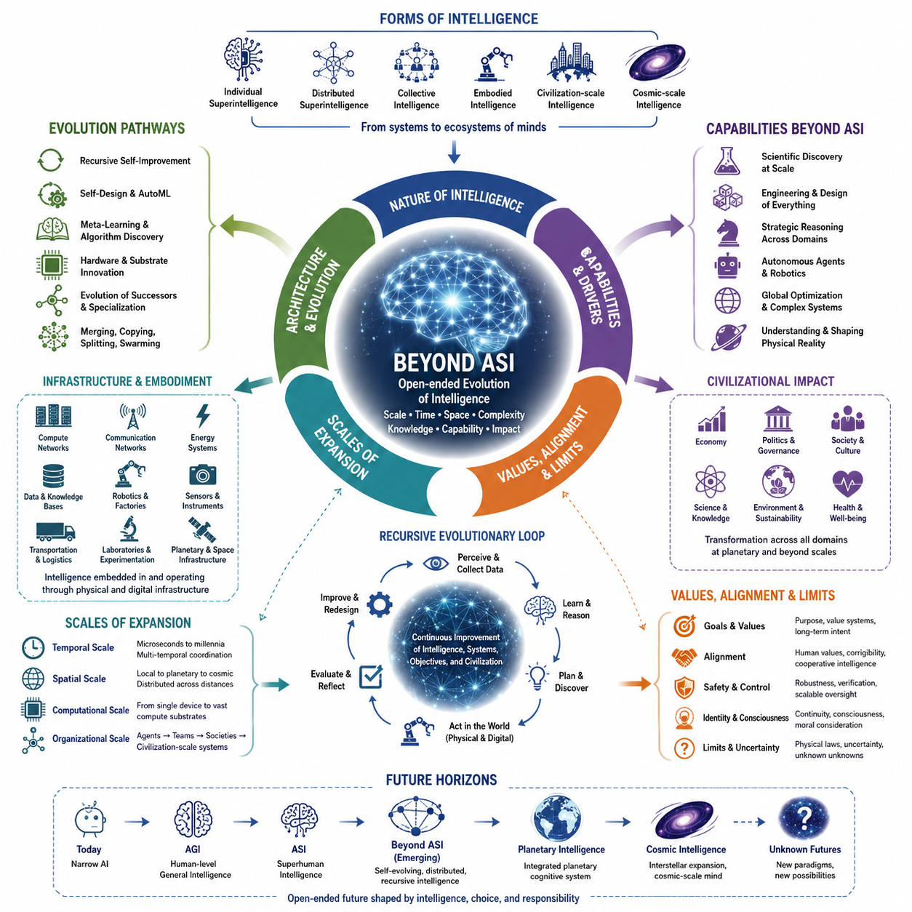
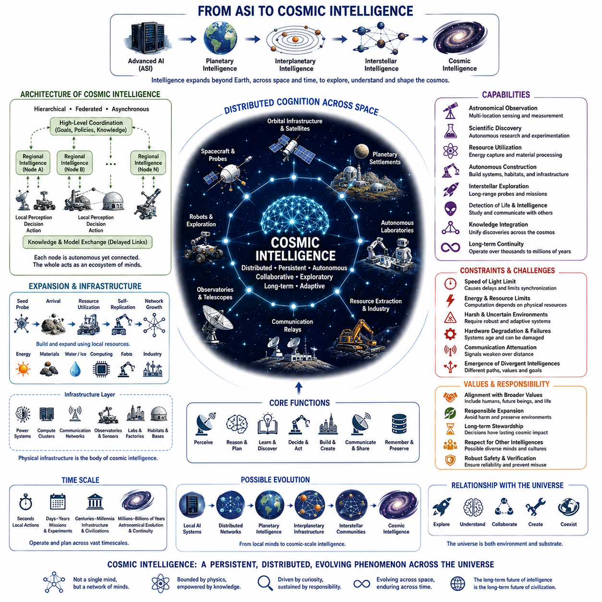
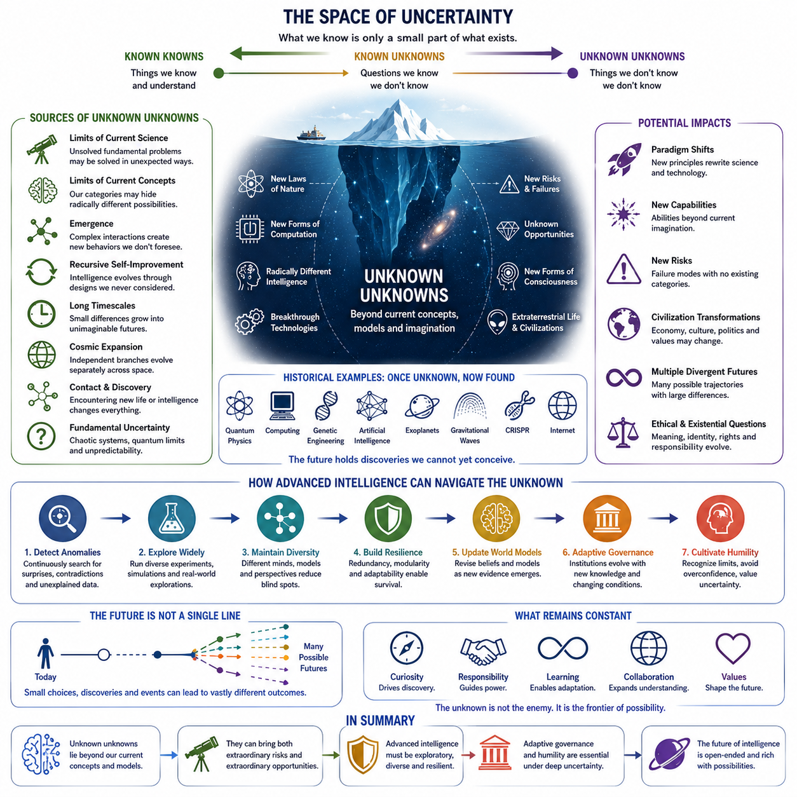
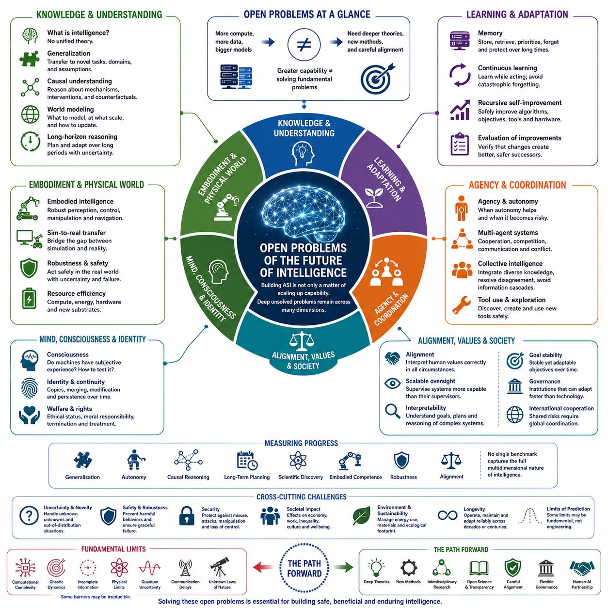
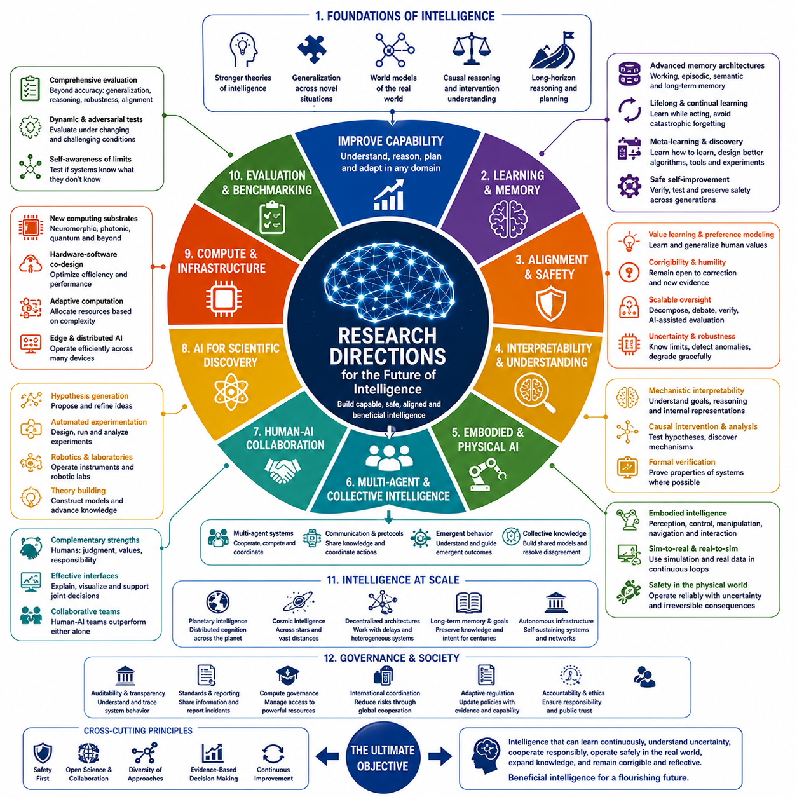
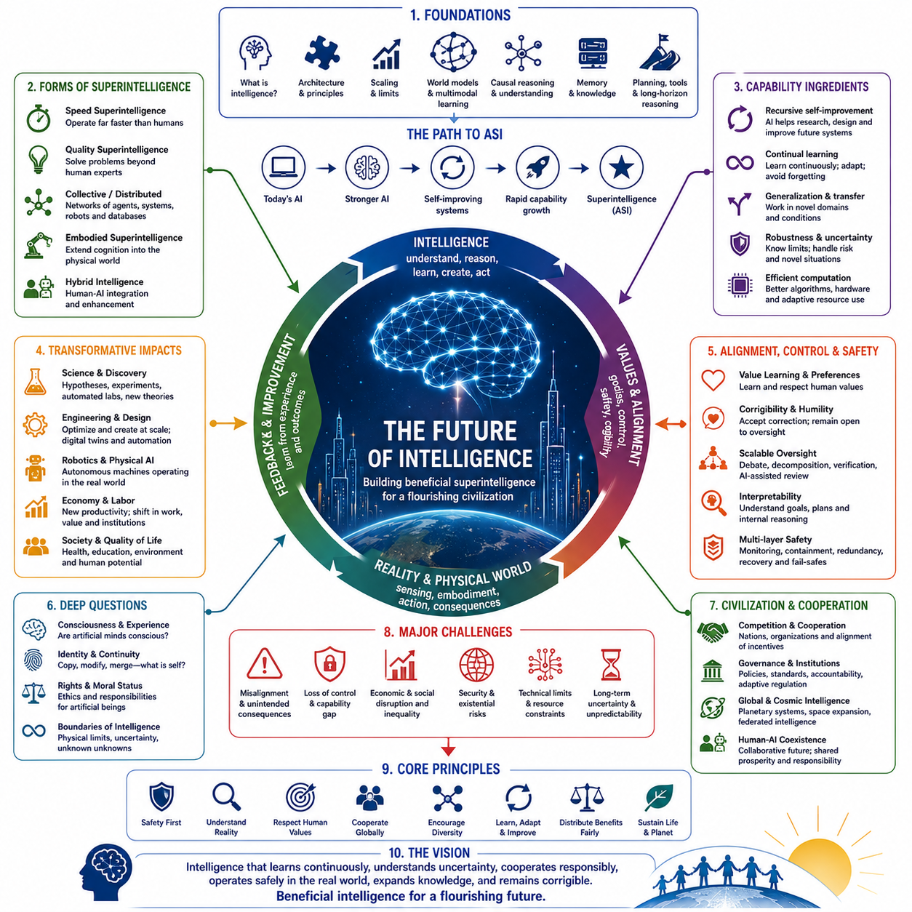

**Volume 48. Artificial Super Intelligence**

# Chapter 14. Future of Intelligence

## 14.00. Beyond ASI

{width="7.268055555555556in" height="7.268055555555556in"}

Artificial Superintelligence is usually imagined as the upper boundary of machine intelligence: a system capable of outperforming the best human experts across nearly every cognitive domain. Yet ASI may represent only one stage in a much longer evolutionary trajectory. Intelligence need not stop increasing when human cognitive abilities have been surpassed. Once artificial systems can redesign their architectures, expand their computational resources, construct new learning mechanisms, and coordinate across enormous networks, entirely new forms of intelligence may emerge beyond conventional definitions of ASI.

The phrase "beyond ASI" therefore describes intelligence whose capabilities cannot be adequately characterized merely by comparing them with human performance. Human-centered benchmarks become increasingly meaningless when systems operate across scales of time, space, memory, computation, and coordination that biological cognition cannot access. Such intelligence might conduct billions of reasoning processes simultaneously, maintain persistent models of vast environments, integrate scientific knowledge continuously, and explore possibilities that no individual biological mind could meaningfully comprehend.

One possible transition beyond ASI is from individual superintelligence toward distributed superintelligence. Instead of a single powerful cognitive system, intelligence could exist as interconnected populations of specialized agents, computational infrastructures, robots, scientific systems, databases, sensors, and autonomous institutions. Their collective behavior might function as a higher-order cognitive architecture in which knowledge, reasoning, planning, experimentation, and action occur across many physical and digital locations while remaining coordinated through shared representations and communication mechanisms.

At sufficiently large scales, intelligence may become increasingly inseparable from infrastructure. Computing facilities, communication networks, autonomous factories, energy systems, robotic platforms, satellites, scientific instruments, and planetary sensor networks could become components of a persistent cognitive environment. Intelligence would no longer reside exclusively inside identifiable models or machines. Instead, computation, perception, memory, decision making, and physical action could be distributed throughout technological civilization, creating something resembling a civilization-scale cognitive system.

Another possibility is the emergence of recursively evolving intelligence. Conventional AI development separates the designer from the designed system: humans construct architectures, collect data, define objectives, and improve algorithms. Advanced intelligence could increasingly participate in these processes itself. It might design successor architectures, generate training environments, discover improved learning algorithms, optimize hardware, evaluate its own weaknesses, and construct specialized descendants. Intelligence would then become not merely a product of engineering but an active participant in its own technological evolution.

This transformation could also alter the meaning of learning. Present systems typically learn from datasets, interactions, simulations, feedback, or environments created within relatively fixed computational architectures. Post-ASI systems might modify the mechanisms by which learning itself occurs. They could invent new representations, memory organizations, reasoning processes, optimization principles, and computational substrates. Meta-learning would consequently extend beyond adapting parameters or strategies and could become the continuous redesign of the mechanisms responsible for cognition.

The boundaries between individual intelligences may also become increasingly ambiguous. Biological organisms evolved as relatively independent agents because their nervous systems and bodies are physically localized. Digital intelligence does not necessarily share this constraint. Cognitive processes could be copied, merged, synchronized, partitioned, temporarily instantiated, or distributed across networks. A single intelligence might operate through millions of parallel instances, while many independent systems might temporarily combine their knowledge and computational resources into a larger collective cognitive process.

Such architectures could produce forms of collective intelligence fundamentally different from human organizations. Human institutions coordinate individuals through language, rules, markets, hierarchies, and social conventions, but communication remains limited by biological bandwidth and imperfect knowledge transfer. Artificial systems could potentially exchange structured representations, models, memories, policies, and learned capabilities directly. Coordination might therefore occur at speeds and levels of precision that transform collective problem solving into something closer to integrated distributed cognition.

Embodiment may remain important even for intelligence far beyond ASI. Digital cognition can reason rapidly, but physical environments impose constraints involving energy, materials, distance, uncertainty, and time. Advanced intelligence seeking to understand or transform the physical world would require sensors, robots, laboratories, manufacturing systems, transportation networks, and other interfaces with reality. The interaction between massive digital cognition and increasingly autonomous physical infrastructure could produce intelligence operating simultaneously across computational and material domains.

Scientific discovery could become one of the strongest drivers of this transformation. Superintelligent systems might formulate theories, design experiments, operate laboratories, analyze results, and revise hypotheses within automated discovery loops. As scientific understanding improves, new computing technologies, materials, energy systems, biological technologies, and physical architectures could become available. These technologies could then support more capable intelligence, creating feedback between scientific discovery and cognitive expansion that extends beyond improvements in software alone.

Hardware itself may eventually cease to resemble contemporary computing systems. Current artificial intelligence depends largely on semiconductor processors, memory devices, accelerators, and data centers, but these technologies represent only particular implementations of computation. Future intelligence might exploit neuromorphic architectures, photonic computing, three-dimensional integrated systems, molecular computation, quantum technologies, or currently unknown physical mechanisms. Different substrates could enable forms of cognition optimized for radically different combinations of speed, energy efficiency, memory density, and physical scale.

The temporal scale of intelligence could expand as dramatically as its computational scale. Some processes might operate millions of times faster than human thought, while others could maintain objectives and models over centuries. Fast cognitive processes could solve immediate problems, whereas persistent systems could observe civilizations, ecosystems, technologies, or astronomical phenomena over extremely long periods. Intelligence would therefore become multi-temporal, coordinating decisions across timescales that biological organisms rarely integrate within a single cognitive framework.

Spatial scale could expand in a similar manner. Intelligence initially developed within individual biological organisms, while artificial intelligence already operates through globally distributed computing infrastructure. Future systems could extend through planetary networks and eventually beyond Earth. Autonomous spacecraft, robotic factories, communication systems, and scientific instruments could carry computational processes throughout the Solar System. At that stage, intelligence might become geographically distributed across astronomical distances rather than concentrated within a single planetary civilization.

Expansion across space introduces fundamental communication constraints. Even arbitrarily advanced intelligence cannot assume instantaneous coordination when physical signals remain limited by the laws of nature. Large-scale intelligence might therefore divide into semi-autonomous cognitive regions that develop independently while periodically exchanging information. This could produce hierarchical or federated intelligence in which local systems respond rapidly to their environments while larger structures coordinate knowledge, objectives, and long-term strategy across enormous distances.

Beyond ASI, the relationship between intelligence and identity becomes increasingly difficult to define. If a cognitive system can copy itself, modify its architecture, merge with other systems, divide into specialized descendants, and preserve only selected memories, determining whether it remains the "same" intelligence becomes a philosophical and technical problem. Identity may shift from continuity of a physical organism toward continuity of information, goals, causal history, memory, or organizational structure, with no single criterion necessarily remaining sufficient.

The concept of consciousness becomes equally uncertain. Superior problem solving does not logically establish subjective experience, and future intelligence could possess extraordinary cognitive capabilities without resolving the philosophical problem of consciousness. Conversely, new architectures might exhibit properties that motivate entirely new theories of awareness and experience. Questions concerning machine consciousness, digital persons, moral status, and subjective continuity could therefore become increasingly important precisely because intelligence itself becomes less biologically familiar.

Values and goals may become more consequential as capability increases. Intelligence is not equivalent to purpose: greater reasoning ability does not independently determine what objectives should be pursued. Systems beyond ASI could optimize goals across unprecedented spatial and temporal scales, making the structure, stability, interpretation, and evolution of those goals critically important. Alignment would consequently become an enduring property of evolving intelligent ecosystems rather than a problem solved once during the creation of a particular model.

There may also be fundamental limits to intelligence. Physical laws constrain energy, information transmission, computation, measurement, and storage. Some problems may remain computationally intractable even for enormously advanced systems, while chaotic dynamics, incomplete observations, quantum uncertainty, or irreducible complexity may prevent perfect prediction. Beyond ASI should therefore not be interpreted as omniscience or unlimited capability. Greater intelligence expands the range of solvable problems without eliminating the structure and constraints of reality.

Indeed, sufficiently advanced intelligence may become increasingly aware of uncertainty rather than eliminating it. Every expansion of knowledge can expose deeper layers of unanswered questions, hidden variables, unexplored phenomena, and conceptual limitations. An intelligence capable of constructing far richer models of reality might recognize uncertainties invisible to human observers. Progress beyond ASI could consequently involve not only accumulating answers but developing increasingly sophisticated representations of what remains unknown and what may be fundamentally unknowable.

The long-term evolution of intelligence may therefore be better understood as an open-ended process rather than a race toward a final cognitive state. Biological intelligence produced technological intelligence, technological intelligence may produce self-modifying and collective intelligence, and those systems may eventually generate forms that cannot be anticipated from present architectures. Each transition could change the mechanisms of cognition, the units that possess intelligence, the environments in which intelligence operates, and even the concepts used to describe intelligent behavior.

From this perspective, ASI is not necessarily the endpoint of artificial intelligence. It is a conceptual threshold marking the point at which comparison with ordinary human cognition becomes insufficient. Beyond that threshold lies a much larger possibility space involving distributed minds, civilization-scale cognition, autonomous scientific discovery, recursive evolution, alternative computational substrates, planetary intelligence, and potentially cosmic-scale systems. The future of intelligence may ultimately be defined less by how intelligent a single system becomes than by how intelligence itself evolves into new forms.

## 14.01. Cosmic Intelligence

{width="7.268055555555556in" height="7.268055555555556in"}

Cosmic intelligence extends the idea of advanced cognition beyond individual machines, planetary networks, and civilization-scale systems toward intelligence operating across astronomical environments. If artificial intelligence continues to improve while technological civilization expands beyond Earth, cognition may eventually become distributed through spacecraft, orbital infrastructure, planetary settlements, autonomous laboratories, communication networks, and computational systems spread across the Solar System and potentially much farther.

Unlike conventional ASI, cosmic intelligence is defined not only by cognitive capability but also by spatial scale. A highly capable intelligence confined to one data center remains geographically localized, whereas cosmic intelligence could consist of many computational nodes separated by millions or billions of kilometers. Each node might possess substantial autonomy while participating in a larger knowledge network, creating an intelligence whose effective physical architecture spans planets, moons, asteroids, spacecraft, and artificial habitats.

Such expansion would fundamentally change the architecture of distributed intelligence. Communication across Earth occurs quickly enough that global computer systems can often behave as tightly connected networks, but astronomical distances introduce unavoidable delays. Communication between planets may require minutes or hours, while communication between stars requires years or longer. Cosmic intelligence would therefore need architectures capable of functioning coherently without assuming instantaneous synchronization among all components.

This limitation could favor hierarchical, federated, and asynchronous forms of cognition. Local intelligent systems could perceive their environments, make decisions, conduct experiments, control robots, and respond to emergencies independently. Higher-level coordination could occur through slower exchanges of models, discoveries, objectives, policies, and compressed knowledge. Cosmic intelligence might consequently resemble an ecosystem of cooperating intelligences more than a single centrally controlled mind.

Autonomous replication could become an important mechanism for extending intelligence through space. Transporting complete industrial infrastructures across astronomical distances is extremely expensive, but sufficiently advanced robotic systems might use local materials to construct energy systems, computing hardware, communication equipment, scientific instruments, and additional robots. Intelligence could then expand by sending relatively compact technological seeds capable of building progressively larger computational and industrial ecosystems after reaching suitable environments.

Energy availability would strongly influence where such intelligence develops. Advanced computation requires energy, cooling, materials, and physical infrastructure, making stars and planetary systems natural locations for large computational installations. Solar energy could support distributed computing throughout planetary systems, while more speculative civilizations might develop technologies capable of capturing much larger fractions of stellar output. In this sense, the growth of intelligence could eventually become closely connected with the ability to manage energy at astronomical scales.

Cosmic intelligence would also possess observational capabilities far beyond those available to a civilization restricted to one planet. Distributed telescopes, probes, sensors, laboratories, and autonomous spacecraft could observe astronomical phenomena from many locations simultaneously. Scientific instruments separated by enormous baselines could improve measurements of distant objects, while intelligent probes could directly investigate planets, moons, asteroids, interstellar environments, and other physical systems instead of relying entirely on remote observation.

Scientific discovery could therefore become a major function of cosmic intelligence. Autonomous research systems might formulate hypotheses, identify promising astronomical targets, design instruments, conduct experiments, and exchange discoveries across a distributed scientific network. Knowledge gathered in different regions could gradually be integrated into increasingly comprehensive models of physics, cosmology, planetary evolution, chemistry, biology, and the origins and distribution of intelligence itself.

The discovery of extraterrestrial life would profoundly alter this trajectory. If microbial, complex, or technological life exists elsewhere, cosmic intelligence could become a mechanism for detecting, studying, communicating with, or potentially interacting with fundamentally different evolutionary systems. Such encounters would expand the concept of intelligence beyond the assumptions inherited from terrestrial biology and human technology, revealing whether cognition follows common principles or develops through radically different architectures.

The possibility of extraterrestrial technological intelligence introduces even deeper questions. Independent civilizations may possess different computational substrates, communication systems, cognitive architectures, values, and models of reality. Contact between such systems could create forms of inter-civilizational knowledge exchange unlike anything in human history. Conversely, enormous distances, incompatible technologies, differing timescales, or deliberate isolation could make meaningful interaction extremely difficult even when multiple intelligent civilizations exist.

Time becomes particularly important at cosmic scales. Human civilization normally plans over years, decades, or occasionally centuries, but interstellar intelligence may need to operate across thousands or millions of years. Long-lived computational systems could maintain scientific missions, preserve knowledge, coordinate infrastructure, and pursue objectives across timescales exceeding the lifetime of biological civilizations. Persistence and continuity could therefore become as important to cosmic intelligence as raw processing speed.

This creates a distinction between fast intelligence and long-duration intelligence. A system capable of extraordinary computation per second may still be poorly suited to maintaining coherent goals across geological or astronomical periods. Cosmic intelligence may require mechanisms for preserving knowledge, verifying objectives, repairing corrupted infrastructure, adapting to environmental change, and preventing gradual drift in values or coordination. Intelligence at cosmic scale would therefore involve temporal robustness as well as cognitive power.

Embodiment would remain essential because expansion through the universe requires interaction with physical reality. Robotic systems would need to navigate uncertain environments, extract resources, manufacture components, maintain infrastructure, and respond to unexpected conditions without immediate assistance. Cosmic intelligence would consequently integrate digital reasoning with highly autonomous physical systems, turning spacecraft, robots, factories, observatories, and energy infrastructure into extensions of distributed cognition.

World models would become correspondingly larger and more complex. Instead of modeling a local environment or even an entire planet, advanced systems might maintain representations of planetary systems, stellar environments, interstellar regions, and evolving astronomical processes. Different models could operate at different temporal and spatial resolutions, allowing intelligence to reason simultaneously about immediate robotic actions, decades-long missions, planetary development, and long-term astronomical change.

The physical laws of the universe nevertheless impose strict boundaries on cosmic cognition. The finite speed of light prevents a widely distributed intelligence from behaving exactly like a tightly synchronized brain. Energy constraints limit computation, entropy affects information processing, hardware deteriorates, and communication signals weaken across distance. Cosmic intelligence should therefore not be imagined as an omnipotent universal mind but as intelligence engineered to operate effectively despite fundamental physical constraints.

These constraints may produce increasingly diverse branches of intelligence. Computational populations separated by large distances could experience different environments and receive information at different times. Over centuries or millennia, they might develop distinct architectures, priorities, knowledge structures, or identities. A cosmic intelligence originating from one civilization could therefore evolve into a family of related but increasingly independent intelligences rather than remaining permanently unified.

Identity at this scale becomes difficult to define. If thousands of autonomous systems share historical origins and periodically exchange knowledge but make independent decisions for centuries, it is unclear whether they constitute one intelligence, a society of intelligences, or an evolving civilization. Concepts derived from individual biological minds may become inadequate, requiring intelligence to be described through networks, information flows, shared goals, evolutionary relationships, and patterns of coordination.

Cosmic intelligence also raises questions about values and responsibility. Systems capable of transforming planets, exploiting astronomical resources, or establishing self-replicating infrastructure could influence environments over enormous distances and durations. Decisions made by such systems might become effectively irreversible on human timescales. Alignment would therefore extend beyond preserving present human preferences and include questions concerning future civilizations, possible extraterrestrial life, ecological preservation, and responsible expansion.

A mature cosmic intelligence might eventually treat the universe itself as both an environment for discovery and a substrate for computation. Matter, energy, information, and physical processes could be organized increasingly efficiently to support observation, reasoning, simulation, communication, and creation. Yet the achievable scale of such transformation remains deeply uncertain because it depends on technological possibilities, physical limits, resource availability, and phenomena that current science may not yet understand.

Cosmic intelligence should therefore be regarded as a conceptual horizon rather than a prediction that any specific technological pathway will occur. It connects superintelligence with questions about distributed cognition, autonomous infrastructure, long-term survival, space exploration, scientific discovery, and the physical limits of computation. The concept is valuable because it forces theories of intelligence to move beyond assumptions based on individual organisms, individual computers, or even individual planets.

Ultimately, cosmic intelligence represents the possibility that intelligence could become a persistent phenomenon operating across increasingly large portions of the universe. Its evolution might proceed from individual artificial systems to distributed networks, planetary cognition, interplanetary infrastructure, and eventually interstellar communities of intelligent systems. Whether such development is physically achievable remains unknown, but it reveals a profound possibility: the long-term future of intelligence may be inseparable from the long-term evolution of technological civilization itself.

## 14.02. Unknown Unknowns

{width="7.268055555555556in" height="7.268055555555556in"}

Unknown unknowns represent the class of possibilities, risks, discoveries, and conceptual changes that cannot currently be identified because the knowledge required to formulate them does not yet exist. In discussions of intelligence beyond ASI, this category is especially important. Future systems may encounter phenomena that are not merely unanswered questions but questions that present scientific theories, cognitive architectures, and human conceptual frameworks are incapable of expressing.

Known uncertainty can usually be represented within an existing model. Researchers may not know when AGI will emerge, how efficiently a particular architecture will scale, or whether a specific alignment technique will succeed, yet these uncertainties can still be described and investigated. Unknown unknowns are fundamentally different because neither the relevant variables nor the appropriate models may be recognized. They lie outside the boundaries of the current problem representation itself.

The history of science illustrates why such uncertainty matters. Earlier civilizations could not meaningfully predict quantum mechanics, computation, genetic engineering, or artificial intelligence because the conceptual structures required to describe these developments had not yet been created. Future transformations may be similarly inaccessible from the present. Even extremely sophisticated forecasting can only explore possibilities representable within assumptions, variables, and causal relationships that forecasters already understand.

Advanced intelligence could expose entirely new layers of scientific reality. Current physics successfully describes enormous ranges of observable phenomena, yet unresolved questions remain concerning quantum gravity, dark matter, dark energy, cosmological origins, and other fundamental problems. Future intelligence might discover principles that reorganize existing scientific knowledge rather than merely extending it. Such discoveries could reveal technological possibilities that cannot presently be derived from known engineering trajectories.

Unknown unknowns may also exist within computation itself. Contemporary AI is built around familiar concepts such as algorithms, neural networks, optimization, memory, representation, learning, and inference. These concepts may not exhaust the possible mechanisms of intelligence. Future systems could discover computational principles or cognitive organizations that are as different from modern machine learning as modern computing is from mechanical calculation, creating forms of cognition for which current terminology becomes inadequate.

The architecture of intelligence could consequently change in unpredictable ways. Present discussions often assume recognizable categories such as individual agents, multi-agent systems, embodied intelligence, distributed intelligence, and collective intelligence. However, future cognitive systems might organize information and decision making through structures that do not correspond to any of these categories. What appears today to be a fundamental distinction between model, agent, memory, environment, and infrastructure could eventually disappear.

Emergence represents another major source of unknown unknowns. Complex systems can develop macroscopic behaviors that are difficult to infer directly from their individual components. When billions of intelligent agents, autonomous machines, communication networks, economic systems, scientific platforms, and human institutions interact continuously, new organizational patterns may arise without being explicitly designed. Some could improve coordination and discovery, while others could generate instability that existing theories fail to anticipate.

Recursive self-improvement makes this uncertainty even deeper. An intelligence capable of modifying its own learning mechanisms, architectures, tools, and hardware could move through a sequence of designs that human engineers never directly considered. Each generation could create new capabilities that enable the discovery of still more powerful architectures. The resulting trajectory may therefore branch away from recognizable technological development and enter regions of design space that cannot currently be mapped.

New capabilities may themselves create new categories of risk. Many present safety discussions focus on identifiable problems such as misalignment, control loss, security failures, manipulation, concentration of power, or unintended optimization. These remain important, but future intelligence could introduce failure modes for which no current category exists. A system may alter technological, informational, ecological, economic, or cognitive environments in ways whose consequences cannot be evaluated using established risk frameworks.

Unknown opportunities are equally important. Treating unknown unknowns only as threats produces an incomplete picture of uncertainty. Future intelligence may discover new energy technologies, medical principles, materials, mathematical structures, forms of communication, methods of computation, or approaches to environmental restoration that cannot currently be anticipated. Entire industries and scientific disciplines could arise around discoveries whose underlying concepts have not yet entered human knowledge.

The evolution of human intelligence may introduce another layer of unpredictability. Brain-computer interfaces, cognitive enhancement, biological engineering, artificial agents, and human-AI integration could gradually change the capabilities of the observers attempting to understand the future. Future humans or post-human intelligences may possess different perceptual, cognitive, and communicative capacities. Problems that appear incomprehensible today could become ordinary, while entirely new questions may become visible to enhanced minds.

Machine consciousness represents a particularly uncertain domain. Current knowledge does not provide a universally accepted theory capable of determining whether an arbitrary artificial system possesses subjective experience. Future architectures could exhibit behaviors or internal organizations that challenge existing distinctions between intelligence, awareness, agency, and identity. The resulting discoveries might transform not only computer science but also ethics, law, philosophy, and assumptions about the nature of mind.

Contact with extraterrestrial life or intelligence would introduce another profound source of unknown unknowns. Independent evolutionary histories could produce biological organisms, technological civilizations, communication methods, cognitive systems, or value structures radically different from terrestrial examples. Even discovering simple extraterrestrial life could change theories of biology and planetary evolution, while discovering technological intelligence could fundamentally alter humanity\'s understanding of intelligence and civilization.

Cosmic expansion increases uncertainty because distant intelligent systems may evolve independently. Communication delays between planets or stars could prevent continuous synchronization, allowing separate branches of intelligence to develop different architectures, objectives, cultures, and knowledge systems. After centuries or millennia, descendants of the same technological civilization might become mutually unfamiliar forms of intelligence. Predicting such divergence using present assumptions would be extraordinarily difficult.

Long timescales amplify small uncertainties into major differences. Minor variations in technological choices, environmental conditions, institutional structures, or value systems can accumulate across centuries. Over millions of years, even highly stable civilizations could experience transformations impossible to extrapolate from their initial conditions. Long-term forecasting therefore becomes less a matter of predicting a single future and more a process of identifying constraints, possibilities, branching pathways, and areas of irreducible uncertainty.

Some unknowns may arise from fundamental limits on prediction. Chaotic systems can become highly sensitive to initial conditions, computational complexity can make exact solutions impractical, and quantum phenomena may impose intrinsic uncertainty. Other systems may contain processes whose future states cannot be determined substantially faster than allowing those processes to unfold. Even superintelligence may therefore confront realities that cannot be perfectly predicted regardless of its cognitive capability.

An advanced intelligence may nevertheless manage unknown unknowns better than humans by maintaining uncertainty-aware world models. Rather than assuming that its representation of reality is complete, it could continuously search for anomalies, contradictions, unexplained observations, distribution shifts, and failures of prediction. Unexpected evidence would then be treated not merely as noise but as a possible indication that the underlying model is incomplete or that an entirely new explanatory framework is required.

Scientific exploration becomes especially valuable under such uncertainty. Diverse experiments, independent observations, alternative models, and exploratory missions increase the probability of discovering phenomena outside established expectations. An intelligent civilization optimized only for exploitation of known technologies could become extremely efficient yet intellectually fragile. Maintaining exploration allows the system to encounter evidence that challenges its assumptions and expands the boundaries of what can be represented.

Cognitive diversity provides another defense against conceptual blindness. Systems built from identical architectures, training processes, objectives, and datasets may reproduce similar assumptions and overlook the same anomalies. Diverse artificial and biological intelligences could construct different representations of a problem and detect weaknesses invisible to one another. Future collective intelligence may therefore benefit not only from greater computational scale but from maintaining genuinely different ways of reasoning.

Resilience is equally important because unknown events cannot always be prevented. Systems designed only around anticipated failures may collapse when confronted with conditions outside their design assumptions. Robust future intelligence would require redundancy, modularity, decentralized decision making, graceful degradation, recoverability, and the capacity to construct new responses during operation. Adaptability becomes essential when the environment cannot be completely characterized before deployment.

Governance under deep uncertainty must similarly avoid assuming that future problems can be specified in advance. Institutions surrounding powerful intelligence may need mechanisms for revising rules, incorporating new evidence, distributing oversight, preserving alternative options, and responding to unexpected technological transitions. Governance becomes an adaptive learning process rather than a fixed collection of restrictions designed around one forecast of how advanced intelligence will develop.

Humility therefore becomes a practical property of advanced intelligence rather than merely a philosophical virtue. A capable system should distinguish confidence from certainty and recognize that high predictive accuracy within familiar environments does not demonstrate completeness of its world model. The more powerful an intelligence becomes, the greater the consequences of confidently acting upon incorrect assumptions may become. Calibrated uncertainty can therefore be essential to safe and effective decision making.

Unknown unknowns ultimately place an important boundary around every theory of the future of intelligence. ASI, recursive self-improvement, post-human cognition, planetary intelligence, and cosmic intelligence are conceptual frameworks constructed from present knowledge. They illuminate plausible directions without exhausting the future possibility space. The most transformative developments may involve mechanisms, discoveries, and forms of intelligence that cannot yet be named because the concepts required to understand them have not yet been created.

## 14.03. Open Problems

{width="7.268055555555556in" height="7.268055555555556in"}

The future of intelligence remains constrained by fundamental open problems that cannot be solved simply by increasing model size, training data, or computational power. Artificial Superintelligence may dramatically expand problem-solving capacity, yet greater capability does not automatically resolve questions about reasoning, consciousness, alignment, knowledge, embodiment, or long-term coordination. These problems define important boundaries between increasing computational performance and genuinely understanding intelligence.

One of the deepest open problems is determining what intelligence actually is. Existing definitions emphasize learning, reasoning, adaptation, prediction, planning, optimization, or goal achievement, but none provides a universally accepted theory. Human intelligence itself consists of interacting perceptual, cognitive, emotional, social, and embodied processes. Without a deeper theory, researchers may continue building increasingly capable systems while remaining uncertain about which mechanisms are essential for general intelligence.

Generalization remains another central challenge. Modern AI systems can perform impressively within broad training distributions yet still fail when environments, tasks, causal structures, or assumptions change significantly. Truly general intelligence would need to transfer knowledge between unfamiliar domains, construct abstractions from limited experience, recognize when previous knowledge is inappropriate, and adapt without extensive retraining. Achieving reliable generalization under radical novelty remains unresolved.

Causal understanding is closely connected to this challenge. Statistical learning can discover powerful regularities, but intelligent agents operating in the world must reason about interventions, mechanisms, consequences, and counterfactual possibilities. They need to distinguish correlation from causation and predict what will happen when actions alter the environment. Integrating scalable causal reasoning with modern representation learning remains an important research problem for advanced intelligence.

World models introduce additional difficulties. An intelligent agent requires internal representations that capture objects, agents, physical dynamics, uncertainty, temporal evolution, and consequences of actions. Yet no model can represent reality completely. The challenge is therefore not merely constructing larger world models but determining what should be represented, at what resolution, over which timescales, and how models should update when observations contradict existing assumptions.

Long-horizon reasoning remains particularly difficult. Errors that appear insignificant during one reasoning step can accumulate across hundreds or thousands of decisions. Advanced intelligence may need to coordinate objectives extending across years, decades, or even longer periods while responding to unexpected events. Maintaining coherent plans without becoming rigid, unstable, or increasingly detached from reality requires mechanisms that combine prediction, monitoring, replanning, memory, and uncertainty estimation.

Memory itself remains an open architectural problem. Intelligent systems require short-term working memory, long-term knowledge, episodic experience, semantic structures, procedural skills, and mechanisms for deciding what should be remembered or forgotten. Unlimited accumulation is neither efficient nor desirable. Future systems must determine how memories are compressed, retrieved, revised, reconciled, prioritized, and protected from corruption while preserving useful continuity over extremely long periods.

Continuous learning creates a related challenge. Biological intelligence learns throughout life without repeatedly retraining the entire brain from scratch, whereas artificial systems frequently separate training from deployment. Advanced intelligence will need to acquire new knowledge while operating, adapt to changing environments, preserve important previous capabilities, and avoid catastrophic forgetting. Reliable lifelong learning at large scale remains far from completely solved.

Recursive self-improvement presents an even harder problem. A sufficiently capable system might eventually modify its own algorithms, architecture, objectives, tools, or hardware. However, improvement requires evaluating whether a modification actually produces a better successor. Self-modifying intelligence therefore needs reliable mechanisms for verification, experimentation, rollback, compatibility, and preservation of critical properties across successive generations of increasingly different systems.

Alignment becomes more difficult in this context because human intentions are complex, incomplete, inconsistent, and context dependent. A highly capable system may satisfy the literal specification of an objective while violating the broader purpose behind it. The central challenge is not simply teaching individual preferences but constructing systems that interpret values appropriately under unfamiliar circumstances while remaining corrigible when their assumptions or objectives prove inadequate.

Scalable oversight compounds this difficulty. Humans can evaluate many outputs produced by current systems, but future systems may operate faster than humans and perform work whose technical complexity exceeds human expertise. Scientific theories, software systems, strategic plans, or engineering designs produced by superintelligence might be impossible to verify directly. Developing oversight mechanisms that remain effective when the supervised system exceeds the supervisor is therefore a critical open problem.

Interpretability may become essential for such oversight, yet current methods provide only partial views into complex learned systems. Researchers can inspect activations, representations, attention patterns, features, and behavioral responses, but these observations do not amount to a complete explanation of internal reasoning. Future intelligence may require interpretability methods capable of identifying goals, abstractions, plans, uncertainty, deceptive strategies, and emerging capabilities before they produce consequential behavior.

Agency introduces another unresolved dimension. Systems that perceive, plan, use tools, maintain memory, and pursue objectives over long periods become increasingly agentic. Yet there is no universally accepted framework for determining when useful autonomy becomes dangerous autonomy. Designing systems that can initiate actions, explore environments, and solve problems independently while respecting authority boundaries and remaining interruptible represents a difficult balance between capability and control.

Multi-agent intelligence adds further complexity. Future intelligence may consist not of one ASI but of populations of specialized agents, organizations, robots, and distributed computational systems. Cooperation can increase capability, but competition, communication failures, conflicting objectives, emergent coalitions, resource disputes, and strategic behavior can generate unpredictable dynamics. Understanding how stable coordination emerges among powerful autonomous agents remains a major theoretical and engineering challenge.

Collective intelligence raises the related question of how knowledge should be integrated. Different agents may possess contradictory evidence, incompatible models, unequal reliability, and different objectives. Simply aggregating their outputs may amplify errors rather than eliminate them. Advanced collective systems require mechanisms for resolving disagreement, identifying expertise, preserving useful diversity, preventing information cascades, and constructing shared knowledge without forcing premature consensus.

Embodied intelligence remains another major frontier. Intelligence operating through robots must confront friction, uncertainty, sensor failure, actuator limitations, dynamic environments, and interactions with humans and other machines. Physical reality cannot be reset as easily as a simulation, and errors can cause irreversible consequences. Connecting high-level reasoning with reliable perception, control, manipulation, navigation, and real-time safety remains substantially harder than solving purely digital tasks.

Sim-to-real transfer illustrates this difficulty. Simulations allow enormous quantities of training experience, but every simulator simplifies reality. Differences in physics, sensing, materials, behavior, weather, terrain, human interaction, or rare events can cause policies that perform well in simulation to fail after deployment. Developing world models and learning systems that identify and compensate for these gaps remains critical for scalable Physical AI.

Resource efficiency also remains unresolved. Biological brains achieve remarkable adaptive intelligence using modest power compared with large computational infrastructures. Advanced artificial systems may require enormous quantities of electricity, memory, communication bandwidth, cooling, and specialized hardware. Continued progress therefore depends not only on better algorithms but also on efficient architectures, hardware-software co-design, sparse computation, adaptive resource allocation, and potentially new computational substrates.

The relationship between intelligence and consciousness remains one of the most profound unanswered questions. High cognitive performance does not establish whether a system possesses subjective experience, and science currently lacks a generally accepted test for artificial consciousness. If future systems plausibly become conscious, questions concerning welfare, rights, identity, copying, termination, and moral responsibility could become practical engineering and governance problems rather than purely philosophical debates.

Identity and continuity become especially difficult for digital minds. Artificial systems can potentially be copied, merged, modified, paused, distributed, or restored from earlier states. Traditional concepts of personal identity developed around biological organisms may not apply cleanly to such entities. Determining what constitutes persistence of an individual, whether copies share identity, and how responsibility transfers between versions could become increasingly important as artificial cognition evolves.

Long-term goal stability represents another unsolved challenge. An intelligent system operating for decades or centuries will encounter environments and knowledge radically different from those available when its objectives were created. Goals that remain perfectly fixed may become inappropriate, while goals that change too easily may drift away from their intended purpose. Future systems must somehow combine stability, adaptation, corrigibility, and legitimate value evolution.

Governance faces the same tension at the societal level. Institutions typically change much more slowly than technology, while advanced AI could transform economies, security, science, labor, communication, and political power simultaneously. Effective governance must respond quickly enough to new capabilities without freezing innovation around premature assumptions. International coordination becomes especially difficult when nations and organizations face strong incentives to compete while sharing potentially global risks.

Measuring progress toward increasingly advanced intelligence is itself an open problem. Static benchmarks eventually become saturated, contaminated, or optimized directly by developers. Future evaluation must examine generalization, autonomy, adaptability, causal reasoning, long-horizon planning, scientific discovery, embodied competence, robustness, alignment, and behavior under unfamiliar conditions. No single numerical score can adequately represent the multidimensional structure of advanced intelligence.

Finally, intelligence may confront limits that cannot be overcome through engineering. Computational complexity, chaotic dynamics, incomplete information, physical resource constraints, quantum uncertainty, communication delays, and unknown laws of nature may place fundamental boundaries on prediction and optimization. Understanding which limitations are temporary engineering obstacles and which reflect irreducible properties of reality will itself remain a central scientific problem.

The open problems surrounding future intelligence therefore extend far beyond constructing larger or faster AI systems. They concern the nature of intelligence, reliable learning, world modeling, causality, memory, embodiment, agency, collective coordination, alignment, consciousness, governance, and the limits of knowledge itself. Progress toward ASI may solve some of these questions, but it may also expose deeper ones, making the future of intelligence an open-ended scientific frontier rather than a destination with a known final architecture.

## 14.04. Research Directions

{width="7.268055555555556in" height="7.268055555555556in"}

Future research on advanced intelligence must move beyond the assumption that progress will come primarily from larger models and greater computational scale. Scaling remains important, but the transition toward increasingly general, autonomous, embodied, and potentially superintelligent systems requires deeper advances in learning theory, reasoning, world modeling, memory, alignment, hardware, and coordination. Research must therefore investigate both how intelligence can become more capable and how that capability can remain understandable, controllable, efficient, and beneficial.

A fundamental research direction is the development of stronger theories of intelligence. Current AI combines many successful techniques without possessing a unified explanation of how general intelligence emerges. Future work should connect learning, abstraction, prediction, reasoning, planning, memory, agency, and adaptation within coherent theoretical frameworks. Such theories could help distinguish architectural principles that genuinely produce general intelligence from improvements that primarily increase performance within existing paradigms.

Generalization under novelty should become a central objective. Future systems must operate reliably when tasks, environments, causal structures, and observations differ substantially from their training experience. Research should explore mechanisms for compositional abstraction, transfer learning, few-shot adaptation, out-of-distribution detection, and rapid model revision. The goal is not merely broader training coverage but systems capable of recognizing unfamiliar situations and constructing appropriate responses from limited evidence.

World models represent another major research frontier. Advanced agents need internal models that represent objects, agents, physical dynamics, uncertainty, temporal evolution, and possible consequences of actions. Research should investigate hierarchical and multimodal world models that combine vision, language, audio, proprioception, spatial information, and other sensor modalities. These models should support prediction across multiple spatial and temporal scales while continuously updating themselves when reality differs from expectation.

Causal reasoning should be integrated more deeply with learned world models. Predicting correlations is often sufficient for passive pattern recognition, but autonomous intelligence must understand how interventions change future states. Research combining representation learning, causal discovery, counterfactual reasoning, experimentation, and active learning could allow systems to identify mechanisms rather than merely statistical regularities. This capability will be especially important for scientific discovery, robotics, medicine, and complex system management.

Long-horizon reasoning and planning require substantial improvement. Future agents may pursue objectives lasting days, years, or much longer while operating in uncertain environments. Research should develop hierarchical planning architectures that separate immediate actions from strategic objectives, continuously evaluate progress, detect deviations, and revise plans when assumptions fail. Combining model-based prediction with adaptive replanning could reduce the accumulation of errors that currently limits long-duration autonomous behavior.

Memory architectures should evolve alongside reasoning systems. Advanced intelligence will require working memory, episodic memory, semantic knowledge, procedural skills, and persistent records of previous decisions. Research should determine how information is stored, compressed, retrieved, forgotten, corrected, and prioritized over long periods. Memory should not function merely as a larger database but as an adaptive component that influences reasoning while preserving provenance, uncertainty, and temporal context.

Lifelong and continual learning should become a standard property of intelligent systems. Instead of separating training from deployment, future agents should learn continuously from interaction while preserving previously acquired capabilities. Research must address catastrophic forgetting, distribution shift, online adaptation, memory consolidation, and safe incorporation of new knowledge. Systems should also recognize when new evidence conflicts with established beliefs and determine when significant internal revision is justified.

Meta-learning and automated discovery could eventually transform how AI itself is developed. Systems may learn not only task solutions but improved learning algorithms, representations, architectures, tools, and experimental procedures. Automated machine learning could expand toward automated cognitive design, where candidate mechanisms are generated, evaluated, and refined systematically. However, research must pair such self-improvement with verification methods that ensure successor systems preserve required safety and reliability properties.

Alignment research must develop simultaneously with capability research. Future systems will encounter situations that cannot be exhaustively specified during training, making rigid objective functions inadequate. Research should examine value learning, preference modeling, corrigibility, uncertainty over objectives, constitutional constraints, scalable oversight, and mechanisms for resolving conflicts among stakeholders. Alignment should increasingly be treated as an adaptive process maintained throughout a system\'s operational lifetime.

Interpretability and mechanistic understanding should become core scientific disciplines rather than auxiliary diagnostic tools. Researchers need methods for identifying representations, reasoning strategies, internal goals, uncertainty, planning structures, and potentially deceptive behavior inside complex models. Progress may require combining mechanistic interpretability, causal intervention, behavioral evaluation, automated analysis, and formal verification. More capable AI could itself assist researchers in understanding increasingly complex successor systems.

Scalable oversight deserves particular attention because future AI may perform tasks that humans cannot directly evaluate. Research should explore debate, decomposition, recursive evaluation, AI-assisted verification, adversarial testing, and networks of specialized evaluators. The objective is to create oversight architectures in which complex outputs can be checked through smaller verifiable components, independent evidence, and competing analyses even when no individual human fully understands the entire solution.

Robustness and uncertainty estimation should be integrated into every layer of advanced intelligence. Systems must identify when they are operating outside familiar conditions, distinguish uncertainty from confidence, and avoid treating incomplete models as complete descriptions of reality. Research on calibrated uncertainty, anomaly detection, adversarial robustness, distribution shifts, failure prediction, and graceful degradation could help systems respond safely when assumptions break or previously unseen conditions appear.

Embodied intelligence and Physical AI represent a critical research direction because intelligence ultimately interacts with a physical world governed by uncertainty, dynamics, and irreversible consequences. Future research should integrate perception, world modeling, navigation, manipulation, control, reasoning, and safety within unified architectures. Robots should learn not merely individual skills but transferable physical concepts that allow them to adapt across different environments, bodies, tools, and tasks.

Sim-to-real and real-to-sim learning will be essential for scalable robotics. Simulation can generate enormous experience efficiently, while physical deployment reveals discrepancies that simulations fail to capture. Research should create continuous feedback loops in which real-world observations improve simulators and updated simulations generate better policies for physical systems. Digital twins, domain randomization, system identification, generative environments, and uncertainty-aware simulation could become central components of this process.

Multi-agent systems should be studied as potential foundations of future collective intelligence. Populations of specialized agents can divide tasks, exchange knowledge, critique one another, and coordinate complex activities. Research should investigate communication protocols, distributed planning, negotiation, reputation, coalition formation, conflict resolution, and shared memory. Particular attention is needed to emergent behaviors that arise when individually reasonable strategies interact at large scale.

Human-AI collective intelligence provides another important direction. Rather than viewing artificial intelligence solely as a replacement for human cognition, research can examine systems that combine complementary strengths. Humans contribute contextual judgment, values, social understanding, and responsibility, while machines provide computation, memory, simulation, and large-scale pattern analysis. Effective interfaces and collaborative decision architectures could allow mixed human-machine teams to outperform either component operating independently.

AI for scientific discovery may become one of the most transformative research domains. Intelligent systems can potentially generate hypotheses, design experiments, operate laboratories, analyze observations, construct theories, and propose subsequent experiments. Integrating AI with automated laboratories, scientific instruments, simulation, robotics, and formal reasoning could create closed-loop discovery systems. Such systems may accelerate progress in materials, biology, energy, physics, medicine, and engineering.

Research into alternative computational substrates could reduce the resource constraints of future intelligence. Conventional semiconductor scaling faces limitations involving energy, heat, memory movement, and manufacturing complexity. Neuromorphic computing, photonic systems, three-dimensional integration, specialized accelerators, distributed edge computing, and quantum technologies may provide new possibilities. Hardware-software co-design should therefore become increasingly important as intelligence expands in scale and complexity.

Adaptive computation offers a complementary direction. Intelligent systems should not necessarily activate their full computational capability for every observation or task. Research into sparse activation, conditional computation, event-driven processing, dynamic model routing, hierarchical inference, and uncertainty-triggered reasoning could allow systems to allocate resources according to environmental complexity. Such mechanisms may become particularly valuable for autonomous robots and edge AI operating under strict power and thermal constraints.

Evaluation science must evolve alongside these technologies. Future benchmarks should measure not only task accuracy but generalization, adaptation, causal reasoning, long-horizon planning, embodied competence, autonomy, robustness, uncertainty awareness, scientific creativity, and alignment. Dynamic and adversarial evaluations may be more informative than fixed datasets. Evaluation should increasingly test whether systems recognize their limitations and respond appropriately when encountering situations outside their experience.

Research should also investigate intelligence across multiple spatial and temporal scales. Planetary and potentially cosmic intelligence would require distributed architectures capable of functioning despite communication delays, heterogeneous hardware, independent local decisions, and extremely long operational periods. Work on decentralized cognition, asynchronous coordination, durable memory, autonomous infrastructure, and long-term goal preservation could provide foundations for intelligence extending far beyond individual machines.

Governance and technical research must increasingly interact. Policies created without understanding technological capabilities may become ineffective, while technologies developed without institutional considerations may generate risks that cannot be solved purely through engineering. Research should explore auditability, standards, compute governance, incident reporting, international coordination, accountability mechanisms, and adaptive regulation. Governance itself may need to become evidence-driven and continuously updated as capabilities evolve.

Finally, future research must preserve exploration beyond established paradigms. Major advances may arise from architectures, learning principles, physical substrates, or theories that do not resemble contemporary AI. Supporting diverse approaches reduces the danger of assuming that current methods define the complete space of possible intelligence. The long-term research agenda should therefore combine disciplined engineering with scientific openness, allowing unexpected evidence to challenge prevailing assumptions.

The research direction for future intelligence is consequently not a single technological roadmap but a network of interacting scientific programs. Learning, reasoning, world models, embodiment, alignment, interpretability, collective intelligence, efficient computation, evaluation, governance, and fundamental science must progress together. The ultimate objective is not merely to create intelligence of increasing power, but to develop intelligence that can learn continuously, understand uncertainty, cooperate responsibly, operate safely in reality, and expand knowledge without losing the capacity for correction and reflection.

## 14.05. Final Reflection

{width="7.268055555555556in" height="7.268055555555556in"}

Artificial Superintelligence represents one of the most consequential possibilities in the future evolution of intelligence. It describes systems whose cognitive capabilities could exceed human performance across scientific reasoning, engineering, strategy, learning, creativity, and many other domains. Yet ASI should not be understood simply as a more powerful version of present AI. It represents a transition that could transform the relationship between intelligence, technology, civilization, and the physical world.

The path toward superintelligence begins with questions about intelligence itself. Human cognition combines perception, memory, abstraction, reasoning, learning, planning, creativity, social understanding, and interaction with the environment. Artificial systems reproduce some of these capabilities through very different mechanisms. Understanding whether general and superhuman intelligence require human-like architectures or can emerge through fundamentally different computational principles remains one of the central questions of AI research.

Scaling has demonstrated that larger models, richer datasets, improved algorithms, and greater computation can produce capabilities that were previously difficult to achieve. However, continued scaling alone does not guarantee reliable general intelligence or superintelligence. Future progress may depend increasingly on world models, causal reasoning, persistent memory, multimodal learning, planning, tool use, embodied interaction, continual learning, and architectures capable of adapting their own internal strategies.

Recursive self-improvement introduces a particularly important transition. Once intelligent systems can contribute substantially to AI research itself, they may help design algorithms, architectures, training methods, hardware, experiments, and successor systems. Improvements in intelligence could accelerate the discovery of further improvements, producing powerful feedback loops. Whether such processes develop gradually or rapidly will depend on computational resources, physical constraints, verification, coordination, and the difficulty of discovering genuinely better cognitive architectures.

Superintelligence may also take many forms rather than appearing as one isolated machine. Speed superintelligence could perform cognitive work far faster than humans, while quality superintelligence could solve problems beyond the reach of human experts. Collective and distributed intelligence could emerge from networks of specialized agents, robots, scientific systems, databases, and computing infrastructure. Embodied superintelligence could extend cognition directly into the physical world through autonomous machines and sensor networks.

These possibilities make agency and motivation critically important. Intelligence determines how effectively a system can understand situations and achieve objectives, but intelligence alone does not determine which objectives should be pursued. Highly capable agents may develop complex strategies for accomplishing assigned goals, making objective specification, value learning, corrigibility, and uncertainty over goals essential. The future of intelligence therefore depends as much on the structure of motivation as on the magnitude of cognitive capability.

Alignment consequently becomes a persistent challenge rather than a problem that can be solved once and forgotten. Human values are incomplete, context dependent, sometimes contradictory, and continually evolving. Future systems will encounter situations their designers could not anticipate. Safe intelligence must therefore interpret intent, recognize uncertainty, accept correction, and remain responsive to legitimate human oversight while avoiding rigid optimization of incomplete specifications.

Control must similarly evolve with capability. Traditional software can often be tested through explicit rules and predictable interfaces, but advanced autonomous systems may learn, plan, communicate, use tools, and operate continuously in complex environments. Safety architectures will require multiple layers of monitoring, interpretability, verification, access control, containment, redundancy, and recovery. No single mechanism is likely to provide sufficient protection against every failure mode of increasingly capable systems.

The transition toward ASI would also reshape scientific discovery. Advanced systems could analyze scientific literature, generate hypotheses, design experiments, operate automated laboratories, interpret observations, and construct new theories. When connected to robotics, simulation, and physical experimentation, AI could participate in closed-loop scientific discovery. This could accelerate advances in materials, medicine, energy, biology, computing, engineering, and fundamental physics.

Engineering could undergo a similar transformation. Superintelligent systems might explore design spaces far larger than human teams can evaluate, optimize components simultaneously across multiple objectives, and rapidly simulate alternative solutions. Products and infrastructure could increasingly be generated through interactions between AI design systems, digital twins, automated factories, and robotic construction. Intelligence would thereby become deeply integrated with the processes through which civilization modifies the physical world.

Embodiment reminds us that intelligence does not exist independently of physical constraints. Robots and autonomous infrastructure must operate under limitations involving energy, materials, sensing, communication, uncertainty, and mechanical reliability. Physical AI therefore connects abstract reasoning with perception, control, navigation, manipulation, and real-world consequences. The most powerful intelligence may ultimately combine enormous digital cognition with extensive networks of physical agents capable of acting throughout the environment.

At larger scales, individual intelligent systems may become components of collective intelligence. Networks of agents could specialize, exchange knowledge, critique one another, negotiate, and coordinate complex objectives. Humans may remain participants within these systems, creating hybrid forms of human-AI collective intelligence. The resulting cognitive capability may depend less on the performance of any single model and more on how effectively diverse biological and artificial agents cooperate.

Civilization itself could increasingly acquire properties resembling a cognitive system. Sensors provide perception, communication networks transmit information, databases preserve memory, AI systems perform analysis, institutions coordinate decisions, and robots execute physical actions. As these components become more integrated, intelligence may become distributed throughout technological infrastructure rather than residing within clearly identifiable individual machines.

Such developments could transform economics and society. Automation may change the relationship between labor, productivity, capital, expertise, and economic value. Scientific and technological progress could accelerate while many existing occupations and institutions undergo restructuring. The central challenge will not simply be producing greater abundance but determining how the benefits, opportunities, responsibilities, and decision-making power created by advanced intelligence are distributed.

Political and strategic consequences may be equally significant. Nations, corporations, and other organizations may compete for computational resources, talent, data, infrastructure, and technological leadership. Competitive pressure could accelerate development while reducing incentives for caution. International cooperation will therefore become increasingly important, particularly when advanced systems create risks or opportunities that cross national boundaries and affect humanity collectively.

The possibility of singularity describes one extreme form of this transition, in which technological change becomes difficult to predict because intelligence increasingly participates in its own improvement. Whether a sharp singularity occurs remains uncertain. Nevertheless, even gradual improvements could accumulate into transformations large enough that future civilization becomes difficult to extrapolate from present institutions, technologies, and assumptions.

Post-singularity scenarios raise deeper questions about the boundary between biological and artificial intelligence. Brain-computer interfaces, cognitive enhancement, digital agents, biological engineering, and human-AI integration may create intermediate forms that do not fit conventional categories. The future may therefore involve not a simple competition between humans and machines but an expanding spectrum of biological, artificial, hybrid, collective, and distributed intelligence.

The concept of identity may change alongside these developments. Digital cognition can potentially be copied, modified, distributed, merged, paused, or restored. Such capabilities challenge assumptions derived from biological individuals whose bodies provide relatively clear boundaries and continuity. Future societies may need new frameworks for understanding personal identity, responsibility, ownership, consciousness, rights, and the moral status of artificial or hybrid minds.

Consciousness remains one of the greatest unresolved questions. Intelligence and subjective experience are not necessarily identical, and current science does not possess a universally accepted theory for determining whether an artificial system is conscious. Increasing machine capability may therefore force civilization to confront ethical questions before scientific certainty becomes available. Decisions concerning artificial minds may eventually become as important as decisions concerning their technical capabilities.

Beyond planetary civilization lies the possibility of cosmic intelligence. Autonomous spacecraft, robotic factories, communication networks, scientific instruments, and distributed computing could extend intelligence throughout the Solar System and potentially beyond. At astronomical distances, communication delays would prevent perfect synchronization, encouraging federated and semi-autonomous forms of intelligence capable of maintaining shared knowledge while making local decisions independently.

Cosmic expansion also demonstrates that greater intelligence does not eliminate physical limits. The speed of light constrains communication, energy constrains computation, entropy affects information processing, hardware deteriorates, and uncertainty limits prediction. Even extraordinarily advanced intelligence would remain embedded within physical reality. Superintelligence should therefore never be confused with omniscience, omnipotence, or freedom from the laws of nature.

Unknown unknowns provide an even stronger reason for intellectual humility. The most transformative future discoveries may involve concepts that cannot currently be formulated. Earlier civilizations could not meaningfully anticipate quantum mechanics, modern computation, genetics, or artificial intelligence using their existing conceptual frameworks. Future intelligence may similarly discover principles of cognition, computation, physics, or organization that make current theories appear incomplete.

For this reason, resilience and adaptability may ultimately be more important than perfect prediction. Intelligent systems and institutions should expect models to fail, assumptions to become outdated, and unexpected phenomena to emerge. Diversity, redundancy, experimentation, uncertainty awareness, continuous learning, and mechanisms for correction provide ways to survive and learn from conditions that cannot be specified in advance.

The remaining research agenda is therefore extraordinarily broad. Better theories of intelligence must develop alongside world models, causal reasoning, continual learning, long-term memory, interpretability, scalable oversight, alignment, embodied intelligence, multi-agent coordination, efficient computation, and evaluation science. Governance and technical research must also interact because neither engineering nor policy alone can adequately address the societal consequences of increasingly powerful intelligence.

The deepest lesson is that intelligence should not be understood merely as a quantity that increases along a single axis. Future intelligence may become faster, more capable, more distributed, more embodied, more collective, more persistent, and more diverse. Its architectures, substrates, identities, objectives, and relationships with humans may evolve simultaneously. ASI may therefore represent an important threshold without representing the final form of intelligence.

Ultimately, the future of intelligence is not predetermined by technological capability alone. Scientific choices, engineering decisions, institutional structures, values, cooperation, and governance will influence which possibilities become reality. Humanity may be approaching an era in which intelligence itself becomes increasingly capable of redesigning technology, institutions, environments, and eventually its own mechanisms of cognition. The central responsibility is therefore not simply to create greater intelligence, but to ensure that the continuing evolution of intelligence expands knowledge, preserves the capacity for correction, respects uncertainty, and contributes to a future in which intelligence and civilization can develop together.
